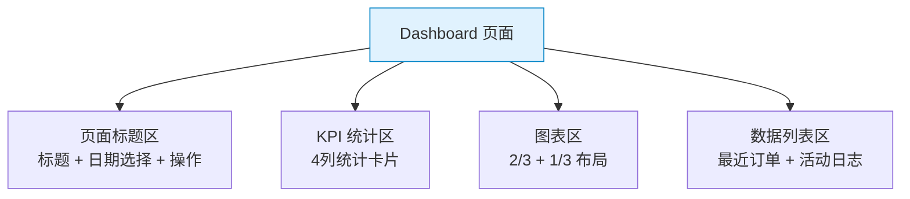

# TailwindCSS 实战组件：仪表盘布局 — 完整 Dashboard 页面

> **TL;DR**
> Dashboard 是 Admin 系统的门面。本文用 Tailwind 构建一个完整的仪表盘页面，包含统计卡片区、图表区、最近活动、快捷操作等模块，全部响应式 + 暗色模式适配。

---

## 📊 1. Dashboard 布局架构



---

## 💻 2. 完整 Dashboard 页面

```html
<div class="flex-1 space-y-6 p-4 sm:p-6 lg:p-8">
  
  <!-- 页面标题区 -->
  <div class="flex flex-col gap-4 sm:flex-row sm:items-center sm:justify-between">
    <div>
      <h1 class="text-2xl font-bold tracking-tight sm:text-3xl">仪表盘</h1>
      <p class="mt-1 text-sm text-muted-foreground">欢迎回来，张三。以下是今日概览。</p>
    </div>
    <div class="flex items-center gap-2">
      <button class="inline-flex h-9 items-center gap-2 rounded-md border px-3 text-sm font-medium hover:bg-accent">
        <svg class="size-4" fill="none" stroke="currentColor" viewBox="0 0 24 24">
          <path stroke-linecap="round" stroke-linejoin="round" stroke-width="2" d="M8 7V3m8 4V3m-9 8h10M5 21h14a2 2 0 002-2V7a2 2 0 00-2-2H5a2 2 0 00-2 2v12a2 2 0 002 2z"/>
        </svg>
        最近 30 天
        <svg class="size-4 text-muted-foreground" fill="none" stroke="currentColor" viewBox="0 0 24 24">
          <path stroke-linecap="round" stroke-linejoin="round" stroke-width="2" d="M19 9l-7 7-7-7"/>
        </svg>
      </button>
      <button class="inline-flex h-9 items-center gap-2 rounded-md bg-primary px-3 text-sm font-medium text-primary-foreground hover:bg-primary/90">
        <svg class="size-4" fill="none" stroke="currentColor" viewBox="0 0 24 24">
          <path stroke-linecap="round" stroke-linejoin="round" stroke-width="2" d="M4 16v1a3 3 0 003 3h10a3 3 0 003-3v-1m-4-4l-4 4m0 0l-4-4m4 4V4"/>
        </svg>
        下载报告
      </button>
    </div>
  </div>

  <!-- KPI 统计卡片 -->
  <div class="grid grid-cols-1 gap-4 sm:grid-cols-2 xl:grid-cols-4">
    <div class="rounded-lg border bg-card p-6">
      <div class="flex items-center justify-between">
        <p class="text-sm font-medium text-muted-foreground">总收入</p>
        <div class="rounded-md bg-green-100 p-1.5 dark:bg-green-500/10">
          <svg class="size-4 text-green-600 dark:text-green-400" fill="none" stroke="currentColor" viewBox="0 0 24 24">
            <path stroke-linecap="round" stroke-linejoin="round" stroke-width="2" d="M12 8c-1.657 0-3 .895-3 2s1.343 2 3 2 3 .895 3 2-1.343 2-3 2m0-8c1.11 0 2.08.402 2.599 1M12 8V7m0 1v8m0 0v1"/>
          </svg>
        </div>
      </div>
      <p class="mt-3 text-2xl font-bold tabular-nums">¥45,231</p>
      <div class="mt-1 flex items-center gap-1 text-xs">
        <span class="text-green-600 dark:text-green-400">↑ 20.1%</span>
        <span class="text-muted-foreground">vs 上月</span>
      </div>
    </div>
    
    <div class="rounded-lg border bg-card p-6">
      <div class="flex items-center justify-between">
        <p class="text-sm font-medium text-muted-foreground">新增用户</p>
        <div class="rounded-md bg-blue-100 p-1.5 dark:bg-blue-500/10">
          <svg class="size-4 text-blue-600 dark:text-blue-400" fill="none" stroke="currentColor" viewBox="0 0 24 24">
            <path stroke-linecap="round" stroke-linejoin="round" stroke-width="2" d="M17 20h5v-2a3 3 0 00-5.356-1.857M17 20H7m10 0v-2c0-.656-.126-1.283-.356-1.857M7 20H2v-2a3 3 0 015.356-1.857M7 20v-2c0-.656.126-1.283.356-1.857m0 0a5.002 5.002 0 019.288 0M15 7a3 3 0 11-6 0 3 3 0 016 0z"/>
          </svg>
        </div>
      </div>
      <p class="mt-3 text-2xl font-bold tabular-nums">+2,350</p>
      <div class="mt-1 flex items-center gap-1 text-xs">
        <span class="text-green-600 dark:text-green-400">↑ 12.5%</span>
        <span class="text-muted-foreground">vs 上月</span>
      </div>
    </div>
    
    <div class="rounded-lg border bg-card p-6">
      <div class="flex items-center justify-between">
        <p class="text-sm font-medium text-muted-foreground">订单数</p>
        <div class="rounded-md bg-purple-100 p-1.5 dark:bg-purple-500/10">
          <svg class="size-4 text-purple-600 dark:text-purple-400" fill="none" stroke="currentColor" viewBox="0 0 24 24">
            <path stroke-linecap="round" stroke-linejoin="round" stroke-width="2" d="M16 11V7a4 4 0 00-8 0v4M5 9h14l1 12H4L5 9z"/>
          </svg>
        </div>
      </div>
      <p class="mt-3 text-2xl font-bold tabular-nums">12,234</p>
      <div class="mt-1 flex items-center gap-1 text-xs">
        <span class="text-green-600 dark:text-green-400">↑ 8.3%</span>
        <span class="text-muted-foreground">vs 上月</span>
      </div>
    </div>
    
    <div class="rounded-lg border bg-card p-6">
      <div class="flex items-center justify-between">
        <p class="text-sm font-medium text-muted-foreground">活跃率</p>
        <div class="rounded-md bg-amber-100 p-1.5 dark:bg-amber-500/10">
          <svg class="size-4 text-amber-600 dark:text-amber-400" fill="none" stroke="currentColor" viewBox="0 0 24 24">
            <path stroke-linecap="round" stroke-linejoin="round" stroke-width="2" d="M13 7h8m0 0v8m0-8l-8 8-4-4-6 6"/>
          </svg>
        </div>
      </div>
      <p class="mt-3 text-2xl font-bold tabular-nums">78.3%</p>
      <div class="mt-2 h-2 w-full overflow-hidden rounded-full bg-muted">
        <div class="h-full w-[78.3%] rounded-full bg-amber-500 transition-all duration-500"></div>
      </div>
    </div>
  </div>

  <!-- 图表区（2/3 + 1/3 布局） -->
  <div class="grid grid-cols-1 gap-4 xl:grid-cols-3">
    <!-- 主图表 -->
    <div class="rounded-lg border bg-card p-6 xl:col-span-2">
      <div class="flex items-center justify-between">
        <h3 class="font-semibold">收入趋势</h3>
        <div class="flex gap-1 rounded-lg border p-0.5">
          <button class="rounded-md bg-accent px-3 py-1 text-xs font-medium">日</button>
          <button class="rounded-md px-3 py-1 text-xs font-medium text-muted-foreground hover:text-foreground">周</button>
          <button class="rounded-md px-3 py-1 text-xs font-medium text-muted-foreground hover:text-foreground">月</button>
        </div>
      </div>
      <!-- 图表占位 -->
      <div class="mt-4 flex h-64 items-end gap-2">
        <div class="flex-1 rounded-t bg-primary/20 hover:bg-primary/30 transition-colors" style="height: 40%"></div>
        <div class="flex-1 rounded-t bg-primary/20 hover:bg-primary/30 transition-colors" style="height: 65%"></div>
        <div class="flex-1 rounded-t bg-primary/20 hover:bg-primary/30 transition-colors" style="height: 50%"></div>
        <div class="flex-1 rounded-t bg-primary/20 hover:bg-primary/30 transition-colors" style="height: 80%"></div>
        <div class="flex-1 rounded-t bg-primary/20 hover:bg-primary/30 transition-colors" style="height: 70%"></div>
        <div class="flex-1 rounded-t bg-primary/20 hover:bg-primary/30 transition-colors" style="height: 90%"></div>
        <div class="flex-1 rounded-t bg-primary hover:bg-primary/90 transition-colors" style="height: 100%"></div>
      </div>
      <div class="mt-2 flex justify-between text-xs text-muted-foreground">
        <span>周一</span><span>周二</span><span>周三</span><span>周四</span><span>周五</span><span>周六</span><span>周日</span>
      </div>
    </div>
    
    <!-- 侧边统计 -->
    <div class="rounded-lg border bg-card p-6">
      <h3 class="font-semibold">流量来源</h3>
      <div class="mt-6 space-y-4">
        <div>
          <div class="flex justify-between text-sm">
            <span>搜索引擎</span>
            <span class="font-medium tabular-nums">45%</span>
          </div>
          <div class="mt-2 h-2 overflow-hidden rounded-full bg-muted">
            <div class="h-full w-[45%] rounded-full bg-blue-500"></div>
          </div>
        </div>
        <div>
          <div class="flex justify-between text-sm">
            <span>社交媒体</span>
            <span class="font-medium tabular-nums">28%</span>
          </div>
          <div class="mt-2 h-2 overflow-hidden rounded-full bg-muted">
            <div class="h-full w-[28%] rounded-full bg-green-500"></div>
          </div>
        </div>
        <div>
          <div class="flex justify-between text-sm">
            <span>直接访问</span>
            <span class="font-medium tabular-nums">18%</span>
          </div>
          <div class="mt-2 h-2 overflow-hidden rounded-full bg-muted">
            <div class="h-full w-[18%] rounded-full bg-purple-500"></div>
          </div>
        </div>
        <div>
          <div class="flex justify-between text-sm">
            <span>其他</span>
            <span class="font-medium tabular-nums">9%</span>
          </div>
          <div class="mt-2 h-2 overflow-hidden rounded-full bg-muted">
            <div class="h-full w-[9%] rounded-full bg-amber-500"></div>
          </div>
        </div>
      </div>
    </div>
  </div>

  <!-- 底部列表区 -->
  <div class="grid grid-cols-1 gap-4 xl:grid-cols-2">
    <!-- 最近订单 -->
    <div class="rounded-lg border bg-card">
      <div class="flex items-center justify-between border-b px-6 py-4">
        <h3 class="font-semibold">最近订单</h3>
        <a href="#" class="text-sm text-primary hover:underline">查看全部</a>
      </div>
      <div class="divide-y">
        <div class="flex items-center justify-between px-6 py-3">
          <div class="flex items-center gap-3">
            <div class="size-8 rounded-full bg-blue-100 dark:bg-blue-500/10 flex items-center justify-center text-xs font-medium text-blue-600">
              王
            </div>
            <div>
              <p class="text-sm font-medium">王五</p>
              <p class="text-xs text-muted-foreground">订单 #20240115-001</p>
            </div>
          </div>
          <div class="text-right">
            <p class="text-sm font-medium tabular-nums">¥1,234.00</p>
            <span class="inline-flex items-center rounded-full bg-green-100 px-1.5 py-0.5 text-[10px] font-medium text-green-700 dark:bg-green-500/10 dark:text-green-400">已完成</span>
          </div>
        </div>
        <div class="flex items-center justify-between px-6 py-3">
          <div class="flex items-center gap-3">
            <div class="size-8 rounded-full bg-purple-100 dark:bg-purple-500/10 flex items-center justify-center text-xs font-medium text-purple-600">
              赵
            </div>
            <div>
              <p class="text-sm font-medium">赵六</p>
              <p class="text-xs text-muted-foreground">订单 #20240115-002</p>
            </div>
          </div>
          <div class="text-right">
            <p class="text-sm font-medium tabular-nums">¥567.00</p>
            <span class="inline-flex items-center rounded-full bg-amber-100 px-1.5 py-0.5 text-[10px] font-medium text-amber-700 dark:bg-amber-500/10 dark:text-amber-400">待发货</span>
          </div>
        </div>
        <div class="flex items-center justify-between px-6 py-3">
          <div class="flex items-center gap-3">
            <div class="size-8 rounded-full bg-green-100 dark:bg-green-500/10 flex items-center justify-center text-xs font-medium text-green-600">
              李
            </div>
            <div>
              <p class="text-sm font-medium">李七</p>
              <p class="text-xs text-muted-foreground">订单 #20240115-003</p>
            </div>
          </div>
          <div class="text-right">
            <p class="text-sm font-medium tabular-nums">¥2,890.00</p>
            <span class="inline-flex items-center rounded-full bg-blue-100 px-1.5 py-0.5 text-[10px] font-medium text-blue-700 dark:bg-blue-500/10 dark:text-blue-400">处理中</span>
          </div>
        </div>
      </div>
    </div>

    <!-- 活动日志 -->
    <div class="rounded-lg border bg-card">
      <div class="flex items-center justify-between border-b px-6 py-4">
        <h3 class="font-semibold">最近活动</h3>
        <a href="#" class="text-sm text-primary hover:underline">查看全部</a>
      </div>
      <div class="px-6 py-4">
        <ol class="relative border-l border-muted">
          <li class="mb-6 ml-4">
            <div class="absolute -left-1.5 mt-1.5 size-3 rounded-full border-2 border-background bg-primary"></div>
            <time class="text-xs text-muted-foreground">10 分钟前</time>
            <p class="mt-0.5 text-sm">
              <span class="font-medium">张三</span> 创建了新用户 <span class="font-medium">王五</span>
            </p>
          </li>
          <li class="mb-6 ml-4">
            <div class="absolute -left-1.5 mt-1.5 size-3 rounded-full border-2 border-background bg-green-500"></div>
            <time class="text-xs text-muted-foreground">30 分钟前</time>
            <p class="mt-0.5 text-sm">
              订单 <span class="font-medium font-mono">#20240115-001</span> 已完成发货
            </p>
          </li>
          <li class="ml-4">
            <div class="absolute -left-1.5 mt-1.5 size-3 rounded-full border-2 border-background bg-amber-500"></div>
            <time class="text-xs text-muted-foreground">1 小时前</time>
            <p class="mt-0.5 text-sm">
              系统完成每日数据备份
            </p>
          </li>
        </ol>
      </div>
    </div>
  </div>

</div>
```

---

## 🧠 3. 向 AI 提问的 Prompt 模板

```
请用 TailwindCSS 构建一个完整的 Admin Dashboard 页面，包含：
1. 页面标题区（标题 + 日期范围选择 + 导出按钮）
2. 4 个 KPI 统计卡片（带趋势指标和进度条）
3. 图表区域（2/3 柱状图 + 1/3 饼图/进度列表）
4. 最近订单列表 + 活动时间线
5. 所有模块响应式（手机单列 → 平板两列 → 桌面多列）
6. 完整暗色模式适配

输出纯 HTML + Tailwind class，不使用 JS 框架。
```

---

*👉 下一步预告：[../04-踩坑大全.md](../04-踩坑大全.md) — TailwindCSS 常见坑与解决方案汇总*
