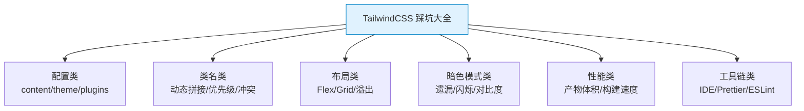
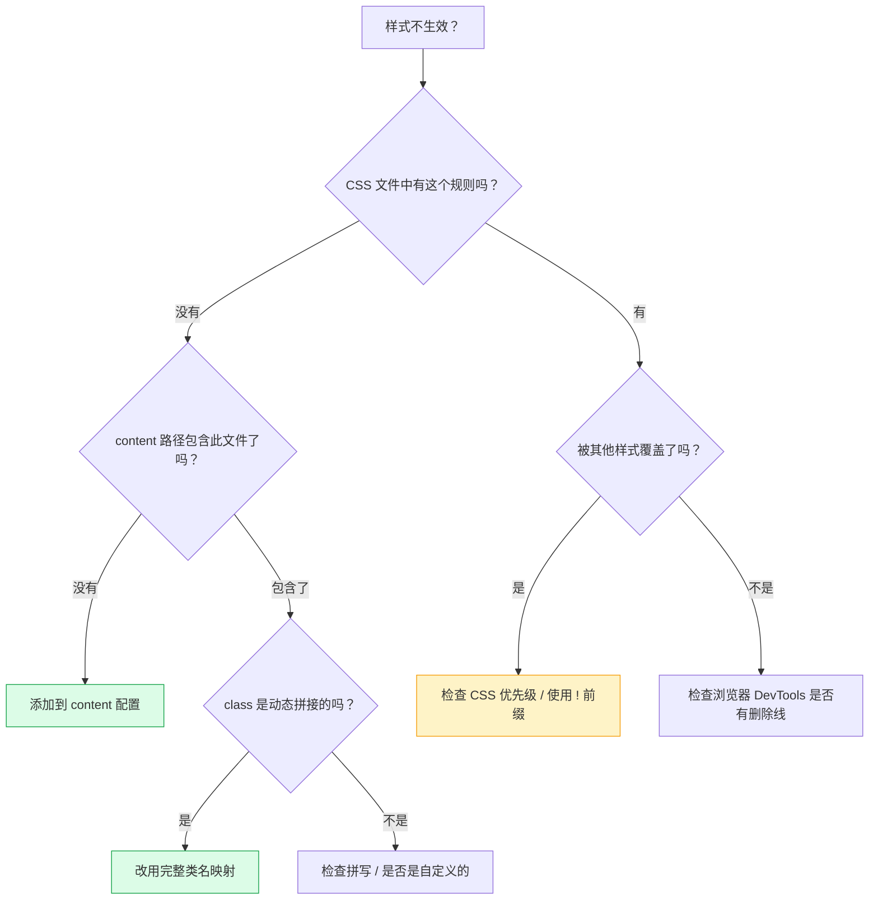

# TailwindCSS 踩坑大全：20+ 常见问题与解决方案

> **TL;DR**
> 本文汇总了 TailwindCSS 开发中最常见的 20+ 个坑，按"配置类"、"类名类"、"布局类"、"暗色模式类"、"性能类"分组，每个坑都附带原因分析、Bad/Good Case 对比和最佳实践。

---

## 📊 踩坑分类



---

## 🔧 一、配置类

### 坑 1: content 路径遗漏导致样式不生效

**现象**：写了 class 但样式不生效，检查发现 CSS 文件中根本没有对应规则。

```javascript
// ❌ Bad — 忘记包含某些文件路径
module.exports = {
  content: ['./src/**/*.tsx'], // 只扫描了 tsx
};
// 结果：.html/.mdx/.js 文件中的 class 全部失效

// ✅ Good — 覆盖所有模板文件
module.exports = {
  content: [
    './src/**/*.{js,ts,jsx,tsx,mdx}',
    './index.html',
    './node_modules/@your-ui-lib/**/*.js', // 第三方库
  ],
};
```

### 坑 2: theme 覆盖 vs extend 混淆

**现象**：只添加了一个自定义颜色，结果 `text-gray-500` 等默认颜色全部失效。

```javascript
// ❌ Bad — theme.colors 直接覆盖
module.exports = {
  theme: {
    colors: { brand: '#0ea5e9' }, // 默认颜色全没了！
  },
};

// ✅ Good — 使用 theme.extend.colors
module.exports = {
  theme: {
    extend: {
      colors: { brand: '#0ea5e9' }, // 默认颜色保留 + 新增 brand
    },
  },
};
```

### 坑 3: PostCSS 配置文件缺失或冲突

**现象**：Tailwind 完全不生效，没有任何样式。

```javascript
// ✅ 确保 postcss.config.js 存在且正确
module.exports = {
  plugins: {
    tailwindcss: {},
    autoprefixer: {},
  },
};
// ⚠️ 注意：某些框架（Next.js）自动配置了 PostCSS，可能与手动配置冲突
```

### 坑 4: @import 顺序错误

```css
/* ❌ Bad — @import 必须在文件最顶部 */
body { margin: 0; }
@import "tailwindcss/base";

/* ✅ Good */
@tailwind base;
@tailwind components;
@tailwind utilities;

/* 或 Tailwind v4+ */
@import "tailwindcss";
```

---

## 🏷️ 二、类名类

### 坑 5: 动态拼接类名导致 Tree-Shaking 失效（最高频！）

**现象**：动态生成的颜色/尺寸 class 不生效。

```tsx
// ❌ Bad — Tailwind 扫描器看不到完整 class 名
const color = 'blue';
<div className={`bg-${color}-500`} />       // 不生效！
<div className={`text-${props.size}`} />     // 不生效！
<div className={`w-${width}`} />             // 不生效！

// ✅ Good — 使用完整类名映射
const bgColorMap: Record<string, string> = {
  blue: 'bg-blue-500',
  red: 'bg-red-500',
  green: 'bg-green-500',
};
<div className={bgColorMap[color]} />

// ✅ 或使用 safelist（不推荐大量使用）
// tailwind.config.js
module.exports = {
  safelist: [
    { pattern: /bg-(red|blue|green)-(400|500|600)/ },
  ],
};
```

### 坑 6: CSS 优先级冲突

**现象**：`className="p-4 p-8"` 实际效果不确定。

```html
<!-- ❌ Bad — 重复的 utility，最终效果取决于 CSS 文件中的顺序 -->
<div class="p-4 p-8">可能是 p-4 也可能是 p-8</div>

<!-- ✅ Good — 使用 tailwind-merge 解决冲突 -->
```

```tsx
import { twMerge } from 'tailwind-merge';

twMerge('p-4 p-8');          // → "p-8"
twMerge('text-red-500 text-blue-500'); // → "text-blue-500"

// 封装 cn() 工具函数
import { clsx, type ClassValue } from 'clsx';
import { twMerge } from 'tailwind-merge';

function cn(...inputs: ClassValue[]) {
  return twMerge(clsx(inputs));
}

// 使用
<div className={cn(
  'rounded-lg p-4',
  isActive && 'bg-blue-500 text-white',
  className, // 外部传入的 class 可以覆盖
)} />
```

### 坑 7: 自定义 CSS 与 Tailwind 冲突

```css
/* ❌ Bad — 自定义样式优先级可能高于 Tailwind utility */
.my-card {
  padding: 20px; /* 这会覆盖 Tailwind 的 p-* */
}

/* ✅ Good — 使用 @layer 确保正确的优先级 */
@layer components {
  .my-card {
    @apply rounded-lg border p-5;
  }
}
/* 这样 utility class 仍然可以覆盖 .my-card 的样式 */
```

### 坑 8: important 前缀的使用

```javascript
// 当 Tailwind 样式被第三方库覆盖时
module.exports = {
  // 为所有 utility 添加 !important（谨慎使用）
  important: true,
  
  // 或使用选择器策略（推荐）
  important: '#app',
  // 生成的 CSS: #app .flex { display: flex; }
};

// 单个 class 添加 !important
<div class="!p-4">强制 p-4</div>
```

---

## 📐 三、布局类

### 坑 9: flex-1 子项内容溢出

```html
<!-- ❌ Bad — 长内容撑破 flex-1 -->
<div class="flex">
  <aside class="w-64 shrink-0">侧栏</aside>
  <main class="flex-1">
    <p>超长文本超长文本超长文本超长文本超长文本...</p>
  </main>
</div>

<!-- ✅ Good — 添加 min-w-0 -->
<div class="flex">
  <aside class="w-64 shrink-0">侧栏</aside>
  <main class="flex-1 min-w-0">
    <p class="truncate">超长文本自动截断...</p>
  </main>
</div>
```

**原因**：Flex 子项的默认 `min-width: auto` 会阻止收缩到内容宽度以下。`min-w-0` 重置为 0，允许正常收缩。

### 坑 10: h-full 不生效

```html
<!-- ❌ Bad — 父元素没有明确高度 -->
<div>
  <div class="h-full bg-blue-500">不会撑满</div>
</div>

<!-- ✅ Good — 祖先链必须都有高度 -->
<div class="h-screen">
  <div class="h-full bg-blue-500">现在撑满了</div>
</div>
```

### 坑 11: 移动端 100vh 溢出

```html
<!-- ❌ Bad — 移动端浏览器地址栏占据额外空间 -->
<div class="h-screen">超出可视区域</div>

<!-- ✅ Good — 使用动态视口单位 -->
<div class="h-dvh">动态适应地址栏</div>
```

### 坑 12: Grid 子项超出列宽

```html
<!-- ❌ Bad — 长单词/URL 撑破 Grid -->
<div class="grid grid-cols-3">
  <div>https://very-long-url-that-breaks-the-grid-layout.example.com</div>
</div>

<!-- ✅ Good -->
<div class="grid grid-cols-3">
  <div class="min-w-0 break-all">长内容被正确处理</div>
</div>
```

### 坑 13: space-* 与 hidden 元素的冲突

```html
<!-- ❌ Bad — hidden 元素仍占 space 间距 -->
<div class="space-y-4">
  <div>可见</div>
  <div class="hidden">隐藏但间距仍在</div>
  <div>可见（间距异常）</div>
</div>

<!-- ✅ Good — 用 gap 替代 -->
<div class="flex flex-col gap-4">
  <div>可见</div>
  <div class="hidden">隐藏</div>
  <div>可见（间距正常）</div>
</div>
```

---

## 🌓 四、暗色模式类

### 坑 14: FOUC — 暗色模式闪烁

**现象**：页面加载时先显示亮色，然后闪一下变成暗色。

```html
<!-- ✅ Good — 在 <head> 中同步执行主题检测脚本 -->
<head>
  <script>
    (function() {
      const theme = localStorage.getItem('theme');
      if (theme === 'dark' || (!theme && window.matchMedia('(prefers-color-scheme: dark)').matches)) {
        document.documentElement.classList.add('dark');
      }
    })();
  </script>
</head>
```

### 坑 15: 暗色模式 hover 遗漏

```html
<!-- ❌ Bad — hover 没有 dark: 适配 -->
<button class="bg-white hover:bg-gray-100 dark:bg-gray-800">
  暗色下 hover 变成浅灰，很突兀
</button>

<!-- ✅ Good — hover 也加 dark: -->
<button class="bg-white hover:bg-gray-100 
               dark:bg-gray-800 dark:hover:bg-gray-700">
  暗色下正常
</button>
```

### 坑 16: 暗色模式颜色对比度不足

```html
<!-- ❌ Bad — 暗色背景 + 深色文字 -->
<div class="dark:bg-gray-900 dark:text-gray-600">看不清</div>

<!-- ✅ Good — 确保 WCAG AA 标准 (4.5:1) -->
<div class="dark:bg-gray-900 dark:text-gray-300">对比度足够</div>
```

---

## ⚡ 五、性能类

### 坑 17: 产物 CSS 异常大

**排查清单**：
1. 检查 `content` 是否扫描了 `node_modules`（不该全部扫描）
2. 检查是否大量使用 `safelist`
3. 检查是否在 JS 中动态生成大量 class
4. 使用 `npx tailwindcss --help` 查看产物统计

### 坑 18: 开发模式 HMR 很慢

```javascript
// ✅ content 路径尽量精确，避免扫描无关文件
module.exports = {
  content: [
    './src/components/**/*.tsx',  // 精确到文件夹
    './src/pages/**/*.tsx',
    // ❌ 避免：'./src/**/*'（扫描所有文件包括图片/数据）
  ],
};
```

---

## 🔨 六、工具链类

### 坑 19: IDE 没有自动补全

```
✅ 安装 VS Code 扩展：Tailwind CSS IntelliSense
✅ 确保项目根目录有 tailwind.config.js
✅ 确保 PostCSS 配置正确
```

### 坑 20: Prettier 不排序 class

```bash
# 安装 Tailwind 官方 Prettier 插件
npm install -D prettier-plugin-tailwindcss
```

```json
// .prettierrc
{
  "plugins": ["prettier-plugin-tailwindcss"],
  "tailwindConfig": "./tailwind.config.js"
}
```

### 坑 21: ESLint 报 class 字符串太长

```json
// .eslintrc — 关闭行长度限制或调整
{
  "rules": {
    "max-len": "off"
  }
}
```

---

## 🎯 快速排查流程图



---

## 🧠 向 AI 提问的 Prompt 模板

```
我在 TailwindCSS 项目中遇到了以下问题：[描述问题]

请帮我排查：
1. 可能的原因有哪些？
2. 如何确认是哪个原因？
3. 对应的解决方案是什么？
4. 如何避免类似问题再次发生？

我的环境：Tailwind v3.4 / React 18 / Vite 5 / TypeScript
```

---

*👉 下一步预告：[05-团队规范.md](./05-团队规范.md) — TailwindCSS 团队协作规范与最佳实践*
