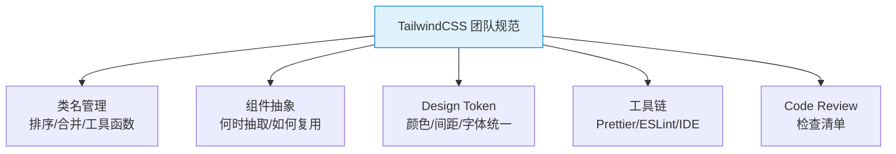
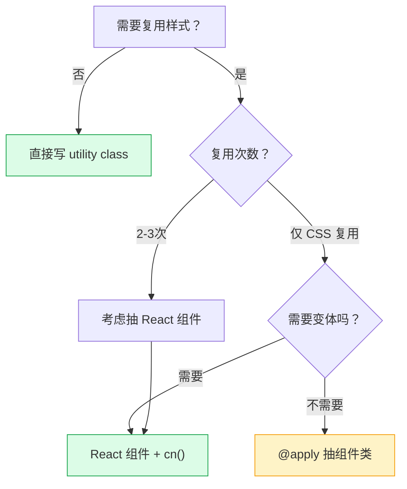

# TailwindCSS 团队规范：协作最佳实践

> **TL;DR**
> 团队使用 Tailwind 需要统一规范：类名排序（prettier-plugin-tailwindcss）、组件抽象策略（何时用 @apply / 何时抽组件）、cn() 工具函数标准、Design Token 管理、Code Review 检查清单。本文提供可直接落地的团队规范模板。

---

## 📊 1. 团队规范全景



---

## 🔤 2. 类名排序规范

### 安装 Prettier 插件

```bash
npm install -D prettier prettier-plugin-tailwindcss
```

```json
// .prettierrc
{
  "semi": true,
  "singleQuote": true,
  "plugins": ["prettier-plugin-tailwindcss"],
  "tailwindConfig": "./tailwind.config.js"
}
```

### 排序规则

Prettier 插件按照 Tailwind 官方推荐的顺序排列：

```
布局 → 定位 → 盒模型 → 排版 → 视觉 → 交互 → 响应式 → 暗色模式
```

```html
<!-- Before（无序） -->
<div class="text-white hover:bg-blue-700 flex bg-blue-500 p-4 rounded-lg items-center">

<!-- After（自动排序） -->
<div class="flex items-center rounded-lg bg-blue-500 p-4 text-white hover:bg-blue-700">
```

---

## 🛠️ 3. cn() 工具函数标准

### 标准实现

```typescript
// src/lib/utils.ts
import { clsx, type ClassValue } from 'clsx';
import { twMerge } from 'tailwind-merge';

export function cn(...inputs: ClassValue[]) {
  return twMerge(clsx(inputs));
}
```

### 安装依赖

```bash
npm install clsx tailwind-merge
```

### 使用场景

```tsx
import { cn } from '@/lib/utils';

interface ButtonProps {
  variant?: 'default' | 'destructive' | 'outline';
  size?: 'sm' | 'md' | 'lg';
  className?: string;
  children: React.ReactNode;
}

const variantStyles = {
  default: 'bg-primary text-primary-foreground hover:bg-primary/90',
  destructive: 'bg-destructive text-destructive-foreground hover:bg-destructive/90',
  outline: 'border border-input bg-background hover:bg-accent hover:text-accent-foreground',
} as const;

const sizeStyles = {
  sm: 'h-8 px-3 text-xs',
  md: 'h-10 px-4 text-sm',
  lg: 'h-12 px-6 text-base',
} as const;

function Button({ variant = 'default', size = 'md', className, children }: ButtonProps) {
  return (
    <button
      className={cn(
        'inline-flex items-center justify-center rounded-md font-medium transition-colors',
        'focus-visible:outline-none focus-visible:ring-2 focus-visible:ring-ring',
        'disabled:pointer-events-none disabled:opacity-50',
        variantStyles[variant],
        sizeStyles[size],
        className, // 外部传入的 class 最后，可覆盖
      )}
    >
      {children}
    </button>
  );
}
```

---

## 🧩 4. 组件抽象策略

### 决策树



### 规则

| 场景 | 方案 | 示例 |
|------|------|------|
| 一次性样式 | 直接写 utility | `<div class="flex p-4">` |
| 全局基础样式 | @layer base | `h1 { @apply text-3xl font-bold }` |
| 复用组件（有变体） | React 组件 + cn() | Button / Badge / Card |
| 简单样式复用（无逻辑） | @apply 组件类 | `.prose-link { @apply text-blue-600 underline }` |

### @apply 的使用底线

```css
/* ✅ 可以用 @apply 的场景 */
@layer base {
  /* 全局重置/标准化 */
  h1 { @apply text-3xl font-bold tracking-tight; }
  h2 { @apply text-2xl font-semibold; }
}

@layer components {
  /* 第三方库样式覆盖 */
  .prose a { @apply text-primary underline decoration-primary/30; }
}

/* ❌ 不应该用 @apply 的场景 */
.card { @apply flex flex-col rounded-lg border p-6 shadow-sm; }
.card-title { @apply text-lg font-semibold; }
/* 这本质上回到了传统 CSS 的命名地狱 → 应该抽 React 组件 */
```

---

## 🎨 5. Design Token 管理

### 颜色命名规范

```
✅ 语义化命名：bg-primary / text-muted-foreground / border-destructive
❌ 直接使用色值：bg-blue-500 / text-gray-600（在组件库中应避免）
```

### Token 层级

```
品牌 Token（固定）
├── brand-blue: #0ea5e9
├── brand-purple: #8b5cf6
└── ...

语义 Token（跟随主题）
├── primary: hsl(var(--primary))
├── background: hsl(var(--background))
├── foreground: hsl(var(--foreground))
├── muted: hsl(var(--muted))
└── destructive: hsl(var(--destructive))

组件 Token（可选）
├── sidebar-bg: hsl(var(--sidebar))
├── header-height: 4rem
└── ...
```

---

## 📋 6. Code Review 检查清单

### 必查项

- [ ] **动态类名**：是否存在字符串拼接类名？（`bg-${color}-500` → 使用映射表）
- [ ] **暗色模式**：新增的颜色相关 class 是否都有 `dark:` 变体？
- [ ] **响应式**：是否从移动端开始设计？（Mobile-First）
- [ ] **类名冲突**：是否使用 `cn()` 合并可能冲突的 class？
- [ ] **无障碍**：focus-visible 样式是否完整？
- [ ] **组件边界**：外部传入的 `className` 是否在最后（允许覆盖）？

### 建议项

- [ ] 使用语义化颜色（`bg-primary`）而非直接色值（`bg-blue-500`）
- [ ] 间距遵循 4px 基准网格（避免 `p-5` / `mt-7` 等非标准值）
- [ ] 排版层级一致（H1-H4 / body / caption 有统一标准）
- [ ] 过渡动画时长统一（150ms 微交互 / 200ms 标准 / 300ms 展开）

---

## ⚙️ 7. 工具链配置

### VS Code 扩展

```json
// .vscode/extensions.json — 团队推荐扩展
{
  "recommendations": [
    "bradlc.vscode-tailwindcss",        // Tailwind CSS IntelliSense
    "esbenp.prettier-vscode"             // Prettier
  ]
}
```

### VS Code 设置

```json
// .vscode/settings.json
{
  "editor.quickSuggestions": {
    "strings": "on"
  },
  "tailwindCSS.classAttributes": [
    "class",
    "className",
    "ngClass",
    ".*Styles.*",
    ".*Classes.*"
  ],
  "editor.defaultFormatter": "esbenp.prettier-vscode",
  "editor.formatOnSave": true,
  "files.associations": {
    "*.css": "tailwindcss"
  }
}
```

### ESLint 配置

```bash
npm install -D eslint-plugin-tailwindcss
```

```json
{
  "plugins": ["tailwindcss"],
  "rules": {
    "tailwindcss/classnames-order": "warn",
    "tailwindcss/no-contradicting-classname": "error",
    "tailwindcss/no-custom-classname": "warn"
  }
}
```

---

## 📁 8. 项目结构建议

```
src/
├── lib/
│   └── utils.ts              # cn() 工具函数
├── styles/
│   └── globals.css            # @tailwind + CSS 变量 + @layer base
├── components/
│   └── ui/                    # 基础 UI 组件（shadcn/ui 风格）
│       ├── button.tsx
│       ├── card.tsx
│       ├── dialog.tsx
│       └── ...
├── tailwind.config.js         # Tailwind 配置
├── postcss.config.js          # PostCSS 配置
├── .prettierrc                # Prettier + tailwind 排序
└── .vscode/
    ├── settings.json          # IDE 设置
    └── extensions.json        # 推荐扩展
```

---

## 🧠 9. 向 AI 提问的 Prompt 模板

```
我们团队要引入 TailwindCSS 到中后台项目中。请帮我制定：
1. 完整的 Design Token 规范（颜色/间距/字体/断点）
2. cn() 工具函数及其在组件中的标准用法
3. 类名排序的 Prettier 配置
4. Code Review 检查清单（Markdown 格式）
5. 团队 onboarding 的 Tailwind 速成指南（30分钟）

输出为可直接放入团队 Wiki 的完整文档。
```

---

*👉 下一步预告：[06-性能优化.md](./06-性能优化.md) — TailwindCSS 产物优化与构建性能调优*
