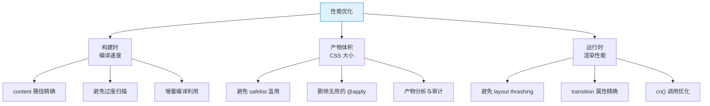

# TailwindCSS 性能优化：产物分析 / 构建调优 / 运行时性能

> **TL;DR**
> Tailwind 的 JIT 引擎已经让产物极小，但在大型项目中仍有优化空间：精确 content 路径、避免 safelist 滥用、利用 CSS 层叠优化渲染、以及 cn() 运行时合并的性能考量。本文从构建时、产物体积、运行时三个维度给出完整优化方案。

---

## 📊 1. 性能优化维度



---

## ⚡ 2. 构建时优化

### 精确 content 路径

```javascript
// ❌ Bad — 扫描范围过大
module.exports = {
  content: ['./src/**/*'], // 扫描了图片、JSON、SVG 等无关文件
};

// ✅ Good — 精确到文件类型
module.exports = {
  content: [
    './src/components/**/*.{tsx,jsx}',
    './src/pages/**/*.{tsx,jsx}',
    './src/layouts/**/*.{tsx,jsx}',
    './src/app/**/*.{tsx,jsx}',
    './index.html',
  ],
};
```

### 排除不需要扫描的目录

```javascript
module.exports = {
  content: [
    './src/**/*.{tsx,jsx}',
    // 排除测试文件（它们通常不包含需要生成的 class）
    '!./src/**/*.test.{tsx,jsx}',
    '!./src/**/*.spec.{tsx,jsx}',
    '!./src/**/__tests__/**',
  ],
};
```

---

## 📦 3. 产物体积优化

### 产物分析

```bash
# 查看生成的 CSS 统计
npx tailwindcss -i ./src/globals.css -o ./dist/output.css --minify

# 分析体积
wc -l dist/output.css             # 行数
ls -lh dist/output.css            # 原始大小
gzip -c dist/output.css | wc -c   # gzip 字节数
brotli -c dist/output.css | wc -c # brotli 字节数
```

### 典型体积参考

| 项目规模 | 使用的 utility 数 | CSS 原始 | gzip | brotli |
|----------|------------------|----------|------|--------|
| 小型（5页面） | ~200 | ~20KB | ~5KB | ~4KB |
| 中型（20页面） | ~500 | ~40KB | ~8KB | ~6KB |
| 大型（100+页面） | ~1000 | ~80KB | ~15KB | ~11KB |
| 大型 + safelist | ~3000 | ~200KB | ~30KB | ~22KB |

### 减少不必要的 CSS

```javascript
// 1. 禁用不使用的核心插件
module.exports = {
  corePlugins: {
    // 如果不使用浮动布局
    float: false,
    // 如果不使用对象适配
    objectFit: false,
    objectPosition: false,
  },
};

// 2. 避免 safelist 滥用
module.exports = {
  safelist: [
    // ❌ Bad — 生成大量无用 class
    { pattern: /bg-.*/ },         // 所有背景色！
    
    // ✅ Good — 精确匹配需要的
    'bg-red-500',
    'bg-green-500',
    { pattern: /bg-(red|green|blue)-(500|600)/, variants: ['hover'] },
  ],
};
```

### CSS 压缩

```javascript
// postcss.config.js — 生产环境压缩
module.exports = {
  plugins: {
    tailwindcss: {},
    autoprefixer: {},
    ...(process.env.NODE_ENV === 'production' ? { cssnano: {} } : {}),
  },
};
```

---

## 🏃 4. 运行时性能

### Transition 属性精确化

```html
<!-- ❌ Bad — transition-all 导致所有属性都参与动画计算 -->
<div class="transition-all duration-200 hover:shadow-md hover:bg-gray-50">
  浏览器要计算所有属性的过渡
</div>

<!-- ✅ Good — 只过渡需要的属性 -->
<div class="transition-[box-shadow,background-color] duration-200 hover:shadow-md hover:bg-gray-50">
  只计算 shadow 和 bg 的过渡
</div>

<!-- ✅ 或使用预定义的 transition 类型 -->
<div class="transition-shadow duration-200 hover:shadow-md">只过渡阴影</div>
<div class="transition-colors duration-200 hover:bg-gray-50">只过渡颜色</div>
```

### 避免 Layout Thrashing

```html
<!-- ❌ Bad — 动画改变 width/height/padding（触发 Layout 重排） -->
<div class="transition-all hover:p-8 hover:w-[300px]">
  每帧都触发 Layout 重排，很卡
</div>

<!-- ✅ Good — 使用 transform/opacity（只触发 Composite，GPU 加速） -->
<div class="transition-transform hover:scale-105">
  只触发 Composite，流畅 60fps
</div>
```

### 高性能 CSS 属性对照表

| 属性变化 | 触发阶段 | 性能 | Tailwind 用法 |
|----------|---------|------|--------------|
| transform | Composite | ⭐⭐⭐⭐⭐ | `hover:scale-*` / `hover:translate-*` |
| opacity | Composite | ⭐⭐⭐⭐⭐ | `hover:opacity-*` |
| box-shadow | Paint | ⭐⭐⭐ | `hover:shadow-*` |
| background-color | Paint | ⭐⭐⭐ | `hover:bg-*` |
| color | Paint | ⭐⭐⭐ | `hover:text-*` |
| width/height | Layout | ⭐ | `hover:w-*` / `hover:h-*`（避免动画） |
| padding/margin | Layout | ⭐ | `hover:p-*`（避免动画） |

### cn() 运行时优化

```tsx
// cn() 在每次渲染时都会执行 clsx + twMerge
// 对于高频渲染的组件（如表格单元格），可以缓存

// ❌ 不推荐 — 每次渲染都重新计算
function TableCell({ isActive, className }: Props) {
  return (
    <td className={cn(
      'px-4 py-2 text-sm',
      isActive && 'bg-blue-50 font-medium',
      className,
    )}>
      ...
    </td>
  );
}

// ✅ 推荐 — 对静态部分使用 useMemo
function TableCell({ isActive, className }: Props) {
  const cellClass = useMemo(
    () => cn(
      'px-4 py-2 text-sm',
      isActive && 'bg-blue-50 font-medium',
      className,
    ),
    [isActive, className],
  );
  
  return <td className={cellClass}>...</td>;
}
```

---

## 📏 5. 大型项目最佳实践

### CSS 分层策略

```css
/* globals.css — 清晰的层级划分 */

/* Layer 1: Tailwind 基础 */
@tailwind base;
@tailwind components;
@tailwind utilities;

/* Layer 2: 全局重置（最低优先级） */
@layer base {
  * { @apply border-border; }
  body { @apply bg-background text-foreground; }
}

/* Layer 3: 组件样式（中优先级） */
@layer components {
  /* 只放真正需要的全局组件样式 */
}

/* Layer 4: Utility 始终是最高优先级 */
/* @layer utilities 已由 Tailwind 管理 */
```

### 多主题方案

```css
/* 使用 CSS 变量实现多主题切换 */
:root { --primary: 222.2 47.4% 11.2%; }
.theme-blue { --primary: 217.2 91.2% 59.8%; }
.theme-green { --primary: 142.1 76.2% 36.3%; }
.theme-purple { --primary: 263.4 70% 50.4%; }
```

---

## 🧪 6. 性能审计脚本

```bash
#!/bin/bash
# tailwind-audit.sh — 快速审计 Tailwind 性能

echo "=== Tailwind 性能审计 ==="

# 1. 构建产物
npx tailwindcss -i ./src/globals.css -o /tmp/tw-audit.css --minify 2>&1

# 2. 体积统计
echo "原始大小: $(wc -c < /tmp/tw-audit.css) bytes"
echo "gzip 大小: $(gzip -c /tmp/tw-audit.css | wc -c) bytes"
echo "CSS 规则数: $(grep -c '{' /tmp/tw-audit.css)"

# 3. 检查 safelist 数量
SAFELIST=$(grep -c 'safelist' tailwind.config.* 2>/dev/null || echo "0")
echo "safelist 条目: $SAFELIST"

# 4. 检查 content 路径数量
echo "content 扫描路径:"
grep -A 10 'content' tailwind.config.* | grep "'.*'"

echo "=== 审计完成 ==="
```

---

## 🧠 7. 向 AI 提问的 Prompt 模板

```
我的 TailwindCSS 项目的 CSS 产物有 [X]KB（gzip），我觉得偏大。请帮我：
1. 分析可能的原因
2. 提供一个排查脚本，检查哪些 class 占体积最大
3. 给出针对性的优化方案
4. 评估优化后的预期体积

我的项目：Tailwind v3.4 / React 18 / Vite 5 / [X] 个页面
```

---

*👉 下一步预告：[07-面试题集.md](./07-面试题集.md) — TailwindCSS 高频面试题与深度解答*
