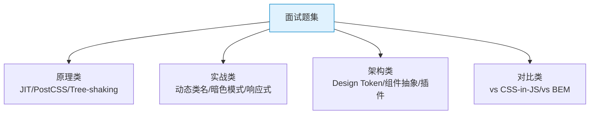

# TailwindCSS 面试题集：30+ 高频题与深度解答

> **TL;DR**
> 本文涵盖 TailwindCSS 面试中从基础到高级的 30+ 道题目，按"原理"、"实战"、"架构"、"对比"四个维度分组，每题包含简答版（30 秒）和深度版（2 分钟）。

---

## 📊 题目分类



---

## 🔬 一、原理类

### Q1: TailwindCSS 是什么？它的核心理念是什么？

**简答**：Tailwind 是一个 Utility-First 的 CSS 框架，通过预定义的原子 class（如 `flex`、`p-4`、`text-blue-500`）直接在 HTML 中组合样式，而非编写自定义 CSS。

**深度**：
- **Utility-First** 不等于 Inline Style。Utility class 支持伪类（`hover:`）、响应式（`md:`）、暗色模式（`dark:`），这些是 inline style 做不到的
- 核心优势在于 **约束性设计**（Design Token 体系）——你不能写 `p-4.5`（除非自定义），这强制团队使用一致的间距/颜色/字号
- 本质上是"CSS 原子化"的工程化实现

### Q2: TailwindCSS 的底层原理是什么？

**答**：Tailwind 是一个 **PostCSS 插件**。工作流程：
1. **内容扫描**：用正则（非 AST）扫描 `content` 中配置的源文件，提取所有可能的 class 名 token
2. **候选匹配**：将 token 与内置的 utility 注册表匹配
3. **CSS 生成**：只为匹配成功的 token 生成 CSS 规则
4. **层级注入**：按 `@layer base / components / utilities` 注入最终样式表
5. **后处理**：autoprefixer 添加前缀，cssnano 压缩

### Q3: 为什么 Tailwind 用正则扫描而不用 AST 解析？

**答**：
1. **通用性**：AST 解析需要为 HTML/JSX/Vue/Svelte/MDX 等每种模板编写解析器。正则对纯文本通用
2. **性能**：正则扫描比 AST 解析快 10-100 倍
3. **容错性**：最坏情况是多生成几条 CSS（false positive），不会丢失样式（false negative）
4. **简单可靠**：Tailwind class 名高度结构化，正则完全够用

### Q4: JIT 引擎 vs AOT 模式有什么区别？

| 维度 | AOT（v2 之前） | JIT（v3+） |
|------|---------------|-----------|
| 构建策略 | 先生成全量 CSS，再 PurgeCSS 删除 | 按需生成，只编译用到的 |
| 开发体积 | ~15MB（开发时） | 与生产一致 |
| 任意值支持 | 不支持 | 支持 `w-[137px]` |
| 增量编译 | 不支持 | 支持（毫秒级 HMR） |
| 首次编译 | 慢（生成全量） | 快（只生成用到的） |

### Q5: Tailwind 的 Tree-Shaking 机制是什么？

**答**：Tailwind 的 "Tree-Shaking" 不是传统 JS 的 tree-shaking。它是**源码驱动的按需生成**：
- JIT 引擎扫描源码，只生成出现在源码中的 class 对应的 CSS
- 未出现的 class 从未被生成，不存在"删除"
- 这就是为什么产物极小——100 页面的应用可能只有 ~15KB gzip

### Q6: `@layer` 在 Tailwind 中的作用是什么？

**答**：CSS `@layer` 控制样式的优先级层级，Tailwind 使用三层：
1. **`@layer base`**：全局重置和基础样式（最低优先级）
2. **`@layer components`**：组件级样式（中等优先级）
3. **`@layer utilities`**：Utility class（最高优先级）

确保 utility 始终能覆盖 component 样式，component 覆盖 base 样式。

---

## 💻 二、实战类

### Q7: 动态类名为什么不生效？如何解决？

**答**：Tailwind 用纯文本正则扫描，看不到 JS 变量的值。

```tsx
// ❌ 不生效
<div className={`bg-${color}-500`} />

// ✅ 解决方案
const map = { blue: 'bg-blue-500', red: 'bg-red-500' };
<div className={map[color]} />
```

### Q8: `cn()` / `clsx()` / `tailwind-merge` 各自的作用？

| 库 | 作用 | 示例 |
|----|------|------|
| `clsx` | 条件拼接 class 字符串 | `clsx('a', false && 'b', 'c')` → `"a c"` |
| `tailwind-merge` | 智能合并冲突的 Tailwind class | `twMerge('p-4 p-8')` → `"p-8"` |
| `cn()` | 两者结合 | `cn('p-4', isActive && 'p-8', className)` |

### Q9: 如何实现暗色模式？class 策略和 media 策略的区别？

| 维度 | class 策略 | media 策略 |
|------|-----------|-----------|
| 配置 | `darkMode: 'class'` | `darkMode: 'media'` |
| 触发 | 手动添加 `.dark` 到 `<html>` | 自动跟随系统偏好 |
| 持久化 | 可以 localStorage 持久化 | 无法手动切换 |
| 推荐度 | ⭐⭐⭐⭐⭐ | ⭐⭐⭐ |

### Q10: Tailwind 中如何处理响应式设计？

**答**：Mobile-First 策略，断点前缀代表 `min-width`：
- 无前缀 = 所有尺寸
- `sm:` = ≥640px
- `md:` = ≥768px
- `lg:` = ≥1024px

```html
<div class="text-sm md:text-base lg:text-lg">
  手机小字 → 平板标准 → 桌面大字
</div>
```

### Q11: `group` 和 `peer` 的区别和使用场景？

| 特性 | `group` | `peer` |
|------|---------|--------|
| 关系 | 父元素影响子元素 | 前兄弟影响后兄弟 |
| 选择器 | 父 `.group` → 子 `group-hover:` | 前 `.peer` → 后 `peer-checked:` |
| 限制 | 无限制 | peer 必须在目标**前面** |
| 典型场景 | 卡片 hover → 标题变色 | checkbox 选中 → 显示内容 |

### Q12: `focus:` 和 `focus-visible:` 的区别？

- `focus:` = 鼠标点击和键盘 Tab 都触发
- `focus-visible:` = 只有键盘 Tab 触发

**最佳实践**：按钮用 `focus-visible:`（鼠标点击不需要焦点环），输入框用 `focus:`。

### Q13: 如何处理表格在小屏幕上的响应式？

```html
<!-- 水平滚动方案 -->
<div class="overflow-x-auto">
  <table class="w-full min-w-[700px]">...</table>
</div>
```

### Q14: Tailwind 中如何实现渐变色文字？

```html
<h1 class="bg-gradient-to-r from-blue-600 to-purple-600 bg-clip-text text-transparent">
  渐变文字
</h1>
```

---

## 🏗️ 三、架构类

### Q15: 如何在大型项目中管理 Tailwind 的 Design Token？

**答**：使用 CSS 变量 + Tailwind 配置映射：
1. 在 `globals.css` 中用 CSS 变量定义 Token（支持亮暗主题切换）
2. 在 `tailwind.config.js` 中用 `hsl(var(--xxx))` 映射为语义化颜色
3. 在组件中使用 `bg-primary` 等语义 class

### Q16: 什么时候该用 @apply，什么时候该抽 React 组件？

- **@apply**：全局基础样式（h1-h6 重置）、第三方库样式覆盖
- **React 组件**：有变体的可复用 UI 元素（Button / Card / Badge）
- **直接写 utility**：一次性或少量复用的样式

### Q17: 如何开发 Tailwind 自定义插件？

```javascript
const plugin = require('tailwindcss/plugin');

module.exports = plugin(function({ addUtilities, addComponents, addVariant, matchUtilities, theme }) {
  addUtilities({/* 工具类 */});
  addComponents({/* 组件类 */});
  addVariant('hocus', ['&:hover', '&:focus']);
  matchUtilities({ tab: (val) => ({ tabSize: val }) }, { values: theme('tabSize') });
});
```

### Q18: Tailwind 的 Preset 机制是什么？

**答**：Preset 是可复用的配置包，用于团队间共享统一的 Design Token 和插件。在 `presets` 数组中引入，会与项目配置深度合并。

### Q19: 如何保证团队中 Tailwind 类名的一致性？

1. `prettier-plugin-tailwindcss` 自动排序
2. `eslint-plugin-tailwindcss` 检查冲突和自定义类名
3. `cn()` 工具函数标准化
4. Code Review 检查清单

---

## ⚔️ 四、对比类

### Q20: Tailwind vs CSS-in-JS (Emotion/styled-components)？

| 维度 | Tailwind | CSS-in-JS |
|------|----------|-----------|
| 运行时开销 | **零** | 有（样式序列化+注入） |
| 构建产物 | **~10KB gzip** | 基础库 ~11KB + 样式 |
| 动态样式 | 需要类名映射 | 原生支持 JS 表达式 |
| SSR | 无需额外配置 | 需要样式提取 |
| 学习曲线 | 中（需记忆 class 名） | 低（就是写 CSS） |
| 设计约束 | **强**（Token 体系） | 弱（可以写任意值） |
| IDE 支持 | 优秀（IntelliSense） | 一般 |

**推荐**：Admin 系统选 Tailwind（零运行时 + 强约束 + 团队一致性）。

### Q21: Tailwind vs CSS Modules？

| 维度 | Tailwind | CSS Modules |
|------|----------|-------------|
| 作用域 | 全局（但极少冲突） | 局部（hash） |
| 代码量 | 更少（utility 去重） | 更多（每组件一份 CSS） |
| 学习曲线 | 需学 utility 命名 | 就是写普通 CSS |
| 维护性 | 改 HTML 即可 | 需同时改 HTML + CSS |

### Q22: 为什么越来越多的团队选择 Tailwind？

1. **零运行时**：对比 CSS-in-JS 有巨大性能优势
2. **设计一致性**：Token 体系强制约束
3. **DX 优秀**：IDE 自动补全 + 不用命名 + 不用切文件
4. **生态繁荣**：shadcn/ui / Headless UI / Radix 都基于 Tailwind
5. **产物极小**：utility 天然去重

---

## 🧪 五、场景题

### Q23: 如何用 Tailwind 实现一个响应式的 Admin 侧边栏？

**关键 class**：
```
桌面端：w-64 / shrink-0 / border-r / hidden lg:flex lg:flex-col
移动端：fixed inset-y-0 left-0 z-50 / translate-x-0 / -translate-x-full
过渡：transition-transform duration-300
```

### Q24: 如何处理 Tailwind 中的 CSS 优先级问题？

1. 使用 `!` 前缀强制 important：`!p-4`
2. 使用 `cn()` + `tailwind-merge` 智能合并
3. 配置 `important: '#app'` 提升选择器权重
4. 使用 `@layer` 控制层级

### Q25: 如何在 Tailwind 项目中实现主题切换（多于 2 个主题）？

```css
:root { --primary: 222.2 47.4% 11.2%; }
.theme-ocean { --primary: 199 89% 48%; }
.theme-forest { --primary: 142 76% 36%; }
.theme-sunset { --primary: 24 95% 53%; }
```

```tsx
document.documentElement.className = `theme-${selectedTheme}`;
```

### Q26: Tailwind 对 SSR/SSG 有什么优势？

**答**：Tailwind 生成的是静态 CSS 文件，SSR 时：
- 不需要额外的样式提取步骤（CSS-in-JS 需要）
- 不存在 hydration 不匹配问题
- 首屏渲染更快（CSS 可以预加载）

---

## 🎯 六、手写题

### Q27: 手写 cn() 工具函数

```typescript
import { clsx, type ClassValue } from 'clsx';
import { twMerge } from 'tailwind-merge';

export function cn(...inputs: ClassValue[]) {
  return twMerge(clsx(inputs));
}
```

### Q28: 用 Tailwind 实现水平垂直居中的 5 种方式

```html
<!-- 1. Flex -->
<div class="flex items-center justify-center h-screen">居中</div>

<!-- 2. Grid -->
<div class="grid place-items-center h-screen">居中</div>

<!-- 3. Absolute + Transform -->
<div class="relative h-screen">
  <div class="absolute top-1/2 left-1/2 -translate-x-1/2 -translate-y-1/2">居中</div>
</div>

<!-- 4. Absolute + inset-0 + margin auto -->
<div class="relative h-screen">
  <div class="absolute inset-0 m-auto h-fit w-fit">居中</div>
</div>

<!-- 5. Grid + margin auto -->
<div class="grid h-screen">
  <div class="m-auto">居中</div>
</div>
```

### Q29: 用 Tailwind 实现一个 Loading Spinner

```html
<div class="flex items-center justify-center">
  <div class="size-8 animate-spin rounded-full border-4 border-muted border-t-primary"></div>
</div>
```

### Q30: 用 Tailwind 实现毛玻璃导航栏

```html
<header class="sticky top-0 z-50 w-full border-b bg-background/80 backdrop-blur-sm">
  <div class="flex h-14 items-center px-6">
    <span class="font-semibold">Logo</span>
  </div>
</header>
```

---

## 🧠 面试准备 Prompt 模板

```
我即将参加一个前端面试，面试官可能会问 TailwindCSS 相关问题。
请模拟面试官，按以下顺序提问：
1. 先问 2 个基础概念题（Utility-First / JIT 原理）
2. 再问 2 个实战题（动态类名 / 响应式方案）
3. 最后问 1 个架构设计题（Design Token 体系）

每次我回答后，请打分（1-10）并给出改进建议。
面试目标岗位：高级前端工程师（React + Admin 系统方向）
```

---

*🎓 至此，TailwindCSS 知识库全部完成！祝你学习/面试顺利！*
