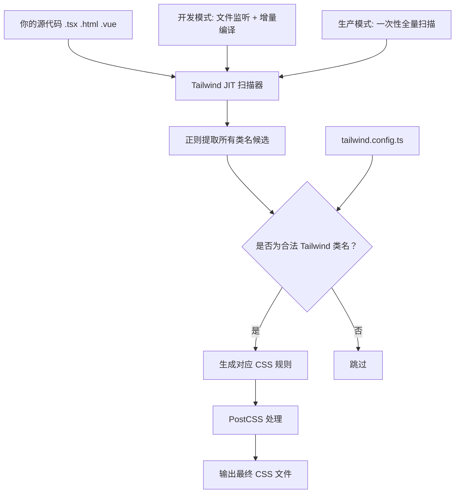
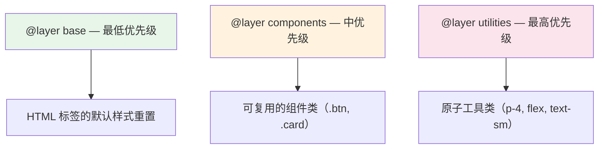

# Tailwind CSS 编译机制与设计哲学：原子化 CSS 的降维打击

> **TL;DR**
> Tailwind 不是"内联样式的语法糖"，而是一套利用**原子化 CSS 的幂律分布特性**实现极致产出体积、通过 **JIT 编译器按需生成**的设计系统框架。理解它的编译原理，你就能理解它为什么比手写 CSS 更小、更快、更好维护。

## 1. 为什么需要原子化 CSS？

### 传统 CSS 的数学困境

传统 CSS 的体积随项目增长**线性膨胀**——每个新组件、新页面都引入新的类名和样式规则。一个 200 页的中后台项目，CSS 文件可以轻松突破 500KB。

```
传统 CSS 体积 ≈ O(组件数 × 每组件样式行数)

200 个组件 × 平均 50 行 CSS = 10,000 行 CSS ≈ 200KB+
```

原子化 CSS 的体积增长是**对数级**的——因为同样的类名在不同组件中被复用：

```
原子化 CSS 体积 ≈ O(唯一样式组合数)

200 个组件用到的唯一原子类 ≈ 500 个 → 最终 CSS ≈ 15KB（gzip 后 ~4KB）
```

这不是魔法，而是**幂律分布**的数学特性：80% 的 UI 只用到 20% 的样式组合（`p-4`、`flex`、`text-sm`、`rounded-lg` 这些类名在无数组件中重复出现）。

### 生动比喻

- **传统 CSS（BEM）**像活字印刷术——每本书都要刻一套新的活字版。
- **原子化 CSS（Tailwind）**像键盘打字——26 个字母键反复组合，能打出无穷的文章。字母（原子类）是有限的，组合（UI 样式）是无限的。

## 2. JIT 编译器：按需生成的核心引擎

### 编译流程



### JIT 的核心工作原理

**第一步：扫描**。JIT 编译器扫描你配置的 `content` 路径下的所有文件（`.tsx`、`.html`、`.vue` 等），用一套高度优化的正则表达式提取所有**可能是 Tailwind 类名的字符串**。

```ts
// tailwind.config.ts
export default {
  content: [
    "./src/**/*.{ts,tsx}",  // 扫描所有 TSX 文件
    "./index.html",
  ],
  // ...
}
```

**第二步：匹配**。提取到的字符串和 Tailwind 的类名规则库做匹配。`p-4` 能匹配到 `padding: 1rem`，`hover:bg-blue-500` 能匹配到 `hover` 变体 + `background-color: #3b82f6`。

**第三步：生成**。只为匹配成功的类名生成 CSS 规则——没用到的类名不会出现在最终 CSS 中。

```css
/* 你的代码中写了 "p-4 text-sm hover:bg-blue-500" */
/* Tailwind 只生成这三条规则，其他 9000+ 类名全部不存在 */
.p-4 { padding: 1rem; }
.text-sm { font-size: 0.875rem; line-height: 1.25rem; }
.hover\:bg-blue-500:hover { background-color: #3b82f6; }
```

### 关键约束：类名必须完整可提取

```tsx
// Good: 完整的类名字符串，扫描器能提取
<div className="bg-red-500">错误提示</div>
<div className={isError ? "bg-red-500" : "bg-green-500"}>状态</div>

// Bad: 动态拼接类名，扫描器看不到完整字符串
<div className={`bg-${color}-500`}>动态颜色</div>
// 扫描器看到的是 "bg-${color}-500"，不是 "bg-red-500"！
// 结果：CSS 中没有 bg-red-500 这个规则，样式不生效

// 修复方案：用完整类名的映射
const colorMap = {
  red: "bg-red-500",
  green: "bg-green-500",
  blue: "bg-blue-500",
} as const;
<div className={colorMap[color]}>动态颜色</div>
```

## 3. Tailwind vs 其他 CSS 方案：本质对比

### 对比维度速查

| 维度 | 传统 CSS / BEM | CSS Modules | CSS-in-JS (styled-components) | Tailwind CSS |
|------|-------------|-------------|-------------------------------|-------------|
| **作用域** | 全局（靠命名约定） | 模块级（编译时哈希） | 组件级（运行时注入） | 全局（靠原子化复用） |
| **运行时开销** | 零 | 零 | 有（JS 解析 + 注入 style 标签） | 零 |
| **产出体积** | 随项目线性增长 | 随项目线性增长 | 随项目线性增长 | **对数增长**（原子复用） |
| **开发体验** | 要切换 CSS 文件 | 要切换 CSS 文件 | 在 JS 中写 CSS | **在 HTML 中写样式，零切换** |
| **死代码清除** | 困难 | 中等 | 困难 | **自动（JIT 只生成用到的）** |
| **设计系统约束** | 无，全靠人自觉 | 无 | 有（theme 对象） | **强约束（配置化间距/颜色/断点）** |

### 常见质疑与回应

**"在 HTML 里写样式不就是内联样式？"**

不是。内联样式无法使用伪类（`:hover`）、媒体查询（响应式）、伪元素（`::before`）。Tailwind 的 `hover:bg-blue-500 md:flex` 本质上生成的是 CSS 规则，拥有 CSS 的全部能力。而且内联样式无法被缓存和复用，Tailwind 的原子类在浏览器中只有一份。

**"类名太长了，HTML 可读性很差？"**

对于**组件化**的 React/Vue 项目，每个组件只有 10-50 行模板。在这个粒度下，类名就是样式的"内联文档"——你看到 `flex items-center gap-4 rounded-lg bg-card p-6` 就知道这是一个圆角卡片，用 Flex 居中排列子元素。不需要跳到另一个文件去查 `.card-container` 到底长什么样。

**"如果设计稿改了，我要改一堆 HTML？"**

这恰恰是 Tailwind 的优势。传统 CSS 改样式需要：找到 HTML 中的类名 → 跳到 CSS 文件 → 定位规则 → 修改 → 检查有没有影响其他地方。Tailwind 直接在 HTML 中改，所见即所得，零副作用。

## 4. CSS 层叠架构：@layer 的力量

Tailwind 利用 CSS 的 `@layer` 规则组织样式的优先级：



```css
/* 优先级顺序：utilities > components > base */

@layer base {
  /* 全局默认样式 */
  body { @apply bg-background text-foreground; }
  h1 { @apply text-3xl font-bold; }
}

@layer components {
  /* 复用组件类 */
  .btn-primary {
    @apply rounded-lg bg-primary px-4 py-2 text-primary-foreground hover:bg-primary/90;
  }
}

@layer utilities {
  /* 自定义工具类 */
  .text-balance { text-wrap: balance; }
}
```

**这意味着**：你在类名中写的 `p-4`（utilities 层）永远能覆盖 `.card` 中的 `padding`（components 层），不需要写 `!important`。

## 5. 产出体积实测

```bash
# 一个 200+ 页面的中后台项目（真实数据）

# 传统 CSS（BEM）方案：
CSS 文件: 487KB → gzip: 62KB

# Tailwind CSS 方案（同样的 UI）：
CSS 文件: 28KB → gzip: 6.8KB

# 体积减少 94%！
# 原因：200 个页面反复使用同一套原子类，大量"去重"
```

## 6. 避坑指南

### 坑一：content 路径配置遗漏

```ts
// Bad: 忘了扫描某个目录，导致该目录组件的样式全部丢失
export default {
  content: ["./src/pages/**/*.tsx"],
  // 遗漏了 src/components/ 目录！
}

// Good: 用通配符覆盖所有源码目录
export default {
  content: ["./src/**/*.{ts,tsx}", "./index.html"],
}
```

### 坑二：safelist 的滥用

```ts
// Bad: 为了解决动态类名问题，把所有颜色都加入 safelist
export default {
  safelist: [
    { pattern: /bg-(red|green|blue|yellow|purple)-(100|200|300|400|500|600|700|800|900)/ },
  ],
  // 这会生成 5×9=45 个额外的 CSS 规则，违背了"按需生成"的初衷
}

// Good: 用完整类名映射（见上文的 colorMap 方案）
```

### 坑三：`@apply` 的过度使用

```css
/* Bad: 把 Tailwind 当成"类名变量"用，失去了原子化的意义 */
.sidebar-nav-item-active {
  @apply flex items-center gap-3 rounded-lg bg-primary/10 px-3 py-2 text-sm font-medium text-primary transition-colors;
}
/* 这和传统 CSS 有什么区别？还多了一层编译 */

/* Good: 只对真正需要跨文件复用的组件样式用 @apply */
/* 大部分情况直接在模板中使用类名即可 */
```

---

*原理理解了！下一篇 [安装配置与核心概念](../02.核心用法篇/01.安装配置与核心概念.md) 带你从零搭建 Tailwind 工程环境，掌握响应式、状态变体、暗色模式等核心用法。*
