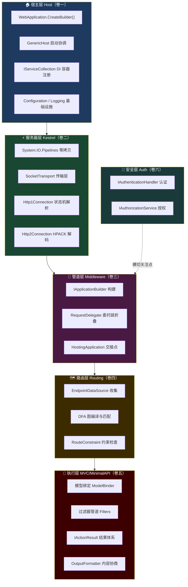
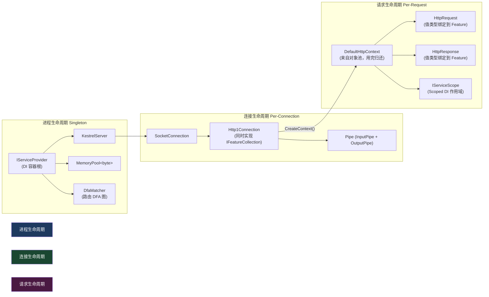
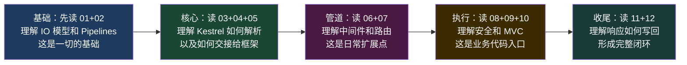

# 00 · 全链路总览

> 在深入每一个模块之前，先建立全局视野。本文回答一个问题：**一个 HTTP 请求从网卡到 Controller、再从 Controller 回到网卡，经历了哪些关键节点？**

---

## 一、全局流程图

```mermaid
flowchart TD
    NC["🌐 网卡 NIC\n以太网帧到达"]
    OS["OS 内核 TCP/IP 协议栈\nSYN → SYN-ACK → ACK\n三次握手完成"]
    SK["Socket 层\nSocket.AcceptAsync()\n返回已连接 fd"]
    TP["Transport 层\nSocketConnection\nPipeReader ↔ PipeWriter"]
    PP["System.IO.Pipelines\n零拷贝内存池\nMemoryPool&lt;byte&gt;"]
    HP["HTTP 协议解析\nHttpParser 状态机\nHttp1Connection / Http2Connection"]
    FC["IFeatureCollection\n解析结果包装\nIHttpRequestFeature\nIHttpResponseFeature"]
    HA["HostingApplication ⭐\n最关键的交接点\nCreateContext → DefaultHttpContext"]
    MW["中间件管道\nRequestDelegate 委托链\n洋葱圈模型"]
    RT["路由系统\nDFA 状态机匹配\nEndpoint 选择"]
    AU["认证授权\nJwtBearerHandler\nClaimsPrincipal"]
    MB["模型绑定\nFromRoute/Query/Body/Form\nValidation"]
    AE["Action 执行\nController / Minimal API\n你的业务代码"]
    AF["过滤器管道\nIActionFilter / IResultFilter"]
    OF["输出格式化\nSystemTextJsonOutputFormatter\n内容协商"]
    RW["响应写回\nPipeWriter.WriteAsync\nHTTP 报文组装"]
    SK2["Socket 发送\nSocketAsyncEventArgs\nScatter IO 零拷贝"]
    NC2["🌐 网卡 NIC\n数据包发出"]

    NC --> OS --> SK --> TP --> PP --> HP --> FC --> HA
    HA --> MW --> RT --> AU --> MB --> AE --> AF --> OF --> RW --> SK2 --> NC2

    style NC fill:#2d4a6b,color:#fff
    style NC2 fill:#2d4a6b,color:#fff
    style HA fill:#7b2d00,color:#fff,stroke:#ff6b00,stroke-width:3px
    style MW fill:#4a1942,color:#fff
    style RT fill:#3d2b00,color:#fff
    style AU fill:#1a3a3a,color:#fff
```



---

## 二、六大分层架构



---

## 三、每个模块的一句话总结

| # | 模块 | 一句话 | 核心类 |
|---|------|--------|--------|
| 01 | 网络层 | OS 的 TCP/IP 栈完成三次握手，Kestrel 用 IOCP/epoll 异步接受连接 | `SocketConnectionListener` |
| 02 | Pipelines | 零分配的管道模型取代 `byte[]`，内存池彻底消除 GC 压力 | `PinnedBlockMemoryPool` |
| 03 | HTTP 解析 | 零拷贝状态机在原始字节上划 Span 边界，识别 Method/Path/Headers | `HttpParser<T>` |
| 04 | IFeatureCollection | Kestrel 只知道"特性接口"，不知道 `HttpContext`，通过此接口严格解耦 | `IHttpRequestFeature` |
| 05 | 交接点 | `HostingApplication` 用特性集合孵化 `DefaultHttpContext`，进入 ASP.NET Core 领域 | `HostingApplication` |
| 06 | 中间件管道 | `Build()` 逆序折叠成单一委托链，运行时洋葱圈穿越 | `IApplicationBuilder` |
| 07 | 路由 | 所有路由模板提前编译成 DFA 图，匹配复杂度 O(path_length) 与路由数量无关 | `DfaMatcher` |
| 08 | 认证授权 | 认证确定"你是谁"（ClaimsPrincipal），授权判断"你能做什么"（Policy） | `JwtBearerHandler` |
| 09 | 模型绑定 | 按优先级从 Route/Query/Body/Form 组装强类型参数，Utf8JsonReader 零分配 | `BodyModelBinder` |
| 10 | 过滤器 | Authorization→Resource→Action→Result 四层过滤器，异常过滤器横切 | `ControllerActionInvoker` |
| 11 | 输出格式化 | 按 `Accept` Header 内容协商，直接写 `PipeWriter` 不经 MemoryStream | `SystemTextJsonOutputFormatter` |
| 12 | 响应返回 | `SocketSender` 用 Scatter IO 零拷贝把内存池中的字节发回网卡 | `SocketSender` |

---

## 四、关键设计思想速查

### 4.1 为什么性能高？——三个零

| 零 | 含义 | 实现机制 |
|----|------|---------|
| **零拷贝** | 字节从网卡进来，到序列化完成发出，中间尽量不额外复制 | `PinnedBlockMemoryPool` + `SocketAsyncEventArgs.BufferList` (Scatter IO) |
| **零分配** | 热路径上不 `new` 对象，不触发 GC | `ObjectPool<DefaultHttpContext>` + `heapless Span 解析` |
| **零阻塞** | 所有 IO 操作都是 `async/await`，等待期间线程归还线程池 | `System.IO.Pipelines` + IOCP/epoll |

### 4.2 四个关键接口

```csharp
// 1. 管道中流动的唯一类型
delegate Task RequestDelegate(HttpContext context);

// 2. Kestrel 与 ASP.NET Core 的唯一合同
interface IHttpApplication<TContext> {
    TContext CreateContext(IFeatureCollection features);
    Task ProcessRequestAsync(TContext context);
    void DisposeContext(TContext context, Exception? ex);
}

// 3. Kestrel 向上暴露的数据格式（不是 HttpRequest，是特性集合）
interface IFeatureCollection {
    object? this[Type key] { get; set; }
}

// 4. 中间件的本质
interface IMiddleware {
    Task InvokeAsync(HttpContext context, RequestDelegate next);
}
```

### 4.3 对象生命周期总览



---

## 五、源码仓库导航

```
github.com/dotnet/aspnetcore
│
├── src/Hosting/Hosting/src/Internal/
│   └── HostingApplication.cs          ← ⭐ 交接点，最值得读
│
├── src/Servers/Kestrel/Core/src/Internal/Http/
│   ├── Http1Connection.cs              ← HTTP/1.1 连接与状态机
│   ├── HttpParser.cs                   ← 零拷贝 Header 解析
│   └── Http2/Http2Connection.cs        ← HTTP/2 帧处理
│
├── src/Servers/Kestrel/Transport.Sockets/src/
│   ├── SocketConnectionListener.cs     ← Accept 循环
│   ├── SocketConnection.cs             ← 读写 Pipe 桥接
│   └── Internal/PinnedBlockMemoryPool.cs ← 内存池
│
├── src/Http/Routing/src/Matching/
│   ├── DfaMatcher.cs                   ← DFA 匹配执行
│   └── DfaMatcherBuilder.cs            ← DFA 图编译
│
├── src/Middleware/RoutingMiddleware/src/
│   └── EndpointRoutingMiddleware.cs    ← UseRouting()
│
├── src/Mvc/Mvc.Core/src/
│   ├── Infrastructure/ControllerActionInvoker.cs ← 过滤器管道
│   ├── ModelBinding/Binders/BodyModelBinder.cs   ← JSON 绑定
│   └── Formatters/SystemTextJsonOutputFormatter.cs ← JSON 序列化
│
└── src/Security/Authentication/JwtBearer/src/
    └── JwtBearerHandler.cs             ← JWT 认证
```

---

## 六、学习路线建议


