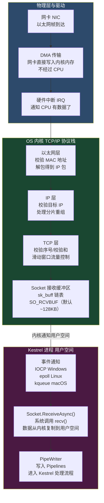
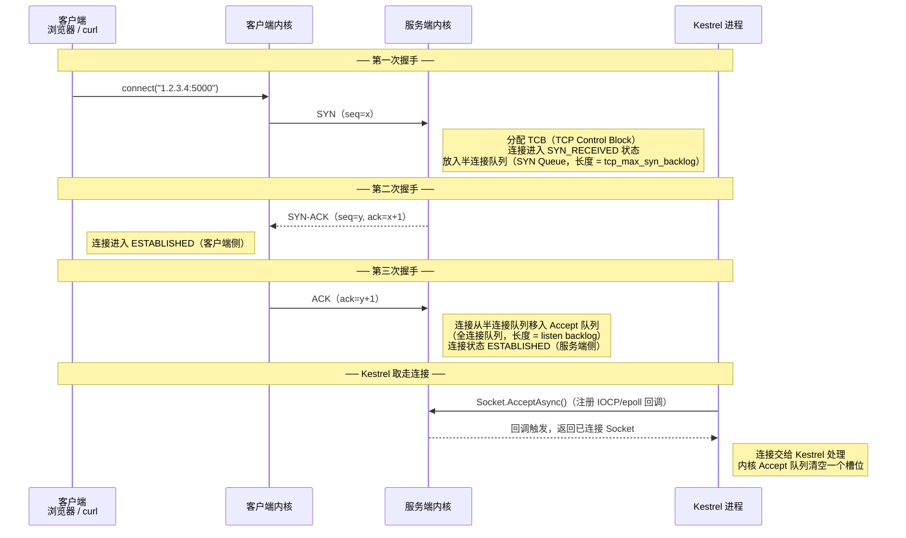
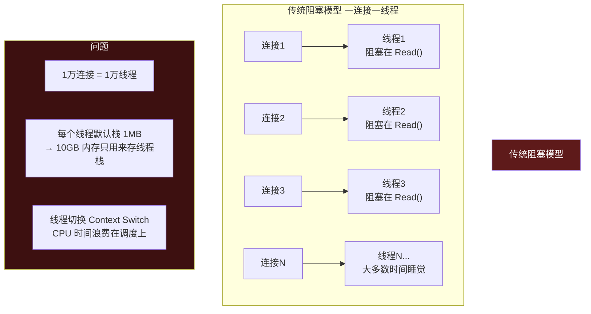
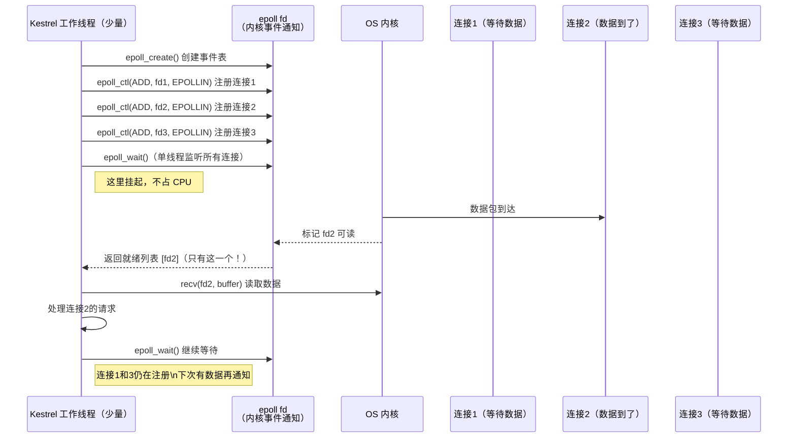
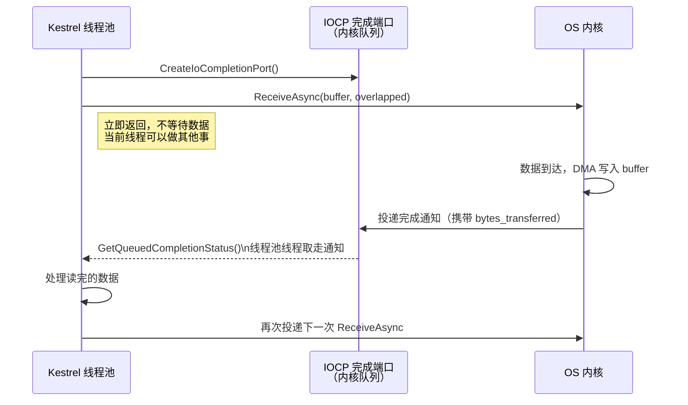
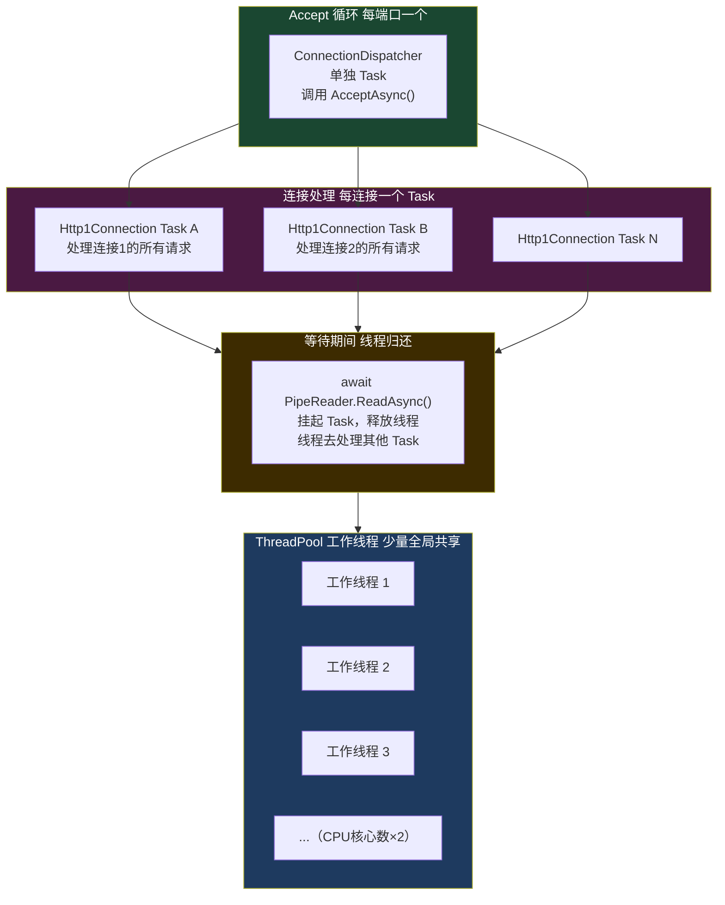
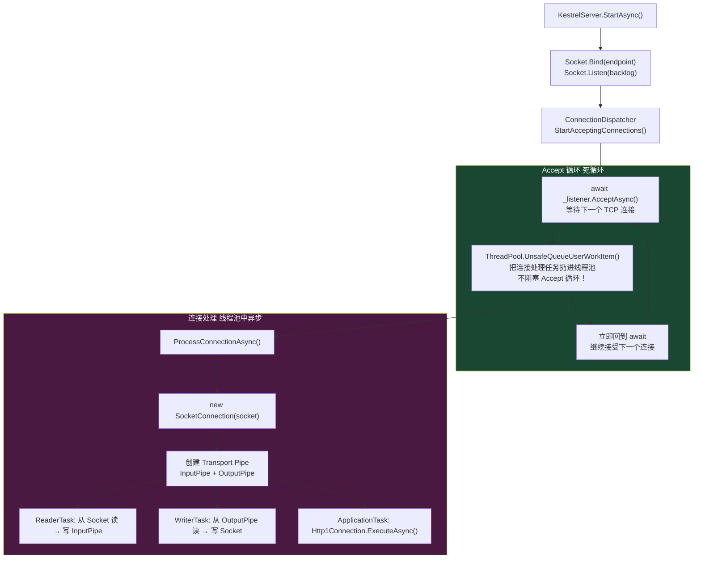
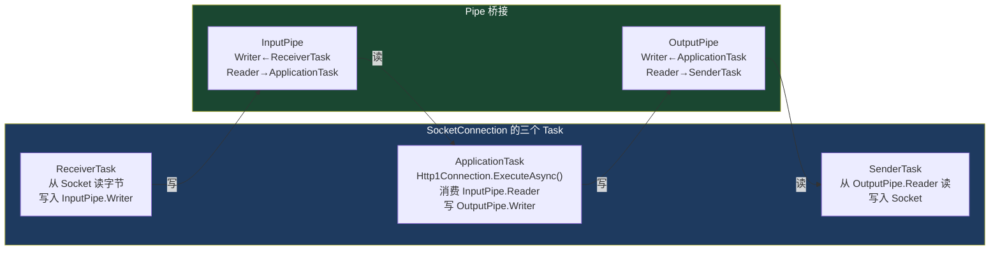
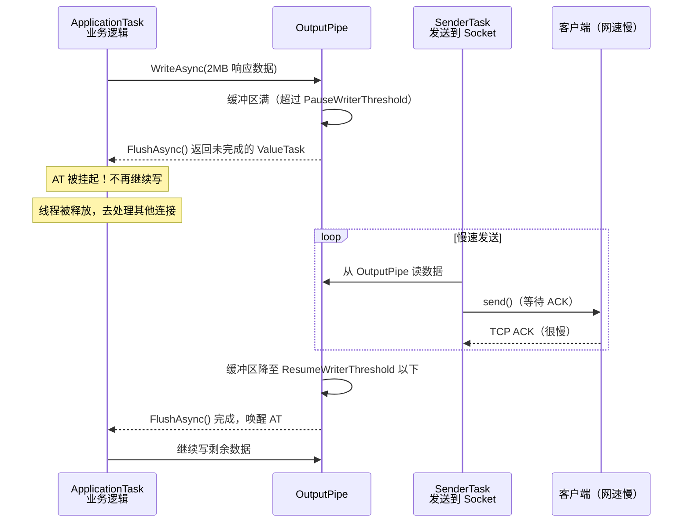

# 01 · 网络层：TCP 到 Socket

> **本模块回答：** 一个 HTTP 请求在到达 Kestrel 进程之前，经历了什么？Kestrel 是如何用极少的线程处理成千上万个并发连接的？

---

## 一、从网卡到进程：物理路径



> **那一次不可避免的内存复制**：从内核接收缓冲区（`sk_buff`）到用户空间（Kestrel 进程的 `MemoryPool`），这是整个请求生命周期中**唯一必须发生**的内存复制。Kestrel 的全部零拷贝优化都建立在"接受这一次复制"的基础上，此后的 HTTP 解析、路由、序列化等过程再也不额外复制。

---

## 二、TCP 三次握手——连接建立细节



**两个队列的关系（常见生产故障点）**：

```
SYN 队列（半连接队列）          Accept 队列（全连接队列）
┌────────────────────┐          ┌────────────────────┐
│ SYN_RECEIVED 连接  │──ACK──→ │ ESTABLISHED 连接   │
│                    │          │                    │
│ 上限: tcp_max_syn_backlog     │ 上限: min(backlog, somaxconn) │
│ 默认: 2048         │          │ 默认: 128          │
└────────────────────┘          └────────────────────┘
```

**Kestrel 的 backlog 配置**：

```csharp
// Program.cs
builder.WebHost.ConfigureKestrel(options =>
{
    options.ListenAnyIP(5000, listenOptions =>
    {
        // 这个 backlog 参数传递给 Socket.Listen(backlog)
        // 控制 Accept 队列长度
        // 高并发场景（如 10K RPS）应设为 1024+
        listenOptions.Backlog = 512; // 默认值
    });
});

// 对应 Linux 内核参数优化（运维层面）
// sysctl -w net.core.somaxconn=65535
// sysctl -w net.ipv4.tcp_max_syn_backlog=65535
```

---

## 三、IOCP / epoll——如何用少量线程处理海量连接

这是 Kestrel 高并发的根本原因，必须深刻理解。

### 3.1 传统阻塞模型（为什么不能用）



### 3.2 epoll 事件驱动模型（Linux）



**关键差异**：`epoll` 永远只返回**就绪**的连接，而不是轮询所有连接。1 万个连接同时注册，有数据的只有 50 个，`epoll_wait` 就返回这 50 个。

### 3.3 IOCP 模型（Windows）



### 3.4 Kestrel 的 IO 线程模型



**核心理解**：10000 个并发连接，不是 10000 个线程，而是 10000 个 **Task（协程）**。大多数 Task 都在 `await` 挂起状态，它们不占用线程。只有真正有数据需要处理的 Task 才占用线程池的线程。

---

## 四、Kestrel 的 Accept 循环源码解析



**关键源码（简化版）**：

```csharp
// src/Servers/Kestrel/Transport.Sockets/src/SocketConnectionListener.cs

// Accept 循环：每个端口只有这一个循环
internal async ValueTask<ConnectionContext?> AcceptAsync(CancellationToken ct = default)
{
    while (true)
    {
        try
        {
            // 阻塞等待单个连接（底层 epoll_wait/IOCP）
            // 在等待期间不占用线程（async/await 挂起）
            var acceptSocket = await _listenSocket.AcceptAsync(ct);
            
            // 为新连接配置 Socket 参数
            acceptSocket.NoDelay = true; // 关闭 Nagle 算法，减少延迟
            
            // 创建连接包装对象（不在此处理请求，立即返回继续 Accept）
            var connection = new SocketConnection(
                acceptSocket,
                _memoryPool,      // 共享内存池（进程级单例）
                _scheduler,       // IO 调度器
                _logger,
                _socketSenderPool // SocketSender 对象池
            );
            
            return connection; // 返回给 ConnectionDispatcher 去处理
        }
        catch (ObjectDisposedException)
        {
            return null; // 监听 Socket 关闭，退出循环
        }
    }
}
```

```csharp
// src/Servers/Kestrel/Core/src/Internal/ConnectionDispatcher.cs

private async Task StartAcceptingConnectionsAsync<T>(
    IConnectionListener<T> listener,
    Func<T, Task> connectionHandler)
{
    while (true)
    {
        var connection = await listener.AcceptAsync();
        if (connection == null) break;
        
        // ⭐ 关键：不 await！直接把连接处理任务扔线程池
        // Accept 循环立刻继续，不等待这个连接处理完
        // 这就是"高并发"的根本：Accept 和 Process 完全解耦
        _ = Task.Run(() => connectionHandler(connection));
    }
}
```

---

## 五、Socket 参数详解（影响性能）

```csharp
// src/Servers/Kestrel/Transport.Sockets/src/SocketConnectionListener.cs
private Socket CreateBoundListenSocket(EndPoint endpoint)
{
    var socket = new Socket(endpoint.AddressFamily, SocketType.Stream, ProtocolType.Tcp);
    
    // ── 关闭 Nagle 算法 ─────────────────────────────────────────────────
    // Nagle 算法会攒够 MSS（最大报文段，约 1460 字节）才发出
    // 对于 HTTP API，每条响应需要立即发出，不能等待攒包
    // NoDelay = true 让每次 WriteAsync 后立即发出报文
    socket.NoDelay = true;
    
    // ── 端口复用 ─────────────────────────────────────────────────────────
    // 允许多个进程绑定同一端口（k8s 多副本场景）
    // 也允许 TIME_WAIT 状态的端口立即复用（避免服务重启后等待 2MSL）
    socket.SetSocketOption(SocketOptionLevel.Socket, SocketOptionName.ReuseAddress, true);
    
    // ── Linux 特有：SO_REUSEPORT ──────────────────────────────────────────
    // 多个进程绑定同一端口，内核负载均衡地分发新连接
    // 这比在用户空间做 Reverse Proxy 效率更高
    if (RuntimeInformation.IsOSPlatform(OSPlatform.Linux))
    {
        socket.SetSocketOption(
            SocketOptionLevel.Socket,
            SocketOptionName.ReuseUnicastPort, // = SO_REUSEPORT
            true
        );
    }
    
    socket.Bind(endpoint);
    socket.Listen(backlog: 512);
    return socket;
}
```

---

## 六、SocketConnection：三个并行 Task

每个 TCP 连接建立后，Kestrel 会为它创建三个并行运行的 Task，这三个 Task 通过 `Pipe` 协作：



**为什么要分三个 Task？**

- **ReceiverTask 和 SenderTask** 专注 IO 操作，调度在 IOCP/epoll 友好的 IO 调度器上。
- **ApplicationTask** 运行在普通线程池，执行 HTTP 解析、路由、业务代码，可能被 `await` 挂起让出线程。
- 三者通过 `Pipe` 解耦，互不阻塞。当网络慢时，`OutputPipe` 会产生背压（backpressure），自动暂停 ApplicationTask 写入，避免内存堆积。

---

## 七、背压机制（Backpressure）



**配置背压阈值**：

```csharp
builder.WebHost.ConfigureKestrel(options =>
{
    options.Limits.MaxResponseBufferSize = 64 * 1024; // 64KB 响应缓冲上限
    // 超过此值，FlushAsync() 会 backpressure
    // 防止慢客户端导致服务端缓存大量数据占用内存
});
```

---

## 八、本模块总结

| 知识点 | 核心结论 |
|--------|---------|
| 网卡 → 内核 | DMA 直写内核缓冲区，一次硬件中断通知 CPU |
| 三次握手 | 内核完成，Kestrel 只管 AcceptAsync() 从 Accept 队列取连接 |
| epoll/IOCP | 单线程监听万级连接，只有就绪连接才触发回调，彻底消除线程阻塞 |
| Accept 循环 | 接受连接和处理连接完全异步解耦，Accept 循环永不阻塞 |
| 三个 Task | ReceiverTask + ApplicationTask + SenderTask，Pipe 协作，背压自动流控 |
| Socket 配置 | NoDelay 消除 Nagle 延迟，ReusePort 支持内核级负载均衡 |

> **下一章**：连接建立后，字节流开始进入 `InputPipe`。`System.IO.Pipelines` 如何用零分配的方式管理这些字节？→ [02 · Pipelines：零拷贝内存模型](02_Pipelines零拷贝内存模型.md)
