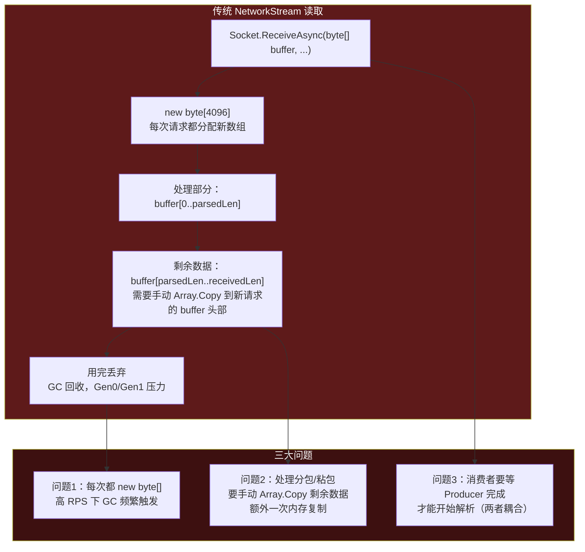
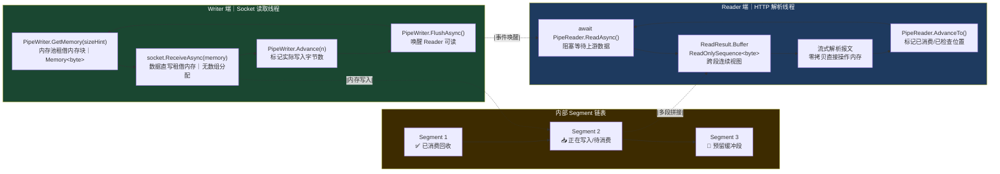
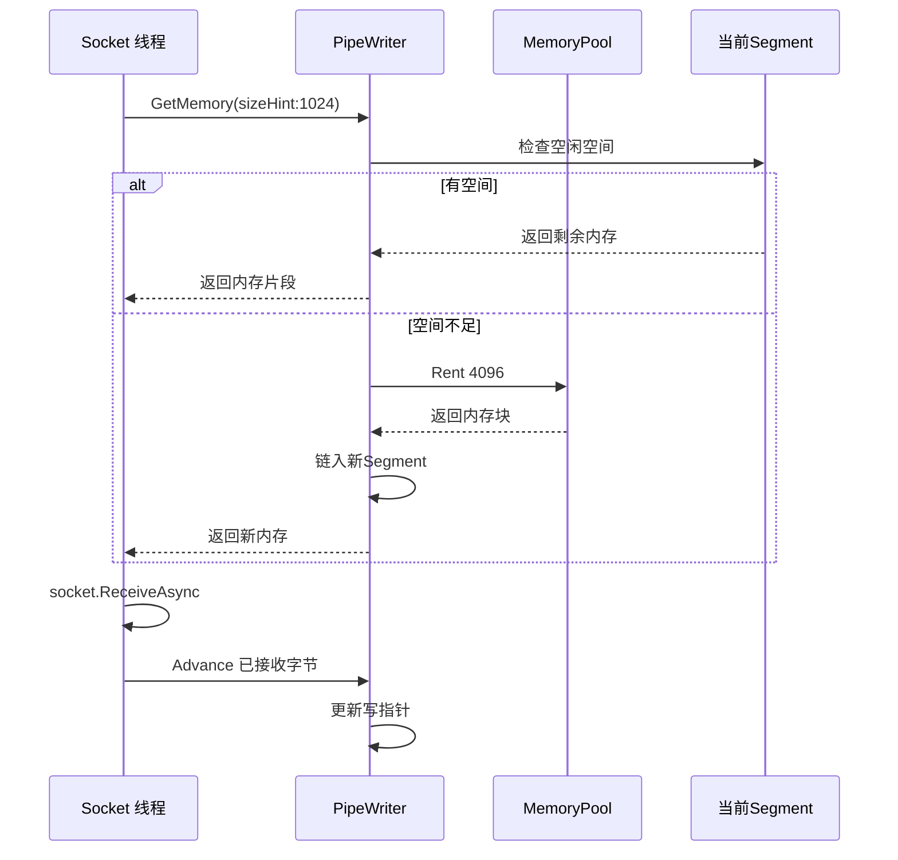
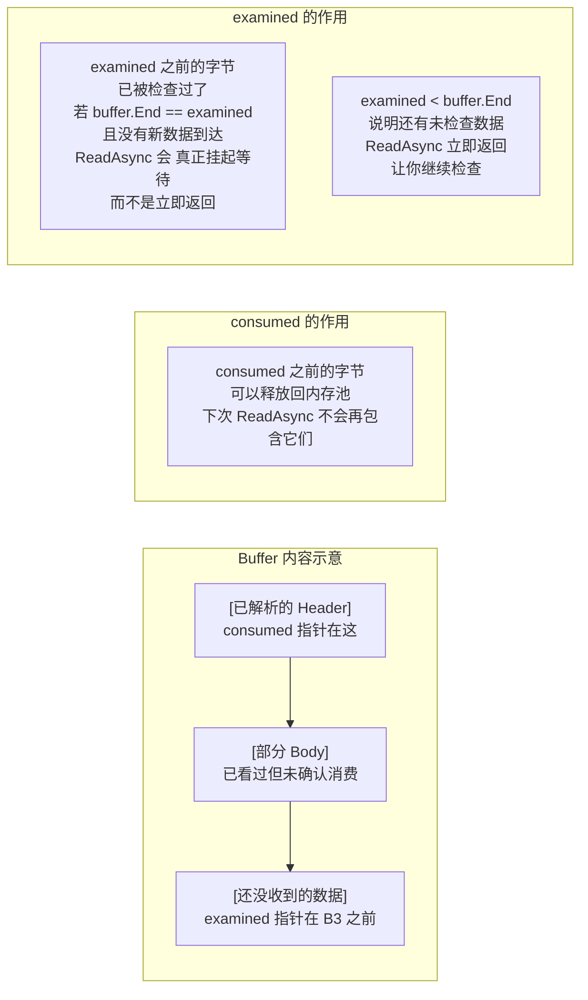
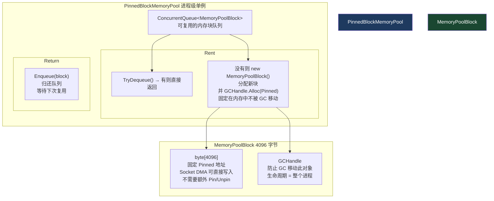
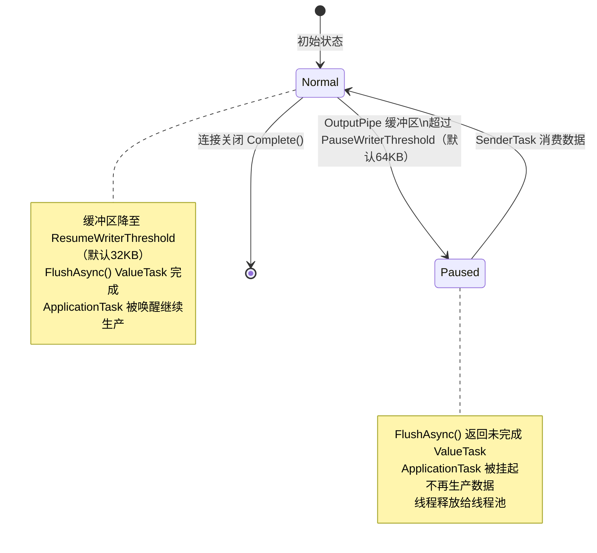
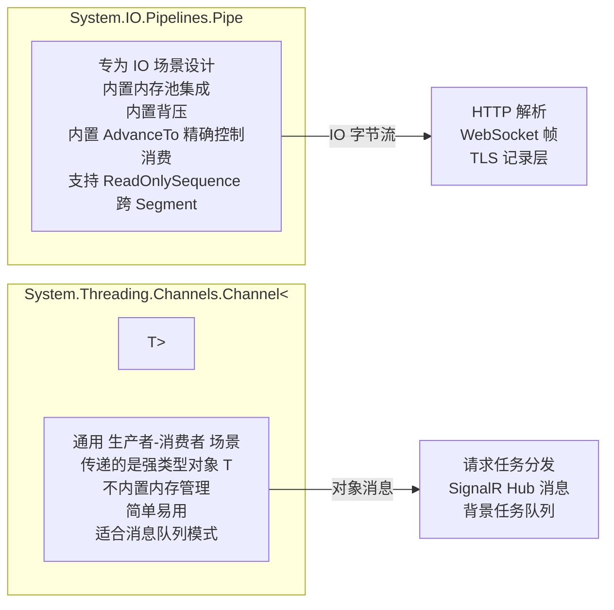
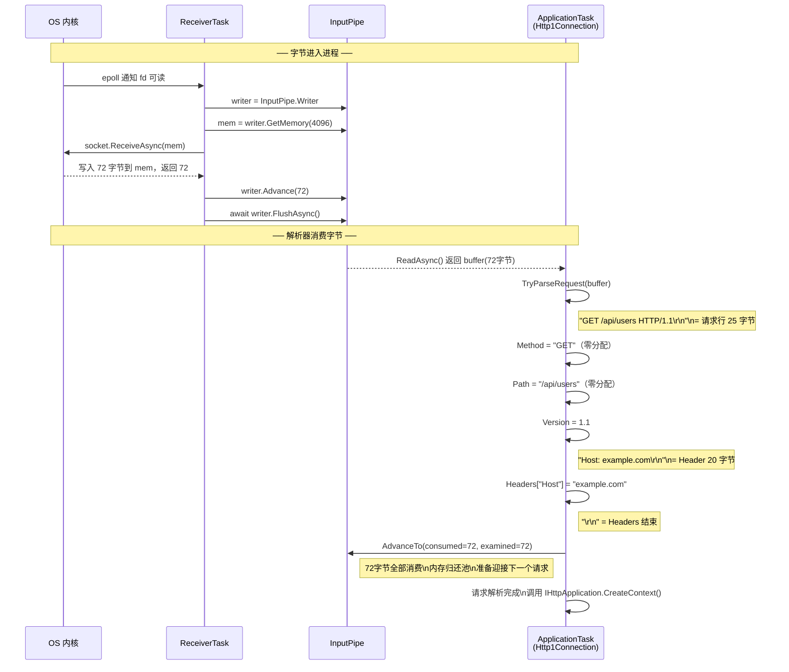

# 02 · Pipelines：零拷贝内存模型

> **本模块回答：** 为什么 Kestrel 能处理那么多并发请求却保持低 GC 压力？`System.IO.Pipelines` 是如何做到既不复制字节、又不阻塞线程的？

---

## 一、传统 IO 与 Pipelines 的对比

### 1.1 传统 `byte[]` 方式（存在哪些问题）



### 1.2 Pipelines 方式（如何解决）



---

## 二、`PipeWriter.GetMemory()` — 零分配内存借用



**`sizeHint` 的含义**：这是**建议**大小，Pipe 不保证一定给你这么多。实际分配取决于当前 Segment 的剩余空间。

---

## 三、`AdvanceTo` 精解 — 最容易理解错的 API

`AdvanceTo(consumed, examined)` 有两个参数，很多人只知道第一个。



**四种实际场景的正确写法**：

```csharp
var result = await reader.ReadAsync();
var buffer = result.Buffer;

// ────────────────────────────────────────────────────────────────────
// 场景1：成功解析完整 HTTP 请求
// ────────────────────────────────────────────────────────────────────
if (TryParseRequest(buffer, out var request, out var consumed))
{
    // consumed 是请求结束的位置
    reader.AdvanceTo(
        consumed: consumed,  // 已消费：请求字节释放回池
        examined: consumed   // 已检查：和 consumed 一样
    );
    // 下次 ReadAsync 从 consumed 之后开始（可能是下一个请求的起始）
}

// ────────────────────────────────────────────────────────────────────
// 场景2：数据不够，Headers 还没结束
// ────────────────────────────────────────────────────────────────────
else
{
    reader.AdvanceTo(
        consumed: buffer.Start,  // 一个字节都不消费！保留所有数据
        examined: buffer.End     // 但已经看过所有字节了
    );
    // ⚠️ 这一行至关重要：
    // 若 examined < buffer.End，Pipe 以为还有未检查的字节
    // ReadAsync 会立即返回（即使没有新数据）→ CPU 100% 空转！
    // 设置 examined = buffer.End 告知 Pipe："新数据来了再叫我"
}

// ────────────────────────────────────────────────────────────────────
// 场景3：有粘包——一次性收到两个完整请求
// ────────────────────────────────────────────────────────────────────
while (TryParseRequest(buffer, out var req, out var end))
{
    ProcessRequest(req);
    buffer = buffer.Slice(end); // 切掉已处理的部分
}
// 处理完第二个请求后，buffer 可能仍有第三个请求的起始字节
reader.AdvanceTo(
    consumed: buffer.Start, // 只消费了两个完整请求
    examined: buffer.End    // 剩余字节已看过（不够一个完整请求）
);

// ────────────────────────────────────────────────────────────────────
// 场景4：遇到超大 Header（必须拒绝，防止内存耗尽）
// ────────────────────────────────────────────────────────────────────
if (buffer.Length > MaxHeaderBytes)
{
    reader.AdvanceTo(
        consumed: buffer.End, // 丢弃所有数据
        examined: buffer.End
    );
    // 返回 431 状态码，关闭连接
    throw new HeadersTooLargeException();
}
```

---

## 四、`ReadOnlySequence<byte>` — 跨 Segment 的连续视图

这是 Pipelines 的数据载体，和 `byte[]` 的最大区别是它可以"跨越"多个不连续的内存块。

```mermaid
graph LR
    subgraph 物理内存布局
        SA["Segment A\n内存地址: 0x1000\n[H T T P / 1 . 1]"]
        SB["Segment B\n内存地址: 0x5000\n[ G E T  / a p i]"]
        SC["Segment C\n内存地址: 0x9000\n[ / u s e r s\\r\\n]"]
    end

    subgraph ReadOnlySequence&lt;byte&gt; 逻辑视图
        SEQ["逻辑连续视图\n'HTTP/1.1 GET /api/users\\r\\n'\n实际是三段不连续内存的链表\n没有任何内存复制！"]
    end

    SA & SB & SC --> SEQ

    style 物理内存布局 fill:#3d2b00,color:#fff
    style ReadOnlySequence 逻辑视图 fill:#1a4731,color:#fff
```

**在 Sequence 上安全操作的技巧**：

```csharp
// 在 ReadOnlySequence 上查找 \r\n，不 ToArray()，不复制
private static bool TryFindCRLF(
    ReadOnlySequence<byte> buffer,
    out SequencePosition position)
{
    // SequenceReader 是操作 ReadOnlySequence 的高级游标
    var reader = new SequenceReader<byte>(buffer);
    
    // TryReadTo 在不复制的情况下找到分隔符
    if (reader.TryReadTo(out ReadOnlySpan<byte> line, "\r\n"u8))
    {
        position = reader.Position;
        return true;
    }
    
    position = default;
    return false;
}

// 处理跨 Segment 的数据时，若必须要 ToString()
// 只在确实需要时才转换，且只转换那一小段
if (header.Length <= 256) // 短 header 用栈分配
{
    Span<byte> stackBuf = stackalloc byte[header.Length];
    header.CopyTo(stackBuf);
    return Encoding.ASCII.GetString(stackBuf);
}
else
{
    // 超过栈大小才 heap 分配
    return Encoding.ASCII.GetString(header.ToArray());
}
```

---

## 五、`PinnedBlockMemoryPool` — 固定内存池



**为什么要 Pin（固定内存）？**

```csharp
// 通常情况下，GC 可以随时移动托管对象到内存中的其他位置
// 这会导致一个问题：
// 
// 你把 buffer 地址告诉 OS（传给 SocketAsyncEventArgs）
// GC 突然把 buffer 移走了
// OS 的 DMA 把数据写到了旧地址 → 内存损坏！
//
// GCHandle.Alloc(array, GCHandleType.Pinned) 告诉 GC：
// "这块内存不要动，地址永久固定"
//
// 代价：这块内存永远不会被 GC 整理（不影响 GC 频率，但增加碎片）
// Kestrel 统一管理固定内存块，避免到处 Pin/Unpin 的性能损耗

internal sealed class MemoryPoolBlock : IMemoryOwner<byte>
{
    private readonly PinnedBlockMemoryPool _pool;
    private readonly GCHandle _gcHandle; // 永久固定

    public MemoryPoolBlock(PinnedBlockMemoryPool pool, int length)
    {
        var array = new byte[length];
        _gcHandle = GCHandle.Alloc(array, GCHandleType.Pinned); // ← Pin
        Memory = MemoryMarshal.CreateFromPinnedArray(array, 0, array.Length);
        _pool = pool;
    }

    public Memory<byte> Memory { get; }

    public void Dispose()
    {
        // 不释放内存！归还给对象池等待复用
        _pool.Return(this);
    }
}
```

---

## 六、背压（Backpressure）机制详解

背压是 Pipelines 最重要的流控机制，防止快生产者把内存撑爆。



**配置背压阈值**：

```csharp
builder.WebHost.ConfigureKestrel(options =>
{
    options.Limits.MaxResponseBufferSize = 64 * 1024; // 64KB
    // 内部对应 OutputPipe 的 PauseWriterThreshold

    options.Limits.MaxRequestBufferSize = 1 * 1024 * 1024; // 1MB
    // 读请求体时，若 1MB 未被消费，暂停从 Socket 读取
    // 对应发送 TCP Window Update=0，通知客户端暂停发送
});
```

---

## 七、Pipe 与 Channel 的对比



---

## 八、完整数据流追踪

以一个 `GET /api/users HTTP/1.1\r\nHost: example.com\r\n\r\n` 请求为例：



---

## 九、本模块总结

| 知识点 | 核心结论 |
|--------|---------|
| `GetMemory()` | 从内存池借内存，不 `new byte[]`，零 GC 压力 |
| `Advance()` | 告知写入量，更新写指针，不移动数据 |
| `ReadAsync()` | 无数据时真正挂起（不自旋），有数据立即唤醒 |
| `AdvanceTo(consumed, examined)` | consumed：可释放的范围；examined：已检查的范围，控制下次唤醒时机 |
| `ReadOnlySequence<byte>` | 逻辑连续的跨 Segment 视图，物理不连续，零额外拷贝 |
| `PinnedBlockMemoryPool` | 固定内存块生命周期 = 进程，DMA 安全，OS 可直接写入 |
| 背压 | 消费慢时自动挂起生产者，防止内存无限增长 |

> **下一章**：字节进入 `InputPipe` 后，`Http1Connection` 如何用零分配状态机把这些字节解析成 Method、Path、Headers？→ [03 · HTTP 协议解析：状态机](03_HTTP协议解析状态机.md)
