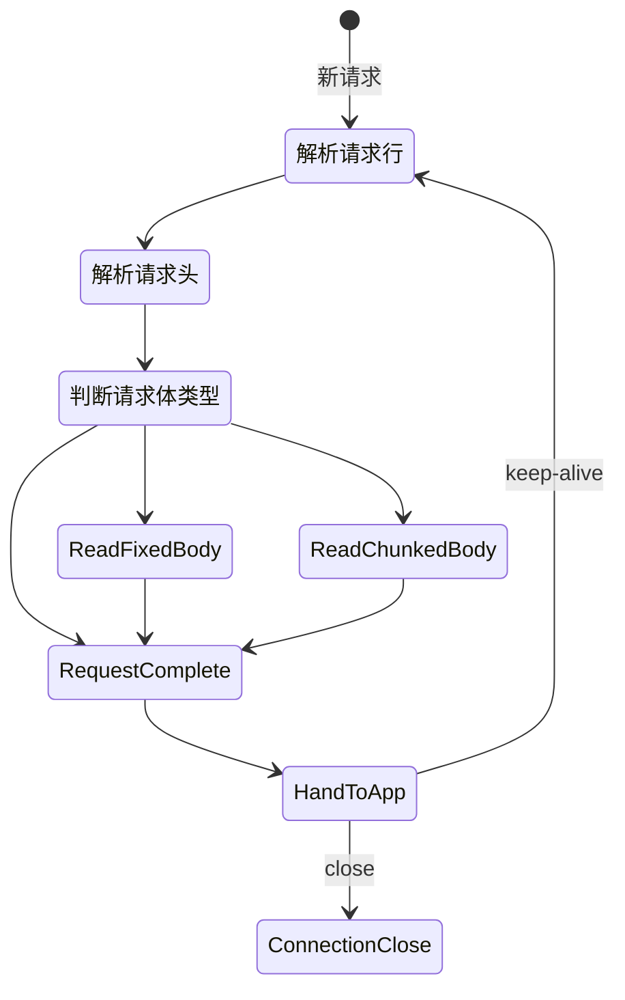
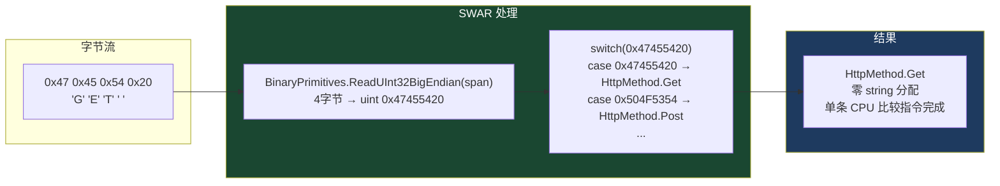
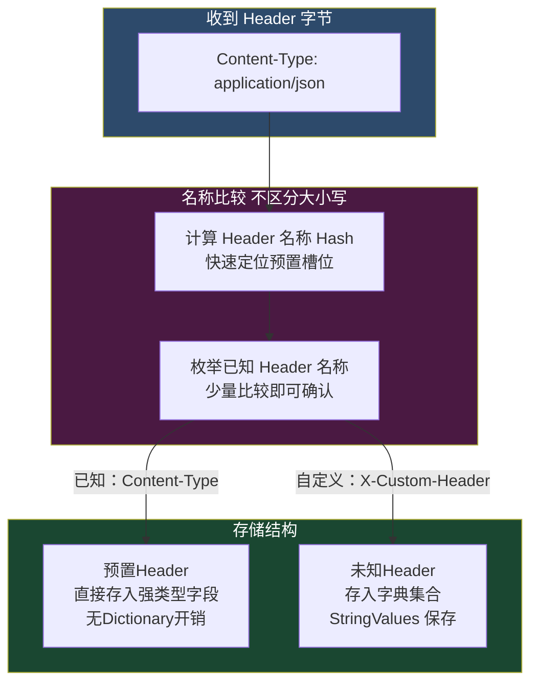
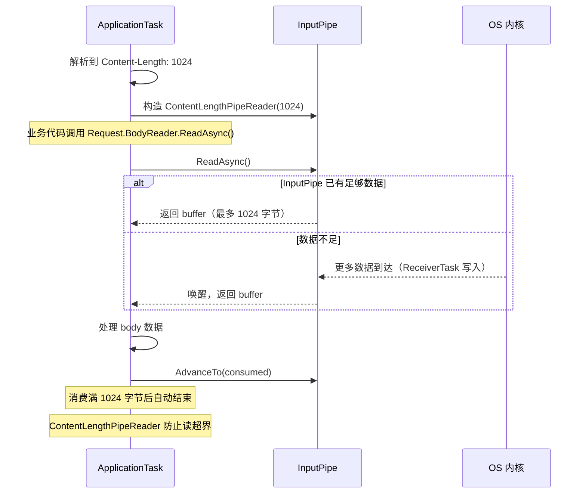
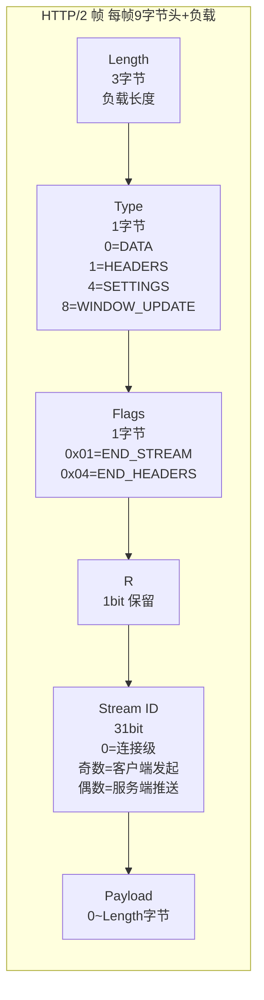
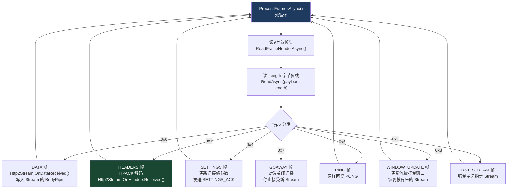
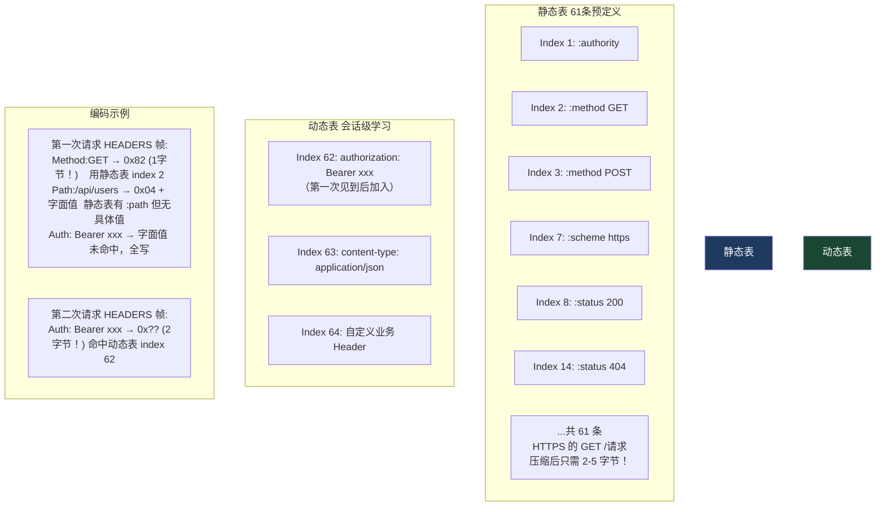
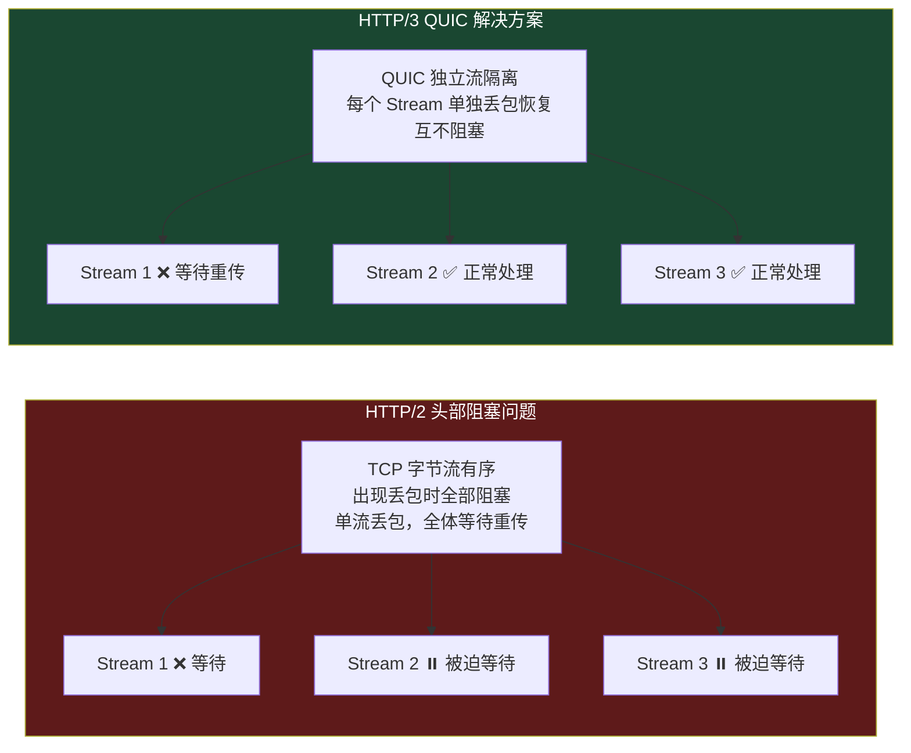
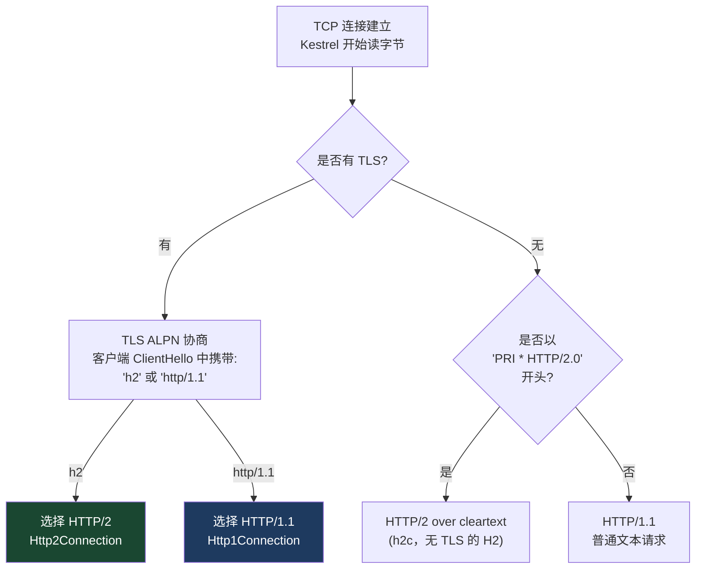

# 03 · HTTP 协议解析：状态机

> **本模块回答：** Kestrel 是如何把 TCP 字节流变成有结构的 Method、Path、Headers 和 Body 的？为什么这个过程几乎不分配内存？HTTP/2 和 HTTP/1.1 有哪些本质差异？

---

## 一、HTTP/1.1 报文结构回顾

在深入解析器之前，先明确被解析的目标长什么样：

```
POST /api/users HTTP/1.1\r\n          ← 请求行：Method SP Path SP Version CRLF
Host: example.com\r\n                  ← Header: Name COLON SP Value CRLF
Content-Type: application/json\r\n     ← Header
Content-Length: 27\r\n                 ← Header
Authorization: Bearer eyJhbG...\r\n    ← Header
\r\n                                   ← 空行：Headers 结束标志
{"name":"Bob","age":25}                ← Body（Content-Length 个字节）
```

---

## 二、`Http1Connection` 状态机全貌



---

## 三、请求行解析——SWAR 零分配技术

Kestrel 识别 HTTP Method 不用字符串比较，而是用 **SWAR（SIMD Within A Register）** 技术。



**源码精读（`HttpParser.cs`）**：

```csharp
// src/Servers/Kestrel/Core/src/Internal/Http/HttpParser.cs

// 用 4 字节 uint 一次比较 4 个 ASCII 字符
// 对应 HTTP Method 的第1-4个字节
private static bool TryGetKnownMethod(ReadOnlySpan<byte> span, out HttpMethod method)
{
    if (span.Length < 3) { method = HttpMethod.None; return false; }

    // 读取前4字节（或前3字节+0补位）组成 uint，一次 CPU load 指令
    var fourBytes = BinaryPrimitives.ReadUInt32BigEndian(span);

    // 注意：比较的是 "GET " 包含空格，因为 Method 后紧跟空格
    switch (fourBytes)
    {
        case 0x47455420: method = HttpMethod.Get;     return true; // "GET "
        case 0x50555420: method = HttpMethod.Put;     return true; // "PUT "
        case 0x48454144: method = HttpMethod.Head;    return true; // "HEAD"
        case 0x504F5354: method = HttpMethod.Post;    return true; // "POST"
        case 0x44454C45: method = HttpMethod.Delete;  return true; // "DELE"（后续再确认）
        case 0x50415443: method = HttpMethod.Patch;   return true; // "PATC"
        case 0x4F505449: method = HttpMethod.Options; return true; // "OPTI"
        case 0x434F4E4E: method = HttpMethod.Connect; return true; // "CONN"
        case 0x54524143: method = HttpMethod.Trace;   return true; // "TRAC"
    }
    method = HttpMethod.None;
    return false;
}

// Path 解析：同样是在原始字节上划界，不产生 string
private bool TryTakePath(ref SequenceReader<byte> reader, out ReadOnlySpan<byte> path)
{
    // TryReadTo 找到下一个 ' '(0x20)，path 指向中间这段字节
    // 这个 path 是 ReadOnlySpan<byte>，直接指向 PipeReader 的内存
    // 没有任何分配！
    return reader.TryReadTo(out path, (byte)' ', advancePastDelimiter: true);
}
```

---

## 四、Header 解析——预分配 Slot 技术

40 个常见 Header 各有专属字段，避免进字典：



```csharp
// 编译器为 Http1Connection 生成的部分代码（经过极度简化）
// 实际代码通过 T4 模板自动生成，针对约 40 个常见 Header
internal partial class HttpRequestHeaders : IHeaderDictionary
{
    // 预置字段：比 Dictionary 访问快 3-5 倍（省去哈希和冲突处理）
    private StringValues _contentType;
    private StringValues _contentLength;
    private StringValues _authorization;
    private StringValues _accept;
    private StringValues _host;
    private StringValues _userAgent;
    // ...约 40 个

    // 设置 Header 时的分发逻辑（由位运算标志位辅助）
    private void SetKnownHeader(KnownHeaderType type, StringValues value)
    {
        switch (type)
        {
            case KnownHeaderType.ContentType:   _contentType   = value; break;
            case KnownHeaderType.ContentLength: _contentLength = value; break;
            case KnownHeaderType.Authorization: _authorization = value; break;
            // ...
            default:
                // 未知 Header 才进字典
                UnknownHeaders ??= new();
                UnknownHeaders[type.ToString()] = value;
                break;
        }
    }
}
```

---

## 五、Header Value 的 StringValues——零分配多值存储

HTTP 允许同名 Header 出现多次（如多个 `Set-Cookie`）。`StringValues` 可以存一个或多个值，不需要 `List<string>`。

```csharp
// StringValues 是一个带有特殊优化的结构体
// 单个值：直接存 string（不创建数组）
// 多个值：存 string[]（只有多值时才分配数组）

// 用法
var acceptHeader = Request.Headers.Accept; // StringValues
// 单个值场景（最常见）：底层是 string 引用，零分配
// 多值场景：底层是 string[] 

// 迭代 —— 无论单值多值都用统一的 foreach
foreach (var value in acceptHeader)
{
    // application/json
    // text/html
    // */*
}
```

---

## 六、Body 读取——两种模式

### 6.1 Content-Length 模式（定长）



### 6.2 Chunked Transfer-Encoding 模式

```
5\r\n          ← 十六进制表示 chunk 长度：5 字节
Hello\r\n      ← chunk 数据
6\r\n          ← 下一个 chunk：6 字节
 World\r\n
0\r\n          ← 结束 chunk（大小为0）
\r\n
```

```csharp
// Kestrel 通过 ChunkedRequestStream 透明处理分块编码
// 业务代码读取 Request.Body 时，看到的是连续的数据流
// chunked 的边界完全由 Kestrel 内部透明处理
while (true)
{
    // 读取 chunk 大小行（十六进制字符串）
    if (!TryReadChunkLength(ref reader, out var chunkSize)) break;
    
    if (chunkSize == 0) break; // 最后一个空 chunk，Body 结束
    
    // 读取指定字节数的 chunk 数据
    await ReadExactAsync(chunkSize);
    
    // 跳过 chunk 后的 \r\n
    await SkipCRLF();
}
```

---

## 七、HTTP/2 解析——帧结构与多路复用

HTTP/2 完全抛弃了文本格式，改用二进制帧（Frame）。

### 7.1 帧结构



### 7.2 Http2Connection 帧处理循环



### 7.3 HPACK 头部压缩——静态表 + 动态表



**HPACK 解码关键代码**：

```csharp
// src/Servers/Kestrel/Core/src/Internal/Http2/HPackDecoder.cs 简化版
private void ProcessHeaderValue(ReadOnlySpan<byte> data)
{
    // 第一字节高位决定编码类型
    var firstByte = data[0];
    
    if ((firstByte & 0x80) != 0)
    {
        // 1xxxxxxx：索引 Header（完全命中静态/动态表）
        var index = firstByte & 0x7F;
        SetIndexedHeader(index);  // 直接从表中取 Name+Value，无字面量传输
    }
    else if ((firstByte & 0x40) != 0)
    {
        // 01xxxxxx：字面量 Header，Name 可能有索引，Value 是字面量
        // 并加入动态表（下次请求可以用索引引用）
        AddLiteralHeaderWithIndexing(data);
    }
    else
    {
        // 0000xxxx：字面量 Header，不加入动态表（适合变化频繁的值）
        AddLiteralHeaderWithoutIndexing(data);
    }
}
```

---

## 八、HTTP/3 简介——QUIC 上的 HTTP

HTTP/3 把传输层从 TCP 换成了 **QUIC（UDP-based）**，彻底解决了 HTTP/2 的头部阻塞（HOL Blocking）问题。



**Kestrel 启用 HTTP/3**：

```csharp
builder.WebHost.ConfigureKestrel(options =>
{
    options.ListenAnyIP(443, listen =>
    {
        listen.UseHttps();
        listen.Protocols = HttpProtocols.Http1AndHttp2AndHttp3; // 启用 H3
    });
});

// H3 需要通过 Alt-Svc Header 告知客户端
// Kestrel 会自动添加: Alt-Svc: h3=":443"; ma=86400
```

---

## 九、协议版本探测



**代码层面**：

```csharp
// src/Servers/Kestrel/Core/src/Internal/HttpConnection.cs 简化
private Task SelectProtocol()
{
    if (_transportConnection.Features.Get<ITlsConnectionFeature>() != null)
    {
        var alpnProtocol = _transportConnection.Features
            .Get<ITlsHandshakeFeature>()?.Protocol;
        return alpnProtocol switch
        {
            SslApplicationProtocol.Http2 => ProcessHttp2Async(),
            SslApplicationProtocol.Http11 => ProcessHttp1Async(),
            _ => ProcessHttp1Async() // 默认 HTTP/1.1
        };
    }
    
    // 无 TLS：读前几个字节判断是否是 HTTP/2 Prior Knowledge (h2c)
    // "PRI * HTTP/2.0\r\n\r\nSM\r\n\r\n" = HTTP/2 连接前言
    return ProcessHttp1Or2Async();
}
```

---

## 十、本模块总结

| 知识点 | 核心结论 |
|--------|---------|
| SWAR 技术 | 4字节 uint 比较代替字符串比较，Method 识别零分配一条指令 |
| 预置 Header Slot | 常见 Header 直接存字段，比 Dictionary 快 3-5 倍 |
| `ReadOnlySpan<byte>` 解析 | Path/Header Value 直接引用 Pipe 内存，不 `new string` |
| HTTP/2 帧处理 | 循环读帧头 → 按 Type 分发 → 各 Stream 独立处理 |
| HPACK | 静态表+动态表，相同 Header 第二次只需 1-2 字节 |
| HTTP/3 | QUIC 传输层，每 Stream 独立丢包恢复，告别 HOL Blocking |
| ALPN 协议探测 | TLS 握手时即确定 HTTP 版本，无额外往返 |

> **下一章**：解析完成后，Method/Path/Headers 被包装成 `IFeatureCollection`，这个接口如何成为 Kestrel 和 ASP.NET Core 之间的隔离墙？→ [04 · IFeatureCollection：接口壁垒](04_IFeatureCollection接口壁垒.md)
