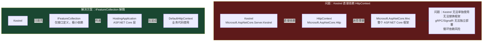
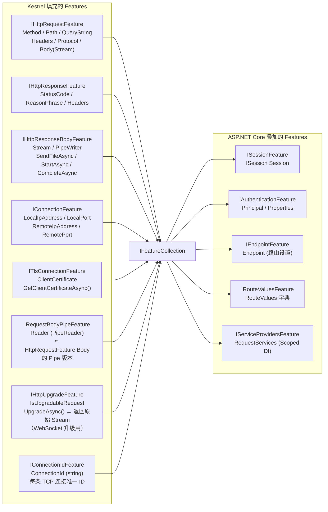
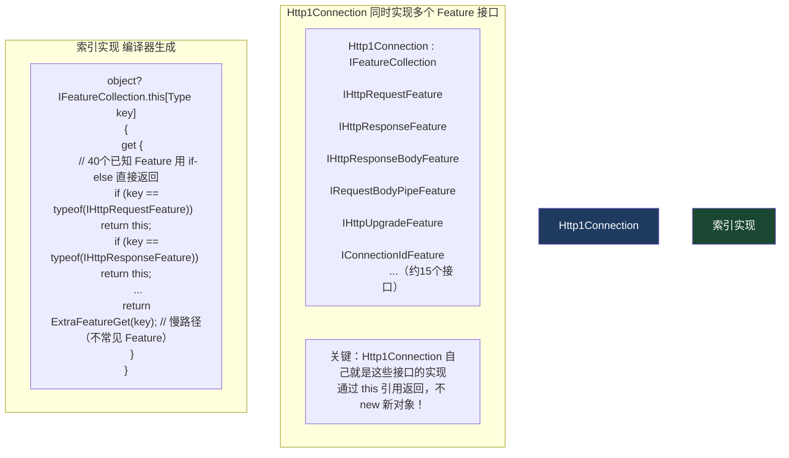
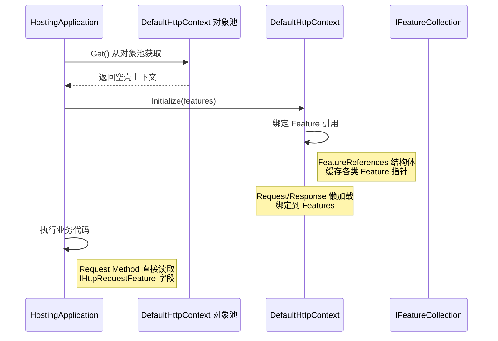
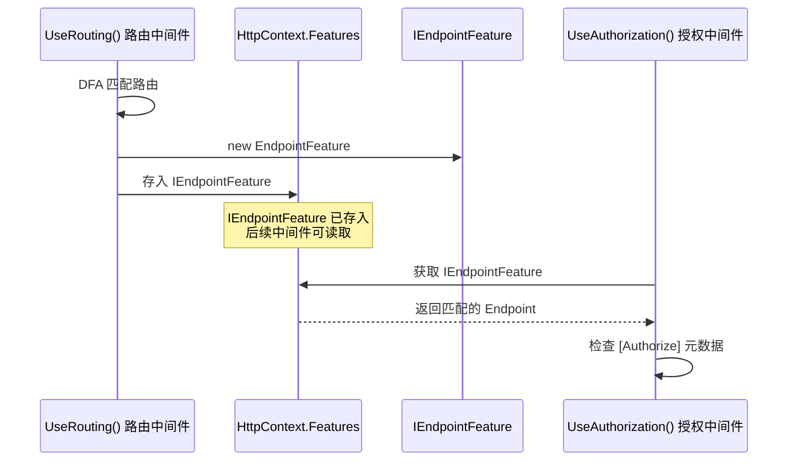
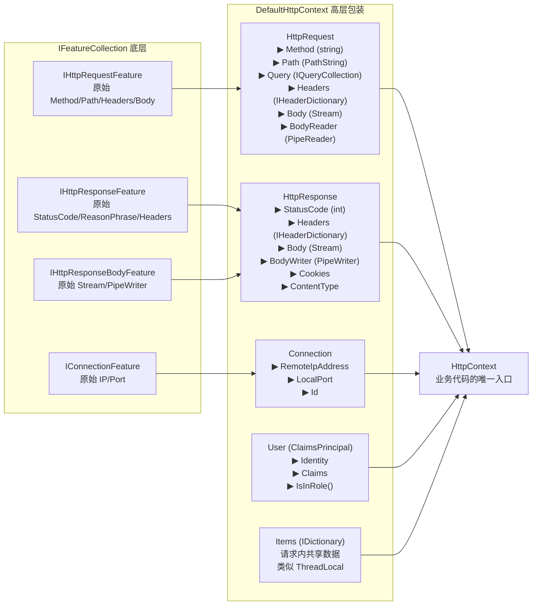

# 04 · IFeatureCollection：接口壁垒

> **本模块回答：** Kestrel 解析完 HTTP 请求后，为什么不直接创建 `HttpContext`？这个奇特的"特性集合"设计解决了什么问题？它在性能上有何特别之处？

---

## 一、为什么需要这层抽象



---

## 二、关键特性接口一览



---

## 三、高性能实现——数组，而非字典

`IFeatureCollection` 看起来是个接口，但其底层实现是精心优化的数组，而不是常规的 `Dictionary<Type, object>`。



**性能对比**：

```csharp
// 方式1：Dictionary<Type, object>（普通字典）
// 时间复杂度：O(1) 均摊，但有哈希计算开销
var feature = (IHttpRequestFeature)dictionary[typeof(IHttpRequestFeature)];
// 代价：计算 Type 哈希值、查字典、装箱/拆箱

// 方式2：IFeatureCollection 的 if-else 链（Kestrel 实现）
var feature = (IHttpRequestFeature)features[typeof(IHttpRequestFeature)];
// 实际执行：if (key == typeof(IHttpRequestFeature)) return this;
// 代价：单次引用比较（Type 对象按引用比较，O(1)）
// 比 Dictionary 快约 3-5 倍（省去哈希+冲突处理）

// 方式3：强类型扩展方法（最快，推荐写法）
var feature = features.Get<IHttpRequestFeature>();
// 等同于：(IHttpRequestFeature?)features[typeof(IHttpRequestFeature)]
// 加了泛型缓存，一次性取出不需要重复转型
```

---

## 四、`DefaultHttpContext` 如何绑定到 Feature



**`DefaultHttpContext` 的懒加载绑定**：

```csharp
// src/Http/Http/src/DefaultHttpContext.cs 关键片段

public override HttpRequest Request
{
    get
    {
        // Request 对象不是每次都 new 的！
        // DefaultHttpContext 持有 DefaultHttpRequest 成员字段（不是属性）
        // DefaultHttpRequest 本身是一个极轻的包装，只持有对 features 的引用
        return _request; // 直接返回成员字段
    }
}

// DefaultHttpRequest 内部实现
public override string Method
{
    get => HttpRequestFeature.Method;      // 透传到 Feature
    set => HttpRequestFeature.Method = value;
}

// IHttpRequestFeature 来自 FeatureReferences 的缓存
private IHttpRequestFeature HttpRequestFeature =>
    _features.Fetch(ref _request, Features) // 启动后缓存，下次直接用
    ?? EmptyRequestFeature; // 极少情况：Feature 不存在时的Fallback
```

---

## 五、Feature 的动态添加（中间件的扩展点）

`IFeatureCollection` 是可扩展的，中间件可以在请求处理过程中动态添加新 Feature：



**自定义 Feature 示例**：

```csharp
// 定义自定义 Feature 接口
public interface IRequestTimingFeature
{
    DateTime RequestStartedAt { get; }
    TimeSpan Elapsed { get; }
}

// 在中间件中注入此 Feature
public class RequestTimingMiddleware
{
    private readonly RequestDelegate _next;

    public async Task InvokeAsync(HttpContext context)
    {
        var feature = new RequestTimingFeature(DateTime.UtcNow);
        
        // 向 Features 集合动态添加新 Feature
        context.Features.Set<IRequestTimingFeature>(feature);
        
        await _next(context);
        
        // 后置处理
        var elapsed = feature.Elapsed;
        context.Response.Headers["X-Request-Duration"] = elapsed.TotalMilliseconds.ToString("F2");
    }
}

// 在 Controller 中使用（通过 HttpContext 获取）
public IActionResult GetSomething()
{
    var timing = HttpContext.Features.Get<IRequestTimingFeature>();
    _logger.LogInformation("Request processing took {Ms}ms", timing?.Elapsed.TotalMilliseconds);
    // ...
}
```

---

## 六、Feature 替换——运行时行为修改

`IFeatureCollection` 的另一个强大用途：替换现有 Feature 改变基础行为。

```csharp
// 场景：需要记录所有 HTTP 响应 Body 的内容（审计日志）
public class ResponseBodyLoggingMiddleware
{
    public async Task InvokeAsync(HttpContext context)
    {
        // 取出原始的响应 Body Feature
        var originalBodyFeature = context.Features.Get<IHttpResponseBodyFeature>()!;
        
        // 用包装器替换（Decorator 模式）
        var loggingFeature = new LoggingResponseBodyFeature(originalBodyFeature, _logger);
        context.Features.Set<IHttpResponseBodyFeature>(loggingFeature);
        
        await _next(context);
        
        // 恢复原始 Feature
        context.Features.Set<IHttpResponseBodyFeature>(originalBodyFeature);
    }
}

// 包装器：截取写入的每个字节
internal sealed class LoggingResponseBodyFeature : IHttpResponseBodyFeature
{
    private readonly IHttpResponseBodyFeature _inner;
    private readonly MemoryStream _buffer = new();

    public Stream Stream => new TeeStream(_inner.Stream, _buffer); // 流复制
    public PipeWriter Writer => PipeWriter.Create(Stream);

    // 其他接口方法委托给 _inner
    public Task CompleteAsync() => _inner.CompleteAsync();
    public void DisableBuffering() => _inner.DisableBuffering();
}
```

---

## 七、`HttpContext` vs `IFeatureCollection` 的关系



---

## 八、本模块总结

| 知识点 | 核心结论 |
|--------|---------|
| 为什么设计 IFeatureCollection | 解耦 Kestrel 和 ASP.NET Core，二者只共享微小的 Features 抽象包 |
| 高性能 if-else 索引 | 40 个常见 Feature 用 if-else 链直接返回，比 Dictionary 快 3-5 倍 |
| Http1Connection 自己就是 Feature | 不需要 new 新对象，通过 `return this` 实现多接口，零分配 |
| 动态添加 Feature | 中间件可在请求处理过程中向 Features 写入新数据，实现扩展 |
| Feature 替换 | 可以用 Decorator 替换现有 Feature 改变底层 IO 行为（如响应体记录） |
| DefaultHttpContext 懒加载 | Request/Response 属性通过 FeatureReferences 延迟绑定，首次访问后缓存 |

> **下一章**：Feature 集合准备好了，`HostingApplication` 如何用它孵化出 `DefaultHttpContext`，正式进入 ASP.NET Core 的领地？→ [05 · HostingApplication：交接点](05_HostingApplication交接点.md)
