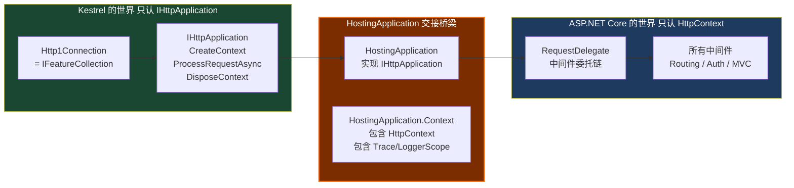
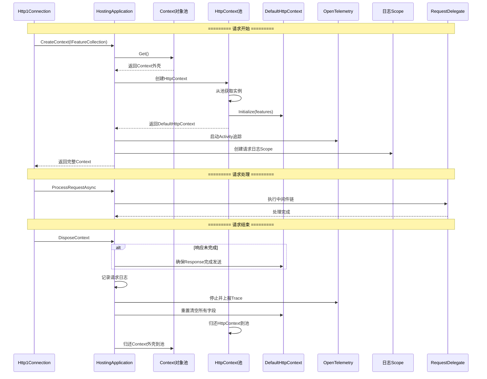
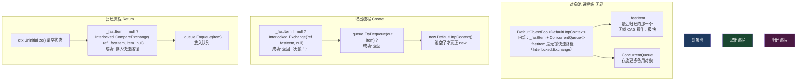
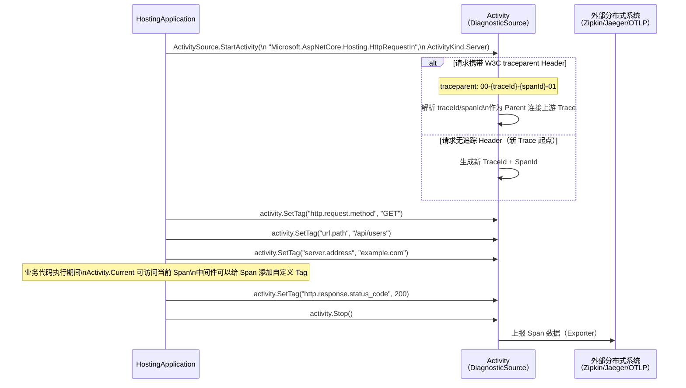
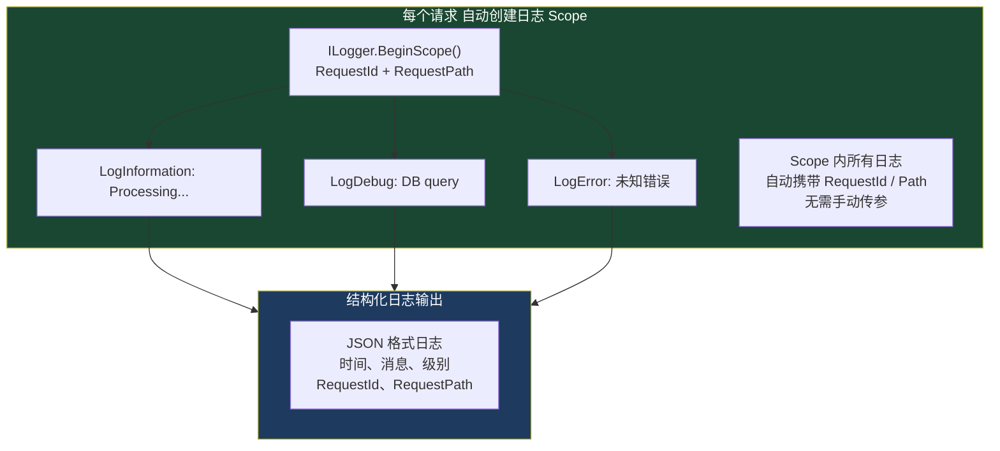
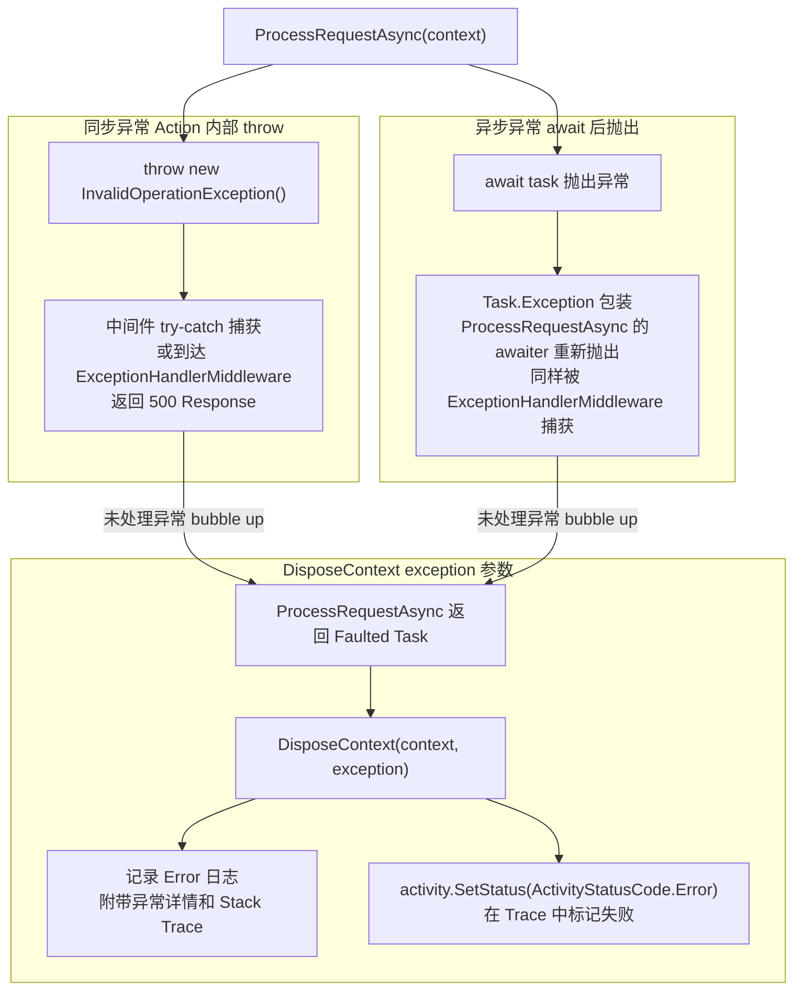

# 05 · HostingApplication：交接点

> **本模块回答：** `HostingApplication` 是整个框架最关键的一个类——它是 Kestrel 和 ASP.NET Core 握手的地方。`DefaultHttpContext` 是怎么从对象池里出来的？一个请求结束后，这个对象怎么被"清洗干净"归还？

---

## 一、`HostingApplication` 在整体架构中的位置



---

## 二、`IHttpApplication<TContext>` 接口精读

```csharp
// src/Http/Http.Abstractions/src/IHttpApplication.cs
// 这个接口是 Kestrel 和上层框架的"唯一合同"
// Kestrel 只通过这3个方法与上层交互，不知道 HttpContext 是什么

public interface IHttpApplication<TContext> where TContext : notnull
{
    // ① 请求解析完毕，创建应用上下文
    // features 就是 Http1Connection（同时实现 IFeatureCollection）
    TContext CreateContext(IFeatureCollection contextFeatures);

    // ② 应用处理请求（进入中间件管道）
    Task ProcessRequestAsync(TContext context);

    // ③ 请求结束（成功或异常），清理资源
    void DisposeContext(TContext context, Exception? exception);
}
```

---

## 三、完整生命周期时序（最详细版本）



---

## 四、`DefaultHttpContext` 对象池机制



**`Uninitialize()` 必须清理的所有字段**：

```csharp
// src/Http/Http/src/DefaultHttpContext.cs
internal void Uninitialize()
{
    // 解除 Feature 绑定（最重要！防止持有对 Http1Connection 的引用）
    _features.Initalize(EmptyFeatures.Instance);

    // 清空请求级数据
    _items = null;

    // 清空 DI 相关（防止 Scoped 服务泄漏）
    _serviceProviderSet = false;
    _requestServices = null;

    // 清空安全相关（防止用户身份泄漏到下一个请求！）
    User = null;

    // 清空追踪 ID
    TraceIdentifier = default;

    // 清空 WebSocket 状态
    _websockets = null;

    // 注意：_request 和 _response 字段不清零
    // 因为它们是值类型（结构体引用），下次 Initialize 时会重新绑定
    // 这是性能优化：避免 null 检查
}
```

---

## 五、OpenTelemetry Activity 集成



---

## 六、日志作用域（Log Scope）



---

## 七、`HostingApplication.Context` 结构

```csharp
// src/Hosting/Hosting/src/Internal/HostingApplication.cs

internal sealed class HostingApplication : IHttpApplication<HostingApplication.Context>
{
    private readonly RequestDelegate _application;
    private readonly IHttpContextFactory? _httpContextFactory;
    private readonly DefaultHttpContextFactory? _defaultHttpContextFactory;
    private readonly HostingApplicationDiagnostics _diagnostics;

    // 请求上下文包装（注意是 class，放对象池）
    internal sealed class Context
    {
        public HttpContext? HttpContext { get; set; }
        public IDisposable? Scope { get; set; }       // 日志 Scope
        public Activity? Activity { get; set; }       // OpenTelemetry Activity
        public long StartTimestamp { get; set; }      // 用于计算请求耗时
        public bool HasDiagnosticListener { get; set; }
        public bool EventLogEnabled { get; set; }
    }

    public Context CreateContext(IFeatureCollection contextFeatures)
    {
        // 对象池取外壳
        Context? hostContext;
        if (_contextPool is DefaultObjectPool<Context> pool)
            hostContext = pool.Get();
        else
            hostContext = new Context();

        // 对象池取 HttpContext（或 new 一个）
        HttpContext httpContext;
        if (_defaultHttpContextFactory is not null)
        {
            var defaultHttpContext = _defaultHttpContextFactory.CreateContext(contextFeatures);
            httpContext = defaultHttpContext;
        }
        else
        {
            // 用户自定义了 IHttpContextFactory
            httpContext = _httpContextFactory!.Create(contextFeatures);
        }

        // 诊断：记录请求开始（触发 DiagnosticSource 事件、创建 Activity）
        _diagnostics.BeginRequest(httpContext, hostContext);

        hostContext.HttpContext = httpContext;
        return hostContext;
    }

    public Task ProcessRequestAsync(Context context)
    {
        return _application(context.HttpContext!); // 进入中间件链
    }

    public void DisposeContext(Context context, Exception? exception)
    {
        var httpContext = context.HttpContext!;

        // 诊断：记录请求结束（停止 Activity、记录日志、触发 DiagnosticSource）
        _diagnostics.RequestEnd(httpContext, exception, context);

        // 归还 HttpContext
        if (_defaultHttpContextFactory is not null)
            _defaultHttpContextFactory.Dispose((DefaultHttpContext)httpContext);
        else
            _httpContextFactory!.Dispose(httpContext);

        // 重置 Context 外壳字段
        context.HttpContext = null;
        context.Scope = null;
        context.Activity = null;
        context.StartTimestamp = 0;

        // 归还 Context 外壳
        _contextPool?.Return(context);
    }
}
```

---

## 八、同步 vs 异步异常的处理差异



---

## 九、本模块总结

| 知识点 | 核心结论 |
|--------|---------|
| `IHttpApplication<TContext>` | Kestrel 与上层框架的唯一接口合同，3 个方法，完整隔离 |
| `CreateContext()` | 从两个对象池（Context + DefaultHttpContext）取空壳，Initialize 绑定 Feature |
| `ProcessRequestAsync()` | 直接调用中间件委托链，就是 `_application(httpContext)` |
| `DisposeContext()` | Uninitialize 清洗，归还两层对象池，停止 Activity，结束日志 Scope |
| 对象池快速路径 | `_fastItem` 用 CAS 无锁操作，99% 的请求走此路径，性能极高 |
| OpenTelemetry 集成 | 自动创建 Span，传播 W3C traceparent，支持分布式追踪 |
| 安全清洗 | `HttpContext.User = null` 是必须的！防止前一请求的身份信息泄漏到下一请求 |

> **下一章**：`DefaultHttpContext` 已准备就绪，进入 `RequestDelegate`（中间件链）。`IApplicationBuilder.Build()` 如何把分散注册的中间件折叠成一条委托链？→ [06 · 中间件管道：洋葱圈](06_中间件管道洋葱圈.md)
