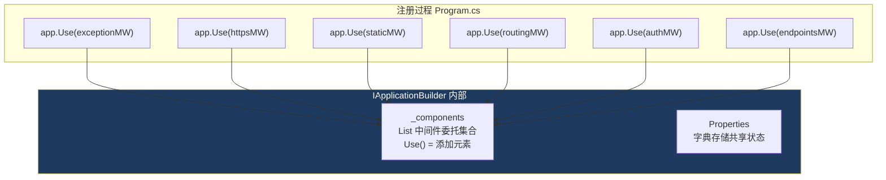
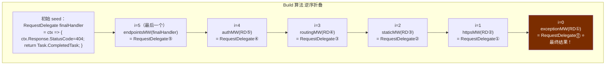
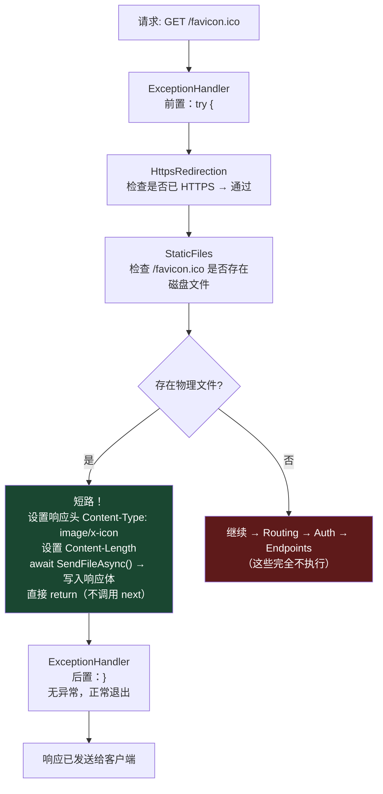
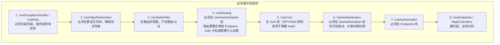

# 06 · 中间件管道：洋葱圈

> **本模块回答：** `app.Use()` / `app.Run()` 注册的那些中间件，是怎么被"编译"成一条单一委托链的？请求在运行时如何穿越这个洋葱圈？短路是怎么实现的？

---

## 一、`IApplicationBuilder` 内部数据结构



---

## 二、`Build()` 折叠过程——关键算法



**源码**：

```csharp
// src/Http/Http.Abstractions/src/Extensions/ApplicationBuilderExtensions.cs
public RequestDelegate Build()
{
    // seed：没有任何中间件匹配时，返回 404
    RequestDelegate app = context =>
    {
        // 请求走到管道末端，没有任何处理者
        // 若之前的中间件都没有写响应，这里置 404
        if (!context.Response.HasStarted)
        {
            context.Response.StatusCode = StatusCodes.Status404NotFound;
        }
        return Task.CompletedTask;
    };

    // 逆序遍历：第一个注册的中间件成为最外层（最先被调用，最后退出）
    for (var c = _components.Count - 1; c >= 0; c--)
    {
        app = _components[c](app); // 把"下一层"作为参数传入，产生"当前层"
    }

    return app; // 最外层 RequestDelegate，就是 ExceptionHandlerMiddleware
}
```

---

## 三、三种中间件注册方式对比

### 3.1 `app.Use()` —— 调用 next，请求可以继续

```csharp
// 最常用的方式：有前置和后置逻辑
app.Use(async (context, next) =>
{
    // ── 前置逻辑（请求进入时）──
    var sw = Stopwatch.StartNew();

    await next(context); // ← 调用后续中间件

    // ── 后置逻辑（响应返回时）──
    sw.Stop();
    context.Response.Headers["X-Elapsed-Ms"] = sw.ElapsedMilliseconds.ToString();
});

// 等同于（中间件工厂形式，多用于需要 DI 注入的中间件）
app.Use(next => async context =>
{
    var sw = Stopwatch.StartNew();
    await next(context);
    context.Response.Headers["X-Elapsed-Ms"] = sw.ElapsedMilliseconds.ToString();
});
```

### 3.2 `app.Run()` —— 不调用 next，终止管道

```csharp
// 终止符（Terminal Middleware）
// 从这里开始，后面注册的任何中间件都不会执行
app.Run(async context =>
{
    await context.Response.WriteAsync("Hello from terminal middleware!");
    // 没有 next() 调用 → 管道在此短路
});

// ⚠️ 注意：Run() 内部等价于：
app.Use(_ => async context => // 忽略 next 参数
{
    await context.Response.WriteAsync("...");
});
```

### 3.3 `app.Map()` —— 路径分叉

```csharp
// 按路径前缀创建子管道
app.Map("/api", apiApp =>
{
    apiApp.Use(async (ctx, next) =>
    {
        ctx.Response.Headers["X-Api-Version"] = "1.0";
        await next(ctx);
    });
    apiApp.MapControllers(); // 子管道的终点
});

app.Map("/health", healthApp =>
{
    // 完全独立的子管道，不受 /api 分支影响
    healthApp.Run(async ctx =>
    {
        await ctx.Response.WriteAsync("healthy");
    });
});

// Map 的内部实现：
// 检查 context.Request.Path.StartsWithSegments("/api")
// 若匹配，临时修改 Path（去掉前缀），进入子管道
// 处理完恢复原始 Path
```

---

## 四、洋葱圈运行时执行追踪

以一个完整请求 `GET /api/users` 为例，追踪执行路径：

```mermaid
sequenceDiagram
    participant K as Kestrel
    participant EX as ExceptionHandler<br/>（最外层）
    participant HT as HttpsRedirect
    participant ST as StaticFiles
    participant RT as Routing
    participant AU as Auth
    participant EP as Endpoints<br/>（最内层）
    participant BL as 业务代码

    K->>EX: await _app(context)

    rect rgb(20, 60, 40)
        Note over EX,BL: ── 请求进入（从外到内）──
        EX->>EX: try {
        EX->>HT: await next(context)
        HT->>HT: 检查 Is HTTPS? Yes → pass
        HT->>ST: await next(context)
        ST->>ST: 检查 /api/users 是否是静态文件? No
        ST->>RT: await next(context)
        RT->>RT: DFA 匹配路由
        RT->>RT: 设置 IEndpointFeature
        RT->>AU: await next(context)
        AU->>AU: 验证 JWT
        AU->>AU: 设置 HttpContext.User
        AU->>EP: await next(context)
        EP->>BL: Endpoint.RequestDelegate(context)
        BL->>BL: 查数据库...
        BL->>BL: context.Response.StatusCode = 200
        BL->>BL: await Response.WriteAsJsonAsync(data)
        BL-->>EP: Task 完成

        Note over EX,BL: ── 响应返回（从内到外）──
        EP-->>AU: Task 完成（后置逻辑可在此）
        AU-->>RT: Task 完成
        RT-->>ST: Task 完成
        ST-->>HT: Task 完成
        HT-->>EX: Task 完成
        EX->>EX: } // try 正常结束
    end

    EX-->>K: Task 完成
    K->>K: 通过 PipeWriter 发送响应
```



---

## 五、短路机制（Short-Circuit）



**短路的代码形态**：

```csharp
// StaticFilesMiddleware 的简化版本
public async Task InvokeAsync(HttpContext context)
{
    if (TryMatchFile(context.Request.Path, out var fileInfo))
    {
        // ── 成功找到文件，短路 ───────────────────────────────
        var contentType = _contentTypeProvider.TryGetContentType(
            fileInfo.Name, out var ct) ? ct : "application/octet-stream";

        context.Response.ContentType = contentType;
        context.Response.ContentLength = fileInfo.Length;

        // 添加 Cache-Control 支持（ETag / Last-Modified）
        SetResponseHeaders(context.Response, fileInfo);

        // 如果客户端发了 If-None-Match 且 ETag 一致 → 304 Not Modified
        if (IsNotModified(context, fileInfo))
        {
            context.Response.StatusCode = StatusCodes.Status304NotModified;
            return; // 不调用 next()，不写 body，直接返回
        }

        // 使用 kernel-level sendfile()（零拷贝文件发送）
        await context.Response.SendFileAsync(
            fileInfo.PhysicalPath!,
            offset: 0,
            count: fileInfo.Length
        );

        return; // ← 这里是短路的关键：不调用 _next(context)
    }

    // 没有匹配到文件，继续走管道
    await _next(context);
}
```

---

## 六、`IMiddleware` 接口 vs 约定式中间件

ASP.NET Core 支持两种中间件写法：

```csharp
// 方式1：约定式（基于 Invoke/InvokeAsync 方法名，反射发现）
public class TimingMiddleware
{
    private readonly RequestDelegate _next;
    private readonly ILogger<TimingMiddleware> _logger; // DI 注入到构造函数

    public TimingMiddleware(RequestDelegate next, ILogger<TimingMiddleware> logger)
    {
        _next = next;
        _logger = logger;
    }

    // 方法名必须是 InvokeAsync 或 Invoke
    // 额外的服务可以通过方法参数 DI 注入（Scoped 服务只能在这里注入，不能在构造函数）
    public async Task InvokeAsync(HttpContext context, IMyService myService)
    {
        var sw = Stopwatch.StartNew();
        await _next(context);
        _logger.LogInformation("Request took {Ms}ms", sw.ElapsedMilliseconds);
    }
}

app.UseMiddleware<TimingMiddleware>(); // 注册

// ──────────────────────────────────────────────────────────────────

// 方式2：IMiddleware 接口（强类型，可被 DI 注入，可以是 Scoped 生命周期）
public class TimingMiddleware : IMiddleware
{
    private readonly IMyService _myService; // 可以是 Scoped 服务！

    public TimingMiddleware(IMyService myService) => _myService = myService;

    public async Task InvokeAsync(HttpContext context, RequestDelegate next)
    {
        await next(context);
    }
}

// 必须手动注册服务
builder.Services.AddScoped<TimingMiddleware>();
app.UseMiddleware<TimingMiddleware>();
```

**两种方式的核心区别**：

| 特性 | 约定式 | `IMiddleware` 接口 |
|------|--------|-------------------|
| 构造函数生命周期 | Singleton（随管道创建一次） | 任意（按 DI 注册决定） |
| 额外参数注入 | 方法参数（每次请求解析） | 构造函数（按生命周期） |
| Scoped 服务支持 | 通过方法参数（推荐） | 通过构造函数（可以是 Scoped） |
| 发现方式 | 反射查找 `InvokeAsync` | 类型实现 `IMiddleware` 接口 |

---

## 七、中间件顺序的铁律



**常见错误：把 UseAuthorization 放在 UseRouting 之前**

```csharp
// ❌ 错误：Auth 在 Routing 之前，无法读取 Endpoint 上的 [Authorize] 特性
app.UseAuthorization();  // 不知道目标 Endpoint 是什么
app.UseRouting();        // 此时才确定 Endpoint

// ✅ 正确
app.UseRouting();        // 匹配 Endpoint，设置 IEndpointFeature
app.UseAuthorization();  // 读取 Endpoint.Metadata 上的 [Authorize] 配置
app.MapControllers();
```

---

## 八、本模块总结

| 知识点 | 核心结论 |
|--------|---------|
| `_components` 列表 | 保存中间件工厂函数，`Build()` 时逆序折叠成单一 `RequestDelegate` |
| 逆序折叠 | 最先注册的中间件成为最外层，最后注册的成为最内层（洋葱圈） |
| 短路 | 中间件直接 `return`，不调用 `next()`，后续中间件完全不执行 |
| `Use` vs `Run` vs `Map` | Use：可继续；Run：终止；Map：路径分叉子管道 |
| 中间件顺序 | Routing 必须在 Auth 前；Auth 必须在 Endpoints 前；不可颠倒 |
| 约定式 vs IMiddleware | 约定式更灵活（方法参数注入 Scoped）；IMiddleware 更类型安全 |

> **下一章**：`EndpointRoutingMiddleware` 内部是如何匹配路由的？DFA 图是怎么构建的？→ [07 · 路由系统：DFA 匹配](07_路由系统DFA匹配.md)
