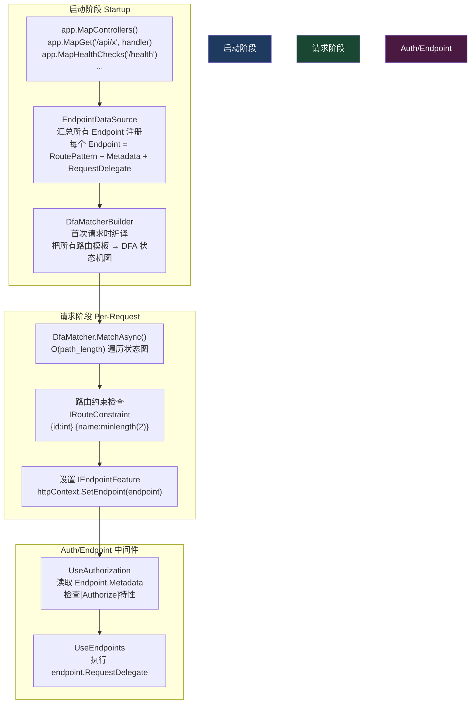
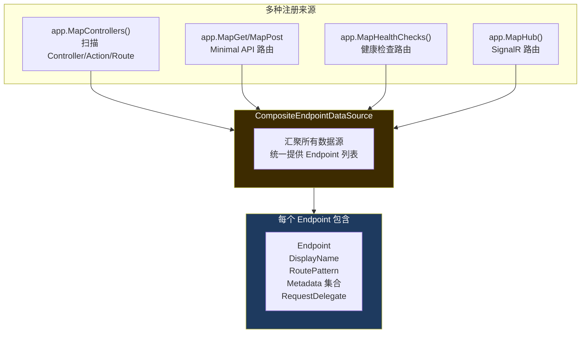
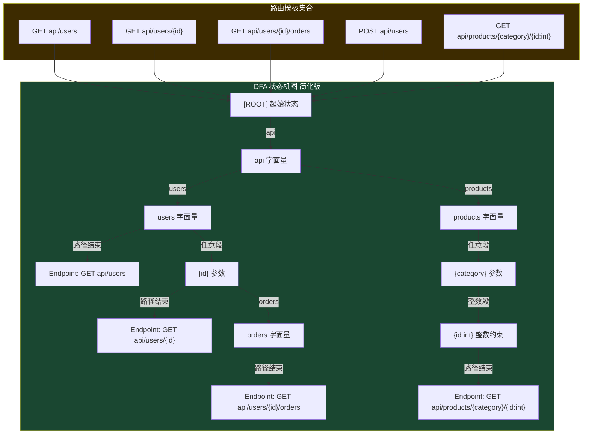
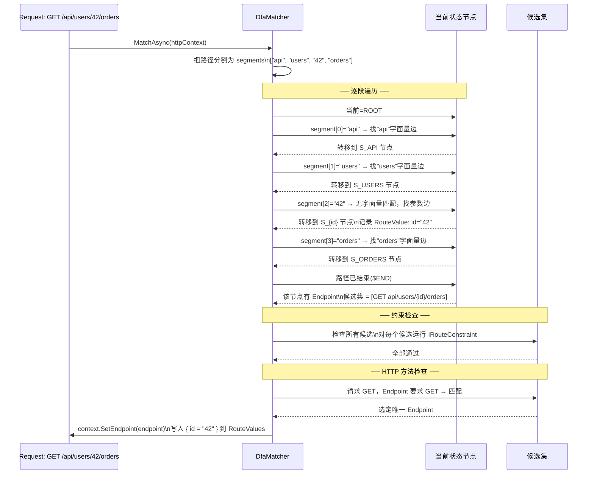
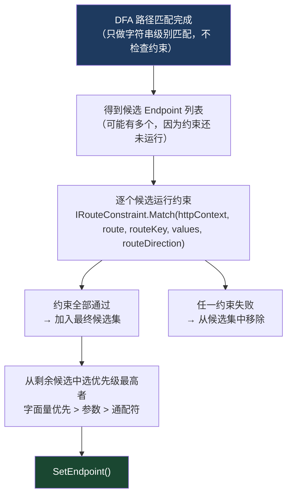
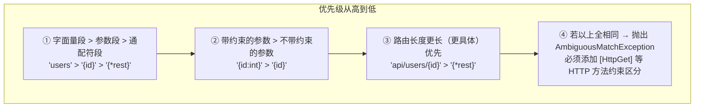
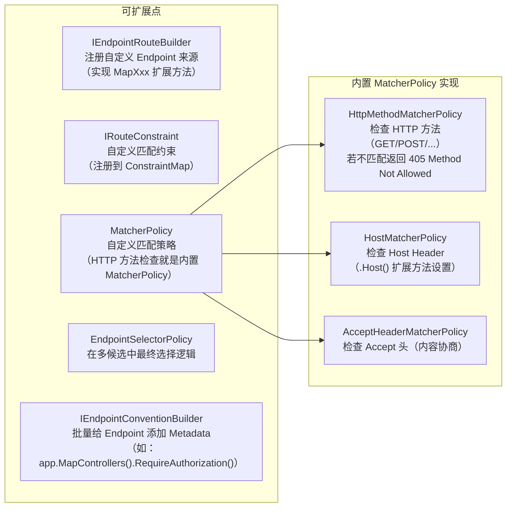

# 07 · 路由系统：DFA 匹配

> **本模块回答：** `app.MapControllers()` 注册的那些路由，是如何在运行时被极速匹配的？DFA（确定有限自动机）图是怎么构建和遍历的？路由约束又是如何参与匹配的？

---

## 一、路由系统全局架构



---

## 二、`EndpointDataSource`——路由注册的汇聚点



**`RoutePattern` 解析示例**：

```csharp
// 路由模板: "api/orders/{id:int}/items/{itemId:guid?}"
// 解析后的 RoutePattern 包含：
RoutePattern {
    RawText = "api/orders/{id:int}/items/{itemId:guid?}",
    PathSegments = [
        // Literal segment "api"
        RoutePatternPathSegment { Parts = [RoutePatternLiteralPart("api")] },
        // Literal segment "orders"  
        RoutePatternPathSegment { Parts = [RoutePatternLiteralPart("orders")] },
        // Parameter {id:int} - required, with int constraint
        RoutePatternPathSegment { Parts = [RoutePatternParameterPart {
            Name = "id",
            IsOptional = false,
            ParameterPolicies = [RoutePatternConstraintReference("int")]
        }]},
        // Literal segment "items"
        RoutePatternPathSegment { ... },
        // Parameter {itemId:guid?} - optional, with guid constraint
        RoutePatternPathSegment { Parts = [RoutePatternParameterPart {
            Name = "itemId",
            IsOptional = true,  // ? 表示可选
            ParameterPolicies = [RoutePatternConstraintReference("guid")]
        }]},
    ]
}
```

---

## 三、DFA 图构建——启动时的"编译"过程

> **核心思想**：把所有路由模板预编译成一个确定有限自动机（DFA）图。匹配时按路径段（`/` 分割）逐段遍历状态图，每段只做一次 O(1) 查找，整体复杂度 O(路径段数)。



**关键源码（`DfaMatcherBuilder.cs` 简化版）**：

```csharp
// src/Http/Routing/src/Matching/DfaMatcherBuilder.cs

internal sealed class DfaMatcherBuilder
{
    private readonly List<RouteEndpoint> _endpoints = new();

    public void AddEndpoint(RouteEndpoint endpoint)
    {
        _endpoints.Add(endpoint);
    }

    public DfaMatcher Build()
    {
        // 第1步：构建 DFA 树（Trie 结构）
        var tree = new DfaNode { PathDepth = 0, Label = "ROOT" };
        foreach (var endpoint in _endpoints)
        {
            // 把每个路由模板的每个 PathSegment 插入树
            AddEndpoint(tree, endpoint.RoutePattern, endpoint);
        }

        // 第2步：按"优先级"排序同一节点下的候选 Endpoint
        // 字面量 > 参数型 > 通配符（catch-all {*rest}）
        // 这决定了匹配歧义时选哪一个
        tree.Visit(node => node.Matches?.Sort(EndpointComparer.Default));

        // 第3步：把树结构扁平化为数组（提高缓存局部性）
        // 数组每个元素 = 一个 DFA 节点，通过 index 引用子节点
        return CreateDfaMatcher(tree);
    }
}
```

---

## 四、DFA 匹配算法——运行时每个请求的执行



**核心匹配循环（简化版）**：

```csharp
// src/Http/Routing/src/Matching/DfaMatcher.cs

public override async Task MatchAsync(HttpContext httpContext)
{
    var path = httpContext.Request.Path.Value!;

    // 按 '/' 分割路径，使用栈分配避免数组分配
    Span<PathSegment> pathSegments = stackalloc PathSegment[128];
    var count = FastPathTokenizer.Tokenize(path, pathSegments);

    // 初始化候选集（栈分配）
    var candidates = new CandidateSet(/* ... */);

    // ── 核心：DFA 状态遍历 ──
    var states = _states; // 预编译的状态数组
    var currentStateIndex = 0; // 从 ROOT 开始

    for (var i = 0; i < count; i++)
    {
        var segment = pathSegments[i];
        ref var currentState = ref states[currentStateIndex];

        // 1. 先尝试字面量匹配（最快：数组二分查找）
        var literal = path.AsSpan(segment.Start, segment.Length);
        if (TryGetLiteralTransition(currentState, literal, out var nextState))
        {
            currentStateIndex = nextState;
            continue;
        }

        // 2. 字面量未命中，尝试参数段匹配（记录捕获值）
        if (currentState.HasParameterTransition)
        {
            // 把该段值存入 candidates[i].values
            RecordParameterValue(candidates, i, segment, path);
            currentStateIndex = currentState.ParameterTransitionIndex;
            continue;
        }

        // 3. 通配符匹配（catch-all {*rest}）
        if (currentState.HasCatchAllTransition)
        {
            RecordCatchAllValue(candidates, i, count, path);
            break;
        }

        // 4. 无任何转移：此路径不匹配任何路由
        return; // 匹配失败，不设置 Endpoint
    }

    // ── 路径遍历完毕，检查终止状态是否有 Endpoint ──
    ref var finalState = ref states[currentStateIndex];
    if (finalState.Matches != null)
    {
        // 运行路由约束筛选
        ProcessCandidates(httpContext, candidates, finalState.Matches);
    }
}
```

---

## 五、路由约束（`IRouteConstraint`）

### 5.1 内置约束一览

| 约束语法 | 对应类 | 匹配规则 |
|---------|--------|---------|
| `{id:int}` | `IntRouteConstraint` | `int.TryParse(value)` |
| `{id:long}` | `LongRouteConstraint` | `long.TryParse(value)` |
| `{id:guid}` | `GuidRouteConstraint` | `Guid.TryParse(value)` |
| `{id:bool}` | `BoolRouteConstraint` | `bool.TryParse(value)` |
| `{name:minlength(3)}` | `MinLengthRouteConstraint` | `value.Length >= 3` |
| `{name:maxlength(10)}` | `MaxLengthRouteConstraint` | `value.Length <= 10` |
| `{name:regex(^[a-z]+$)}` | `RegexRouteConstraint` | 正则匹配 |
| `{id:min(1)}` | `MinRouteConstraint` | `int.Parse(value) >= 1` |
| `{id:range(1,100)}` | `RangeRouteConstraint` | `1 <= int.Parse(value) <= 100` |
| `{path:alpha}` | `AlphaRouteConstraint` | 只含字母 |
| `{file:required}` | `RequiredRouteConstraint` | 不为空字符串 |

### 5.2 约束执行时机



### 5.3 自定义约束

```csharp
// 实现自定义约束：只匹配已知的产品类别
public class ProductCategoryConstraint : IRouteConstraint
{
    private static readonly HashSet<string> _validCategories =
        new(StringComparer.OrdinalIgnoreCase) { "electronics", "clothing", "food" };

    public bool Match(
        HttpContext? httpContext,
        IRouter? route,
        string routeKey,
        RouteValueDictionary values,
        RouteDirection routeDirection)  // routeDirection: Incoming(请求匹配) 或 UrlGeneration(生成URL)
    {
        if (!values.TryGetValue(routeKey, out var value))
            return false;

        return _validCategories.Contains(value?.ToString() ?? "");
    }
}

// 注册
builder.Services.AddRouting(options =>
{
    options.ConstraintMap.Add("productcategory", typeof(ProductCategoryConstraint));
});

// 使用
app.MapGet("/products/{category:productcategory}", handler);
// GET /products/electronics → 匹配
// GET /products/unknown    → 不匹配（404）
```

---

## 六、路由歧义与优先级规则

当多个路由可以匹配同一路径时，ASP.NET Core 按以下优先级选择：



**实际示例**：

```csharp
// 案例： GET /api/users/42

app.MapGet("/api/users/{id:int}", ctx => /* 处理器A */ );   // 优先级高（有int约束）
app.MapGet("/api/users/{id}", ctx => /* 处理器B */ );        // 优先级低（无约束）
app.MapGet("/api/{**rest}", ctx => /* 处理器C */ );          // 最低（通配符）

// GET /api/users/42  → 处理器A（42 满足 int 约束，优先）
// GET /api/users/abc → 处理器B（abc 不满足 int 约束，跳到 B）
// GET /api/anything  → 处理器C

// ⚠️ 这会抛出 AmbiguousMatchException（两个路由完全等价）：
app.MapGet("/api/users/{name}", ctx => /* C */ );
app.MapGet("/api/users/{id}", ctx => /* D */ );
// 解决：给其中一个加约束，或用 HTTP 方法区分
```

---

## 七、`IEndpointFeature` 与 `RouteValues`

匹配成功后，路由中间件向 `HttpContext` 的 `IFeatureCollection` 写入两个关键 Feature：

```csharp
// UseRouting 中间件执行完毕后，HttpContext 被增强：

// Feature 1: IEndpointFeature → 存储匹配到的 Endpoint
var endpoint = httpContext.GetEndpoint();
// endpoint.Metadata 包含该 Action 上的所有特性：
// [Authorize], [HttpGet], [Produces("application/json")], [ApiController]...

// Feature 2: IRouteValuesFeature → 存储路由参数
var id = httpContext.GetRouteValue("id"); // "42" (string)
// 或者强类型读取（模型绑定阶段会做，详见第09章）
var idInt = httpContext.GetRouteData().Values["id"]; // "42"

// UseAuthorization 中间件使用 IEndpointFeature：
// endpoint.Metadata.GetMetadata<IAuthorizeData>()
// → 找到 [Authorize] 特性 → 触发认证授权检查

// UseEndpoints 中间件：
// endpoint.RequestDelegate(httpContext)  // 执行最终处理器
```

---

## 八、`LinkGenerator`——路由的反向操作（URL 生成）

```csharp
// 注入 LinkGenerator（不需要 HttpContext！）
public class OrderController : ControllerBase
{
    private readonly LinkGenerator _linkGenerator;

    public OrderController(LinkGenerator linkGenerator)
    {
        _linkGenerator = linkGenerator;
    }

    [HttpPost]
    public IActionResult Create(CreateOrderDto dto)
    {
        var order = CreateOrder(dto);

        // URL 生成：根据路由名称 + 参数值 → URL 字符串
        // 内部：也走 DFA 图，但方向相反（输入参数 → 遍历路由模板 → 生成URL）
        var url = _linkGenerator.GetPathByName(
            HttpContext,
            "GetOrderById",      // Route Name（在[HttpGet("{id}", Name="GetOrderById")]中定义）
            new { id = order.Id }
        );
        // 若路由模板是 "api/orders/{id:int}" + id=42 → "/api/orders/42"

        return Created(url, order);
    }
}

// 也可以生成完整 URI（含 host）
var absoluteUri = _linkGenerator.GetUriByName(
    HttpContext,
    "GetOrderById",
    new { id = 1 },
    scheme: "https",
    host: new HostString("example.com")
);
// → "https://example.com/api/orders/1"
```

---

## 九、路由系统的扩展点



---

## 十、本模块总结

| 知识点 | 核心结论 |
|--------|---------|
| `EndpointDataSource` | 汇聚所有路由注册来源，每个 Endpoint 包含 RoutePattern + Metadata + RequestDelegate |
| DFA 编译 | 启动时（首次请求前）把所有路由模板编译为确定有限自动机图 |
| 匹配复杂度 | O(路径段数)，与路由数量无关；100 条路由和 10000 条路由性能相同 |
| 约束执行 | DFA 先做字符串匹配得到候选集，再逐个运行 `IRouteConstraint` 筛选 |
| 优先级 | 字面量 > 带约束参数 > 无约束参数 > 通配符；完全歧义抛异常 |
| `IEndpointFeature` | 匹配成功后写入 HttpContext，AuthZ 和 Endpoint 中间件都依赖它 |
| `LinkGenerator` | 路由的反向操作，参数 → URL，无需 HttpContext |

> **下一章**：路由匹配到 Endpoint 后，`UseAuthentication` 和 `UseAuthorization` 是如何验证身份和权限的？JWT 是怎么被解析的？→ [08 · 认证与授权](08_认证授权.md)
