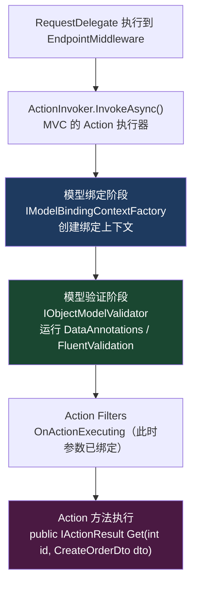
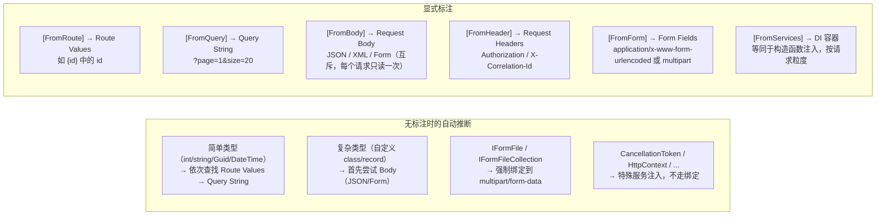
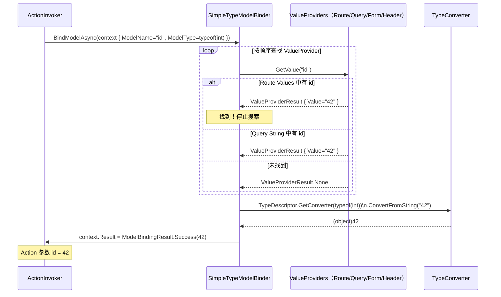
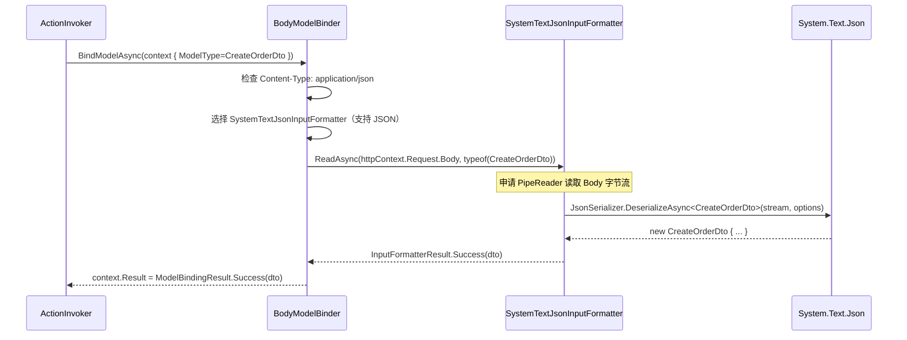
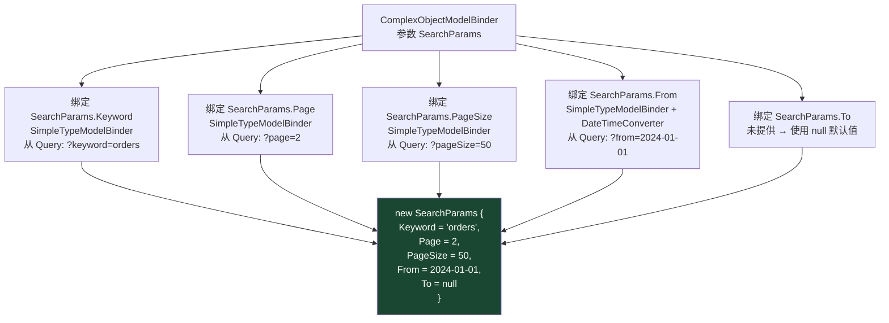
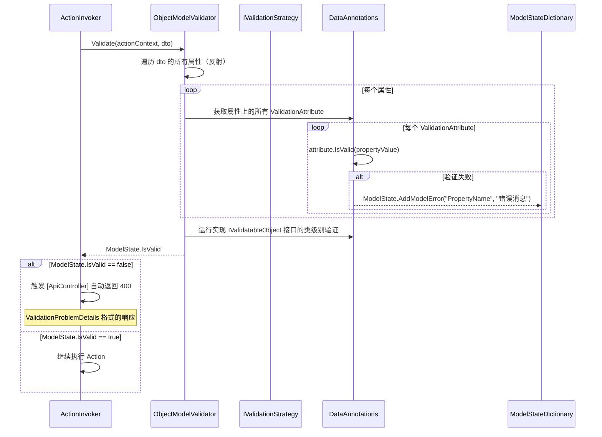

# 09 · 模型绑定与验证

> **本模块回答：** Controller Action 的参数（`int id`、`CreateOrderDto dto`、`[FromHeader]`）是从哪里来的？`IModelBinder` 如何把 HTTP 原始字符串变成强类型 C# 对象？`[Required]`、`[Range]` 等验证特性是何时触发的？

---

## 一、模型绑定在执行管道中的位置



---

## 二、绑定来源优先级

ASP.NET Core 按以下优先级从请求中查找参数值（无 `[From*]` 标注时自动推断）：



---

## 三、`IModelBinder` 接口与绑定器链

```mermaid
graph TB
    subgraph ModelBinderProviders 链式查找
        P1["BindingInfoBinder — 处理 [FromXxx] 显式绑定"]
        P2["ServicesModelBinderProvider — 处理 [FromServices]"]
        P3["BodyModelBinderProvider — Content-Type: application/json → JsonInputFormatter"]
        P4["FormFileModelBinderProvider — IFormFile 参数"]
        P5["RouteValueProviderFactory — Route Values"]
        P6["QueryStringValueProviderFactory — Query String"]
        P7["FormValueProviderFactory — Form Body"]
        P8["HeaderValueProviderFactory — Headers"]
        P9["ComplexObjectModelBinderProvider — 复杂对象（递归绑定属性）"]
        P10["SimpleTypeModelBinderProvider — 简单类型（string/int/bool/Guid...）"]
    end

    P1 --> P2 --> P3 --> P4 --> P5 --> P6 --> P7 --> P8 --> P9 --> P10

    style P3 fill:#1a4731,color:#fff
    style P9 fill:#1e3a5f,color:#fff
```



**绑定器提供器的 `GetBinder()` 方法**：

```csharp
// 绑定器提供器 Provider：判断是否能处理这个参数，能则返回对应绑定器
public interface IModelBinderProvider
{
    // 返回 null 表示"我不处理这个参数，交给下一个 Provider"
    IModelBinder? GetBinder(ModelBinderProviderContext context);
}

// 实际绑定器 Binder：执行绑定逻辑
public interface IModelBinder
{
    Task BindModelAsync(ModelBindingContext bindingContext);
}
```

---

## 四、简单类型绑定——以 `int id` 为例



**处理绑定失败**：

```csharp
// 若 ?id=abc（无法转为 int），绑定失败：
// context.ModelState.AddModelError("id", "The value 'abc' is not valid.")
// context.Result = ModelBindingResult.Failed()
// → 模型状态无效，Action 内 ModelState.IsValid == false
```

---

## 五、复杂类型绑定——以 `[FromBody] CreateOrderDto dto` 为例



**关键源码（`BodyModelBinder.cs` 简化版）**：

```csharp
// src/Mvc/Mvc.Core/src/ModelBinding/Binders/BodyModelBinder.cs

public async Task BindModelAsync(ModelBindingContext bindingContext)
{
    // 每个请求的 Body 只能读取一次！（不可重放流）
    // 若已有其他绑定器读过 Body，这里会失败
    // [FromBody] 和 [FromForm] 不能同时用

    var request = bindingContext.HttpContext.Request;
    var inputFormatters = bindingContext.HttpContext.RequestServices
        .GetRequiredService<IOptions<MvcOptions>>().Value.InputFormatters;

    // 选择合适的 InputFormatter（按 Content-Type 匹配）
    var formatterContext = new InputFormatterContext(
        bindingContext.HttpContext,
        bindingContext.FieldName,
        bindingContext.ModelState,
        bindingContext.ModelMetadata,
        readStream: (stream, encoding) => /* 读取Body的工厂方法 */
    );

    IInputFormatter? formatter = null;
    for (var i = 0; i < inputFormatters.Count; i++)
    {
        if (inputFormatters[i].CanRead(formatterContext))
        {
            formatter = inputFormatters[i];
            break;
        }
    }

    if (formatter == null)
    {
        // 没有合适的 Formatter → 415 Unsupported Media Type
        bindingContext.ModelState.AddModelError(
            bindingContext.ModelName,
            "No input formatter found for content type.");
        return;
    }

    // 调用 Formatter 读取并反序列化
    var result = await formatter.ReadAsync(formatterContext);

    if (result.HasError)
        return; // ModelState 已被添加错误

    if (result.IsModelSet)
    {
        bindingContext.Result = ModelBindingResult.Success(result.Model);
    }
}
```

---

## 六、自定义类型绑定——`record` 的属性递归绑定

当参数无 `[FromBody]` 时，复杂类型通过 `ComplexObjectModelBinder` 递归绑定每个属性：

```csharp
// 假设 Action 定义：
// [HttpGet]
// public IActionResult Search([FromQuery] SearchParams searchParams)
//
// SearchParams 的每个属性各自绑定：
public record SearchParams
{
    public string? Keyword { get; init; }    // ?keyword=xxx
    public int Page { get; init; } = 1;      // ?page=2
    public int PageSize { get; init; } = 20; // ?pageSize=50
    public DateTime? From { get; init; }     // ?from=2024-01-01
    public DateTime? To { get; init; }       // ?to=2024-12-31
}
```



---

## 七、模型验证

### 7.1 DataAnnotations 验证

```csharp
public class CreateOrderDto
{
    [Required(ErrorMessage = "产品ID不能为空")]
    public int ProductId { get; set; }

    [Range(1, 9999, ErrorMessage = "数量必须在1到9999之间")]
    public int Quantity { get; set; }

    [StringLength(500, MinimumLength = 10, ErrorMessage = "备注长度需在10~500字之间")]
    public string? Remark { get; set; }

    [EmailAddress(ErrorMessage = "邮箱格式不正确")]
    public string? NotifyEmail { get; set; }

    [RegularExpression(@"^\d{4}-\d{4,10}$", ErrorMessage = "订单外部ID格式错误")]
    public string? ExternalOrderId { get; set; }

    // 自定义验证特性
    [FutureDateOnly]
    public DateTime? DeliveryDate { get; set; }
}

// 自定义验证特性
public class FutureDateOnlyAttribute : ValidationAttribute
{
    protected override ValidationResult? IsValid(object? value, ValidationContext context)
    {
        if (value is DateTime date && date <= DateTime.Today)
            return new ValidationResult("交货日期必须是未来日期");

        return ValidationResult.Success;
    }
}
```

### 7.2 验证执行时序



### 7.3 `[ApiController]` 自动验证与 ProblemDetails

```csharp
// [ApiController] 特性自动处理模型验证失败
// 无需在每个 Action 中写 if (!ModelState.IsValid) return BadRequest(ModelState);

// 自动返回的响应：
// HTTP 400 Bad Request
// Content-Type: application/problem+json
{
    "type": "https://tools.ietf.org/html/rfc7231#section-6.5.1",
    "title": "One or more validation errors occurred.",
    "status": 400,
    "traceId": "00-abc123...-01",
    "errors": {
        "ProductId": ["产品ID不能为空"],
        "Quantity": ["数量必须在1到9999之间"],
        "NotifyEmail": ["邮箱格式不正确"]
    }
}

// 自定义 ProblemDetails 工厂（统一错误格式）
builder.Services.AddProblemDetails(options =>
{
    options.CustomizeProblemDetails = ctx =>
    {
        ctx.ProblemDetails.Extensions["requestId"] = ctx.HttpContext.TraceIdentifier;
        ctx.ProblemDetails.Extensions["timestamp"] = DateTimeOffset.UtcNow;
    };
});
```

### 7.4 FluentValidation（替代 DataAnnotations）

```csharp
// 安装：dotnet add package FluentValidation.AspNetCore

public class CreateOrderDtoValidator : AbstractValidator<CreateOrderDto>
{
    private readonly IProductRepository _productRepository;

    public CreateOrderDtoValidator(IProductRepository productRepository)
    {
        _productRepository = productRepository; // DI 注入，支持异步验证

        RuleFor(x => x.ProductId)
            .NotEmpty().WithMessage("产品ID不能为空")
            .GreaterThan(0).WithMessage("产品ID必须大于0")
            .MustAsync(ProductExistsAsync).WithMessage("产品不存在"); // 异步数据库验证！

        RuleFor(x => x.Quantity)
            .InclusiveBetween(1, 9999).WithMessage("数量必须在1到9999之间");

        RuleFor(x => x.NotifyEmail)
            .EmailAddress().WithMessage("邮箱格式不正确")
            .When(x => x.NotifyEmail != null); // 条件验证

        // 级联规则
        RuleFor(x => x.DeliveryDate)
            .GreaterThan(DateTime.Today).WithMessage("交货日期必须是未来日期")
            .When(x => x.DeliveryDate.HasValue);
    }

    private async Task<bool> ProductExistsAsync(
        int productId, CancellationToken ct)
    {
        return await _productRepository.ExistsAsync(productId, ct);
    }
}

// 注册到 DI
builder.Services.AddFluentValidationAutoValidation();
builder.Services.AddValidatorsFromAssemblyContaining<CreateOrderDtoValidator>();
// FluentValidation 自动替换 DataAnnotations 的验证流程
```

---

## 八、自定义模型绑定器

```csharp
// 场景：从自定义 Header "X-Tenant-Id" 绑定租户 ID

// 1. 实现绑定器
public class TenantIdModelBinder : IModelBinder
{
    public Task BindModelAsync(ModelBindingContext bindingContext)
    {
        var headerValue = bindingContext.HttpContext.Request.Headers["X-Tenant-Id"]
            .FirstOrDefault();

        if (string.IsNullOrEmpty(headerValue))
        {
            // NoResult 表示"没找到值"（与 Failed 不同，后者表示"找到了但格式错误"）
            bindingContext.Result = ModelBindingResult.NoResult();
            return Task.CompletedTask;
        }

        if (!Guid.TryParse(headerValue, out var tenantId))
        {
            bindingContext.ModelState.AddModelError(
                bindingContext.ModelName,
                $"X-Tenant-Id '{headerValue}' 不是有效的 Guid。");
            bindingContext.Result = ModelBindingResult.Failed();
            return Task.CompletedTask;
        }

        bindingContext.Result = ModelBindingResult.Success(tenantId);
        return Task.CompletedTask;
    }
}

// 2. 实现 Provider
public class TenantIdModelBinderProvider : IModelBinderProvider
{
    public IModelBinder? GetBinder(ModelBinderProviderContext context)
    {
        if (context.Metadata.ModelType == typeof(Guid) &&
            context.Metadata.ContainerType?.Name.EndsWith("Controller") == true)
        {
            // 只对 Controller 中 Guid 类型的参数生效
        }

        // 更精确：只处理带 [TenantId] 特性的参数
        if (context.Metadata.ParameterType == typeof(Guid) &&
            context.BindingInfo?.BindingSource == null)
        {
            // 让其他 Provider 处理
        }

        return null;
    }
}

// 3. 直接用特性标注（最简洁的方式）
[ModelBinder(typeof(TenantIdModelBinder))]
public Guid TenantId { get; set; }  // 或在参数上标注

// 使用
[HttpGet]
public IActionResult Get(
    [ModelBinder(typeof(TenantIdModelBinder))] Guid tenantId,
    [FromQuery] SearchParams search) { ... }
```

---

## 九、`IValueProvider` 与绑定来源扩展

```csharp
// 自定义 ValueProvider：从 JWT Claims 中读取值
// （避免在每个 Action 中手动读取 User.FindFirstValue）

public class JwtClaimsValueProvider : IValueProvider
{
    private readonly ClaimsPrincipal _user;

    public JwtClaimsValueProvider(ClaimsPrincipal user)
    {
        _user = user;
    }

    public bool ContainsPrefix(string prefix) =>
        _user.FindFirst(prefix) != null;

    public ValueProviderResult GetValue(string key)
    {
        var claimValue = _user.FindFirstValue(key);
        return claimValue != null
            ? new ValueProviderResult(new StringValues(claimValue))
            : ValueProviderResult.None;
    }
}

// 注册 ValueProvider Factory
public class JwtClaimsValueProviderFactory : IValueProviderFactory
{
    public Task CreateValueProviderAsync(ValueProviderFactoryContext context)
    {
        var user = context.ActionContext.HttpContext.User;
        context.ValueProviders.Add(new JwtClaimsValueProvider(user));
        return Task.CompletedTask;
    }
}

builder.Services.Configure<MvcOptions>(options =>
{
    options.ValueProviderFactories.Add(new JwtClaimsValueProviderFactory());
});

// 现在 Action 参数名与 Claim name 相同时，会自动从 JWT 绑定
[HttpGet]
public IActionResult Get(
    string sub,    // ← 自动从 JWT sub claim 绑定（User.FindFirstValue("sub")）
    string email)  // ← 自动从 JWT email claim 绑定
{ ... }
```

---

## 十、本模块总结

| 知识点 | 核心结论 |
|--------|---------|
| 绑定来源 | `[FromRoute]` → `[FromQuery]` → `[FromBody]` → `[FromHeader]` → `[FromForm]`，显式标注优先 |
| `IModelBinder` 链 | 十几个 Provider 按顺序尝试，第一个返回非 null 的 `IModelBinder` 赢得绑定权 |
| `[FromBody]` | 只能读一次 Body！使用 `System.Text.Json` 或 Newtonsoft.Json 反序列化 |
| 复杂类型无标注 | `ComplexObjectModelBinder` 递归绑定每个属性（各找各的来源） |
| DataAnnotations 验证 | 在绑定完成后、Action 执行前，`[ApiController]` 自动触发并返回 ProblemDetails 400 |
| FluentValidation | 支持 DI 注入和异步验证，比 DataAnnotations 更灵活，推荐复杂场景使用 |
| 自定义绑定器 | 实现 `IModelBinder` + `IModelBinderProvider`，或用 `[ModelBinder(typeof(XXX))]` 直接标注 |

> **下一章**：模型绑定完成后，Action 方法正式执行。Action Filters、Exception Filters 是如何形成过滤器管道的？→ [10 · Action 执行与过滤器](10_Action执行与过滤器.md)
