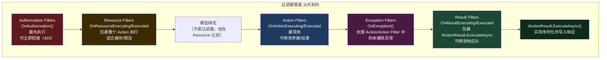
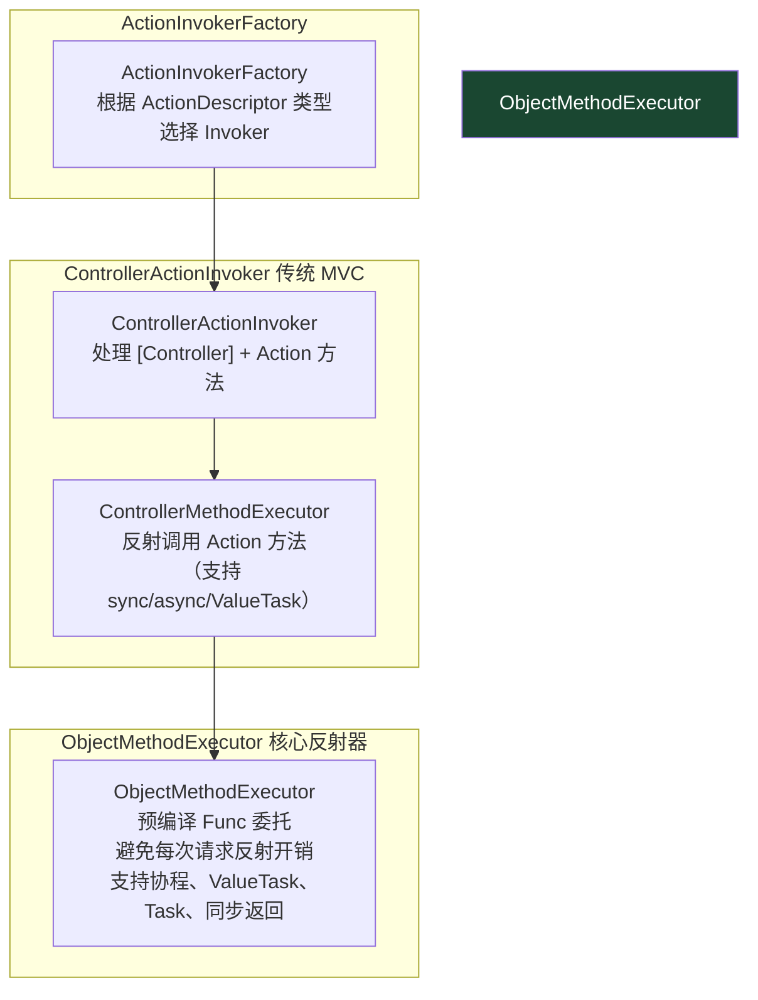
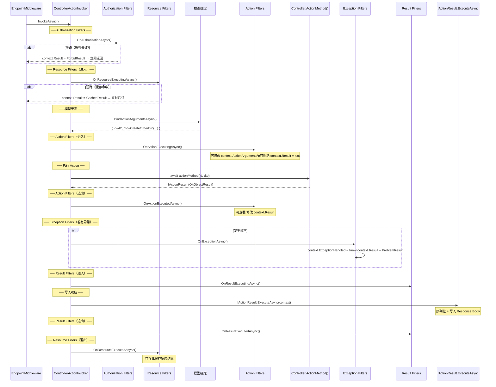
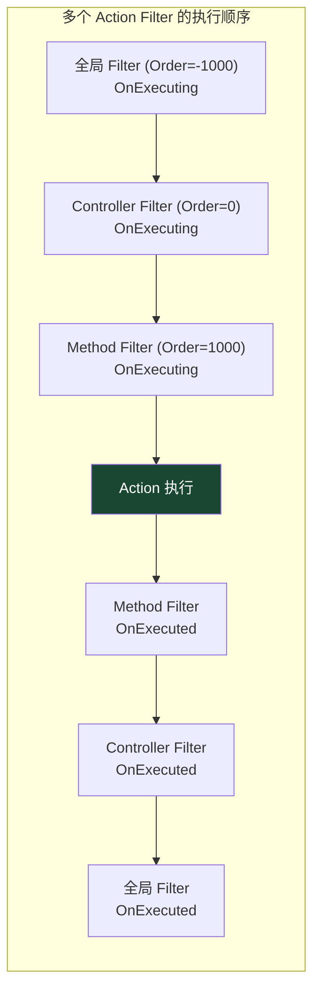

# 10 · Action 执行与过滤器

> **本模块回答：** MVC/Minimal API 的 Action 是如何被找到并执行的？过滤器有哪几种类型？它们的执行顺序是什么？`IActionInvoker` 如何组织整个执行流程？

---

## 一、过滤器管道全景



---

## 二、`IActionInvoker` 架构



---

## 三、`ControllerActionInvoker` 执行时序



---

## 四、五种过滤器类型详解

### 4.1 Authorization Filter

```csharp
// 最先执行，可以完全短路请求
// 注意：一般不自定义，用 [Authorize] + 策略即可
// 真正需要在路由层面做请求签名/HMAC 验证时才自定义

public class HmacAuthorizationFilter : IAuthorizationFilter
{
    private readonly IHmacValidator _validator;

    public HmacAuthorizationFilter(IHmacValidator validator)
    {
        _validator = validator;
    }

    public void OnAuthorization(AuthorizationFilterContext context)
    {
        var signature = context.HttpContext.Request.Headers["X-Signature"].FirstOrDefault();
        if (!_validator.IsValid(context.HttpContext.Request, signature))
        {
            // 短路：设置 Result 后，后续所有过滤器和 Action 均不执行
            context.Result = new UnauthorizedObjectResult(new { message = "签名验证失败" });
        }
    }
}
```

### 4.2 Resource Filter

```csharp
// 包裹整个执行过程（含模型绑定）
// 典型用途：响应缓存（在绑定和执行之前/后）

public class ResponseCacheFilter : IAsyncResourceFilter
{
    private readonly IDistributedCache _cache;

    public ResponseCacheFilter(IDistributedCache cache)
    {
        _cache = cache;
    }

    public async Task OnResourceExecutionAsync(
        ResourceExecutingContext context,
        ResourceExecutionDelegate next)
    {
        // 生成缓存 Key（路径 + 查询参数）
        var cacheKey = GenerateCacheKey(context.HttpContext.Request);

        // 尝试从缓存读取
        var cachedBytes = await _cache.GetAsync(cacheKey);
        if (cachedBytes != null)
        {
            // 缓存命中：设置 Result 短路，不执行模型绑定和 Action
            var cachedJson = Encoding.UTF8.GetString(cachedBytes);
            context.Result = new ContentResult
            {
                Content = cachedJson,
                ContentType = "application/json",
                StatusCode = 200
            };
            return; // 不调用 next()，直接返回
        }

        // 缓存未命中：继续执行
        var executedContext = await next(); // ← 这里会执行后续所有过滤器和 Action

        // 执行完毕后，把结果写入缓存
        if (executedContext.Result is OkObjectResult { Value: not null } okResult)
        {
            var json = JsonSerializer.Serialize(okResult.Value);
            await _cache.SetAsync(
                cacheKey,
                Encoding.UTF8.GetBytes(json),
                new DistributedCacheEntryOptions { AbsoluteExpirationRelativeToNow = TimeSpan.FromMinutes(5) }
            );
        }
    }

    private static string GenerateCacheKey(HttpRequest request)
        => $"cache:{request.Path}:{request.QueryString}";
}
```

### 4.3 Action Filter（最常用）

```csharp
// 在 Action 执行前后 — 最常用的过滤器
// 典型用途：日志、性能计时、参数预处理

public class PerformanceLoggingFilter : IAsyncActionFilter
{
    private readonly ILogger<PerformanceLoggingFilter> _logger;

    public PerformanceLoggingFilter(ILogger<PerformanceLoggingFilter> logger)
    {
        _logger = logger;
    }

    public async Task OnActionExecutionAsync(
        ActionExecutingContext context,
        ActionExecutionDelegate next)
    {
        // ── 前置逻辑（Action 执行前）──
        var sw = Stopwatch.StartNew();
        var actionName = context.ActionDescriptor.DisplayName;

        // 可以读取/修改 Action 参数
        // context.ActionArguments["id"] = transformedId;

        // 可以短路（不调用 next）
        // context.Result = new BadRequestResult();
        // return; // 此后 Action 不会执行

        var executedContext = await next(); // ← 执行 Action

        // ── 后置逻辑（Action 执行后）──
        sw.Stop();

        if (executedContext.Exception != null && !executedContext.ExceptionHandled)
        {
            _logger.LogError(executedContext.Exception,
                "Action {Action} 发生异常，耗时 {Ms}ms", actionName, sw.ElapsedMilliseconds);
        }
        else
        {
            _logger.LogInformation(
                "Action {Action} 完成，状态码 {StatusCode}，耗时 {Ms}ms",
                actionName,
                (executedContext.Result as ObjectResult)?.StatusCode ?? 200,
                sw.ElapsedMilliseconds);
        }
    }
}

// 使用方式一：全局注册
builder.Services.AddControllers(options =>
{
    options.Filters.Add<PerformanceLoggingFilter>(); // DI 友好：从容器解析
    // 或 options.Filters.Add(new SimpleFilter()); // 直接实例
});

// 使用方式二：特性标注（ServiceFilter / TypeFilter）
[ServiceFilter(typeof(PerformanceLoggingFilter))]  // 从 DI 解析
[HttpGet("{id}")]
public IActionResult Get(int id) => Ok();

// 使用方式三：自定义 FilterAttribute（无 DI 注入）
[AttributeUsage(AttributeTargets.Method | AttributeTargets.Class)]
public class LogActionAttribute : ActionFilterAttribute
{
    // 注意：Attribute 不能有构造函数注入（不由 DI 创建）
    // 需要 DI 的场景必须用 ServiceFilter/TypeFilter

    public override void OnActionExecuting(ActionExecutingContext context)
    {
        // 通过 context.HttpContext.RequestServices 手动解析
        var logger = context.HttpContext.RequestServices
            .GetRequiredService<ILogger<LogActionAttribute>>();
        logger.LogInformation("Executing: {Action}", context.ActionDescriptor.DisplayName);
    }
}
```

### 4.4 Exception Filter

```csharp
// 捕获 Action、Action Filter 中抛出的未处理异常
// 注意：不能捕获 Result Filter 和 Resource Filter 中的异常
// 注意：不能捕获异步 void 方法中的异常

public class GlobalExceptionFilter : IAsyncExceptionFilter
{
    private readonly ILogger<GlobalExceptionFilter> _logger;

    public GlobalExceptionFilter(ILogger<GlobalExceptionFilter> logger)
    {
        _logger = logger;
    }

    public Task OnExceptionAsync(ExceptionContext context)
    {
        _logger.LogError(context.Exception,
            "未处理异常 in {Action}", context.ActionDescriptor.DisplayName);

        // 根据异常类型返回不同响应
        context.Result = context.Exception switch
        {
            NotFoundException nfe => new NotFoundObjectResult(
                new ProblemDetails { Title = "资源不存在", Detail = nfe.Message, Status = 404 }),
            ValidationException ve => new UnprocessableEntityObjectResult(
                new ProblemDetails { Title = "数据验证失败", Detail = ve.Message, Status = 422 }),
            UnauthorizedException ue => new ObjectResult(
                new ProblemDetails { Title = "未授权", Detail = ue.Message, Status = 401 })
                { StatusCode = 401 },
            _ => new ObjectResult(
                new ProblemDetails { Title = "服务器内部错误", Status = 500 })
                { StatusCode = 500 }
        };

        // 必须设置为 true，否则异常继续向上传播
        context.ExceptionHandled = true;

        return Task.CompletedTask;
    }
}
```

### 4.5 Result Filter

```csharp
// 包裹 IActionResult.ExecuteAsync
// 典型用途：添加统一响应头、包装响应体格式

public class ApiResponseWrapperFilter : IAsyncResultFilter
{
    public async Task OnResultExecutionAsync(
        ResultExecutingContext context,
        ResultExecutionDelegate next)
    {
        // 在响应写入前添加追踪头
        context.HttpContext.Response.OnStarting(() =>
        {
            context.HttpContext.Response.Headers["X-Request-Id"] =
                context.HttpContext.TraceIdentifier;
            context.HttpContext.Response.Headers["X-Server-Version"] = "1.0.0";
            return Task.CompletedTask;
        });

        await next(); // ← 执行 IActionResult.ExecuteAsync（序列化 + 写响应）

        // 响应已写入，通常不再修改（Body 可能已发送）
        // 可以记录最终状态码
    }
}
```

---

## 五、过滤器的执行顺序（多层嵌套）

当有多个同类型过滤器时，执行顺序遵循**洋葱圈模型**，与注册顺序和 `Order` 属性有关：



**使用 `Order` 控制执行顺序**：

```csharp
// Order 越小越外层（越先执行 Executing，越后执行 Executed）
// 默认 Order = 0

// 全局过滤器（最外层）
builder.Services.AddControllers(options =>
{
    options.Filters.Add<GlobalExceptionFilter>(); // Order = 0
    options.Filters.Add(new LogFilter { Order = -100 }); // 比 GlobalExceptionFilter 更外层
});

// Controller 级别
[ServiceFilter(typeof(ControllerFilter))]  // 比全局过滤器更内层
public class OrderController : ControllerBase
{
    [ServiceFilter(typeof(MethodFilter))]  // 最内层
    public IActionResult Get() => Ok();
}

// 实现 IOrderedFilter 接口设置顺序
public class PriorityLoggingFilter : IAsyncActionFilter, IOrderedFilter
{
    public int Order => -500; // 非常外层

    public async Task OnActionExecutionAsync(
        ActionExecutingContext context,
        ActionExecutionDelegate next)
    { /* ... */ }
}
```

---

## 六、`IAlwaysRunResultFilter`——特殊情况

普通 Result Filter 在 Authorization Filter 或 Resource Filter 短路时**不会执行**。`IAlwaysRunResultFilter` 则无论是否短路都会执行：

```csharp
// 场景：无论认证是否通过，都需要在响应中加上安全响应头

public class SecurityHeadersFilter : IAlwaysRunResultFilter
{
    public void OnResultExecuting(ResultExecutingContext context)
    {
        context.HttpContext.Response.Headers["X-Content-Type-Options"] = "nosniff";
        context.HttpContext.Response.Headers["X-Frame-Options"] = "DENY";
        context.HttpContext.Response.Headers["X-XSS-Protection"] = "1; mode=block";
        context.HttpContext.Response.Headers["Referrer-Policy"] = "strict-origin-when-cross-origin";
    }

    public void OnResultExecuted(ResultExecutedContext context) { }
}

builder.Services.AddControllers(options =>
{
    options.Filters.Add<SecurityHeadersFilter>();
});
```

---

## 七、过滤器 vs 中间件——选择指南

| 维度 | 中间件 | 过滤器 |
|------|--------|--------|
| 作用域 | 全局（所有请求） | MVC 请求（有 Action 的请求） |
| 可访问对象 | `HttpContext` | `HttpContext` + `ActionDescriptor` + `ActionArguments` + `ModelState` |
| 执行时机 | 任意中间件位置 | Action 执行前后（已有路由/绑定结果）|
| 典型用途 | CORS、限流、日志、身份认证 | 参数预处理、响应格式统一、Action 级缓存 |
| DI 注入 | 构造函数注入（单例）或 `IMiddlewareFactory`（Scoped）| `ServiceFilter`/`TypeFilter` 支持全生命周期 |
| 短路能力 | `return`（不调用 `next`） | 设置 `context.Result`（不调用 `next`） |

---

## 八、`ObjectMethodExecutor`——零开销反射

MVC 不使用 `MethodInfo.Invoke()`（装箱 + 反射慢），而是在启动时为每个 Action 预编译委托：

```csharp
// src/Shared/ObjectMethodExecutor/ObjectMethodExecutor.cs

// 启动时（处理器发现阶段），为每个 Action 创建编译好的委托：
// Func<object, object[], Task> → 等价于 (controller, args) => controller.MethodAsync(args[0], args[1], ...)

internal static ObjectMethodExecutor Create(MethodInfo methodInfo, TypeInfo targetTypeInfo)
{
    // 1. 用 DynamicMethod + IL Emit 生成调用委托
    // 2. 对于 async 方法，用 Expression Tree 包装成 Task
    // 3. 对于 ValueTask<T> 返回值，生成 Task 包装（避免装箱）

    // 最终生成的 executor 相当于（以 GetOrder(int id) 为例）：
    // (object target, object[] args) =>
    // {
    //     var controller = (OrderController)target;
    //     var id = (int)args[0];
    //     return controller.GetOrder(id); // 直接调用，无反射
    // }
}

// 请求处理时调用（等价于直接调用方法，无额外开销）：
var result = await executor.ExecuteAsync(controllerInstance, arguments);
```

---

## 九、Minimal API 的过滤器（`IEndpointFilter`）

Minimal API 使用 `IEndpointFilter`（不同于 MVC 的 `IActionFilter`）：

```csharp
// Minimal API 的过滤器
app.MapGet("/api/orders/{id}", async (int id, IOrderService service) =>
{
    var order = await service.GetByIdAsync(id);
    return order == null ? Results.NotFound() : Results.Ok(order);
})
.AddEndpointFilter(async (context, next) =>
{
    // ── before ──
    var id = context.GetArgument<int>(0); // 获取参数
    if (id <= 0)
        return Results.BadRequest("ID 必须大于 0");

    var result = await next(context);

    // ── after ──
    return result;
})
.AddEndpointFilter<PerformanceEndpointFilter>(); // 同时支持强类型过滤器

// 强类型 Endpoint Filter
public class PerformanceEndpointFilter : IEndpointFilter
{
    private readonly ILogger<PerformanceEndpointFilter> _logger;

    public PerformanceEndpointFilter(ILogger<PerformanceEndpointFilter> logger)
    {
        _logger = logger;
    }

    public async ValueTask<object?> InvokeAsync(
        EndpointFilterInvocationContext context,
        EndpointFilterDelegate next)
    {
        var sw = Stopwatch.StartNew();
        var result = await next(context);
        _logger.LogInformation("Endpoint 耗时: {Ms}ms", sw.ElapsedMilliseconds);
        return result;
    }
}
```

---

## 十、本模块总结

| 知识点 | 核心结论 |
|--------|---------|
| 过滤器执行顺序 | Authorization → Resource → [模型绑定] → Action → Exception → Result |
| 短路 | Authorization/Resource/Action Filter 设置 `context.Result` 后，后续内层过滤器不执行 |
| `IAlwaysRunResultFilter` | 即使被短路也会执行，适合安全响应头等必须添加的逻辑 |
| `ObjectMethodExecutor` | 启动时预编译为 IL 委托，请求时直接调用，无反射开销 |
| DI 注入 | 全局 `options.Filters.Add<T>()` 原生支持 DI；特性标注需用 `[ServiceFilter]`/`[TypeFilter]` |
| Minimal API | 用 `IEndpointFilter` 替代过滤器，`ValueTask<object?>` 返回值更灵活 |

> **下一章**：Action 返回 `IActionResult`（`OkObjectResult`、`JsonResult` 等），这些结果对象是如何把 C# 对象序列化成 JSON 并写入响应的？→ [11 · 输出格式化与响应写回](11_输出格式化与响应写回.md)
