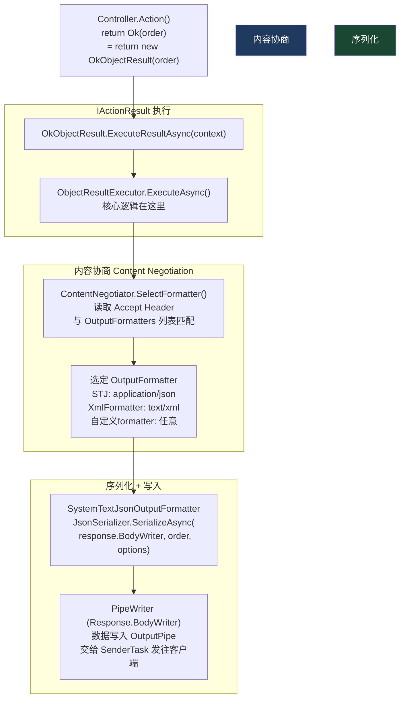
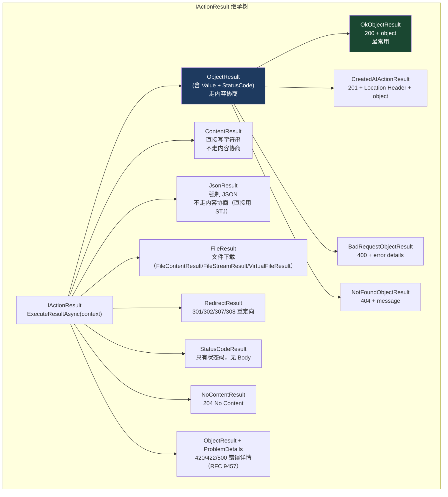
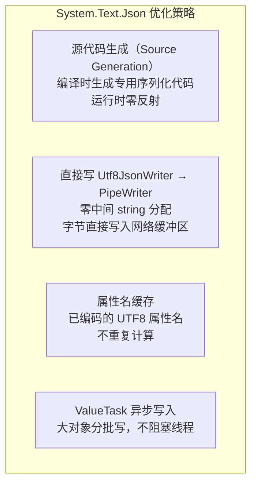
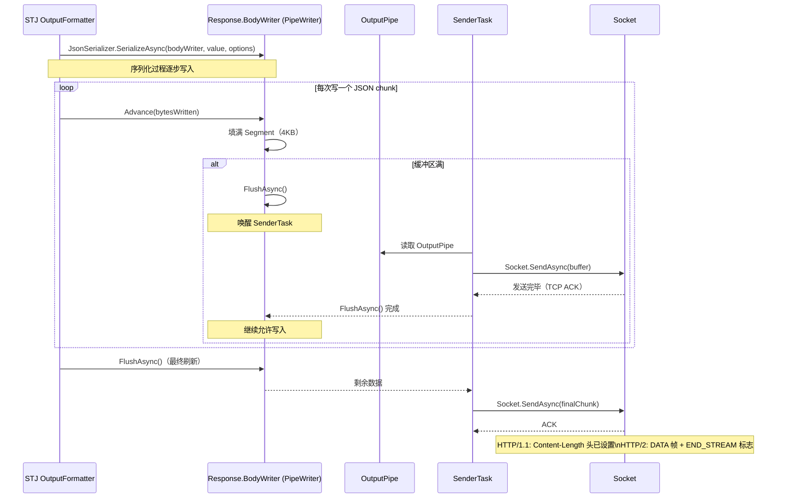

# 11 · 输出格式化与响应写回

> **本模块回答：** `return Ok(order)` 背后发生了什么？`OkObjectResult` 如何选择 JSON 还是 XML？`System.Text.Json` 是如何把 C# 对象高性能地写入响应流的？内容协商是怎么工作的？

---

## 一、从 `return Ok(value)` 到字节写入网络



---

## 二、`IActionResult` 体系



---

## 三、内容协商（Content Negotiation）

### 3.1 工作原理

```mermaid
sequenceDiagram
    participant C as 客户端
    participant OFE as ObjectResultExecutor
    participant CN as ContentNegotiator
    participant FMT as OutputFormatters

    C->>OFE: Accept: application/json, text/xml;q=0.9, */*;q=0.8

    OFE->>CN: SelectBestFormatter(formatters, acceptHeaders, objectType)

    CN->>CN: 解析 Accept Header：\n[("application/json", q=1.0),\n ("text/xml", q=0.9),\n ("*/*", q=0.8)]\n按 q 值降序排列

    loop 按 q 值从高到低
        CN->>FMT: 遍历所有 OutputFormatter
        FMT->>FMT: formatter.CanWriteResult(context)\n检查 formatter 支持的媒体类型
        alt 找到匹配 formatter
            FMT-->>CN: SystemTextJsonOutputFormatter（支持 application/json）
            CN-->>OFE: formatter = STJ, contentType = "application/json"
        end
    end

    OFE->>FMT: formatter.WriteAsync(context)
    FMT->>C: Content-Type: application/json; charset=utf-8\n{"id":42,"name":"Order A",...}
```

### 3.2 内容协商的边界情况

```csharp
// 案例1：客户端发送 Accept: text/html
// → 没有 HTML formatter → 根据 MvcOptions 决定：
// RespectBrowserAcceptHeader = true（默认 false）→ 406 Not Acceptable
// RespectBrowserAcceptHeader = false（默认）→ 忽略 Accept，用第一个 formatter（通常是 JSON）

builder.Services.AddControllers(options =>
{
    options.RespectBrowserAcceptHeader = true;    // 严格遵守 Accept
    options.ReturnHttpNotAcceptable = true;       // 找不到匹配时返回 406 而不是默认 formatter
});

// 案例2：使用 [Produces] 特性强制输出格式（跳过协商）
[HttpGet("{id}")]
[Produces("application/json")]  // 强制 JSON，忽略 Accept Header
public IActionResult Get(int id) => Ok(new { id, name = "Test" });

// 案例3：返回 JsonResult（完全跳过内容协商）
[HttpGet("{id}")]
public IActionResult Get(int id)
{
    // 直接用 STJ 序列化，不走 OutputFormatter 选择
    return new JsonResult(new { id, name = "Test" })
    {
        SerializerSettings = new JsonSerializerOptions { WriteIndented = true }
    };
}
```

---

## 四、`System.Text.Json` 高性能序列化

### 4.1 为什么 STJ 快



### 4.2 `SystemTextJsonOutputFormatter.WriteAsync()` 源码解读

```csharp
// src/Mvc/Mvc.Core/src/Formatters/SystemTextJsonOutputFormatter.cs 简化版

public override sealed async Task WriteAsync(OutputFormatterWriteContext context)
{
    var response = context.HttpContext.Response;

    // 设置 Content-Type（含 charset）
    var selectedMediaType = context.ContentType;
    if (!selectedMediaType.HasValue)
        selectedMediaType = new StringSegment("application/json; charset=utf-8");

    response.ContentType = selectedMediaType.ToString();

    // ⭐ 关键：直接写入 PipeWriter（零中间分配）
    // Response.BodyWriter 是 OutputPipe.Writer
    // 数据直接进入 OutputPipe → SenderTask → Socket
    if (context.HttpContext.RequestAborted.IsCancellationRequested)
        return;

    var responseStream = response.BodyWriter;

    var value = context.Object!;
    var type = context.ObjectType ?? value.GetType();

    // 使用 JsonSerializerOptions（全局配置，如属性名 camelCase、忽略 null 等）
    var jsonOptions = SerializerOptions;

    // 异步序列化：边序列化边写 PipeWriter
    // 避免把整个 JSON 字符串堆积在内存再写
    await JsonSerializer.SerializeAsync(responseStream, value, type, jsonOptions);

    // FlushAsync：确保 PipeWriter 的数据交给 SenderTask
    await responseStream.FlushAsync();
}
```

### 4.3 序列化配置（全局 + 局部）

```csharp
// ── 全局配置（Program.cs）──────────────────────────────────────────────
builder.Services.AddControllers()
    .AddJsonOptions(options =>
    {
        var json = options.JsonSerializerOptions;

        // 属性命名：camelCase（默认已是）
        json.PropertyNamingPolicy = JsonNamingPolicy.CamelCase;

        // 枚举序列化为字符串（而非数字）
        json.Converters.Add(new JsonStringEnumConverter());

        // 忽略 null 值属性
        json.DefaultIgnoreCondition = JsonIgnoreCondition.WhenWritingNull;

        // 允许尾随逗号（宽松解析，用于输入）
        json.AllowTrailingCommas = true;

        // 时间格式
        json.Converters.Add(new DateTimeJsonConverter()); // 自定义

        // 源代码生成（生产环境推荐，启动后首次序列化极快）
        json.TypeInfoResolverChain.Insert(0, AppJsonSerializerContext.Default);
    });

// 源代码生成上下文（零反射序列化）
[JsonSerializable(typeof(Order))]
[JsonSerializable(typeof(OrderDto))]
[JsonSerializable(typeof(List<Order>))]
[JsonSerializable(typeof(ProblemDetails))]
[JsonSourceGenerationOptions(
    PropertyNamingPolicy = JsonKnownNamingPolicy.CamelCase,
    DefaultIgnoreCondition = JsonIgnoreCondition.WhenWritingNull)]
public partial class AppJsonSerializerContext : JsonSerializerContext { }

// ── 局部配置（单个 Action）──────────────────────────────────────────────
[HttpGet("{id}")]
public IActionResult Get(int id)
{
    var order = GetOrder(id);

    // 只在这一个 Action 上使用不同选项（含缩进）
    return new JsonResult(order, new JsonSerializerOptions
    {
        WriteIndented = true,  // 美化输出（调试用）
        PropertyNamingPolicy = JsonNamingPolicy.SnakeCaseLower // snake_case
    });
}
```

---

## 五、自定义 `OutputFormatter`

```csharp
// 场景：添加 CSV 格式输出（Accept: text/csv）

public class CsvOutputFormatter : TextOutputFormatter
{
    public CsvOutputFormatter()
    {
        // 声明支持的媒体类型
        SupportedMediaTypes.Add(MediaTypeHeaderValue.Parse("text/csv"));
        SupportedEncodings.Add(Encoding.UTF8);
        SupportedEncodings.Add(Encoding.Unicode);
    }

    // 判断是否能序列化此类型（可用于限制 formatter 只处理特定类型）
    protected override bool CanWriteType(Type? type)
    {
        return type != null &&
               (type.IsGenericType && type.GetGenericTypeDefinition() == typeof(IEnumerable<>) ||
                type.GetInterfaces().Any(i =>
                    i.IsGenericType && i.GetGenericTypeDefinition() == typeof(IEnumerable<>)));
    }

    public override async Task WriteResponseBodyAsync(
        OutputFormatterWriteContext context,
        Encoding selectedEncoding)
    {
        var response = context.HttpContext.Response;
        var items = (context.Object as IEnumerable<object>)?.ToList() ?? [];

        if (!items.Any())
        {
            await response.WriteAsync("", selectedEncoding);
            return;
        }

        var sb = new StringBuilder();

        // CSV 标题行（从第一个对象的属性名生成）
        var properties = items[0].GetType().GetProperties();
        sb.AppendLine(string.Join(",", properties.Select(p => EscapeCsv(p.Name))));

        // CSV 数据行
        foreach (var item in items)
        {
            var values = properties.Select(p =>
                EscapeCsv(p.GetValue(item)?.ToString() ?? ""));
            sb.AppendLine(string.Join(",", values));
        }

        await response.WriteAsync(sb.ToString(), selectedEncoding);
    }

    private static string EscapeCsv(string value)
    {
        if (value.Contains(',') || value.Contains('"') || value.Contains('\n'))
            return $"\"{value.Replace("\"", "\"\"")}\"";
        return value;
    }
}

// 注册
builder.Services.AddControllers(options =>
{
    options.OutputFormatters.Add(new CsvOutputFormatter());
});

// 使用
// GET /api/orders  Accept: text/csv
// → 返回 CSV 格式的订单列表
```

---

## 六、Response 写回的底层路径



---

## 七、HTTP 响应状态码与标准结果类型对照

```csharp
// Controller 方法中返回不同结果的标准写法

[ApiController]
[Route("api/[controller]")]
public class OrderController : ControllerBase
{
    // 200 OK + 响应体
    [HttpGet("{id}")]
    public async Task<IActionResult> Get(int id)
    {
        var order = await _service.GetAsync(id);
        if (order == null) return NotFound();           // 404
        return Ok(order);                               // 200
    }

    // 201 Created + Location Header + 响应体
    [HttpPost]
    public async Task<IActionResult> Create(CreateOrderDto dto)
    {
        var order = await _service.CreateAsync(dto);
        return CreatedAtAction(
            nameof(Get),           // Action 名（用于生成 Location URL）
            new { id = order.Id }, // 路由参数
            order                  // 响应体
        );
        // → 201 Created
        // → Location: https://api.example.com/api/orders/42
    }

    // 204 No Content（成功但无响应体）
    [HttpPut("{id}")]
    public async Task<IActionResult> Update(int id, UpdateOrderDto dto)
    {
        await _service.UpdateAsync(id, dto);
        return NoContent(); // 204
    }

    // 400 Bad Request（ProblemDetails 格式）
    [HttpPost("validate")]
    public IActionResult Validate(CreateOrderDto dto)
    {
        if (!ModelState.IsValid)
            return ValidationProblem(); // 400 + ProblemDetails

        return Ok();
    }

    // 404 Not Found + 详情
    [HttpDelete("{id}")]
    public async Task<IActionResult> Delete(int id)
    {
        if (!await _service.ExistsAsync(id))
            return NotFound(new { message = $"订单 {id} 不存在" }); // 404 + body

        await _service.DeleteAsync(id);
        return NoContent(); // 204
    }

    // 202 Accepted（异步任务，立即返回，稍后完成）
    [HttpPost("bulk-import")]
    public IActionResult BulkImport(IFormFile file)
    {
        var jobId = _jobService.EnqueueImport(file);
        return AcceptedAtAction(
            nameof(GetJobStatus),
            new { jobId },
            new { jobId, status = "processing" }
        );
        // → 202 Accepted
        // → Location: /api/orders/jobs/xxx
    }

    // 文件下载
    [HttpGet("{id}/invoice")]
    public IActionResult DownloadInvoice(int id)
    {
        var pdfBytes = _service.GenerateInvoicePdf(id);
        return File(
            pdfBytes,
            "application/pdf",
            $"invoice-{id}.pdf"  // Content-Disposition: attachment 触发浏览器下载
        );
    }
}
```

---

## 八、`ProblemDetails`——RFC 9457 标准错误格式

```csharp
// ASP.NET Core 8+ 内置 ProblemDetails 支持

// 配置
builder.Services.AddProblemDetails(options =>
{
    options.CustomizeProblemDetails = context =>
    {
        // 生产环境隐藏技术细节
        if (context.HttpContext.GetEndpoint()?.Metadata
                .GetMetadata<IApiDescriptionGroupNameProvider>() == null) return;

        context.ProblemDetails.Extensions["traceId"] =
            context.HttpContext.TraceIdentifier;

        context.ProblemDetails.Extensions["timestamp"] =
            DateTimeOffset.UtcNow.ToString("O");
    };
});

// 标准错误响应格式（RFC 9457）：
// HTTP 422 Unprocessable Content
// Content-Type: application/problem+json
{
    "type": "https://tools.ietf.org/html/rfc7807#section-3.1",
    "title": "Validation Failed",
    "status": 422,
    "detail": "一个或多个字段验证失败",
    "instance": "/api/orders",
    "traceId": "00-abc123-01",
    "timestamp": "2024-01-01T00:00:00Z",
    "errors": {
        "ProductId": ["产品ID不能为空"],
        "Quantity": ["数量必须大于0"]
    }
}

// 手动创建 ProblemDetails 响应
return Problem(
    statusCode: StatusCodes.Status500InternalServerError,
    title: "数据库连接失败",
    detail: "无法连接到订单数据库，请稍后重试",
    instance: HttpContext.Request.Path
);
```

---

## 九、响应压缩（Gzip / Brotli）

```csharp
// 添加响应压缩（在写入 Socket 之前压缩）
builder.Services.AddResponseCompression(options =>
{
    options.EnableForHttps = true; // 注意 BREACH 攻击风险（敏感数据不建议启用）
    options.Providers.Add<BrotliCompressionProvider>(); // 优先 Brotli（压缩率更高）
    options.Providers.Add<GzipCompressionProvider>();   // 回退 Gzip
    options.MimeTypes = ResponseCompressionDefaults.MimeTypes.Concat(
        new[] { "application/json", "text/csv" }        // 加入自定义 MIME 类型
    );
});

builder.Services.Configure<BrotliCompressionProviderOptions>(options =>
{
    options.Level = CompressionLevel.Fastest; // 平衡压缩率和 CPU 开销
});

app.UseResponseCompression(); // 必须在所有响应输出中间件之前

// 效果：
// JSON 响应 100KB → 压缩后约 15-30KB
// 降低带宽消耗，加快传输速度
```

---

## 十、本模块总结

| 知识点 | 核心结论 |
|--------|---------|
| `OkObjectResult` | 设置 `Value` 和 `StatusCode`，委托 `ObjectResultExecutor` 做内容协商和序列化 |
| 内容协商 | 按 `Accept` Header 的 `q` 值从高到低匹配 `OutputFormatter`，无 `q` 默认 1.0 |
| `SystemTextJsonOutputFormatter` | 直接写入 `Response.BodyWriter`（PipeWriter），无中间字符串分配 |
| 源代码生成 | `[JsonSerializable]` 编译时生成序列化代码，零运行时反射，极高性能 |
| 自定义 Formatter | 继承 `TextOutputFormatter`，声明支持的 MIME 类型，实现 `WriteResponseBodyAsync` |
| `ProblemDetails` | RFC 9457 标准错误格式，`[ApiController]` 自动用于验证错误，也可手动创建 |
| 响应压缩 | 在 OutputFormatter 写完之后、SenderTask 发送之前透明压缩，可节省 70-80% 带宽 |

> **下一章**：响应字节写入 OutputPipe 后，SenderTask 如何把它们通过 Socket 发回给客户端？连接关闭和 Keep-Alive 复用是怎么工作的？→ [12 · 响应返回网卡](12_响应返回网卡.md)
