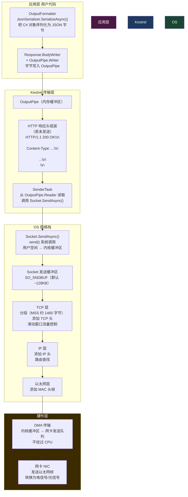
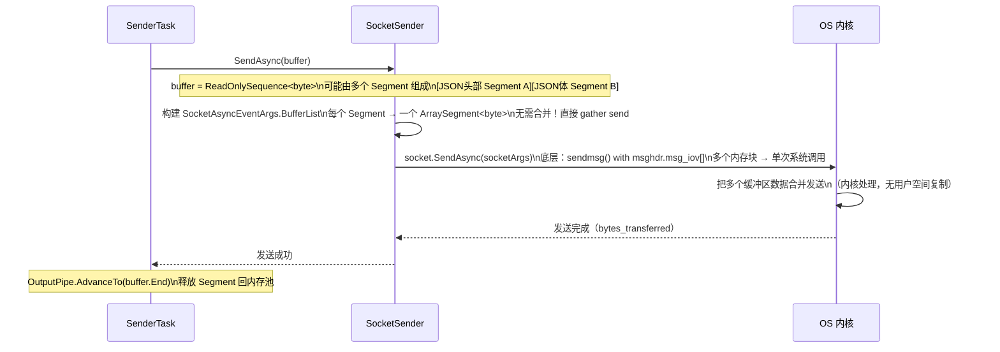
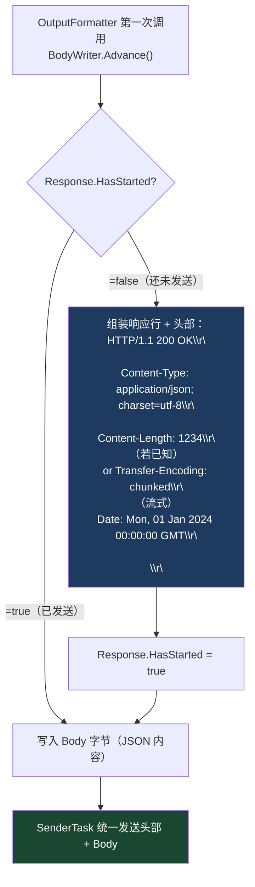
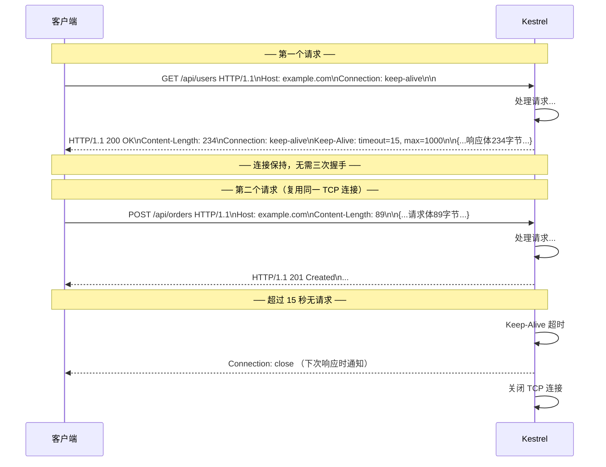
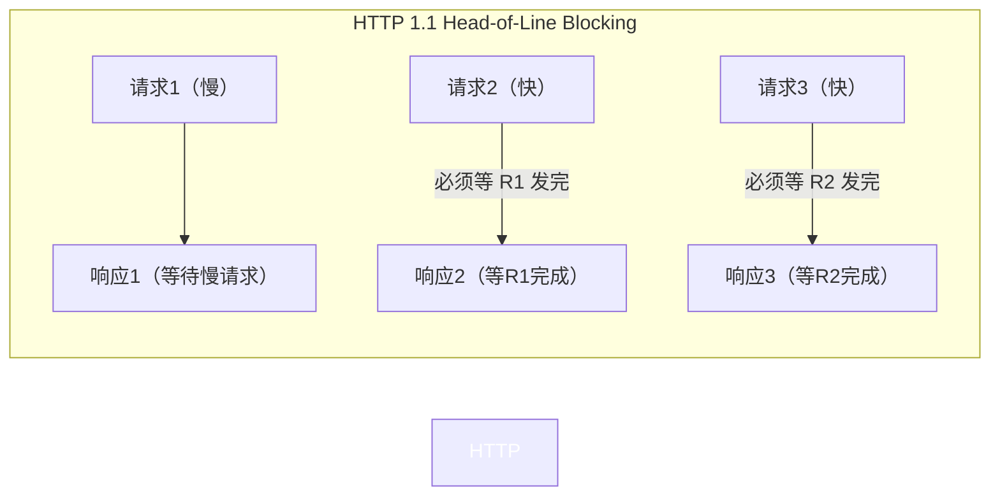
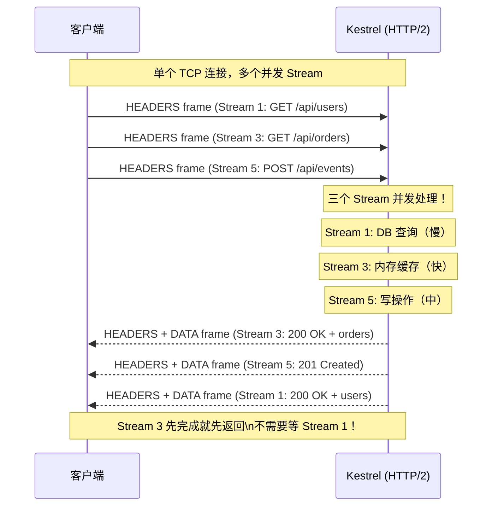
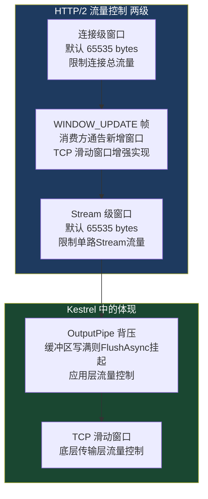
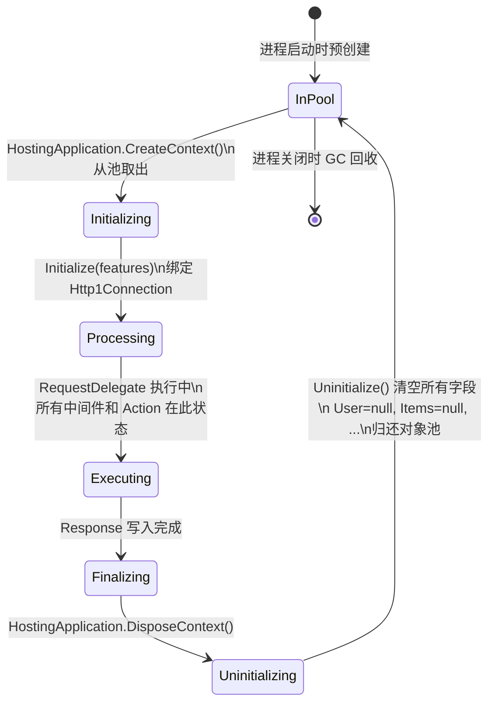

# 12 · 响应返回网卡

> **本模块回答：** 序列化完成的 JSON 字节是如何最终从进程内存到达客户端网卡的？SenderTask 是怎么工作的？HTTP/1.1 的 Keep-Alive 和 HTTP/2 的多路复用有什么区别？连接如何优雅关闭？

---

## 一、全链路闭环——从序列化完成到字节离开主机



---

## 二、SenderTask 详解

### 2.1 SenderTask 主循环

```csharp
// src/Servers/Kestrel/Transport.Sockets/src/SocketConnection.cs 简化版

private async Task ProcessSendsAsync()
{
    var output = _outputPipe.Reader; // 从 OutputPipe 读取待发送数据

    while (true)
    {
        // ── 等待数据 ──
        // ApplicationTask（序列化层）往 OutputPipe.Writer 写数据后唤醒此处
        var result = await output.ReadAsync();
        var buffer = result.Buffer;

        if (buffer.IsEmpty && result.IsCompleted)
            break; // OutputPipe 已完成，没有更多数据了

        // ── 发送数据 ──
        // 数据可能跨越多个 Segment（非连续内存）
        // SocketSender 负责处理跨 Segment 的 gather-send（scatter-gather IO）
        await _sender.SendAsync(buffer);

        // ── 通知 Pipe 数据已消费 ──
        output.AdvanceTo(buffer.End);

        if (result.IsCompleted)
            break; // 没有更多数据，退出循环
    }

    output.Complete();
}
```

### 2.2 `SocketSender.SendAsync()`——Scatter-Gather 发送



---

## 三、HTTP 响应头的发送时机

响应头不是和 Body 一起写的，而是在第一次写 Body 之前由 Kestrel 自动插入：



**关键点：一旦 `Response.HasStarted = true`，就不能再修改响应头！**

```csharp
// ❌ 危险代码：在某些情况下会抛出 InvalidOperationException
app.Use(async (context, next) =>
{
    await next(context); // 执行后续中间件（可能已写入响应头）

    // 如果响应已开始，这里修改头部会抛异常
    if (context.Response.HasStarted)
        return; // 必须检查！

    context.Response.Headers["X-Custom"] = "value"; // 太晚了！
});

// ✅ 正确：使用 Response.OnStarting 在发送前注册回调
app.Use(async (context, next) =>
{
    context.Response.OnStarting(() =>
    {
        // 此回调在响应头即将发送时执行（HasStarted 变为 true 之前）
        context.Response.Headers["X-Custom"] = "value";
        return Task.CompletedTask;
    });

    await next(context);
});
```

---

## 四、HTTP/1.1 Keep-Alive——连接复用



**Kestrel Keep-Alive 配置**：

```csharp
builder.WebHost.ConfigureKestrel(options =>
{
    options.Limits.KeepAliveTimeout = TimeSpan.FromSeconds(120); // 默认 120s
    options.Limits.RequestHeadersTimeout = TimeSpan.FromSeconds(30); // 请求头超时
    options.Limits.MaxConcurrentConnections = 10000; // 最大并发连接数
    options.Limits.MaxConcurrentUpgradedConnections = 1000; // WebSocket 等升级连接
});
```

### HTTP/1.1 的流水线请求（Pipelining）问题



---

## 五、HTTP/2 多路复用——彻底解决队头阻塞



### HTTP/2 流量控制



---

## 六、连接关闭的四种场景


**优雅关闭实现**：

```csharp
// Program.cs
builder.Host.ConfigureHostOptions(opts =>
{
    opts.ShutdownTimeout = TimeSpan.FromSeconds(15); // 给 15 秒处理进行中的请求
});

// 监听 SIGTERM（Kubernetes 滚动更新时发送）
app.Lifetime.ApplicationStopping.Register(() =>
{
    // 立即停止接受新请求（但当前请求继续）
    // Kestrel 自动处理，通常不需要手动注册
});

// 自定义优雅停机：等待后台队列清空
app.Lifetime.ApplicationStopping.Register(async () =>
{
    var backgroundQueue = app.Services.GetRequiredService<IBackgroundTaskQueue>();
    await backgroundQueue.WaitForEmptyAsync(TimeSpan.FromSeconds(10));
});
```

---

## 七、完整请求-响应生命周期总结

```mermaid
sequenceDiagram
    participant NIC as 网卡 NIC
    participant OS as OS 内核
    participant K as Kestrel
    participant HC as Http1Connection
    participant HA as HostingApplication
    participant MW as 中间件管道
    participant ACT as Controller Action

    rect rgb(20,40,70)
    Note over NIC,K: == 请求进入 ==
    NIC->>OS: DMA 以太网帧到内核
    OS->>OS: TCP 三次握手
    OS-->>K: 通知新连接
    K->>HC: 创建连接并启动三大任务
    end

    rect rgb(20,40,40)
    Note over HC,K: == 协议解析 ==
    HC->>HC: 接收数据写入管道
    HC->>HC: 状态机解析 HTTP 报文
    end

    rect rgb(40,20,60)
    Note over HA,MW: == 框架交接 ==
    HC->>HA: 创建上下文，从对象池获取 HttpContext
    HA->>HA: 启动追踪、创建日志作用域
    end

    rect rgb(20,50,30)
    Note over MW,ACT: == 中间件 + MVC ==
    HA->>MW: 执行中间件管道
    MW->>MW: 路由匹配、认证、授权
    MW->>ACT: 执行 Action
    ACT->>MW: 执行结果序列化
    end

    rect rgb(20,40,70)
    Note over K,NIC: == 响应返回 ==
    HC->>HC: 发送管道数据
    HC->>OS: 系统调用发送
    OS->>NIC: 内核发送到网卡
    NIC->>NIC: 发送以太网帧
    end

    rect rgb(40,20,20)
    Note over HA,HC: == 清理 ==
    HA->>HA: 释放上下文，归还对象池
    HC->>HC: Keep-Alive 等待下一个请求
    end
```



---

## 八、性能数字参考（TechEmpower Benchmarks）

| 场景 | 吞吐量（请求/秒） | P99 延迟 |
|------|--------------|---------|
| Plaintext（直接返回字符串） | ~7,000,000 | < 1ms |
| JSON 序列化（小对象） | ~2,000,000 | < 2ms |
| 单次数据库查询 | ~300,000 | < 5ms |
| 多次数据库查询（20次） | ~50,000 | < 20ms |

**零拷贝 / 零分配 / 零阻塞的协同效果**：

```
传统阻塞模型（一连接一线程）:
  10,000 并发 → 10,000 线程 → 10GB 线程栈内存 → 大量上下文切换

Kestrel 异步模型:
  10,000 并发 → ~100 线程 → 100MB 内存 → 几乎零上下文切换

内存分配对比（每个请求）:
  传统 NetworkStream: ~50KB 分配（byte[], string, List, 等）
  Kestrel Pipelines:  ~1KB 分配（对象池 + 栈分配，接近零）
```

---

## 九、`HttpContext` 对象池的完整生命周期



---

## 十、本模块总结

| 知识点 | 核心结论 |
|--------|---------|
| SenderTask | 从 OutputPipe.Reader 读取，用 Socket.SendAsync() 发送，支持 Scatter-Gather IO |
| 响应头发送时机 | 第一次写 Body 之前自动插入，`HasStarted=true` 后不可修改 |
| HTTP/1.1 Keep-Alive | 复用 TCP 连接，免三次握手开销，但仍有队头阻塞 |
| HTTP/2 多路复用 | 单 TCP 连接多 Stream，互不阻塞，先完成先返回 |
| 优雅关闭 | Stop → 停止接受新连接 → 等待现有请求完成 → ShutdownTimeout 后强制关闭 |
| 对象池生命周期 | 从池取出 → Initialize → 请求处理 → Uninitialize → 归还池，进程期间持续复用 |

---

## 附：本知识库全链路对应关系

| 章节 | 覆盖组件 | 关键接口/类 |
|------|---------|-----------|
| 01 | NIC → OS → Kestrel Accept | `Socket`, `epoll`, `IOCP` |
| 02 | IO 内存管理 | `PipeReader`, `PipeWriter`, `MemoryPool` |
| 03 | HTTP 协议解析 | `Http1Connection`, `HttpParser`, `SWAR` |
| 04 | 框架解耦层 | `IFeatureCollection`, `IHttpRequestFeature` |
| 05 | 框架握手点 | `HostingApplication`, `IHttpApplication` |
| 06 | 中间件管道 | `IApplicationBuilder`, `RequestDelegate` |
| 07 | 路由匹配 | `DfaMatcher`, `EndpointDataSource`, `IRouteConstraint` |
| 08 | 身份与权限 | `JwtBearerHandler`, `IAuthorizationService`, `ClaimsPrincipal` |
| 09 | 参数绑定与验证 | `IModelBinder`, `IValueProvider`, `DataAnnotations` |
| 10 | Action 执行 | `ControllerActionInvoker`, 5种过滤器, `ObjectMethodExecutor` |
| 11 | 序列化输出 | `OutputFormatter`, `STJ`, 内容协商, `ProblemDetails` |
| 12 | 响应发送 | `SenderTask`, Keep-Alive, HTTP/2 多路复用 |
