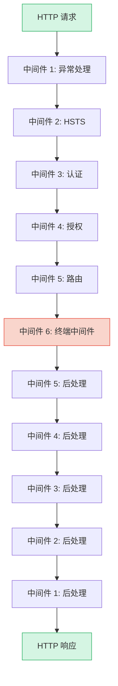
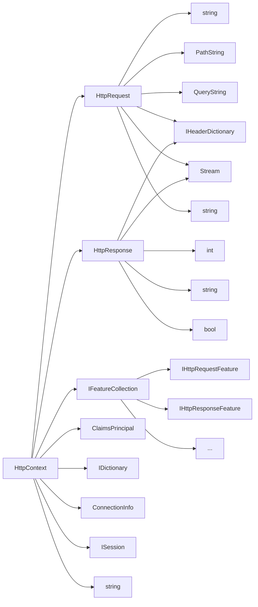

# 管道模型与中间件原理

## 什么是中间件管道

ASP.NET Core 的请求处理模型是一个**管道（Pipeline）**，由一系列中间件（Middleware）按注册顺序串联而成。每个中间件都可以：

1. 在请求传递给下一个中间件**之前**执行逻辑（前处理）
2. 选择是否将请求传递给下一个中间件（调用 `next`）
3. 在下一个中间件处理完毕**之后**执行逻辑（后处理）

这种模型常被称为 **Russian Doll（俄罗斯套娃）模型**——每个中间件包裹着后续的所有中间件，请求从最外层逐层深入，响应再从最内层逐层返回。



### 请求流向

```
请求 ──→ 中间件A(前) ──→ 中间件B(前) ──→ 中间件C(前) ──→ 终端
                                                              │
响应 ←── 中间件A(后) ←── 中间件B(后) ←── 中间件C(后) ←────────┘
```

关键要点：

- **请求方向**：按注册顺序，先注册的中间件先收到请求
- **响应方向**：按注册的逆序，后注册的中间件先处理后处理逻辑
- **短路**：中间件可以不调用 `next`，从而阻止请求继续向下游传递

## 请求委托 RequestDelegate

`RequestDelegate` 是整个管道的核心类型，它代表一个能处理 HTTP 请求的委托：

```csharp
// RequestDelegate 的定义
public delegate Task RequestDelegate(HttpContext context);
```

每个中间件本质上就是接收一个 `RequestDelegate`（代表管道中的下一个中间件），并返回一个新的 `RequestDelegate`（代表当前中间件 + 后续管道）。

```csharp
// 中间件的函数签名
Func<RequestDelegate, RequestDelegate> middleware = next =>
{
    return async context =>
    {
        // 前处理逻辑
        Console.WriteLine("请求进入当前中间件");

        // 调用下一个中间件
        await next(context);

        // 后处理逻辑
        Console.WriteLine("响应离开当前中间件");
    };
};
```

### 管道的构建过程

ASP.NET Core 在启动时通过 `IApplicationBuilder` 逐个注册中间件，内部维护一个 `RequestDelegate` 链：

```csharp
// 简化版的管道构建逻辑
public class ApplicationBuilder : IApplicationBuilder
{
    private readonly List<Func<RequestDelegate, RequestDelegate>> _components = new();

    public IApplicationBuilder Use(Func<RequestDelegate, RequestDelegate> middleware)
    {
        _components.Add(middleware);
        return this;
    }

    public RequestDelegate Build()
    {
        // 从最后一个中间件开始，反向折叠
        RequestDelegate app = context => Task.CompletedTask; // 管道末端的默认处理

        for (var i = _components.Count - 1; i >= 0; i--)
        {
            app = _components[i](app); // 每个中间件包裹前一个
        }

        return app;
    }
}
```

构建过程的关键：**从后往前折叠**。最后一个注册的中间件最先被包裹，最终形成完整的请求委托链。

## HttpContext 的核心结构

`HttpContext` 是中间件之间传递的上下文对象，封装了当前 HTTP 请求的所有信息：



### 核心属性详解

```csharp
public class HttpContext
{
    // 请求信息
    public HttpRequest Request { get; }

    // 响应信息
    public HttpResponse Response { get; }

    // 特性集合——底层抽象，各服务器实现不同
    public IFeatureCollection Features { get; }

    // 当前用户（由认证中间件填充）
    public ClaimsPrincipal User { get; set; }

    // 请求级别的数据字典（中间件之间共享数据）
    public IDictionary<object, object?> Items { get; }

    // 连接信息（IP、端口、证书等）
    public ConnectionInfo Connection { get; }

    // 会话（需启用 Session 中间件）
    public ISession Session { get; set; }

    // 请求的唯一追踪标识
    public string TraceIdentifier { get; }
}
```

### Items：中间件间的数据传递

`HttpContext.Items` 是一个请求生命周期的字典，常用于中间件之间传递数据：

```csharp
// 中间件A：写入数据
app.Use(async (context, next) =>
{
    context.Items["RequestId"] = Guid.NewGuid().ToString();
    context.Items["StartTime"] = DateTime.UtcNow;
    await next();
});

// 中间件B：读取数据
app.Use(async (context, next) =>
{
    var requestId = context.Items["RequestId"] as string;
    var startTime = context.Items["StartTime"] as DateTime?;
    Console.WriteLine($"请求 {requestId} 开始于 {startTime}");
    await next();
});
```

### Response.HasStarted：重要的安全检查

当响应已经开始发送（状态码和头部已写入网络流），就不能再修改状态码或头部。这是一个常见的陷阱：

```csharp
app.Use(async (context, next) =>
{
    try
    {
        await next();
    }
    catch (Exception ex)
    {
        // 如果响应已经开始，无法再修改状态码
        if (!context.Response.HasStarted)
        {
            context.Response.StatusCode = 500;
            await context.Response.WriteAsJsonAsync(new { error = "内部错误" });
        }
        else
        {
            // 只能记录日志，无法修改响应
            Console.WriteLine($"响应已开始，无法修改: {ex.Message}");
        }
    }
});
```

## 中间件执行顺序

ASP.NET Core 中间件的执行遵循一个核心原则：**先注册先执行（请求方向），后注册先执行（响应方向）**。

```csharp
app.Use(async (context, next) =>
{
    Console.WriteLine("A: 请求进入");  // 第1个输出
    await next();
    Console.WriteLine("A: 响应返回");  // 第6个输出
});

app.Use(async (context, next) =>
{
    Console.WriteLine("B: 请求进入");  // 第2个输出
    await next();
    Console.WriteLine("B: 响应返回");  // 第5个输出
});

app.Use(async (context, next) =>
{
    Console.WriteLine("C: 请求进入");  // 第3个输出
    await next();
    Console.WriteLine("C: 响应返回");  // 第4个输出
});
```

输出顺序：`A进 → B进 → C进 → C出 → B出 → A出`

## Use vs Run vs Map

### app.Use——可调用后续中间件

```csharp
app.Use(async (context, next) =>
{
    // 前处理
    Console.WriteLine("Before next");

    await next(); // 调用下一个中间件

    // 后处理
    Console.WriteLine("After next");
});
```

### app.Run——终端中间件，不调用后续

```csharp
app.Run(async context =>
{
    await context.Response.WriteAsync("Hello World");
    // 没有 next 参数，请求到此为止
});
```

`Run` 通常放在管道末尾，作为默认的兜底处理。如果请求没有被前面的中间件短路，最终会到达这里。

### app.Map——分支管道

`Map` 根据请求路径创建分支管道：

```csharp
app.Map("/api", appBuilder =>
{
    // 只有路径以 /api 开头的请求才进入此分支
    appBuilder.Use(async (context, next) =>
    {
        Console.WriteLine("API 分支中间件");
        await next();
    });

    appBuilder.Run(async context =>
    {
        await context.Response.WriteAsync("API 响应");
    });
});

app.Map("/admin", appBuilder =>
{
    appBuilder.Run(async context =>
    {
        await context.Response.WriteAsync("Admin 响应");
    });
});

// 主管道
app.Run(async context =>
{
    await context.Response.WriteAsync("主页响应");
});
```

### app.MapWhen——条件分支

`MapWhen` 根据自定义条件创建分支：

```csharp
// 基于查询参数分支
app.MapWhen(context => context.Request.Query.ContainsKey("debug"), appBuilder =>
{
    appBuilder.Run(async context =>
    {
        await context.Response.WriteAsync("Debug 模式");
    });
});

// 基于请求头分支
app.MapWhen(context =>
{
    return context.Request.Headers.TryGetValue("X-Custom-Header", out var value)
        && value == "secret";
}, appBuilder =>
{
    appBuilder.Run(async context =>
    {
        await context.Response.WriteAsync("自定义头部验证通过");
    });
});
```

### Use vs Run vs Map 对比

| 特性 | `app.Use` | `app.Run` | `app.Map` | `app.MapWhen` |
|------|-----------|-----------|-----------|---------------|
| 能否调用后续中间件 | 可以 | 不可以 | N/A | N/A |
| 是否终端中间件 | 否 | 是 | 分支内自定 | 分支内自定 |
| 分支能力 | 无 | 无 | 基于路径 | 基于条件 |
| 典型用途 | 日志、认证、异常处理 | 兜底响应 | API/管理区分离 | 灵活条件路由 |
| 影响主管道 | 否 | 是（短路） | 匹配时脱离主管道 | 匹配时脱离主管道 |

::: warning Map 的注意点
使用 `Map` 时，匹配的请求会进入分支管道，**不再回到主管道**。`MapWhen` 同理。这与 `UseWhen` 不同——`UseWhen` 创建的分支在处理完后仍可回到主管道。
:::

### app.UseWhen——条件中间件（不脱离主管道）

```csharp
// 当路径以 /api 开头时，额外执行日志中间件
// 但请求仍会继续走主管道的后续中间件
app.UseWhen(
    context => context.Request.Path.StartsWithSegments("/api"),
    appBuilder =>
    {
        appBuilder.Use(async (context, next) =>
        {
            Console.WriteLine($"API 请求: {context.Request.Path}");
            await next();
        });
    }
);
```

`UseWhen` 与 `MapWhen` 的区别：

- **`MapWhen`**：匹配的请求脱离主管道，进入分支后不再回到主管道
- **`UseWhen`**：匹配的请求额外执行分支中的中间件，然后继续回到主管道

## 内置中间件顺序

ASP.NET Core 官方文档推荐了内置中间件的注册顺序。以下是完整的推荐顺序表：

| 顺序 | 中间件 | 说明 |
|------|--------|------|
| 1 | `UseExceptionHandler` / `UseDeveloperExceptionPage` | 全局异常处理，必须最先注册以捕获后续所有异常 |
| 2 | `UseHsts` | HTTP 严格传输安全，强制浏览器使用 HTTPS |
| 3 | `UseHttpsRedirection` | HTTP → HTTPS 重定向 |
| 4 | `UseStaticFiles` | 静态文件服务 |
| 5 | `UseCookiePolicy` | Cookie 策略合规（GDPR 等） |
| 6 | `UseRouting` | 路由决策 |
| 7 | `UseCors` | 跨域资源共享 |
| 8 | `UseAuthentication` | 身份认证 |
| 9 | `UseAuthorization` | 授权检查 |
| 10 | `UseSession` | 会话状态（仅在使用 Session 时添加） |
| 11 | `UseRateLimiter` | 请求限流 |
| 12 | 自定义中间件 | 你的业务中间件 |
| 13 | `MapControllers` / `MapRazorPages` 等 | 终端中间件（端点执行） |

::: important 顺序至关重要
中间件的注册顺序直接决定了请求和响应的处理顺序。错误的顺序会导致认证被跳过、异常无法捕获、CORS 头部缺失等问题。请务必遵循官方推荐顺序。
:::

### 示例：标准 Program.cs

```csharp
var builder = WebApplication.CreateBuilder(args);

// 注册服务
builder.Services.AddRouting();
builder.Services.AddCors(options =>
{
    options.AddPolicy("AllowAll", policy =>
    {
        policy.AllowAnyOrigin().AllowAnyMethod().AllowAnyHeader();
    });
});
builder.Services.AddAuthentication();
builder.Services.AddAuthorization();
builder.Services.AddRateLimiter(options =>
{
    options.RejectionStatusCode = 429;
});

var app = builder.Build();

// 按推荐顺序注册中间件
if (app.Environment.IsDevelopment())
{
    app.UseDeveloperExceptionPage();
}
else
{
    app.UseExceptionHandler("/Error");
    app.UseHsts();
}

app.UseHttpsRedirection();
app.UseStaticFiles();
app.UseCookiePolicy();
app.UseRouting();
app.UseCors("AllowAll");
app.UseAuthentication();
app.UseAuthorization();
app.UseRateLimiter();

// 自定义中间件
app.UseMiddleware<RequestLoggingMiddleware>();

// 终端中间件
app.MapControllers();

app.Run();
```

## 小结

- ASP.NET Core 请求管道是一个由中间件组成的 Russian Doll 模型
- `RequestDelegate` 是管道的核心类型，每个中间件接收下一个委托并返回新的委托
- `HttpContext` 封装了请求的所有信息，`Items` 用于中间件间共享数据
- 中间件执行顺序：先注册先执行（请求方向），后注册先执行（响应方向）
- `Use` 可调用后续中间件，`Run` 是终端中间件，`Map`/`MapWhen` 创建分支管道
- 必须遵循官方推荐的中间件注册顺序，错误顺序会导致难以排查的问题
