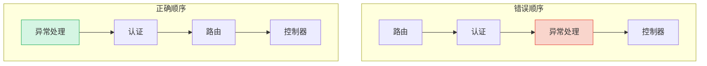

# 中间件注册顺序与最佳实践

中间件的注册顺序是 ASP.NET Core 应用中最关键的设计决策之一。一个错误的顺序可能导致异常无法捕获、认证被绕过、CORS 头缺失等严重问题。本章将深入探讨注册顺序的重要性和最佳实践。

## 注册顺序的绝对重要性

中间件按注册顺序组成管道，请求从第一个注册的中间件进入，响应从最后一个注册的中间件返回。顺序错误意味着请求可能在错误的时间被处理，甚至完全跳过关键的处理步骤。

### 错误顺序 vs 正确顺序



**错误顺序的问题**：

1. 异常处理在最内层——如果路由或认证模块抛出异常，异常处理中间件无法捕获
2. 认证在路由之后——授权检查可能在没有认证信息的情况下执行

**正确顺序**：异常处理在最外层，确保所有异常都能被捕获；认证在路由之前，确保所有需要认证的请求都经过认证。

### 一个实际的顺序错误案例

```csharp
// 错误！CORS 在认证之后
app.UseAuthentication();
app.UseCors("AllowAll"); // CORS 头可能不会被添加
app.UseAuthorization();

// 当浏览器发送预检请求（OPTIONS）时：
// 1. 认证中间件可能因为没有凭据而拒绝请求
// 2. CORS 中间件没有机会添加响应头
// 3. 浏览器认为跨域请求被拒绝
```

```csharp
// 正确！CORS 在认证之前
app.UseCors("AllowAll");
app.UseAuthentication();
app.UseAuthorization();

// 预检请求流程：
// 1. CORS 中间件识别 OPTIONS 请求并添加响应头
// 2. 如果是预检请求，CORS 中间件短路返回
// 3. 正式请求继续走认证和授权
```

## 官方推荐的中间件顺序

以下是 ASP.NET Core 官方推荐的完整中间件注册顺序表，从上到下即为注册顺序：

| 顺序 | 中间件 | 作用 | 必须/可选 |
|------|--------|------|----------|
| 1 | `UseExceptionHandler` / `UseDeveloperExceptionPage` | 全局异常捕获 | 必须 |
| 2 | `UseHsts` | HTTP 严格传输安全 | 生产必须 |
| 3 | `UseHttpsRedirection` | HTTP 重定向到 HTTPS | 生产推荐 |
| 4 | `UseStaticFiles` | 静态文件服务 | 可选 |
| 5 | `UseCookiePolicy` | Cookie 合规策略 | 可选 |
| 6 | `UseRouting` | 路由匹配 | 必须 |
| 7 | `UseCors` | 跨域资源共享 | 可选 |
| 8 | `UseAuthentication` | 身份认证 | 可选 |
| 9 | `UseAuthorization` | 授权检查 | 可选 |
| 10 | `UseSession` | 会话状态 | 可选 |
| 11 | `UseRateLimiter` | 请求限流 | 可选 |
| 12 | 自定义中间件 | 业务中间件 | 按需 |
| 13 | `MapControllers` / `MapRazorPages` 等 | 端点路由 | 必须 |

::: important 端点路由的顺序
`UseRouting()` 和 `MapControllers()` 之间是放置大多数中间件的位置。`UseRouting()` 确定路由信息，`UseCors()`、`UseAuthentication()`、`UseAuthorization()` 等中间件在路由确定之后、端点执行之前运行。
:::

## 常见顺序错误

### 错误1：异常处理不在最外层

```csharp
// 错误！异常处理在认证之后
app.UseAuthentication();
app.UseExceptionHandler("/Error"); // 认证模块的异常无法被捕获
app.UseAuthorization();
```

如果认证中间件抛出异常（如数据库连接失败），异常处理中间件无法捕获它，因为异常发生在它的上游。

```csharp
// 正确！异常处理在最外层
app.UseExceptionHandler("/Error");
app.UseAuthentication();
app.UseAuthorization();
```

### 错误2：认证在授权之后

```csharp
// 错误！授权在认证之前
app.UseAuthorization(); // 此时 User 还是匿名用户
app.UseAuthentication(); // 认证在这才执行
```

授权中间件检查 `context.User` 的声明信息，但如果认证还没执行，`context.User` 还是匿名身份，所有需要认证的请求都会被拒绝。

```csharp
// 正确！先认证后授权
app.UseAuthentication();
app.UseAuthorization();
```

### 错误3：HSTS 在 HTTPS 重定向之后

```csharp
// 错误！HSTS 在 HTTPS 重定向之后
app.UseHttpsRedirection(); // HTTP 请求被重定向
app.UseHsts(); // HSTS 头不会被添加到最初的 HTTP 响应
```

HSTS 的作用是告诉浏览器"以后都用 HTTPS 访问"。它需要在 HTTPS 重定向之前运行，这样才能在第一次 HTTP 响应中就添加 HSTS 头。

```csharp
// 正确！HSTS 在 HTTPS 重定向之前
app.UseHsts();
app.UseHttpsRedirection();
```

### 错误4：CORS 在认证之后

```csharp
// 错误！CORS 在认证之后
app.UseAuthentication();
app.UseCors("AllowAll");
```

浏览器发送 CORS 预检请求（OPTIONS）时不会携带认证信息。如果认证中间件先执行，可能会拒绝预检请求，导致 CORS 中间件根本没有机会添加响应头。

```csharp
// 正确！CORS 在认证之前
app.UseCors("AllowAll");
app.UseAuthentication();
```

### 错误5：静态文件在 MVC 之后

```csharp
// 错误！静态文件在 MVC 之后
app.UseRouting();
app.MapControllers();
app.UseStaticFiles(); // 静态文件永远不会被命中
```

`MapControllers()` 是终端中间件，请求到达后就不会继续传递。静态文件中间件在它之后注册，永远不会收到请求。

```csharp
// 正确！静态文件在路由之前
app.UseStaticFiles();
app.UseRouting();
app.MapControllers();
```

### 顺序错误速查表

| 错误 | 后果 | 正确顺序 |
|------|------|---------|
| 异常处理不在最外层 | 上游异常无法捕获 | 异常处理 → 其他 |
| 认证在授权之后 | 授权时用户为匿名 | 认证 → 授权 |
| HSTS 在 HTTPS 重定向之后 | HSTS 头缺失 | HSTS → HTTPS 重定向 |
| CORS 在认证之后 | 预检请求被认证拦截 | CORS → 认证 |
| 静态文件在 MVC 之后 | 静态文件无法访问 | 静态文件 → MVC |

## 中间件短路

短路（Short-circuiting）是指中间件不调用 `next(context)`，直接返回响应。这是一种重要的优化手段，可以避免不必要的处理。

### 常见短路场景

```csharp
// 1. 健康检查——无需经过完整管道
app.Use(async (context, next) =>
{
    if (context.Request.Path == "/health")
    {
        context.Response.StatusCode = 200;
        await context.Response.WriteAsync("Healthy");
        return; // 短路，不调用 next
    }
    await next(context);
});

// 2. 维护模式——直接返回503
app.Use(async (context, next) =>
{
    if (_maintenanceMode)
    {
        context.Response.StatusCode = 503;
        await context.Response.WriteAsync("Service Unavailable");
        return; // 短路
    }
    await next(context);
});

// 3. 静态文件命中——直接返回文件
// UseStaticFiles 内部就是短路实现的
app.UseStaticFiles(); // 找到文件就返回，不再调用后续中间件

// 4. CORS 预检请求——直接返回200
// UseCors 内部对 OPTIONS 预检请求短路
app.UseCors();
```

### 短路的影响

- 短路中间件之后的中间件**不会执行**
- 短路中间件之前的中间件的**后处理逻辑仍会执行**
- 如果短路中间件在日志中间件之后，日志中间件仍会记录响应信息

```csharp
app.Use(async (context, next) =>
{
    Console.WriteLine("A: 请求进入");
    await next(context);
    Console.WriteLine("A: 响应返回"); // 即使后续短路，这行仍会执行
});

app.Use(async (context, next) =>
{
    Console.WriteLine("B: 请求进入");
    // 短路！不调用 next
    context.Response.StatusCode = 200;
    await context.Response.WriteAsync("Short-circuited");
    Console.WriteLine("B: 响应返回");
});

app.Use(async (context, next) =>
{
    Console.WriteLine("C: 请求进入"); // 不会执行
    await next(context);
});

// 输出：A进 → B进 → B出 → A出
```

## 条件注册（app.UseWhen）

`UseWhen` 允许根据条件添加中间件，且条件分支处理完后仍回到主管道。

### 基本用法

```csharp
// 只对 API 路径添加日志中间件
app.UseWhen(
    context => context.Request.Path.StartsWithSegments("/api"),
    branch =>
    {
        branch.Use(async (context, next) =>
        {
            Console.WriteLine($"API 请求: {context.Request.Path}");
            await next(context);
            Console.WriteLine($"API 响应: {context.Response.StatusCode}");
        });
    }
);
```

### UseWhen vs MapWhen

```csharp
// UseWhen：条件分支处理完后回到主管道
app.UseWhen(
    context => context.Request.Query.ContainsKey("debug"),
    branch =>
    {
        branch.Use(async (context, next) =>
        {
            context.Items["DebugMode"] = true;
            await next(context); // 继续执行后续中间件
        });
    }
);
// 请求会继续走主管道的后续中间件

// MapWhen：条件匹配后脱离主管道
app.MapWhen(
    context => context.Request.Query.ContainsKey("debug"),
    branch =>
    {
        branch.Run(async context =>
        {
            await context.Response.WriteAsync("Debug info");
            // 请求不会回到主管道
        });
    }
);
```

### 实际应用场景

```csharp
// 1. 对特定路径添加性能监控
app.UseWhen(
    context => context.Request.Path.StartsWithSegments("/api/slow"),
    branch =>
    {
        branch.UseMiddleware<SlowRequestMonitorMiddleware>();
    }
);

// 2. 对移动端请求添加特殊处理
app.UseWhen(
    context =>
    {
        var userAgent = context.Request.Headers.UserAgent.ToString();
        return userAgent.Contains("Mobile") || userAgent.Contains("Android");
    },
    branch =>
    {
        branch.Use(async (context, next) =>
        {
            context.Items["IsMobile"] = true;
            await next(context);
        });
    }
);

// 3. 开发环境启用调试中间件
app.UseWhen(
    context => app.Environment.IsDevelopment(),
    branch =>
    {
        branch.Use(async (context, next) =>
        {
            context.Items["DebugMode"] = true;
            await next(context);
        });
    }
);
```

## 最佳实践清单

### 注册顺序

- [ ] 异常处理中间件始终第一个注册
- [ ] HSTS 在 HTTPS 重定向之前
- [ ] HTTPS 重定向在静态文件之前
- [ ] 静态文件在路由之前
- [ ] CORS 在认证之前
- [ ] 认证在授权之前
- [ ] 自定义中间件在认证/授权之后、端点之前
- [ ] 终端中间件（MapControllers 等）最后注册

### 中间件设计

- [ ] 通过扩展方法封装中间件注册
- [ ] 使用选项模式（IOptions）管理配置
- [ ] 避免在中间件中执行耗时操作
- [ ] 检查 `Response.HasStarted` 再修改响应
- [ ] 在短路时确保设置了正确的状态码和响应体

### 依赖注入

- [ ] 约定式中间件：Singleton 服务注入构造函数，Scoped 服务注入 `InvokeAsync` 参数
- [ ] IMiddleware 中间件：所有服务都可以注入构造函数
- [ ] 不要在构造函数中注入 Scoped 服务到约定式中间件

### 性能

- [ ] 健康检查等高频请求使用短路避免走完整管道
- [ ] 静态文件中间件放在路由之前
- [ ] 避免在中间件中进行同步 I/O 操作
- [ ] 使用 `ValueTask` 替代 `Task` 优化热路径（高级）

### 安全

- [ ] HSTS 仅在生产环境启用
- [ ] HTTPS 重定向在生产环境启用
- [ ] CORS 策略不要使用 `AllowAnyOrigin` + `AllowCredentials`
- [ ] 认证和授权中间件不可省略，即使有 API Gateway

### 完整的标准模板

```csharp
var builder = WebApplication.CreateBuilder(args);

// === 注册服务 ===
builder.Services.AddRouting();
builder.Services.AddCors(options =>
{
    options.AddDefaultPolicy(policy =>
    {
        policy.WithOrigins("https://example.com")
              .AllowAnyMethod()
              .AllowAnyHeader()
              .AllowCredentials();
    });
});
builder.Services.AddAuthentication(JwtBearerDefaults.AuthenticationScheme)
    .AddJwtBearer(options => { /* JWT 配置 */ });
builder.Services.AddAuthorization();
builder.Services.AddRateLimiter(options =>
{
    options.AddFixedWindowLimiter("fixed", opt =>
    {
        opt.PermitLimit = 100;
        opt.Window = TimeSpan.FromMinutes(1);
    });
});

var app = builder.Build();

// === 中间件注册（按官方推荐顺序） ===

// 1. 异常处理（最外层）
if (app.Environment.IsDevelopment())
{
    app.UseDeveloperExceptionPage();
}
else
{
    app.UseExceptionHandler("/Error");
    app.UseHsts();                   // 2. HSTS（仅生产）
}

// 3. HTTPS 重定向
app.UseHttpsRedirection();

// 4. 静态文件
app.UseStaticFiles();

// 5. Cookie 策略
app.UseCookiePolicy();

// 6. 路由
app.UseRouting();

// 7. CORS
app.UseCors();

// 8. 认证
app.UseAuthentication();

// 9. 授权
app.UseAuthorization();

// 10. 限流
app.UseRateLimiter();

// 11. 自定义中间件
app.UseRequestLogging();
app.UseMiddleware<PerformanceMonitorMiddleware>();

// 12. 端点映射（最后）
app.MapControllers();
app.MapHealthChecks("/health");

app.Run();
```

## 小结

- 中间件注册顺序是 ASP.NET Core 中最关键的设计决策之一
- 核心原则：异常处理最外层，CORS 在认证之前，认证在授权之前
- 短路是优化性能的重要手段，但要注意对后续中间件的影响
- `UseWhen` 用于条件注册且不脱离主管道，`MapWhen` 用于条件分支且脱离主管道
- 务必遵循官方推荐顺序，使用标准模板确保一致性
