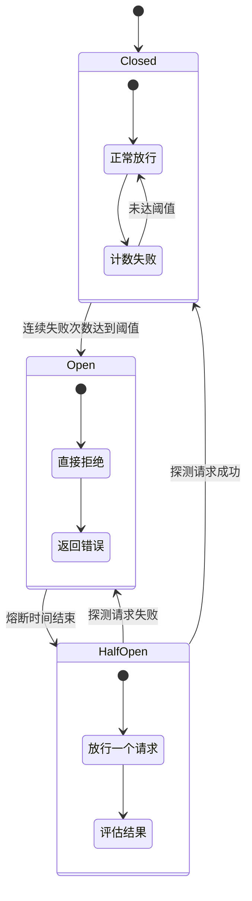

# 请求重试与熔断降级

> 网络不可靠是分布式系统的第一定律。重试解决临时故障，熔断防止故障蔓延，降级保证核心功能可用。三者协同，让系统在逆境中依然能够运转——不是完美运转，而是降级运转，但绝不崩溃。

---

## 一、请求重试中间件

### 1.1 为什么需要重试

在分布式系统中，以下瞬时故障非常常见：

| 故障类型 | 发生频率 | 持续时间 | 是否可重试 |
|----------|----------|----------|------------|
| 网络抖动 | 高 | 毫秒级 | 是 |
| DNS解析超时 | 中 | 秒级 | 是 |
| 服务端503 | 中 | 秒到分钟 | 是（需退避） |
| 服务端500 | 低 | 不确定 | 视情况 |
| 连接池耗尽 | 中 | 秒级 | 是 |
| 服务端业务错误 | - | - | 否 |

重试的关键原则：**只重试可能因临时故障失败的请求，不重试因业务逻辑导致的失败**。

### 1.2 幂等方法判断

HTTP方法的幂等性决定了是否可以安全重试：

| 方法 | 幂等性 | 可重试 | 说明 |
|------|--------|--------|------|
| GET | 幂等 | 可以 | 读操作，重复执行无副作用 |
| HEAD | 幂等 | 可以 | 同GET |
| OPTIONS | 幂等 | 可以 | 同GET |
| PUT | 幂等 | 可以 | 全量替换，重复执行结果相同 |
| DELETE | 幂等 | 可以 | 删除已删除的资源返回404，无副作用 |
| POST | 非幂等 | 谨慎 | 可能创建重复资源 |
| PATCH | 视情况 | 谨慎 | 取决于具体操作 |

### 1.3 指数退避策略

重试之间不应立即发起，而应逐渐增加等待时间。指数退避（Exponential Backoff）是最常用的策略：

```
第1次重试：等 1 秒
第2次重试：等 2 秒
第3次重试：等 4 秒
第4次重试：等 8 秒
...

每次等待时间翻倍，加上随机抖动（Jitter）防止惊群效应
```

为什么需要抖动？如果所有请求在同一时刻重试，会再次打垮服务端。抖动让重试时间分散开：

```
无抖动：  重试1 → 1s → 重试2 → 2s → 重试3 → 4s
有抖动：  重试1 → 1.3s → 重试2 → 2.7s → 重试3 → 3.1s
                                    ↑
                            随机偏移（0-50%）
```

### 1.4 可重试状态码配置

```csharp
/// <summary>
/// 请求重试中间件配置
/// </summary>
public class RequestRetryOptions
{
    /// <summary>最大重试次数（不含首次请求）</summary>
    public int MaxRetryCount { get; set; } = 3;

    /// <summary>基础延迟（秒），实际延迟 = base * 2^retryCount + jitter</summary>
    public double BaseDelaySeconds { get; set; } = 1.0;

    /// <summary>最大延迟（秒），防止指数增长过大</summary>
    public double MaxDelaySeconds { get; set; } = 30.0;

    /// <summary>抖动比例（0-1），0表示无抖动</summary>
    public double JitterFactor { get; set; } = 0.3;

    /// <summary>可重试的HTTP状态码</summary>
    public HashSet<int> RetryableStatusCodes { get; set; } = new()
    {
        StatusCodes.Status408RequestTimeout,
        StatusCodes.Status429TooManyRequests,
        StatusCodes.Status500InternalServerError,
        StatusCodes.Status502BadGateway,
        StatusCodes.Status503ServiceUnavailable,
        StatusCodes.Status504GatewayTimeout
    };

    /// <summary>可重试的HTTP方法</summary>
    public HashSet<string> RetryableMethods { get; set; } = new(StringComparer.OrdinalIgnoreCase)
    {
        "GET",
        "HEAD",
        "OPTIONS",
        "PUT",
        "DELETE"
    };

    /// <summary>可重试的异常类型</summary>
    public HashSet<Type> RetryableExceptions { get; set; } = new()
    {
        typeof(HttpRequestException),
        typeof(TaskCanceledException),
        typeof(TimeoutException)
    };

    /// <summary>排除的路径（不重试）</summary>
    public List<string> ExcludedPaths { get; set; } = new();

    /// <summary>重试前的回调（用于日志/指标）</summary>
    public Func<int, TimeSpan, HttpContext, Task>? OnRetryAsync { get; set; }
}
```

### 1.5 完整重试中间件实现

```csharp
/// <summary>
/// 请求重试中间件
/// </summary>
public class RequestRetryMiddleware
{
    private readonly RequestDelegate _next;
    private readonly RequestRetryOptions _options;
    private readonly ILogger<RequestRetryMiddleware> _logger;

    public RequestRetryMiddleware(
        RequestDelegate next,
        IOptions<RequestRetryOptions> options,
        ILogger<RequestRetryMiddleware> logger)
    {
        _next = next;
        _options = options.Value;
        _logger = logger;
    }

    public async Task InvokeAsync(HttpContext context)
    {
        // 检查排除路径
        if (IsExcludedPath(context.Request.Path))
        {
            await _next(context);
            return;
        }

        // 检查方法是否可重试
        if (!_options.RetryableMethods.Contains(context.Request.Method))
        {
            await _next(context);
            return;
        }

        // 检查请求体是否可重复读取
        if (context.Request.Method.Equals("PUT", StringComparison.OrdinalIgnoreCase) ||
            context.Request.Method.Equals("PATCH", StringComparison.OrdinalIgnoreCase))
        {
            EnableRequestBodyBuffering(context);
        }

        var retryCount = 0;

        while (true)
        {
            try
            {
                // 重置请求体位置（PUT/PATCH需要重新发送请求体）
                if (context.Request.Body.CanSeek)
                {
                    context.Request.Body.Seek(0, SeekOrigin.Begin);
                }

                // 重置响应（每次重试需要干净的响应）
                var originalBody = context.Response.Body;
                using var memoryStream = new MemoryStream();
                context.Response.Body = memoryStream;

                try
                {
                    await _next(context);
                }
                catch (Exception ex) when (IsRetryableException(ex) && retryCount < _options.MaxRetryCount)
                {
                    // 重置响应体
                    context.Response.Body = originalBody;
                    memoryStream.SetLength(0);

                    retryCount++;
                    var delay = CalculateDelay(retryCount);

                    _logger.LogWarning(
                        "请求异常，第{RetryCount}次重试：{Method} {Path}，" +
                        "异常：{Exception}，等待{DelayMs}ms",
                        retryCount, context.Request.Method, context.Request.Path,
                        ex.GetType().Name, delay.TotalMilliseconds);

                    if (_options.OnRetryAsync != null)
                    {
                        await _options.OnRetryAsync(retryCount, delay, context);
                    }

                    await Task.Delay(delay);
                    continue;
                }

                // 检查响应状态码是否可重试
                if (IsRetryableStatusCode(context.Response.StatusCode) &&
                    retryCount < _options.MaxRetryCount)
                {
                    // 重置响应体
                    context.Response.Body = originalBody;
                    memoryStream.SetLength(0);

                    retryCount++;

                    // 429特殊处理：读取Retry-After头部
                    var delay = context.Response.StatusCode == StatusCodes.Status429TooManyRequests
                        ? GetRetryAfterDelay(context)
                        : CalculateDelay(retryCount);

                    _logger.LogWarning(
                        "响应状态码{StatusCode}，第{RetryCount}次重试：{Method} {Path}，" +
                        "等待{DelayMs}ms",
                        context.Response.StatusCode, retryCount,
                        context.Request.Method, context.Request.Path,
                        delay.TotalMilliseconds);

                    if (_options.OnRetryAsync != null)
                    {
                        await _options.OnRetryAsync(retryCount, delay, context);
                    }

                    await Task.Delay(delay);
                    continue;
                }

                // 成功或不可重试，返回响应
                memoryStream.Seek(0, SeekOrigin.Begin);
                await memoryStream.CopyToAsync(originalBody);
                context.Response.Body = originalBody;
                return;
            }
            catch (Exception ex) when (!IsRetryableException(ex) ||
                                       retryCount >= _options.MaxRetryCount)
            {
                _logger.LogError(ex,
                    "请求失败且不可重试或已达最大重试次数：{Method} {Path}",
                    context.Request.Method, context.Request.Path);
                throw;
            }
        }
    }

    /// <summary>
    /// 计算重试延迟（指数退避 + 抖动）
    /// </summary>
    private TimeSpan CalculateDelay(int retryCount)
    {
        // 指数退避：base * 2^(retryCount-1)
        var delaySeconds = _options.BaseDelaySeconds * Math.Pow(2, retryCount - 1);

        // 限制最大延迟
        delaySeconds = Math.Min(delaySeconds, _options.MaxDelaySeconds);

        // 添加抖动
        if (_options.JitterFactor > 0)
        {
            var jitter = delaySeconds * _options.JitterFactor * Random.Shared.NextDouble();
            delaySeconds += jitter;
        }

        return TimeSpan.FromSeconds(delaySeconds);
    }

    /// <summary>
    /// 从429响应中获取Retry-After延迟
    /// </summary>
    private TimeSpan GetRetryAfterDelay(HttpContext context)
    {
        var retryAfter = context.Response.Headers.RetryAfter.ToString();

        if (int.TryParse(retryAfter, out var seconds))
        {
            return TimeSpan.FromSeconds(seconds);
        }

        if (DateTimeOffset.TryParse(retryAfter, out var date))
        {
            var delay = date - DateTimeOffset.UtcNow;
            return delay > TimeSpan.Zero ? delay : CalculateDelay(1);
        }

        return CalculateDelay(1);
    }

    private bool IsRetryableStatusCode(int statusCode) =>
        _options.RetryableStatusCodes.Contains(statusCode);

    private bool IsRetryableException(Exception ex) =>
        _options.RetryableExceptions.Any(t => t.IsInstanceOfType(ex));

    private bool IsExcludedPath(PathString path) =>
        _options.ExcludedPaths.Any(p =>
            path.StartsWithSegments(p, StringComparison.OrdinalIgnoreCase));

    private static void EnableRequestBodyBuffering(HttpContext context)
    {
        context.Request.EnableBuffering();
    }
}

/// <summary>
/// 请求重试中间件扩展
/// </summary>
public static class RequestRetryMiddlewareExtensions
{
    public static IApplicationBuilder UseRequestRetry(
        this IApplicationBuilder app,
        Action<RequestRetryOptions>? configure = null)
    {
        var options = new RequestRetryOptions();
        configure?.Invoke(options);

        return app.UseMiddleware<RequestRetryMiddleware>(
            Options.Create(options));
    }
}
```

注册使用：

```csharp
// 基本使用
app.UseRequestRetry();

// 自定义配置
app.UseRequestRetry(options =>
{
    options.MaxRetryCount = 3;
    options.BaseDelaySeconds = 0.5;
    options.MaxDelaySeconds = 10;
    options.JitterFactor = 0.2;
    options.RetryableStatusCodes = new HashSet<int>
    {
        408, 429, 500, 502, 503, 504
    };
    options.RetryableMethods = new HashSet<string>(StringComparer.OrdinalIgnoreCase)
    {
        "GET", "HEAD", "OPTIONS", "PUT", "DELETE"
    };
    options.OnRetryAsync = (retryCount, delay, context) =>
    {
        // 记录重试指标
        _metrics.Increment("http.retries");
        return Task.CompletedTask;
    };
});
```

### 1.6 业务场景：调用不稳定第三方API

一个电商系统调用第三方支付网关，支付网关偶尔超时或返回503：

```csharp
app.UseRequestRetry(options =>
{
    options.MaxRetryCount = 2;        // 最多重试2次（共3次尝试）
    options.BaseDelaySeconds = 1;     // 首次重试等1秒
    options.MaxDelaySeconds = 5;     // 最长等5秒
    options.RetryableStatusCodes = new HashSet<int> { 408, 502, 503, 504 },
    options.ExcludedPaths = new List<string>
    {
        "/api/payments/callback"  // 支付回调不重试（由支付方重试）
    };
});
```

---

## 二、与Polly集成

[Polly](https://github.com/App-vNext/Polly) 是 .NET 生态中最成熟的弹性框架，提供了重试、熔断、超时、回退等策略的声明式组合。

### 2.1 Polly重试策略

```csharp
// 安装Polly
// dotnet add package Polly

using Polly;
using Polly.Retry;

// 创建重试策略
var retryPolicy = Policy
    .Handle<HttpRequestException>()
    .Or<TaskCanceledException>()
    .OrResult<HttpResponseMessage>(r =>
        r.StatusCode == HttpStatusCode.ServiceUnavailable ||
        r.StatusCode == HttpStatusCode.GatewayTimeout)
    .WaitAndRetryAsync(
        retryCount: 3,
        sleepDurationProvider: retryAttempt =>
            TimeSpan.FromSeconds(Math.Pow(2, retryAttempt)) +   // 指数退避
            TimeSpan.FromMilliseconds(Random.Shared.Next(0, 1000)),  // 抖动
        onRetry: (outcome, timespan, retryCount, context) =>
        {
            // 重试回调
            Console.WriteLine(
                $"重试第{retryCount}次，等待{timespan.TotalSeconds:F1}s，" +
                $"原因：{outcome.Exception?.Message ?? outcome.Result.StatusCode.ToString()}");
        });
```

### 2.2 熔断策略

```csharp
using Polly.CircuitBreaker;

// 创建熔断策略
var circuitBreakerPolicy = Policy
    .Handle<HttpRequestException>()
    .Or<TaskCanceledException>()
    .CircuitBreakerAsync(
        exceptionsAllowedBeforeBreaking: 5,     // 连续5次失败后熔断
        durationOfBreak: TimeSpan.FromSeconds(30),  // 熔断30秒
        onBreak: (ex, breakDelay) =>
        {
            Console.WriteLine($"熔断开启，持续{breakDelay.TotalSeconds}s，原因：{ex.Message}");
        },
        onReset: () =>
        {
            Console.WriteLine("熔断恢复");
        },
        onHalfOpen: () =>
        {
            Console.WriteLine("熔断半开，尝试放行一个请求");
        });
```

### 2.3 超时策略

```csharp
using Polly.Timeout;

// 乐观超时（依赖CancellationToken）
var timeoutPolicy = Policy
    .TimeoutAsync<HttpResponseMessage>(TimeSpan.FromSeconds(10));

// 悲观超时（强制取消，不依赖CancellationToken）
var pessimisticTimeoutPolicy = Policy
    .TimeoutAsync<HttpResponseMessage>(
        TimeSpan.FromSeconds(30),
        TimeoutStrategy.Pessimistic);
```

### 2.4 回退策略

```csharp
using Polly.Fallback;

// 创建回退策略（降级响应）
var fallbackPolicy = Policy<HttpResponseMessage>
    .Handle<HttpRequestException>()
    .Or<TaskCanceledException>()
    .Or<BrokenCircuitException>()
    .FallbackAsync(
        fallbackAction: async cancellationToken =>
        {
            // 返回降级响应
            var fallbackContent = JsonSerializer.Serialize(new
            {
                status = "degraded",
                message = "服务暂时不可用，返回默认数据"
            });

            return new HttpResponseMessage(HttpStatusCode.OK)
            {
                Content = new StringContent(
                    fallbackContent, Encoding.UTF8, "application/json")
            };
        },
        onFallbackAsync: async (ex, cancellationToken) =>
        {
            Console.WriteLine($"执行降级：{ex.Exception?.Message}");
            await Task.CompletedTask;
        });
```

### 2.5 在中间件中使用Polly

将多种策略组合为管道，按顺序执行：

```csharp
/// <summary>
/// Polly弹性中间件配置
/// </summary>
public class PollyResilienceOptions
{
    /// <summary>重试次数</summary>
    public int RetryCount { get; set; } = 3;

    /// <summary>熔断前允许的连续失败次数</summary>
    public int CircuitBreakerFailureCount { get; set; } = 5;

    /// <summary>熔断持续时间（秒）</summary>
    public int CircuitBreakerDurationSeconds { get; set; } = 30;

    /// <summary>请求超时（秒）</summary>
    public int TimeoutSeconds { get; set; } = 10;

    /// <summary>是否启用降级</summary>
    public bool EnableFallback { get; set; } = true;

    /// <summary>降级响应内容</summary>
    public string FallbackResponseContent { get; set; } =
        "{\"status\":\"degraded\",\"message\":\"Service temporarily unavailable\"}";

    /// <summary>排除路径</summary>
    public List<string> ExcludedPaths { get; set; } = new();
}

/// <summary>
/// Polly弹性中间件
/// </summary>
public class PollyResilienceMiddleware
{
    private readonly RequestDelegate _next;
    private readonly AsyncPolicy<HttpContext> _policy;
    private readonly PollyResilienceOptions _options;
    private readonly ILogger<PollyResilienceMiddleware> _logger;

    public PollyResilienceMiddleware(
        RequestDelegate next,
        IOptions<PollyResilienceOptions> options,
        ILogger<PollyResilienceMiddleware> logger)
    {
        _next = next;
        _options = options.Value;
        _logger = logger;

        // 构建策略管道：Fallback → CircuitBreaker → Retry → Timeout
        _policy = BuildPolicyPipeline();
    }

    private AsyncPolicy<HttpContext> BuildPolicyPipeline()
    {
        // 超时策略
        var timeout = Policy.TimeoutAsync<HttpContext>(
            TimeSpan.FromSeconds(_options.TimeoutSeconds),
            TimeoutStrategy.Pessimistic);

        // 重试策略
        var retry = Policy<HttpContext>
            .Handle<Exception>()
            .WaitAndRetryAsync(
                _options.RetryCount,
                retryAttempt => TimeSpan.FromSeconds(Math.Pow(2, retryAttempt - 1)) +
                               TimeSpan.FromMilliseconds(Random.Shared.Next(0, 500)),
                onRetry: (outcome, delay, retryCount, context) =>
                {
                    _logger.LogWarning(
                        "Polly重试第{Count}次，等待{Delay:F1}s：{Exception}",
                        retryCount, delay.TotalSeconds,
                        outcome.Exception?.Message ?? "Unknown");
                });

        // 熔断策略
        var circuitBreaker = Policy<HttpContext>
            .Handle<Exception>()
            .CircuitBreakerAsync(
                exceptionsAllowedBeforeBreaking: _options.CircuitBreakerFailureCount,
                durationOfBreak: TimeSpan.FromSeconds(_options.CircuitBreakerDurationSeconds),
                onBreak: (ex, duration) =>
                {
                    _logger.LogWarning("Polly熔断开启，持续{Duration}s：{Exception}",
                        duration.TotalSeconds, ex.Exception?.Message);
                },
                onReset: () =>
                {
                    _logger.LogInformation("Polly熔断恢复");
                },
                onHalfOpen: () =>
                {
                    _logger.LogInformation("Polly熔断半开");
                });

        // 组合策略
        var pipeline = Policy.WrapAsync(retry, circuitBreaker, timeout);

        // 降级策略（最外层）
        if (_options.EnableFallback)
        {
            var fallback = Policy<HttpContext>
                .Handle<Exception>()
                .Or<BrokenCircuitException>()
                .FallbackAsync(
                    fallbackAction: async (cancellationToken) =>
                    {
                        // 这里返回降级后的HttpContext
                        // 实际应用中需要根据场景定制
                        throw new NotImplementedException("请在中间件中实现降级逻辑");
                    },
                    onFallbackAsync: async (ex, token) =>
                    {
                        _logger.LogWarning("Polly降级执行：{Exception}",
                            ex.Exception?.Message);
                        await Task.CompletedTask;
                    });

            pipeline = Policy.WrapAsync(fallback, pipeline);
        }

        return pipeline;
    }

    public async Task InvokeAsync(HttpContext context)
    {
        if (IsExcludedPath(context.Request.Path))
        {
            await _next(context);
            return;
        }

        // 通过Polly策略执行请求
        // 注意：这里简化了实现，实际需要在策略中执行_next(context)
        // 更好的方式是使用IHttpClientFactory + Polly，见下文
        try
        {
            await _next(context);
        }
        catch (Exception ex)
        {
            _logger.LogError(ex, "请求执行异常：{Method} {Path}",
                context.Request.Method, context.Request.Path);
            throw;
        }
    }

    private bool IsExcludedPath(PathString path) =>
        _options.ExcludedPaths.Any(p =>
            path.StartsWithSegments(p, StringComparison.OrdinalIgnoreCase));
}
```

### 2.6 推荐方式：IHttpClientFactory + Polly

在中间件中直接包装 `HttpContext` 比较别扭。更推荐的方式是为外部HTTP调用配置 `IHttpClientFactory` + Polly：

```csharp
// 注册HttpClient + Polly策略
builder.Services.AddHttpClient("PaymentGateway", client =>
{
    client.BaseAddress = new Uri("https://payment.example.com");
    client.Timeout = TimeSpan.FromSeconds(30);
})
.AddResilienceHandler("payment-pipeline", builder =>
{
    // 重试
    builder.AddRetry(new HttpRetryStrategyOptions
    {
        MaxRetryAttempts = 3,
        Delay = TimeSpan.FromMilliseconds(500),
        BackoffType = DelayBackoffType.Exponential,
        UseJitter = true,
        ShouldHandle = new PredicateBuilder<HttpResponseMessage>()
            .Handle<HttpRequestException>()
            .HandleResult(r => r.StatusCode == HttpStatusCode.ServiceUnavailable)
    });

    // 熔断
    builder.AddCircuitBreaker(new HttpCircuitBreakerStrategyOptions
    {
        SamplingDuration = TimeSpan.FromSeconds(30),
        FailureRatio = 0.5,
        MinimumThroughput = 10,
        BreakDuration = TimeSpan.FromSeconds(30)
    });

    // 超时
    builder.AddTimeout(TimeSpan.FromSeconds(10));
});

// 在服务中使用
public class PaymentService
{
    private readonly HttpClient _client;

    public PaymentService(IHttpClientFactory httpClientFactory)
    {
        _client = httpClientFactory.CreateClient("PaymentGateway");
    }

    public async Task<PaymentResult> ChargeAsync(ChargeRequest request)
    {
        var response = await _client.PostAsJsonAsync("/api/charge", request);
        response.EnsureSuccessStatusCode();
        return await response.Content.ReadFromJsonAsync<PaymentResult>();
    }
}
```

---

## 三、服务降级中间件

### 3.1 降级策略

当后端服务不可用时，有三种降级策略：

| 策略 | 做法 | 适用场景 | 用户体验 |
|------|------|----------|----------|
| 返回缓存 | 返回最近一次成功的缓存结果 | 读操作 | 几乎无感知 |
| 返回默认值 | 返回预定义的兜底数据 | 非关键读操作 | 部分功能受限 |
| 返回简化响应 | 返回部分数据或去掉非核心字段 | 列表/搜索 | 功能降级但可用 |

### 3.2 降级触发条件

```csharp
/// <summary>
/// 降级触发条件
/// </summary>
public class DegradationTrigger
{
    /// <summary>错误率阈值（0-1），超过此值触发降级</summary>
    public double ErrorRateThreshold { get; set; } = 0.5;

    /// <summary>统计窗口大小（秒）</summary>
    public int WindowSeconds { get; set; } = 60;

    /// <summary>最小请求数（窗口内请求数低于此值不判断错误率）</summary>
    public int MinimumRequests { get; set; } = 10;

    /// <summary>平均响应时间阈值（毫秒），超过此值触发降级</summary>
    public double AvgResponseTimeMsThreshold { get; set; } = 5000;

    /// <summary>并发请求数阈值，超过此值触发降级</summary>
    public int ConcurrentRequestsThreshold { get; set; } = 100;
}
```

### 3.3 完整降级中间件实现

```csharp
/// <summary>
/// 服务降级中间件配置
/// </summary>
public class DegradationOptions
{
    /// <summary>降级触发条件</summary>
    public DegradationTrigger Trigger { get; set; } = new();

    /// <summary>降级策略</summary>
    public DegradationStrategy Strategy { get; set; } = DegradationStrategy.DefaultValue;

    /// <summary>默认降级响应内容</summary>
    public string DefaultResponseContent { get; set; } =
        "{\"status\":\"degraded\",\"message\":\"服务暂时不可用\",\"data\":null}";

    /// <summary>默认降级响应状态码</summary>
    public int DefaultResponseStatusCode { get; set; } = StatusCodes.Status200OK;

    /// <summary>降级响应的Content-Type</summary>
    public string DefaultResponseContentType { get; set; } = "application/json";

    /// <summary>缓存降级响应的路径和内容</summary>
    public Dictionary<string, CachedDegradedResponse> CachedResponses { get; set; } = new();

    /// <summary>自定义降级处理函数</summary>
    public Func<HttpContext, Task>? CustomDegradationHandler { get; set; }

    /// <summary>排除路径</summary>
    public List<string> ExcludedPaths { get; set; } = new();

    /// <summary>降级状态变更回调</summary>
    public Action<bool>? OnDegradationStateChanged { get; set; }
}

/// <summary>
/// 降级策略枚举
/// </summary>
public enum DegradationStrategy
{
    /// <summary>返回默认值</summary>
    DefaultValue,
    /// <summary>返回缓存</summary>
    CachedResponse,
    /// <summary>返回简化响应</summary>
    SimplifiedResponse,
    /// <summary>自定义处理</summary>
    Custom
}

/// <summary>
/// 缓存的降级响应
/// </summary>
public class CachedDegradedResponse
{
    public string Content { get; set; } = string.Empty;
    public string ContentType { get; set; } = "application/json";
    public int StatusCode { get; set; } = 200;
}

/// <summary>
/// 服务降级中间件
/// </summary>
public class DegradationMiddleware
{
    private readonly RequestDelegate _next;
    private readonly DegradationOptions _options;
    private readonly ILogger<DegradationMiddleware> _logger;

    // 统计窗口
    private readonly ConcurrentDictionary<string, SlidingWindowCounter> _counters = new();
    private volatile bool _isDegraded;
    private int _currentConcurrentRequests;

    public DegradationMiddleware(
        RequestDelegate next,
        IOptions<DegradationOptions> options,
        ILogger<DegradationMiddleware> logger)
    {
        _next = next;
        _options = options.Value;
        _logger = logger;
    }

    public async Task InvokeAsync(HttpContext context)
    {
        if (IsExcludedPath(context.Request.Path))
        {
            await _next(context);
            return;
        }

        // 如果已降级，直接返回降级响应
        if (_isDegraded)
        {
            await ServeDegradedResponse(context);
            return;
        }

        // 检查并发数
        var concurrent = Interlocked.Increment(ref _currentConcurrentRequests);
        if (concurrent > _options.Trigger.ConcurrentRequestsThreshold)
        {
            Interlocked.Decrement(ref _currentConcurrentRequests);
            _logger.LogWarning("并发请求超过阈值：{Current} > {Threshold}",
                concurrent, _options.Trigger.ConcurrentRequestsThreshold);
            await ActivateDegradation(context);
            return;
        }

        var stopwatch = Stopwatch.StartNew();
        var succeeded = false;

        try
        {
            await _next(context);
            succeeded = context.Response.StatusCode < 500;
        }
        catch (Exception)
        {
            succeeded = false;
            throw;
        }
        finally
        {
            Interlocked.Decrement(ref _currentConcurrentRequests);
            stopwatch.Stop();

            // 记录请求统计
            RecordRequest(context.Request.Path, succeeded, stopwatch.Elapsed);

            // 检查是否需要触发降级
            CheckDegradationTrigger(context.Request.Path);
        }
    }

    /// <summary>
    /// 记录请求统计
    /// </summary>
    private void RecordRequest(string path, bool succeeded, TimeSpan duration)
    {
        var key = path;
        var counter = _counters.GetOrAdd(key, _ => new SlidingWindowCounter(
            _options.Trigger.WindowSeconds));

        counter.Record(succeeded, duration.TotalMilliseconds);
    }

    /// <summary>
    /// 检查降级触发条件
    /// </summary>
    private void CheckDegradationTrigger(string path)
    {
        if (_isDegraded) return;

        if (!_counters.TryGetValue(path, out var counter)) return;

        var stats = counter.GetStats();

        // 检查错误率
        if (stats.TotalRequests >= _options.Trigger.MinimumRequests &&
            stats.ErrorRate > _options.Trigger.ErrorRateThreshold)
        {
            _logger.LogWarning(
                "错误率超过阈值：{ErrorRate:P1} > {Threshold:P1}，触发降级",
                stats.ErrorRate, _options.Trigger.ErrorRateThreshold);
            ActivateDegradation();
            return;
        }

        // 检查平均响应时间
        if (stats.TotalRequests >= _options.Trigger.MinimumRequests &&
            stats.AvgResponseTimeMs > _options.Trigger.AvgResponseTimeMsThreshold)
        {
            _logger.LogWarning(
                "平均响应时间超过阈值：{AvgMs:F0}ms > {ThresholdMs:F0}ms，触发降级",
                stats.AvgResponseTimeMs, _options.Trigger.AvgResponseTimeMsThreshold);
            ActivateDegradation();
        }
    }

    /// <summary>
    /// 激活降级
    /// </summary>
    private void ActivateDegradation(HttpContext? context = null)
    {
        if (_isDegraded) return;

        _isDegraded = true;
        _logger.LogWarning("服务降级已激活");
        _options.OnDegradationStateChanged?.Invoke(true);

        // 自动恢复定时器
        _ = Task.Run(async () =>
        {
            await Task.Delay(TimeSpan.FromSeconds(_options.Trigger.WindowSeconds));
            _isDegraded = false;
            _logger.LogInformation("服务降级已恢复");
            _options.OnDegradationStateChanged?.Invoke(false);
        });
    }

    /// <summary>
    /// 返回降级响应
    /// </summary>
    private async Task ServeDegradedResponse(HttpContext context)
    {
        var path = context.Request.Path;

        // 检查是否有路径特定的缓存降级响应
        if (_options.CachedResponses.TryGetValue(path, out var cached))
        {
            context.Response.StatusCode = cached.StatusCode;
            context.Response.ContentType = cached.ContentType;
            context.Response.Headers["X-Degraded"] = "true";
            await context.Response.WriteAsync(cached.Content);
            return;
        }

        // 自定义处理
        if (_options.Strategy == DegradationStrategy.Custom &&
            _options.CustomDegradationHandler != null)
        {
            context.Response.Headers["X-Degraded"] = "true";
            await _options.CustomDegradationHandler(context);
            return;
        }

        // 默认降级响应
        context.Response.StatusCode = _options.DefaultResponseStatusCode;
        context.Response.ContentType = _options.DefaultResponseContentType;
        context.Response.Headers["X-Degraded"] = "true";
        await context.Response.WriteAsync(_options.DefaultResponseContent);
    }

    private bool IsExcludedPath(PathString path) =>
        _options.ExcludedPaths.Any(p =>
            path.StartsWithSegments(p, StringComparison.OrdinalIgnoreCase));
}

/// <summary>
/// 滑动窗口计数器
/// </summary>
public class SlidingWindowCounter
{
    private readonly int _windowSeconds;
    private readonly ConcurrentQueue<RequestRecord> _records = new();

    public SlidingWindowCounter(int windowSeconds)
    {
        _windowSeconds = windowSeconds;
    }

    public void Record(bool succeeded, double responseTimeMs)
    {
        _records.Enqueue(new RequestRecord
        {
            Timestamp = DateTime.UtcNow,
            Succeeded = succeeded,
            ResponseTimeMs = responseTimeMs
        });

        // 清理过期记录
        var threshold = DateTime.UtcNow.AddSeconds(-_windowSeconds);
        while (_records.TryPeek(out var record) && record.Timestamp < threshold)
        {
            _records.TryDequeue(out _);
        }
    }

    public WindowStats GetStats()
    {
        var threshold = DateTime.UtcNow.AddSeconds(-_windowSeconds);
        var records = _records.Where(r => r.Timestamp >= threshold).ToList();

        if (records.Count == 0)
        {
            return new WindowStats();
        }

        return new WindowStats
        {
            TotalRequests = records.Count,
            ErrorCount = records.Count(r => !r.Succeeded),
            ErrorRate = (double)records.Count(r => !r.Succeeded) / records.Count,
            AvgResponseTimeMs = records.Average(r => r.ResponseTimeMs)
        };
    }
}

public class RequestRecord
{
    public DateTime Timestamp { get; set; }
    public bool Succeeded { get; set; }
    public double ResponseTimeMs { get; set; }
}

public class WindowStats
{
    public int TotalRequests { get; set; }
    public int ErrorCount { get; set; }
    public double ErrorRate { get; set; }
    public double AvgResponseTimeMs { get; set; }
}
```

注册使用：

```csharp
app.UseMiddleware<DegradationMiddleware>(Options.Create(new DegradationOptions
{
    Trigger = new DegradationTrigger
    {
        ErrorRateThreshold = 0.5,
        WindowSeconds = 60,
        MinimumRequests = 10,
        AvgResponseTimeMsThreshold = 3000,
        ConcurrentRequestsThreshold = 50
    },
    Strategy = DegradationStrategy.CachedResponse,
    CachedResponses = new Dictionary<string, CachedDegradedResponse>
    {
        ["/api/products"] = new()
        {
            Content = JsonSerializer.Serialize(new
            {
                status = "degraded",
                message = "商品服务暂时不可用，显示缓存数据",
                data = new[] { new { id = 1, name = "示例商品" } }
            }),
            ContentType = "application/json",
            StatusCode = 200
        }
    },
    OnDegradationStateChanged = isDegraded =>
    {
        Console.WriteLine($"降级状态变更：{(isDegraded ? "已降级" : "已恢复")}");
    }
}));
```

---

## 四、熔断器模式

### 4.1 三状态模型

熔断器（Circuit Breaker）是服务保护的终极手段。它有三个状态：



| 状态 | 行为 | 转换条件 |
|------|------|----------|
| **Closed（关闭）** | 正常放行所有请求，统计失败次数 | 连续失败达到阈值 → Open |
| **Open（打开）** | 直接拒绝所有请求，快速失败 | 熔断时间结束 → HalfOpen |
| **HalfOpen（半开）** | 放行一个探测请求 | 探测成功 → Closed；探测失败 → Open |

### 4.2 完整CircuitBreaker实现

```csharp
/// <summary>
/// 熔断器状态
/// </summary>
public enum CircuitState
{
    Closed,
    Open,
    HalfOpen
}

/// <summary>
/// 熔断器配置
/// </summary>
public class CircuitBreakerOptions
{
    /// <summary>连续失败次数阈值，达到此值触发熔断</summary>
    public int FailureThreshold { get; set; } = 5;

    /// <summary>熔断持续时间（秒）</summary>
    public int OpenDurationSeconds { get; set; } = 30;

    /// <summary>HalfOpen状态下允许的探测请求数</summary>
    public int HalfOpenMaxRequests { get; set; } = 1;

    /// <summary>成功次数达到此值则从HalfOpen回到Closed</summary>
    public int HalfOpenSuccessThreshold { get; set; } = 3;

    /// <summary>哪些异常算作失败</summary>
    public HashSet<Type> FailureExceptionTypes { get; set; } = new()
    {
        typeof(HttpRequestException),
        typeof(TaskCanceledException),
        typeof(TimeoutException)
    };

    /// <summary>哪些HTTP状态码算作失败</summary>
    public HashSet<int> FailureStatusCodes { get; set; } = new()
    {
        StatusCodes.Status500InternalServerError,
        StatusCodes.Status502BadGateway,
        StatusCodes.Status503ServiceUnavailable,
        StatusCodes.Status504GatewayTimeout
    };

    /// <summary>熔断状态变更回调</summary>
    public Action<CircuitState, CircuitState>? OnStateChanged { get; set; }

    /// <summary>排除路径</summary>
    public List<string> ExcludedPaths { get; set; } = new();
}

/// <summary>
/// 熔断器
/// </summary>
public class CircuitBreaker
{
    private readonly CircuitBreakerOptions _options;
    private readonly object _lock = new();

    private CircuitState _state = CircuitState.Closed;
    private int _failureCount;
    private int _halfOpenSuccessCount;
    private int _halfOpenRequestCount;
    private DateTime _openedAt;

    public CircuitState State => _state;
    public int FailureCount => _failureCount;

    public CircuitBreaker(CircuitBreakerOptions options)
    {
        _options = options;
    }

    /// <summary>
    /// 检查是否允许请求通过
    /// </summary>
    public bool IsRequestAllowed()
    {
        lock (_lock)
        {
            switch (_state)
            {
                case CircuitState.Closed:
                    return true;

                case CircuitState.Open:
                    // 检查熔断时间是否已过
                    if (DateTime.UtcNow >= _openedAt.AddSeconds(_options.OpenDurationSeconds))
                    {
                        TransitionTo(CircuitState.HalfOpen);
                        return true;
                    }
                    return false;

                case CircuitState.HalfOpen:
                    // 限制探测请求数
                    if (_halfOpenRequestCount < _options.HalfOpenMaxRequests)
                    {
                        _halfOpenRequestCount++;
                        return true;
                    }
                    return false;

                default:
                    return true;
            }
        }
    }

    /// <summary>
    /// 记录成功
    /// </summary>
    public void RecordSuccess()
    {
        lock (_lock)
        {
            switch (_state)
            {
                case CircuitState.Closed:
                    _failureCount = 0;
                    break;

                case CircuitState.HalfOpen:
                    _halfOpenSuccessCount++;
                    if (_halfOpenSuccessCount >= _options.HalfOpenSuccessThreshold)
                    {
                        TransitionTo(CircuitState.Closed);
                    }
                    break;
            }
        }
    }

    /// <summary>
    /// 记录失败
    /// </summary>
    public void RecordFailure()
    {
        lock (_lock)
        {
            switch (_state)
            {
                case CircuitState.Closed:
                    _failureCount++;
                    if (_failureCount >= _options.FailureThreshold)
                    {
                        TransitionTo(CircuitState.Open);
                    }
                    break;

                case CircuitState.HalfOpen:
                    // 半开状态下失败，直接回到Open
                    TransitionTo(CircuitState.Open);
                    break;
            }
        }
    }

    /// <summary>
    /// 获取熔断剩余时间
    /// </summary>
    public TimeSpan? GetRemainingTime()
    {
        lock (_lock)
        {
            if (_state != CircuitState.Open) return null;

            var remaining = _openedAt
                .AddSeconds(_options.OpenDurationSeconds) - DateTime.UtcNow;
            return remaining > TimeSpan.Zero ? remaining : TimeSpan.Zero;
        }
    }

    /// <summary>
    /// 重置熔断器（用于管理端手动恢复）
    /// </summary>
    public void Reset()
    {
        lock (_lock)
        {
            TransitionTo(CircuitState.Closed);
        }
    }

    private void TransitionTo(CircuitState newState)
    {
        var oldState = _state;

        _state = newState;

        switch (newState)
        {
            case CircuitState.Closed:
                _failureCount = 0;
                _halfOpenSuccessCount = 0;
                _halfOpenRequestCount = 0;
                break;
            case CircuitState.Open:
                _openedAt = DateTime.UtcNow;
                _halfOpenSuccessCount = 0;
                _halfOpenRequestCount = 0;
                break;
            case CircuitState.HalfOpen:
                _halfOpenSuccessCount = 0;
                _halfOpenRequestCount = 0;
                break;
        }

        _options.OnStateChanged?.Invoke(oldState, newState);
    }
}
```

### 4.3 熔断中间件

```csharp
/// <summary>
/// 熔断器中间件
/// </summary>
public class CircuitBreakerMiddleware
{
    private readonly RequestDelegate _next;
    private readonly CircuitBreaker _circuitBreaker;
    private readonly CircuitBreakerOptions _options;
    private readonly ILogger<CircuitBreakerMiddleware> _logger;

    public CircuitBreakerMiddleware(
        RequestDelegate next,
        CircuitBreaker circuitBreaker,
        IOptions<CircuitBreakerOptions> options,
        ILogger<CircuitBreakerMiddleware> logger)
    {
        _next = next;
        _circuitBreaker = circuitBreaker;
        _options = options.Value;
        _logger = logger;
    }

    public async Task InvokeAsync(HttpContext context)
    {
        // 检查排除路径
        if (IsExcludedPath(context.Request.Path))
        {
            await _next(context);
            return;
        }

        // 检查熔断器是否允许请求
        if (!_circuitBreaker.IsRequestAllowed())
        {
            var remaining = _circuitBreaker.GetRemainingTime();

            _logger.LogWarning(
                "熔断器打开，拒绝请求：{Method} {Path}，" +
                "剩余等待时间：{RemainingSeconds:F0}s",
                context.Request.Method, context.Request.Path,
                remaining?.TotalSeconds ?? 0);

            context.Response.StatusCode = StatusCodes.Status503ServiceUnavailable;
            context.Response.Headers["Retry-After"] =
                ((int)(remaining?.TotalSeconds ?? 30)).ToString();

            await context.Response.WriteAsJsonAsync(new
            {
                status = 503,
                message = "服务暂时不可用，熔断器已打开",
                circuitState = _circuitBreaker.State.ToString(),
                retryAfterSeconds = (int)(remaining?.TotalSeconds ?? 30)
            });
            return;
        }

        try
        {
            await _next(context);

            // 检查响应状态码是否算作失败
            if (_options.FailureStatusCodes.Contains(context.Response.StatusCode))
            {
                _circuitBreaker.RecordFailure();
            }
            else
            {
                _circuitBreaker.RecordSuccess();
            }
        }
        catch (Exception ex) when (_options.FailureExceptionTypes.Any(t => t.IsInstanceOfType(ex)))
        {
            _circuitBreaker.RecordFailure();
            throw;
        }
    }

    private bool IsExcludedPath(PathString path) =>
        _options.ExcludedPaths.Any(p =>
            path.StartsWithSegments(p, StringComparison.OrdinalIgnoreCase));
}

/// <summary>
/// 熔断器中间件扩展
/// </summary>
public static class CircuitBreakerMiddlewareExtensions
{
    public static IApplicationBuilder UseCircuitBreaker(
        this IApplicationBuilder app,
        Action<CircuitBreakerOptions>? configure = null)
    {
        var options = new CircuitBreakerOptions();
        configure?.Invoke(options);

        var circuitBreaker = new CircuitBreaker(options);

        return app.UseMiddleware<CircuitBreakerMiddleware>(
            circuitBreaker, Options.Create(options));
    }
}
```

注册使用：

```csharp
app.UseCircuitBreaker(options =>
{
    options.FailureThreshold = 5;       // 连续5次失败熔断
    options.OpenDurationSeconds = 30;   // 熔断30秒
    options.FailureStatusCodes = new HashSet<int> { 500, 502, 503, 504 };
    options.OnStateChanged = (oldState, newState) =>
    {
        Console.WriteLine($"熔断器状态变更：{oldState} → {newState}");
    };
});
```

### 4.4 业务场景：微服务调用保护

在微服务架构中，订单服务调用库存服务：

```csharp
// 订单服务中的熔断配置
app.UseCircuitBreaker(options =>
{
    // 库存服务不可用时保护订单服务
    options.FailureThreshold = 5;
    options.OpenDurationSeconds = 30;
    options.ExcludedPaths = new List<string>
    {
        "/api/orders",       // 订单本身的接口不熔断
        "/health"
    };
    options.FailureStatusCodes = new HashSet<int> { 500, 502, 503, 504 };
    options.OnStateChanged = (old, @new) =>
    {
        // 发送告警
        _alertService.SendAsync(
            $"库存服务熔断器状态变更：{old} → {@new}");
    };
});
```

熔断器打开时的行为：

1. 订单服务不再调用库存服务
2. 直接返回降级响应（如"库存信息暂时不可用，请稍后查询"）
3. 30秒后进入HalfOpen状态，尝试调用一次
4. 成功则恢复Closed，失败则继续Open

### 4.5 重试 + 熔断 + 降级协作

三者配合形成完整的弹性策略：

```
请求到达
    ↓
[降级中间件] ← 是否已降级？
    ↓否
[熔断中间件] ← 熔断器是否打开？
    ↓否
[重试中间件] ← 执行请求，失败则重试
    ↓
[业务逻辑]
    ↓
成功 → 记录成功 → 返回响应
    ↓失败
重试次数耗尽 → 记录失败 → 熔断器计数+1
    ↓
连续失败达阈值 → 熔断器打开
    ↓
错误率超限 → 降级激活
```

注册顺序（从外到内）：

```csharp
var app = builder.Build();

// 1. 降级（最外层：如果已降级，直接返回兜底响应）
app.UseMiddleware<DegradationMiddleware>();

// 2. 熔断（中间层：如果熔断器打开，直接拒绝）
app.UseCircuitBreaker(options =>
{
    options.FailureThreshold = 5;
    options.OpenDurationSeconds = 30;
});

// 3. 重试（最内层：临时故障自动重试）
app.UseRequestRetry(options =>
{
    options.MaxRetryCount = 3;
    options.BaseDelaySeconds = 1;
});

app.UseRouting();
app.UseAuthorization();
app.MapControllers();
app.Run();
```

这样的分层架构确保：
- **重试**处理短暂的临时故障（网络抖动、服务端偶尔超时）
- **熔断**在持续故障时停止重试，避免资源浪费和故障蔓延
- **降级**在系统过载时返回兜底响应，保证核心功能可用
