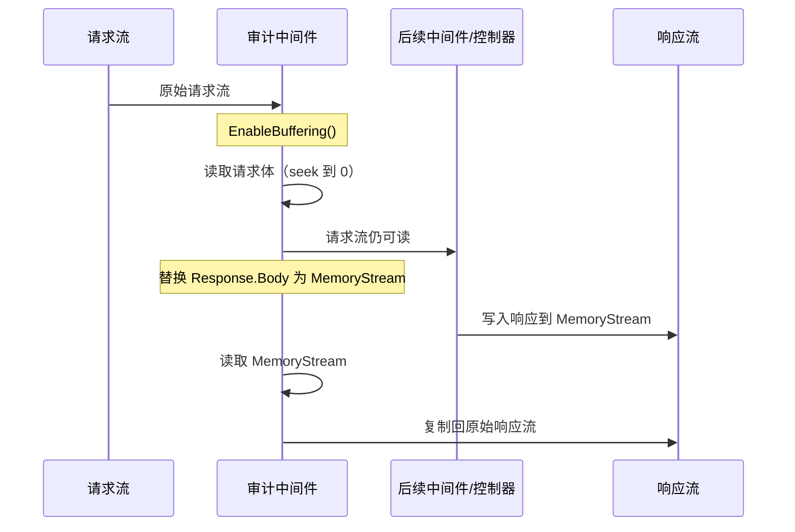

# 审计日志

> 审计日志是生产系统中不可或缺的合规与安全基础设施。它记录"谁在什么时候对什么做了什么"，为操作追溯、安全审计和合规检查提供数据支撑。

---

## 一、为什么需要审计日志

### 1.1 合规要求

几乎所有涉及用户数据的系统，都会受到某种形式的合规约束：

| 合规标准 | 审计要求 |
|----------|----------|
| 等保 2.0 | 三级以上系统必须留存操作日志不少于 6 个月 |
| GDPR | 数据处理活动必须可追溯，数据主体有权获知其数据如何被使用 |
| SOX（萨班斯法案） | 财务相关系统必须保留完整的操作审计记录 |
| HIPAA | 医疗系统必须记录所有对受保护健康信息的访问 |

**没有审计日志 = 不合规**。这不仅面临罚款风险，在安全事件发生后也无法追溯根因。

### 1.2 操作追溯

当出现数据异常时，审计日志回答三个核心问题：

- **谁** —— 操作人身份（用户 ID、角色）
- **何时** —— 操作时间戳
- **做了什么** —— 请求方法、路径、请求体、响应结果

```
[2025-03-15 14:23:01] 用户 user_0042 PUT /api/orders/1024
  请求体: {"status":"cancelled","reason":"customer request"}
  响应: 200 OK
  IP: 192.168.1.105
```

### 1.3 安全审计

审计日志在安全场景中的典型用途：

- 检测异常访问模式（如短时间内大量删除操作）
- 发现越权行为（普通用户访问管理接口）
- 事后取证与责任认定
- 满足等保、SOC 2 等审计要求

---

## 二、审计日志中间件实现

### 2.1 审计日志选项配置

```csharp
/// <summary>
/// 审计日志中间件配置选项
/// </summary>
public class AuditLogOptions
{
    /// <summary>
    /// 需要排除的路径（支持通配符）
    /// </summary>
    public List<string> ExcludePaths { get; set; } = new()
    {
        "/health",
        "/metrics",
        "/swagger"
    };

    /// <summary>
    /// 不记录请求体的 Content-Type
    /// </summary>
    public List<string> ExcludeContentTypes { get; set; } = new()
    {
        "multipart/form-data",
        "application/octet-stream"
    };

    /// <summary>
    /// 请求体最大记录长度（字节），超过则截断
    /// </summary>
    public int MaxRequestBodyLength { get; set; } = 32 * 1024; // 32KB

    /// <summary>
    /// 响应体最大记录长度（字节），超过则截断
    /// </summary>
    public int MaxResponseBodyLength { get; set; } = 32 * 1024; // 32KB

    /// <summary>
    /// 敏感字段名列表（不区分大小写），值将被替换为 ***
    /// </summary>
    public List<string> SensitiveFields { get; set; } = new()
    {
        "password",
        "confirmPassword",
        "token",
        "accessToken",
        "refreshToken",
        "secret",
        "apiKey",
        "creditCard",
        "cvv"
    };

    /// <summary>
    /// 敏感字段替换值
    /// </summary>
    public string SensitiveMask { get; set; } = "***";

    /// <summary>
    /// 是否记录请求体
    /// </summary>
    public bool LogRequestBody { get; set; } = true;

    /// <summary>
    /// 是否记录响应体
    /// </summary>
    public bool LogResponseBody { get; set; } = true;
}
```

### 2.2 审计日志记录实体

```csharp
/// <summary>
/// 审计日志记录
/// </summary>
public class AuditLogEntry
{
    /// <summary>
    /// 唯一标识
    /// </summary>
    public Guid Id { get; set; } = Guid.NewGuid();

    /// <summary>
    /// 追踪 ID（关联请求链路）
    /// </summary>
    public string TraceId { get; set; } = string.Empty;

    /// <summary>
    /// 请求时间
    /// </summary>
    public DateTime Timestamp { get; set; } = DateTime.UtcNow;

    /// <summary>
    /// 请求方法
    /// </summary>
    public string Method { get; set; } = string.Empty;

    /// <summary>
    /// 请求路径
    /// </summary>
    public string Path { get; set; } = string.Empty;

    /// <summary>
    /// 查询字符串
    /// </summary>
    public string QueryString { get; set; } = string.Empty;

    /// <summary>
    /// 请求体（已脱敏）
    /// </summary>
    public string? RequestBody { get; set; }

    /// <summary>
    /// 响应状态码
    /// </summary>
    public int StatusCode { get; set; }

    /// <summary>
    /// 响应体（已脱敏）
    /// </summary>
    public string? ResponseBody { get; set; }

    /// <summary>
    /// 用户 ID
    /// </summary>
    public string? UserId { get; set; }

    /// <summary>
    /// 用户名
    /// </summary>
    public string? UserName { get; set; }

    /// <summary>
    /// 客户端 IP
    /// </summary>
    public string? ClientIp { get; set; }

    /// <summary>
    /// User-Agent
    /// </summary>
    public string? UserAgent { get; set; }

    /// <summary>
    /// 请求耗时（毫秒）
    /// </summary>
    public long DurationMs { get; set; }
}
```

### 2.3 敏感信息脱敏

```csharp
/// <summary>
/// 审计日志脱敏工具
/// </summary>
public static class AuditLogMasker
{
    /// <summary>
    /// 对 JSON 字符串中的敏感字段进行脱敏
    /// </summary>
    public static string MaskSensitiveFields(string json, AuditLogOptions options)
    {
        if (string.IsNullOrWhiteSpace(json)) return json;

        foreach (var field in options.SensitiveFields)
        {
            // 匹配 "fieldName": "任意值" 的模式
            // 不区分大小写
            var pattern = $@"(?i)""{Regex.Escape(field)}""\s*:\s*""[^""]*""";
            var replacement = $@"""{field}"": ""{options.SensitiveMask}""";
            json = Regex.Replace(json, pattern, replacement);
        }

        return json;
    }

    /// <summary>
    /// 对表单格式的请求体进行脱敏
    /// </summary>
    public static string MaskFormFields(string formBody, AuditLogOptions options)
    {
        if (string.IsNullOrWhiteSpace(formBody)) return formBody;

        var pairs = formBody.Split('&');
        for (int i = 0; i < pairs.Length; i++)
        {
            var eqIndex = pairs[i].IndexOf('=');
            if (eqIndex < 0) continue;

            var key = pairs[i][..eqIndex];
            if (options.SensitiveFields.Contains(key, StringComparer.OrdinalIgnoreCase))
            {
                pairs[i] = $"{key}={options.SensitiveMask}";
            }
        }

        return string.Join('&', pairs);
    }

    /// <summary>
    /// 截断过长的字符串
    /// </summary>
    public static string? Truncate(string? value, int maxLength)
    {
        if (value is null) return null;
        if (value.Length <= maxLength) return value;
        return value[..maxLength] + $"...[截断，原始长度: {value.Length}]";
    }
}
```

### 2.4 审计日志中间件核心实现

```csharp
/// <summary>
/// 审计日志中间件
/// </summary>
public class AuditLogMiddleware
{
    private readonly RequestDelegate _next;
    private readonly AuditLogOptions _options;
    private readonly ILogger<AuditLogMiddleware> _logger;

    public AuditLogMiddleware(
        RequestDelegate next,
        IOptions<AuditLogOptions> options,
        ILogger<AuditLogMiddleware> logger)
    {
        _next = next;
        _options = options.Value;
        _logger = logger;
    }

    public async Task InvokeAsync(HttpContext context)
    {
        var path = context.Request.Path.Value;

        // 排除路径检查
        if (ShouldExclude(path!))
        {
            await _next(context);
            return;
        }

        // 排除内容类型检查（如图片、文件上传）
        if (ShouldExcludeContentType(context.Request.ContentType))
        {
            // 不记录 body，但仍记录基本信息
            await LogBasicInfo(context);
            return;
        }

        var entry = new AuditLogEntry
        {
            TraceId = context.TraceIdentifier,
            Timestamp = DateTime.UtcNow,
            Method = context.Request.Method,
            Path = path!,
            QueryString = context.Request.QueryString.Value ?? string.Empty,
            UserId = context.User?.FindFirst(ClaimTypes.NameIdentifier)?.Value,
            UserName = context.User?.Identity?.Name,
            ClientIp = GetClientIp(context),
            UserAgent = context.Request.Headers.UserAgent.ToString()
        };

        // 读取请求体
        if (_options.LogRequestBody && HasBody(context.Request.Method))
        {
            context.Request.EnableBuffering();
            entry.RequestBody = await ReadRequestBody(context.Request);
        }

        // 替换响应流以捕获响应体
        var originalBodyStream = context.Response.Body;
        using var responseBuffer = new MemoryStream();
        context.Response.Body = responseBuffer;

        var stopwatch = Stopwatch.StartNew();

        try
        {
            await _next(context);
        }
        catch (Exception ex)
        {
            // 即使后续中间件抛异常，也记录审计日志
            _logger.LogError(ex, "请求处理异常: {Method} {Path}", entry.Method, entry.Path);
            throw;
        }
        finally
        {
            stopwatch.Stop();
            entry.DurationMs = stopwatch.ElapsedMilliseconds;
            entry.StatusCode = context.Response.StatusCode;

            // 读取响应体
            if (_options.LogResponseBody)
            {
                entry.ResponseBody = await ReadResponseBody(responseBuffer);
            }

            // 将响应体写回原始流
            responseBuffer.Seek(0, SeekOrigin.Begin);
            await responseBuffer.CopyToAsync(originalBodyStream);
            context.Response.Body = originalBodyStream;

            // 异步写入审计日志（不阻塞响应）
            _ = Task.Run(() => WriteAuditLog(entry));
        }
    }

    /// <summary>
    /// 判断路径是否应排除
    /// </summary>
    private bool ShouldExclude(string path)
    {
        return _options.ExcludePaths.Any(exclude =>
            path.StartsWith(exclude, StringComparison.OrdinalIgnoreCase));
    }

    /// <summary>
    /// 判断 Content-Type 是否应排除 body 记录
    /// </summary>
    private bool ShouldExcludeContentType(string? contentType)
    {
        if (string.IsNullOrEmpty(contentType)) return false;

        return _options.ExcludeContentTypes.Any(exclude =>
            contentType.Contains(exclude, StringComparison.OrdinalIgnoreCase));
    }

    /// <summary>
    /// 记录基本信息（不记录 body）
    /// </summary>
    private async Task LogBasicInfo(HttpContext context)
    {
        var entry = new AuditLogEntry
        {
            TraceId = context.TraceIdentifier,
            Timestamp = DateTime.UtcNow,
            Method = context.Request.Method,
            Path = context.Request.Path.Value!,
            QueryString = context.Request.QueryString.Value ?? string.Empty,
            UserId = context.User?.FindFirst(ClaimTypes.NameIdentifier)?.Value,
            UserName = context.User?.Identity?.Name,
            ClientIp = GetClientIp(context),
            UserAgent = context.Request.Headers.UserAgent.ToString()
        };

        var stopwatch = Stopwatch.StartNew();
        await _next(context);
        stopwatch.Stop();

        entry.StatusCode = context.Response.StatusCode;
        entry.DurationMs = stopwatch.ElapsedMilliseconds;
        entry.RequestBody = "[已排除：内容类型不记录]";
        entry.ResponseBody = "[已排除：内容类型不记录]";

        _ = Task.Run(() => WriteAuditLog(entry));
    }

    /// <summary>
    /// 读取请求体
    /// </summary>
    private async Task<string?> ReadRequestBody(HttpRequest request)
    {
        request.Body.Seek(0, SeekOrigin.Begin);

        using var reader = new StreamReader(
            request.Body,
            encoding: Encoding.UTF8,
            detectEncodingFromByteOrderMarks: false,
            bufferSize: 1024,
            leaveOpen: true);

        var body = await reader.ReadToEndAsync();
        request.Body.Seek(0, SeekOrigin.Begin);

        // 脱敏处理
        body = AuditLogMasker.MaskSensitiveFields(body, _options);
        body = AuditLogMasker.MaskFormFields(body, _options);

        return AuditLogMasker.Truncate(body, _options.MaxRequestBodyLength);
    }

    /// <summary>
    /// 读取响应体
    /// </summary>
    private async Task<string?> ReadResponseBody(MemoryStream responseBuffer)
    {
        responseBuffer.Seek(0, SeekOrigin.Begin);

        using var reader = new StreamReader(
            responseBuffer,
            encoding: Encoding.UTF8,
            detectEncodingFromByteOrderMarks: false,
            bufferSize: 1024,
            leaveOpen: true);

        var body = await reader.ReadToEndAsync();

        // 脱敏处理
        body = AuditLogMasker.MaskSensitiveFields(body, _options);

        return AuditLogMasker.Truncate(body, _options.MaxResponseBodyLength);
    }

    /// <summary>
    /// 获取客户端真实 IP
    /// </summary>
    private static string GetClientIp(HttpContext context)
    {
        // 优先读取反向代理头
        var forwardedFor = context.Request.Headers["X-Forwarded-For"].FirstOrDefault();
        if (!string.IsNullOrEmpty(forwardedFor))
        {
            return forwardedFor.Split(',')[0].Trim();
        }

        var realIp = context.Request.Headers["X-Real-IP"].FirstOrDefault();
        if (!string.IsNullOrEmpty(realIp))
        {
            return realIp;
        }

        return context.Connection.RemoteIpAddress?.ToString() ?? "unknown";
    }

    /// <summary>
    /// 判断 HTTP 方法是否可能有请求体
    /// </summary>
    private static bool HasBody(string method)
    {
        return method is "POST" or "PUT" or "PATCH";
    }

    /// <summary>
    /// 写入审计日志
    /// </summary>
    private void WriteAuditLog(AuditLogEntry entry)
    {
        try
        {
            _logger.LogInformation(
                "审计日志: {Method} {Path} -> {StatusCode} | " +
                "用户: {UserId} | IP: {ClientIp} | 耗时: {DurationMs}ms",
                entry.Method, entry.Path, entry.StatusCode,
                entry.UserId, entry.ClientIp, entry.DurationMs);
        }
        catch (Exception ex)
        {
            _logger.LogError(ex, "写入审计日志失败");
        }
    }
}
```

### 2.5 扩展方法注册

```csharp
public static class AuditLogMiddlewareExtensions
{
    public static IApplicationBuilder UseAuditLog(
        this IApplicationBuilder app,
        Action<AuditLogOptions>? configure = null)
    {
        if (configure is not null)
        {
            var options = new AuditLogOptions();
            configure(options);
            // 将配置注入到 DI 容器
            app.ApplicationServices.GetRequiredService<IOptions<AuditLogOptions>>();
        }

        return app.UseMiddleware<AuditLogMiddleware>();
    }
}
```

### 2.6 在 Program.cs 中注册

```csharp
var builder = WebApplication.CreateBuilder(args);

// 注册审计日志选项
builder.Services.Configure<AuditLogOptions>(
    builder.Configuration.GetSection("AuditLog"));

// 注册审计日志写入器
builder.Services.AddSingleton<IAuditLogWriter, FileAuditLogWriter>();

var app = builder.Build();

// 审计日志中间件应尽早注册，以捕获所有请求
app.UseAuditLog();

// ... 其他中间件

app.Run();
```

对应的 `appsettings.json` 配置：

```json
{
  "AuditLog": {
    "ExcludePaths": [ "/health", "/metrics", "/swagger", "/favicon.ico" ],
    "ExcludeContentTypes": [ "multipart/form-data", "application/octet-stream" ],
    "MaxRequestBodyLength": 32768,
    "MaxResponseBodyLength": 32768,
    "SensitiveFields": [ "password", "token", "accessToken", "secret" ],
    "SensitiveMask": "***",
    "LogRequestBody": true,
    "LogResponseBody": true
  }
}
```

---

## 三、请求体/响应体读取技巧

### 3.1 核心问题：流只能读一次

HTTP 请求体和响应体都是 `Stream`，默认只能读取一次。中间件读取后，后续中间件或控制器将读到空流。

**解决方案：`EnableBuffering()` + `MemoryStream` 替换**



### 3.2 请求体：EnableBuffering

```csharp
// 启用请求体缓冲，允许重复读取
context.Request.EnableBuffering(
    bufferThreshold: 1024 * 64,   // 内存中缓冲 64KB
    bufferLimit: 1024 * 256       // 最大缓冲 256KB
);

// 读取
using var reader = new StreamReader(context.Request.Body, leaveOpen: true);
var body = await reader.ReadToEndAsync();

// 重置流位置，后续中间件可以继续读取
context.Request.Body.Seek(0, SeekOrigin.Begin);
```

**注意**：`EnableBuffering` 有两个参数：
- `bufferThreshold`：超过此大小会写入临时文件
- `bufferLimit`：超过此大小直接抛异常

### 3.3 响应体：MemoryStream 替换

```csharp
var originalBody = context.Response.Body;

try
{
    using var memoryStream = new MemoryStream();
    context.Response.Body = memoryStream;

    await _next(context); // 后续中间件写入 memoryStream

    // 读取响应体
    memoryStream.Seek(0, SeekOrigin.Begin);
    var responseBody = await new StreamReader(memoryStream).ReadToEndAsync();

    // 写回原始流
    memoryStream.Seek(0, SeekOrigin.Begin);
    await memoryStream.CopyToAsync(originalBody);
}
finally
{
    context.Response.Body = originalBody;
}
```

### 3.4 性能注意事项

| 场景 | 建议 |
|------|------|
| 大文件上传/下载 | 排除 Content-Type，不记录 body |
| 流式响应（SSE） | 不替换响应流，仅记录状态码 |
| 高并发接口 | 仅记录请求头和状态码，不记录 body |
| 大 JSON 响应 | 设置 MaxResponseBodyLength 截断 |

**关键原则：只在需要时记录 body，且必须设置最大长度限制。**

```csharp
// 大 body 的安全读取方式
private async Task<string?> SafeReadBody(Stream body, int maxLength)
{
    var buffer = new byte[maxLength];
    var bytesRead = await body.ReadAsync(buffer.AsMemory(0, maxLength));

    var content = Encoding.UTF8.GetString(buffer, 0, bytesRead);

    // 检查是否还有更多数据
    if (body.Length > maxLength)
    {
        content += $"...[截断，原始大小: {body.Length} 字节]";
    }

    return content;
}
```

---

## 四、审计日志存储

### 4.1 存储接口设计

```csharp
/// <summary>
/// 审计日志写入器接口
/// </summary>
public interface IAuditLogWriter
{
    Task WriteAsync(AuditLogEntry entry);
}
```

### 4.2 写入数据库

```csharp
/// <summary>
/// 数据库审计日志写入器
/// </summary>
public class DatabaseAuditLogWriter : IAuditLogWriter
{
    private readonly IServiceScopeFactory _scopeFactory;
    private readonly ILogger<DatabaseAuditLogWriter> _logger;

    public DatabaseAuditLogWriter(
        IServiceScopeFactory scopeFactory,
        ILogger<DatabaseAuditLogWriter> logger)
    {
        _scopeFactory = scopeFactory;
        _logger = logger;
    }

    public async Task WriteAsync(AuditLogEntry entry)
    {
        try
        {
            using var scope = _scopeFactory.CreateScope();
            var dbContext = scope.ServiceProvider
                .GetRequiredService<AppDbContext>();

            dbContext.AuditLogs.Add(entry);
            await dbContext.SaveChangesAsync();
        }
        catch (Exception ex)
        {
            _logger.LogError(ex, "审计日志写入数据库失败: {Path}", entry.Path);
        }
    }
}
```

对应的 EF Core 实体配置：

```csharp
public class AuditLogConfiguration : IEntityTypeConfiguration<AuditLogEntry>
{
    public void Configure(EntityTypeBuilder<AuditLogEntry> builder)
    {
        builder.ToTable("AuditLogs");
        builder.HasKey(x => x.Id);

        builder.Property(x => x.TraceId).HasMaxLength(64).IsRequired();
        builder.Property(x => x.Method).HasMaxLength(10).IsRequired();
        builder.Property(x => x.Path).HasMaxLength(500).IsRequired();
        builder.Property(x => x.QueryString).HasMaxLength(2000);
        builder.Property(x => x.RequestBody).HasColumnType("nvarchar(max)");
        builder.Property(x => x.ResponseBody).HasColumnType("nvarchar(max)");
        builder.Property(x => x.UserId).HasMaxLength(100);
        builder.Property(x => x.UserName).HasMaxLength(200);
        builder.Property(x => x.ClientIp).HasMaxLength(50);
        builder.Property(x => x.UserAgent).HasMaxLength(500);

        // 高频写入场景的索引
        builder.HasIndex(x => x.Timestamp);
        builder.HasIndex(x => x.UserId);
        builder.HasIndex(x => x.TraceId);
    }
}
```

### 4.3 写入文件

```csharp
/// <summary>
/// 文件审计日志写入器
/// </summary>
public class FileAuditLogWriter : IAuditLogWriter
{
    private readonly string _logDirectory;
    private readonly ILogger<FileAuditLogWriter> _logger;
    private readonly SemaphoreSlim _semaphore = new(1, 1);

    public FileAuditLogWriter(
        ILogger<FileAuditLogWriter> logger)
    {
        _logDirectory = Path.Combine(AppContext.BaseDirectory, "audit-logs");
        Directory.CreateDirectory(_logDirectory);
        _logger = logger;
    }

    public async Task WriteAsync(AuditLogEntry entry)
    {
        var fileName = $"audit_{entry.Timestamp:yyyyMMdd}.jsonl";
        var filePath = Path.Combine(_logDirectory, fileName);

        var json = JsonSerializer.Serialize(entry);

        await _semaphore.WaitAsync();
        try
        {
            await File.AppendAllTextAsync(filePath, json + Environment.NewLine);
        }
        catch (Exception ex)
        {
            _logger.LogError(ex, "审计日志写入文件失败: {Path}", filePath);
        }
        finally
        {
            _semaphore.Release();
        }
    }
}
```

### 4.4 写入消息队列（推荐异步写入）

直接同步写入数据库或文件会阻塞请求管道，在高并发场景下成为性能瓶颈。推荐通过消息队列异步写入。


#### 基于 Channel 的进程内异步写入

```csharp
/// <summary>
/// 基于 Channel 的异步审计日志写入器
/// </summary>
public class AsyncAuditLogWriter : BackgroundService, IAuditLogWriter
{
    private readonly Channel<AuditLogEntry> _channel;
    private readonly IServiceScopeFactory _scopeFactory;
    private readonly ILogger<AsyncAuditLogWriter> _logger;

    public AsyncAuditLogWriter(
        IServiceScopeFactory scopeFactory,
        ILogger<AsyncAuditLogWriter> logger)
    {
        _scopeFactory = scopeFactory;
        _logger = logger;
        _channel = Channel.CreateBounded<AuditLogEntry>(new BoundedChannelOptions(10000)
        {
            FullMode = BoundedChannelFullMode.DropOldest,
            SingleReader = true
        });
    }

    public async Task WriteAsync(AuditLogEntry entry)
    {
        // 非阻塞写入 Channel
        await _channel.Writer.WriteAsync(entry);
    }

    protected override async Task ExecuteAsync(CancellationToken stoppingToken)
    {
        await foreach (var entry in _channel.Reader.ReadAllAsync(stoppingToken))
        {
            try
            {
                using var scope = _scopeFactory.CreateScope();
                var dbContext = scope.ServiceProvider
                    .GetRequiredService<AppDbContext>();

                dbContext.AuditLogs.Add(entry);
                await dbContext.SaveChangesAsync(stoppingToken);
            }
            catch (Exception ex)
            {
                _logger.LogError(ex, "异步写入审计日志失败: {Path}", entry.Path);
            }
        }
    }
}
```

注册方式：

```csharp
// 同时注册为 BackgroundService 和 IAuditLogWriter
builder.Services.AddSingleton<AsyncAuditLogWriter>();
builder.Services.AddHostedService(sp => sp.GetRequiredService<AsyncAuditLogWriter>());
builder.Services.AddSingleton<IAuditLogWriter>(sp => sp.GetRequiredService<AsyncAuditLogWriter>());
```

### 4.5 与 Serilog 集成

Serilog 是 .NET 生态中最流行的结构化日志库，可以与审计日志无缝集成：

```csharp
// Program.cs
builder.Host.UseSerilog((context, config) =>
{
    config
        .ReadFrom.Configuration(context.Configuration)
        .Enrich.FromLogContext()
        .Enrich.WithProperty("Application", "MyApp")
        .WriteTo.Console(new RenderedCompactJsonFormatter())
        .WriteTo.Elasticsearch(new ElasticsearchSinkOptions(
            new Uri("http://localhost:9200"))
        {
            IndexFormat = "audit-logs-{0:yyyy.MM.dd}",
            AutoRegisterTemplate = true
        });
});
```

在中间件中使用 Serilog 的结构化日志：

```csharp
private void WriteAuditLog(AuditLogEntry entry)
{
    using (LogContext.PushProperty("AuditLog", new
    {
        entry.TraceId,
        entry.Method,
        entry.Path,
        entry.StatusCode,
        entry.UserId,
        entry.ClientIp,
        entry.DurationMs,
        entry.RequestBody,
        entry.ResponseBody
    }))
    {
        Log.Information(
            "审计: {Method} {Path} -> {StatusCode} ({DurationMs}ms)",
            entry.Method, entry.Path, entry.StatusCode, entry.DurationMs);
    }
}
```

Serilog 的优势：
- **结构化输出**：日志以 JSON 格式写入，便于 Elasticsearch 查询
- **多 Sink**：同时写入文件、数据库、ES、Seq 等
- **Enricher**：自动附加线程 ID、机器名等信息
- **Filter**：可按条件过滤审计日志，单独路由到专用 Sink

---

## 总结

| 要点 | 说明 |
|------|------|
| 尽早注册 | 审计中间件应在管道前端，确保捕获所有请求 |
| 必须脱敏 | 密码、Token 等敏感字段绝不能明文记录 |
| 控制大小 | 大 body 必须截断，文件上传/下载应排除 |
| 异步写入 | 使用 Channel 或消息队列，避免阻塞请求管道 |
| 保留期限 | 根据合规要求设置日志保留周期（等保至少 6 个月） |
| 可查询性 | 日志应结构化存储，支持按时间、用户、路径查询 |
