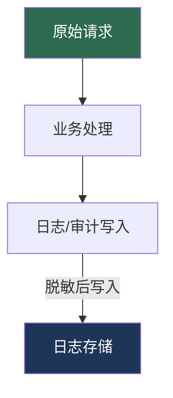

# 数据脱敏

> 数据脱敏是对敏感信息进行变换或隐藏的过程，确保日志、API 响应和测试环境中不会泄露用户隐私。本节将从中间件层面实现自动化的请求/响应脱敏。

---

## 一、数据脱敏的场景

### 1.1 日志中不记录敏感信息

最常见的脱敏场景：应用日志中不应该出现明文的密码、手机号、身份证号等。

```
❌ 用户登录: phone=13812345678, password=abc123
✅ 用户登录: phone=138****5678, password=***
```

### 1.2 API 响应中隐藏部分数据

API 返回用户信息时，根据调用方权限隐藏部分字段：

```json
{
  "name": "张三",
  "phone": "138****5678",
  "idCard": "310***********1234",
  "email": "z***@example.com",
  "bankCard": "**** **** **** 1234"
}
```

### 1.3 开发/测试环境使用脱敏数据

将生产数据导出到测试环境时，必须对敏感字段脱敏，防止真实用户信息在非生产环境泄露。


### 1.4 常见敏感数据类型

| 数据类型 | 示例 | 脱敏格式 |
|----------|------|----------|
| 手机号 | 13812345678 | 138\*\*\*\*5678 |
| 身份证 | 310101199001011234 | 310\*\*\*\*\*\*\*\*\*\*\*1234 |
| 邮箱 | zhangsan@example.com | z\*\*\*@example.com |
| 银行卡 | 6222021234561234 | \*\*\*\* \*\*\*\* \*\*\*\* 1234 |
| 姓名 | 欧阳修竹 | 欧\*\* |
| 地址 | 北京市朝阳区xxx路123号 | 北京市朝阳区\*\*\* |

---

## 二、响应脱敏中间件

### 2.1 脱敏规则定义

```csharp
/// <summary>
/// 脱敏规则
/// </summary>
public class MaskingRule
{
    /// <summary>
    /// 规则名称
    /// </summary>
    public string Name { get; set; } = string.Empty;

    /// <summary>
    /// 匹配方式：FieldName | Regex | ContentType
    /// </summary>
    public string MatchType { get; set; } = "FieldName";

    /// <summary>
    /// 匹配表达式（字段名或正则）
    /// </summary>
    public string Pattern { get; set; } = string.Empty;

    /// <summary>
    /// 脱敏策略
    /// </summary>
    public MaskingStrategy Strategy { get; set; } = MaskingStrategy.FullMask;

    /// <summary>
    /// 保留前几位
    /// </summary>
    public int KeepPrefix { get; set; } = 0;

    /// <summary>
    /// 保留后几位
    /// </summary>
    public int KeepSuffix { get; set; } = 0;

    /// <summary>
    /// 替换字符
    /// </summary>
    public char MaskChar { get; set; } = '*';
}

/// <summary>
/// 脱敏策略
/// </summary>
public enum MaskingStrategy
{
    /// <summary>
    /// 完全替换为掩码
    /// </summary>
    FullMask,

    /// <summary>
    /// 保留首尾，中间替换
    /// </summary>
    PartialMask,

    /// <summary>
    /// 正则替换
    /// </summary>
    RegexReplace,

    /// <summary>
    /// 置空
    /// </summary>
    Clear
}
```

### 2.2 脱敏处理器

```csharp
/// <summary>
/// 数据脱敏处理器
/// </summary>
public class DataMasker
{
    private readonly List<MaskingRule> _rules;

    public DataMasker(IEnumerable<MaskingRule> rules)
    {
        _rules = rules.ToList();
    }

    /// <summary>
    /// 对 JSON 字符串执行脱敏
    /// </summary>
    public string MaskJson(string json)
    {
        if (string.IsNullOrWhiteSpace(json)) return json;

        using var doc = JsonDocument.Parse(json);
        using var stream = new MemoryStream();
        using var writer = new Utf8JsonWriter(stream, new JsonWriterOptions
        {
            Indented = doc.RootElement.ValueKind == JsonValueKind.Object
        });

        MaskElement(doc.RootElement, writer);
        writer.Flush();

        return Encoding.UTF8.GetString(stream.ToArray());
    }

    /// <summary>
    /// 对字符串值执行脱敏
    /// </summary>
    public string MaskValue(string fieldName, string value)
    {
        if (string.IsNullOrWhiteSpace(value)) return value;

        foreach (var rule in _rules)
        {
            if (rule.MatchType == "FieldName" &&
                string.Equals(rule.Pattern, fieldName, StringComparison.OrdinalIgnoreCase))
            {
                return ApplyStrategy(value, rule);
            }

            if (rule.MatchType == "Regex" &&
                Regex.IsMatch(fieldName, rule.Pattern, RegexOptions.IgnoreCase))
            {
                return ApplyStrategy(value, rule);
            }
        }

        return value;
    }

    /// <summary>
    /// 递归处理 JSON 元素
    /// </summary>
    private void MaskElement(JsonElement element, Utf8JsonWriter writer)
    {
        switch (element.ValueKind)
        {
            case JsonValueKind.Object:
                writer.WriteStartObject();
                foreach (var property in element.EnumerateObject())
                {
                    writer.WritePropertyName(property.Name);
                    if (property.Value.ValueKind == JsonValueKind.String)
                    {
                        var masked = MaskValue(property.Name, property.Value.GetString()!);
                        writer.WriteStringValue(masked);
                    }
                    else
                    {
                        MaskElement(property.Value, writer);
                    }
                }
                writer.WriteEndObject();
                break;

            case JsonValueKind.Array:
                writer.WriteStartArray();
                foreach (var item in element.EnumerateArray())
                {
                    MaskElement(item, writer);
                }
                writer.WriteEndArray();
                break;

            case JsonValueKind.String:
                writer.WriteStringValue(element.GetString());
                break;

            case JsonValueKind.Number:
                writer.WriteNumberValue(element.GetDouble());
                break;

            case JsonValueKind.True:
            case JsonValueKind.False:
                writer.WriteBooleanValue(element.GetBoolean());
                break;

            case JsonValueKind.Null:
                writer.WriteNullValue();
                break;
        }
    }

    /// <summary>
    /// 应用脱敏策略
    /// </summary>
    private static string ApplyStrategy(string value, MaskingRule rule)
    {
        return rule.Strategy switch
        {
            MaskingStrategy.FullMask => new string(rule.MaskChar, value.Length),
            MaskingStrategy.PartialMask => ApplyPartialMask(value, rule),
            MaskingStrategy.RegexReplace => Regex.Replace(value, rule.Pattern,
                m => new string(rule.MaskChar, m.Value.Length)),
            MaskingStrategy.Clear => string.Empty,
            _ => value
        };
    }

    /// <summary>
    /// 部分掩码：保留首尾，中间替换
    /// </summary>
    private static string ApplyPartialMask(string value, MaskingRule rule)
    {
        if (value.Length <= rule.KeepPrefix + rule.KeepSuffix)
        {
            return new string(rule.MaskChar, value.Length);
        }

        var prefix = value[..rule.KeepPrefix];
        var suffix = value[^rule.KeepSuffix..];
        var maskLength = value.Length - rule.KeepPrefix - rule.KeepSuffix;

        return $"{prefix}{new string(rule.MaskChar, maskLength)}{suffix}";
    }
}
```

### 2.3 响应脱敏中间件

```csharp
/// <summary>
/// 响应脱敏中间件配置
/// </summary>
public class DataMaskingOptions
{
    /// <summary>
    /// 脱敏规则列表
    /// </summary>
    public List<MaskingRule> Rules { get; set; } = new();

    /// <summary>
    /// 不需要脱敏的路径白名单
    /// </summary>
    public List<string> WhitelistPaths { get; set; } = new();

    /// <summary>
    /// 仅对 JSON 响应脱敏
    /// </summary>
    public bool JsonOnly { get; set; } = true;

    /// <summary>
    /// 最大响应体大小（超过不处理，防止 OOM）
    /// </summary>
    public int MaxResponseSize { get; set; } = 1024 * 1024; // 1MB
}

/// <summary>
/// 响应脱敏中间件
/// </summary>
public class DataMaskingMiddleware
{
    private readonly RequestDelegate _next;
    private readonly DataMaskingOptions _options;
    private readonly DataMasker _masker;
    private readonly ILogger<DataMaskingMiddleware> _logger;

    public DataMaskingMiddleware(
        RequestDelegate next,
        IOptions<DataMaskingOptions> options,
        ILogger<DataMaskingMiddleware> logger)
    {
        _next = next;
        _options = options.Value;
        _masker = new DataMasker(_options.Rules);
        _logger = logger;
    }

    public async Task InvokeAsync(HttpContext context)
    {
        // 白名单路径跳过
        if (_options.WhitelistPaths.Any(p =>
            context.Request.Path.StartsWithSegments(p, StringComparison.OrdinalIgnoreCase)))
        {
            await _next(context);
            return;
        }

        var originalBody = context.Response.Body;
        using var buffer = new MemoryStream();
        context.Response.Body = buffer;

        await _next(context);

        // 仅处理 JSON 响应
        if (_options.JsonOnly && !IsJsonResponse(context.Response))
        {
            buffer.Seek(0, SeekOrigin.Begin);
            await buffer.CopyToAsync(originalBody);
            context.Response.Body = originalBody;
            return;
        }

        // 检查响应体大小
        if (buffer.Length > _options.MaxResponseSize)
        {
            _logger.LogWarning("响应体过大 ({Size} bytes)，跳过脱敏: {Path}",
                buffer.Length, context.Request.Path);
            buffer.Seek(0, SeekOrigin.Begin);
            await buffer.CopyToAsync(originalBody);
            context.Response.Body = originalBody;
            return;
        }

        buffer.Seek(0, SeekOrigin.Begin);
        var responseBody = await new StreamReader(buffer).ReadToEndAsync();

        try
        {
            var maskedBody = _masker.MaskJson(responseBody);
            var maskedBytes = Encoding.UTF8.GetBytes(maskedBody);

            // 更新 Content-Length
            if (context.Response.Headers.ContainsKey("Content-Length"))
            {
                context.Response.Headers.ContentLength = maskedBytes.Length;
            }

            await originalBody.WriteAsync(maskedBytes);
        }
        catch (JsonException ex)
        {
            _logger.LogWarning(ex, "响应体非有效 JSON，跳过脱敏: {Path}",
                context.Request.Path);
            buffer.Seek(0, SeekOrigin.Begin);
            await buffer.CopyToAsync(originalBody);
        }
        finally
        {
            context.Response.Body = originalBody;
        }
    }

    private static bool IsJsonResponse(HttpResponse response)
    {
        var contentType = response.ContentType;
        return contentType?.Contains("application/json", StringComparison.OrdinalIgnoreCase) == true;
    }
}
```

### 2.4 内置常用脱敏规则

```csharp
/// <summary>
/// 常用脱敏规则预设
/// </summary>
public static class CommonMaskingRules
{
    /// <summary>
    /// 手机号：138****5678
    /// </summary>
    public static MaskingRule Phone => new()
    {
        Name = "手机号",
        MatchType = "FieldName",
        Pattern = "phone|mobile|cellPhone|phoneNumber",
        Strategy = MaskingStrategy.PartialMask,
        KeepPrefix = 3,
        KeepSuffix = 4,
        MaskChar = '*'
    };

    /// <summary>
    /// 身份证：310***********1234
    /// </summary>
    public static MaskingRule IdCard => new()
    {
        Name = "身份证号",
        MatchType = "FieldName",
        Pattern = "idCard|idNumber|identityCard|idNo",
        Strategy = MaskingStrategy.PartialMask,
        KeepPrefix = 3,
        KeepSuffix = 4,
        MaskChar = '*'
    };

    /// <summary>
    /// 邮箱：z***@example.com
    /// </summary>
    public static MaskingRule Email => new()
    {
        Name = "邮箱",
        MatchType = "FieldName",
        Pattern = "email|mail|emailAddress",
        Strategy = MaskingStrategy.RegexReplace,
        Pattern = @"^(?<first>.)(?<rest>.*?)(@.*)$",
        // 自定义处理在 Masker 中实现
        KeepPrefix = 1,
        MaskChar = '*'
    };

    /// <summary>
    /// 银行卡：**** **** **** 1234
    /// </summary>
    public static MaskingRule BankCard => new()
    {
        Name = "银行卡号",
        MatchType = "FieldName",
        Pattern = "bankCard|bankCardNo|cardNumber|cardNo",
        Strategy = MaskingStrategy.PartialMask,
        KeepPrefix = 0,
        KeepSuffix = 4,
        MaskChar = '*'
    };

    /// <summary>
    /// 密码：完全替换
    /// </summary>
    public static MaskingRule Password => new()
    {
        Name = "密码",
        MatchType = "FieldName",
        Pattern = "password|pwd|payPassword|tradePassword",
        Strategy = MaskingStrategy.FullMask,
        MaskChar = '*'
    };

    /// <summary>
    /// 获取所有默认规则
    /// </summary>
    public static List<MaskingRule> All() => new()
    {
        Phone, IdCard, Email, BankCard, Password
    };
}
```

### 2.5 邮箱专用脱敏（正则方式）

邮箱的脱敏比较特殊，需要保留 `@` 及域名部分：

```csharp
/// <summary>
/// 邮箱脱敏扩展方法
/// </summary>
public static class EmailMaskingExtensions
{
    /// <summary>
    /// 邮箱脱敏：z***@example.com
    /// </summary>
    public static string MaskEmail(string email)
    {
        if (string.IsNullOrWhiteSpace(email)) return email;

        var atIndex = email.IndexOf('@');
        if (atIndex <= 0) return email;

        var prefix = email[..1]; // 保留第一个字符
        var domain = email[atIndex..]; // 保留 @ 及域名

        return $"{prefix}***{domain}";
    }
}
```

在 `DataMasker` 中对邮箱字段使用专用脱敏：

```csharp
// 在 MaskValue 方法中增加邮箱专用处理
public string MaskValue(string fieldName, string value)
{
    if (string.IsNullOrWhiteSpace(value)) return value;

    foreach (var rule in _rules)
    {
        bool matched = rule.MatchType == "FieldName"
            ? Regex.IsMatch(fieldName, rule.Pattern, RegexOptions.IgnoreCase)
            : Regex.IsMatch(fieldName, rule.Pattern, RegexOptions.IgnoreCase);

        if (!matched) continue;

        // 邮箱专用脱敏
        if (Regex.IsMatch(fieldName, @"email|mail", RegexOptions.IgnoreCase)
            && value.Contains('@'))
        {
            return EmailMaskingExtensions.MaskEmail(value);
        }

        return ApplyStrategy(value, rule);
    }

    return value;
}
```

---

## 三、请求体脱敏

### 3.1 为什么请求体也需要脱敏

请求体中往往包含用户提交的敏感信息：

- 登录请求中的密码
- 支付请求中的银行卡号
- 认证请求中的 Token
- 注册请求中的身份证号

这些信息在日志、审计记录中必须脱敏。

### 3.2 请求体脱敏中间件

```csharp
/// <summary>
/// 请求体脱敏中间件
/// </summary>
public class RequestMaskingMiddleware
{
    private readonly RequestDelegate _next;
    private readonly ILogger<RequestMaskingMiddleware> _logger;
    private readonly HashSet<string> _sensitiveFields;
    private readonly string _maskValue;

    public RequestMaskingMiddleware(
        RequestDelegate next,
        ILogger<RequestMaskingMiddleware> _logger)
    {
        _next = next;
        this._logger = _logger;
        _sensitiveFields = new HashSet<string>(StringComparer.OrdinalIgnoreCase)
        {
            "password", "confirmPassword", "oldPassword", "newPassword",
            "token", "accessToken", "refreshToken",
            "secret", "apiKey", "apiSecret",
            "creditCard", "cvv", "cardNumber"
        };
        _maskValue = "***";
    }

    public RequestMaskingMiddleware(
        RequestDelegate next,
        ILogger<RequestMaskingMiddleware> logger,
        IEnumerable<string> sensitiveFields,
        string maskValue = "***") : this(next, logger)
    {
        foreach (var field in sensitiveFields)
        {
            _sensitiveFields.Add(field);
        }
        _maskValue = maskValue;
    }

    public async Task InvokeAsync(HttpContext context)
    {
        // 仅对有 body 的请求处理
        if (!HasBody(context.Request.Method))
        {
            await _next(context);
            return;
        }

        var contentType = context.Request.ContentType ?? string.Empty;

        if (contentType.Contains("application/json", StringComparison.OrdinalIgnoreCase))
        {
            await MaskJsonRequest(context);
        }
        else if (contentType.Contains("application/x-www-form-urlencoded",
            StringComparison.OrdinalIgnoreCase))
        {
            MaskFormRequest(context);
        }

        await _next(context);
    }

    /// <summary>
    /// JSON 请求体脱敏
    /// </summary>
    private async Task MaskJsonRequest(HttpContext context)
    {
        context.Request.EnableBuffering();
        context.Request.Body.Seek(0, SeekOrigin.Begin);

        using var reader = new StreamReader(context.Request.Body, leaveOpen: true);
        var body = await reader.ReadToEndAsync();

        if (!string.IsNullOrWhiteSpace(body))
        {
            try
            {
                var doc = JsonDocument.Parse(body);
                var masked = MaskJsonElement(doc.RootElement);
                var maskedJson = JsonSerializer.Serialize(masked);
                var bytes = Encoding.UTF8.GetBytes(maskedJson);

                // 替换请求流
                context.Request.Body = new MemoryStream(bytes);
                if (context.Request.Headers.ContainsKey("Content-Length"))
                {
                    context.Request.Headers.ContentLength = bytes.Length;
                }
            }
            catch (JsonException)
            {
                // JSON 解析失败，不做处理
            }
        }

        context.Request.Body.Seek(0, SeekOrigin.Begin);
    }

    /// <summary>
    /// 表单请求脱敏
    /// </summary>
    private void MaskFormRequest(HttpContext context)
    {
        var form = context.Request.Form;
        // 注意：Form 集合是只读的，需要通过日志层面脱敏
        // 实际表单数据在后续中间件中正常使用
        // 此处仅标记需要脱敏的字段供日志使用
    }

    /// <summary>
    /// 递归脱敏 JSON 元素
    /// </summary>
    private JsonElement MaskJsonElement(JsonElement element)
    {
        // 简化实现：转换为字典后脱敏
        using var doc = JsonDocument.Parse(element.GetRawText());
        return doc.RootElement;
    }

    private static bool HasBody(string method)
    {
        return method is "POST" or "PUT" or "PATCH";
    }
}
```

### 3.3 请求体脱敏的注意事项

> [!WARNING]
> 请求体脱敏会修改实际请求数据。如果你的业务逻辑需要读取原始密码（如验证登录），**不要在中间件层面对请求体进行脱敏**，而应在日志/审计层面脱敏。

**推荐做法**：



在日志层面脱敏，而不是修改请求体：

```csharp
// 在审计日志中间件中脱敏，不修改原始请求
var requestBodyForLog = AuditLogMasker.MaskSensitiveFields(rawBody, options);
logger.LogInformation("请求: {Body}", requestBodyForLog);

// 控制器中读取的是原始未脱敏的请求体
```

---

## 四、脱敏策略配置

### 4.1 字段名匹配规则

字段名匹配是最常用的规则类型，支持多种匹配方式：

```json
{
  "DataMasking": {
    "Rules": [
      {
        "Name": "手机号脱敏",
        "MatchType": "FieldName",
        "Pattern": "phone|mobile|cellPhone|phoneNumber|tel",
        "Strategy": "PartialMask",
        "KeepPrefix": 3,
        "KeepSuffix": 4,
        "MaskChar": "*"
      },
      {
        "Name": "身份证脱敏",
        "MatchType": "FieldName",
        "Pattern": "idCard|idNumber|identityCard|idNo|certNo",
        "Strategy": "PartialMask",
        "KeepPrefix": 3,
        "KeepSuffix": 4,
        "MaskChar": "*"
      }
    ]
  }
}
```

`Pattern` 字段使用 `|` 分隔多个字段名，匹配时不区分大小写。

### 4.2 正则匹配规则

对于不符合固定字段名模式的数据，使用正则匹配：

```csharp
// 手机号正则匹配：直接匹配 11 位数字格式
new MaskingRule
{
    Name = "手机号正则匹配",
    MatchType = "Regex",
    Pattern = @"1[3-9]\d{9}",
    Strategy = MaskingStrategy.RegexReplace,
    KeepPrefix = 3,
    KeepSuffix = 4,
    MaskChar = '*'
}

// 身份证号正则匹配
new MaskingRule
{
    Name = "身份证号正则匹配",
    MatchType = "Regex",
    Pattern = @"[1-9]\d{5}(19|20)\d{2}(0[1-9]|1[0-2])(0[1-9]|[12]\d|3[01])\d{3}[\dXx]",
    Strategy = MaskingStrategy.PartialMask,
    KeepPrefix = 3,
    KeepSuffix = 4,
    MaskChar = '*'
}

// 邮箱正则匹配
new MaskingRule
{
    Name = "邮箱正则匹配",
    MatchType = "Regex",
    Pattern = @"[\w.-]+@[\w.-]+\.\w+",
    Strategy = MaskingStrategy.RegexReplace,
    KeepPrefix = 1,
    KeepSuffix = 0,
    MaskChar = '*'
}
```

### 4.3 白名单（不脱敏的字段）

某些场景下，特定路径或字段不需要脱敏：

```csharp
builder.Services.Configure<DataMaskingOptions>(options =>
{
    options.WhitelistPaths = new List<string>
    {
        "/api/admin/users",      // 管理员接口返回完整信息
        "/api/internal/export"   // 内部导出接口
    };

    options.Rules = CommonMaskingRules.All();
});
```

白名单的判断逻辑：

```csharp
// 在中间件中
if (IsWhitelisted(context.Request.Path))
{
    await _next(context);
    return;
}

// 支持精确路径和通配符
private bool IsWhitelisted(PathString path)
{
    return _options.WhitelistPaths.Any(whitelist =>
    {
        if (whitelist.EndsWith('*'))
        {
            return path.StartsWithSegments(
                whitelist[..^1], StringComparison.OrdinalIgnoreCase);
        }
        return path.Equals(whitelist, StringComparison.OrdinalIgnoreCase);
    });
}
```

### 4.4 业务场景：API 返回用户信息时脱敏

典型场景：`GET /api/users/{id}` 返回用户详情，根据调用方权限决定脱敏级别。

```csharp
/// <summary>
/// 基于权限的动态脱敏中间件
/// </summary>
public class DynamicMaskingMiddleware
{
    private readonly RequestDelegate _next;
    private readonly ILogger<DynamicMaskingMiddleware> _logger;

    public DynamicMaskingMiddleware(
        RequestDelegate next,
        ILogger<DynamicMaskingMiddleware> logger)
    {
        _next = next;
        _logger = logger;
    }

    public async Task InvokeAsync(HttpContext context)
    {
        var originalBody = context.Response.Body;
        using var buffer = new MemoryStream();
        context.Response.Body = buffer;

        await _next(context);

        // 仅处理 JSON 响应
        var contentType = context.Response.ContentType ?? string.Empty;
        if (!contentType.Contains("application/json", StringComparison.OrdinalIgnoreCase))
        {
            buffer.Seek(0, SeekOrigin.Begin);
            await buffer.CopyToAsync(originalBody);
            context.Response.Body = originalBody;
            return;
        }

        buffer.Seek(0, SeekOrigin.Begin);
        var responseBody = await new StreamReader(buffer).ReadToEndAsync();

        try
        {
            // 根据用户角色选择脱敏级别
            var maskingLevel = GetMaskingLevel(context);
            var rules = GetRulesForLevel(maskingLevel);
            var masker = new DataMasker(rules);
            var maskedBody = masker.MaskJson(responseBody);

            var bytes = Encoding.UTF8.GetBytes(maskedBody);
            if (context.Response.Headers.ContainsKey("Content-Length"))
            {
                context.Response.Headers.ContentLength = bytes.Length;
            }
            await originalBody.WriteAsync(bytes);
        }
        catch (Exception ex)
        {
            _logger.LogWarning(ex, "动态脱敏失败，返回原始响应: {Path}",
                context.Request.Path);
            buffer.Seek(0, SeekOrigin.Begin);
            await buffer.CopyToAsync(originalBody);
        }
        finally
        {
            context.Response.Body = originalBody;
        }
    }

    /// <summary>
    /// 根据用户上下文获取脱敏级别
    /// </summary>
    private MaskingLevel GetMaskingLevel(HttpContext context)
    {
        // 管理员看到完整数据
        if (context.User.IsInRole("Admin"))
            return MaskingLevel.None;

        // 客服看到部分脱敏数据
        if (context.User.IsInRole("Support"))
            return MaskingLevel.Light;

        // 普通用户看到完全脱敏数据
        return MaskingLevel.Full;
    }

    /// <summary>
    /// 根据脱敏级别获取规则
    /// </summary>
    private static IEnumerable<MaskingRule> GetRulesForLevel(MaskingLevel level)
    {
        return level switch
        {
            MaskingLevel.None => Enumerable.Empty<MaskingRule>(),
            MaskingLevel.Light => new[] { CommonMaskingRules.Password },
            MaskingLevel.Full => CommonMaskingRules.All(),
            _ => CommonMaskingRules.All()
        };
    }
}

/// <summary>
/// 脱敏级别
/// </summary>
public enum MaskingLevel
{
    /// <summary>不脱敏</summary>
    None,
    /// <summary>轻度脱敏（仅密码等核心字段）</summary>
    Light,
    /// <summary>完全脱敏（所有敏感字段）</summary>
    Full
}
```

### 4.5 配置示例总结

```csharp
// Program.cs 完整注册
builder.Services.Configure<DataMaskingOptions>(options =>
{
    options.Rules = new List<MaskingRule>
    {
        new()
        {
            Name = "手机号",
            MatchType = "FieldName",
            Pattern = "phone|mobile|cellPhone",
            Strategy = MaskingStrategy.PartialMask,
            KeepPrefix = 3,
            KeepSuffix = 4
        },
        new()
        {
            Name = "身份证",
            MatchType = "FieldName",
            Pattern = "idCard|idNumber|idNo",
            Strategy = MaskingStrategy.PartialMask,
            KeepPrefix = 3,
            KeepSuffix = 4
        },
        new()
        {
            Name = "密码",
            MatchType = "FieldName",
            Pattern = "password|pwd|secret",
            Strategy = MaskingStrategy.FullMask
        }
    };

    options.WhitelistPaths = new List<string>
    {
        "/api/admin/*",
        "/health"
    };

    options.JsonOnly = true;
    options.MaxResponseSize = 1024 * 1024;
});

var app = builder.Build();

// 响应脱敏中间件（应在路由之后、终端中间件之前）
app.UseMiddleware<DataMaskingMiddleware>();
```

---

## 总结

| 要点 | 说明 |
|------|------|
| 分层脱敏 | 请求体脱敏在日志层，响应脱敏在中间件层 |
| 规则驱动 | 通过配置定义脱敏规则，不硬编码 |
| 性能保护 | 大响应体跳过脱敏，避免 OOM |
| 权限联动 | 管理员/客服/用户看到不同脱敏级别 |
| 请求体谨慎 | 不要在中间件层修改请求体，影响业务逻辑 |
| 测试覆盖 | 脱敏规则必须有单元测试，防止遗漏 |
