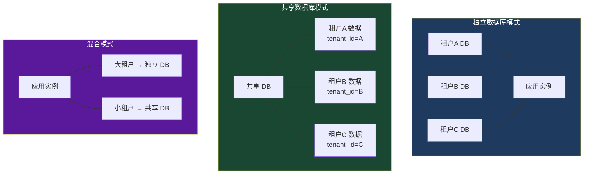

# 多租户中间件

> 多租户（Multi-Tenancy）是 SaaS 应用的核心架构模式。通过中间件实现租户的自动识别与上下文传播，让业务代码无需关心租户切换的底层细节。

---

## 一、多租户架构概述

### 1.1 什么是多租户

多租户是指一套系统同时为多个客户（租户）提供服务，且各租户的数据互相隔离。典型场景：SaaS 平台上的每个企业客户就是一个租户。

### 1.2 三种租户隔离模式



| 模式 | 隔离级别 | 成本 | 复杂度 | 适用场景 |
|------|----------|------|--------|----------|
| 独立数据库 | 最高 | 最高 | 最低 | 金融、医疗等强合规行业 |
| 共享数据库（隔离 Schema） | 中等 | 中等 | 中等 | 中型 SaaS，租户数量多 |
| 共享数据库（共享表 + tenant_id） | 最低 | 最低 | 最高 | 小型 SaaS，成本敏感 |

### 1.3 租户识别策略

中间件需要从请求中提取租户标识，常见策略：

| 策略 | 示例 | 优点 | 缺点 |
|------|------|------|------|
| Header | `X-Tenant-Id: tenant-a` | 简单直接，适合 API 调用 | 需客户端配合 |
| 子域名 | `tenant-a.app.com` | 用户友好，无需额外配置 | 需要 DNS 配置和通配符证书 |
| 路径前缀 | `/tenant-a/api/orders` | 直观明确 | URL 变长，路由配置复杂 |
| QueryString | `?tenantId=tenant-a` | 最简单 | 不适合生产环境，易篡改 |

---

## 二、多租户中间件实现

### 2.1 租户模型

```csharp
/// <summary>
/// 租户信息
/// </summary>
public class TenantInfo
{
    /// <summary>
    /// 租户 ID
    /// </summary>
    public string TenantId { get; set; } = string.Empty;

    /// <summary>
    /// 租户名称
    /// </summary>
    public string Name { get; set; } = string.Empty;

    /// <summary>
    /// 租户标识（子域名/Header 值）
    /// </summary>
    public string Identifier { get; set; } = string.Empty;

    /// <summary>
    /// 数据库连接字符串（独立数据库模式）
    /// </summary>
    public string? ConnectionString { get; set; }

    /// <summary>
    /// 数据库 Schema 名称（共享数据库 + Schema 隔离模式）
    /// </summary>
    public string? Schema { get; set; }

    /// <summary>
    /// 隔离模式
    /// </summary>
    public TenantIsolationMode IsolationMode { get; set; }

    /// <summary>
    /// 租户状态
    /// </summary>
    public TenantStatus Status { get; set; }

    /// <summary>
    /// 租户自定义配置
    /// </summary>
    public Dictionary<string, string> Properties { get; set; } = new();
}

/// <summary>
/// 租户隔离模式
/// </summary>
public enum TenantIsolationMode
{
    /// <summary>共享数据库，通过 tenant_id 字段隔离</summary>
    SharedDatabase,
    /// <summary>共享数据库，通过 Schema 隔离</summary>
    SharedDatabaseWithSchema,
    /// <summary>独立数据库</summary>
    SeparateDatabase
}

/// <summary>
/// 租户状态
/// </summary>
public enum TenantStatus
{
    /// <summary>活跃</summary>
    Active,
    /// <summary>已暂停</summary>
    Suspended,
    /// <summary>已过期</summary>
    Expired
}
```

### 2.2 租户解析器

```csharp
/// <summary>
/// 租户解析器接口
/// </summary>
public interface ITenantResolver
{
    /// <summary>
    /// 从请求中解析租户标识
    /// </summary>
    Task<string?> ResolveIdentifierAsync(HttpContext context);
}

/// <summary>
/// Header 方式解析租户
/// </summary>
public class HeaderTenantResolver : ITenantResolver
{
    private readonly string _headerName;

    public HeaderTenantResolver(string headerName = "X-Tenant-Id")
    {
        _headerName = headerName;
    }

    public Task<string?> ResolveIdentifierAsync(HttpContext context)
    {
        var identifier = context.Request.Headers[_headerName]
            .FirstOrDefault();
        return Task.FromResult(identifier);
    }
}

/// <summary>
/// 子域名方式解析租户
/// </summary>
public class SubdomainTenantResolver : ITenantResolver
{
    private readonly string _domainSuffix;

    public SubdomainTenantResolver(string domainSuffix = ".example.com")
    {
        _domainSuffix = domainSuffix;
    }

    public Task<string?> ResolveIdentifierAsync(HttpContext context)
    {
        var host = context.Request.Host.Host;

        // tenant-a.example.com → tenant-a
        if (host.EndsWith(_domainSuffix, StringComparison.OrdinalIgnoreCase))
        {
            var subdomain = host[..^_domainSuffix.Length];
            if (!string.IsNullOrEmpty(subdomain) && subdomain != "www")
            {
                return Task.FromResult<string?>(subdomain);
            }
        }

        return Task.FromResult<string?>(null);
    }
}

/// <summary>
/// 路径前缀方式解析租户
/// </summary>
public class PathPrefixTenantResolver : ITenantResolver
{
    public Task<string?> ResolveIdentifierAsync(HttpContext context)
    {
        var path = context.Request.Path.Value;

        // /tenant-a/api/orders → tenant-a
        if (path is not null && path.Length > 1)
        {
            var segments = path.Split('/', StringSplitOptions.RemoveEmptyEntries);
            if (segments.Length > 0)
            {
                return Task.FromResult<string?>(segments[0]);
            }
        }

        return Task.FromResult<string?>(null);
    }
}
```

### 2.3 租户存储（查找租户信息）

```csharp
/// <summary>
/// 租户存储接口
/// </summary>
public interface ITenantStore
{
    /// <summary>
    /// 根据标识查找租户
    /// </summary>
    Task<TenantInfo?> FindByIdentifierAsync(string identifier);
}

/// <summary>
/// 基于配置的租户存储（适合少量租户）
/// </summary>
public class ConfigurationTenantStore : ITenantStore
{
    private readonly Dictionary<string, TenantInfo> _tenants;

    public ConfigurationTenantStore(IOptions<TenantOptions> options)
    {
        _tenants = options.Value.Tenants
            .Where(t => t.Status == TenantStatus.Active)
            .ToDictionary(t => t.Identifier, t => t);
    }

    public Task<TenantInfo?> FindByIdentifierAsync(string identifier)
    {
        _tenants.TryGetValue(identifier, out var tenant);
        return Task.FromResult(tenant);
    }
}

/// <summary>
/// 基于数据库的租户存储
/// </summary>
public class DatabaseTenantStore : ITenantStore
{
    private readonly IServiceScopeFactory _scopeFactory;

    public DatabaseTenantStore(IServiceScopeFactory scopeFactory)
    {
        _scopeFactory = scopeFactory;
    }

    public async Task<TenantInfo?> FindByIdentifierAsync(string identifier)
    {
        using var scope = _scopeFactory.CreateScope();
        var dbContext = scope.ServiceProvider.GetRequiredService<AppDbContext>();

        return await dbContext.Tenants
            .FirstOrDefaultAsync(t => t.Identifier == identifier
                && t.Status == TenantStatus.Active);
    }
}
```

### 2.4 多租户中间件核心实现

```csharp
/// <summary>
/// 多租户中间件配置
/// </summary>
public class TenantMiddlewareOptions
{
    /// <summary>
    /// 不需要租户识别的路径
    /// </summary>
    public List<string> ExcludePaths { get; set; } = new()
    {
        "/health",
        "/metrics",
        "/api/public"
    };

    /// <summary>
    /// 租户不存在时的默认行为
    /// </summary>
    public TenantNotFoundBehavior NotFoundBehavior { get; set; }
        = TenantNotFoundBehavior.Return404;

    /// <summary>
    /// 租户暂停时的行为
    /// </summary>
    public TenantSuspendedBehavior SuspendedBehavior { get; set; }
        = TenantSuspendedBehavior.Return403;
}

/// <summary>
/// 租户不存在时的行为
/// </summary>
public enum TenantNotFoundBehavior
{
    /// <summary>返回 404</summary>
    Return404,
    /// <summary>返回 400</summary>
    Return400,
    /// <summary>使用默认租户继续</summary>
    UseDefault
}

/// <summary>
/// 租户暂停时的行为
/// </summary>
public enum TenantSuspendedBehavior
{
    /// <summary>返回 403</summary>
    Return403,
    /// <summary>返回 503</summary>
    Return503,
    /// <summary>重定向到暂停页面</summary>
    RedirectToSuspendedPage
}

/// <summary>
/// 多租户中间件
/// </summary>
public class TenantMiddleware
{
    private readonly RequestDelegate _next;
    private readonly TenantMiddlewareOptions _options;
    private readonly ILogger<TenantMiddleware> _logger;

    public TenantMiddleware(
        RequestDelegate next,
        IOptions<TenantMiddlewareOptions> options,
        ILogger<TenantMiddleware> logger)
    {
        _next = next;
        _options = options.Value;
        _logger = logger;
    }

    public async Task InvokeAsync(
        HttpContext context,
        ITenantResolver tenantResolver,
        ITenantStore tenantStore,
        ITenantAccessor tenantAccessor)
    {
        // 排除路径
        if (ShouldExclude(context.Request.Path))
        {
            await _next(context);
            return;
        }

        // 1. 解析租户标识
        var identifier = await tenantResolver.ResolveIdentifierAsync(context);

        if (string.IsNullOrEmpty(identifier))
        {
            _logger.LogWarning("无法解析租户标识: {Method} {Path}",
                context.Request.Method, context.Request.Path);

            await HandleTenantNotFound(context, "无法识别租户");
            return;
        }

        // 2. 查找租户信息
        var tenant = await tenantStore.FindByIdentifierAsync(identifier);

        if (tenant is null)
        {
            _logger.LogWarning("租户不存在: {Identifier}", identifier);
            await HandleTenantNotFound(context, $"租户 '{identifier}' 不存在");
            return;
        }

        // 3. 检查租户状态
        if (tenant.Status == TenantStatus.Suspended)
        {
            _logger.LogWarning("租户已暂停: {TenantId}", tenant.TenantId);
            await HandleTenantSuspended(context, tenant);
            return;
        }

        if (tenant.Status == TenantStatus.Expired)
        {
            _logger.LogWarning("租户已过期: {TenantId}", tenant.TenantId);
            await HandleTenantSuspended(context, tenant);
            return;
        }

        // 4. 设置租户上下文
        tenantAccessor.Current = tenant;

        _logger.LogDebug("租户已识别: {TenantId} ({Name})",
            tenant.TenantId, tenant.Name);

        // 5. 继续处理请求
        await _next(context);
    }

    private bool ShouldExclude(PathString path)
    {
        return _options.ExcludePaths.Any(exclude =>
            path.StartsWithSegments(exclude, StringComparison.OrdinalIgnoreCase));
    }

    private async Task HandleTenantNotFound(HttpContext context, string message)
    {
        switch (_options.NotFoundBehavior)
        {
            case TenantNotFoundBehavior.Return404:
                context.Response.StatusCode = 404;
                await context.Response.WriteAsJsonAsync(new
                {
                    error = "tenant_not_found",
                    message
                });
                break;

            case TenantNotFoundBehavior.Return400:
                context.Response.StatusCode = 400;
                await context.Response.WriteAsJsonAsync(new
                {
                    error = "invalid_tenant",
                    message
                });
                break;

            case TenantNotFoundBehavior.UseDefault:
                // 继续处理，不设置租户上下文
                await _next(context);
                break;
        }
    }

    private async Task HandleTenantSuspended(HttpContext context, TenantInfo tenant)
    {
        switch (_options.SuspendedBehavior)
        {
            case TenantSuspendedBehavior.Return403:
                context.Response.StatusCode = 403;
                await context.Response.WriteAsJsonAsync(new
                {
                    error = "tenant_suspended",
                    message = "租户已被暂停"
                });
                break;

            case TenantSuspendedBehavior.Return503:
                context.Response.StatusCode = 503;
                await context.Response.WriteAsJsonAsync(new
                {
                    error = "tenant_unavailable",
                    message = "租户服务暂时不可用"
                });
                break;

            case TenantSuspendedBehavior.RedirectToSuspendedPage:
                context.Response.Redirect("/suspended");
                break;
        }
    }
}
```

---

## 三、租户上下文传播

### 3.1 ITenantAccessor（AsyncLocal 实现）

租户上下文需要在整个请求生命周期内可用，且不能被并发请求污染。`AsyncLocal<T>` 是理想的实现方式。

```csharp
/// <summary>
/// 租户上下文访问器
/// </summary>
public interface ITenantAccessor
{
    /// <summary>
    /// 当前租户信息
    /// </summary>
    TenantInfo? Current { get; set; }
}

/// <summary>
/// 基于 AsyncLocal 的租户上下文访问器
/// </summary>
public class TenantAccessor : ITenantAccessor
{
    private static readonly AsyncLocal<TenantInfo?> _current = new();

    public TenantInfo? Current
    {
        get => _current.Value;
        set => _current.Value = value;
    }
}
```

**为什么用 AsyncLocal**：

- 每个请求有独立的上下文，不会互相干扰
- `await` 切换线程后仍能访问正确的租户信息
- 不依赖 HttpContext，在非 Web 场景（后台任务）也可使用

### 3.2 DI 作用域内可用

```csharp
// 注册为 Scoped，每个请求一个实例
builder.Services.AddScoped<ITenantAccessor, TenantAccessor>();
```

> [!NOTE]
> 即使 `TenantAccessor` 内部使用 `AsyncLocal`（静态字段），也建议注册为 Scoped。这样在测试时可以替换为 Mock 实现，而不依赖静态状态。

### 3.3 EF Core 多租户：Global Query Filter

在共享数据库模式下，每条查询都需要自动附加 `tenant_id` 条件。EF Core 的 Global Query Filter 正好满足这个需求。

```csharp
/// <summary>
/// 多租户感知的 DbContext
/// </summary>
public class AppDbContext : DbContext
{
    private readonly ITenantAccessor _tenantAccessor;

    public AppDbContext(
        DbContextOptions<AppDbContext> options,
        ITenantAccessor tenantAccessor) : base(options)
    {
        _tenantAccessor = tenantAccessor;
    }

    protected override void OnModelCreating(ModelBuilder modelBuilder)
    {
        // 为所有实现 IMultiTenant 的实体配置 Global Query Filter
        foreach (var entityType in modelBuilder.Model.GetEntityTypes())
        {
            if (typeof(IMultiTenant).IsAssignableFrom(entityType.ClrType))
            {
                modelBuilder.Entity(entityType.ClrType)
                    .HasQueryFilter(
                        GenerateTenantFilter(entityType.ClrType));
            }
        }
    }

    /// <summary>
    /// 生成租户过滤表达式
    /// </summary>
    private LambdaExpression GenerateTenantFilter(Type entityType)
    {
        var parameter = Expression.Parameter(entityType, "e");
        var tenantIdProperty = Expression.Property(parameter, "TenantId");
        var currentTenantId = Expression.Constant(
            _tenantAccessor.Current?.TenantId);
        var equal = Expression.Equal(tenantIdProperty, currentTenantId);

        return Expression.Lambda(equal, parameter);
    }

    public override int SaveChanges()
    {
        SetTenantIdForNewEntities();
        return base.SaveChanges();
    }

    public override Task<int> SaveChangesAsync(
        CancellationToken cancellationToken = default)
    {
        SetTenantIdForNewEntities();
        return base.SaveChangesAsync(cancellationToken);
    }

    /// <summary>
    /// 自动为新实体设置 TenantId
    /// </summary>
    private void SetTenantIdForNewEntities()
    {
        var tenantId = _tenantAccessor.Current?.TenantId;
        if (tenantId is null) return;

        foreach (var entry in ChangeTracker.Entries<IMultiTenant>()
            .Where(e => e.State == EntityState.Added))
        {
            entry.Entity.TenantId = tenantId;
        }
    }
}

/// <summary>
/// 多租户实体接口
/// </summary>
public interface IMultiTenant
{
    string TenantId { get; set; }
}
```

使用示例：

```csharp
public class Order : IMultiTenant
{
    public Guid Id { get; set; }
    public string TenantId { get; set; } = string.Empty;
    public string ProductName { get; set; } = string.Empty;
    public decimal Amount { get; set; }
}

// 查询时自动过滤：只返回当前租户的订单
var orders = await dbContext.Orders.ToListAsync();
// 生成的 SQL: SELECT * FROM Orders WHERE TenantId = @tenantId
```

### 3.4 数据库连接切换

独立数据库模式下，需要根据租户动态切换连接字符串：

```csharp
/// <summary>
/// 多租户 DbContext 工厂
/// </summary>
public class TenantDbContextFactory
{
    private readonly IServiceProvider _serviceProvider;
    private readonly ITenantAccessor _tenantAccessor;

    public TenantDbContextFactory(
        IServiceProvider serviceProvider,
        ITenantAccessor tenantAccessor)
    {
        _serviceProvider = serviceProvider;
        _tenantAccessor = tenantAccessor;
    }

    /// <summary>
    /// 创建租户专属的 DbContext
    /// </summary>
    public AppDbContext CreateDbContext()
    {
        var tenant = _tenantAccessor.Current
            ?? throw new InvalidOperationException("租户上下文未设置");

        if (tenant.IsolationMode == TenantIsolationMode.SeparateDatabase
            && !string.IsNullOrEmpty(tenant.ConnectionString))
        {
            var optionsBuilder = new DbContextOptionsBuilder<AppDbContext>();
            optionsBuilder.UseSqlServer(tenant.ConnectionString);

            return new AppDbContext(
                optionsBuilder.Options,
                _tenantAccessor);
        }

        // 共享数据库模式，使用默认连接
        return _serviceProvider.GetRequiredService<AppDbContext>();
    }
}
```

注册方式：

```csharp
// 使用工厂模式创建 DbContext
builder.Services.AddScoped<AppDbContext>(sp =>
{
    var factory = sp.GetRequiredService<TenantDbContextFactory>();
    return factory.CreateDbContext();
});

builder.Services.AddScoped<TenantDbContextFactory>();
```

---

## 四、业务场景

### 4.1 SaaS 平台租户隔离

典型 SaaS 平台的租户中间件注册顺序：

```csharp
var app = builder.Build();

// 1. 异常处理（最外层）
app.UseExceptionHandler();

// 2. 多租户识别（在认证之前，因为认证可能依赖租户配置）
app.UseMiddleware<TenantMiddleware>();

// 3. 认证和授权
app.UseAuthentication();
app.UseAuthorization();

// 4. 业务中间件
app.MapControllers();
```

**为什么多租户中间件在认证之前**：

- 认证配置可能因租户而异（不同租户使用不同的 JWT 签名密钥）
- 租户状态检查应在认证之前（暂停的租户不应继续处理）
- 日志中需要包含租户信息

完整的 DI 注册：

```csharp
// 租户解析器（选择一种策略）
builder.Services.AddSingleton<ITenantResolver, SubdomainTenantResolver>();

// 租户存储
builder.Services.AddSingleton<ITenantStore, ConfigurationTenantStore>();

// 租户上下文
builder.Services.AddScoped<ITenantAccessor, TenantAccessor>();

// 中间件配置
builder.Services.Configure<TenantMiddlewareOptions>(options =>
{
    options.ExcludePaths = new List<string>
    {
        "/health", "/metrics", "/api/public",
        "/register", "/login"
    };
    options.NotFoundBehavior = TenantNotFoundBehavior.Return404;
    options.SuspendedBehavior = TenantSuspendedBehavior.Return403;
});

// 租户配置
builder.Services.Configure<TenantOptions>(builder.Configuration.GetSection("Tenants"));
```

配置文件：

```json
{
  "Tenants": {
    "Tenants": [
      {
        "TenantId": "tenant-a",
        "Name": "A公司",
        "Identifier": "tenant-a",
        "IsolationMode": "SharedDatabase",
        "Status": "Active"
      },
      {
        "TenantId": "tenant-b",
        "Name": "B集团",
        "Identifier": "tenant-b",
        "IsolationMode": "SeparateDatabase",
        "ConnectionString": "Server=...;Database=TenantB;...",
        "Status": "Active"
      }
    ]
  }
}
```

### 4.2 企业集团多子公司系统

大型企业集团的 ERP 系统中，每个子公司是一个租户，需要：

- 独立的数据隔离（子公司之间不可见数据）
- 总部可跨租户查看所有子公司数据
- 子公司管理员只能管理本租户用户

```csharp
/// <summary>
/// 企业集团租户中间件扩展
/// </summary>
public static class EnterpriseTenantExtensions
{
    /// <summary>
    /// 判断当前用户是否可跨租户访问
    /// </summary>
    public static bool CanCrossTenant(HttpContext context)
    {
        return context.User.IsInRole("HeadquartersAdmin")
            || context.User.HasClaim("permission", "cross_tenant");
    }

    /// <summary>
    /// 获取可访问的租户列表
    /// </summary>
    public static List<string> GetAccessibleTenants(HttpContext context)
    {
        if (CanCrossTenant(context))
        {
            // 总部管理员可访问所有租户
            return new List<string> { "*" };
        }

        // 普通用户只能访问当前租户
        var tenantAccessor = context.RequestServices
            .GetRequiredService<ITenantAccessor>();
        return new List<string> { tenantAccessor.Current?.TenantId ?? "" };
    }
}
```

在控制器中使用：

```csharp
[ApiController]
[Route("api/[controller]")]
public class ReportsController : ControllerBase
{
    private readonly AppDbContext _dbContext;
    private readonly ITenantAccessor _tenantAccessor;

    public ReportsController(
        AppDbContext dbContext,
        ITenantAccessor tenantAccessor)
    {
        _dbContext = dbContext;
        _tenantAccessor = tenantAccessor;
    }

    [HttpGet("summary")]
    public async Task<IActionResult> GetSummary(
        [FromQuery] string? tenantId)
    {
        // 跨租户查询需要权限检查
        if (!string.IsNullOrEmpty(tenantId)
            && tenantId != _tenantAccessor.Current?.TenantId)
        {
            if (!EnterpriseTenantExtensions.CanCrossTenant(HttpContext))
            {
                return Forbid();
            }

            // 临时切换租户上下文
            var originalTenant = _tenantAccessor.Current;
            // 注意：这里需要查询指定租户的信息
        }

        // 正常查询（Global Query Filter 自动生效）
        var summary = await _dbContext.Orders
            .GroupBy(o => o.ProductName)
            .Select(g => new { Product = g.Key, Total = g.Sum(o => o.Amount) })
            .ToListAsync();

        return Ok(summary);
    }
}
```

### 4.3 租户缓存策略

频繁查询租户信息会成为性能瓶颈，应加入缓存：

```csharp
/// <summary>
/// 带缓存的租户存储
/// </summary>
public class CachedTenantStore : ITenantStore
{
    private readonly ITenantStore _inner;
    private readonly IMemoryCache _cache;
    private readonly ILogger<CachedTenantStore> _logger;

    public CachedTenantStore(
        ITenantStore inner,
        IMemoryCache cache,
        ILogger<CachedTenantStore> logger)
    {
        _inner = inner;
        _cache = cache;
        _logger = logger;
    }

    public async Task<TenantInfo?> FindByIdentifierAsync(string identifier)
    {
        var cacheKey = $"tenant:{identifier}";

        if (_cache.TryGetValue(cacheKey, out TenantInfo? cached))
        {
            return cached;
        }

        var tenant = await _inner.FindByIdentifierAsync(identifier);

        if (tenant is not null)
        {
            _cache.Set(cacheKey, tenant, TimeSpan.FromMinutes(10));
        }

        return tenant;
    }
}
```

注册装饰器：

```csharp
builder.Services.AddSingleton<ITenantStore, DatabaseTenantStore>();
builder.Services.Decorate<ITenantStore, CachedTenantStore>();
```

> [!NOTE]
> `Decorate` 扩展方法来自 `Scrutor` 包：`dotnet add package Scrutor`

---

## 总结

| 要点 | 说明 |
|------|------|
| 尽早注册 | 多租户中间件应在认证之前，确保后续中间件可使用租户上下文 |
| AsyncLocal | 使用 AsyncLocal 传播租户上下文，线程安全且支持异步 |
| Global Query Filter | EF Core 自动附加租户过滤，避免数据泄露 |
| 连接切换 | 独立数据库模式需动态切换连接字符串 |
| 状态检查 | 租户暂停/过期时应拒绝请求 |
| 缓存 | 租户信息查询频繁，务必加缓存 |
| 排除路径 | 健康检查、公开 API 等不需要租户识别 |
