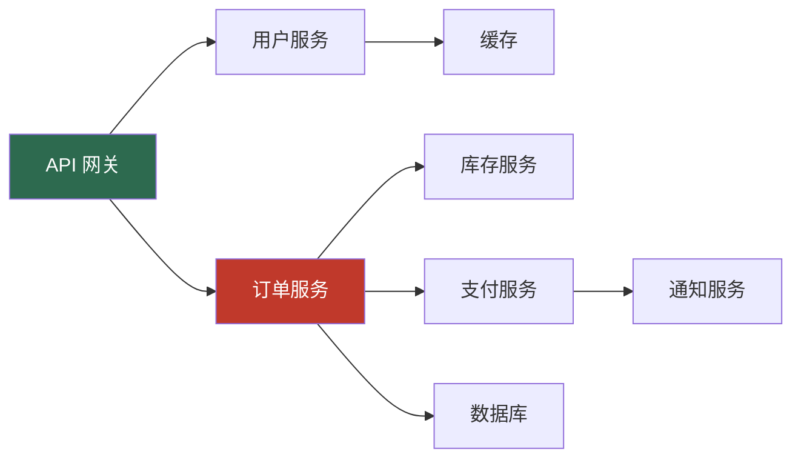

# 分布式追踪

> 在微服务架构中，一个请求可能跨越多个服务。分布式追踪让我们能够还原完整的调用链路，快速定位性能瓶颈和错误根因。

---

## 一、为什么需要分布式追踪

### 1.1 微服务调用链追踪

单体应用中，一次请求的处理完全在一个进程内完成。微服务架构下，一个用户请求可能涉及 5-10 个服务的协作：



当这个链路出现延迟或错误时，我们需要回答：
- 哪个服务是瓶颈？
- 错误从哪个服务开始？
- 每个服务花了多长时间？

没有分布式追踪，这些问题几乎无法回答。

### 1.2 性能瓶颈定位

通过追踪数据，可以看到每个服务/操作的耗时分布：

```
请求总耗时: 1250ms
├── API 网关: 5ms
├── 用户服务: 45ms
│   └── 缓存查询: 2ms
├── 订单服务: 800ms ← 瓶颈!
│   ├── 数据库查询: 350ms
│   ├── 库存服务调用: 200ms
│   └── 支付服务调用: 250ms
└── 通知服务: 400ms
```

### 1.3 错误根因分析

当用户报告"下单失败"时，追踪数据能精确定位：

```
TraceId: abc123
├── API 网关 → 200 OK
├── 订单服务 → 500 Internal Server Error
│   └── 支付服务 → 503 Service Unavailable ← 根因
```

---

## 二、追踪中间件实现

### 2.1 W3C Trace Context 标准

W3C Trace Context 是分布式追踪的行业标准，定义了两个 HTTP 头：

| 头名称 | 作用 | 格式 |
|--------|------|------|
| `traceparent` | 传递追踪标识 | `00-{traceId}-{spanId}-{flags}` |
| `tracestate` | 传递厂商扩展信息 | `vendor=value,vendor2=value2` |

**traceparent 格式详解**：

```
traceparent: 00-4bf92f3577b34da6a3ce929d0e0e4736-00f067aa0ba902b7-01
             │  │                               │                │
             │  traceId (32位十六进制)           spanId (16位)    flags
             version                            │                │
                                                parent-id        sampled
```

### 2.2 追踪标识模型

```csharp
/// <summary>
/// 追踪上下文
/// </summary>
public class TraceContext
{
    /// <summary>
    /// 追踪 ID（整个调用链唯一）
    /// </summary>
    public string TraceId { get; set; } = string.Empty;

    /// <summary>
    /// 当前 Span ID
    /// </summary>
    public string SpanId { get; set; } = string.Empty;

    /// <summary>
    /// 父 Span ID
    /// </summary>
    public string? ParentSpanId { get; set; }

    /// <summary>
    /// 是否采样
    /// </summary>
    public bool Sampled { get; set; }

    /// <summary>
    /// 追踪状态（厂商扩展）
    /// </summary>
    public Dictionary<string, string> TraceState { get; set; } = new();

    /// <summary>
    /// 生成 W3C traceparent 头值
    /// </summary>
    public string ToTraceParent()
    {
        var flags = Sampled ? "01" : "00";
        return $"00-{TraceId}-{SpanId}-{flags}";
    }

    /// <summary>
    /// 从 W3C traceparent 头解析
    /// </summary>
    public static TraceContext? FromTraceParent(string? traceParent)
    {
        if (string.IsNullOrEmpty(traceParent)) return null;

        var parts = traceParent.Split('-');
        if (parts.Length != 4) return null;

        if (parts[0] != "00") return null; // 不支持的版本
        if (parts[1].Length != 32) return null; // traceId 必须为 32 位
        if (parts[2].Length != 16) return null; // spanId 必须为 16 位

        return new TraceContext
        {
            TraceId = parts[1],
            SpanId = parts[2],
            Sampled = parts[3] == "01"
        };
    }
}
```

### 2.3 SpanId 生成

```csharp
/// <summary>
/// 追踪 ID 生成器
/// </summary>
public static class TraceIdGenerator
{
    private static readonly RandomNumberGenerator _rng = RandomNumberGenerator.Create();

    /// <summary>
    /// 生成 32 位十六进制的 TraceId
    /// </summary>
    public static string GenerateTraceId()
    {
        var bytes = new byte[16];
        _rng.GetBytes(bytes);
        return Convert.ToHexString(bytes).ToLowerInvariant();
    }

    /// <summary>
    /// 生成 16 位十六进制的 SpanId
    /// </summary>
    public static string GenerateSpanId()
    {
        var bytes = new byte[8];
        _rng.GetBytes(bytes);
        return Convert.ToHexString(bytes).ToLowerInvariant();
    }
}
```

### 2.4 追踪中间件实现

```csharp
/// <summary>
/// 分布式追踪中间件配置
/// </summary>
public class TracingMiddlewareOptions
{
    /// <summary>
    /// 服务名称（标识当前服务）
    /// </summary>
    public string ServiceName { get; set; } = "unknown";

    /// <summary>
    /// 需要排除的路径
    /// </summary>
    public List<string> ExcludePaths { get; set; } = new()
    {
        "/health", "/metrics", "/favicon.ico"
    };

    /// <summary>
    /// 采样率 (0.0 - 1.0)
    /// </summary>
    public double SampleRate { get; set; } = 1.0;

    /// <summary>
    /// 是否记录请求头
    /// </summary>
    public bool LogRequestHeaders { get; set; } = false;

    /// <summary>
    /// 是否记录响应头
    /// </summary>
    public bool LogResponseHeaders { get; set; } = false;
}

/// <summary>
/// 分布式追踪中间件
/// </summary>
public class TracingMiddleware
{
    private readonly RequestDelegate _next;
    private readonly TracingMiddlewareOptions _options;
    private readonly ILogger<TracingMiddleware> _logger;

    public TracingMiddleware(
        RequestDelegate next,
        IOptions<TracingMiddlewareOptions> options,
        ILogger<TracingMiddleware> logger)
    {
        _next = next;
        _options = options.Value;
        _logger = logger;
    }

    public async Task InvokeAsync(HttpContext context)
    {
        var path = context.Request.Path.Value;

        // 排除路径
        if (_options.ExcludePaths.Any(p =>
            path!.StartsWith(p, StringComparison.OrdinalIgnoreCase)))
        {
            await _next(context);
            return;
        }

        // 1. 解析或创建追踪上下文
        var traceContext = ResolveTraceContext(context.Request);

        // 2. 采样判断
        if (!ShouldSample(traceContext))
        {
            // 不采样时仍传播 traceparent 头
            PropagateTraceContext(context, traceContext);
            await _next(context);
            return;
        }

        // 3. 创建当前 Span
        var span = new TraceSpan
        {
            TraceId = traceContext.TraceId,
            SpanId = TraceIdGenerator.GenerateSpanId(),
            ParentSpanId = traceContext.SpanId,
            OperationName = $"{context.Request.Method} {path}",
            ServiceName = _options.ServiceName,
            StartTime = DateTime.UtcNow
        };

        // 4. 将追踪信息写入 HttpContext
        context.Items["TraceContext"] = traceContext with { SpanId = span.SpanId };
        context.Items["CurrentSpan"] = span;

        // 5. 传播追踪上下文到响应头
        PropagateTraceContext(context, traceContext with { SpanId = span.SpanId });

        var stopwatch = Stopwatch.StartNew();

        try
        {
            await _next(context);
            span.Status = "OK";
        }
        catch (Exception ex)
        {
            span.Status = "ERROR";
            span.Error = ex.Message;
            throw;
        }
        finally
        {
            stopwatch.Stop();
            span.Duration = stopwatch.Elapsed;

            // 6. 记录 Span
            LogSpan(span, context);
        }
    }

    /// <summary>
    /// 解析追踪上下文
    /// </summary>
    private TraceContext ResolveTraceContext(HttpRequest request)
    {
        // 优先从 traceparent 头解析
        var traceParent = request.Headers["traceparent"].FirstOrDefault();
        var traceContext = TraceContext.FromTraceParent(traceParent);

        if (traceContext is not null)
        {
            // 解析 tracestate
            var traceState = request.Headers["tracestate"].FirstOrDefault();
            if (!string.IsNullOrEmpty(traceState))
            {
                foreach (var pair in traceState.Split(','))
                {
                    var eqIndex = pair.IndexOf('=');
                    if (eqIndex > 0)
                    {
                        traceContext.TraceState[pair[..eqIndex].Trim()] =
                            pair[(eqIndex + 1)..].Trim();
                    }
                }
            }

            return traceContext;
        }

        // 没有上游追踪信息，创建新的
        return new TraceContext
        {
            TraceId = TraceIdGenerator.GenerateTraceId(),
            SpanId = TraceIdGenerator.GenerateSpanId(),
            Sampled = true
        };
    }

    /// <summary>
    /// 采样判断
    /// </summary>
    private bool ShouldSample(TraceContext context)
    {
        // 上游已决定采样
        if (context.Sampled) return true;

        // 按采样率决定
        return Random.Shared.NextDouble() < _options.SampleRate;
    }

    /// <summary>
    /// 传播追踪上下文
    /// </summary>
    private static void PropagateTraceContext(
        HttpContext context, TraceContext traceContext)
    {
        // 写入响应头，方便客户端调试
        context.Response.Headers.Append("traceparent", traceContext.ToTraceParent());
        context.Response.Headers.Append("x-trace-id", traceContext.TraceId);
    }

    /// <summary>
    /// 记录 Span 信息
    /// </summary>
    private void LogSpan(TraceSpan span, HttpContext context)
    {
        _logger.LogInformation(
            "追踪: traceId={TraceId} spanId={SpanId} parentSpanId={ParentSpanId} " +
            "operation={Operation} service={Service} status={Status} " +
            "duration={DurationMs}ms userId={UserId}",
            span.TraceId, span.SpanId, span.ParentSpanId,
            span.OperationName, span.ServiceName, span.Status,
            span.Duration.TotalMilliseconds,
            context.User?.FindFirst(ClaimTypes.NameIdentifier)?.Value);

        if (span.Status == "ERROR")
        {
            _logger.LogError(
                "追踪错误: traceId={TraceId} spanId={SpanId} error={Error}",
                span.TraceId, span.SpanId, span.Error);
        }
    }
}

/// <summary>
/// 追踪 Span
/// </summary>
public class TraceSpan
{
    public string TraceId { get; set; } = string.Empty;
    public string SpanId { get; set; } = string.Empty;
    public string? ParentSpanId { get; set; }
    public string OperationName { get; set; } = string.Empty;
    public string ServiceName { get; set; } = string.Empty;
    public DateTime StartTime { get; set; }
    public TimeSpan Duration { get; set; }
    public string Status { get; set; } = "OK";
    public string? Error { get; set; }
    public Dictionary<string, string> Attributes { get; set; } = new();
}
```

### 2.5 注册与配置

```csharp
// Program.cs
builder.Services.Configure<TracingMiddlewareOptions>(options =>
{
    options.ServiceName = "OrderService";
    options.SampleRate = 0.1; // 10% 采样率
    options.ExcludePaths = new List<string>
    {
        "/health", "/metrics", "/swagger"
    };
});

var app = builder.Build();

// 追踪中间件应在管道前端
app.UseMiddleware<TracingMiddleware>();
```

---

## 三、与 OpenTelemetry 集成

### 3.1 .NET OpenTelemetry 自动仪表化

OpenTelemetry 是 CNCF 的可观测性标准，.NET 有官方支持：

```csharp
// 安装 NuGet 包
// dotnet add package OpenTelemetry.Extensions.Hosting
// dotnet add package OpenTelemetry.Instrumentation.AspNetCore
// dotnet add package OpenTelemetry.Instrumentation.Http
// dotnet add package OpenTelemetry.Instrumentation.SqlClient

builder.Services.AddOpenTelemetry()
    .WithTracing(tracing =>
    {
        tracing
            .SetResourceBuilder(ResourceBuilder.CreateDefault()
                .AddService("OrderService", serviceVersion: "1.0.0"))
            .AddAspNetCoreInstrumentation(options =>
            {
                // 过滤不需要追踪的请求
                options.Filter = context =>
                {
                    var path = context.Request.Path.Value;
                    return path is not null
                        && !path.StartsWith("/health")
                        && !path.StartsWith("/metrics");
                };

                // 自定义 Span 属性
                options.EnrichWithHttpRequest = (activity, request) =>
                {
                    activity.SetTag("http.request.body.size",
                        request.ContentLength ?? 0);
                    activity.SetTag("http.user.agent",
                        request.Headers.UserAgent.ToString());
                };

                options.EnrichWithHttpResponse = (activity, response) =>
                {
                    activity.SetTag("http.response.body.size",
                        response.ContentLength ?? 0);
                };
            })
            .AddHttpClientInstrumentation()  // 追踪 HttpClient 调用
            .AddSqlClientInstrumentation()   // 追踪数据库查询
            .AddJaegerExporter()             // 导出到 Jaeger
            .AddZipkinExporter();            // 或导出到 Zipkin
    });
```

### 3.2 Activity API

.NET 的 `System.Diagnostics.Activity` 是 OpenTelemetry 的底层 API：

```csharp
/// <summary>
/// 使用 Activity API 创建自定义 Span
/// </summary>
public class OrderService
{
    private static readonly ActivitySource ActivitySource = new("OrderService");

    private readonly IOrderRepository _orderRepo;
    private readonly IPaymentService _paymentService;

    public OrderService(
        IOrderRepository orderRepo,
        IPaymentService paymentService)
    {
        _orderRepo = orderRepo;
        _paymentService = paymentService;
    }

    public async Task<Order> CreateOrderAsync(CreateOrderRequest request)
    {
        // 创建自定义 Span
        using var activity = ActivitySource.StartActivity("CreateOrder");

        // 添加自定义属性
        activity?.SetTag("order.userId", request.UserId);
        activity?.SetTag("order.productCount", request.Items.Count);

        // 添加事件（Span 内的时间点）
        activity?.AddEvent(new ActivityEvent("order_validation_started"));

        ValidateOrder(request);
        activity?.AddEvent(new ActivityEvent("order_validation_completed"));

        var order = new Order { /* ... */ };

        activity?.AddEvent(new ActivityEvent("order_saving_to_db"));
        await _orderRepo.SaveAsync(order);
        activity?.AddEvent(new ActivityEvent("order_saved_to_db"));

        // 记录异常
        try
        {
            await _paymentService.ChargeAsync(order);
        }
        catch (PaymentException ex)
        {
            activity?.SetStatus(ActivityStatusCode.Error, ex.Message);
            activity?.RecordException(ex);
            throw;
        }

        activity?.SetStatus(ActivityStatusCode.Ok);
        return order;
    }
}
```

### 3.3 与 Jaeger/Zipkin 集成

#### Jaeger 集成

```csharp
// dotnet add package OpenTelemetry.Exporter.Jaeger

builder.Services.AddOpenTelemetry()
    .WithTracing(tracing =>
    {
        tracing
            .SetResourceBuilder(ResourceBuilder.CreateDefault()
                .AddService("OrderService"))
            .AddAspNetCoreInstrumentation()
            .AddHttpClientInstrumentation()
            .AddJaegerExporter(options =>
            {
                options.AgentHost = "localhost";
                options.AgentPort = 6831;
            });
    });
```

#### Zipkin 集成

```csharp
// dotnet add package OpenTelemetry.Exporter.Zipkin

builder.Services.AddOpenTelemetry()
    .WithTracing(tracing =>
    {
        tracing
            .SetResourceBuilder(ResourceBuilder.CreateDefault()
                .AddService("OrderService"))
            .AddAspNetCoreInstrumentation()
            .AddHttpClientInstrumentation()
            .AddZipkinExporter(options =>
            {
                options.Endpoint = new Uri("http://localhost:9411/api/v2/spans");
            });
    });
```

#### 使用 OTLP 导出（推荐）

```csharp
// dotnet add package OpenTelemetry.Exporter.OpenTelemetryProtocol

builder.Services.AddOpenTelemetry()
    .WithTracing(tracing =>
    {
        tracing
            .SetResourceBuilder(ResourceBuilder.CreateDefault()
                .AddService("OrderService"))
            .AddAspNetCoreInstrumentation()
            .AddHttpClientInstrumentation()
            .AddOtlpExporter(options =>
            {
                options.Endpoint = new Uri("http://otel-collector:4317");
                options.Protocol = OtlpExportProtocol.Grpc;
            });
    });
```

OTLP 协议的优势：与 OpenTelemetry Collector 对接，由 Collector 分发到任意后端（Jaeger、Zipkin、Elastic APM 等）。

### 3.4 自定义 Span 和 Baggage

#### Baggage：跨服务传递业务数据

Baggage 是随追踪链路自动传播的键值对，适合传递业务上下文：

```csharp
// 设置 Baggage（在入口服务）
Baggage.Current.SetBaggage("userId", user.Id);
Baggage.Current.SetBaggage("tenantId", tenant.Id);

// 下游服务自动获取
var userId = Baggage.Current.GetBaggage("userId");
var tenantId = Baggage.Current.GetBaggage("tenantId");
```

Baggage 会通过 `baggage` HTTP 头自动传播：

```
baggage: userId=user123,tenantId=tenantA
```

> [!CAUTION]
> Baggage 会随每个请求传播，不要放入大量数据或敏感信息。

#### 自定义 Span 示例

```csharp
/// <summary>
/// 为 HttpClient 调用添加追踪信息
/// </summary>
public class TracingHttpHandler : DelegatingHandler
{
    protected override Task<HttpResponseMessage> SendAsync(
        HttpRequestMessage request, CancellationToken cancellationToken)
    {
        // 传播 traceparent 头（OpenTelemetry 自动仪表化已处理）
        // 这里添加额外的业务标签
        var activity = Activity.Current;
        if (activity is not null)
        {
            activity.SetTag("http.client.url", request.RequestUri?.ToString());
            activity.SetTag("http.client.method", request.Method.ToString());
        }

        return base.SendAsync(request, cancellationToken);
    }
}

// 注册
builder.Services.AddHttpClient("PaymentService")
    .AddHttpMessageHandler<TracingHttpHandler>();
```

---

## 四、业务场景

### 4.1 请求链路追踪

当用户报告"下单很慢"时，通过 TraceId 查看完整调用链：

```csharp
// 在日志中输出 TraceId，方便排查问题
app.Use(async (context, next) =>
{
    var traceId = Activity.Current?.TraceId.ToString()
        ?? context.TraceIdentifier;

    using (LogContext.PushProperty("TraceId", traceId))
    {
        await next();
    }
});
```

日志输出：

```
[2025-03-15 14:23:01] [TraceId: abc123] 收到下单请求
[2025-03-15 14:23:01] [TraceId: abc123] 查询库存耗时: 200ms
[2025-03-15 14:23:02] [TraceId: abc123] 调用支付服务耗时: 250ms
[2025-03-15 14:23:02] [TraceId: abc123] 订单创建完成
```

### 4.2 跨服务调用追踪

微服务间通过 HTTP 调用时，OpenTelemetry 自动传播追踪上下文：

```mermaid
sequenceDiagram
    participant Client as 客户端
    participant GW as API 网关
    participant Order as 订单服务
    participant Pay as 支付服务

    Client->>GW: POST /orders
traceparent: 00-abc-001-01
    GW->>Order: POST /orders
traceparent: 00-abc-002-01
    Order->>Pay: POST /pay
traceparent: 00-abc-003-01
    Pay-->>Order: 200 OK
    Order-->>GW: 201 Created
    GW-->>Client: 201 Created
```

所有 Span 共享同一个 `TraceId`（abc），通过 `ParentSpanId` 形成树状结构。

### 4.3 性能分析

通过追踪数据分析 P99 延迟的根因：

```csharp
// 为关键操作添加耗时标签
using var activity = ActivitySource.StartActivity("DatabaseQuery");
activity?.SetTag("db.system", "sqlserver");
activity?.SetTag("db.statement", query);

var stopwatch = Stopwatch.StartNew();
var result = await dbContext.Orders.FromSqlRaw(query).ToListAsync();
stopwatch.Stop();

activity?.SetTag("db.duration_ms", stopwatch.ElapsedMilliseconds);
```

在 Jaeger UI 中可以看到：

```
OrderService.CreateOrder (1250ms)
├── DatabaseQuery (350ms) ← 占比 28%
├── HTTP POST /pay (250ms) ← 占比 20%
└── CacheQuery (2ms)
```

### 4.4 采样策略

生产环境不建议 100% 采样，推荐策略：

| 策略 | 采样率 | 适用场景 |
|------|--------|----------|
| 全量采样 | 100% | 新服务上线、排查问题时临时开启 |
| 尾部采样 | 错误 100%，成功 1% | 兼顾问题排查与成本控制 |
| 优先级采样 | 慢请求 100%，快请求 1% | 关注性能问题 |
| 随机采样 | 5%-10% | 日常生产环境 |

```csharp
// 自定义采样器：错误请求全量采样
public class ErrorAwareSampler : Sampler
{
    private readonly double _successSampleRate;

    public ErrorAwareSampler(double successSampleRate = 0.05)
    {
        _successSampleRate = successSampleRate;
    }

    public override SamplingResult ShouldSample(in SamplingParameters parameters)
    {
        // 检查是否有错误标签
        var hasError = parameters.Tags?.Any(t =>
            t.Key == "error" && t.Value as string == "true") ?? false;

        if (hasError)
        {
            return new SamplingResult(SamplingDecision.RecordAndSample);
        }

        // 成功请求按比例采样
        if (Random.Shared.NextDouble() < _successSampleRate)
        {
            return new SamplingResult(SamplingDecision.RecordAndSample);
        }

        return new SamplingResult(SamplingDecision.Drop);
    }
}
```

---

## 总结

| 要点 | 说明 |
|------|------|
| W3C 标准 | 使用 traceparent/tracestate 头传播追踪上下文 |
| 自动仪表化 | OpenTelemetry 自动追踪 HTTP 和数据库调用 |
| 采样控制 | 生产环境使用采样策略控制成本 |
| 日志关联 | 日志中输出 TraceId，关联日志与追踪数据 |
| 自定义 Span | 为关键业务操作添加自定义 Span |
| Baggage | 跨服务传递业务上下文，但不宜过大 |
| Jaeger/Zipkin | 选择适合的追踪后端，推荐通过 OTLP Collector 统一导出 |
