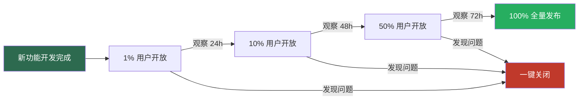

# 功能开关与特性标记

> 功能开关（Feature Flag）让你无需重新部署就能控制功能的开启与关闭。它是灰度发布、A/B 测试和紧急功能关闭的核心技术手段。

---

## 一、功能开关的价值

### 1.1 灰度发布

新功能上线时，先对一小部分用户开放，观察无问题后再全量发布：



### 1.2 A/B 测试

对不同用户群体展示不同的功能版本，通过数据对比选择最优方案：

```
功能开关: checkout_v2
├── A 组（50% 用户）→ 旧版结账流程
└── B 组（50% 用户）→ 新版结账流程

结果对比:
- A 组转化率: 3.2%
- B 组转化率: 3.8% ← 胜出，全量切换
```

### 1.3 紧急关闭功能

生产环境出现问题时，无需回滚代码，直接关闭功能开关：

```
[14:23] 监控告警: 支付接口错误率飙升到 15%
[14:24] 运维: 关闭 feature.payment_v2 → 所有请求回退到 v1
[14:25] 错误率恢复正常
```

### 1.4 按租户/用户开放功能

SaaS 平台中，高级功能仅对付费租户开放：

```csharp
if (featureManager.IsEnabled("advanced_analytics", tenant))
{
    // 显示高级分析面板
}
```

---

## 二、功能开关中间件实现

### 2.1 功能开关模型

```csharp
/// <summary>
/// 功能开关定义
/// </summary>
public class FeatureFlag
{
    /// <summary>
    /// 功能名称
    /// </summary>
    public string Name { get; set; } = string.Empty;

    /// <summary>
    /// 功能描述
    /// </summary>
    public string Description { get; set; } = string.Empty;

    /// <summary>
    /// 是否启用
    /// </summary>
    public bool Enabled { get; set; }

    /// <summary>
    /// 过滤器类型：Always / Percentage / User / Tenant / TimeWindow
    /// </summary>
    public string FilterType { get; set; } = "Always";

    /// <summary>
    /// 过滤器参数（JSON）
    /// </summary>
    public string? FilterParameters { get; set; }

    /// <summary>
    /// 关联的路径前缀（可选，用于中间件拦截）
    /// </summary>
    public List<string> Paths { get; set; } = new();

    /// <summary>
    /// 功能关闭时的降级策略
    /// </summary>
    public FeatureFallbackStrategy FallbackStrategy { get; set; }
        = FeatureFallbackStrategy.Return404;
}

/// <summary>
/// 降级策略
/// </summary>
public enum FeatureFallbackStrategy
{
    /// <summary>返回 404</summary>
    Return404,
    /// <summary>返回 403</summary>
    Return403,
    /// <summary>重定向到其他页面</summary>
    Redirect,
    /// <summary>返回自定义响应</summary>
    CustomResponse
}
```

### 2.2 功能开关存储

```csharp
/// <summary>
/// 功能开关存储接口
/// </summary>
public interface IFeatureFlagStore
{
    /// <summary>
    /// 获取所有功能开关
    /// </summary>
    Task<IReadOnlyList<FeatureFlag>> GetAllAsync();

    /// <summary>
    /// 根据名称获取功能开关
    /// </summary>
    Task<FeatureFlag?> GetAsync(string name);

    /// <summary>
    /// 判断功能是否启用
    /// </summary>
    Task<bool> IsEnabledAsync(string name, HttpContext? context = null);
}

/// <summary>
/// 基于配置的功能开关存储
/// </summary>
public class ConfigurationFeatureFlagStore : IFeatureFlagStore
{
    private readonly IReadOnlyList<FeatureFlag> _flags;

    public ConfigurationFeatureFlagStore(IOptions<FeatureFlagOptions> options)
    {
        _flags = options.Value.Flags.AsReadOnly();
    }

    public Task<IReadOnlyList<FeatureFlag>> GetAllAsync()
        => Task.FromResult(_flags);

    public Task<FeatureFlag?> GetAsync(string name)
        => Task.FromResult(_flags.FirstOrDefault(f => f.Name == name));

    public async Task<bool> IsEnabledAsync(string name, HttpContext? context = null)
    {
        var flag = await GetAsync(name);
        if (flag is null) return false;
        if (!flag.Enabled) return false;

        // 根据过滤器类型判断
        return flag.FilterType switch
        {
            "Always" => true,
            "Percentage" => EvaluatePercentage(flag, context),
            "User" => EvaluateUser(flag, context),
            "Tenant" => EvaluateTenant(flag, context),
            "TimeWindow" => EvaluateTimeWindow(flag),
            _ => flag.Enabled
        };
    }

    private bool EvaluatePercentage(FeatureFlag flag, HttpContext? context)
    {
        var parameters = JsonSerializer.Deserialize<PercentageFilterParams>(
            flag.FilterParameters ?? "{}");
        if (parameters is null) return false;

        // 基于用户 ID 的哈希确定百分比
        var userId = context?.User?.FindFirst(ClaimTypes.NameIdentifier)?.Value
            ?? context?.Connection.RemoteIpAddress?.ToString()
            ?? Guid.NewGuid().ToString();

        var hash = userId.GetHashCode();
        var bucket = Math.Abs(hash) % 100;

        return bucket < parameters.Percentage;
    }

    private bool EvaluateUser(FeatureFlag flag, HttpContext? context)
    {
        var parameters = JsonSerializer.Deserialize<UserFilterParams>(
            flag.FilterParameters ?? "{}");
        if (parameters is null || context is null) return false;

        var userId = context.User?.FindFirst(ClaimTypes.NameIdentifier)?.Value;
        return userId is not null && parameters.AllowedUsers.Contains(userId);
    }

    private bool EvaluateTenant(FeatureFlag flag, HttpContext? context)
    {
        var parameters = JsonSerializer.Deserialize<TenantFilterParams>(
            flag.FilterParameters ?? "{}");
        if (parameters is null || context is null) return false;

        var tenantAccessor = context.RequestServices
            .GetService<ITenantAccessor>();
        var tenantId = tenantAccessor?.Current?.TenantId;

        return tenantId is not null
            && parameters.AllowedTenants.Contains(tenantId);
    }

    private bool EvaluateTimeWindow(FeatureFlag flag)
    {
        var parameters = JsonSerializer.Deserialize<TimeWindowFilterParams>(
            flag.FilterParameters ?? "{}");
        if (parameters is null) return false;

        var now = DateTime.UtcNow;
        return now >= parameters.Start && now <= parameters.End;
    }
}

// 过滤器参数模型
public record PercentageFilterParams(int Percentage);
public record UserFilterParams(List<string> AllowedUsers);
public record TenantFilterParams(List<string> AllowedTenants);
public record TimeWindowFilterParams(DateTime Start, DateTime End);
```

### 2.3 功能开关中间件

```csharp
/// <summary>
/// 功能开关中间件配置
/// </summary>
public class FeatureFlagMiddlewareOptions
{
    /// <summary>
    /// 路径与功能名称的映射
    /// </summary>
    public Dictionary<string, string> PathFeatureMap { get; set; } = new();

    /// <summary>
    /// 功能关闭时的默认降级策略
    /// </summary>
    public FeatureFallbackStrategy DefaultFallback { get; set; }
        = FeatureFallbackStrategy.Return404;

    /// <summary>
    /// 降级重定向 URL（当 FallbackStrategy = Redirect 时使用）
    /// </summary>
    public string? RedirectUrl { get; set; }
}

/// <summary>
/// 功能开关中间件
/// </summary>
public class FeatureFlagMiddleware
{
    private readonly RequestDelegate _next;
    private readonly FeatureFlagMiddlewareOptions _options;
    private readonly ILogger<FeatureFlagMiddleware> _logger;

    public FeatureFlagMiddleware(
        RequestDelegate next,
        IOptions<FeatureFlagMiddlewareOptions> options,
        ILogger<FeatureFlagMiddleware> logger)
    {
        _next = next;
        _options = options.Value;
        _logger = logger;
    }

    public async Task InvokeAsync(
        HttpContext context,
        IFeatureFlagStore flagStore)
    {
        // 查找当前路径对应的功能开关
        var featureName = ResolveFeatureName(context.Request.Path);

        if (featureName is null)
        {
            // 路径未关联功能开关，直接通过
            await _next(context);
            return;
        }

        // 检查功能是否启用
        var isEnabled = await flagStore.IsEnabledAsync(featureName, context);

        if (isEnabled)
        {
            await _next(context);
            return;
        }

        _logger.LogInformation(
            "功能 '{Feature}' 已关闭，拒绝访问: {Method} {Path}",
            featureName, context.Request.Method, context.Request.Path);

        // 执行降级策略
        await HandleFallback(context, featureName);
    }

    /// <summary>
    /// 解析路径对应的功能名称
    /// </summary>
    private string? ResolveFeatureName(PathString path)
    {
        foreach (var mapping in _options.PathFeatureMap)
        {
            if (path.StartsWithSegments(mapping.Key,
                StringComparison.OrdinalIgnoreCase))
            {
                return mapping.Value;
            }
        }

        return null;
    }

    /// <summary>
    /// 处理降级策略
    /// </summary>
    private async Task HandleFallback(HttpContext context, string featureName)
    {
        // 查找功能开关的降级配置
        var flagStore = context.RequestServices
            .GetRequiredService<IFeatureFlagStore>();
        var flag = await flagStore.GetAsync(featureName);

        var strategy = flag?.FallbackStrategy ?? _options.DefaultFallback;

        switch (strategy)
        {
            case FeatureFallbackStrategy.Return404:
                context.Response.StatusCode = 404;
                await context.Response.WriteAsJsonAsync(new
                {
                    error = "feature_disabled",
                    message = $"功能 '{featureName}' 暂未开放"
                });
                break;

            case FeatureFallbackStrategy.Return403:
                context.Response.StatusCode = 403;
                await context.Response.WriteAsJsonAsync(new
                {
                    error = "feature_forbidden",
                    message = $"您没有访问功能 '{featureName}' 的权限"
                });
                break;

            case FeatureFallbackStrategy.Redirect:
                var redirectUrl = _options.RedirectUrl ?? "/";
                context.Response.Redirect(redirectUrl);
                break;

            case FeatureFallbackStrategy.CustomResponse:
                await HandleCustomFallback(context, flag);
                break;
        }
    }

    /// <summary>
    /// 自定义降级响应
    /// </summary>
    private async Task HandleCustomFallback(HttpContext context, FeatureFlag? flag)
    {
        if (flag?.FilterParameters is null)
        {
            context.Response.StatusCode = 404;
            return;
        }

        var customParams = JsonSerializer.Deserialize<CustomFallbackParams>(
            flag.FilterParameters);

        context.Response.StatusCode = customParams?.StatusCode ?? 200;
        context.Response.ContentType = "application/json";
        await context.Response.WriteAsync(
            customParams?.ResponseBody ?? "{}");
    }
}

public record CustomFallbackParams(int StatusCode, string ResponseBody);
```

### 2.4 注册与配置

```csharp
// Program.cs
builder.Services.AddSingleton<IFeatureFlagStore, ConfigurationFeatureFlagStore>();

builder.Services.Configure<FeatureFlagOptions>(
    builder.Configuration.GetSection("FeatureFlags"));

builder.Services.Configure<FeatureFlagMiddlewareOptions>(options =>
{
    options.PathFeatureMap = new Dictionary<string, string>
    {
        { "/api/v2/orders", "orders_v2" },
        { "/api/analytics", "advanced_analytics" },
        { "/api/beta", "beta_features" }
    };
    options.DefaultFallback = FeatureFallbackStrategy.Return404;
});

var app = builder.Build();

// 功能开关中间件应在路由之前
app.UseMiddleware<FeatureFlagMiddleware>();
```

配置文件：

```json
{
  "FeatureFlags": {
    "Flags": [
      {
        "Name": "orders_v2",
        "Description": "新版订单接口",
        "Enabled": true,
        "FilterType": "Percentage",
        "FilterParameters": "{\"Percentage\": 10}",
        "Paths": [ "/api/v2/orders" ],
        "FallbackStrategy": "Return404"
      },
      {
        "Name": "advanced_analytics",
        "Description": "高级分析功能（仅付费租户）",
        "Enabled": true,
        "FilterType": "Tenant",
        "FilterParameters": "{\"AllowedTenants\": [\"tenant-premium-001\", \"tenant-enterprise-002\"]}",
        "Paths": [ "/api/analytics" ],
        "FallbackStrategy": "Return403"
      },
      {
        "Name": "beta_features",
        "Description": "Beta 功能",
        "Enabled": true,
        "FilterType": "User",
        "FilterParameters": "{\"AllowedUsers\": [\"user_001\", \"user_002\"]}",
        "Paths": [ "/api/beta" ],
        "FallbackStrategy": "Return404"
      },
      {
        "Name": "maintenance_mode",
        "Description": "维护模式",
        "Enabled": false,
        "FilterType": "Always",
        "FallbackStrategy": "CustomResponse",
        "FilterParameters": "{\"StatusCode\": 503, \"ResponseBody\": \"{\\\"error\\\": \\\"system_maintenance\\\", \\\"message\\\": \\\"系统维护中，请稍后重试\\\"}\"}"
      }
    ]
  }
}
```

---

## 三、与现有方案集成

### 3.1 Microsoft.FeatureManagement

微软官方的功能开关库，功能完善且与 ASP.NET Core 深度集成。

```bash
dotnet add package Microsoft.FeatureManagement.AspNetCore
```

基本使用：

```csharp
// 注册
builder.Services.AddFeatureManagement(
    builder.Configuration.GetSection("FeatureFlags"));

var app = builder.Build();
```

配置文件格式：

```json
{
  "FeatureFlags": {
    "OrdersV2": true,
    "AdvancedAnalytics": false,
    "BetaFeatures": {
      "EnabledFor": [
        {
          "Name": "Percentage",
          "Parameters": {
            "Value": 10
          }
        }
      ]
    }
  }
}
```

在控制器中使用：

```csharp
[ApiController]
[Route("api/[controller]")]
public class OrdersController : ControllerBase
{
    private readonly IFeatureManager _featureManager;

    public OrdersController(IFeatureManager featureManager)
    {
        _featureManager = featureManager;
    }

    [HttpGet("v2")]
    public async Task<IActionResult> GetOrdersV2()
    {
        if (!await _featureManager.IsEnabledAsync("OrdersV2"))
        {
            return NotFound(new { message = "功能暂未开放" });
        }

        // V2 逻辑
        return Ok(/* ... */);
    }
}
```

### 3.2 基于配置的功能开关

最简单的方式——直接读取 `appsettings.json`：

```json
{
  "Features": {
    "EnableNewDashboard": true,
    "EnableEmailNotification": false,
    "MaxRetries": 3
  }
}
```

```csharp
// 使用 IOptionsSnapshot 支持热更新
public class DashboardController : ControllerBase
{
    private readonly IOptionsSnapshot<FeatureSettings> _features;

    public DashboardController(IOptionsSnapshot<FeatureSettings> features)
    {
        _features = features;
    }

    [HttpGet]
    public IActionResult Get()
    {
        if (!_features.Value.EnableNewDashboard)
        {
            return View("OldDashboard");
        }
        return View("NewDashboard");
    }
}
```

### 3.3 百分比灰度发布

Microsoft.FeatureManagement 内置百分比过滤器：

```json
{
  "FeatureFlags": {
    "NewCheckout": {
      "EnabledFor": [
        {
          "Name": "Microsoft.Percentage",
          "Parameters": {
            "Value": 15
          }
        }
      ]
    }
  }
}
```

自定义百分比过滤器（基于用户 ID 确定性分配）：

```csharp
/// <summary>
/// 确定性百分比过滤器
/// 同一用户始终分配到同一组
/// </summary>
[FilterAlias("DeterministicPercentage")]
public class DeterministicPercentageFilter : IFeatureFilter
{
    public Task<bool> EvaluateAsync(FeatureFilterEvaluationContext context)
    {
        var percentage = context.Parameters.Get<int>("Value");
        var userId = context.Parameters.Get<string>("UserId");

        // 使用哈希确保同一用户始终得到相同结果
        var hash = userId?.GetHashCode() ?? 0;
        var bucket = Math.Abs(hash) % 100;

        return Task.FromResult(bucket < percentage);
    }
}
```

注册自定义过滤器：

```csharp
builder.Services.AddFeatureManagement()
    .AddFeatureFilter<DeterministicPercentageFilter>();
```

### 3.4 功能过滤器

#### 时间窗口过滤器

```csharp
/// <summary>
/// 时间窗口功能过滤器
/// 功能在指定时间范围内启用
/// </summary>
[FilterAlias("TimeWindow")]
public class TimeWindowFilter : IFeatureFilter
{
    public Task<bool> EvaluateAsync(FeatureFilterEvaluationContext context)
    {
        var start = context.Parameters.Get<DateTime?>("Start");
        var end = context.Parameters.Get<DateTime?>("End");
        var now = DateTime.UtcNow;

        if (start.HasValue && now < start.Value) return Task.FromResult(false);
        if (end.HasValue && now > end.Value) return Task.FromResult(false);

        return Task.FromResult(true);
    }
}
```

配置：

```json
{
  "FeatureFlags": {
    "HolidayPromotion": {
      "EnabledFor": [
        {
          "Name": "TimeWindow",
          "Parameters": {
            "Start": "2025-12-01T00:00:00Z",
            "End": "2025-12-31T23:59:59Z"
          }
        }
      ]
    }
  }
}
```

#### 目标用户过滤器

```csharp
/// <summary>
/// 目标用户过滤器
/// 仅对指定用户或组启用功能
/// </summary>
[FilterAlias("Targeting")]
public class TargetingFilter : IFeatureFilter
{
    private readonly IHttpContextAccessor _httpContextAccessor;

    public TargetingFilter(IHttpContextAccessor httpContextAccessor)
    {
        _httpContextAccessor = httpContextAccessor;
    }

    public Task<bool> EvaluateAsync(FeatureFilterEvaluationContext context)
    {
        var httpContext = _httpContextAccessor.HttpContext;
        if (httpContext is null) return Task.FromResult(false);

        var userId = httpContext.User?.FindFirst(ClaimTypes.NameIdentifier)?.Value;
        if (userId is null) return Task.FromResult(false);

        // 检查是否在允许列表中
        var allowedUsers = context.Parameters.Get<List<string>>("Users");
        if (allowedUsers?.Contains(userId) == true) return Task.FromResult(true);

        // 检查是否在允许的角色中
        var allowedRoles = context.Parameters.Get<List<string>>("Roles");
        if (allowedRoles is not null)
        {
            foreach (var role in allowedRoles)
            {
                if (httpContext.User.IsInRole(role))
                    return Task.FromResult(true);
            }
        }

        // 检查默认百分比
        var defaultPercentage = context.Parameters.Get<int?>("DefaultPercentage") ?? 0;
        var hash = Math.Abs(userId.GetHashCode()) % 100;

        return Task.FromResult(hash < defaultPercentage);
    }
}
```

配置：

```json
{
  "FeatureFlags": {
    "NewDashboard": {
      "EnabledFor": [
        {
          "Name": "Targeting",
          "Parameters": {
            "Users": ["user_001", "user_002"],
            "Roles": ["BetaTester"],
            "DefaultPercentage": 5
          }
        }
      ]
    }
  }
}
```

#### 在视图中使用功能开关

```cshtml
@addTagHelper *, Microsoft.FeatureManagement.AspNetCore

<!-- 根据功能开关条件渲染 -->
<feature name="NewDashboard">
    <div class="new-dashboard">新版仪表盘</div>
</feature>
<feature name="NewDashboard" negate="true">
    <div class="old-dashboard">旧版仪表盘</div>
</feature>

<!-- 多功能开关组合 -->
<feature name="NewDashboard">
    <feature name="AdvancedAnalytics">
        <div>新版仪表盘 + 高级分析</div>
    </feature>
</feature>
```

---

## 总结

| 要点 | 说明 |
|------|------|
| 解耦部署与发布 | 功能开关让代码部署和功能发布解耦 |
| 灰度发布 | 先小范围验证，再逐步放大 |
| 紧急关闭 | 出问题时一键关闭，无需回滚代码 |
| 确定性分配 | 基于用户 ID 哈希，同一用户始终在同一组 |
| 降级策略 | 功能关闭时返回 404/403/重定向/自定义响应 |
| 微软方案 | Microsoft.FeatureManagement 功能完善，推荐生产使用 |
| 配置热更新 | IOptionsSnapshot 支持运行时修改配置无需重启 |
