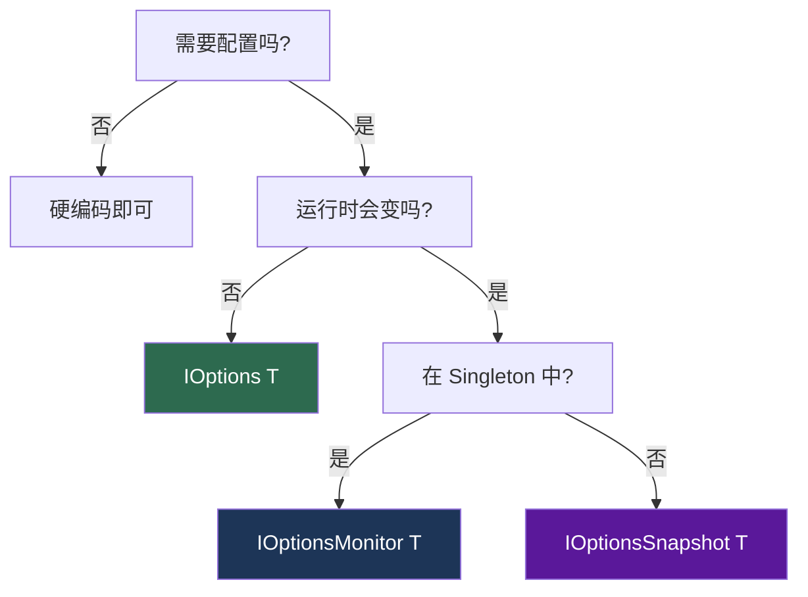

# 选项模式与配置

> 选项模式（Options Pattern）是 ASP.NET Core 中管理配置的推荐方式。它将配置从代码中解耦，支持强类型访问、配置验证和运行时热更新，是编写可配置中间件的基石。

---

## 一、Options 模式

### 1.1 三个接口

ASP.NET Core 提供了三个选项接口，分别对应不同的生命周期和使用场景：

```csharp
// 定义配置类
public class RateLimitOptions
{
    public int MaxRequests { get; set; } = 100;
    public TimeSpan Window { get; set; } = TimeSpan.FromMinutes(1);
    public List<string> ExcludePaths { get; set; } = new();
}
```

| 接口 | 生命周期 | 支持热更新 | 支持命名选项 | 适用场景 |
|------|----------|------------|--------------|----------|
| `IOptions<T>` | Singleton | 否 | 否 | 启动时确定、运行时不变的配置 |
| `IOptionsSnapshot<T>` | Scoped | 是 | 是 | 每次请求读取最新配置 |
| `IOptionsMonitor<T>` | Singleton | 是 | 是 | 需要配置变更通知的场景 |

### 1.2 IOptions\<T\>

```csharp
public class MyMiddleware
{
    private readonly RateLimitOptions _options;

    public MyMiddleware(RequestDelegate next, IOptions<RateLimitOptions> options)
    {
        // IOptions.Value 返回配置的只读快照
        _options = options.Value;
    }
}
```

**特点**：
- 在应用启动时读取配置，之后不会更新
- 即使修改了 `appsettings.json`，也不会感知变更
- 性能最好（无额外开销）
- 适用于：连接字符串、密钥等启动时确定且不变的配置

### 1.3 IOptionsSnapshot\<T\>

```csharp
public class MyMiddleware
{
    private readonly RateLimitOptions _options;

    // IOptionsSnapshot 在每个请求中重新读取配置
    public MyMiddleware(RequestDelegate next, IOptionsSnapshot<RateLimitOptions> options)
    {
        _options = options.Value;
    }
}
```

**特点**：
- 每次 `Get()` / `.Value` 调用都读取最新配置
- 支持命名选项：`options.Get("PolicyA")`
- 注册为 Scoped，每个请求一个实例
- 适用于：限流阈值、功能开关等可能运行时变更的配置

> [!NOTE]
> 约定式中间件是 Singleton，不能在构造函数中注入 Scoped 服务（包括 IOptionsSnapshot）。需要通过 `InvokeAsync` 方法参数注入。

### 1.4 IOptionsMonitor\<T\>

```csharp
public class MyMiddleware
{
    private RateLimitOptions _options;

    public MyMiddleware(RequestDelegate next, IOptionsMonitor<RateLimitOptions> monitor)
    {
        // 获取当前值
        _options = monitor.CurrentValue;

        // 监听配置变更
        monitor.OnChange(newOptions =>
        {
            _options = newOptions;
            // 可以在这里做缓存失效、日志记录等操作
        });
    }
}
```

**特点**：
- 单例生命周期，可在 Singleton 服务中使用
- `CurrentValue` 返回最新配置
- `OnChange()` 注册配置变更回调
- `Get("name")` 获取命名选项
- 适用于：需要在 Singleton 中感知配置变更的场景

### 1.5 三者选择决策



### 1.6 命名选项（Named Options）

当同一类型需要多套配置时，使用命名选项：

```json
{
  "RateLimit": {
    "Default": {
      "MaxRequests": 100,
      "Window": "00:01:00"
    },
    "Strict": {
      "MaxRequests": 10,
      "Window": "00:01:00"
    },
    "Loose": {
      "MaxRequests": 1000,
      "Window": "00:01:00"
    }
  }
}
```

```csharp
// 注册命名选项
builder.Services.Configure<RateLimitOptions>("Default",
    builder.Configuration.GetSection("RateLimit:Default"));
builder.Services.Configure<RateLimitOptions>("Strict",
    builder.Configuration.GetSection("RateLimit:Strict"));
builder.Services.Configure<RateLimitOptions>("Loose",
    builder.Configuration.GetSection("RateLimit:Loose"));

// 使用 IOptionsSnapshot 获取命名选项
public class RateLimitMiddleware
{
    public async Task InvokeAsync(
        HttpContext context,
        IOptionsSnapshot<RateLimitOptions> optionsSnapshot)
    {
        var policy = context.Request.Headers["X-RateLimit-Policy"]
            .FirstOrDefault() ?? "Default";

        var options = optionsSnapshot.Get(policy);
        // 使用 options.MaxRequests, options.Window
    }
}
```

---

## 二、中间件中使用 Options

### 2.1 构造函数注入（约定式中间件）

约定式中间件是 Singleton，构造函数只执行一次：

```csharp
/// <summary>
/// 约定式中间件：构造函数注入 IOptions 或 IOptionsMonitor
/// </summary>
public class RateLimitMiddleware
{
    private readonly RequestDelegate _next;
    private readonly RateLimitOptions _options;
    private readonly ILogger<RateLimitMiddleware> _logger;

    // 构造函数注入 —— 只在应用启动时执行一次
    public RateLimitMiddleware(
        RequestDelegate next,
        IOptions<RateLimitOptions> options,
        ILogger<RateLimitMiddleware> logger)
    {
        _next = next;
        _options = options.Value;
        _logger = logger;
    }

    public async Task InvokeAsync(HttpContext context)
    {
        // _options 在整个生命周期内不变
        if (ShouldLimit(context.Request.Path))
        {
            // 使用 _options.MaxRequests 等
        }

        await _next(context);
    }
}
```

**限制**：不能注入 Scoped 服务（包括 IOptionsSnapshot）。

### 2.2 通过 InvokeAsync 参数注入

如果需要 Scoped 服务（如 IOptionsSnapshot、DbContext），通过 `InvokeAsync` 参数注入：

```csharp
public class RateLimitMiddleware
{
    private readonly RequestDelegate _next;
    private readonly ILogger<RateLimitMiddleware> _logger;

    public RateLimitMiddleware(
        RequestDelegate next,
        ILogger<RateLimitMiddleware> logger)
    {
        _next = next;
        _logger = logger;
    }

    // 通过方法参数注入 Scoped 服务
    public async Task InvokeAsync(
        HttpContext context,
        IOptionsSnapshot<RateLimitOptions> optionsSnapshot)
    {
        // 每次请求获取最新配置
        var options = optionsSnapshot.Value;

        if (ShouldLimit(context.Request.Path, options))
        {
            // ...
        }

        await _next(context);
    }
}
```

**原理**：ASP.NET Core 的 `UseMiddleware<T>` 会为 `InvokeAsync` 的额外参数创建 DI 作用域解析。

### 2.3 通过 UseMiddleware\<T\> 传递选项

`UseMiddleware<T>` 支持传递参数给中间件构造函数：

```csharp
// 注册时传递选项
app.UseMiddleware<RateLimitMiddleware>(new RateLimitOptions
{
    MaxRequests = 200,
    Window = TimeSpan.FromMinutes(5)
});
```

中间件接收：

```csharp
public class RateLimitMiddleware
{
    private readonly RequestDelegate _next;
    private readonly RateLimitOptions _options;

    public RateLimitMiddleware(RequestDelegate next, RateLimitOptions options)
    {
        _next = next;
        _options = options;
    }

    public async Task InvokeAsync(HttpContext context)
    {
        // 使用 _options
        await _next(context);
    }
}
```

### 2.4 两种方式对比

| 维度 | 构造函数注入 | UseMiddleware 传参 |
|------|-------------|-------------------|
| 类型安全 | 编译时检查 | 运行时解析，可能类型不匹配 |
| 配置来源 | DI + 配置系统 | 手动构造 |
| 热更新 | 支持（IOptionsMonitor） | 不支持 |
| 命名选项 | 支持 | 不支持 |
| 验证 | 支持 DataAnnotations | 不支持 |
| 推荐度 | 推荐 | 简单场景可用 |

**推荐**：优先使用 DI + 配置系统注入选项，只在极简场景下用 `UseMiddleware<T>` 传参。

### 2.5 IMiddleware 接口的选项注入

`IMiddleware` 注册为 Scoped，构造函数中可以注入 Scoped 服务：

```csharp
public class RateLimitMiddleware : IMiddleware
{
    private readonly IOptionsSnapshot<RateLimitOptions> _optionsSnapshot;
    private readonly ILogger<RateLimitMiddleware> _logger;

    // IMiddleware 是 Scoped，可以注入 Scoped 服务
    public RateLimitMiddleware(
        IOptionsSnapshot<RateLimitOptions> optionsSnapshot,
        ILogger<RateLimitMiddleware> logger)
    {
        _optionsSnapshot = optionsSnapshot;
        _logger = logger;
    }

    public async Task InvokeAsync(HttpContext context, RequestDelegate next)
    {
        var options = _optionsSnapshot.Value;
        // 使用 options
        await next(context);
    }
}

// 注册为 Scoped
builder.Services.AddScoped<RateLimitMiddleware>();
```

---

## 三、从配置绑定

### 3.1 Configure\<TOptions\>

将 `appsettings.json` 中的配置节绑定到选项类：

```json
{
  "RateLimit": {
    "MaxRequests": 100,
    "Window": "00:01:00",
    "ExcludePaths": [ "/health", "/metrics" ]
  }
}
```

```csharp
// 方式一：从 IConfiguration 绑定
builder.Services.Configure<RateLimitOptions>(
    builder.Configuration.GetSection("RateLimit"));

// 方式二：从配置节名称绑定
builder.Services.Configure<RateLimitOptions>("RateLimit");

// 方式三：命名选项
builder.Services.Configure<RateLimitOptions>("Strict",
    builder.Configuration.GetSection("RateLimit:Strict"));
```

### 3.2 验证选项：ValidateDataAnnotations

使用 DataAnnotations 特性标注选项类的验证规则：

```csharp
public class RateLimitOptions
{
    [Range(1, 10000)]
    public int MaxRequests { get; set; } = 100;

    [Required]
    public TimeSpan Window { get; set; } = TimeSpan.FromMinutes(1);

    [MinLength(0)]
    public List<string> ExcludePaths { get; set; } = new();
}
```

注册时启用验证：

```csharp
builder.Services.AddOptions<RateLimitOptions>()
    .Bind(builder.Configuration.GetSection("RateLimit"))
    .ValidateDataAnnotations();
```

> [!CAUTION]
- `ValidateDataAnnotations` 默认在首次访问时验证（延迟验证）
- 添加 `ValidateOnStart()` 可在启动时立即验证，防止运行时才发现配置错误

```csharp
builder.Services.AddOptions<RateLimitOptions>()
    .Bind(builder.Configuration.GetSection("RateLimit"))
    .ValidateDataAnnotations()
    .ValidateOnStart(); // 启动时验证
```

### 3.3 自定义验证：IValidateOptions

当 DataAnnotations 无法满足复杂验证逻辑时，实现 `IValidateOptions<T>`：

```csharp
/// <summary>
/// RateLimitOptions 自定义验证器
/// </summary>
public class RateLimitOptionsValidator : IValidateOptions<RateLimitOptions>
{
    public ValidateOptionsResult Validate(string? name, RateLimitOptions options)
    {
        var errors = new List<string>();

        if (options.MaxRequests <= 0)
        {
            errors.Add("MaxRequests 必须大于 0");
        }

        if (options.Window <= TimeSpan.Zero)
        {
            errors.Add("Window 必须大于零");
        }

        if (options.Window > TimeSpan.FromHours(1))
        {
            errors.Add("Window 不能超过 1 小时");
        }

        // 检查排除路径格式
        foreach (var path in options.ExcludePaths)
        {
            if (!path.StartsWith('/'))
            {
                errors.Add($"排除路径必须以 / 开头: {path}");
            }
        }

        return errors.Count > 0
            ? ValidateOptionsResult.Fail(errors)
            : ValidateOptionsResult.Success;
    }
}
```

注册验证器：

```csharp
builder.Services.AddSingleton<IValidateOptions<RateLimitOptions>,
    RateLimitOptionsValidator>();

builder.Services.AddOptions<RateLimitOptions>()
    .Bind(builder.Configuration.GetSection("RateLimit"))
    .ValidateOnStart();
```

### 3.4 后期配置：PostConfigure

`PostConfigure` 在所有 `Configure` 之后执行，适合设置默认值或覆盖配置：

```csharp
// 先绑定配置
builder.Services.Configure<RateLimitOptions>(
    builder.Configuration.GetSection("RateLimit"));

// 后期配置：确保 Window 不小于最小值
builder.Services.PostConfigure<RateLimitOptions>(options =>
{
    if (options.Window < TimeSpan.FromSeconds(10))
    {
        options.Window = TimeSpan.FromSeconds(10);
    }
});

// 执行顺序：
// 1. Configure 按注册顺序执行
// 2. PostConfigure 按注册顺序执行
// 3. 验证
```

**典型用法**：

```csharp
// 设置计算属性
builder.Services.PostConfigure<JwtOptions>(options =>
{
    if (string.IsNullOrEmpty(options.Issuer))
    {
        options.Issuer = "MyApp"; // 默认值
    }
});

// 环境特定覆盖
builder.Services.PostConfigure<DatabaseOptions>(options =>
{
    if (builder.Environment.IsDevelopment())
    {
        options.CommandTimeout = 300; // 开发环境增加超时
    }
});
```

---

## 四、中间件配置最佳实践

### 4.1 Options 类设计规范

```csharp
/// <summary>
/// 中间件配置选项 —— 推荐的设计模式
/// </summary>
public class RateLimitOptions
{
    // 1. 所有属性都应有合理的默认值
    //    这样即使没有配置，中间件也能正常工作
    public int MaxRequests { get; set; } = 100;

    // 2. 使用 TimeSpan 而非 int 表示时间间隔
    //    配置文件中使用 "00:01:00" 格式，可读性好
    public TimeSpan Window { get; set; } = TimeSpan.FromMinutes(1);

    // 3. 集合类型使用不可变默认值
    //    不要设为 null，使用空集合
    public List<string> ExcludePaths { get; set; } = new();

    // 4. 布尔属性默认值应为最安全的选项
    //    例如：默认启用安全检查
    public bool EnableIpWhitelist { get; set; } = false;

    // 5. 敏感配置（密钥等）不要放在选项类中
    //    应使用 Secret Manager 或 Key Vault
}
```

**设计原则**：

1. **合理默认值** —— 没有配置也能正常运行
2. **不可空引用** —— 避免 null 检查的麻烦
3. **语义化类型** —— 用 `TimeSpan` 不用 `int`（秒），用 `enum` 不用 `string`
4. **敏感信息分离** —— 密钥走安全存储，不走 appsettings.json

### 4.2 默认值设置策略

```csharp
// 方式一：属性初始化器（最常用）
public class RateLimitOptions
{
    public int MaxRequests { get; set; } = 100;
}

// 方式二：构造函数初始化（需要复杂逻辑时）
public class RateLimitOptions
{
    public int MaxRequests { get; set; }

    public RateLimitOptions()
    {
        MaxRequests = 100;
        // 可以调用方法计算默认值
    }
}

// 方式三：PostConfigure 设置条件默认值
builder.Services.PostConfigure<RateLimitOptions>(options =>
{
    // 仅在未配置时设置默认值
    if (options.ExcludePaths.Count == 0)
    {
        options.ExcludePaths = new List<string> { "/health", "/metrics" };
    }
});
```

### 4.3 配置验证清单

```csharp
/// <summary>
/// 配置验证的最佳实践
/// </summary>
public static class OptionsValidationBestPractices
{
    /// <summary>
    /// 完整的选项注册流程
    /// </summary>
    public static IServiceCollection AddRateLimitOptions(
        this IServiceCollection services,
        IConfiguration configuration)
    {
        // 1. 绑定配置
        services.AddOptions<RateLimitOptions>()
            .Bind(configuration.GetSection("RateLimit"))

            // 2. DataAnnotations 验证（简单规则）
            .ValidateDataAnnotations()

            // 3. 自定义验证（复杂规则）
            .Validate(options =>
            {
                if (options.MaxRequests > 0 && options.Window > TimeSpan.Zero)
                    return true;

                return false;
            }, "MaxRequests 和 Window 必须为正数")

            // 4. 启动时验证（而非延迟到首次访问）
            .ValidateOnStart();

        // 5. 注册自定义验证器（最复杂的验证逻辑）
        services.AddSingleton<IValidateOptions<RateLimitOptions>,
            RateLimitOptionsValidator>();

        // 6. 后期配置（调整/覆盖）
        services.PostConfigure<RateLimitOptions>(options =>
        {
            if (options.Window < TimeSpan.FromSeconds(10))
            {
                options.Window = TimeSpan.FromSeconds(10);
            }
        });

        return services;
    }
}
```

### 4.4 运行时配置变更处理

当配置在运行时变更时，中间件需要正确响应：

#### 方案一：每次请求读取（IOptionsSnapshot）

```csharp
public class RateLimitMiddleware
{
    private readonly RequestDelegate _next;

    public RateLimitMiddleware(RequestDelegate next)
    {
        _next = next;
    }

    public async Task InvokeAsync(
        HttpContext context,
        IOptionsSnapshot<RateLimitOptions> optionsSnapshot)
    {
        // 每次请求读取最新配置
        var options = optionsSnapshot.Value;
        // 使用 options ...
        await _next(context);
    }
}
```

**优点**：简单直接
**缺点**：每次请求都有绑定开销（通常可忽略）

#### 方案二：缓存 + 变更通知（IOptionsMonitor）

```csharp
public class RateLimitMiddleware
{
    private readonly RequestDelegate _next;
    private volatile RateLimitOptions _options; // volatile 确保线程可见性

    public RateLimitMiddleware(
        RequestDelegate next,
        IOptionsMonitor<RateLimitOptions> monitor)
    {
        _next = next;
        _options = monitor.CurrentValue;

        // 监听变更，更新缓存
        monitor.OnChange(newOptions =>
        {
            _options = newOptions;
        });
    }

    public async Task InvokeAsync(HttpContext context)
    {
        // 直接使用缓存的配置，无需每次读取
        var options = _options;
        // 使用 options ...
        await _next(context);
    }
}
```

**优点**：性能好（不重复绑定）
**缺点**：需要手动管理缓存和线程安全

#### 方案三：预编译策略（复杂场景）

```csharp
/// <summary>
/// 当配置变更时，重建限流策略（如令牌桶参数）
/// </summary>
public class RateLimitMiddleware
{
    private readonly RequestDelegate _next;
    private readonly IOptionsMonitor<RateLimitOptions> _monitor;
    private volatile RateLimitPolicy _policy;

    public RateLimitMiddleware(
        RequestDelegate next,
        IOptionsMonitor<RateLimitOptions> monitor)
    {
        _next = next;
        _monitor = monitor;
        _policy = BuildPolicy(monitor.CurrentValue);

        _monitor.OnChange(newOptions =>
        {
            // 配置变更时重建策略
            _policy = BuildPolicy(newOptions);
        });
    }

    public async Task InvokeAsync(HttpContext context)
    {
        var policy = _policy; // 使用当前策略
        // 使用 policy ...
        await _next(context);
    }

    private static RateLimitPolicy BuildPolicy(RateLimitOptions options)
    {
        // 将配置编译为高效的运行时策略
        return new RateLimitPolicy
        {
            MaxTokens = options.MaxRequests,
            RefillInterval = options.Window,
            ExcludePaths = new HashSet<string>(
                options.ExcludePaths, StringComparer.OrdinalIgnoreCase)
        };
    }
}

public class RateLimitPolicy
{
    public int MaxTokens { get; init; }
    public TimeSpan RefillInterval { get; init; }
    public HashSet<string> ExcludePaths { get; init; } = new();
}
```

**优点**：配置变更时只重建一次策略，请求时无额外开销
**适用**：配置需要预编译（如正则、令牌桶参数、路由匹配树）的场景

### 4.5 完整的中间件选项注册示例

```csharp
// ============ 选项类 ============
public class AuditLogOptions
{
    [Range(1, int.MaxValue)]
    public int MaxRequestBodyLength { get; set; } = 32 * 1024;

    [Range(1, int.MaxValue)]
    public int MaxResponseBodyLength { get; set; } = 32 * 1024;

    public List<string> ExcludePaths { get; set; } = new() { "/health" };
    public List<string> SensitiveFields { get; set; } = new() { "password" };
    public string SensitiveMask { get; set; } = "***";
    public bool LogRequestBody { get; set; } = true;
    public bool LogResponseBody { get; set; } = true;
}

// ============ 验证器 ============
public class AuditLogOptionsValidator : IValidateOptions<AuditLogOptions>
{
    public ValidateOptionsResult Validate(string? name, AuditLogOptions options)
    {
        if (string.IsNullOrWhiteSpace(options.SensitiveMask))
            return ValidateOptionsResult.Fail("SensitiveMask 不能为空");

        if (options.SensitiveFields.Any(f => string.IsNullOrWhiteSpace(f)))
            return ValidateOptionsResult.Fail("SensitiveFields 不能包含空值");

        return ValidateOptionsResult.Success;
    }
}

// ============ 注册扩展方法 ============
public static class AuditLogExtensions
{
    public static IServiceCollection AddAuditLog(
        this IServiceCollection services,
        IConfiguration configuration)
    {
        services.AddOptions<AuditLogOptions>()
            .Bind(configuration.GetSection("AuditLog"))
            .ValidateDataAnnotations()
            .ValidateOnStart();

        services.AddSingleton<IValidateOptions<AuditLogOptions>,
            AuditLogOptionsValidator>();

        services.AddSingleton<IAuditLogWriter, AsyncAuditLogWriter>();

        return services;
    }

    public static IApplicationBuilder UseAuditLog(
        this IApplicationBuilder app)
    {
        return app.UseMiddleware<AuditLogMiddleware>();
    }
}

// ============ Program.cs ============
builder.Services.AddAuditLog(builder.Configuration);

var app = builder.Build();
app.UseAuditLog();
```

---

## 总结

| 要点 | 说明 |
|------|------|
| IOptions | 启动时快照，不变配置的首选 |
| IOptionsSnapshot | 每次请求读取最新值，通过 InvokeAsync 参数注入 |
| IOptionsMonitor | Singleton 中感知配置变更，支持 OnChange 回调 |
| 命名选项 | 同一类型多套配置，IOptionsSnapshot.Get("name") |
| ValidateOnStart | 启动时验证配置，防止运行时才发现错误 |
| PostConfigure | 在绑定之后调整配置，设置条件默认值 |
| 合理默认值 | 选项类所有属性都应有默认值 |
| 敏感信息分离 | 密钥走安全存储，不走 appsettings.json |
| 策略缓存 | 复杂配置变更时重建策略，请求时零开销 |
