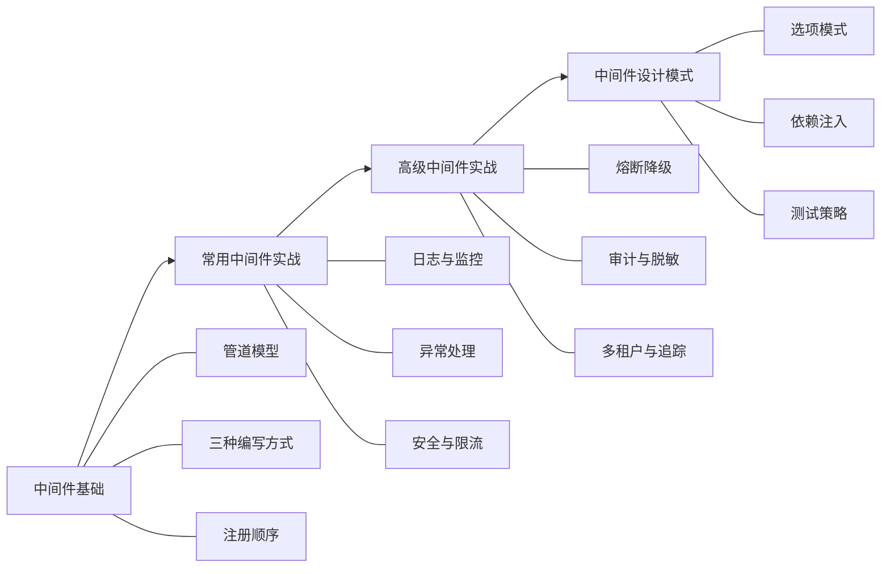

# 中间件开发

中间件是 ASP.NET Core 请求处理管道的核心构建块。每一个 HTTP 请求都会经过一条由多个中间件组成的管道，每个中间件既可以在请求到达后端之前进行预处理，也可以在响应返回之前进行后处理。掌握中间件的原理与实战，是构建健壮、可维护 ASP.NET Core 应用的必备技能。

## 学习路径

## 章节导航

| 章节 | 说明 | 难度 |
|------|------|------|
| [01 · 中间件基础](./01_中间件基础/) | 管道模型原理、编写方式、注册顺序与最佳实践 | 入门 |
| [02 · 常用中间件实战](./02_常用中间件实战/) | 日志监控、异常处理、安全过滤、限流、缓存等生产级实现 | 进阶 |
| [03 · 高级中间件实战](./03_高级中间件实战/) | 熔断降级、审计日志、数据脱敏、多租户、分布式追踪、功能开关 | 高级 |
| [04 · 中间件设计模式](./04_中间件设计模式/) | 选项模式、依赖注入、单元测试与集成测试 | 精通 |
