# CLR 执行模型与核心组件

::: important 核心问题
当你写下一行 `Console.WriteLine("Hello");` 并按下 F5，从源代码到屏幕输出，中间究竟发生了什么？CLR（Common Language Runtime）作为 .NET 的执行引擎，是如何将你的 C# 代码一步步转化为机器指令并执行的？
:::

## 一、CLR 是什么

CLR（公共语言运行时）是 .NET 的核心执行引擎，它提供了一个统一的运行时环境，使得使用不同编程语言编写的代码能够在同一平台上无缝协作。根据 ECMA-335 标准的定义，CLR 实现了 CLI（Common Language Infrastructure）规范，负责以下核心职责：

- **代码执行**：将 IL（Intermediate Language）编译为本地机器码
- **内存管理**：自动分配和回收托管堆内存
- **类型安全**：确保所有操作都是类型安全的
- **异常处理**：提供结构化的异常处理机制
- **线程管理**：管理线程池和同步机制
- **安全机制**：代码访问安全（CAS）和验证

::: tip CLR 与 JVM 的类比
如果你熟悉 Java，可以将 CLR 理解为 .NET 世界中的 JVM。但 CLR 在设计上有一个关键差异：CLR 支持多种语言的原生协作（C#、F#、VB.NET 等），而不仅仅是某一门语言。这得益于 CTS（Common Type System）和 CLS（Common Language Specification）的标准化。
:::

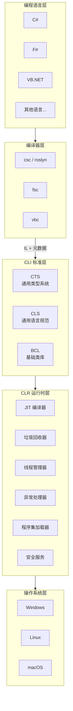

## 二、托管模块结构

当你使用 C# 编译器（csc.exe 或 Roslyn）编译源代码时，产生的不是一个普通的二进制文件，而是一个 **托管模块（Managed Module）**。托管模块是 CLR 可识别和执行的标准 PE/COFF 文件，包含多个关键部分。

### 2.1 PE32/PE32+ 头

PE（Portable Executable）头是 Windows 操作系统要求的标准化头部，包含：

| 字段 | 说明 |
|------|------|
| Magic | `0x10B`（PE32）或 `0x20B`（PE32+） |
| Machine | 目标 CPU 架构（0x14C=x86, 0x8664=x64, 0xAA64=ARM64） |
| NumberOfSections | 节数量 |
| TimeDateStamp | 编译时间戳 |
| SizeOfOptionalHeader | 可选头大小 |
| Subsystem | 控制台(3) / Windows GUI(2) |

::: info PE32 vs PE32+
PE32 格式支持 32 位地址空间，PE32+ 支持 64 位地址空间。在 .NET 中，`AnyCPU` 编译选项会生成 PE32 头但带有 `CLR Flags` 中的 `32BITREQ` 位来控制加载行为。.NET Core 以后默认生成 PE32+（64位优先）。
:::

### 2.2 CLR 头

CLR 头是托管模块独有的，标志着这是一个 .NET 程序集。其结构定义在 ECMA-335 §25.3.3 中：

```
偏移  大小   字段名                   说明
0x00  4     cb                       头大小（72字节）
0x04  2     MajorRuntimeVersion      主运行时版本
0x06  2     MinorRuntimeVersion      次运行时版本
0x08  8     MetaData                 元数据 RVA 和大小
0x10  4     Flags                    标志位
0x14  4     EntryPointToken          入口点 Token
0x18  8     Resources                资源 RVA 和大小
0x20  8     StrongNameSignature      强名称签名 RVA 和大小
0x28  8     CodeManagerTable         代码管理器表（保留）
0x30  8     VTableFixups             VTable 修复 RVA 和大小
0x38  8     ExportAddressTableJumps  导出地址表跳转
0x40  8     ManagedNativeHeader      托管本地头（NGen 专用）
```

CLR 头中的 `Flags` 字段重要位：

| 位 | 名称 | 说明 |
|----|------|------|
| 0 | COMIMAGE_FLAGS_ILONLY | 仅包含 IL 代码，无本地代码 |
| 1 | COMIMAGE_FLAGS_32BITREQUIRED | 必须在 32 位进程中加载 |
| 2 | COMIMAGE_FLAGS_STRONGNAMESIGNED | 包含强名称签名 |
| 3 | COMIMAGE_FLAGS_NATIVE_ENTRYPOINT | 入口点是本地代码 |
| 4 | COMIMAGE_FLAGS_TRACKDEBUGDATA | 跟踪调试数据 |
| 5 | COMIMAGE_FLAGS_32BITPREFERRED | 偏好 32 位加载 |

### 2.3 元数据

元数据是托管模块最核心的部分之一，它是一组数据表，完整描述了模块中定义和引用的所有类型、成员、属性等信息。元数据表包括：

**定义表（Def 表）**：

| 表编号 | 表名 | 说明 |
|--------|------|------|
| 0x00 | ModuleDef | 当前模块定义 |
| 0x01 | TypeRef | 引用的外部类型 |
| 0x02 | TypeDef | 定义的类型 |
| 0x04 | FieldDef | 定义的字段 |
| 0x06 | MethodDef | 定义的方法 |
| 0x08 | ParamDef | 方法的参数 |
| 0x09 | InterfaceImpl | 接口实现 |
| 0x0A | MemberRef | 引用的外部成员 |
| 0x0B | Constant | 常量值 |
| 0x0C | CustomAttribute | 自定义属性 |
| 0x0E | DeclSecurity | 声明式安全 |
| 0x0F | ClassLayout | 类布局 |
| 0x10 | FieldLayout | 字段布局 |
| 0x11 | StandAloneSig | 独立签名 |
| 0x12 | EventMap | 事件映射 |
| 0x14 | EventDef | 事件定义 |
| 0x15 | PropertyMap | 属性映射 |
| 0x17 | PropertyDef | 属性定义 |
| 0x18 | MethodSemantics | 方法语义 |
| 0x19 | MethodImpl | 方法实现 |
| 0x1A | ModuleRef | 模块引用 |
| 0x1B | TypeSpec | 类型规范 |
| 0x1C | ImplMap | 实现映射（P/Invoke） |
| 0x1D | FieldRVA | 字段 RVA |
| 0x20 | AssemblyDef | 程序集定义 |
| 0x23 | AssemblyRef | 程序集引用 |
| 0x26 | FileDef | 文件定义 |
| 0x27 | ExportedType | 导出类型 |
| 0x28 | ManifestResource | 清单资源 |
| 0x29 | NestedClass | 嵌套类 |
| 0x2A | GenericParam | 泛型参数 |
| 0x2B | MethodSpec | 方法规范 |
| 0x2C | GenericParamConstraint | 泛型参数约束 |

::: tip 元数据的 Token
元数据中的每一行由一个 **Token** 唯一标识。Token 是一个 4 字节值：高 1 字节是表编号，低 3 字节是行号（从 1 开始）。例如 `0x06000003` 表示 MethodDef 表的第 3 行。编译器和运行时通过 Token 来精确定位元数据中的任何条目。
:::

### 2.4 IL 代码

IL（Intermediate Language，中间语言）是与 CPU 无关的指令集。每条 IL 指令通常是 1 或 2 字节操作码后跟可选的操作数。

一个简单的 C# 方法及其对应的 IL：

```csharp
// C# 源代码
public int Add(int a, int b)
{
    return a + b;
}
```

```il
// IL 代码
.method public hidebysig instance int32 Add(int32 a, int32 b) cil managed
{
    // 代码大小: 9 (0x9)
    .maxstack 2
    .locals init (int32 V_0)
    IL_0000: nop
    IL_0001: ldarg.1       // 加载参数 a
    IL_0002: ldarg.2       // 加载参数 b
    IL_0003: add            // 执行加法
    IL_0004: stloc.0        // 存储到局部变量 V_0
    IL_0005: br.s IL_0007
    IL_0007: ldloc.0        // 加载局部变量 V_0
    IL_0008: ret            // 返回
}
```

### 2.5 托管模块整体结构图

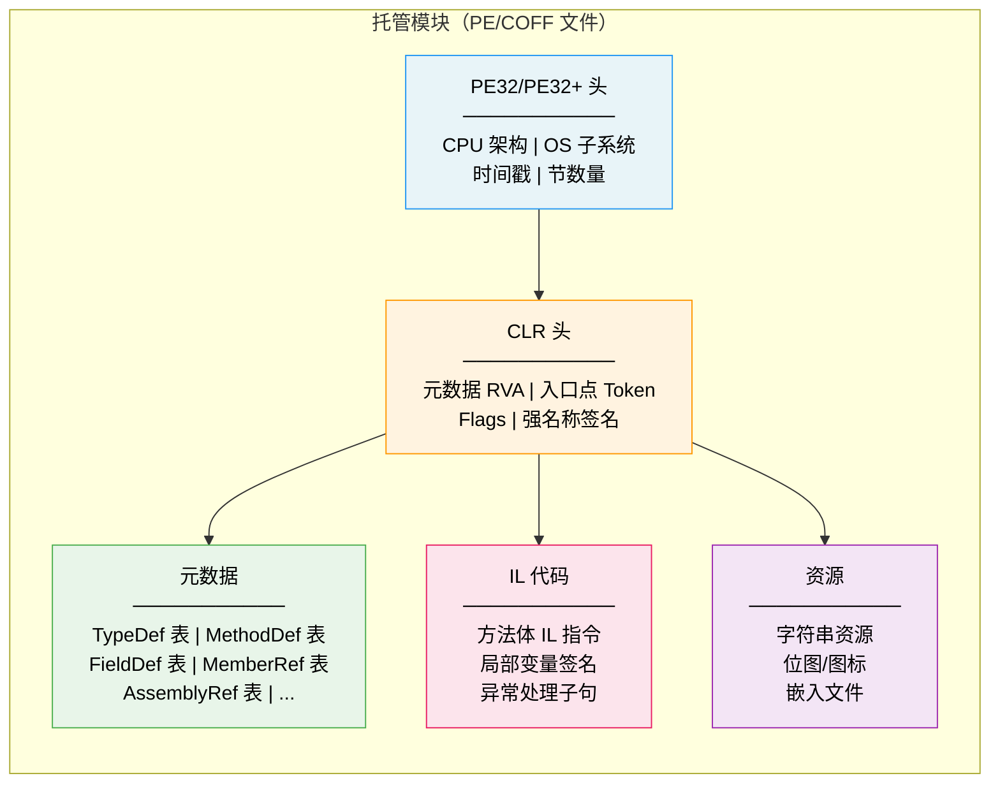

## 三、CLR 启动流程

当你执行一个 .NET 应用程序时，操作系统首先加载 CLR 本身，然后由 CLR 接管程序的执行。这个过程涉及多个阶段的精密协作。

### 3.1 CoreCLR 初始化序列

在 .NET Core / .NET 5+ 中，CLR 的启动流程与 .NET Framework 有显著差异。CoreCLR（coreclr.dll / libcoreclr.so）是一个独立的运行时库，由宿主（host）加载和初始化。

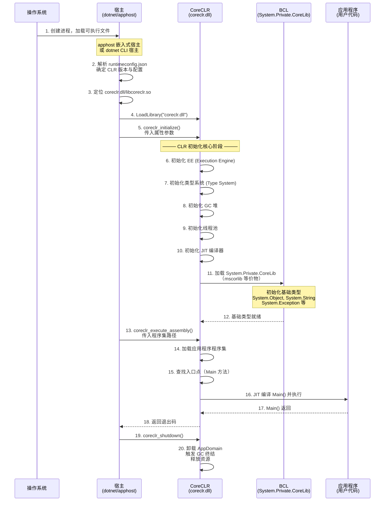

### 3.2 启动阶段详解

**阶段一：宿主加载**

.NET 应用有两种主要的宿主模型：

```csharp
// 1. 框架依赖应用（framework-dependent）
// dotnet MyApp.dll → dotnet CLI 作为宿主

// 2. 自包含应用（self-contained）
// MyApp.exe → 内嵌 apphost 作为宿主
// apphost 在编译时绑定 coreclr 路径
```

::: important apphost 的工作原理
自包含发布时，.NET SDK 将一个修改过的 apphost 二进制文件作为你的可执行文件。这个 apphost 内嵌了：
- 应用程序 DLL 的路径
- CLR 版本要求
- 运行时配置
apphost 启动后在自身目录或指定路径搜索 coreclr，然后动态加载。
:::

**阶段二：CLR 初始化**

`coreclr_initialize` 函数是 CLR 启动的核心入口，它接收一组键值对属性：

```csharp
// CoreCLR 初始化属性示例（来自 dotnet/runtime 源码）
var properties = new Dictionary<string, string>
{
    ["TRUSTED_PLATFORM_ASSEMBLIES"] = "/usr/share/dotnet/shared/Microsoft.NETCore.App/8.0.0/System.Private.CoreLib.dll:/usr/share/dotnet/shared/Microsoft.NETCore.App/8.0.0/System.Runtime.dll:...",
    ["APP_PATHS"] = "/home/user/myapp/",
    ["APP_NI_PATHS"] = "/home/user/myapp/",
    ["NATIVE_DLL_SEARCH_DIRECTORIES"] = "/usr/share/dotnet/shared/Microsoft.NETCore.App/8.0.0/",
    ["PLATFORM_RESOURCE_ROOTS"] = "/home/user/myapp/",
    ["AppDomainCompatSwitch"] = "UseLatestBehaviorWhenTFMNotSpecified"
};
```

**阶段三：基础类型初始化**

CLR 初始化时，必须首先创建最基础的类型，因为所有其他类型都依赖于它们。初始化顺序严格如下：

1. `System.Object` — 一切类型的根基
2. `System.String` — 字符串是 .NET 中使用最频繁的类型
3. `System.Exception` — 异常处理的基础
4. `System.ValueType` — 值类型的根基
5. `System.Enum` — 枚举类型的根基
6. `System.Array` — 数组类型
7. `System.Type` — 类型信息表示
8. 其他基础类型...

::: warning 不可忽略的依赖
`System.Object` 必须是第一个初始化的类型，因为 `MethodTable` 的构建需要继承自 `System.Object` 的 MethodTable。如果这个顺序被打乱，CLR 将无法正确构建类型系统。
:::

### 3.3 通过 C# 代码验证 CLR 启动

你可以通过 `System.Environment` 和 `System.Runtime` 命名空间来观察 CLR 的启动状态：

```csharp
using System;
using System.Runtime.InteropServices;

public class ClrStartupInfo
{
    public static void Main()
    {
        // CLR 版本信息
        Console.WriteLine($"CLR 版本: {Environment.Version}");
        Console.WriteLine($"Framework 描述: {RuntimeInformation.FrameworkDescription}");
        Console.WriteLine($"进程架构: {RuntimeInformation.ProcessArchitecture}");
        Console.WriteLine($"OS 架构: {RuntimeInformation.OSArchitecture}");
        Console.WriteLine($"OS 描述: {RuntimeInformation.OSDescription}");

        // 运行时配置
        Console.WriteLine($"64位进程: {Environment.Is64BitProcess}");
        Console.WriteLine($"64位操作系统: {Environment.Is64BitOperatingSystem}");
        Console.WriteLine($"处理器数: {Environment.ProcessorCount}");
        Console.WriteLine($"Tick 计数: {Environment.TickCount64}");
    }
}
```

## 四、JIT 编译原理

JIT（Just-In-Time）编译器是 CLR 最核心的组件之一，它负责在运行时将 IL 代码编译为当前 CPU 架构的本地机器码。JIT 编译是 .NET 性能和灵活性的关键平衡点。

### 4.1 JIT 编译触发机制

JIT 编译采用 **按需编译** 策略：只有当一个方法第一次被调用时，才会触发 JIT 编译。这意味着：

1. 从未被调用的方法永远不会被编译
2. 方法只在首次调用时承受编译开销
3. 后续调用直接执行缓存的本地代码

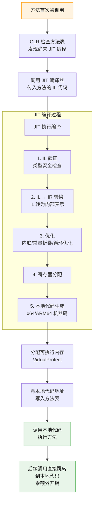

### 4.2 JIT 编译的详细流程

让我们用一个具体的例子来追踪 JIT 编译的每一个步骤：

```csharp
// C# 源代码
public class Calculator
{
    public int Multiply(int x, int y)
    {
        int result = x * y;
        return result;
    }
}

// 调用方
var calc = new Calculator();
int value = calc.Multiply(3, 4);  // 首次调用，触发 JIT
```

```il
// Multiply 方法的 IL 代码
.method public hidebysig instance int32 Multiply(int32 x, int32 y) cil managed
{
    // 代码大小: 9 (0x9)
    .maxstack 2
    .locals init (int32 V_0)
    IL_0000: ldarg.1       // 加载 this 后的第1个参数 x
    IL_0001: ldarg.2       // 加载 this 后的第2个参数 y
    IL_0002: mul           // 乘法
    IL_0003: stloc.0       // result = x * y
    IL_0004: br.s IL_0006
    IL_0006: ldloc.0       // 加载 result
    IL_0007: ret           // 返回 result
}
```

编译后的 x64 汇编代码（Release 模式优化后）：

```asm
; Multiply 方法的 x64 本地代码（JIT 优化后）
; rcx = this, edx = x, r8d = y
mov eax, edx           ; 将 x 移入 eax
imul eax, r8d          ; eax = x * y
ret                     ; 返回 eax（结果）
```

::: tip JIT 优化的威力
注意 JIT 编译后的汇编代码极为精简：它完全消除了局部变量 `result`，直接将乘法结果留在返回寄存器 `eax` 中。这就是 JIT 优化的实际效果 —— 从 9 字节的 IL 代码到仅 7 字节的高效机器码。
:::

### 4.3 方法调用桩（Stub）机制

在方法尚未被 JIT 编译时，方法表中的入口点指向一个 **预 JIT 桩（PreJitStub）**。这个桩的作用是拦截首次调用，触发 JIT 编译，然后将方法表中的入口点替换为编译后的本地代码地址。

```csharp
// 通过调试器观察 JIT 桩的变化
public class JitStubDemo
{
    public static void Main()
    {
        // 方法调用前的状态：
        // MethodTable[Multiply] → PreJitStub (fixup code)

        var calc = new Calculator();

        // 第一次调用：触发 JIT
        calc.Multiply(3, 4);

        // 方法调用后的状态：
        // MethodTable[Multiply] → 0x7FFE12345678 (本地代码地址)

        // 第二次调用：直接跳转到本地代码，无需再次 JIT
        calc.Multiply(5, 6);
    }
}
```

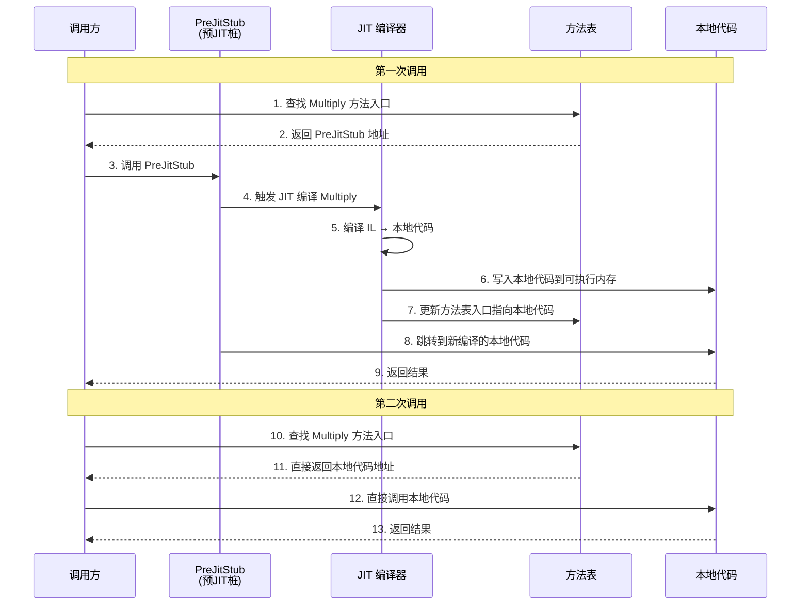

### 4.4 JIT 编译优化

RyuJIT（.NET 的 JIT 编译器，从 .NET Core 1.0 开始使用）支持多种优化：

**方法内联（Method Inlining）**：

```csharp
// 原始代码
public class MathHelper
{
    public int Square(int x) => x * x;

    public int Compute(int a, int b)
    {
        return Square(a) + Square(b);
    }
}

// JIT 内联后 Compute 方法的等效代码：
public int Compute_Inlined(int a, int b)
{
    return a * a + b * b;  // Square 被内联
}
```

```il
// Compute 的 IL（内联前）
.method public hidebysig instance int32 Compute(int32 a, int32 b) cil managed
{
    .maxstack 3
    .locals init (int32 V_0)
    IL_0000: ldarg.0
    IL_0001: ldarg.1
    IL_0002: call instance int32 MathHelper::Square(int32)
    IL_0007: ldarg.0
    IL_0008: ldarg.2
    IL_0009: call instance int32 MathHelper::Square(int32)
    IL_000e: add
    IL_000f: stloc.0
    IL_0010: br.s IL_0012
    IL_0012: ldloc.0
    IL_0013: ret
}
```

```asm
; Compute 的 x64 汇编（JIT 内联后）
; rcx = this, edx = a, r8d = b
mov eax, edx           ; eax = a
imul eax, edx          ; eax = a * a
mov ecx, r8d           ; ecx = b
imul ecx, r8d          ; ecx = b * b
add eax, ecx           ; eax = a*a + b*b
ret
```

**内联决策因素**：JIT 会基于以下因素决定是否内联一个方法：

| 因素 | 倾向内联 | 倾向不内联 |
|------|---------|-----------|
| 方法体大小 | ≤ 32 字节 IL | > 32 字节 IL |
| 调用频率 | 热点方法 | 冷方法 |
| 虚方法 | 非虚方法 | 虚方法（无法内联） |
| 循环 | 无循环 | 包含循环 |
| 异常处理 | 无 try/catch | 包含异常处理 |
| 方法属性 | AggressiveInlining | NoInlining |
| 结构体参数 | 无 struct 参数 | 包含 struct 参数（大小\>16字节） |

**常量折叠（Constant Folding）**：

```csharp
// 原始代码
public int Compute()
{
    const int a = 10;
    const int b = 20;
    return a + b;  // JIT 直接折叠为 30
}

// JIT 编译后的等效汇编
; mov eax, 30
; ret
```

**范围检查消除（Range Check Elimination）**：

```csharp
public int Sum(int[] arr)
{
    int sum = 0;
    for (int i = 0; i < arr.Length; i++)  // JIT 消除边界检查
    {
        sum += arr[i];
    }
    return sum;
}

// JIT 识别出循环变量 i 始终在 [0, arr.Length) 范围内
// 因此可以安全地消除 arr[i] 的边界检查
```

### 4.5 Tiered Compilation（分层编译）

.NET Core 2.1 引入了分层编译，解决 JIT 冷启动问题：

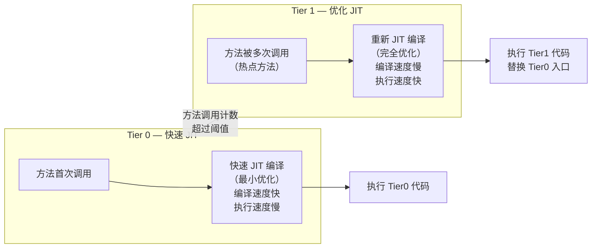

```csharp
// 可以通过配置控制分层编译
// 在 runtimeconfig.json 中:
// {
//   "configProperties": {
//     "System.Runtime.TieredCompilation": true,
//     "System.Runtime.TieredCompilation.QuickJitForLoops": true
//   }
// }

// 或在代码中通过环境变量:
// COMPlus_TieredCompilation=1
// COMPlus_TieredCompilation_QuietJit=1
```

::: important 分层编译的意义
分层编译是 .NET 性能策略的关键创新。它让应用程序在启动时快速响应（使用 Tier0），同时在运行过程中逐步优化热点代码（提升到 Tier1），兼顾了启动速度和峰值性能。
:::

## 五、程序集加载与绑定

程序集（Assembly）是 .NET 中部署、版本控制和重用的基本单元。一个程序集由一个或多个托管模块和资源文件组成，通过清单（Manifest）进行统一管理。

### 5.1 程序集加载流程

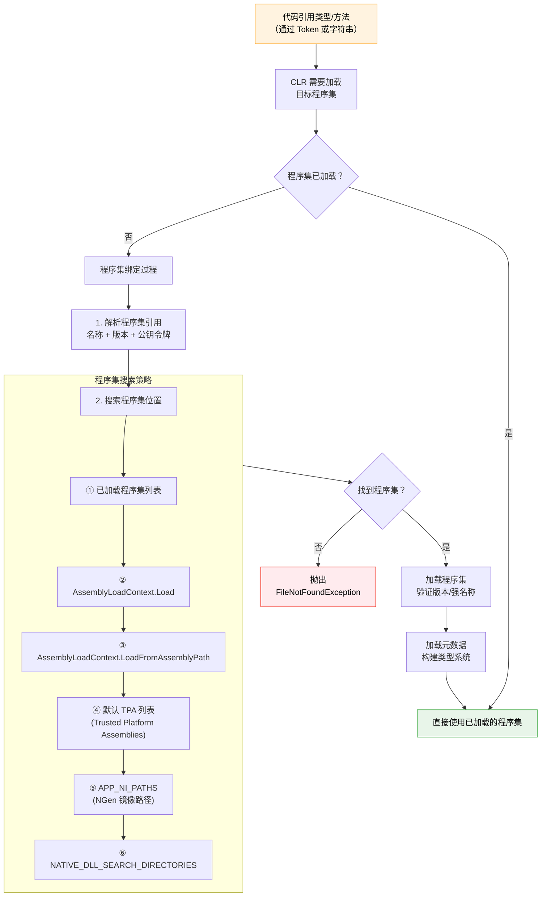

### 5.2 AssemblyLoadContext

在 .NET Core / .NET 5+ 中，`AssemblyLoadContext`（ALC）取代了传统 AppDomain 的程序集加载功能。ALC 提供了一个隔离的程序集加载上下文：

```csharp
using System;
using System.Reflection;
using System.Runtime.Loader;

public class AssemblyLoadingDemo
{
    public static void Main()
    {
        // 1. 默认上下文（Default ALC）
        var defaultAlc = AssemblyLoadContext.Default;
        Console.WriteLine($"默认 ALC: {defaultAlc.Name}");

        // 2. 创建自定义 ALC（用于插件隔离）
        var pluginAlc = new AssemblyLoadContext("PluginContext",
            isCollectible: true);  // 可卸载

        // 3. 加载程序集到自定义 ALC
        var assembly = pluginAlc.LoadFromAssemblyPath("/plugins/MyPlugin.dll");
        Console.WriteLine($"加载的程序集: {assembly.FullName}");

        // 4. 使用反射调用插件方法
        var type = assembly.GetType("MyPlugin.Plugin");
        var method = type.GetMethod("Execute");
        var instance = Activator.CreateInstance(type);
        method?.Invoke(instance, null);

        // 5. 卸载整个 ALC（包括其加载的所有程序集）
        pluginAlc.Unload();
        Console.WriteLine("插件上下文已卸载");

        // 6. GC 回收卸载的程序集
        for (int i = 0; i < 10; i++)
        {
            GC.Collect();
            GC.WaitForPendingFinalizers();
        }
    }
}
```

::: warning 可卸载 ALC 的注意事项
`isCollectible: true` 创建的 ALC 才能被卸载。但可卸载 ALC 中的程序集不能被默认 ALC 中的代码直接引用。如果存在跨 ALC 的引用，即使调用 `Unload()`，程序集也无法被回收。
:::

### 5.3 AssemblyLoadContext 的加载策略

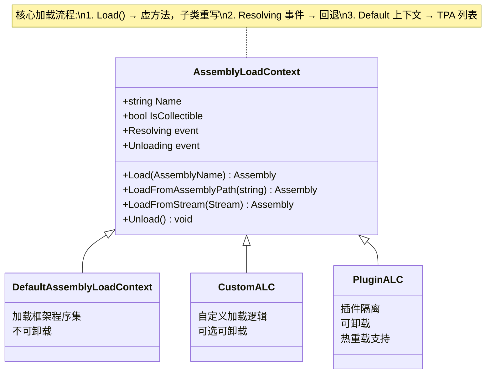

自定义 ALC 可以重写 `Load` 方法来实现自定义的程序集加载策略：

```csharp
public class PluginLoadContext : AssemblyLoadContext
{
    private readonly AssemblyDependencyResolver _resolver;

    public PluginLoadContext(string pluginPath) : base(isCollectible: true)
    {
        _resolver = new AssemblyDependencyResolver(pluginPath);
    }

    protected override Assembly Load(AssemblyName assemblyName)
    {
        // 1. 尝试从依赖解析器加载（处理 deps.json）
        string? assemblyPath = _resolver.ResolveAssemblyToPath(assemblyName);
        if (assemblyPath != null)
        {
            return LoadFromAssemblyPath(assemblyPath);
        }

        // 2. 尝试从默认上下文共享（避免重复加载框架程序集）
        try
        {
            return AssemblyLoadContext.Default.LoadFromAssemblyName(assemblyName);
        }
        catch
        {
            // 默认上下文没有，返回 null 让 CLR 继续搜索
            return null!;
        }
    }

    protected override IntPtr LoadUnmanagedDll(string unmanagedDllName)
    {
        string? libraryPath = _resolver.ResolveUnmanagedDllToPath(unmanagedDllName);
        if (libraryPath != null)
        {
            return LoadUnmanagedDllFromPath(libraryPath);
        }
        return IntPtr.Zero;
    }
}
```

### 5.4 程序集绑定重定向

在 .NET Framework 时代，绑定重定向通过 `app.config` 的 `&lt;bindingRedirect&gt;` 实现。在 .NET Core / .NET 5+ 中，绑定重定向由 `deps.json` 文件和运行时自动处理：

```json
// MyApp.deps.json 片段
{
  "runtimeTarget": {
    "name": ".NETCoreApp,Version=v8.0",
    "signature": ""
  },
  "compilationOptions": {},
  "targets": {
    ".NETCoreApp,Version=v8.0": {
      "Newtonsoft.Json/13.0.3": {
        "runtime": {
          "lib/net6.0/Newtonsoft.Json.dll": {}
        }
      }
    }
  },
  "libraries": {
    "Newtonsoft.Json/13.0.3": {
      "type": "package",
      "serviceable": true,
      "sha512": "...",
      "path": "newtonsoft.json/13.0.3"
    }
  }
}
```

::: tip deps.json 的作用
`deps.json` 是 .NET Core 引入的依赖清单文件，它替代了 .NET Framework 中的 `app.config` 绑定重定向机制。运行时通过解析这个文件来确定每个依赖包的正确版本和路径，实现了统一的版本解析策略。
:::

## 六、AppDomain 的演进

AppDomain 是 .NET Framework 中的重要隔离单元，但在 .NET Core / .NET 5+ 中经历了重大简化。

### 6.1 .NET Framework 中的 AppDomain

在 .NET Framework 中，AppDomain 提供了以下能力：

```csharp
// .NET Framework 中创建和卸载 AppDomain
var setup = new AppDomainSetup
{
    ApplicationBase = @"C:\MyApp\Plugins"
};

var domain = AppDomain.CreateDomain("PluginDomain", null, setup);

// 在新 AppDomain 中创建对象
var handle = domain.CreateInstanceFromAndUnwrap(
    "MyPlugin.dll",
    "MyPlugin.Plugin");

// 卸载整个 AppDomain
AppDomain.Unload(domain);
```

### 6.2 .NET Core / .NET 5+ 的简化

在 .NET Core 中，AppDomain 被大幅简化，仅保留单个默认域：

```csharp
// .NET Core 中 AppDomain 的状态
Console.WriteLine(AppDomain.CurrentDomain.FriendlyName);
// 输出: (通常是可执行文件名)

// 以下操作在 .NET Core 中不可用或受限：
// ❌ AppDomain.CreateDomain() — 不支持
// ❌ AppDomain.Unload() — 不支持
// ✅ AssemblyLoadContext 替代了程序集加载和卸载
```

### 6.3 AppDomain → AssemblyLoadContext 演进对比

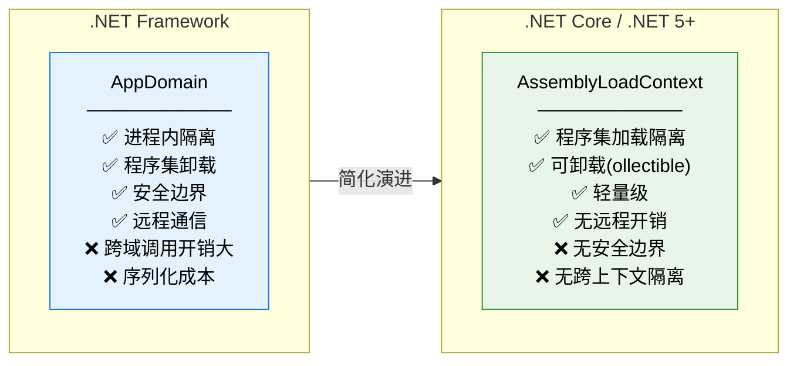

| 特性 | AppDomain (.NET Framework) | AssemblyLoadContext (.NET Core) |
|------|---------------------------|-------------------------------|
| 创建多个实例 | 支持 | 支持 |
| 卸载 | AppDomain.Unload | ALC.Unload（需 isCollectible） |
| 安全边界 | 支持（CAS） | 不支持 |
| 跨域通信 | 需要序列化/Marshal | 直接引用（需注意） |
| 异常隔离 | AppDomain 级别隔离 | 不隔离 |
| 性能开销 | 较高 | 较低 |

## 七、模块与程序集的关系

一个程序集（Assembly）由一个或多个模块（Module）组成。最常见的模式是一个程序集包含一个模块，但多模块程序集在理论上是支持的。

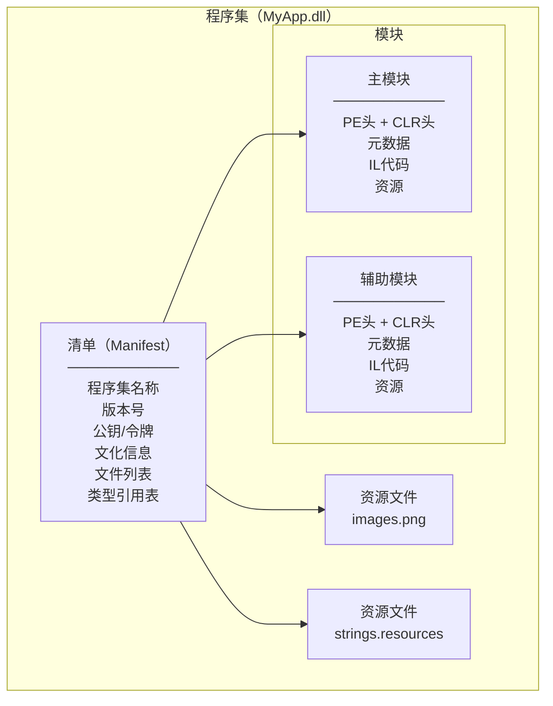

```csharp
// 模块与程序集的关系
using System;
using System.Reflection;

public class ModuleAssemblyDemo
{
    public static void Main()
    {
        // 获取当前程序集
        Assembly asm = typeof(ModuleAssemblyDemo).Assembly;
        Console.WriteLine($"程序集: {asm.FullName}");
        Console.WriteLine($"位置: {asm.Location}");

        // 获取所有模块
        Module[] modules = asm.GetModules();
        foreach (Module mod in modules)
        {
            Console.WriteLine($"\n模块: {mod.Name}");
            Console.WriteLine($"  MD5 版本: {mod.ModuleVersionId}");
            Console.WriteLine($"  类型数量: {mod.GetTypes().Length}");
        }

        // 获取主模块
        Module mainModule = asm.GetManifestModule();
        Console.WriteLine($"\n主模块: {mainModule.Name}");
    }
}
```

::: info 多模块程序集的现状
虽然 ECMA-335 标准支持多模块程序集，但在实际开发中几乎不使用。.NET Core / .NET 5+ 的工具链（dotnet build、csc）不支持创建多模块程序集。多文件程序集的唯一实际用途是将罕见使用的类型放在按需下载的模块中，但现代 .NET 更倾向于使用独立程序集或 NuGet 包来实现类似功能。
:::

## 八、NGen / CrossGen AOT 编译

除了 JIT 编译，.NET 还支持 AOT（Ahead-Of-Time）编译，即在部署前将 IL 代码编译为本地代码。

### 8.1 NGen（.NET Framework）

NGen（Native Image Generator）在 .NET Framework 中用于预编译程序集：

```bash
# 安装本地镜像到本地镜像缓存
ngen install MyApp.exe

# 显示已安装的本地镜像
ngen display MyApp

# 更新所有本地镜像
ngen update
```

NGen 的局限性：
- 本地镜像包含硬编码的地址，基地址可能冲突
- 本地镜像依赖特定 CLR 版本，升级后需要重新 NGen
- 无法执行跨模块内联优化
- 安全性（地址空间布局随机化 ASLR）受限

### 8.2 CrossGen / CrossGen2（.NET Core / .NET 5+）

CrossGen 是 .NET Core 的 AOT 编译工具，用于预编译框架程序集：

```bash
# 使用 CrossGen2 编译（.NET 7+）
crossgen2 /in:System.Private.CoreLib.dll /out:System.Private.CoreLib.ni.dll

# 使用 ReadyToRun（R2R）编译
dotnet publish -c Release -r win-x64 /p:PublishReadyToRun=true
```

### 8.3 Native AOT（.NET 7+）

.NET 7 引入了 Native AOT，这是一种完全的 AOT 编译方案：

```bash
# 发布 Native AOT 应用
dotnet publish -c Release -r win-x64 /p:PublishAot=true
```

```csharp
// Native AOT 的约束
// ❌ 不支持运行时反射动态生成代码
// ❌ 不支持 Assembly.Load 动态加载
// ❌ 不支持 System.Reflection.Emit
// ✅ 支持编译时已知的反射
// ✅ 支持源生成器（Source Generators）
// ✅ 启动速度极快
// ✅ 内存占用极小
```

### 8.4 JIT vs AOT 对比

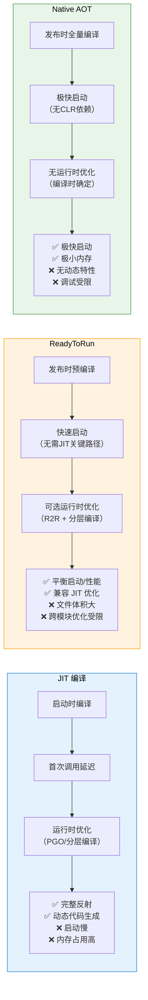

| 特性 | JIT | ReadyToRun | Native AOT |
|------|-----|-----------|------------|
| 启动速度 | 慢 | 快 | 极快 |
| 峰值性能 | 高（PGO优化） | 高 | 中-高 |
| 文件大小 | 小 | 大 | 中 |
| 反射支持 | 完整 | 完整 | 受限 |
| 动态代码生成 | 支持 | 支持 | 不支持 |
| 跨平台 | 单文件 | 每平台一份 | 每平台一份 |
| 调试体验 | 好 | 好 | 一般 |
| 内存占用 | 高 | 中 | 低 |

## 九、CLR 核心组件

CLR 由多个紧密协作的子系统组成。每个子系统负责运行时的一个关键方面。

```mermaid
flowchart TB
    subgraph CLR["CLR（Common Language Runtime）"]
        direction TB

        subgraph TS["类型系统 (Type System)"]
            LOADER["类型加载器<br/>───────────<br/>加载元数据<br/>构建 MethodTable<br/>构建 EEClass<br/>类型验证"]
            REFLECTION["反射系统<br/>───────────<br/>运行时类型信息<br/>MethodInfo/FieldInfo<br/>晚期绑定"]
        end

        subgraph EXEC["执行引擎 (Execution Engine)"]
            JIT_COMP["JIT 编译器 (RyuJIT)<br/>───────────<br/>IL → 本地代码<br/>优化<br/>分层编译<br/>内联"]
            STUB["调用桩管理<br/>───────────<br/>PreJitStub<br/>虚方法分派<br/>接口分派"]
        end

        subgraph MEM["内存管理 (Memory Manager)"]
            GC_COMP["垃圾回收器 (GC)<br/>───────────<br/>代模型(Gen0/1/2)<br/>标记-清除<br/>压缩<br/>大对象堆"]
            ALLOC["分配器<br/>───────────<br/>Bump 指针分配<br/>线程本地分配缓冲<br/>Segment 管理"]
        end

        subgraph THD["线程与同步 (Threading)"]
            TP["线程池<br/>───────────<br/>工作线程<br/>I/O 线程<br/>Work Stealing"]
            SYNC["同步机制<br/>───────────<br/>Monitor(SyncBlock)<br/>ReaderWriterLock<br/>Slim 系列锁"]
        end

        subgraph EXN["异常处理 (Exception Handling)"]
            SEH["SEH 机制<br/>───────────<br/>结构化异常处理<br/>栈展开<br/>过滤器"]
            FINAL["终结器<br/>───────────<br/>Finalize 队列<br/>SafeHandle"]
        end

        subgraph DBG["调试与诊断 (Debug/Diagnostics)"]
            DEBUGGER["调试器支持<br/>───────────<br/>断点/单步<br/>变量检查<br/>EnC(编辑继续)"]
            PROF["性能分析<br/>───────────<br/>Profiling API<br/>ETW 事件<br/>EventPipe"]
        end

        subgraph SEC["安全 (Security)"]
            VERIFY["类型安全验证<br/>───────────<br/>IL 验证<br/>堆栈遍历"]
            CAS_LEGACY["CAS(遗留)<br/>───────────<br/>代码访问安全<br/>(.NET Core 已移除)"]
        end
    end

    TS --> EXEC
    EXEC --> MEM
    MEM --> THD
    THD --> EXN
    EXN --> DBG
    DBG --> SEC

    style TS fill:#e3f2fd,stroke:#1976d2,color:#000
    style EXEC fill:#fff3e0,stroke:#ff9800,color:#000
    style MEM fill:#e8f5e9,stroke:#388e3c,color:#000
    style THD fill:#fce4ec,stroke:#e91e63,color:#000
    style EXN fill:#f3e5f5,stroke:#9c27b0,color:#000
    style DBG fill:#e0f2f1,stroke:#009688,color:#000
    style SEC fill:#efebe9,stroke:#795548,color:#000
```

### 9.1 各组件协作流程

```csharp
// 一个完整的方法调用涉及的 CLR 组件
public class ComponentCollaboration
{
    public static void Main()
    {
        var list = new List<int>();   // ① 类型系统：加载 List<int>
                                       // ② 内存管理：分配 List<int> 对象
        list.Add(42);                  // ③ JIT：编译 Add 方法
                                       // ④ 内存管理：可能触发数组扩容
        try
        {
            var item = list[0];        // ⑤ 执行引擎：边界检查
        }
        catch (ArgumentOutOfRangeException)
        {                              // ⑥ 异常处理：SEH
        }

        // ⑦ 线程池：异步操作使用线程池
        Task.Run(() => list.Add(100));
    }
}
```

### 9.2 CLR 核心源码映射

以下列出 CoreCLR 源码中各组件对应的关键文件路径（基于 dotnet/runtime 仓库）：

| 组件 | 源码路径 | 关键文件 |
|------|---------|---------|
| 类型系统 | `src/coreclr/vm/` | `typehandle.cpp`, `methodtable.cpp`, `eeclass.cpp` |
| JIT 编译器 | `src/coreclr/jit/` | `compiler.cpp`, `il.cpp`, `codegen.cpp` |
| GC | `src/coreclr/gc/` | `gc.cpp`, `gcscan.cpp`, `objecthandle.cpp` |
| 线程池 | `src/coreclr/vm/` | `threadpoolrequest.cpp`, `corhost.cpp` |
| 异常处理 | `src/coreclr/vm/` | `excep.cpp`, `stackwalk.cpp` |
| 调试器 | `src/coreclr/debug/` | `debugger.cpp`, `dacdbiimpl.cpp` |
| 程序集加载 | `src/coreclr/vm/` | `assembly.cpp`, `assemblyname.cpp`, `clrprivbinderutil.cpp` |

## 十、托管与非托管代码交互

CLR 提供了多种机制让托管代码与非托管代码进行交互，这是 .NET 生态能够利用操作系统原生 API 和遗留代码的基础。

### 10.1 P/Invoke（Platform Invoke）

P/Invoke 是最常用的托管-非托管交互方式，通过 DllImport 属性声明外部函数：

```csharp
using System;
using System.Runtime.InteropServices;

public class PInvokeDemo
{
    // 声明 Win32 API
    [DllImport("kernel32.dll", SetLastError = true)]
    private static extern IntPtr GetProcAddress(IntPtr hModule, string lpProcName);

    [DllImport("kernel32.dll", SetLastError = true)]
    private static extern IntPtr GetModuleHandle(string lpModuleName);

    // 使用 SafeHandle 包装非托管资源
    private class SafeLibraryHandle : SafeHandleZeroOrMinusOneIsInvalid
    {
        public SafeLibraryHandle() : base(true) { }

        protected override bool ReleaseHandle()
        {
            return FreeLibrary(handle);
        }
    }

    [DllImport("kernel32.dll", SetLastError = true)]
    private static extern SafeLibraryHandle LoadLibrary(string lpFileName);

    [DllImport("kernel32.dll", SetLastError = true)]
    [return: MarshalAs(UnmanagedType.Bool)]
    private static extern bool FreeLibrary(IntPtr hModule);

    public static void Main()
    {
        var handle = GetModuleHandle("kernel32.dll");
        var procAddress = GetProcAddress(handle, "GetTickCount");
        Console.WriteLine($"GetTickCount 地址: {procAddress}");
    }
}
```

对应的 IL 展示了 P/Invoke 的底层实现：

```il
.method private hidebysig static native int GetProcAddress(
    native int hModule,
    string lpProcName) cil managed preservesig
{
    // P/Invoke 方法没有 IL 方法体
    // MarshalAsAttribute 等信息存储在元数据 (CustomAttribute 表) 中，不是 IL 指令
}
// 元数据中的 ImplMap 表记录了 P/Invoke 映射:
// MemberRef: GetProcAddress
// ImportName: GetProcAddress
// ImportScope: ModuleRef("kernel32.dll")
// MappingFlags: PInvokeCallConvStdCall | PInvokeCharSetAnsi
//
// 元数据中的 CustomAttribute 表记录了封送信息:
// [DllImport("kernel32.dll", CharSet = CharSet.Ansi)]
// [return: MarshalAs(UnmanagedType.FunctionPtr)]
```

### 10.2 COM 互操作

CLR 内置了 COM（Component Object Model）互操作支持，通过 `ComImport` 属性声明 COM 接口：

```csharp
using System;
using System.Runtime.InteropServices;

[ComImport]
[Guid("00020970-0000-0000-C000-000000000046")]
[InterfaceType(ComInterfaceType.InterfaceIsIDispatch)]
interface _Application
{
    void Quit();
}

[ComImport]
[Guid("000209FF-0000-0000-C000-000000000046")]
class Application
{
}
```

### 10.3 不安全代码（unsafe）

当需要直接操作内存时，可以使用 `unsafe` 代码：

```csharp
using System;

public unsafe class UnsafeDemo
{
    public static void Main()
    {
        int value = 42;

        // 获取变量的指针
        int* ptr = &value;

        // 通过指针修改值
        *ptr = 100;

        Console.WriteLine($"value = {value}"); // 输出: value = 100

        // 固定托管对象在堆上的地址（防止 GC 移动）
        int[] arr = new int[] { 1, 2, 3, 4, 5 };
        fixed (int* pArr = arr)
        {
            // pArr 在 fixed 块内不会被 GC 移动
            for (int i = 0; i < arr.Length; i++)
            {
                Console.WriteLine($"arr[{i}] = {pArr[i]}");
            }
        } // fixed 块结束后，arr 可被 GC 移动
    }
}
```

```il
// fixed 语句的 IL 实现
.method public hidebysig static void Main() cil managed
{
    .maxstack 3
    .locals init (int32& V_0,     // ptr
                  int32[] V_1,     // arr
                  int32& V_2,     // pArr (pinned)
                  int32 V_3)       // i

    // fixed (int* pArr = arr)
    IL_0000: ldloc.1           // 加载 arr
    IL_0001: ldc.i4.0          // 索引 0
    IL_0002: ldelema [System.Runtime]System.Int32  // 获取元素地址
    IL_0007: stloc.2           // 存储到 V_2 (pinned)
    // V_2 被标记为 pinned，GC 在此期间不会移动该对象

    // ... 循环体 ...

    // fixed 块结束
    IL_00xx: ldc.i4.0
    IL_00xx: stloc.2           // 将 pinned 引用置空
}
```

::: warning unsafe 代码的安全风险
`unsafe` 代码绕过了 CLR 的类型安全检查，可能导致：
- 内存越界访问
- 悬空指针（GC 移动对象后指针失效）
- 类型安全漏洞
因此，使用 `unsafe` 代码时必须格外小心，并在 `fixed` 块内尽量缩短非托管指针的生命周期。
:::

### 10.4 Span&lt;T&gt; —— 安全的内存统一视图

`Span&lt;T&gt;` 是 .NET 提供的安全且高效的内存访问抽象，它可以在不使用 `unsafe` 代码的情况下统一操作托管内存、栈内存和非托管内存：

```csharp
using System;

public class SpanDemo
{
    public static void Main()
    {
        // 1. 托管数组
        int[] managed = new int[] { 1, 2, 3, 4, 5 };
        Span<int> span1 = managed.AsSpan();

        // 2. 栈内存
        Span<int> span2 = stackalloc int[5];

        // 3. 非托管内存
        IntPtr unmanaged = System.Runtime.InteropServices.Marshal.AllocHGlobal(5 * sizeof(int));
        try
        {
            Span<int> span3 = new Span<int>(unmanaged.ToPointer(), 5);
            span3[0] = 42;
        }
        finally
        {
            System.Runtime.InteropServices.Marshal.FreeHGlobal(unmanaged);
        }

        // Span 的切片操作 — 零拷贝
        Span<int> slice = span1.Slice(1, 3); // [2, 3, 4]
    }
}
```

### 10.5 托管/非托管交互全景图

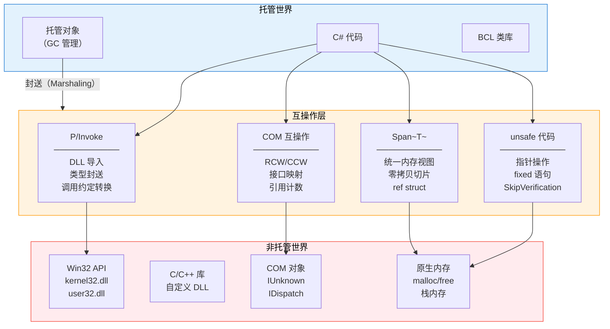

## 十一、实战：使用工具观察 CLR 行为

### 11.1 使用 ILDasm 查看 IL 和元数据

```bash
# 使用 ildasm 查看 IL 代码
ildasm MyApp.exe /text /out=MyApp.il

# 查看元数据统计
ildasm MyApp.exe /stats
```

### 11.2 使用 dotnet-ildasm 和 ICSharpCode.ILSpy

```bash
# 使用 dotnet 工具
dotnet tool install -g dotnet-ildasm

# 导出 IL
dotnet ildasm MyApp.dll -o MyApp.il
```

### 11.3 使用 ClrMD 分析运行时状态

```csharp
using Microsoft.Diagnostics.Runtime;
using System;

public class ClrMDDemo
{
    public static void Main()
    {
        // 附加到目标进程
        int pid = /* 目标进程 PID */;
        using var dataTarget = DataTarget.AttachToProcess(pid, suspend: false);

        // 获取 CLR 运行时信息
        ClrRuntime runtime = dataTarget.ClrVersions[0].CreateRuntime();

        Console.WriteLine($"CLR 版本: {runtime.ClrInfo.Version}");

        // 遍历所有线程
        foreach (ClrThread thread in runtime.Threads)
        {
            if (!thread.IsAlive) continue;
            Console.WriteLine($"\n线程 {thread.OSThreadId:X} ({thread.GCMode})");
            foreach (ClrStackFrame frame in thread.EnumerateStackTrace())
            {
                Console.WriteLine($"  {frame}");
            }
        }

        // 遍历托管堆
        foreach (ClrObject obj in runtime.Heap.EnumerateObjects())
        {
            Console.WriteLine($"对象: {obj.Type.Name} 大小: {obj.Size}");
        }
    }
}
```

### 11.4 使用 PerfView 和 dotnet-trace 进行性能分析

```bash
# 安装工具
dotnet tool install -g dotnet-trace
dotnet tool install -g dotnet-counters

# 收集性能数据
dotnet-trace collect --process-id 12345 --profile cpu-sampling

# 实时监控 GC 计数器
dotnet-counters monitor --process-id 12345 --counters System.Runtime[gc-heap-size,gen-0-gc-count,gen-1-gc-count,gen-2-gc-count]
```

## 十二、总结

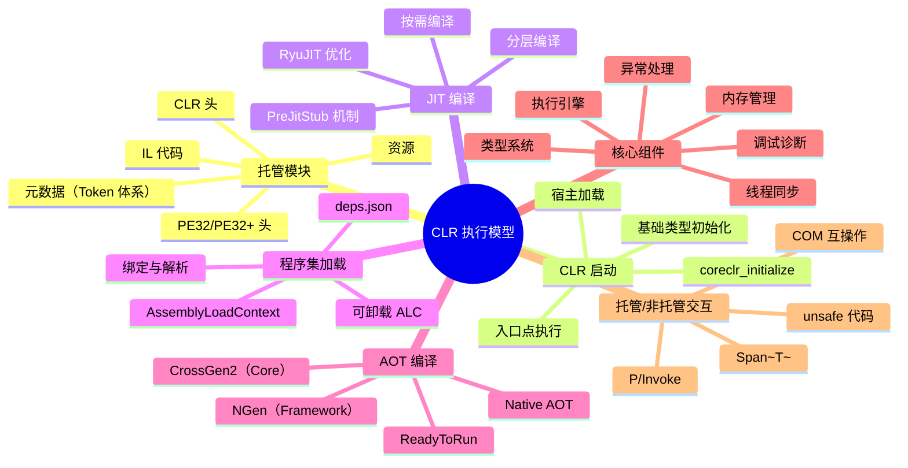

::: important 关键要点回顾
1. **托管模块**是 CLR 可识别的 PE/COFF 文件，包含 PE 头、CLR 头、元数据和 IL 代码四个核心部分
2. **CLR 启动**经历宿主加载→CLR 初始化→基础类型创建→入口点执行四个阶段
3. **JIT 编译**采用按需编译策略，首次调用时编译，后续调用零开销；分层编译兼顾启动速度与峰值性能
4. **AssemblyLoadContext** 是 .NET Core 中程序集加载和隔离的核心机制，支持可卸载上下文
5. **AOT 编译**（ReadyToRun/Native AOT）提供了从启动优化到完全静态编译的渐进式方案
6. **CLR 核心组件**（类型系统、JIT、GC、线程池等）紧密协作，共同支撑 .NET 运行时
7. **托管/非托管交互**通过 P/Invoke、COM 互操作、unsafe 代码等机制实现，Span&lt;T&gt; 提供了安全的统一内存视图
:::

---

**参考资料**

- Jeffrey Richter.《CLR via C#》第4版. Microsoft Press, 2012.
- ECMA-335. Common Language Infrastructure (CLI) Standard, 6th Edition, 2012.
- Konrad Kokosa.《Pro .NET Memory Management》. Apress, 2018.
- dotnet/runtime 源码仓库. https://github.com/dotnet/runtime
- .NET Runtime Architecture Documentation. https://learn.microsoft.com/en-us/dotnet/core/runtime
