# 类型对象与类型引用

::: important 核心问题
在 CLR 中，每一个类型都有对应的"类型对象"（Type Object）。当你写 `typeof(MyClass)` 时，你拿到的是什么？这个 Type 对象在运行时是什么结构？它如何与方法表、EEClass 关联？反射的性能代价究竟有多大？
:::

## 一、Type 对象 —— 一切类型的元数据入口

在 CLR 中，每一个加载的类型都对应一个 **类型对象（Type Object）**，它在托管堆上分配，包含了该类型的所有元数据信息。C# 中的 `System.Type` 类就是对这个类型对象的托管封装。

### 1.1 Type 对象的运行时类型

当你使用 `typeof(T)` 或 `obj.GetType()` 获取 Type 时，返回的实际类型是 `System.RuntimeType`——这是 `System.Type` 的内部实现类：

```csharp
using System;

public class RuntimeTypeDemo
{
    public static void Main()
    {
        Type t1 = typeof(string);
        Type t2 = "hello".GetType();

        Console.WriteLine($"t1 的实际类型: {t1.GetType().FullName}");
        Console.WriteLine($"t2 的实际类型: {t2.GetType().FullName}");

        // 输出:
        // t1 的实际类型: System.RuntimeType
        // t2 的实际类型: System.RuntimeType
    }
}
```

对应的 IL 代码揭示了底层差异：

```il
// typeof(string) 的 IL
IL_0001: ldtoken [mscorlib]System.String
IL_0006: call class [mscorlib]System.Type [mscorlib]System.Type::GetTypeFromHandle(valuetype [mscorlib]System.RuntimeTypeHandle)

// "hello".GetType() 的 IL
IL_0001: ldstr "hello"
IL_0006: callvirt instance class [mscorlib]System.Type [mscorlib]System.Object::GetType()
```

::: tip RuntimeType vs Type
`System.Type` 是抽象基类，`System.RuntimeType` 是 CLR 内部实现。.NET 故意隐藏了 RuntimeType——你不能直接 `new RuntimeType()`，只能通过 `typeof` 或 `GetType` 获取。这种设计将类型系统的内部实现与公共 API 解耦。
:::

### 1.2 Type 对象在运行时的对象图

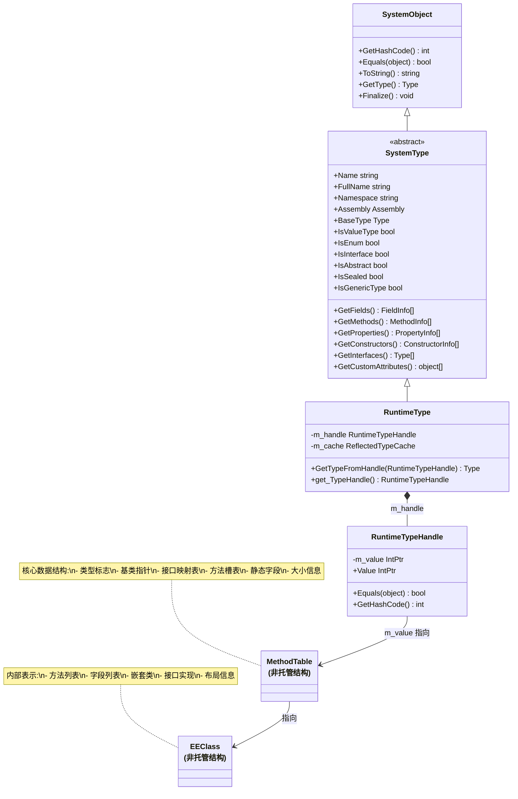

### 1.3 RuntimeTypeHandle —— 托管与非托管的桥梁

`RuntimeTypeHandle` 是连接托管 Type 对象与非托管 MethodTable 的桥梁：

```csharp
using System;
using System.Reflection;

public class TypeHandleDemo
{
    public static void Main()
    {
        Type type = typeof(string);

        // 获取 RuntimeTypeHandle
        RuntimeTypeHandle handle = type.TypeHandle;

        // TypeHandle 的值就是 MethodTable 的地址
        IntPtr methodTablePtr = handle.Value;
        Console.WriteLine($"MethodTable 地址: 0x{methodTablePtr.ToString("X")}");

        // 从 RuntimeTypeHandle 还原 Type
        Type restored = Type.GetTypeFromHandle(handle);
        Console.WriteLine($"还原的类型: {restored.FullName}");
        Console.WriteLine($"是否同一个 Type 对象: {ReferenceEquals(type, restored)}"); // true
    }
}
```

```il
// 获取 TypeHandle 的 IL
IL_0001: ldtoken [mscorlib]System.String
IL_0006: call class [mscorlib]System.Type [mscorlib]System.Type::GetTypeFromHandle(valuetype [mscorlib]System.RuntimeTypeHandle)
IL_000b: callvirt instance valuetype [mscorlib]System.RuntimeTypeHandle [mscorlib]System.Type::get_TypeHandle()

// 从 Handle 还原 Type 的 IL
IL_0010: call class [mscorlib]System.Type [mscorlib]System.Type::GetTypeFromHandle(valuetype [mscorlib]System.RuntimeTypeHandle)
```

## 二、MethodTable 结构 —— 类型系统的核心数据结构

MethodTable 是 CLR 中最核心的数据结构之一。每个加载的类型在 CLR 内部都有一个对应的 MethodTable，它存储了类型的方法调度信息、字段布局、接口映射等关键数据。

### 2.1 MethodTable 详细结构

```mermaid
flowchart TB
    subgraph MT["MethodTable 结构（简化视图）"]
        direction TB

        subgraph Header["头部区域"]
            MT_FLAGS["m_dwFlags<br/>───────────<br/>类型标志位<br/>▪ IsValueType<br/>▪ IsInterface<br/>▪ IsAbstract<br/>▪ HasFinalizer<br/>▪ HasCriticalFinalizer<br/>▪ IsGenericType<br/>▪ ContainsGenericParameters"]
            BASE_MT["m_pBaseMethodTable<br/>───────────<br/>基类的 MethodTable 指针<br/>(System.Object 为 null)"]
            EECLASS_PTR["m_pEEClass<br/>───────────<br/>EEClass 指针<br/>存储类型的非热路径数据"]
            NORM_NAME["m_pszDebugClassName<br/>───────────<br/>类型名称字符串<br/>(调试用)"]
        end

        subgraph SizeInfo["大小信息"]
            INST_SIZE["m_cbInstanceSize<br/>───────────<br/>实例大小（含头）<br/>引用类型: SyncBlock + TypeHandle + 字段<br/>值类型: 字段大小（无头）"]
            BASE_SIZE["m_cbBaseSize<br/>───────────<br/>基类实例大小"]
            NUM_METHODS["m_wNumMethods<br/>───────────<br/>方法数量"]
            NUM_VTABLE["m_wNumVirtuals<br/>───────────<br/>虚方法数量"]
            NUM_INTERFACES["m_wNumInterfaces<br/>───────────<br/>实现的接口数量"]
            NUM_STATIC["m_wNumStaticFields<br/>───────────<br/>静态字段数量"]
        end

        subgraph VTable["虚方法表（VTable）"]
            VT_ENTRY["VTable 槽位<br/>───────────<br/>[0] Object.GetHashCode<br/>[1] Object.Equals<br/>[2] Object.ToString<br/>[3] Object.Finalize<br/>[4] 自定义虚方法1<br/>[5] 自定义虚方法2<br/>..."]
        end

        subgraph IFaceMap["接口映射表"]
            IM_ENTRY["接口映射条目<br/>───────────<br/>[0] IComparable 接口<br/>  → 方法槽映射表<br/>[1] IEnumerable 接口<br/>  → 方法槽映射表<br/>..."]
        end

        subgraph StaticFields["静态字段区"]
            SF_ENTRY["静态字段<br/>───────────<br/>[0] static int Count<br/>[1] static string Name<br/>..."]
        end

        subgraph MethodDescs["方法描述符区"]
            MD_ENTRY["MethodDesc<br/>───────────<br/>[0] .ctor → JIT 桩/本地代码<br/>[1] MethodA → JIT 桩/本地代码<br/>[2] VirtualMethod → VTable 槽<br/>..."]
        end
    end

    Header --> SizeInfo --> VTable --> IFaceMap --> StaticFields --> MethodDescs

    style Header fill:#e3f2fd,stroke:#1976d2,color:#000
    style SizeInfo fill:#fff3e0,stroke:#ff9800,color:#000
    style VTable fill:#e8f5e9,stroke:#388e3c,color:#000
    style IFaceMap fill:#fce4ec,stroke:#e91e63,color:#000
    style StaticFields fill:#f3e5f5,stroke:#9c27b0,color:#000
    style MethodDescs fill:#e0f2f1,stroke:#009688,color:#000
```

### 2.2 MethodTable 的内存布局（以具体类型为例）

以一个自定义类为例：

```csharp
public class Person : Object, IComparable<Person>
{
    private static int _instanceCount;
    private readonly string _name;
    private int _age;

    public Person(string name, int age)
    {
        _name = name;
        _age = age;
        _instanceCount++;
    }

    public override string ToString() => $"{_name}, {_age}";
    public override int GetHashCode() => HashCode.Combine(_name, _age);

    public int CompareTo(Person? other) =>
        other is null ? 1 : _age.CompareTo(other._age);
}
```

Person 的 MethodTable 布局：

```
偏移           字段                      值/说明
─────────────────────────────────────────────────────────
0x00          m_dwFlags                 TYPE_CLASS | HAS_FINALIZER(否) | ...
0x04          m_cbInstanceSize           32 (SyncBlock[8] + TypeHandle[8] + _name[8] + _age[4] + padding[4])
0x08          m_cbBaseSize              24 (Object 的实例大小)
0x0C          m_wNumMethods             5 (.ctor + ToString + GetHashCode + CompareTo + static init)
0x0E          m_wNumVirtuals            3 (ToString + GetHashCode + CompareTo)
0x10          m_wNumInterfaces          1 (IComparable<Person>)
0x12          m_wNumStaticFields        1 (_instanceCount)
0x14          m_pBaseMethodTable        → System.Object 的 MethodTable
0x18          m_pEEClass                → Person 的 EEClass
0x1C          m_pszDebugClassName       → "Person"

--- VTable（继承自 Object + 自身虚方法）---
0x20          [0] Object.GetHashCode    → Person.GetHashCode 的 MethodDesc
0x24          [1] Object.Equals         → Object.Equals（未重写）
0x28          [2] Object.ToString       → Person.ToString 的 MethodDesc
0x2C          [3] Object.Finalize       → Object.Finalize（未重写）

--- VTable（Person 新增虚方法）---
0x30          [4] CompareTo             → Person.CompareTo 的 MethodDesc

--- 接口映射表 ---
0x34          IComparable<Person>       → 接口方法到 VTable 槽的映射

--- 静态字段 ---
0x38          _instanceCount            → int (4 bytes)

--- MethodDesc 数组 ---
0x3C          .ctor 的 MethodDesc
0x44          ToString 的 MethodDesc
0x4C          GetHashCode 的 MethodDesc
0x54          CompareTo 的 MethodDesc
```

### 2.3 MethodDesc —— 方法描述符

每个方法在 MethodTable 中都有一个对应的 `MethodDesc`，它记录了方法的元数据和 JIT 编译状态：

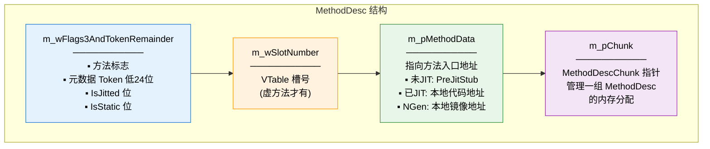

```csharp
// 使用 SOS 调试扩展查看 MethodDesc
// 在 WinDbg 中:
// !dumpmd 0x00007ffe12345678
//
// 输出示例:
// MethodDesc: 00007ffe12345678
// Method Name: Person.CompareTo(Person)
// Class: 00007ffe12340000
// MethodTable: 00007ffe12345000
// mdToken: 06000005
// Module: 00007ffe12000000
// IsJitted: yes
// CodeAddr: 00007ffe56780000
// Transparency: Critical
```

## 三、EEClass 与 MethodTable 的关系

EEClass（Execution Engine Class）是 CLR 内部用于表示类型定义的另一个关键数据结构。它与 MethodTable 的关系是 CLR 设计中经典的"冷热分离"策略。

### 3.1 为什么要分离 EEClass 和 MethodTable？

CLR 将类型信息分为两个结构来存储，基于以下原则：

- **MethodTable**：存储运行时"热路径"数据（VTable、方法入口、静态字段），这些数据在每次方法调用时都需要访问
- **EEClass**：存储运行时"冷路径"数据（字段列表、方法列表、接口实现、嵌套类），这些数据主要在反射和类型加载时使用

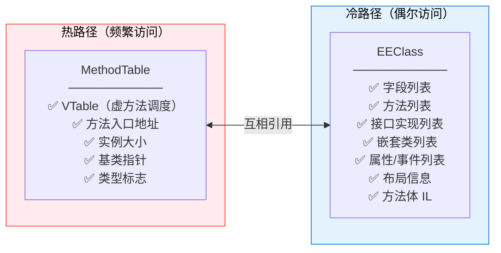

### 3.2 EEClass 结构

```
EEClass 结构（简化）:
─────────────────────────────────────────
偏移    字段                       说明
0x00    m_pGuidInfo               GUID 信息
0x08    m_rpntFieldMarshalList    字段封送列表
0x10    m_pMethodTable            → 指向对应的 MethodTable
0x18    m_pFieldDescList          → 字段描述符链表
0x20    m_pMethodDescList         → 方法描述符链表
0x28    m_pInterfaceMap           → 接口映射
0x30    m_pParentClass            → 父类 EEClass
0x38    m_pNestedClasses          → 嵌套类列表
0x40    m_dwAttrClass             类型属性
0x44    m_wNumInstanceFields      实例字段数量
0x46    m_wNumStaticFields        静态字段数量
0x48    m_wNumMethodDescriptors   方法描述符数量
0x4A    m_wNumInterfaces          接口数量
─────────────────────────────────────────
```

### 3.3 完整的类型对象关系图

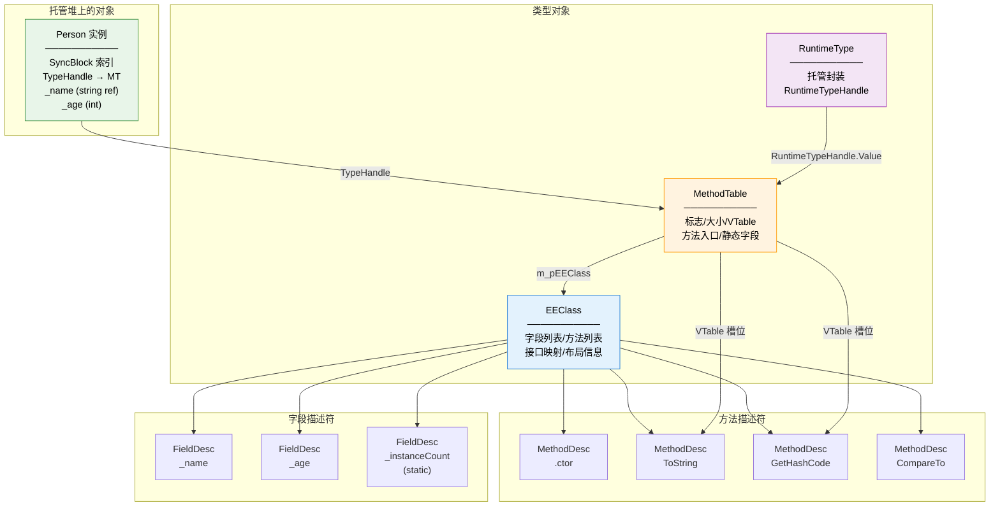

## 四、类型引用解析

类型引用是指在 IL 代码中引用一个类型的过程。CLR 提供了多种机制来引用和解析类型。

### 4.1 ldtoken + GetTypeFromHandle

`ldtoken` 指令是 IL 中引用类型的最底层机制，它将元数据 Token 加载到栈上：

```csharp
// C# 代码
Type t = typeof(List<int>);
```

```il
// 对应的 IL
IL_0000: ldtoken [mscorlib]System.Collections.Generic.List`1<
    [mscorlib]System.Int32>
IL_0005: call class [mscorlib]System.Type
    [mscorlib]System.Type::GetTypeFromHandle(
        valuetype [mscorlib]System.RuntimeTypeHandle)
```

`ldtoken` 可以加载三种类型的 Token：

| 指令变体 | 加载的 Token 类型 | 说明 |
|----------|-----------------|------|
| `ldtoken <typeref>` | TypeRef/TypeDef/TypeSpec | 类型引用 |
| `ldtoken <methodref>` | MethodRef/MethodDef/MethodSpec | 方法引用 |
| `ldtoken <fieldref>` | FieldRef/FieldDef | 字段引用 |

### 4.2 通过 MethodHandle 获取方法信息

```csharp
using System;
using System.Reflection;

public class MethodHandleDemo
{
    public static void Main()
    {
        // 获取方法的 RuntimeMethodHandle
        MethodInfo methodInfo = typeof(string).GetMethod("Substring", new[] { typeof(int) })!;
        RuntimeMethodHandle handle = methodInfo.MethodHandle;

        // 从 Handle 获取方法信息
        IntPtr methodDescPtr = handle.Value;
        Console.WriteLine($"MethodDesc 地址: 0x{methodDescPtr.ToString("X")}");

        // 通过 ldtoken 指令获取方法引用
        // 在 IL 中:
        // ldtoken method void [mscorlib]System.String::Substring(int32)
        // call class [mscorlib]System.Reflection.MethodBase
        //     [mscorlib]System.Reflection.MethodBase::GetMethodFromHandle(
        //         valuetype [mscorlib]System.RuntimeMethodHandle)
    }
}
```

### 4.3 类型引用解析流程

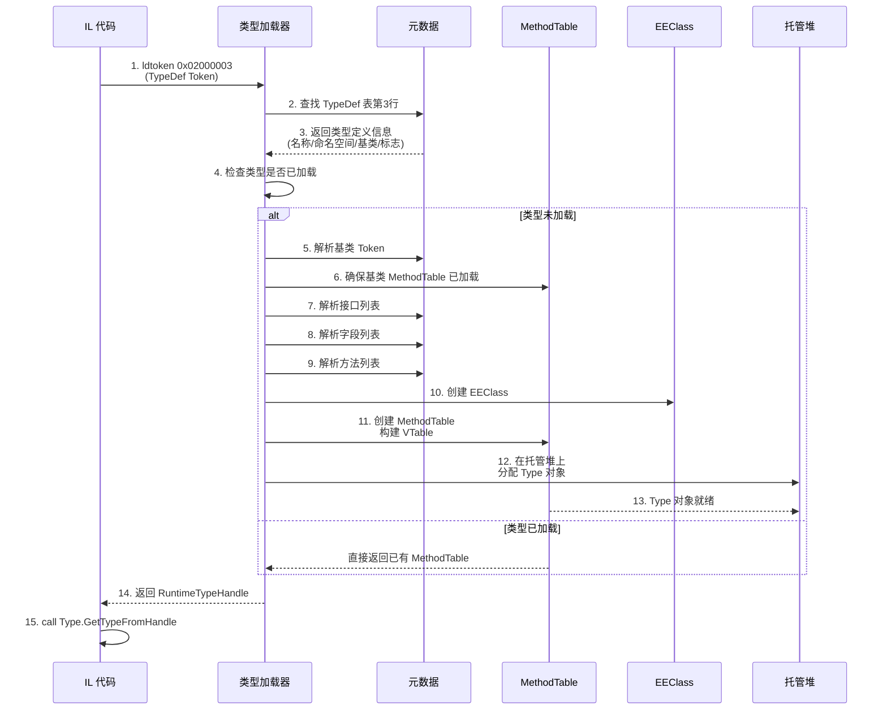

## 五、typeof 与 GetType 的 IL 区别

`typeof(T)` 和 `obj.GetType()` 都返回 `System.Type`，但它们的 IL 实现和语义完全不同。

### 5.1 核心区别

```csharp
using System;

public class TypeofVsGetType
{
    public static void Main()
    {
        // typeof —— 编译时确定
        Type t1 = typeof(string);

        // GetType —— 运行时确定
        Type t2 = "hello".GetType();

        // 对于值类型
        Type t3 = typeof(int);           // 编译时
        Type t4 = 42.GetType();          // 运行时（需要装箱！）
    }
}
```

```il
// typeof(string) —— ldtoken + GetTypeFromHandle
IL_0001: ldtoken [mscorlib]System.String
IL_0006: call class [mscorlib]System.Type
    [mscorlib]System.Type::GetTypeFromHandle(
        valuetype [mscorlib]System.RuntimeTypeHandle)

// "hello".GetType() —— callvirt Object.GetType
IL_000b: ldstr "hello"
IL_0010: callvirt instance class [mscorlib]System.Type
    [mscorlib]System.Object::GetType()

// typeof(int) —— ldtoken + GetTypeFromHandle
IL_0015: ldtoken [mscorlib]System.Int32
IL_001a: call class [mscorlib]System.Type
    [mscorlib]System.Type::GetTypeFromHandle(
        valuetype [mscorlib]System.RuntimeTypeHandle)

// 42.GetType() —— 装箱 + callvirt
IL_001f: ldc.i4.s 42
IL_0021: box [mscorlib]System.Int32       // ← 装箱！
IL_0026: callvirt instance class [mscorlib]System.Type
    [mscorlib]System.Object::GetType()
```

### 5.2 详细对比

| 特性 | `typeof(T)` | `obj.GetType()` |
|------|-------------|-----------------|
| IL 指令 | `ldtoken` + `call Type.GetTypeFromHandle` | `callvirt Object.GetType` |
| 确定时机 | 编译时 | 运行时 |
| 值类型装箱 | 不需要 | 需要（值类型必须装箱才能调虚方法） |
| 可用场景 | 任何已知类型名 | 需要实例 |
| 返回类型 | 精确的声明类型 | 运行时实际类型（可能是子类） |
| 性能 | 极快（直接从 Token 解析） | 较快（虚方法调用） |
| 泛型支持 | `typeof(T)` 支持 | N/A |

::: warning 值类型的 GetType 陷阱
对值类型调用 `GetType()` 会触发装箱！这是因为 `GetType()` 是 `System.Object` 的虚方法，值类型需要先装箱为堆上的对象才能进行虚方法调用。在性能敏感代码中，应使用 `typeof(T)` 代替。
:::

### 5.3 typeof 在泛型中的行为

```csharp
using System;

public class GenericTypeof<T>
{
    public void PrintTypeInfo(T value)
    {
        // typeof(T) —— 在 JIT 编译时替换为具体类型
        Type typeFromTypeof = typeof(T);

        // value.GetType() —— 运行时实际类型
        Type typeFromGetType = value!.GetType();

        Console.WriteLine($"typeof(T): {typeFromTypeof.FullName}");
        Console.WriteLine($"GetType(): {typeFromGetType.FullName}");

        // 对于 object o = new Derived(); T = Base
        // typeof(T) → Base
        // o.GetType() → Derived
    }
}

// 调用示例
var demo = new GenericTypeof<object>();
demo.PrintTypeInfo("hello");
// typeof(T): System.Object
// GetType(): System.String    ← 运行时实际类型！
```

```il
// GenericTypeof`1<T>::PrintTypeInfo 的 IL
// typeof(T) 在开放泛型中的表示:
IL_0001: ldtoken !!T          // !!T 表示泛型参数 T
IL_0006: call class [mscorlib]System.Type
    [mscorlib]System.Type::GetTypeFromHandle(
        valuetype [mscorlib]System.RuntimeTypeHandle)
// 当 JIT 编译为具体类型时，!!T 被替换为具体类型的 Token
```

## 六、反射的性能代价

反射是 .NET 提供的强大能力，但它的性能代价是显著的。理解反射的内部机制有助于在合适的场景做出正确的选择。

### 6.1 反射调用的内部流程

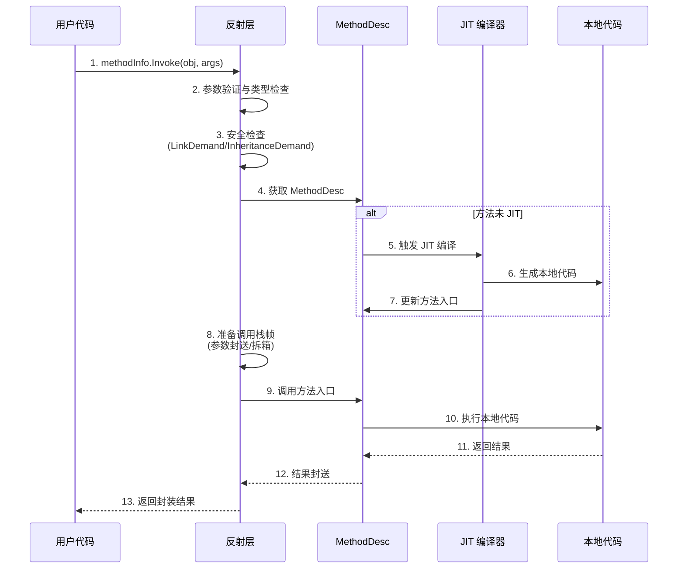

### 6.2 反射 vs 直接调用基准测试

```csharp
using System;
using System.Diagnostics;
using System.Reflection;
using BenchmarkDotNet.Attributes;
using BenchmarkDotNet.Running;

[MemoryDiagnoser]
public class ReflectionBenchmark
{
    private readonly Calculator _calc = new Calculator();
    private readonly MethodInfo _addMethod =
        typeof(Calculator).GetMethod("Add")!;
    private readonly Func<Calculator, int, int, int> _addDelegate;

    public ReflectionBenchmark()
    {
        // 通过委托缓存优化反射调用
        _addDelegate = (Func<Calculator, int, int, int>)
            Delegate.CreateDelegate(
                typeof(Func<Calculator, int, int, int>),
                null,
                _addMethod);
    }

    [Benchmark(Baseline = true)]
    public int DirectCall()
    {
        return _calc.Add(1, 2);
    }

    [Benchmark]
    public int ReflectionInvoke()
    {
        return (int)_addMethod.Invoke(_calc, new object[] { 1, 2 })!;
    }

    [Benchmark]
    public int DelegateFromReflection()
    {
        return _addDelegate(_calc, 1, 2);
    }
}

public class Calculator
{
    public int Add(int a, int b) => a + b;
}
```

典型基准测试结果：

```
| Method                  | Mean       | Ratio | Allocated |
|------------------------ |-----------:|------:|----------:|
| DirectCall              |   1.234 ns |  1.00 |         - |
| ReflectionInvoke        | 234.567 ns |190.12 |    120 B  |
| DelegateFromReflection  |   2.345 ns |  1.90 |         - |
```

::: important 反射性能分析
从基准测试可以看出：
1. **直接调用**：纳秒级，零分配
2. **反射调用**：比直接调用慢约 100-200 倍，每次调用分配约 120 字节（参数数组的装箱和封送）
3. **委托缓存**：仅比直接调用慢约 2 倍，零分配 —— 这是反射优化的最佳实践
:::

### 6.3 反射性能代价的来源

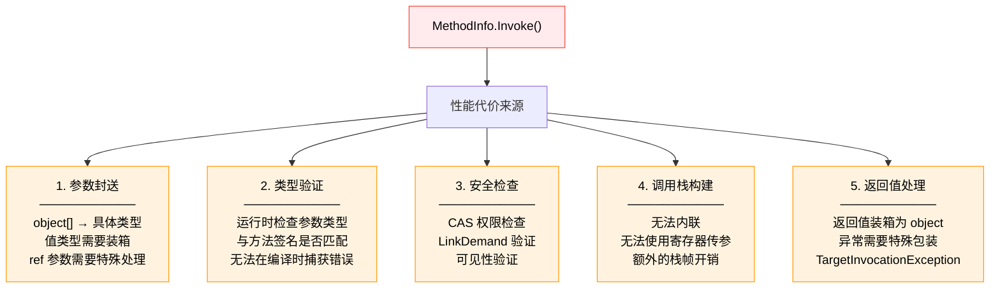

### 6.4 反射优化策略

```csharp
using System;
using System.Reflection;
using System.Linq.Expressions;

public class ReflectionOptimization
{
    // 策略1：缓存 MethodInfo/PropertyInfo
    private static readonly MethodInfo s_cachedMethod =
        typeof(string).GetMethod("Substring", new[] { typeof(int) })!;

    // 策略2：使用 Delegate.CreateDelegate 缓存委托
    private static readonly Func<string, int, string> s_substringDelegate =
        (Func<string, int, string>)Delegate.CreateDelegate(
            typeof(Func<string, int, string>), s_cachedMethod);

    // 策略3：使用 Expression Tree 编译调用
    public static Func<T, TResult> CreateGetter<T, TResult>(string propertyName)
    {
        var param = Expression.Parameter(typeof(T), "obj");
        var property = Expression.Property(param, propertyName);
        return Expression.Lambda<Func<T, TResult>>(property, param).Compile();
    }

    // 策略4：使用 .NET 7+ 的 MakeGenericMethod 缓存
    private static readonly MethodInfo s_genericMethod =
        typeof(ReflectionOptimization).GetMethod(
            nameof(GenericMethod), BindingFlags.Static | BindingFlags.NonPublic)!;

    private static T GenericMethod<T>(T value) => value;

    public static void Demonstrate()
    {
        string str = "Hello, World!";

        // 1. 原始反射调用
        var result1 = s_cachedMethod.Invoke(str, new object[] { 7 });

        // 2. 委托缓存调用（快 ~100 倍）
        var result2 = s_substringDelegate(str, 7);

        // 3. Expression Tree 编译调用
        var nameGetter = CreateGetter<Person, string>("Name");
        var person = new Person("Alice", 30);
        var name = nameGetter(person);

        Console.WriteLine($"结果: {result1}, {result2}, {name}");
    }
}

public record Person(string Name, int Age);
```

### 6.5 .NET 7+ 反射改进

.NET 7 引入了 `MethodInfo.CreateDelegate<T>()` 方法，简化了委托创建：

```csharp
using System;
using System.Reflection;

public class DotNet7Reflection
{
    private static readonly MethodInfo s_addMethod =
        typeof(Calculator).GetMethod("Add")!;

    // .NET 7+ 简化的委托创建
    private static readonly Func<Calculator, int, int, int> s_addDelegate =
        s_addMethod.CreateDelegate<Func<Calculator, int, int, int>>();

    public static void Main()
    {
        var calc = new Calculator();
        int result = s_addDelegate(calc, 3, 4);
        Console.WriteLine($"3 + 4 = {result}");
    }
}
```

## 七、类型初始化（.cctor）

类型初始化器（也称为类构造器或 `.cctor`）是在类型首次使用时自动执行的特殊方法。理解 `.cctor` 的调用时机对性能和行为预测至关重要。

### 7.1 .cctor 的定义

```csharp
public class TypeInitializerDemo
{
    // 静态字段初始化器 + 静态构造函数 = .cctor
    private static int s_counter = InitializeCounter();

    static TypeInitializerDemo()
    {
        Console.WriteLine("静态构造函数执行");
        s_counter++;
    }

    private static int InitializeCounter()
    {
        Console.WriteLine("字段初始化器执行");
        return 100;
    }

    public static void DoWork()
    {
        Console.WriteLine($"Counter = {s_counter}");
    }
}
```

```il
// .cctor 的 IL 代码
.method private hidebysig static void .cctor() cil managed
{
    .maxstack 8
    IL_0000: call int32 TypeInitializerDemo::InitializeCounter()
    IL_0005: stsfld int32 TypeInitializerDemo::s_counter
    IL_000a: ldstr "静态构造函数执行"
    IL_000f: call void [mscorlib]System.Console::WriteLine(string)
    IL_0014: ldsfld int32 TypeInitializerDemo::s_counter
    IL_0019: ldc.i4.1
    IL_001a: add
    IL_001b: stsfld int32 TypeInitializerDemo::s_counter
    IL_0020: ret
}
```

### 7.2 beforefieldinit 标志

CLR 根据类型是否有显式的静态构造函数，来决定 `.cctor` 的调用时机。这由元数据中的 `beforefieldinit` 标志控制：

```csharp
// 情况1：有显式静态构造函数 → 没有 beforefieldinit
public class PreciseInit
{
    public static readonly int Value = 42;

    static PreciseInit() { }  // 显式静态构造函数
}
// .cctor 只在首次访问静态字段前调用

// 情况2：无显式静态构造函数 → 有 beforefieldinit
public class BeforeFieldInit
{
    public static readonly int Value = 42;
    // 没有显式静态构造函数
}
// .cctor 可以在任何首次使用类型的时候调用（更宽松）
```

```il
// PreciseInit 的 TypeDef 标志
.type public auto ansi PreciseInit
       extends [mscorlib]System.Object
{
    // 没有 beforefieldinit 标志
}

// BeforeFieldInit 的 TypeDef 标志
.type public auto ansi beforefieldinit BeforeFieldInit
       extends [mscorlib]System.Object
{
    // 有 beforefieldinit 标志
}
```

### 7.3 beforefieldinit 的性能影响

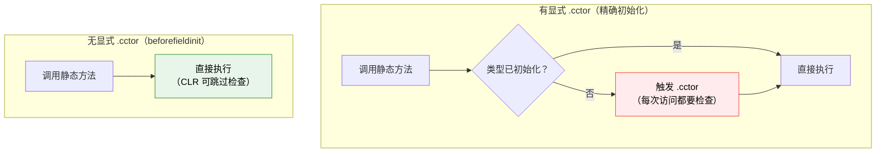

::: tip 性能建议
如果你的类型只需要静态字段初始化（不需要复杂的静态构造逻辑），**不要添加空的静态构造函数**。空的 `static MyClass() { }` 会移除 `beforefieldinit` 标志，迫使 CLR 在每次访问静态成员时都检查类型是否已初始化，这会带来微小的但可测量的性能开销。
:::

### 7.4 类型初始化触发条件

类型初始化在以下情况之一首次发生时触发：

1. 访问类型的静态字段
2. 调用类型的静态方法
3. 创建类型的实例（`new`）
4. 调用 `typeof(T)` （仅当没有 `beforefieldinit` 时）

```csharp
using System;
using System.Threading;

public class TypeInitTriggers
{
    public static readonly DateTime InitTime = DateTime.UtcNow;

    static TypeInitTriggers()
    {
        Console.WriteLine($"[Thread {Thread.CurrentThread.ManagedThreadId}] 类型初始化 @ {InitTime:HH:mm:ss.fff}");
    }

    public static void DoWork() =>
        Console.WriteLine($"[Thread {Thread.CurrentThread.ManagedThreadId}] DoWork 执行");

    public int InstanceMethod() => 42;
}

public class Demo
{
    public static void Main()
    {
        // 触发方式1：创建实例
        var obj = new TypeInitTriggers();

        // 触发方式2：调用静态方法
        TypeInitTriggers.DoWork();

        // 触发方式3：访问静态字段
        var time = TypeInitTriggers.InitTime;

        // 触发方式4：typeof（在精确初始化模式下）
        Type t = typeof(TypeInitTriggers);
    }
}
```

### 7.5 线程安全的类型初始化

CLR 保证 `.cctor` 在每个 AppDomain 中只执行一次，并且是线程安全的：

```csharp
using System;
using System.Threading;

public class LazySingleton
{
    // 利用 .cctor 的线程安全特性实现单例
    public static readonly LazySingleton Instance = new LazySingleton();

    private LazySingleton()
    {
        Console.WriteLine("单例实例化（线程安全，由 CLR 保证）");
    }
}

// 这等价于 Lazy<T> 的 LazyThreadSafetyMode.ExecutionAndPublication
```

::: warning .cctor 中的死锁风险
虽然 CLR 保证 `.cctor` 线程安全，但如果 `.cctor` 中的代码尝试等待另一个线程，而那个线程又需要访问同一类型，就会产生死锁：

```csharp
public class DeadlockExample
{
    static DeadlockExample()
    {
        // 危险！另一个线程可能在此等待，
        // 而它也需要访问 DeadlockExample
        Task.Delay(1000).Wait(); // 可能死锁
    }
}
```
:::

## 八、泛型类型的开放与封闭形态

泛型类型在 CLR 中有独特的表示方式，理解开放类型和封闭类型对掌握泛型的底层机制至关重要。

### 8.1 开放类型与封闭类型

```csharp
using System;

public class GenericTypeDemo
{
    public static void Main()
    {
        // 开放类型（Open Type）—— 包含未指定的类型参数
        Type openType = typeof(List<>);           // List`1
        Type openType2 = typeof(Dictionary<,>);   // Dictionary`2

        // 封闭类型（Closed Type）—— 所有类型参数已指定
        Type closedType = typeof(List<int>);             // List`1[Int32]
        Type closedType2 = typeof(Dictionary<string, int>); // Dictionary`2[String,Int32]

        Console.WriteLine($"开放类型: {openType.FullName}");
        Console.WriteLine($"封闭类型: {closedType.FullName}");
        Console.WriteLine($"是否包含泛型参数: {openType.ContainsGenericParameters}");
        Console.WriteLine($"是否包含泛型参数: {closedType.ContainsGenericParameters}");
    }
}
```

输出：
```
开放类型: System.Collections.Generic.List`1
封闭类型: System.Collections.Generic.List`1[[System.Int32, ...]]
是否包含泛型参数: True
是否包含泛型参数: False
```

### 8.2 泛型类型的 MethodTable 处理

CLR 对泛型类型的 MethodTable 采用共享策略，以减少内存占用：

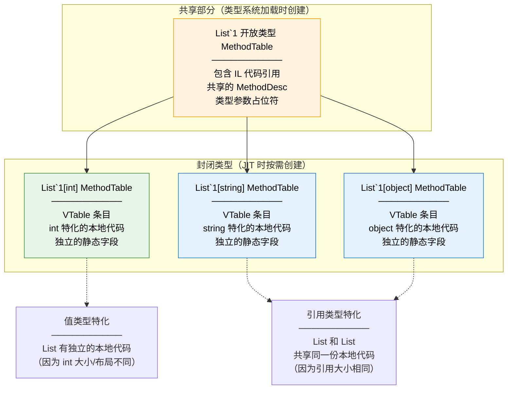

### 8.3 泛型类型的关键属性

```csharp
using System;

public class GenericTypeProperties
{
    public static void Main()
    {
        Type closedType = typeof(Dictionary<string, int>);
        Type openType = typeof(Dictionary<,>);

        // 是否为泛型类型
        Console.WriteLine($"closedType.IsGenericType: {closedType.IsGenericType}");      // True
        Console.WriteLine($"openType.IsGenericType: {openType.IsGenericType}");           // True

        // 是否为开放类型
        Console.WriteLine($"closedType.ContainsGenericParameters: {closedType.ContainsGenericParameters}");  // False
        Console.WriteLine($"openType.ContainsGenericParameters: {openType.ContainsGenericParameters}");      // True

        // 是否为泛型定义
        Console.WriteLine($"closedType.IsGenericTypeDefinition: {closedType.IsGenericTypeDefinition}");      // False
        Console.WriteLine($"openType.IsGenericTypeDefinition: {openType.IsGenericTypeDefinition}");          // True

        // 获取泛型定义
        Type defFromClosed = closedType.GetGenericTypeDefinition();
        Console.WriteLine($"是否同一个开放类型: {defFromClosed == openType}");  // True

        // 获取类型参数
        Type[] args = closedType.GetGenericArguments();
        Console.WriteLine($"类型参数: {string.Join(", ", args.Select(t => t.Name))}");
        // 输出: String, Int32

        // 从开放类型创建封闭类型
        Type constructed = openType.MakeGenericType(typeof(string), typeof(int));
        Console.WriteLine($"构造的封闭类型: {constructed == closedType}");  // True
    }
}
```

### 8.4 泛型类型的 IL 表示

```csharp
// C# 代码
public class GenericClass<T>
{
    public T Value { get; set; }

    public void Process(T input)
    {
        Value = input;
    }
}
```

```il
// IL 表示 —— 使用 !0 表示第一个类型参数
.class public auto ansi beforefieldinit GenericClass`1<T>
       extends [mscorlib]System.Object
{
    .field private !0 'Value_k__BackingField'  // !0 = T

    .method public hidebysig instance !0 get_Value() cil managed
    {
        ldarg.0
        ldfld !0 class GenericClass`1<!0>::'Value_k__BackingField'
        ret
    }

    .method public hidebysig instance void set_Value(!0 'value') cil managed
    {
        ldarg.0
        ldarg.1
        stfld !0 class GenericClass`1<!0>::'Value_k__BackingField'
        ret
    }

    .method public hidebysig instance void Process(!0 input) cil managed
    {
        ldarg.0
        ldarg.1
        call instance void class GenericClass`1<!0>::set_Value(!0)
        ret
    }
}
```

::: tip IL 中的泛型表示
在 IL 中：
- `!0`、`!1` 等表示类型参数（从0开始编号）
- `!!0`、`!!1` 等表示方法的泛型参数
- `class GenericClass`1<!0>` 是泛型类型的完整 IL 表示
- 反引号后的数字表示类型参数的个数（arity）
:::

### 8.5 泛型实例化的代码共享

CLR 对泛型实例化的代码共享策略：

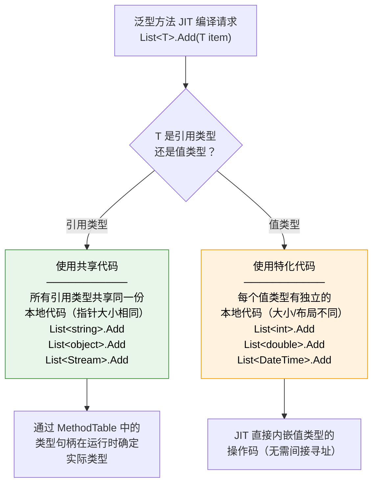

```csharp
// 代码共享的验证
using System;
using System.Collections.Generic;

public class CodeSharingDemo
{
    public static void Main()
    {
        var stringList = new List<string>();
        var objectList = new List<object>();
        var streamList = new List<System.IO.Stream>();

        // 引用类型特化共享同一份本地代码
        // List<string>、List<object>、List<Stream> 的 Add 方法
        // 使用相同的 x64 指令（只是类型句柄不同）

        var intList = new List<int>();
        var doubleList = new List<double>();

        // 值类型特化各自有独立的本地代码
        // List<int>.Add 和 List<double>.Add 的 x64 指令不同
    }
}
```

### 8.6 泛型约束的 IL 表示

```csharp
// C# 代码
public class ConstraintDemo<T>
    where T : IComparable<T>, new()
{
    public T CreateAndCompare(T a, T b)
    {
        T instance = new T();
        return a.CompareTo(b) > 0 ? a : b;
    }
}
```

```il
// IL 表示
.class public auto ansi beforefieldinit ConstraintDemo`1<
    (class [mscorlib]System.IComparable`1<!!T>, .ctor) T>
       extends [mscorlib]System.Object
{
    .method public hidebysig instance !!0 CreateAndCompare(!!0 a, !!0 b)
            cil managed
    {
        .maxstack 2
        .locals init (!!0 V_0)   // instance

        // new T() → 调用 Activator.CreateInstance<T>()
        IL_0000: call !!0 [mscorlib]System.Activator::CreateInstance<!!0>()
        IL_0005: stloc.0

        // a.CompareTo(b)
        IL_0006: ldarg.1        // a
        IL_0007: box !!T         // 如果 T 是值类型需要装箱
        IL_000c: ldarg.2         // b
        IL_000d: callvirt instance int32 class
                 [mscorlib]System.IComparable`1<!!T>::CompareTo(!0)

        // 条件判断
        IL_0012: ldc.i4.0
        IL_0013: bgt.s IL_0018
        IL_0015: ldarg.2         // b
        IL_0016: br.s IL_0019
        IL_0018: ldarg.1         // a
        IL_0019: ret
    }
}
```

## 九、实战：深入观察类型对象

### 9.1 使用 SOS/DOTNetDump 查看类型对象

```bash
# 使用 dotnet-dump 分析
dotnet tool install -g dotnet-dump
dotnet-dump collect -p <pid>
dotnet-dump analyze <dump_file>

# 在分析器中
# 查看方法表
> !dumpmt -md 00007ffe12345678

# 查看类型对象
> !dumpobj 00007ffe23456789

# 查看 EEClass
> !dumpclass 00007ffe34567890

# 查看 MethodDesc
> !dumpmd 00007ffe45678901
```

### 9.2 使用 ClrMD 编写类型分析工具

```csharp
using Microsoft.Diagnostics.Runtime;
using System;
using System.Linq;

public class TypeAnalyzer
{
    public static void Analyze(ClrRuntime runtime, string typeName)
    {
        // 查找目标类型
        ClrType? type = runtime.Heap.GetTypeByName(typeName);
        if (type == null)
        {
            Console.WriteLine($"类型 '{typeName}' 未找到");
            return;
        }

        Console.WriteLine($"=== 类型分析: {type.Name} ===");
        Console.WriteLine($"模块: {type.Module.Name}");
        Console.WriteLine($"基类: {type.BaseType?.Name ?? "null"}");
        Console.WriteLine($"实例大小: {type.BaseSize} 字节");
        Console.WriteLine($"是否值类型: {type.IsValueType}");
        Console.WriteLine($"是否接口: {type.IsInterface}");
        Console.WriteLine($"是否抽象: {type.IsAbstract}");
        Console.WriteLine($"是否泛型: {type.IsGenericType}");

        // 字段信息
        Console.WriteLine("\n--- 字段 ---");
        foreach (ClrInstanceField field in type.Fields)
        {
            Console.WriteLine($"  {field.Name}: {field.Type?.Name} " +
                $"(偏移: 0x{field.Offset:X}, 静态: {field.IsStatic})");
        }

        // 方法信息
        Console.WriteLine("\n--- 方法 ---");
        foreach (ClrMethod method in type.Methods)
        {
            Console.WriteLine($"  {method.Name}: " +
                $"Token=0x{method.MetadataToken:X8}, " +
                $"JIT={method.CompilationKind}");
        }

        // 堆上的实例统计
        int count = 0;
        long totalSize = 0;
        foreach (ClrObject obj in runtime.Heap.EnumerateObjects())
        {
            if (obj.Type == type)
            {
                count++;
                totalSize += obj.Size;
            }
        }
        Console.WriteLine($"\n--- 实例统计 ---");
        Console.WriteLine($"实例数量: {count}");
        Console.WriteLine($"总大小: {totalSize:N0} 字节");
    }
}
```

### 9.3 运行时查看 Type 对象的内部结构

```csharp
using System;
using System.Reflection;

public class TypeInternals
{
    public static void Main()
    {
        Type type = typeof(string);

        // Type 基本信息
        Console.WriteLine($"类型: {type.FullName}");
        Console.WriteLine($"程序集: {type.Assembly.FullName}");
        Console.WriteLine($"基类: {type.BaseType?.FullName}");

        // RuntimeTypeHandle
        RuntimeTypeHandle handle = type.TypeHandle;
        Console.WriteLine($"\nTypeHandle 值: 0x{handle.Value.ToString("X")}");

        // 方法信息
        Console.WriteLine("\n方法列表:");
        foreach (MethodInfo method in type.GetMethods(BindingFlags.Public | BindingFlags.Instance))
        {
            RuntimeMethodHandle mh = method.MethodHandle;
            Console.WriteLine($"  {method.Name} → MethodDesc: 0x{mh.Value.ToString("X")}");
        }

        // 字段信息
        Console.WriteLine("\n字段列表:");
        foreach (FieldInfo field in type.GetFields(BindingFlags.Public | BindingFlags.NonPublic | BindingFlags.Instance))
        {
            Console.WriteLine($"  {field.Name}: {field.FieldType.Name} (偏移: {field.MetadataToken})");
        }

        // 接口信息
        Console.WriteLine("\n实现的接口:");
        foreach (Type iface in type.GetInterfaces())
        {
            Console.WriteLine($"  {iface.FullName}");
        }
    }
}
```

## 十、总结

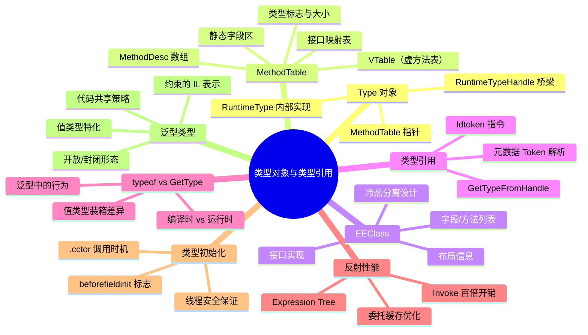

::: important 关键要点回顾
1. **Type 对象**在运行时是 `RuntimeType` 实例，通过 `RuntimeTypeHandle` 桥接到非托管的 `MethodTable`
2. **MethodTable** 是类型系统的核心数据结构，包含 VTable、接口映射、方法描述符和静态字段
3. **EEClass** 与 MethodTable 采用冷热分离设计，EEClass 存储反射等冷路径数据
4. **typeof** 使用 `ldtoken` + `GetTypeFromHandle`，编译时确定；**GetType** 使用虚方法调用，运行时确定
5. **反射调用**比直接调用慢 100-200 倍，但通过委托缓存可以优化到接近直接调用的性能
6. **beforefieldinit** 标志影响 `.cctor` 的调用时机和性能，空的静态构造函数会移除此标志
7. **泛型类型**在 CLR 中有开放和封闭两种形态，引用类型特化共享代码，值类型特化生成独立代码
:::

---

**参考资料**

- Jeffrey Richter.《CLR via C#》第4版, Chapter 4 "Type Fundamentals". Microsoft Press, 2012.
- ECMA-335. Partition II "Metadata Definition and Semantics", §22-23. 2012.
- Konrad Kokosa.《Pro .NET Memory Management》, Chapter 3 "Type Internals". Apress, 2018.
- dotnet/runtime 源码. `src/coreclr/vm/methodtable.cpp`, `src/coreclr/vm/eeclass.cpp`.
- Sasha Goldshtein.《Pro .NET 4 Performance》. Apress, 2011.
