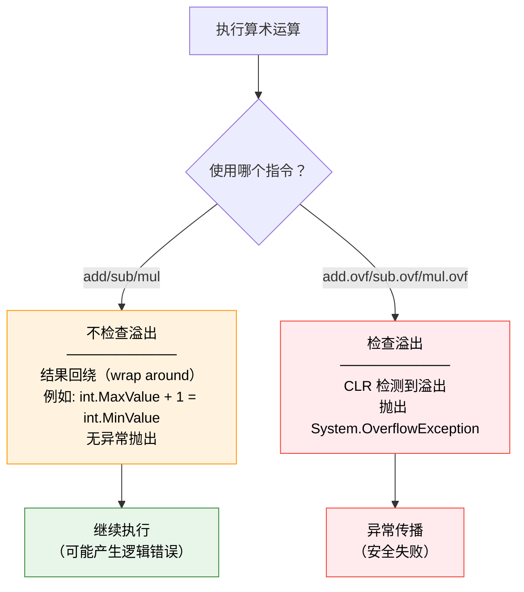
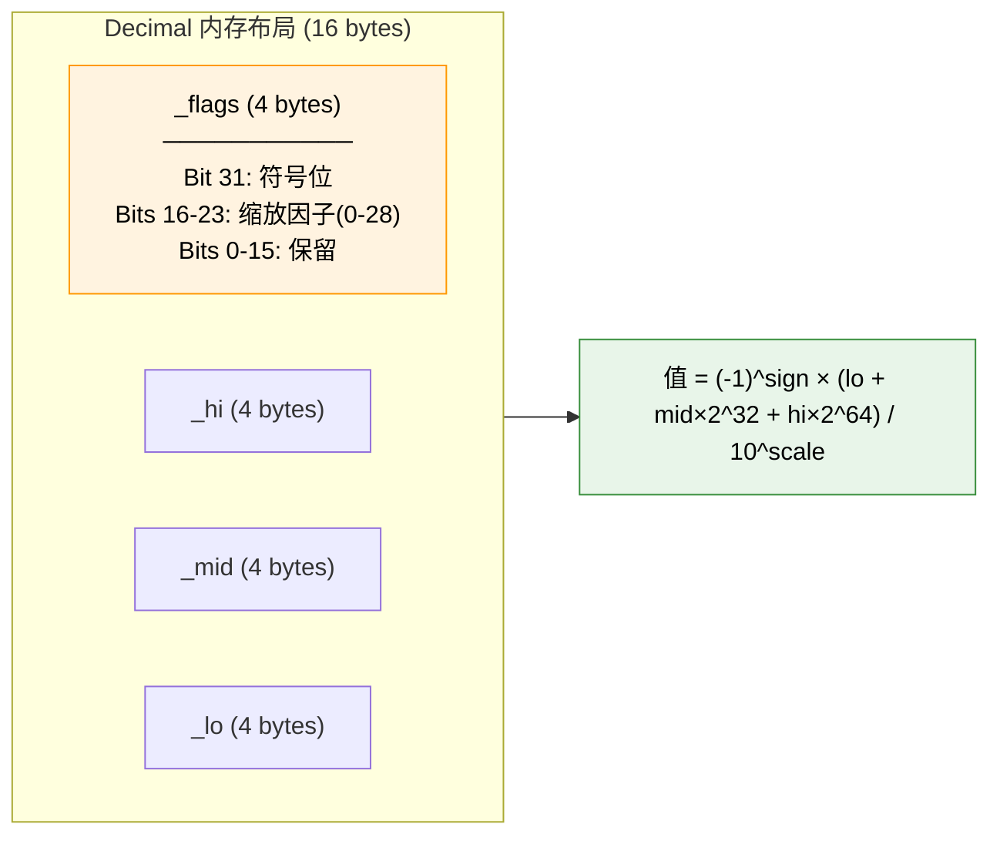
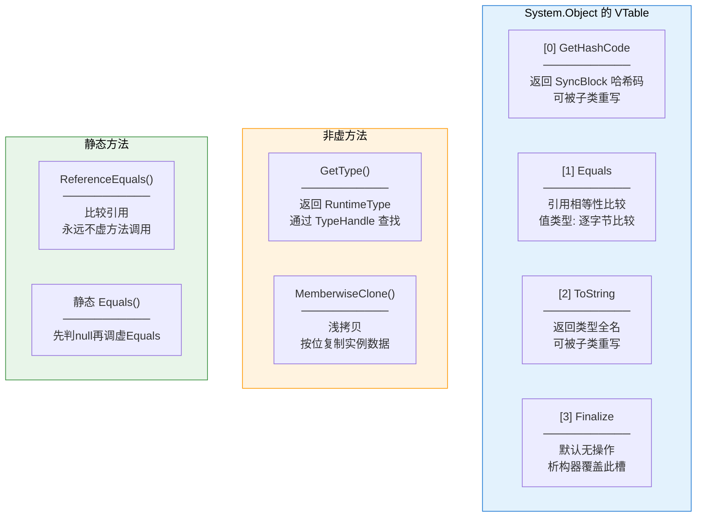
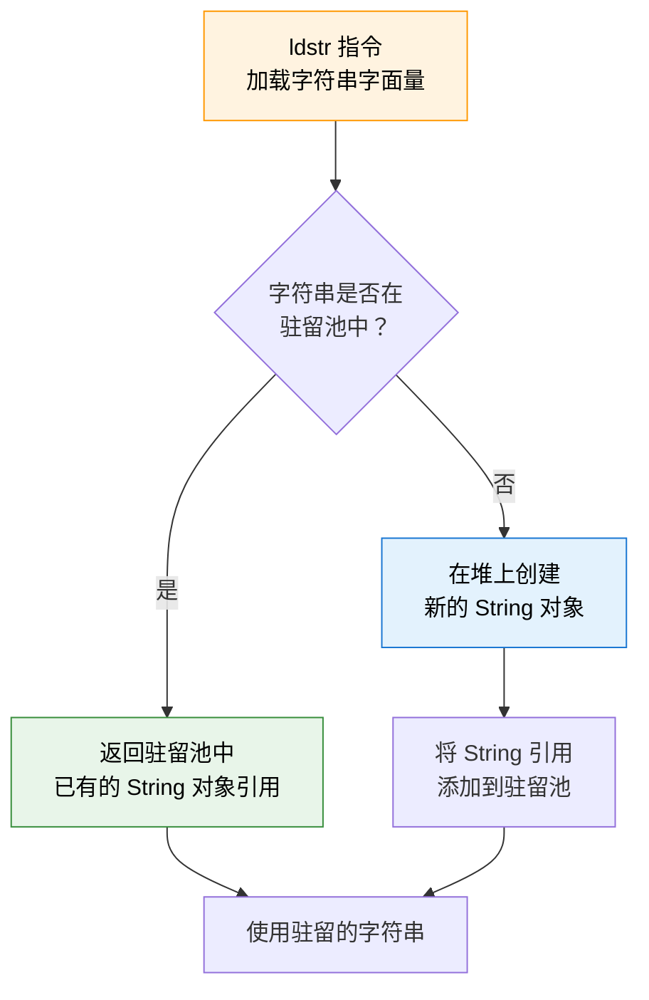
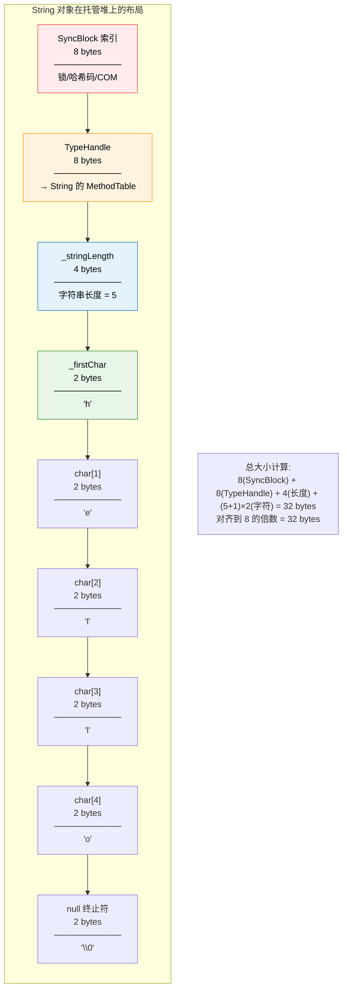
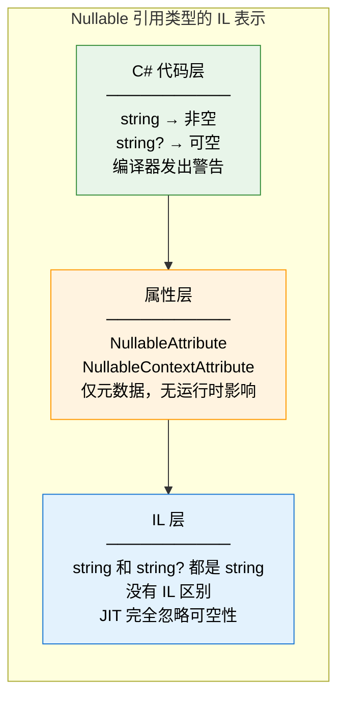
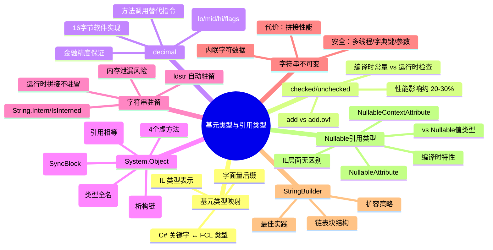

# 基元类型与引用类型

::: important 核心问题
C# 中的 `int` 和 `System.Int32` 是同一个东西吗？`checked` 算术溢出检查在 IL 层面如何实现？`string` 为什么是不可变的？字符串驻留池到底驻留了什么？Nullable 引用类型在 IL 中留下了什么痕迹？
:::

## 一、C# 基元类型与 FCL 类型映射

C# 编译器允许直接使用语言关键字（如 `int`、`bool`）来表示类型，这些关键字称为 **基元类型（Primitive Types）**。每个基元类型都直接映射到 BCL/FCL 中的一个具体类型。

### 1.1 完整映射表

| C# 关键字 | FCL 类型 | IL 类型 | 大小(字节) | 范围 | CLS 合规 |
|-----------|---------|---------|-----------|------|---------|
| `bool` | System.Boolean | `bool` | 1 | true/false | ✅ |
| `byte` | System.Byte | `unsigned int8` | 1 | 0 ~ 255 | ✅ |
| `sbyte` | System.SByte | `int8` | 1 | -128 ~ 127 | ❌ |
| `char` | System.Char | `char` | 2 | U+0000 ~ U+FFFF | ✅ |
| `short` | System.Int16 | `int16` | 2 | -32768 ~ 32767 | ✅ |
| `ushort` | System.UInt16 | `unsigned int16` | 2 | 0 ~ 65535 | ❌ |
| `int` | System.Int32 | `int32` | 4 | -2^31 ~ 2^31-1 | ✅ |
| `uint` | System.UInt32 | `unsigned int32` | 4 | 0 ~ 2^32-1 | ❌ |
| `long` | System.Int64 | `int64` | 8 | -2^63 ~ 2^63-1 | ✅ |
| `ulong` | System.UInt64 | `unsigned int64` | 8 | 0 ~ 2^64-1 | ❌ |
| `float` | System.Single | `float32` | 4 | ±1.5×10^-45 ~ ±3.4×10^38 | ✅ |
| `double` | System.Double | `float64` | 8 | ±5.0×10^-324 ~ ±1.7×10^308 | ✅ |
| `decimal` | System.Decimal | `valuetype [System.Runtime]System.Decimal` | 16 | ±1.0×10^-28 ~ ±7.9×10^28 | ✅ |
| `string` | System.String | `string` | 变长 | — | ✅ |
| `object` | System.Object | `object` | 8(引用) | — | ✅ |
| `nint` | System.IntPtr | `native int` | 4/8 | 平台相关 | ✅ |
| `nuint` | System.UIntPtr | `unsigned native int` | 4/8 | 平台相关 | ❌ |

::: tip int 和 System.Int32 的关系
在 C# 中，`int` 只是一个编译器别名，编译后完全等价于 `System.Int32`。两者没有性能差异，选择使用哪个纯粹是编码风格问题。一般建议：C# 代码中使用关键字（`int`、`string`），在涉及 FCL 类型名的方法调用中使用 FCL 名称（如 `Int32.Parse`）。
:::

### 1.2 基元类型的 IL 证明

```csharp
// C# 代码
public class PrimitiveMapping
{
    public int IntField;
    public System.Int32 Int32Field;

    public void Assign()
    {
        IntField = 42;
        Int32Field = 42;
    }
}
```

```il
// IL 代码 —— 两者完全相同
.field public int32 IntField
.field public int32 Int32Field

.method public hidebysig instance void Assign() cil managed
{
    .maxstack 8
    IL_0000: ldarg.0
    IL_0001: ldc.i4.s 42
    IL_0003: stfld int32 PrimitiveMapping::IntField
    IL_0008: ldarg.0
    IL_0009: ldc.i4.s 42
    IL_000b: stfld int32 PrimitiveMapping::Int32Field
    IL_0010: ret
}
```

### 1.3 基元类型的字面量后缀

C# 编译器通过字面量后缀来确定常量的精确类型：

```csharp
public class LiteralSuffixDemo
{
    public static void Main()
    {
        // 整数字面量
        int i = 42;              // int (Int32)
        uint ui = 42U;           // uint (UInt32)
        long l = 42L;            // long (Int64)
        ulong ul = 42UL;         // ulong (UInt64)

        // 浮点字面量
        float f = 3.14f;         // float (Single)
        double d = 3.14;         // double (Double) — 默认
        decimal m = 3.14m;       // decimal (Decimal)

        // 十六进制字面量
        int hex = 0xFF;          // int
        uint uhex = 0xFFu;       // uint

        // 二进制字面量 (C# 7+)
        int bin = 0b10101010;    // int
    }
}
```

```il
// 各字面量的 IL 加载指令
IL_0000: ldc.i4.s 42        // int 42
IL_0002: ldc.i4 42          // uint 42 (相同操作码，类型由上下文决定)
IL_0007: ldc.i4.s 42        // long 42 (后续有 conv.i8)
IL_0009: conv.i8            // 转为 int64
IL_000a: ldc.i4 42          // ulong 42 (后续有 conv.u8)
IL_000f: conv.u8            // 转为 unsigned int64
IL_0010: ldc.r4 3.14        // float32
IL_0015: ldc.r8 3.14        // float64
IL_001e: ldc.i4.s 42        // decimal (后续调用 Decimal 构造函数)
IL_0020: newobj instance void [System.Runtime]System.Decimal::.ctor(int32)
```

## 二、checked/unchecked 与溢出检查

CLR 提供了两套算术指令：带溢出检查和不带溢出检查的。C# 通过 `checked`/`unchecked` 关键字来选择使用哪一套。

### 2.1 溢出检查指令对比

| 操作 | 不检查溢出 | 检查溢出 |
|------|-----------|---------|
| 加法 | `add` | `add.ovf` |
| 减法 | `sub` | `sub.ovf` |
| 乘法 | `mul` | `mul.ovf` |
| 有符号转换 | `conv.i1/i2/i4/i8` | `conv.ovf.i1/i2/i4/i8` |
| 无符号转换 | `conv.u1/u2/u4/u8` | `conv.ovf.u1/u2/u4/u8` |

### 2.2 checked/unchecked 的 IL 体现

```csharp
public class OverflowDemo
{
    // unchecked（默认行为）
    public int UncheckedAdd(int a, int b)
    {
        return a + b;
    }

    // checked
    public int CheckedAdd(int a, int b)
    {
        checked
        {
            return a + b;
        }
    }

    // 常量溢出
    public int ConstantOverflow()
    {
        unchecked
        {
            return int.MaxValue + 1;  // 编译时计算，结果为 -2147483648
        }
    }

    // checked 常量溢出 → 编译错误！
    // public int CheckedConstantOverflow()
    // {
    //     checked { return int.MaxValue + 1; }  // CS0220: 运算在 checked 模式下溢出
    // }
}
```

```il
// UncheckedAdd —— 使用 add 指令（不检查溢出）
.method public hidebysig instance int32 UncheckedAdd(int32 a, int32 b) cil managed
{
    .maxstack 2
    IL_0000: ldarg.1
    IL_0001: ldarg.2
    IL_0002: add              // ← 不检查溢出！
    IL_0003: ret
}

// CheckedAdd —— 使用 add.ovf 指令（检查溢出）
.method public hidebysig instance int32 CheckedAdd(int32 a, int32 b) cil managed
{
    .maxstack 2
    IL_0000: ldarg.1
    IL_0001: ldarg.2
    IL_0002: add.ovf          // ← 检查溢出！溢出时抛出 OverflowException
    IL_0003: ret
}

// ConstantOverflow —— 编译时计算
.method public hidebysig instance int32 ConstantOverflow() cil managed
{
    .maxstack 1
    IL_0000: ldc.i4 0x80000000    // ← 编译时已计算为 -2147483648
    IL_0005: ret
}
```

### 2.3 溢出行为的详细流程



### 2.4 checked 的性能影响

```csharp
using System;
using BenchmarkDotNet.Attributes;

[MemoryDiagnoser]
public class CheckedUncheckedBenchmark
{
    private const int Iterations = 100_000_000;

    [Benchmark(Baseline = true)]
    public int UncheckedLoop()
    {
        int sum = 0;
        for (int i = 0; i < Iterations; i++)
        {
            sum += i;  // add
        }
        return sum;
    }

    [Benchmark]
    public int CheckedLoop()
    {
        int sum = 0;
        for (int i = 0; i < Iterations; i++)
        {
            checked { sum += i; }  // add.ovf
        }
        return sum;
    }
}
```

典型结果：
```
| Method         | Mean       | Ratio |
|--------------- |-----------:|------:|
| UncheckedLoop  |   85.3 ms  |  1.00 |
| CheckedLoop    |  110.7 ms  |  1.30 |
```

::: important checked 的性能代价
`add.ovf` 比 `add` 慢约 20-30%，因为 CLR 需要额外的条件判断来检测溢出。在性能关键的热路径中，应确保使用 `unchecked` 上下文。但默认使用 `checked`（在项目级别设置）可以防止难以调试的溢出 bug，这是一个值得权衡的工程决策。
:::

## 三、decimal 的特殊处理

`System.Decimal` 在 CLR 中有独特地位——它不是直接由 CPU 硬件支持的类型，而是完全由软件实现的高精度十进制浮点数。

### 3.1 Decimal 的内部结构

```csharp
// System.Decimal 的内部表示（来自 .NET 源码）
public struct Decimal
{
    // Decimal = lo + mid * 2^32 + hi * 2^64) / 10^scale * sign
    private int _flags;      // 高16位: sign(1位) + scale(4-8位), 低16位保留
    private int _hi;         // 高32位
    private int _lo;         // 低32位
    private int _mid;        // 中32位
}
// 总大小: 16 字节 (4 × 4)
```



### 3.2 Decimal 的 IL 运算

Decimal 的运算没有专用的 IL 指令，而是通过方法调用来实现：

```csharp
public class DecimalDemo
{
    public static decimal Add(decimal a, decimal b)
    {
        return a + b;
    }
}
```

```il
.method public hidebysig static valuetype [System.Runtime]System.Decimal
    Add(valuetype [System.Runtime]System.Decimal a,
        valuetype [System.Runtime]System.Decimal b) cil managed
{
    .maxstack 3
    IL_0000: ldarga.s a
    IL_0002: ldarga.s b
    IL_0004: call valuetype [System.Runtime]System.Decimal
        [System.Runtime]System.Decimal::op_Addition(
            valuetype [System.Runtime]System.Decimal,
            valuetype [System.Runtime]System.Decimal)
    IL_0009: ret
}
```

::: warning Decimal 的性能代价
Decimal 的所有运算都是软件实现的方法调用，不像 `int`/`double` 那样有 CPU 原生指令支持。Decimal 的加减乘除比 `double` 慢约 10-100 倍。只在需要精确十进制表示（如金融计算）时才使用 Decimal。
:::

### 3.3 Decimal vs Double 的精度对比

```csharp
using System;

public class PrecisionDemo
{
    public static void Main()
    {
        // double 的精度问题
        double d1 = 0.1 + 0.2;
        Console.WriteLine($"double: 0.1 + 0.2 = {d1}");     // 0.30000000000000004
        Console.WriteLine($"double == 0.3: {d1 == 0.3}");    // False

        // decimal 的精确计算
        decimal m1 = 0.1m + 0.2m;
        Console.WriteLine($"decimal: 0.1m + 0.2m = {m1}");   // 0.3
        Console.WriteLine($"decimal == 0.3m: {m1 == 0.3m}"); // True

        // double 的大数值精度损失
        double d2 = 1e20 + 1;
        Console.WriteLine($"double: 1e20 + 1 = {d2}");       // 1e20（1被丢失）

        // decimal 不会丢失
        decimal m2 = 1e20m + 1m;
        Console.WriteLine($"decimal: 1e20m + 1m = {m2}");    // 100000000000000000001
    }
}
```

## 四、System.Object 的本质

`System.Object` 是所有类型的根基类。了解它的方法和 IL 实现是理解 .NET 类型系统的关键。

### 4.1 Object 的四个虚方法

```csharp
namespace System
{
    public class Object
    {
        // 1. 获取哈希码
        public virtual int GetHashCode() { ... }

        // 2. 相等性比较
        public virtual bool Equals(object? obj) { ... }

        // 3. 字符串表示
        public virtual string? ToString() { ... }

        // 4. 析构器（C# 中通过 ~MyClass() 语法定义）
        ~Object() { ... }  // 即 protected virtual void Finalize()

        // 非虚方法
        public Type GetType() { ... }

        // 静态方法
        public static bool Equals(object? objA, object? objB) { ... }
        public static bool ReferenceEquals(object? objA, object? objB) { ... }

        // 受保护方法
        protected object MemberwiseClone() { ... }
    }
}
```

### 4.2 各虚方法的默认实现与 IL

**GetHashCode()**：

```csharp
// Object.GetHashCode 的默认实现
// 返回对象的同步块索引作为哈希码
public virtual int GetHashCode()
{
    // 内部实现: return RuntimeHelpers.GetHashCode(this);
    // 使用对象头的哈希码字段，与 SyncBlock 共享存储
}
```

```il
// 调用 Object.GetHashCode 的 IL
IL_0000: ldarg.0
IL_0001: callvirt instance int32 [System.Runtime]System.Object::GetHashCode()
```

```csharp
// RuntimeHelpers.GetHashCode 的行为
using System;
using System.Runtime.CompilerServices;

public class HashCodeDemo
{
    public static void Main()
    {
        var obj = new object();

        // Object.GetHashCode 的默认实现
        int hash1 = obj.GetHashCode();

        // RuntimeHelpers.GetHashCode — 即使重写了 GetHashCode 也能获取原始哈希
        int hash2 = RuntimeHelpers.GetHashCode(obj);

        // 两者默认相同（都基于 SyncBlock 中的哈希码）
        Console.WriteLine($"GetHashCode: {hash1}");
        Console.WriteLine($"RuntimeHelpers.GetHashCode: {hash2}");
        Console.WriteLine($"相同: {hash1 == hash2}");

        // 但如果类型重写了 GetHashCode：
        var str = "hello";
        int strHash1 = str.GetHashCode();              // 字符串内容的哈希
        int strHash2 = RuntimeHelpers.GetHashCode(str); // 对象标识的哈希
        Console.WriteLine($"String.GetHashCode: {strHash1}");
        Console.WriteLine($"RuntimeHelpers.GetHashCode: {strHash2}");
        Console.WriteLine($"相同: {strHash1 == strHash2}"); // 可能不同！
    }
}
```

**Equals()**：

```csharp
// Object.Equals 的默认实现 — 引用相等性
public virtual bool Equals(object? obj)
{
    return RuntimeHelpers.Equals(this, obj);
}

// RuntimeHelpers.Equals 内部实现:
// 对于引用类型: 比较引用是否相同 (this == obj)
// 对于值类型: 逐字节比较
```

```csharp
using System;

public class EqualsDemo
{
    public static void Main()
    {
        // 引用类型 — 默认比较引用
        var obj1 = new object();
        var obj2 = new object();
        var obj3 = obj1;

        Console.WriteLine($"obj1.Equals(obj2): {obj1.Equals(obj2)}"); // False
        Console.WriteLine($"obj1.Equals(obj3): {obj1.Equals(obj3)}"); // True

        // 值类型 — 逐字节比较
        int a = 42, b = 42;
        Console.WriteLine($"a.Equals(b): {a.Equals(b)}"); // True

        // 字符串 — 重写了 Equals，比较内容
        string s1 = "hello";
        string s2 = "hello";
        Console.WriteLine($"s1.Equals(s2): {s1.Equals(s2)}");     // True
        Console.WriteLine($"ReferenceEquals(s1, s2): {ReferenceEquals(s1, s2)}"); // True（驻留池）
    }
}
```

**ToString()**：

```csharp
// Object.ToString 的默认实现 — 返回类型全名
public virtual string? ToString()
{
    return GetType().ToString();
}
```

```csharp
using System;

public class ToStringDemo
{
    public static void Main()
    {
        var obj = new object();
        Console.WriteLine(obj.ToString()); // "System.Object"

        var list = new System.Collections.Generic.List<int>();
        Console.WriteLine(list.ToString()); // "System.Collections.Generic.List`1[System.Int32]"
    }
}
```

**Finalize()**：

```csharp
// Object.Finalize 的默认实现 — 什么也不做
// C# 中通过 ~ClassName() 语法定义
// IL 中映射为 Finalize 方法

public class FinalizeDemo
{
    // C# 析构器语法
    ~FinalizeDemo()
    {
        // 清理非托管资源
    }
}
```

```il
// C# 析构器生成的 Finalize 方法
.method family hidebysig virtual instance void Finalize() cil managed
{
    .maxstack 1
    .try
    {
        IL_0000: leave.s IL_0010
    }
    finally
    {
        IL_0002: ldarg.0
        IL_0003: call instance void [System.Runtime]System.Object::Finalize()
        IL_0008: endfinally
    }
    IL_0010: ret
}
```

### 4.3 Object 虚方法的方法表位置



## 五、字符串驻留池

字符串是 .NET 中最特殊的引用类型之一。CLR 通过字符串驻留池（String Intern Pool）机制来确保相同内容的字符串共享同一个实例。

### 5.1 字符串驻留的工作原理



### 5.2 ldstr 指令与驻留

```csharp
using System;

public class StringInternDemo
{
    public static void Main()
    {
        // 字符串字面量 —— 自动驻留
        string s1 = "hello";
        string s2 = "hello";
        Console.WriteLine($"字面量同一性: {ReferenceEquals(s1, s2)}"); // True

        // 运行时构造的字符串 —— 不自动驻留
        string s3 = "hel" + "lo";           // 编译时常量拼接 → 驻留
        string s4 = "hel" + GetString();     // 运行时拼接 → 不驻留
        Console.WriteLine($"编译时拼接: {ReferenceEquals(s1, s3)}"); // True
        Console.WriteLine($"运行时拼接: {ReferenceEquals(s1, s4)}"); // False

        // 手动驻留
        string s5 = string.Intern(s4);
        Console.WriteLine($"手动驻留: {ReferenceEquals(s1, s5)}"); // True
    }

    static string GetString() => "lo";
}
```

```il
// ldstr 指令 —— 自动驻留
IL_0001: ldstr "hello"           // 从用户字符串元数据表(#US)加载
// CLR 检查驻留池，如果 "hello" 已存在则返回现有引用

// 编译时常量拼接 —— 等价于 ldstr "hello"
IL_0010: ldstr "hello"           // 编译器已将 "hel" + "lo" 优化为 "hello"

// 运行时拼接 —— 调用 String.Concat
IL_0020: ldstr "hel"
IL_0025: call string ConsoleApp.Program::GetString()
IL_002a: call string [System.Runtime]System.String::Concat(string, string)
// 结果不会自动驻留！

// 手动驻留 —— 调用 String.Intern
IL_0030: call string [System.Runtime]System.String::Intern(string)
```

### 5.3 驻留池的内部结构

```mermaid
flowchart TB
    subgraph InternPool["字符串驻留池（全局哈希表）"]
        direction TB
        HASH["哈希表桶数组<br/>───────────<br/>每个桶存储一个<br/>String 对象引用"]

        B1["桶 0: null"]
        B2["桶 1: → \"hello\" (0x1234)"]
        B3["桶 2: → \"world\" (0x5678)"]
        B4["桶 3: null"]
        B5["桶 4: → \"hello\" 冲突链 → \"help\" (0xABCD)"]
    end

    subgraph ManagedHeap["托管堆"]
        S1["String @ 0x1234<br/>───────────<br/>长度: 5<br/>字符: h,e,l,l,o"]
        S2["String @ 0x5678<br/>───────────<br/>长度: 5<br/>字符: w,o,r,l,d"]
        S3["String @ 0xABCD<br/>───────────<br/>长度: 4<br/>字符: h,e,l,p"]
    end

    B2 --> S1
    B3 --> S2
    B5 --> S1
    B5 --> S3

    style InternPool fill:#fff3e0,stroke:#ff9800,color:#000
    style ManagedHeap fill:#e8f5e9,stroke:#388e3c,color:#000
```

### 5.4 字符串驻留的注意事项

```csharp
using System;

public class InternCaveats
{
    public static void Main()
    {
        // 注意1：驻留池中的字符串不会被 GC 回收
        // 驻留池持有强引用，即使没有其他引用也不会被回收
        string temp = new string('x', 1000000); // 1M字符
        string interned = string.Intern(temp);
        temp = null; // temp 被回收
        // 但 interned 仍然引用驻留池中的 1M 字符串，永远不会被 GC！

        // 注意2：Intern 的性能代价
        // string.Intern 需要计算哈希并查找驻留池
        // 对于一次性使用的字符串，Intern 是负优化

        // 注意3：IsInterned 检查
        string check = string.IsInterned("test"); // 已驻留则返回引用
        if (check != null)
        {
            Console.WriteLine("字符串已驻留");
        }
    }
}
```

::: warning 驻留池的内存泄漏风险
字符串驻留池在整个进程生命周期内持有所有驻留字符串的强引用。如果你使用 `string.Intern()` 驻留了动态生成的大量不同字符串（如用户输入），这些字符串将永远不会被 GC 回收，可能导致内存持续增长。对于动态字符串，通常不建议手动驻留。
:::

## 六、字符串的不可变性与安全

### 6.1 String 的内部结构

```csharp
// System.String 的内部结构（简化）
public sealed class String
{
    // 字段布局:
    // [SyncBlock 索引]     8 bytes (64位)
    // [TypeHandle]          8 bytes → System.String 的 MethodTable
    // _stringLength         4 bytes (int)
    // _firstChar            2 bytes (char) → 后续字符紧跟其后

    private readonly int _stringLength;       // 字符串长度
    private readonly char _firstChar;          // 第一个字符（实际字符数组内联）

    // 字符数据紧跟在 _firstChar 之后，紧密排列
    // char[0] = _firstChar
    // char[1] = *(&_firstChar + 1)
    // ...
    // 最后以 null char (\0) 结尾（便于与本地代码互操作）
}
```

### 6.2 字符串的内存布局



### 6.3 不可变性的安全保障

```csharp
using System;
using System.Threading;

public class StringSafetyDemo
{
    // 安全1：字符串可以作为字典键而不担心被修改
    private static readonly System.Collections.Generic.Dictionary<string, int> s_cache = new();

    // 安全2：字符串在多线程间共享无需同步
    public static void ThreadSafeString()
    {
        string shared = "constant";

        for (int i = 0; i < 10; i++)
        {
            ThreadPool.QueueUserWorkItem(_ =>
            {
                // 安全：字符串不可变，无需加锁
                Console.WriteLine(shared.Length);
            });
        }
    }

    // 安全3：字符串参数不会被意外修改
    public static void ProcessName(string name)
    {
        // name 不会被调用者修改
        // 如果 name 是 StringBuilder，则需要同步
    }
}
```

### 6.4 不可变性的代价

```csharp
using System;
using BenchmarkDotNet.Attributes;

[MemoryDiagnoser]
public class StringConcatBenchmark
{
    [Benchmark]
    public string StringConcat()
    {
        string result = "";
        for (int i = 0; i < 100; i++)
        {
            result += i.ToString(); // 每次创建新字符串！
        }
        return result;
    }

    [Benchmark]
    public string StringBuilderConcat()
    {
        var sb = new System.Text.StringBuilder();
        for (int i = 0; i < 100; i++)
        {
            sb.Append(i.ToString()); // 追加到同一缓冲区
        }
        return sb.ToString();
    }
}
```

典型结果：
```
| Method              | Mean       | Allocated |
|-------------------- |-----------:|----------:|
| StringConcat        | 15.234 μs  |   28.6 KB |
| StringBuilderConcat |  2.345 μs  |    3.2 KB |
```

## 七、StringBuilder 原理

`StringBuilder` 是 .NET 提供的高效字符串构建器，它通过预分配可变缓冲区来避免字符串的重复创建。

### 7.1 StringBuilder 的内部结构

```csharp
// StringBuilder 的核心实现（简化）
public sealed class StringBuilder
{
    private char[] m_ChunkChars;          // 当前块的字符缓冲区
    private StringBuilder? m_ChunkPrevious; // 前一个块（链表结构）
    private int m_ChunkLength;            // 当前块已使用的字符数
    private int m_ChunkOffset;            // 当前块在完整字符串中的偏移
    private int m_MaxCapacity;            // 最大容量

    // 默认容量: 16 字符
    // 扩容策略: 新块容量 = max(所需容量, 当前块容量 × 2)
}
```

### 7.2 StringBuilder 的链表结构

```mermaid
flowchart LR
    subgraph SB["StringBuilder 内部结构（链表块）"]
        direction LR

        Chunk2["当前块<br/>───────────<br/>m_ChunkChars[32]<br/>m_ChunkLength: 10<br/>m_ChunkOffset: 26<br/>← 'W','o','r','l','d'"]

        Chunk1["中间块<br/>───────────<br/>m_ChunkChars[16]<br/>m_ChunkLength: 16<br/>m_ChunkOffset: 10<br/>← ',' ' ' "]

        Chunk0["初始块<br/>───────────<br/>m_ChunkChars[16]<br/>m_ChunkLength: 10<br/>m_ChunkOffset: 0<br/>← 'H','e','l','l','o'"]
    end

    Chunk2 --> |"m_ChunkPrevious"| Chunk1
    Chunk1 --> |"m_ChunkPrevious"| Chunk0

    note1["完整字符串: \"Hello, World\"<br/>总长度 = Chunk2.Offset + Chunk2.Length<br/>= 26 + 10 = 36"]

    style Chunk2 fill:#e8f5e9,stroke:#388e3c,color:#000
    style Chunk1 fill:#fff3e0,stroke:#ff9800,color:#000
    style Chunk0 fill:#e3f2fd,stroke:#1976d2,color:#000
```

### 7.3 StringBuilder 的 Append 和 ToString

```csharp
using System;
using System.Text;

public class StringBuilderDemo
{
    public static void Main()
    {
        var sb = new StringBuilder(16); // 初始容量 16

        // Append —— 在当前块的缓冲区中写入
        sb.Append("Hello");    // 5 chars, 块0: [H,e,l,l,o,_,_,_,_,_,_,_,_,_,_,_]

        // Append 继续填充
        sb.Append(", World");  // 8 chars, 块0: [H,e,l,l,o,,, ,W,o,r,l,d,_,_,_,_]

        // 如果当前块空间不足，创建新块
        sb.Append(" - This is a longer string that exceeds the chunk");
        // 新块1被创建，块0通过链表保留

        // ToString —— 从链表尾部向前遍历，拷贝所有字符到新字符串
        string result = sb.ToString();
        Console.WriteLine(result);
    }
}
```

```csharp
// StringBuilder.ToString 的实现（简化）
public override string ToString()
{
    int length = m_ChunkOffset + m_ChunkLength;
    if (length == 0) return string.Empty;

    // 分配新字符串
    string result = string.FastAllocateString(length);
    // 从链表尾部向前拷贝
    StringBuilder? chunk = this;
    while (chunk != null)
    {
        // 将当前块的字符拷贝到 result 中
        Buffer.Memmove(
            ref result.GetRawStringData() + chunk.m_ChunkOffset,
            ref chunk.m_ChunkChars[0],
            chunk.m_ChunkLength);
        chunk = chunk.m_ChunkPrevious;
    }
    return result;
}
```

::: tip StringBuilder 最佳实践
1. **预分配容量**：如果你知道最终字符串的大致长度，使用 `new StringBuilder(capacity)` 避免扩容
2. **复用 StringBuilder**：对于频繁构建字符串的场景，可以使用 `ObjectPool&lt;StringBuilder&gt;` 或 `sb.Clear()` 复用
3. **设置最大容量**：使用 `new StringBuilder(capacity, maxCapacity)` 防止意外的大内存分配
4. **避免链表碎片**：如果 Append 量很大且不可预估，链表可能产生很多小块。可以在关键节点调用 `sb.Capacity = sb.Length` 来强制合并
:::

## 八、Nullable 引用类型

C# 8.0 引入了 Nullable 引用类型（NRT），这是一个编译时特性，通过元数据属性在 IL 中留下痕迹。

### 8.1 Nullable 引用类型的 IL 表示

```csharp
// C# 代码（启用 #nullable enable）
#nullable enable
public class NullableReferenceDemo
{
    public string Name;           // 非空引用类型
    public string? Nickname;      // 可空引用类型

    public void Process(string required, string? optional)
    {
        // required 不应为 null（编译器警告）
        // optional 可以为 null
    }
}
```

```il
// IL 代码 —— Nullable 引用类型通过自定义属性标记
.class public auto ansi beforefieldinit NullableReferenceDemo
       extends [System.Runtime]System.Object
{
    // 字段声明 —— 类型相同，都是 string
    .field public string Name
    .field public string Nickname

    // 方法签名 —— 参数类型也是 string
    .method public hidebysig instance void Process(string required,
                                                   string optional) cil managed
    {
        // IL 层面没有可空/非空的区别！
        .maxstack 8
        IL_0000: ret
    }
}
```

```csharp
// 元数据中的 NullableAttribute 和 NullableContextAttribute
// 这些属性是编译器生成的，用于工具链（如 Roslyn 分析器）读取

// 类型级别: [NullableContextAttribute(1)] → 默认非空
// 1 = NotNull, 2 = Nullable, 0 = Oblivious

// 字段级别:
// Name: 隐式 [Nullable(1)] → 非空
// Nickname: [Nullable(2)] → 可空

// 方法参数级别:
// required: [Nullable(1)] → 非空
// optional: [Nullable(2)] → 可空
```

### 8.2 NullableAttribute 的结构



### 8.3 NullableContextAttribute 和 NullableAttribute

```csharp
// 编译器生成的属性（来自 .NET 源码）
namespace System.Runtime.CompilerServices
{
    // 类型/方法级别的可空上下文
    [AttributeUsage(AttributeTargets.Class | AttributeTargets.Method |
                    AttributeTargets.Property | AttributeTargets.Struct,
                    Inherited = false)]
    public sealed class NullableContextAttribute : Attribute
    {
        public NullableContextAttribute(byte flag) => Flag = flag;
        public byte Flag { get; }  // 1=NotNull, 2=Nullable, 0=Oblivious
    }

    // 参数/返回值/字段级别的可空性
    [AttributeUsage(AttributeTargets.Field | AttributeTargets.Parameter |
                    AttributeTargets.Property | AttributeTargets.ReturnValue,
                    Inherited = false)]
    public sealed class NullableAttribute : Attribute
    {
        public NullableAttribute(byte flag) => NullableFlags = new[] { flag };
        public NullableAttribute(byte[] flags) => NullableFlags = flags;
        public byte[] NullableFlags { get; }
    }
}
```

### 8.4 Nullable 引用类型的完整示例

```csharp
#nullable enable
using System;
using System.Runtime.CompilerServices;

public class NullableDeepDive
{
    // 编译器生成:
    // [NullableContext(1)] → 类型默认上下文: 非空
    // [Nullable(new byte[]{ 2 })] → Nickname 字段: 可空
    public string Name = "Default";
    public string? Nickname;

    // 编译器生成:
    // 方法参数: [Nullable(1)] required → 非空
    //           [Nullable(2)] optional → 可空
    // 返回值: [Nullable(2)] → 可空
    [return: MaybeNull]
    public string? FindName(string required, string? optional)
    {
        if (optional != null)
        {
            return optional;
        }
        return null;
    }

    // 泛型类型的可空性
    public T? GetOrDefault<T>(T value) where T : struct
    {
        // T? 对于值类型 → Nullable<T>
        // T? 对于引用类型 → T with NullableAttribute
        return default;
    }
}
```

### 8.5 Nullable 值类型 vs Nullable 引用类型的 IL 差异

```csharp
using System;

public class NullableComparison
{
    // Nullable 值类型 — 有独立的 IL 类型
    public int? NullableInt;

    // Nullable 引用类型 — 仅元数据属性
    public string? NullableString;

    public void Process()
    {
        // Nullable<int> → System.Nullable<System.Int32>
        // 在 IL 中有明确的泛型类型
        int? x = 42;

        // string? → string + NullableAttribute
        // 在 IL 中仍然是 string
        string? y = "hello";
    }
}
```

```il
// Nullable 值类型的 IL
.field public valuetype [System.Runtime]System.Nullable`1<int32> NullableInt

// Nullable 引用类型的 IL
.field public string NullableString
// 加上自定义属性: [Nullable(2)]

// Nullable<int> 赋值
IL_0000: ldloca.s V_0
IL_0002: ldc.i4.s 42
IL_0004: call instance void valuetype
    [System.Runtime]System.Nullable`1<int32>::.ctor(int32)

// string? 赋值
IL_0000: ldstr "hello"
IL_0005: stloc.0
// 完全等同于非空 string 的赋值！
```

::: important Nullable 值类型 vs 引用类型的关键差异
| 特性 | `int?` (Nullable值类型) | `string?` (Nullable引用类型) |
|------|------------------------|----------------------------|
| IL 类型 | `Nullable&lt;int&gt;` | `string`（无变化） |
| 运行时表示 | 独立的泛型结构体 | 与非空引用完全相同 |
| 存储 | 8 bytes (value + hasValue) | 8 bytes (引用指针) |
| null 检查 | `HasValue` 属性 | `== null` 比较 |
| 元数据 | 独立的泛型类型参数 | NullableAttribute 标记 |
| 运行时保证 | 有（不可能在不检查的情况下访问值） | 无（只是编译器警告） |
:::

## 九、实战：基元类型的底层探索

### 9.1 使用 Unsafe 查看类型的内存布局

```csharp
using System;
using System.Runtime.InteropServices;

public class TypeLayoutExplorer
{
    public static void Main()
    {
        // 查看值类型的大小
        Console.WriteLine($"bool:   {Marshal.SizeOf<bool>()} bytes");
        Console.WriteLine($"byte:   {Marshal.SizeOf<byte>()} bytes");
        Console.WriteLine($"short:  {Marshal.SizeOf<short>()} bytes");
        Console.WriteLine($"int:    {Marshal.SizeOf<int>()} bytes");
        Console.WriteLine($"long:   {Marshal.SizeOf<long>()} bytes");
        Console.WriteLine($"float:  {Marshal.SizeOf<float>()} bytes");
        Console.WriteLine($"double: {Marshal.SizeOf<double>()} bytes");
        Console.WriteLine($"decimal:{Marshal.SizeOf<decimal>()} bytes");
        Console.WriteLine($"IntPtr: {Marshal.SizeOf<IntPtr>()} bytes");

        // 使用 Unsafe.SizeOf 获取托管大小（不含 SyncBlock/TypeHandle）
        Console.WriteLine($"\n托管大小:");
        Console.WriteLine($"object: {System.Runtime.CompilerServices.Unsafe.SizeOf<object>()} bytes");
        Console.WriteLine($"string: {System.Runtime.CompilerServices.Unsafe.SizeOf<string>()} bytes");
    }
}
```

### 9.2 检测字符串驻留

```csharp
using System;
using System.Reflection;

public class InternPoolInspector
{
    public static void Main()
    {
        string a = "test";
        string b = "test";
        string c = new string("test".ToCharArray());

        Console.WriteLine($"a == b (引用): {ReferenceEquals(a, b)}"); // True (驻留)
        Console.WriteLine($"a == c (引用): {ReferenceEquals(a, c)}"); // False (未驻留)

        string d = string.Intern(c);
        Console.WriteLine($"a == d (引用): {ReferenceEquals(a, d)}"); // True (手动驻留)

        // 检查字符串是否已驻留
        string? check = string.IsInterned(c);
        Console.WriteLine($"c 是否已驻留: {check != null}"); // True (因为 "test" 已被 a 驻留)
    }
}
```

### 9.3 运行时检测 Nullable 属性

```csharp
using System;
using System.Reflection;

public class NullableAttributeInspector
{
    public static void InspectNullableAttributes(Type type)
    {
        // 检查类型级别的 NullableContextAttribute
        var contextAttr = type.GetCustomAttribute(
            typeof(System.Runtime.CompilerServices.NullableContextAttribute));
        if (contextAttr != null)
        {
            var flag = (byte)contextAttr.GetType()
                .GetProperty("Flag")!.GetValue(contextAttr)!;
            Console.WriteLine($"类型 {type.Name} 的 NullableContext: {flag} " +
                $"({(flag == 1 ? "NotNull" : flag == 2 ? "Nullable" : "Oblivious")})");
        }

        // 检查字段的 NullableAttribute
        foreach (var field in type.GetFields())
        {
            var nullableAttr = field.GetCustomAttribute(
                typeof(System.Runtime.CompilerServices.NullableAttribute));
            if (nullableAttr != null)
            {
                var flags = (byte[])nullableAttr.GetType()
                    .GetProperty("NullableFlags")!.GetValue(nullableAttr)!;
                Console.WriteLine($"  字段 {field.Name}: NullableFlags = [{string.Join(", ", flags)}]");
            }
        }
    }

    public static void Main()
    {
        InspectNullableAttributes(typeof(NullableReferenceDemo));
    }
}
```

## 十、总结



::: important 关键要点回顾
1. **基元类型映射**：`int` 和 `System.Int32` 完全等价，编译后产生相同的 IL，只是语法糖
2. **checked/unchecked**：`add.ovf` 比 `add` 多了溢出检查，性能差异约 20-30%；常量溢出在编译时处理
3. **Decimal 特殊性**：16 字节软件实现，所有运算通过方法调用，比 double 慢 10-100 倍，但保证十进制精度
4. **System.Object**：4 个虚方法构成所有类型的 VTable 基础槽位，GetType/MemberwiseClone 是非虚方法
5. **字符串驻留**：`ldstr` 自动驻留字面量，运行时拼接不驻留，`string.Intern` 手动驻留但可能导致内存泄漏
6. **字符串不可变**：字符数据内联存储，不可变保证线程安全和字典键稳定性，但拼接操作代价高
7. **StringBuilder**：链表块结构实现高效追加，ToString 时拷贝合并
8. **Nullable 引用类型**：纯编译时特性，通过 `NullableAttribute`/`NullableContextAttribute` 在元数据中标记，IL 层面与普通引用类型完全相同
:::

---

**参考资料**

- Jeffrey Richter.《CLR via C#》第4版, Chapter 5 "Primitive, Reference, and Value Types". Microsoft Press, 2012.
- ECMA-335. Partition III "CIL Instruction Set", §3 "Primitive Types". 2012.
- Konrad Kokosa.《Pro .NET Memory Management》, Chapter 4 "Object Layout". Apress, 2018.
- dotnet/runtime 源码. `src/libraries/System.Private.CoreLib/src/System/String.cs`, `src/libraries/System.Private.CoreLib/src/System/Text/StringBuilder.cs`.
- Jon Skeet.《C# in Depth》4th Edition, Chapter 8 "Cutting Edge: C# 8". Manning, 2019.
