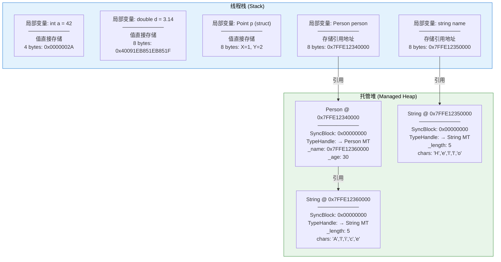
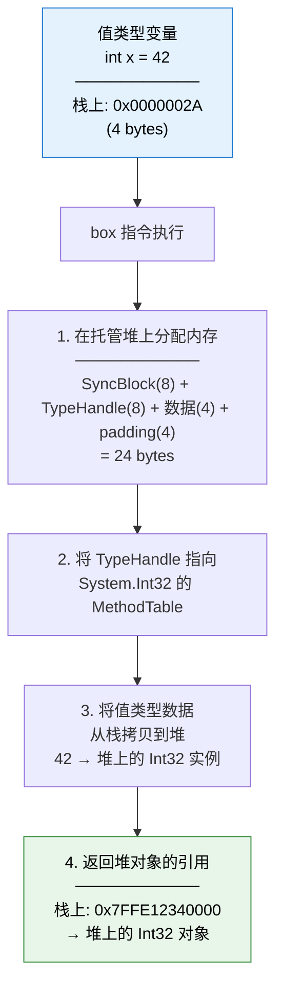
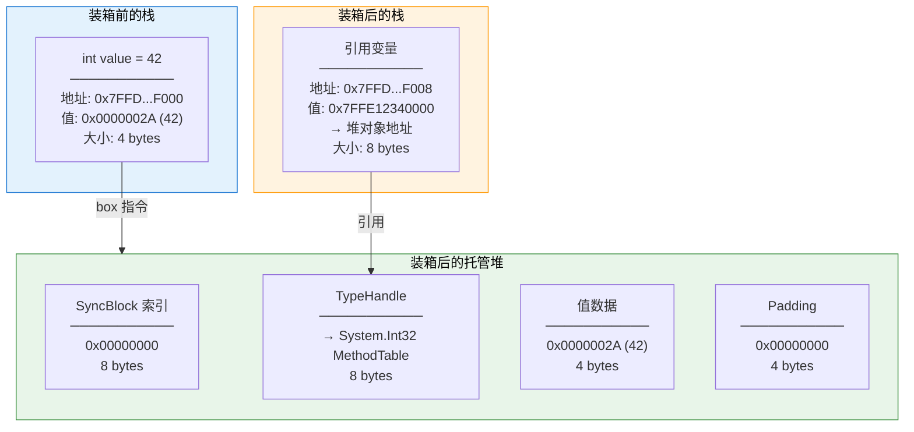
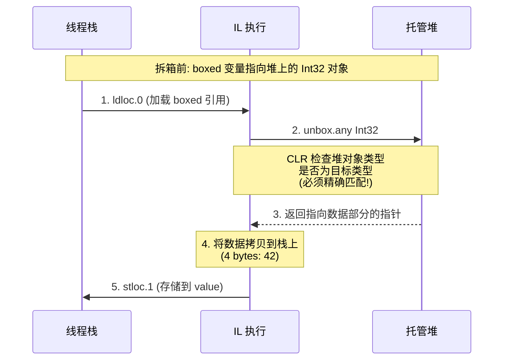
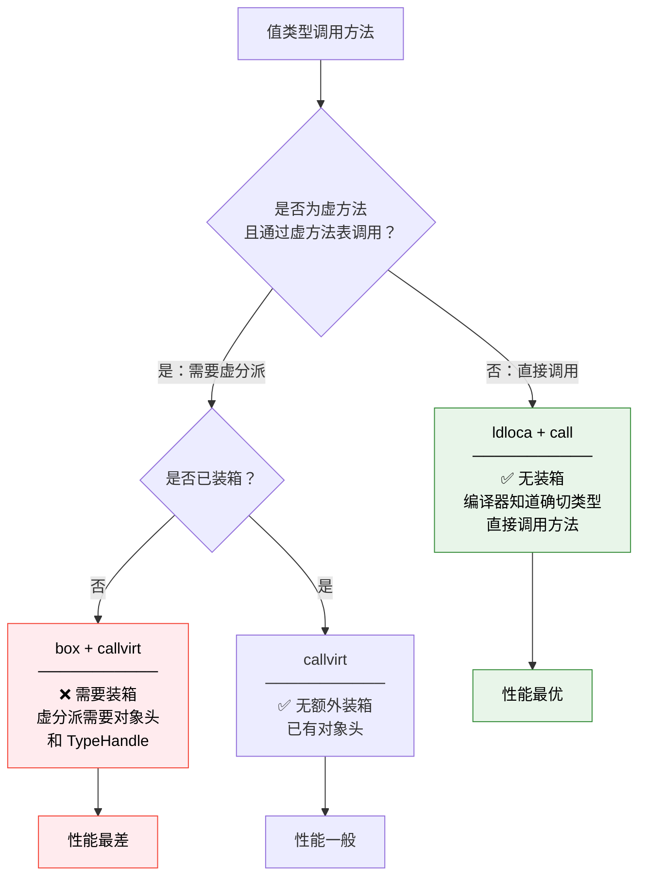
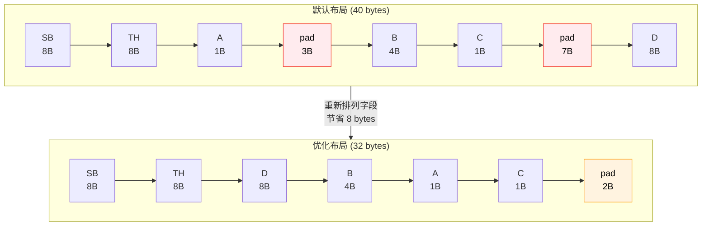
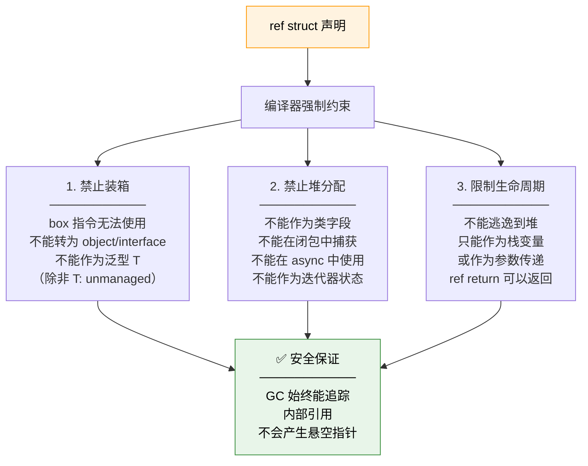
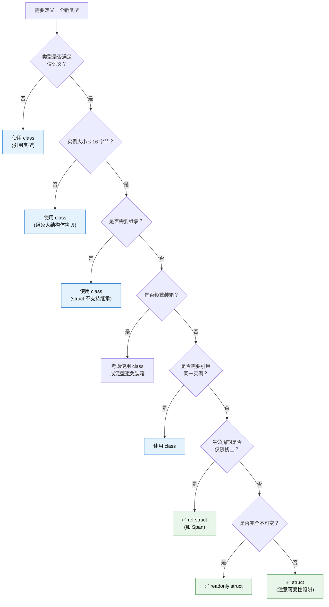

# 值类型与引用类型深度对比

::: important 核心问题
值类型和引用类型的本质区别是什么？为什么 `int` 赋值不会影响原变量，而 `object` 赋值会？装箱和拆箱在 IL 中到底做了什么？`readonly struct` 和 `ref struct` 的底层约束原理是什么？
:::

## 一、内存布局对比

值类型与引用类型最根本的区别在于它们的内存分配方式和数据表示。

### 1.1 栈 vs 堆的内存模型



### 1.2 赋值行为的根本差异

```csharp
using System;

public struct Point    // 值类型
{
    public int X, Y;
}

public class Person    // 引用类型
{
    public string Name;
    public int Age;
}

public class AssignmentBehavior
{
    public static void Main()
    {
        // 值类型赋值 —— 复制值
        var p1 = new Point { X = 1, Y = 2 };
        var p2 = p1;               // 复制整个结构体
        p2.X = 100;
        Console.WriteLine($"p1.X = {p1.X}"); // 1（不受影响）
        Console.WriteLine($"p2.X = {p2.X}"); // 100

        // 引用类型赋值 —— 复制引用
        var person1 = new Person { Name = "Alice", Age = 30 };
        var person2 = person1;     // 复制引用（指向同一对象）
        person2.Age = 25;
        Console.WriteLine($"person1.Age = {person1.Age}"); // 25（受影响！）
        Console.WriteLine($"person2.Age = {person2.Age}"); // 25
    }
}
```

```il
// 值类型赋值的 IL
IL_0000: ldloca.s p1
IL_0002: initobj Point           // 初始化 Point 结构
IL_0007: ldloc.0                 // 加载 p1
IL_0008: stloc.1                 // 复制整个结构体到 p2（逐字段拷贝）

// 引用类型赋值的 IL
IL_0000: ldloc.0                 // 加载 person1 的引用
IL_0001: stloc.1                 // 复制引用（8字节指针拷贝）
```

### 1.3 完整对比表

| 特性 | 值类型 | 引用类型 |
|------|--------|---------|
| 基类 | `System.ValueType` | `System.Object` |
| 内存分配 | 通常在栈上 | 在托管堆上 |
| 赋值语义 | 复制值（深拷贝） | 复制引用（浅拷贝） |
| 对象头 | 无 SyncBlock/TypeHandle | 有 SyncBlock + TypeHandle |
| 默认值 | 各字段归零 | null |
| GC 管理 | 不受 GC 管理（栈分配时） | 受 GC 管理 |
| 继承 | 不能被继承（sealed） | 可以被继承 |
| 方法分派 | 非虚（可被接口方法虚化） | 虚方法分派 |
| 作为字段 | 内联在宿主对象中 | 存储引用指针 |
| 数组存储 | 值直接连续存储 | 存储引用指针 |

## 二、struct 的 this 指针

值类型的 `this` 指针与引用类型有重要区别。

### 2.1 值类型 this 的本质

```csharp
public struct MutablePoint
{
    public int X, Y;

    // 值类型的 this 是一个 ref 参数，指向调用方的存储位置
    public void Offset(int dx, int dy)
    {
        X += dx;  // 等价于: this.X += dx
        Y += dy;  // 等价于: this.Y += dy
    }

    // readonly 方法 —— 承诺不修改 this
    public readonly double DistanceTo(MutablePoint other)
    {
        // X += 1;  // 编译错误！readonly 方法不能修改字段
        return Math.Sqrt((X - other.X) * (X - other.X) +
                         (Y - other.Y) * (Y - other.Y));
    }

    // 值类型可以重新赋值 this！
    public void Reset()
    {
        this = default;  // 合法！将整个结构体重置为默认值
    }
}
```

```il
// Offset 方法的 IL
.method public hidebysig instance void Offset(int32 dx, int32 dy) cil managed
{
    .maxstack 3
    IL_0000: ldarg.0       // this (指向调用方的存储位置的指针)
    IL_0001: ldarg.0
    IL_0002: ldfld int32 MutablePoint::X
    IL_0007: ldarg.1       // dx
    IL_0008: add
    IL_0009: stfld int32 MutablePoint::X
    // ... Y 类似
    IL_0010: ret
}

// Reset 方法的 IL —— this 赋值
.method public hidebysig instance void Reset() cil managed
{
    .maxstack 2
    IL_0000: ldarg.0           // 加载 this 指针
    IL_0001: initobj MutablePoint  // 将 this 指向的内存初始化为默认值
    IL_0007: ret
}
```

::: warning 值类型 this 的防御性拷贝
当在 `readonly` 字段上调用非 `readonly` 方法时，编译器会创建一个防御性拷贝：

```csharp
readonly MutablePoint _origin = new MutablePoint(0, 0);

// _origin.Offset(1, 1);  // 如果 Offset 不是 readonly，编译器会：
// 1. 创建 _origin 的副本
// 2. 在副本上调用 Offset
// 3. 丢弃副本
// 结果: _origin 未被修改！这可能导致困惑的 bug
```
:::

## 三、装箱 IL —— box 指令详解

装箱（Boxing）是将值类型转换为引用类型的过程。这是 CLR 中代价最高的隐式操作之一。

### 3.1 装箱的完整流程



### 3.2 装箱的 IL 代码

```csharp
public class BoxingDemo
{
    public static void Main()
    {
        int value = 42;
        object boxed = value;          // 装箱
        IFormattable formattable = value; // 装箱（接口引用）
    }
}
```

```il
.method public hidebysig static void Main() cil managed
{
    .maxstack 1
    .locals init (int32 V_0, object V_1)

    IL_0000: ldc.i4.s 42
    IL_0002: stloc.0           // int value = 42

    IL_0003: ldloc.0
    IL_0004: box [mscorlib]System.Int32   // 装箱！
    IL_0009: stloc.1           // object boxed = ...

    IL_000a: ldloc.0
    IL_000b: box [mscorlib]System.Int32   // 再次装箱！
    IL_0010: stloc.2           // IFormattable formattable = ...
    IL_0011: ret
}
```

### 3.3 装箱的内存拷贝细节

```csharp
using System;

public class BoxingMemoryDetail
{
    public struct ComplexStruct
    {
        public int A;
        public long B;
        public double C;
        // 总大小: 4 + 4(padding) + 8 + 8 = 24 bytes
    }

    public static void Main()
    {
        var s = new ComplexStruct { A = 1, B = 2, C = 3.0 };
        object boxed = s;  // 装箱

        // 装箱后的堆对象布局:
        // [SyncBlock 索引]       8 bytes
        // [TypeHandle]           8 bytes → ComplexStruct 的 MethodTable
        // [A = 1]               4 bytes
        // [padding]             4 bytes
        // [B = 2]               8 bytes
        // [C = 3.0]             8 bytes
        // 总计: 8 + 8 + 24 = 40 bytes

        // 修改原结构体不影响装箱对象
        s.A = 100;
        var unboxed = (ComplexStruct)boxed;
        Console.WriteLine($"原结构体 A: {s.A}");         // 100
        Console.WriteLine($"装箱对象 A: {unboxed.A}");    // 1（独立副本）
    }
}
```

### 3.4 装箱后的对象布局图



## 四、拆箱 IL —— unbox 指令详解

拆箱（Unboxing）是装箱的逆操作，但它与装箱有一个关键区别：**拆箱只返回指向数据的指针，不执行拷贝**。真正的拷贝发生在后续的赋值操作中。

### 4.1 拆箱的 IL 代码

```csharp
public class UnboxingDemo
{
    public static void Main()
    {
        object boxed = 42;           // 装箱
        int value = (int)boxed;      // 拆箱 + 拷贝
    }
}
```

```il
.method public hidebysig static void Main() cil managed
{
    .maxstack 1
    .locals init (object V_0, int32 V_1)

    IL_0000: ldc.i4.s 42
    IL_0002: box [mscorlib]System.Int32        // 装箱
    IL_0007: stloc.0

    IL_0008: ldloc.0
    IL_0009: unbox.any [mscorlib]System.Int32  // 拆箱 + 拷贝
    IL_000e: stloc.1
    IL_000f: ret
}
```

::: tip unbox vs unbox.any
在 .NET 2.0 之前，拆箱使用 `unbox` 指令，它只返回指向堆对象中数据部分的**托管指针**（不拷贝）。.NET 2.0 引入了 `unbox.any`，它执行拆箱**并**拷贝值。C# 编译器现在总是生成 `unbox.any`。

旧的 `unbox` 指令仍然存在，主要用于某些泛型场景和 IL 优化中，它返回的是 `&T` 类型的指针，避免了额外的拷贝。
:::

### 4.2 拆箱的详细流程



### 4.3 拆箱的类型检查

```csharp
using System;

public class UnboxTypeCheck
{
    public static void Main()
    {
        object boxed = 42;  // 装箱为 Int32

        // 正确拆箱
        int i = (int)boxed;                   // OK
        IFormattable f = (IFormattable)boxed;  // OK (拆箱 + 接口引用)

        // 错误拆箱 —— 类型不匹配
        try
        {
            long l = (long)boxed;  // InvalidCastException!
            // 即使 int 可以隐式转为 long，
            // 拆箱要求类型精确匹配！
        }
        catch (InvalidCastException ex)
        {
            Console.WriteLine($"拆箱失败: {ex.Message}");
        }

        // 正确的两步转换
        long correct = (long)(int)boxed;  // 先拆箱为 int，再转为 long
        Console.WriteLine($"正确转换: {correct}");
    }
}
```

```il
// 错误的拆箱尝试
IL_0001: ldloc.0
IL_0002: unbox.any [mscorlib]System.Int64   // InvalidCastException!

// 正确的两步转换
IL_0003: ldloc.0
IL_0004: unbox.any [mscorlib]System.Int32   // 先拆箱为 Int32
IL_0009: conv.i8                             // 再转为 Int64
```

::: warning 拆箱的类型精确匹配规则
拆箱时，CLR 要求堆对象的实际类型与目标类型**精确匹配**。你不能将 `Int32` 拆箱为 `Int64`，即使存在隐式转换。这是因为 CLR 必须确保类型安全，而类型转换的语义应该在拆箱后单独处理。
:::

## 五、装箱性能测试

### 5.1 BenchmarkDotNet 基准测试

```csharp
using System;
using System.Collections.Generic;
using BenchmarkDotNet.Attributes;
using BenchmarkDotNet.Running;

[MemoryDiagnoser]
public class BoxingBenchmark
{
    // 场景1：无装箱
    [Benchmark(Baseline = true)]
    public int NoBoxing()
    {
        int sum = 0;
        for (int i = 0; i < 1000; i++)
        {
            sum += i;
        }
        return sum;
    }

    // 场景2：频繁装箱
    [Benchmark]
    public int FrequentBoxing()
    {
        object sum = 0;  // 每次赋值都装箱！
        for (int i = 0; i < 1000; i++)
        {
            sum = (int)sum + i;  // unbox + add + box
        }
        return (int)sum;
    }

    // 场景3：ArrayList (大量装箱)
    [Benchmark]
    public int ArrayListBoxing()
    {
        var list = new System.Collections.ArrayList();
        for (int i = 0; i < 1000; i++)
        {
            list.Add(i);  // 每次添加都装箱
        }
        int sum = 0;
        for (int j = 0; j < list.Count; j++)
        {
            sum += (int)list[j];  // 每次访问都拆箱
        }
        return sum;
    }

    // 场景4：List<int> (无装箱)
    [Benchmark]
    public int GenericListNoBoxing()
    {
        var list = new List<int>();
        for (int i = 0; i < 1000; i++)
        {
            list.Add(i);  // 无装箱
        }
        int sum = 0;
        for (int j = 0; j < list.Count; j++)
        {
            sum += list[j];  // 无拆箱
        }
        return sum;
    }
}
```

典型结果：
```
| Method            | Mean       | Ratio | Allocated |
|------------------ |-----------:|------:|----------:|
| NoBoxing          |   0.352 μs |  1.00 |         - |
| FrequentBoxing    |  28.456 μs | 80.84 |  40,000 B |
| ArrayListBoxing   |  32.789 μs | 93.15 |  44,008 B |
| GenericListNoBoxing|  1.234 μs |  3.50 |   4,064 B |
```

::: important 装箱的性能影响
1. **时间开销**：装箱操作比直接操作值类型慢 10-100 倍
2. **空间开销**：每次装箱在堆上分配 16-40+ 字节（含对象头），加上 GC 压力
3. **GC 压力**：大量临时装箱对象导致频繁 GC，间接影响整体性能
4. **泛型消除装箱**：`List<int>` 完全避免了装箱，这也是泛型在 .NET 2.0 引入的核心动机之一
:::

## 六、隐式装箱场景

装箱不仅在显式转换时发生，还有很多隐式场景可能被忽略。

### 6.1 常见隐式装箱场景

```csharp
using System;

public class ImplicitBoxingDemo
{
    public static void Main()
    {
        int value = 42;

        // 场景1：值类型调用虚方法
        value.GetType();           // 装箱！GetType 是 Object 的虚方法
        value.GetHashCode();       // 装箱！(但 JIT 可能优化掉)
        value.ToString();          // 不装箱！Int32 重写了 ToString

        // 场景2：值类型转为接口
        IComparable<int> comp = value;  // 装箱！
        IFormattable fmt = value;       // 装箱！

        // 场景3：值类型转为 object
        object obj = value;             // 装箱！

        // 场景4：字符串插值中的值类型
        string s1 = $"Value: {value}";  // 装箱（如果不用 string.Format 重载）

        // 场景5：params object[] 参数
        Console.WriteLine(value);       // 可能装箱（取决于重载决议）

        // 场景6：枚举的底层操作
        DayOfWeek day = DayOfWeek.Monday;
        Console.WriteLine(day);         // 装箱！(枚举是值类型)
    }
}
```

### 6.2 值类型调用虚方法的 IL 分析

```csharp
public struct MyStruct
{
    public int Value;

    public override int GetHashCode() => Value;
    public override string ToString() => Value.ToString();
}

public class VirtualMethodBoxing
{
    public static void Main()
    {
        var s = new MyStruct { Value = 42 };

        // 调用重写的虚方法 —— 不装箱
        int hash = s.GetHashCode();
        string str = s.ToString();

        // 通过接口调用 —— 装箱
        IEquatable<MyStruct> eq = s;  // 装箱！
        bool result = eq.Equals(s);
    }
}
```

```il
// 直接调用 GetHashCode —— 不装箱
IL_0000: ldloca.s s        // 加载结构体地址（byref）
IL_0002: call instance int32 MyStruct::GetHashCode()
// 使用 ldloca + call，不需要装箱！

// 通过接口调用 Equals —— 装箱
IL_0010: ldloc.0
IL_0011: box MyStruct      // 装箱！
IL_0016: stloc.1           // IEquatable<MyStruct> eq = s
```



## 七、值类型作为字段时的对齐与填充

当值类型作为引用类型的字段时，其布局受内存对齐规则的影响。

### 7.1 内存对齐规则

CLR 默认的对齐规则：
- 每个字段按其自然大小对齐（int 对齐到 4，long 对齐到 8）
- 对象整体大小按最大字段对齐（通常对齐到 8）
- StructLayout 控制自定义布局

```csharp
using System;
using System.Runtime.InteropServices;

public class AlignmentDemo
{
    // 示例1：默认布局
    public class DefaultLayout
    {
        public byte A;     // 偏移: 8  (TypeHandle 之后)
        public int B;      // 偏移: 12 (对齐到4)
        public byte C;     // 偏移: 16
        public long D;     // 偏移: 24 (对齐到8)
    }
    // 实例大小: 8(SyncBlock) + 8(TypeHandle) + 1(A) + 3(pad) + 4(B) + 1(C) + 7(pad) + 8(D) = 40

    // 示例2：优化后的布局
    public class OptimizedLayout
    {
        public long D;     // 偏移: 8  (最大的先放)
        public int B;      // 偏移: 16
        public byte A;     // 偏移: 20
        public byte C;     // 偏移: 21
    }
    // 实例大小: 8(SyncBlock) + 8(TypeHandle) + 8(D) + 4(B) + 1(A) + 1(C) + 2(pad) = 32

    // 示例3：显式布局
    [StructLayout(LayoutKind.Explicit, Size = 16)]
    public struct ExplicitLayout
    {
        [FieldOffset(0)]  public byte A;
        [FieldOffset(0)]  public int B;    // 与 A 重叠！
        [FieldOffset(8)]  public long D;
    }
}
```

### 7.2 布局对比图



### 7.3 使用工具查看布局

```csharp
using System;
using System.Runtime.InteropServices;

public class LayoutInspector
{
    public static void PrintLayout<T>() where T : struct
    {
        int size = Marshal.SizeOf<T>();
        Console.WriteLine($"{typeof(T).Name}: {size} bytes (Marshal)");

        foreach (var field in typeof(T).GetFields())
        {
            int offset = Marshal.OffsetOf<T>(field.Name).ToInt32();
            Console.WriteLine($"  {field.Name} ({field.FieldType.Name}): offset={offset}");
        }
    }

    public static void Main()
    {
        PrintLayout<DefaultStruct>();
        PrintLayout<ExplicitStruct>();
    }
}

[StructLayout(LayoutKind.Sequential)]
public struct DefaultStruct
{
    public byte A;
    public int B;
    public byte C;
    public long D;
}

[StructLayout(LayoutKind.Explicit)]
public struct ExplicitStruct
{
    [FieldOffset(0)] public byte A;
    [FieldOffset(4)] public int B;
    [FieldOffset(8)] public byte C;
    [FieldOffset(16)] public long D;
}
```

## 八、readonly struct 与 in 参数

### 8.1 readonly struct

`readonly struct` 保证结构体的所有字段都是只读的，防止意外修改：

```csharp
// readonly struct —— 所有字段不可变
public readonly struct ReadOnlyPoint
{
    public readonly int X;
    public readonly int Y;

    public ReadOnlyPoint(int x, int y) => (X, Y) = (x, y);

    // 所有方法隐式为 readonly 方法
    public double Distance => Math.Sqrt(X * X + Y * Y);

    public override string ToString() => $"({X}, {Y})";
}
```

```il
// readonly struct 的 TypeDef 标志
.type public sequential ansi sealed beforefieldinit ReadOnlyPoint
       extends [mscorlib]System.ValueType
{
    // 注意: sealed 标志确保不可继承
    // beforefieldinit 确保延迟初始化
}
```

### 8.2 in 参数 —— 按引用只读传递

`in` 参数将值类型按引用传递，但禁止被调用方修改：

```csharp
using System;

public class InParameterDemo
{
    // 传统值传递 —— 复制整个结构体
    public static double DistanceSlow(ReadOnlyPoint p)
    {
        return p.Distance;  // p 是完整副本
    }

    // in 参数 —— 按引用只读传递
    public static double DistanceFast(in ReadOnlyPoint p)
    {
        return p.Distance;  // p 是原始数据的引用
    }

    public static void Main()
    {
        var point = new ReadOnlyPoint(3, 4);

        // 值传递：复制 8 bytes
        double d1 = DistanceSlow(point);

        // in 传递：传递指针（8 bytes），避免复制
        double d2 = DistanceFast(point);
        double d3 = DistanceFast(in point);  // 显式 in
    }
}
```

```il
// 值传递
.method public hidebysig static float64 DistanceSlow(
    valuetype ReadOnlyPoint p) cil managed
{
    // p 是栈上的完整副本
    .maxstack 8
    IL_0000: ldarga.s p
    IL_0002: call instance float64 ReadOnlyPoint::get_Distance()
    IL_0007: ret
}

// in 参数传递
.method public hidebysig static float64 DistanceFast(
    [in] valuetype ReadOnlyPoint& p) cil managed
{
    // p 是指向原始数据的托管指针
    .maxstack 8
    IL_0000: ldarg.0           // 加载指针
    IL_0001: call instance float64 ReadOnlyPoint::get_Distance()
    IL_0006: ret
}
```

### 8.3 防御性拷贝的陷阱

```csharp
using System;

public struct NonReadOnlyPoint
{
    public int X, Y;

    public void Offset(int dx, int dy)
    {
        X += dx;
        Y += dy;
    }

    public readonly override string ToString() => $"({X}, {Y})";
}

public class DefensiveCopyDemo
{
    public static void Process(in NonReadOnlyPoint p)
    {
        // p.Offset(1, 1);  // 编译器发出警告！
        // 因为 Offset 不是 readonly 方法，
        // 编译器会创建 p 的防御性拷贝再调用
        // 修改只影响副本，原始值不变

        string s = p.ToString();  // OK, ToString 是 readonly 方法
    }

    public static void Main()
    {
        var p = new NonReadOnlyPoint { X = 1, Y = 2 };
        Process(in p);
        Console.WriteLine($"({p.X}, {p.Y})");  // (1, 2) —— 未被修改
    }
}
```

## 九、ref struct 约束原理

`ref struct` 是 C# 7.2 引入的特殊值类型约束，确保结构体只能存在于栈上，不能逃逸到托管堆。

### 9.1 ref struct 的设计动机

`Span<T>` 需要同时引用托管内存和非托管内存，但不能被装箱到堆上（否则 GC 无法跟踪内部指针）。`ref struct` 正是为解决这个问题而引入的。

### 9.2 ref struct 的约束

```csharp
public ref struct RefStructDemo
{
    private readonly Span<int> _span;

    public RefStructDemo(Span<int> span) => _span = span;

    // ❌ 以下操作全部被编译器禁止:

    // 1. 不能装箱
    // object obj = this;                    // CS0306

    // 2. 不能作为类的字段
    // public RefStructDemo Field;           // CS8345

    // 3. 不能实现接口（接口引用需要装箱）
    // public class MyClass : IComparable    // CS0306

    // 4. 不能在 lambda/本地函数中捕获
    // Action action = () => Use(this);      // CS8345

    // 5. 不能在 async 方法中使用
    // async Task DoAsync() { var x = this; } // CS8345

    // 6. 不能作为迭代器的 yield 返回值
    // IEnumerable<RefStructDemo> Iterate() { yield return this; } // CS8345

    // ✅ 允许的操作:
    public void Process()
    {
        // 直接操作 Span，无需担心 GC 移动
        for (int i = 0; i < _span.Length; i++)
        {
            _span[i] *= 2;
        }
    }

    public ref int this[int index] => ref _span[index];
}
```

### 9.3 ref struct 的编译器约束机制



### 9.4 Span<T> —— ref struct 的典型应用

```csharp
using System;

public class SpanDemo
{
    public static void Main()
    {
        // Span 可以安全地引用各种内存
        int[] array = new int[] { 1, 2, 3, 4, 5 };

        // 从托管数组创建 Span
        Span<int> span1 = array.AsSpan();

        // 从栈分配内存创建 Span
        Span<int> span2 = stackalloc int[10];

        // 从非托管内存创建 Span
        IntPtr ptr = System.Runtime.InteropServices.Marshal.AllocHGlobal(40);
        try
        {
            Span<int> span3 = new Span<int>(ptr.ToPointer(), 10);
            span3[0] = 42;
        }
        finally
        {
            System.Runtime.InteropServices.Marshal.FreeHGlobal(ptr);
        }

        // Span 的切片 —— 零拷贝
        Span<int> slice = span1.Slice(1, 3);  // [2, 3, 4]

        // 修改切片会影响原数组
        slice[0] = 100;
        Console.WriteLine(string.Join(", ", array));  // 1, 100, 3, 4, 5
    }
}
```

```csharp
// Span<T> 的核心定义（简化）
public readonly ref struct Span<T>
{
    // 内部引用（byref-like，类似 T*）
    private readonly ref T _reference;
    // 长度
    private readonly int _length;

    public Span(T[] array)
    {
        _reference = ref MemoryMarshal.GetArrayDataReference(array);
        _length = array.Length;
    }

    public ref T this[int index] =>
        ref Unsafe.Add(ref _reference, (nint)(uint)index);

    public Span<T> Slice(int start, int length) =>
        new(ref Unsafe.Add(ref _reference, (nint)(uint)start), length);
}
```

## 十、值类型选择决策树

### 10.1 何时使用值类型



### 10.2 值类型选择的黄金规则

::: important 值类型的选择标准（参考《CLR via C#》第5章）
1. **值语义**：类型的赋值应该复制值，而不是共享引用
2. **小体积**：实例大小不超过 16 字节（避免拷贝开销）
3. **不可变**：优先使用 `readonly struct`，防止意外修改
4. **不需要继承**：值类型是隐式 sealed 的
5. **不频繁装箱**：避免将值类型转为 `object` 或接口
6. **高分配频率**：值类型在栈上分配，减少 GC 压力
:::

### 10.3 值类型与引用类型的性能对比总结

```csharp
using System;
using System.Collections.Generic;
using System.Diagnostics;
using BenchmarkDotNet.Attributes;

[MemoryDiagnoser]
public class ValueTypeVsRefTypeBenchmark
{
    private const int Count = 100_000;

    // 值类型数组 —— 数据连续存储
    [Benchmark]
    public double ProcessValueTypeArray()
    {
        var points = new StructPoint[Count];
        double sum = 0;
        for (int i = 0; i < Count; i++)
        {
            points[i] = new StructPoint(i, i);
            sum += points[i].X + points[i].Y;
        }
        return sum;
    }

    // 引用类型数组 —— 引用指针连续，对象分散
    [Benchmark]
    public double ProcessReferenceTypeArray()
    {
        var points = new ClassPoint[Count];
        double sum = 0;
        for (int i = 0; i < Count; i++)
        {
            points[i] = new ClassPoint(i, i);
            sum += points[i].X + points[i].Y;
        }
        return sum;
    }
}

public struct StructPoint
{
    public double X, Y;
    public StructPoint(double x, double y) => (X, Y) = (x, y);
}

public class ClassPoint
{
    public double X, Y;
    public ClassPoint(double x, double y) => (X, Y) = (x, y);
}
```

典型结果：
```
| Method                     | Mean      | Ratio | Allocated |
|--------------------------- |----------:|------:|----------:|
| ProcessValueTypeArray      |  1.234 ms |  1.00 |   1.6 MB  |
| ProcessReferenceTypeArray  |  5.678 ms |  4.60 |   3.2 MB  |
```

## 十一、总结

```mermaid
mindmap
  root((值类型 vs 引用类型))
    内存布局
      栈 vs 堆
      值直接存储 vs 引用指针
      对象头差异
    赋值语义
      值拷贝 vs 引用拷贝
      this 指针差异
      防御性拷贝
    装箱(box)
      堆分配+数据拷贝
      SyncBlock+TypeHandle
      性能代价 10-100x
    拆箱(unbox)
      类型精确匹配
      unbox vs unbox.any
      指针+拷贝
    隐式装箱
      虚方法调用
      接口引用
      object 转换
      params object[]
    内存对齐
      自然对齐规则
      padding 浪费
      字段重排优化
    readonly struct
      不可变保证
      in 参数传递
      防御性拷贝陷阱
    ref struct
      栈上限制
      禁止装箱/捕获
      Span<T> 应用
    选择决策
      值语义优先
      小体积 ≤16B
      不可变优先
      避免装箱
```

::: important 关键要点回顾
1. **内存布局**：值类型直接存储数据（栈或内联），引用类型存储指向堆对象的引用指针
2. **装箱**：`box` 指令在堆上分配对象（含 SyncBlock + TypeHandle），拷贝值类型数据，性能代价极高
3. **拆箱**：`unbox.any` 检查类型精确匹配并拷贝数据，不允许类型转换
4. **隐式装箱**：值类型调用虚方法、转为接口或 object 时发生，是常见的性能陷阱
5. **内存对齐**：CLR 按自然大小对齐字段，未优化的布局可能浪费大量 padding 空间
6. **readonly struct + in**：确保不可变性和高效的引用传递，但要注意非 readonly 方法的防御性拷贝
7. **ref struct**：编译器强制保证栈上分配，禁止装箱和逃逸到堆，为 Span<T> 提供安全基础
8. **选择决策**：值类型适合小型不可变数据，引用类型适合需要共享和继承的场景
:::

---

**参考资料**

- Jeffrey Richter.《CLR via C#》第4版, Chapter 5 "Primitive, Reference, and Value Types". Microsoft Press, 2012.
- ECMA-335. Partition III "CIL Instruction Set", §4.1 "box" and §4.27 "unbox". 2012.
- Konrad Kokosa.《Pro .NET Memory Management》, Chapter 4 "Object Layout and Memory". Apress, 2018.
- dotnet/runtime 源码. `src/libraries/System.Private.CoreLib/src/System/Span.cs`.
- Bill Wagner.《Effective C#》3rd Edition, Item 18 "Prefer Defining and Implementing Interfaces to Inheritance". Addison-Wesley, 2017.
