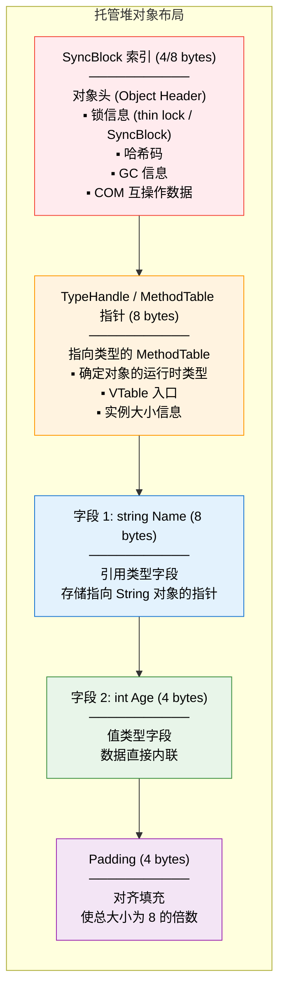
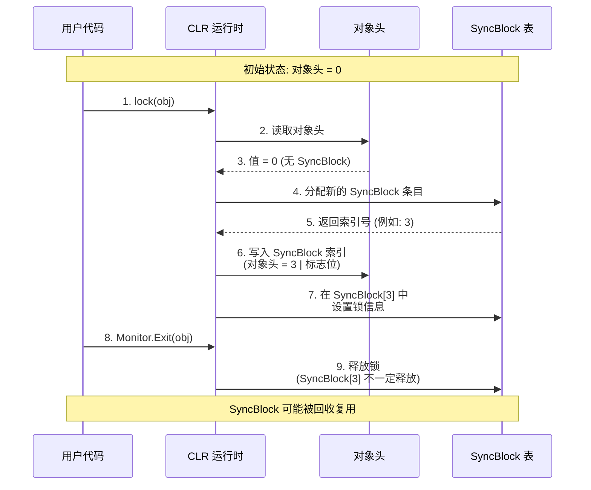
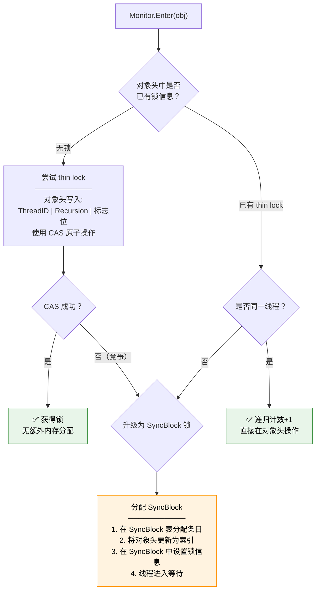
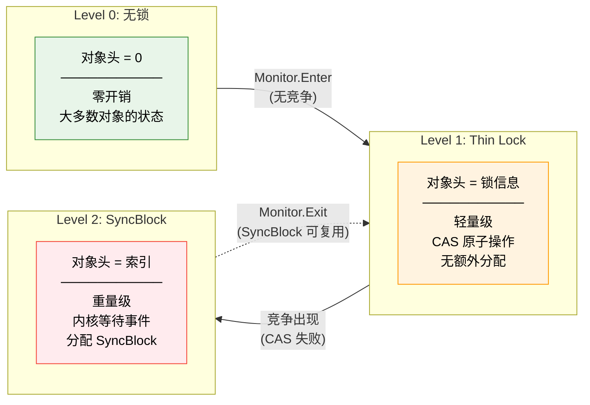
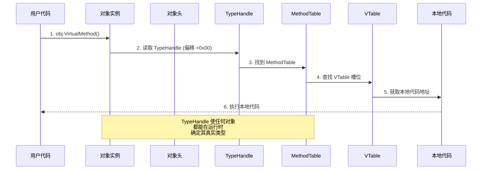
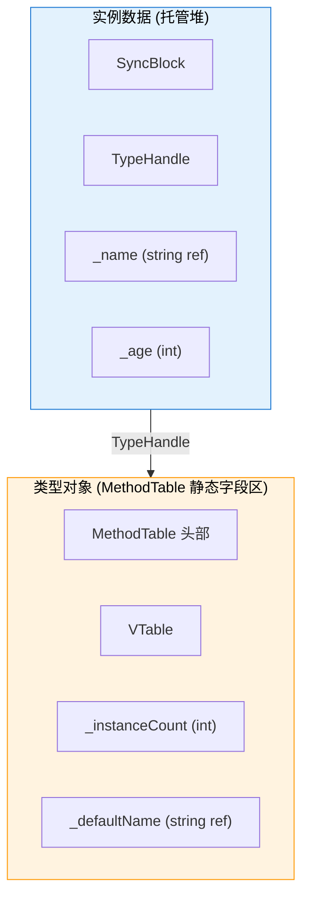
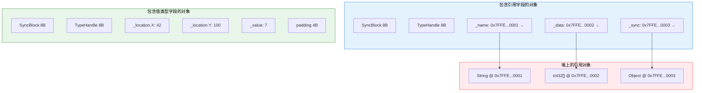
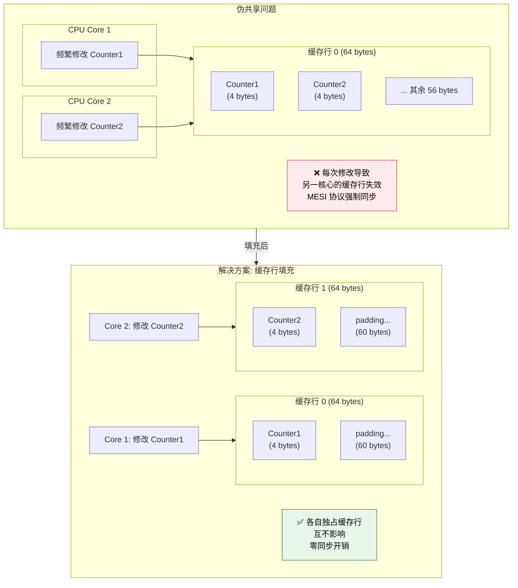
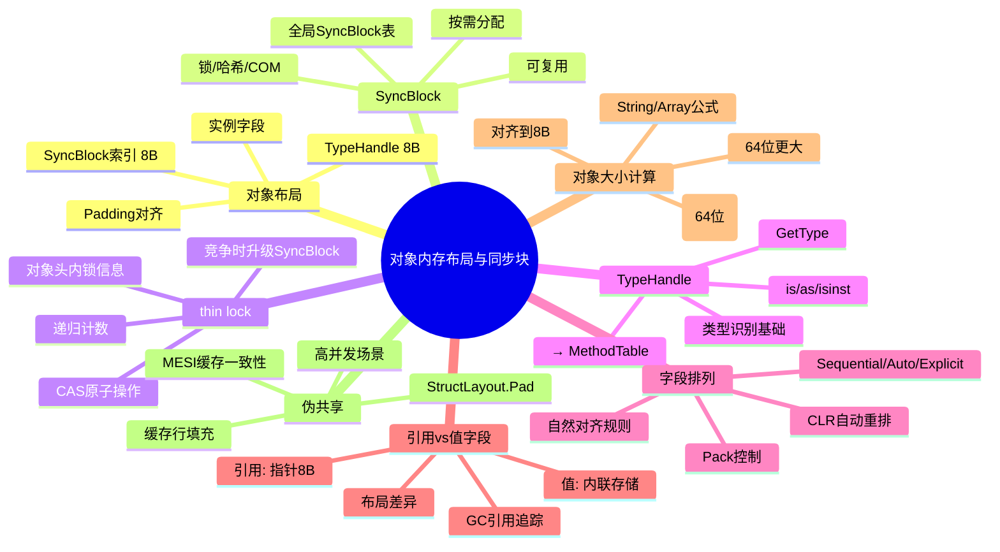

# 对象内存布局与同步块

::: important 核心问题
一个 .NET 对象在托管堆上究竟占多少字节？SyncBlock 和 TypeHandle 分别做什么？为什么 `lock(obj)` 不会在对象本身加锁？thin lock 优化如何工作？如何计算对象的精确大小？
:::

## 一、托管堆对象布局总览

每个 CLR 托管堆上的对象都遵循统一的布局规范：对象头（Object Header）+ 类型句柄（TypeHandle/MethodTable 指针）+ 实例字段。

### 1.1 对象布局图



### 1.2 对象头详解

对象头（Object Header）在 64 位系统上占用 8 字节，但在大多数情况下只使用低 4 字节：

```
64 位对象头布局 (8 bytes):
─────────────────────────────────────────
高位 (4 bytes)    低位 (4 bytes)
┌──────────────┬──────────────────────────┐
│  高32位(保留) │  低32位(SyncBlock 索引)   │
└──────────────┴──────────────────────────┘

低 32 位 (SyncBlock 索引) 的位分布:
─────────────────────────────────────────
Bit 31-27: 标志位
Bit 26-0:  SyncBlock 索引 / HashCode / Thin Lock 信息
```

对象头的多种用途：

| 用途 | 标志位 | 内容 | 说明 |
|------|-------|------|------|
| 无状态 | 0 | 0 | 大多数对象的初始状态 |
| 哈希码 | — | HashCode | 第一次调用 GetHashCode 时写入 |
| Thin Lock | — | Lock Info | 轻量级锁信息 |
| SyncBlock 索引 | — | 索引值 | 指向 SyncBlock 表中的条目 |
| GC 信息 | — | — | GC 标记和转发地址 |

### 1.3 TypeHandle 详解

TypeHandle 占用 8 字节（64 位），指向类型的 MethodTable：

```csharp
using System;
using System.Runtime.CompilerServices;

public class TypeHandleDemo
{
    public static void Main()
    {
        var obj = new object();

        // 获取 TypeHandle（MethodTable 指针）
        Type type = obj.GetType();
        RuntimeTypeHandle handle = type.TypeHandle;

        // TypeHandle 的值就是 MethodTable 在内存中的地址
        Console.WriteLine($"MethodTable 地址: 0x{handle.Value.ToString("X")}");

        // 对象的第二个 8 字节就是这个地址
        // 在 64 位系统上:
        // obj - 0x08: SyncBlock 索引 (8 bytes, 64-bit)
        // obj + 0x00: TypeHandle (8 bytes) → 指向 MethodTable
        // obj + 0x08: 第一个实例字段
    }
}
```

## 二、SyncBlock 结构

SyncBlock 是 CLR 中用于实现 `lock` 语句、哈希码和 COM 互操作的核心数据结构。

### 2.1 SyncBlock 表

CLR 维护一个全局的 SyncBlock 表，每个条目包含：

```
SyncBlock 结构 (简化):
─────────────────────────────────────────
字段                    大小      说明
m_monitor                —       Monitor 信息
  m_waitEvt             8       等待事件句柄
  m_lockState           4       锁状态
  m_HolderThreadID      4       持有锁的线程 ID
  m_Recursion           4       递归计数
  m_awEvent             8       唤醒事件
m_pMHash                —       哈希码
  m_Key                 8       哈希码值
m_pCOM                  —       COM 互操作数据
m_pAppDomainRef         8       AppDomain 引用
m_dwFlags               4       标志位
─────────────────────────────────────────
```

### 2.2 SyncBlock 索引的分配流程



### 2.3 lock 语句的本质

```csharp
using System;
using System.Threading;

public class LockDemo
{
    private readonly object _lockObj = new object();

    public void SafeMethod()
    {
        lock (_lockObj)
        {
            // C# lock 编译为:
            // Monitor.Enter(_lockObj, ref lockTaken);
            // try { ... }
            // finally { Monitor.Exit(_lockObj); }
            Console.WriteLine("线程安全代码");
        }
    }
}
```

```il
// lock 语句的 IL
.method public hidebysig instance void SafeMethod() cil managed
{
    .maxstack 2
    .locals init (object V_0, bool V_1)

    IL_0000: ldarg.0
    IL_0001: ldfld object LockDemo::_lockObj
    IL_0006: stloc.0
    IL_0007: ldc.i4.0
    IL_0008: stloc.1

    .try
    {
        IL_0009: ldloc.0
        IL_000a: ldloca.s V_1
        IL_000c: call void [System.Runtime]System.Threading.Monitor::Enter(object, bool&)

        IL_0011: ldstr "线程安全代码"
        IL_0016: call void [System.Runtime]System.Console::WriteLine(string)

        IL_001b: leave.s IL_0027
    }
    finally
    {
        IL_001d: ldloc.1
        IL_001e: brfalse.s IL_0026
        IL_0020: ldloc.0
        IL_0021: call void [System.Runtime]System.Threading.Monitor::Exit(object)
        IL_0026: endfinally
    }
    IL_0027: ret
}
```

::: important lock 不修改对象本身
`lock(obj)` 不会在 `obj` 内部存储任何信息。锁信息存储在 SyncBlock 表中，对象头只保存指向 SyncBlock 的索引。这就是为什么你可以 lock 任何对象——CLR 只需要在该对象的 SyncBlock 索引槽中写入对应的条目号。
:::

## 三、thin lock 优化

为了避免频繁分配 SyncBlock 的开销，CLR 实现了 **thin lock** 优化——当锁竞争不激烈时，锁信息直接存储在对象头中。

### 3.1 thin lock 的工作原理



### 3.2 thin lock 的对象头格式

```
对象头中 thin lock 的位分布 (32 位):
─────────────────────────────────────────
Bit 31-28: 标志 (0x0 = 无, 0x1 = thin lock, 0x2 = SyncBlock, 0x3 = HashCode)

Thin Lock 模式 (标志 = 0x1):
┌─────┬──────────────┬───────────────────┐
│Flags│  Thread ID   │  Recursion Count  │
│4 bit│   20 bit     │    8 bit          │
└─────┴──────────────┴───────────────────┘
最大递归: 255 次
```

```csharp
using System;
using System.Threading;

public class ThinLockDemo
{
    public static void Main()
    {
        var obj = new object();

        // 第一次 lock: thin lock（对象头存储锁信息）
        lock (obj)
        {
            Console.WriteLine("第一次 lock: thin lock");
            // 对象头: [flags=1][thread_id=xxx][recursion=1]

            // 递归: 递增计数
            lock (obj)
            {
                Console.WriteLine("递归 lock: 计数+1");
                // 对象头: [flags=1][thread_id=xxx][recursion=2]
            }
        }
        // 退出 lock: 计数归零，对象头恢复

        // 多线程竞争: 升级为 SyncBlock
        var evt = new ManualResetEventSlim();
        ThreadPool.QueueUserWorkItem(_ =>
        {
            lock (obj)
            {
                evt.Set();
                Thread.Sleep(100);
            }
        });

        evt.Wait();
        lock (obj)  // 竞争发生 → 升级为 SyncBlock
        {
            Console.WriteLine("竞争后 lock: SyncBlock");
        }
    }
}
```

### 3.3 锁升级的完整流程



## 四、TypeHandle → MethodTable 解析

TypeHandle 是连接对象与类型系统的桥梁。通过 TypeHandle，CLR 可以在运行时确定对象的类型信息。

### 4.1 从对象到方法调用的完整路径



### 4.2 TypeHandle 与 is/as 操作

```csharp
using System;

public class TypeHandleIsAs
{
    public static void Main()
    {
        object obj = "Hello";

        // is 操作符 —— 通过 TypeHandle 检查类型兼容性
        if (obj is string)  // obj.TypeHandle → String 的 MethodTable
        {                    // 检查继承链是否包含 String
            Console.WriteLine("是 string");
        }

        // as 操作符 —— 类型转换（失败返回 null）
        string? str = obj as string;  // 类似 is，但返回转换结果

        // GetType —— 直接读取 TypeHandle
        Type type = obj.GetType();    // 读取 TypeHandle → 创建 RuntimeType
    }
}
```

```il
// is 操作符的 IL —— 使用 isinst 指令
IL_0000: ldloc.0
IL_0001: isinst [System.Runtime]System.String    // 通过 TypeHandle 检查
IL_0006: ldnull
IL_0007: cgt.un                             // 不为 null 则为 true

// as 操作符的 IL —— 同样使用 isinst
IL_0000: ldloc.0
IL_0001: isinst [System.Runtime]System.String    // 成功返回引用，失败返回 null

// GetType 的 IL —— 虚方法调用
IL_0000: ldloc.0
IL_0001: callvirt instance class [System.Runtime]System.Type [System.Runtime]System.Object::GetType()
```

## 五、字段排列顺序

CLR 中对象的字段排列受多种因素影响，理解这些因素对于优化内存布局至关重要。

### 5.1 默认字段排列规则

```csharp
using System;
using System.Runtime.InteropServices;

// 默认布局 (LayoutKind.Sequential 对于 class 不是默认的)
// 对于 class，CLR 可能重排字段以优化空间
public class FieldOrderDemo
{
    public byte A;     // 1 byte
    public int B;      // 4 bytes
    public byte C;     // 1 byte
    public long D;     // 8 bytes
    public short E;    // 2 bytes
    public byte F;     // 1 byte
}
```

CLR 对 class 的字段排列策略：

1. **按对齐要求降序排列**：long(8) → int(4) → short(2) → byte(1)
2. **填充最小化**：紧凑排列减少 padding

### 5.2 StructLayout 控制布局

```csharp
using System.Runtime.InteropServices;

// Sequential 布局 —— 按声明顺序排列（struct 默认）
[StructLayout(LayoutKind.Sequential)]
public struct SequentialLayout
{
    public byte A;     // 偏移: 0
    // padding: 3 bytes
    public int B;      // 偏移: 4
    public byte C;     // 偏移: 8
    // padding: 1 byte
    public short E;    // 偏移: 10
    // padding: 4 bytes
    public long D;     // 偏移: 16
}
// 总大小: 24 bytes

// Auto 布局 —— CLR 自动优化排列（class 默认）
[StructLayout(LayoutKind.Auto)]
public struct AutoLayout
{
    public byte A;
    public int B;
    public byte C;
    public short E;
    public long D;
}
// CLR 可能重排为: D(8) + B(4) + E(2) + A(1) + C(1) = 16 bytes

// Explicit 布局 —— 手动指定偏移
[StructLayout(LayoutKind.Explicit)]
public struct ExplicitLayout
{
    [FieldOffset(0)]  public byte A;
    [FieldOffset(0)]  public int B;     // A 和 B 重叠（联合体）
    [FieldOffset(8)]  public byte C;
    [FieldOffset(8)]  public short E;   // C 和 E 重叠
    [FieldOffset(16)] public long D;
}
// 总大小: 24 bytes (由 Size 参数指定)
```

### 5.3 FieldRVA 和静态字段

静态字段不存储在实例中，而是存储在类型对象（MethodTable）的静态字段区：



## 六、引用类型字段 vs 值类型字段布局差异

### 6.1 引用类型字段

引用类型字段存储的是指向堆对象的指针（8 字节）：

```csharp
public class RefFieldLayout
{
    private string _name;      // 8 bytes (引用指针)
    private int[] _data;       // 8 bytes (引用指针)
    private object _sync;      // 8 bytes (引用指针)
}
// 实例大小: 8(SyncBlock) + 8(TypeHandle) + 8 + 8 + 8 = 40 bytes
```

### 6.2 值类型字段

值类型字段直接内联在宿主对象中：

```csharp
public struct Point
{
    public int X, Y;  // 各 4 bytes
}

public class ValFieldLayout
{
    private Point _location;  // 8 bytes (内联: X=4 + Y=4)
    private int _value;       // 4 bytes
}
// 实例大小: 8(SyncBlock) + 8(TypeHandle) + 8(Point) + 4(int) + 4(pad) = 32 bytes
```

### 6.3 布局差异对比图



## 七、对象大小计算公式

### 7.1 计算公式

```
对象总大小 = SyncBlock(8) + TypeHandle(8) + 实例字段大小 + Padding

引用类型对象最小大小 = 24 bytes (8+8+最小字段8/padding)

值类型实例大小 = 字段大小之和 + 对齐 padding (无 SyncBlock 和 TypeHandle)

数组对象大小 = 24(头) + 4(长度) + padding + 元素大小 × 元素数量

String 对象大小 = 24(头) + 4(长度) + 2 × 字符数 + 2(null 终止符) + padding
```

### 7.2 具体类型大小计算

```csharp
using System;

public class SizeCalculation
{
    public static void Main()
    {
        // System.Object
        // 8(SyncBlock) + 8(TypeHandle) = 16 bytes → 但对齐到 8 = 24 bytes
        // 实际: 24 bytes (CLR 最小对象大小)

        // System.Int32 (装箱后)
        // 8(SyncBlock) + 8(TypeHandle) + 4(value) + 4(padding) = 24 bytes

        // System.String (空字符串)
        // 8(SyncBlock) + 8(TypeHandle) + 4(length=0) + 2(null) + 2(pad) = 24 bytes

        // System.String ("Hello")
        // 8 + 8 + 4 + 5×2 + 2(null) = 30 → 对齐到 32 bytes

        // int[10]
        // 8(SyncBlock) + 8(TypeHandle) + 4(length) + 4(pad) + 10×4 = 64 bytes

        // 自定义类
        // class Person { string _name; int _age; }
        // 8 + 8 + 8(string ref) + 4(int) + 4(pad) = 32 bytes
    }
}
```

### 7.3 使用代码验证对象大小

```csharp
using System;
using System.Runtime.CompilerServices;

public class ObjectSizeDemo
{
    public static void Main()
    {
        // 方法1：使用 GC.GetTotalMemory 估算
        long before = GC.GetTotalMemory(true);
        var obj = new object();
        long after = GC.GetTotalMemory(true);
        Console.WriteLine($"object 大小估算: {after - before} bytes");

        // 方法2：使用 Unsafe.SizeOf 获取托管大小
        Console.WriteLine($"int 托管大小: {Unsafe.SizeOf<int>()} bytes");
        Console.WriteLine($"long 托管大小: {Unsafe.SizeOf<long>()} bytes");
        Console.WriteLine($"string 引用大小: {Unsafe.SizeOf<string>()} bytes");
        Console.WriteLine($"object 引用大小: {Unsafe.SizeOf<object>()} bytes");

        // 方法3：通过 ClrMD 精确获取
        // (见后文实战部分)
    }
}
```

### 7.4 常见类型大小速查表

| 类型 | 32位大小 | 64位大小 | 说明 |
|------|---------|---------|------|
| `System.Object` | 12 → 16 | 24 | 最小对象大小 |
| `System.Int32`（装箱） | 16 | 24 | 含 SyncBlock + TypeHandle |
| `System.String`（空） | 16 | 24 | 最小字符串 |
| `System.String`（5字符） | 26 → 28 | 32 | 含字符数据 |
| `int[]`（10元素） | 52 → 56 | 64 | 含数组头 |
| `object[]`（10元素） | 44 → 48 | 96 | 10个引用指针 |
| `List&lt;int&gt;`（10元素） | 32 + 数组 | 32 + 数组 | 对象 + 底层数组 |
| `Dictionary&lt;K,V&gt;` | ~80+ | ~120+ | 内部结构复杂 |

::: tip 64位下的对象大小
在 64 位系统上，所有引用（SyncBlock 索引区的引用、TypeHandle、引用类型字段）都占 8 字节。对象大小按 8 字节对齐。这就是为什么 64 位下对象通常比 32 位大 50-100%。
:::

## 八、伪共享与字段重排优化

### 8.1 伪共享（False Sharing）

当多个线程频繁修改同一缓存行中的不同字段时，由于 CPU 缓存一致性协议（MESI），会导致缓存行在 CPU 核心之间频繁失效和同步，造成严重的性能下降。

```csharp
using System;
using System.Threading;
using BenchmarkDotNet.Attributes;

[MemoryDiagnoser]
public class FalseSharingBenchmark
{
    // 有伪共享的类 —— 两个字段在同一缓存行
    public class SharedData
    {
        public int Counter1;  // 线程1频繁修改
        public int Counter2;  // 线程2频繁修改
        // Counter1 和 Counter2 可能在同一 64 字节缓存行中！
    }

    // 无伪共享的类 —— 字段在不同缓存行
    public class PaddedData
    {
        public int Counter1;
        // 填充确保 Counter2 在不同缓存行
        public int _pad1, _pad2, _pad3, _pad4, _pad5, _pad6, _pad7;
        public int _pad8, _pad9, _pad10, _pad11, _pad12, _pad13, _pad14, _pad15;
        public int Counter2;
    }

    // .NET 7+ 推荐: StructLayout 显式偏移
    [System.Runtime.InteropServices.StructLayout(
        System.Runtime.InteropServices.LayoutKind.Explicit)]
    public class CacheLinePadded
    {
        [System.Runtime.InteropServices.FieldOffset(0)]
        public int Counter1;

        [System.Runtime.InteropServices.FieldOffset(64)]
        public int Counter2;
    }
}
```

### 8.2 伪共享的内存图



### 8.3 字段重排优化

CLR 在某些情况下会自动重排字段以优化内存布局：

```csharp
// 原始字段顺序
public class UnoptimizedLayout
{
    public byte A;     // 1 byte
    public long B;     // 8 bytes (需要对齐到 8)
    public byte C;     // 1 byte
    public int D;      // 4 bytes (需要对齐到 4)
    public byte E;     // 1 byte
}
// 最差布局: A(1)+pad(7)+B(8)+C(1)+pad(3)+D(4)+E(1)+pad(7) = 32 bytes

// CLR 自动重排后（对 class）:
// B(8)+D(4)+A(1)+C(1)+E(1)+pad(1) = 16 bytes (+头16 = 32)
// 实际上 CLR 通常按大小降序排列
```

### 8.4 使用 StructLayout 控制布局

```csharp
using System.Runtime.InteropServices;

// Sequential —— 按声明顺序，但对齐填充
[StructLayout(LayoutKind.Sequential, Pack = 1)]
public struct PackedStruct
{
    public byte A;     // 偏移: 0
    public long B;     // 偏移: 1 (Pack=1 禁止对齐填充！)
    public byte C;     // 偏移: 9
    public int D;      // 偏移: 10
    public byte E;     // 偏移: 14
}
// 总大小: 15 bytes (Pack=1)

// Auto —— CLR 自动优化
[StructLayout(LayoutKind.Auto)]
public struct AutoStruct
{
    public byte A;
    public long B;
    public byte C;
    public int D;
    public byte E;
}
// CLR 重排: B(8)+D(4)+A(1)+C(1)+E(1)+pad(1) = 16 bytes

// Explicit —— 精确控制
[StructLayout(LayoutKind.Explicit, Size = 16)]
public struct ExplicitStruct
{
    [FieldOffset(0)]  public byte A;
    [FieldOffset(0)]  public int B;    // 与 A 重叠
    [FieldOffset(8)]  public long C;
}
```

::: warning Pack=1 的性能影响
`Pack = 1` 禁止了自然对齐，虽然节省空间但可能导致 CPU 访问未对齐数据时的性能下降。在 x86/x64 上，未对齐访问可能比对齐访问慢 2-10 倍。在 ARM 上，未对齐访问可能导致硬件异常。只在互操作场景（如网络协议）中使用 Pack=1。
:::

## 九、实战：使用工具分析对象布局

### 9.1 使用 ClrMD 分析对象布局

```csharp
using Microsoft.Diagnostics.Runtime;
using System;

public class LayoutAnalyzer
{
    public static void AnalyzeObject(ClrRuntime runtime, ulong objAddr)
    {
        ClrObject obj = runtime.Heap.GetObject(objAddr);
        ClrType type = obj.Type!;

        Console.WriteLine($"=== 对象布局分析 ===");
        Console.WriteLine($"地址: 0x{objAddr:X}");
        Console.WriteLine($"类型: {type.Name}");
        Console.WriteLine($"大小: {obj.Size} bytes");

        // 字段详情
        Console.WriteLine("\n--- 字段布局 ---");
        foreach (ClrInstanceField field in type.Fields)
        {
            if (field.IsStatic) continue;
            Console.WriteLine($"  {field.Name} ({field.Type?.Name}): " +
                $"偏移=0x{field.Offset:X}, 大小={GetSize(field.Type)}");
        }

        // 引用信息
        Console.WriteLine("\n--- 引用字段 ---");
        foreach (ClrReference reference in obj.EnumerateReferences())
        {
            Console.WriteLine($"  → 0x{reference.ObjectAddress:X} " +
                $"({reference.Type?.Name})");
        }
    }

    private static int GetSize(ClrType? type)
    {
        if (type == null) return 0;
        if (type.IsObjectReference) return IntPtr.Size; // 引用 = 指针大小
        return (int)type.BaseSize; // 值类型 = 基础大小
    }
}
```

### 9.2 使用 SOS 调试扩展

```bash
# 在 WinDbg 中附加到进程后:

# 查看对象详情
!dumpobj 0x00007ffe12345678

# 查看方法表
!dumpmt -md 0x00007ffe1234abcd

# 查看 SyncBlock 表
!syncblk

# 查看对象头
!dumpobj 0x00007ffe12345678

# 输出示例:
# Name:        System.String
# MethodTable: 00007ffe1234abcd
# EEClass:     00007ffe12340000
# Size:        32(0x20) bytes
# File:        C:\Windows\Microsoft.NET\Core\
# Fields:
#       MT    Field   Offset                 Type VT     Attr            Value Name
# xxxxxxxx  4000001        8         System.Int32  1 instance               5 _stringLength
# xxxxxxxx  4000002        c          System.Char  1 instance               48 _firstChar
```

### 9.3 运行时验证对象布局

```csharp
using System;
using System.Runtime.CompilerServices;

public class RuntimeLayoutVerification
{
    public static void Main()
    {
        // 验证对象大小
        var obj = new object();
        long before = GC.GetTotalMemory(true);
        var arr = new object[1000];
        for (int i = 0; i < 1000; i++) arr[i] = new object();
        long after = GC.GetTotalMemory(true);
        Console.WriteLine($"单个 object 估算大小: {(after - before - 8000 /* 数组引用 */) / 1000.0:F1} bytes");

        // 验证字段偏移
        var person = new Person("Alice", 30);
        Type type = person.GetType();
        foreach (var field in type.GetFields(
            System.Reflection.BindingFlags.Public |
            System.Reflection.BindingFlags.NonPublic |
            System.Reflection.BindingFlags.Instance))
        {
            // 通过 Unsafe 获取字段偏移
            nint offset = Unsafe.ByteOffset(
                ref Unsafe.As<Person, byte>(ref person),
                ref Unsafe.AsRef<byte>(
                    Unsafe.AsPointer(ref Unsafe.As<Person, byte>(ref person)) + (int)GetFieldOffset(field)));
            Console.WriteLine($"字段 {field.Name}: 偏移 ~{offset}");
        }
    }

    private static int GetFieldOffset(System.Reflection.FieldInfo field)
    {
        // 通过 Marshal.OffsetOf 或 StructLayout 属性获取
        // 实际运行时偏移由 CLR 决定
        return 0; // 简化示例
    }
}

public class Person
{
    private readonly string _name;
    private readonly int _age;

    public Person(string name, int age)
    {
        _name = name;
        _age = age;
    }
}
```

## 十、总结



::: important 关键要点回顾
1. **对象布局**：托管堆对象 = SyncBlock索引(8B) + TypeHandle(8B) + 实例字段 + Padding，64位最小 24 字节
2. **SyncBlock**：全局表中的条目，存储锁/哈希/COM信息，对象头仅保存索引；`lock(obj)` 不修改对象本身
3. **thin lock**：无竞争时锁信息直接存在对象头中（CAS原子操作），竞争时升级到SyncBlock，避免不必要的内存分配
4. **TypeHandle**：连接对象与MethodTable，是运行时类型识别的基础（is/as/GetType）
5. **字段排列**：CLR可能自动重排class字段以减少padding，StructLayout控制布局策略
6. **对象大小**：64位最小24字节，String和Array有特定的计算公式，对齐到8字节
7. **伪共享**：多线程修改同一缓存行的不同字段会导致性能问题，通过缓存行填充解决
:::

---

**参考资料**

- Jeffrey Richter.《CLR via C#》第4版, Chapter 4 "Type Fundamentals", Chapter 30 "Hybrid Thread Synchronization Constructs". Microsoft Press, 2012.
- Konrad Kokosa.《Pro .NET Memory Management》, Chapter 4 "Object Layout", Chapter 5 "Synchronization". Apress, 2018.
- ECMA-335. Partition I "Concepts and Architecture", §8.4 "Object instance layout". 2012.
- dotnet/runtime 源码. `src/coreclr/vm/syncblk.cpp`, `src/coreclr/vm/object.cpp`.
- Joe Duffy.《Concurrent Programming on Windows》. Addison-Wesley, 2008.
