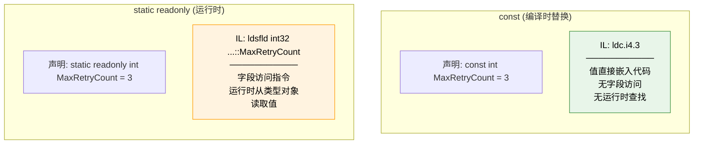
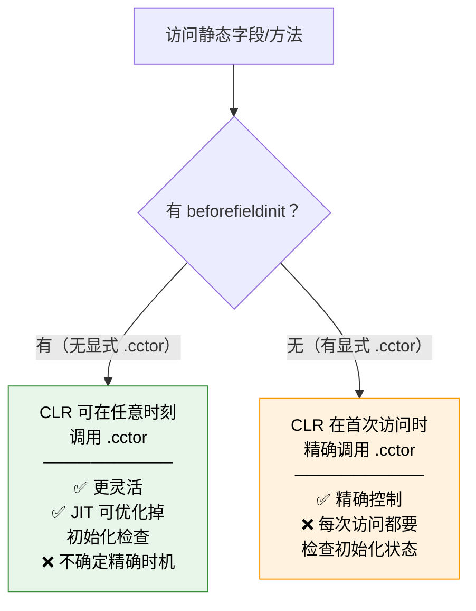
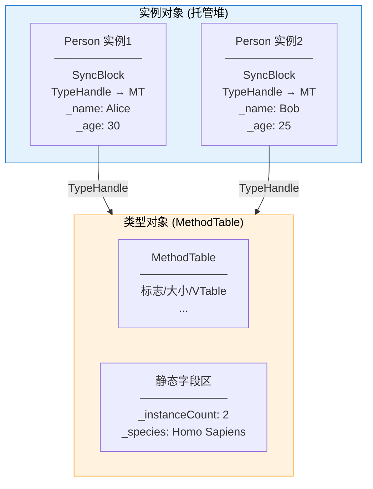
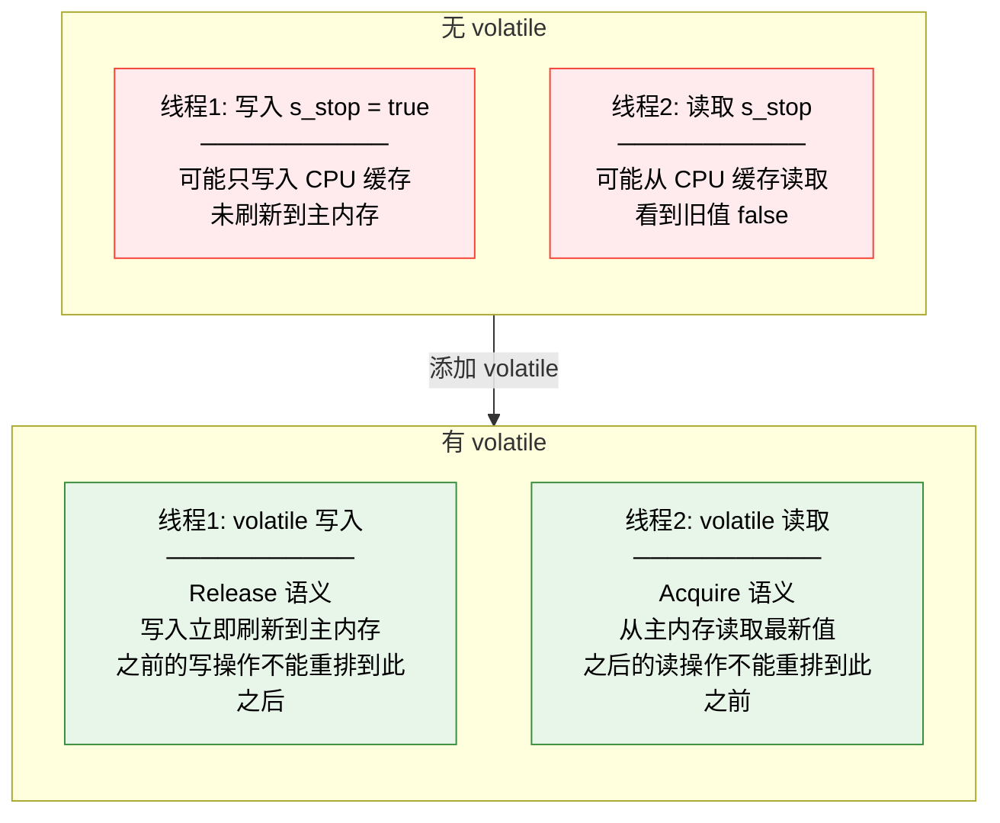
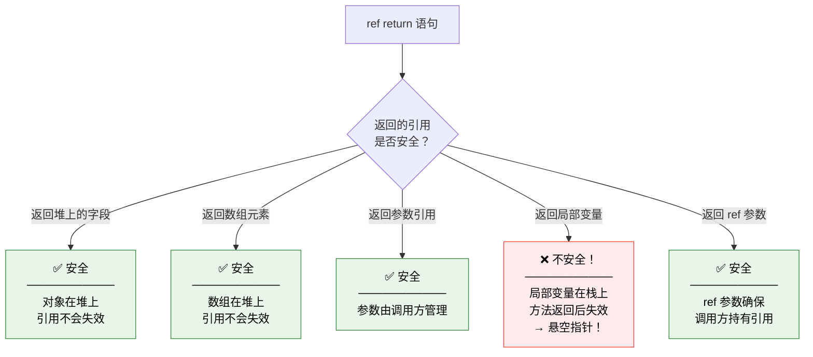
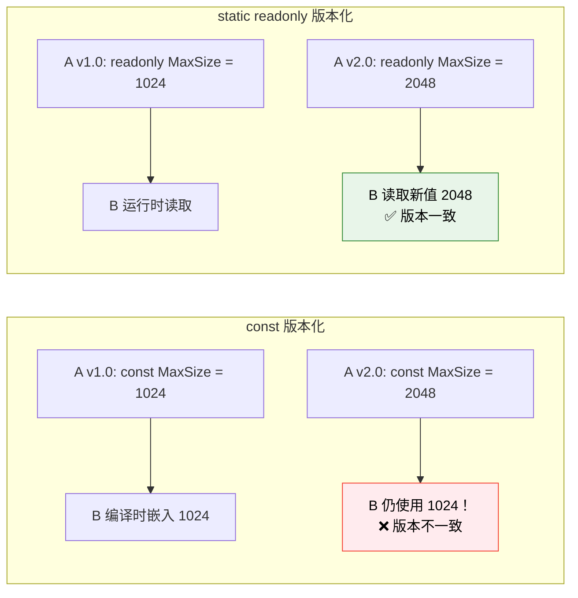
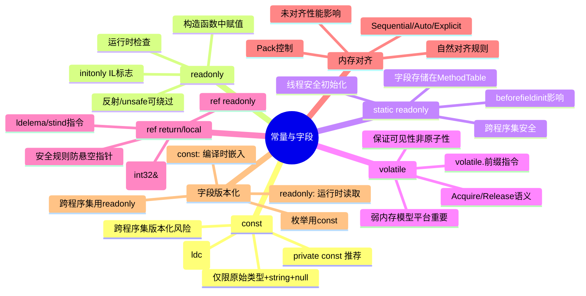

# 常量与字段

::: important 核心问题
`const` 和 `static readonly` 到底有什么区别？为什么修改 const 值后必须重新编译所有引用方？`volatile` 在 IL 层面做了什么？`ref return` 的底层原理是什么？字段的内存对齐如何影响性能？
:::

## 一、const 编译时替换

`const` 是 C# 中声明常量的关键字，其值在编译时确定，并直接嵌入到使用处的 IL 代码中。

### 1.1 const 的编译时替换机制

```csharp
using System;

public class MathConstants
{
    // const 声明
    public const double Pi = 3.14159265358979;
    public const int MaxRetryCount = 3;
    public const string AppName = "MyApp";
}

public class ConstantConsumer
{
    public double CalculateArea(double radius)
    {
        // 使用 const
        return MathConstants.Pi * radius * radius;
    }

    public void Retry()
    {
        for (int i = 0; i < MathConstants.MaxRetryCount; i++)
        {
            Console.WriteLine($"Attempt {i + 1}");
        }
    }
}
```

```il
// CalculateArea 方法的 IL —— const 值直接嵌入！
.method public hidebysig instance float64 CalculateArea(float64 radius) cil managed
{
    .maxstack 4
    IL_0000: ldc.r8 3.14159265358979    // ← Pi 的值直接嵌入！不是字段访问！
    IL_0009: ldarg.1
    IL_000a: mul
    IL_000b: ldarg.1
    IL_000c: mul
    IL_000d: ret
}

// Retry 方法的 IL —— MaxRetryCount 直接替换为数字
.method public hidebysig instance void Retry() cil managed
{
    .maxstack 3
    .locals init (int32 V_0)     // i
    IL_0000: ldc.i4.0           // i = 0
    IL_0001: stloc.0
    IL_0002: br.s IL_0010
    IL_0003: ldstr "Attempt {0}"
    IL_0008: ldloc.0
    IL_0009: ldc.i4.1
    IL_000a: add
    IL_000b: box [System.Runtime]System.Int32
    IL_0010: call void [System.Runtime]System.Console::WriteLine(string, object)
    IL_0015: ldloc.0
    IL_0016: ldc.i4.3           // ← MaxRetryCount = 3 直接嵌入！
    IL_0017: blt.s IL_0003      // i < 3
    IL_0019: ret
}
```

### 1.2 const vs static readonly 的 IL 对比



```csharp
// static readonly 版本
public class ConfigValues
{
    public static readonly int MaxRetryCount = 3;
}

public class ReadonlyConsumer
{
    public void Retry()
    {
        for (int i = 0; i < ConfigValues.MaxRetryCount; i++)
        {
            Console.WriteLine($"Attempt {i + 1}");
        }
    }
}
```

```il
// ReadonlyConsumer.Retry 的 IL
.method public hidebysig instance void Retry() cil managed
{
    .maxstack 3
    IL_0000: ldc.i4.0
    IL_0001: br.s IL_0010
    // ... 循环体 ...
    IL_0010: ldsfld int32 ConfigValues::MaxRetryCount  // ← 字段访问！
    IL_0015: blt.s IL_0003
    IL_0017: ret
}
```

### 1.3 const 的版本化陷阱

```csharp
// 程序集 A (v1.0)
public class MathConstants
{
    public const int MaxItems = 100;
}

// 程序集 B (引用 A v1.0)
public class Consumer
{
    public void Process()
    {
        // 编译时 MaxItems = 100 被直接嵌入
        int[] items = new int[100];  // ldc.i4.s 100
    }
}

// 如果 A 更新为 v1.1:
// public const int MaxItems = 200;
// 但 B 没有重新编译！
// B 仍然使用嵌入的 100！—— 版本不一致！
```

::: warning const 的版本化风险
`const` 的值在编译时嵌入使用方的 IL 代码中。如果常量所在的程序集更新了常量值，但使用方没有重新编译，使用方仍然使用旧值。这是 **DLL Hell** 的一个典型案例。

**最佳实践**：
- 跨程序集使用的值应使用 `static readonly`
- 仅在同一程序集内部使用的值（如 `private const`）才使用 `const`
- `const` 适合真正的编译时常量（如数学常数 π、枚举值）
:::

### 1.4 const 的限制

```csharp
public class ConstantLimits
{
    // ✅ 允许的类型
    public const int IntConst = 42;
    public const double DoubleConst = 3.14;
    public const string StringConst = "hello";  // 字符串是唯一的引用类型常量
    public const bool BoolConst = true;
    public const EnumType EnumConst = EnumType.ValueA;
    public const int? NullConst = null;          // null 是允许的

    // ❌ 不允许的类型
    // public const DateTime DateConst = new DateTime(2024, 1, 1);  // CS0133
    // public const StringBuilder SbConst = new StringBuilder();    // CS0133
    // public const int[] ArrayConst = new int[] { 1, 2, 3 };      // CS0133

    // 原因：const 的值必须是编译时可确定的字面量
    // DateTime、StringBuilder、数组等需要在运行时调用构造函数
}
```

## 二、readonly 运行时检查

`readonly` 修饰符确保字段只能在构造函数中赋值，在运行时由 CLR 强制执行。

### 2.1 readonly 的 IL 实现

```csharp
public class ReadOnlyDemo
{
    public readonly int InstanceField;
    public static readonly int StaticField = 42;

    public ReadOnlyDemo(int value)
    {
        InstanceField = value;  // 构造函数中允许赋值
    }

    public void TryModify()
    {
        // InstanceField = 100;  // CS0191: 无法对只读字段赋值
    }
}
```

```il
// readonly 字段在 IL 中的标志
.field public initonly int32 InstanceField
//                               ^^^^^^^^ initonly 标志

.field public static initonly int32 StaticField
//                               ^^^^^^^^ initonly 标志

// 构造函数中赋值
.method public hidebysig specialname rtspecialname
    instance void .ctor(int32 value) cil managed
{
    .maxstack 2
    IL_0000: ldarg.0
    IL_0001: call instance void [System.Runtime]System.Object::.ctor()
    IL_0006: ldarg.0
    IL_0007: ldarg.1
    IL_0008: stfld int32 ReadOnlyDemo::InstanceField  // initonly 不阻止 .ctor 中赋值
    IL_000d: ret
}
```

::: tip initonly 标志
`readonly` 在 IL 中表示为 `initonly` 标志。CLR 验证器（verifier）确保 `initonly` 字段只能在构造函数中赋值。但在 `unsafe` 代码中，可以通过指针绕过这个限制（当然这是不安全的）。
:::

### 2.2 readonly 的绕过方式

```csharp
using System;
using System.Reflection;

public class ReadOnlyBypass
{
    private readonly int _value = 42;

    public void ShowValue() => Console.WriteLine($"Value: {_value}");

    public static void Main()
    {
        var obj = new ReadOnlyBypass();
        obj.ShowValue();  // Value: 42

        // 方式1：通过反射绕过 readonly
        var field = typeof(ReadOnlyBypass).GetField("_value",
            BindingFlags.NonPublic | BindingFlags.Instance)!;
        field.SetValue(obj, 100);
        obj.ShowValue();  // Value: 100

        // 方式2：通过 unsafe 代码绕过 readonly
        // (见下文)
    }
}
```

```csharp
using System;
using System.Runtime.CompilerServices;

public unsafe class UnsafeReadOnlyBypass
{
    private readonly int _value = 42;

    public void ModifyViaPointer()
    {
        // 通过指针绕过 readonly
        fixed (int* ptr = &_value)  // readonly 字段也可以取地址
        {
            *ptr = 100;  // 直接修改！绕过 initonly 检查
        }
        Console.WriteLine($"Value: {_value}");  // 100
    }
}
```

### 2.3 readonly struct

```csharp
public readonly struct ReadOnlyStruct
{
    public readonly int X;
    public readonly int Y;

    public ReadOnlyStruct(int x, int y) => (X, Y) = (x, y);

    // 所有方法隐式标记为 readonly
    public double Distance => Math.Sqrt(X * X + Y * Y);

    // 非 readonly 方法会触发编译器警告
    // public void Offset(int dx, int dy) { X += dx; Y += dy; } // CS8340: Variables in readonly structs cannot be modified
}
```

## 三、static readonly 初始化时机

`static readonly` 字段的初始化时机与 `beforefieldinit` 标志密切相关。

### 3.1 初始化时机分析

```csharp
using System;

// 情况1：有显式静态构造函数 → 精确初始化
public class PreciseInit
{
    public static readonly DateTime StartTime = DateTime.UtcNow;

    static PreciseInit() { }  // 显式静态构造函数 → 移除 beforefieldinit
}

// 情况2：无显式静态构造函数 → beforefieldinit
public class LazyInit
{
    public static readonly DateTime StartTime = DateTime.UtcNow;
    // 没有显式静态构造函数 → 有 beforefieldinit
}
```

```il
// PreciseInit 的 TypeDef 标志
.class public auto ansi PreciseInit
       extends [System.Runtime]System.Object
{
    // 没有 beforefieldinit！
    // .cctor 只在首次访问静态字段时调用
}

// LazyInit 的 TypeDef 标志
.class public auto ansi beforefieldinit LazyInit
       extends [System.Runtime]System.Object
{
    // 有 beforefieldinit！
    // .cctor 可以更早调用
}
```

### 3.2 初始化时机的流程图



### 3.3 静态字段初始化的线程安全

```csharp
using System;
using System.Threading;

public class ThreadSafeStaticInit
{
    // static readonly 的初始化是线程安全的
    // CLR 保证 .cctor 只执行一次
    public static readonly ExpensiveResource Resource = new ExpensiveResource();

    // 等价于:
    // private static readonly ExpensiveResource s_resource;
    // static ThreadSafeStaticInit()
    // {
    //     s_resource = new ExpensiveResource();  // CLR 保证原子性和可见性
    // }
}

public class ExpensiveResource
{
    public ExpensiveResource()
    {
        Console.WriteLine($"[Thread {Thread.CurrentThread.ManagedThreadId}] 初始化资源");
        Thread.Sleep(100); // 模拟耗时操作
    }
}
```

## 四、字段存储位置

### 4.1 静态字段在类型对象上

静态字段存储在 MethodTable 的静态字段区，而非实例对象中：



```csharp
public class Person
{
    // 实例字段 —— 每个实例有独立副本
    private readonly string _name;
    private readonly int _age;

    // 静态字段 —— 所有实例共享，存储在 MethodTable 上
    private static int s_instanceCount;
    private static readonly string s_species = "Homo Sapiens";

    public Person(string name, int age)
    {
        _name = name;
        _age = age;
        s_instanceCount++;
    }
}
```

```il
// 实例字段访问 —— 通过 ldarg.0 (this) + ldfld
IL_0000: ldarg.0
IL_0001: ldfld string Person::_name

// 静态字段访问 —— 通过 ldsfld
IL_0000: ldsfld int32 Person::s_instanceCount
// ldsfld 直接访问 MethodTable 静态字段区
```

### 4.2 字段存储对比

| 字段类型 | 存储位置 | IL 指令 | 生命周期 |
|---------|---------|---------|---------|
| 实例字段 | 堆上的实例对象内 | `ldfld` / `stfld` | 与实例相同 |
| 静态字段 | MethodTable 静态字段区 | `ldsfld` / `stsfld` | 与类型相同（进程级别） |
| 线程静态字段 | TLS（线程本地存储） | `ldsfld` / `stsfld`（CLR 内部路由到 TLS） | 与线程相同 |
| const | 无存储（编译时替换） | `ldc.*` | 无运行时存在 |

### 4.3 线程静态字段

```csharp
using System;
using System.Threading;

public class ThreadStaticDemo
{
    // ThreadStatic —— 每个线程有独立的副本
    [ThreadStatic]
    private static int s_threadCounter;

    // .NET 4+ 推荐: ThreadLocal<T>
    private static readonly ThreadLocal<int> s_threadLocalCounter =
        new ThreadLocal<int>(() => 0);

    public static void Increment()
    {
        s_threadCounter++;  // 每个线程独立计数
        s_threadLocalCounter.Value++;
    }
}
```

```il
// ThreadStatic 字段访问的 IL
.field private static int32 s_threadCounter
.custom instance void [System.Runtime]System.ThreadStaticAttribute::.ctor()

// 实际访问时使用特殊指令
IL_0000: ldsfld int32 ThreadStaticDemo::s_threadCounter
// CLR 识别 ThreadStaticAttribute，从 TLS 读取值
```

## 五、volatile 语义

`volatile` 关键字告诉编译器和运行时，某个字段可能被多个线程同时访问，禁止某些优化。

### 5.1 volatile 的内存屏障语义

```csharp
using System;
using System.Threading;

public class VolatileDemo
{
    private static bool s_stop = false;        // 非 volatile
    private static volatile bool s_volatileStop = false;  // volatile

    public static void Main()
    {
        // 问题场景: 非 volatile 可能导致无限循环
        new Thread(() =>
        {
            int x = 0;
            while (!s_stop)  // JIT 可能将 s_stop 缓存到寄存器！
            {                // 永远看不到主线程的修改
                x++;
            }
            Console.WriteLine($"Stopped at x={x}");
        }).Start();

        Thread.Sleep(100);
        s_stop = true;

        // volatile 解决方案
        new Thread(() =>
        {
            int y = 0;
            while (!s_volatileStop)  // volatile 保证每次都从内存读取
            {
                y++;
            }
            Console.WriteLine($"Volatile stopped at y={y}");
        }).Start();

        Thread.Sleep(100);
        s_volatileStop = true;
    }
}
```

### 5.2 volatile 在 IL 中的表示

```il
// 非 volatile 读写
.field private static bool s_stop

// volatile 读写
.field private static bool s_volatileStop

// 非 volatile 读取
IL_0000: ldsfld bool VolatileDemo::s_stop

// volatile 读取 —— 添加 volatile. 前缀
IL_0000: volatile.
IL_0001: ldsfld bool VolatileDemo::s_volatileStop

// 非 volatile 写入
IL_0000: stsfld bool VolatileDemo::s_stop

// volatile 写入 —— 添加 volatile. 前缀
IL_0000: volatile.
IL_0001: stsfld bool VolatileDemo::s_volatileStop
```

::: tip volatile. 前缀指令
IL 中 `volatile.` 是一个前缀指令，它修饰紧随其后的 `ldfld`/`stfld`/`ldsfld`/`stsfld` 指令。`volatile.` 告诉 CLR：
- **读取**：必须从主内存读取，不能使用缓存值
- **写入**：必须立即刷新到主内存，不能延迟
- **顺序**：不允许重排 volatile 操作与其他内存操作
:::

### 5.3 volatile 的内存屏障详解



### 5.4 volatile 的限制

```csharp
public class VolatileLimits
{
    // ✅ 允许的 volatile 类型
    private volatile bool _flag;
    private volatile int _counter;
    private volatile float _value;
    private volatile IntPtr _ptr;
    private volatile object? _ref;  // 引用类型

    // ❌ 不允许的 volatile 类型
    // private volatile double _d;      // CS0665: 64位以上原始类型在32位平台不保证原子性
    // private volatile long _l;        // CS0665: 同上
    // private volatile DateTime _dt;   // CS0665: 非原始类型
}
```

::: warning volatile 的局限性
1. **不保证原子性**：`volatile` 只保证可见性，不保证复合操作的原子性（如 `x++` 仍然不是原子的）
2. **64位限制**：在 32 位平台上，`long`/`double` 的读写不是原子的，`volatile` 不适用于这些类型
3. **不替代锁**：`volatile` 只提供轻量级的可见性保证，复杂的同步仍需要 `lock` 或其他同步原语
4. **x86 强内存模型**：在 x86/x64 上，由于强内存模型，大多数情况下 `volatile` 的效果不明显，但在 ARM 等弱内存模型平台上非常重要
:::

### 5.5 Thread.VolatileRead/Write vs volatile

```csharp
using System;
using System.Threading;

public class VolatileMethodComparison
{
    private static int s_value;

    // 方式1: volatile 字段
    private static volatile int s_volatileValue;

    // 方式2: Thread.VolatileRead / VolatileWrite
    public static int ReadWithVolatileMethod()
    {
        return Thread.VolatileRead(ref s_value);
        // 等价于: MemoryBarrier(); return s_value;
    }

    public static void WriteWithVolatileMethod(int value)
    {
        Thread.VolatileWrite(ref s_value, value);
        // 等价于: s_value = value; MemoryBarrier();
    }

    // 方式3: Volatile.Read / Volatile.Write (.NET 4.5+)
    public static int ReadWithVolatileClass()
    {
        return Volatile.Read(ref s_value);
        // Acquire 语义: 后续读操作不能重排到此之前
    }

    public static void WriteWithVolatileClass(int value)
    {
        Volatile.Write(ref s_value, value);
        // Release 语义: 之前的写操作不能重排到此之后
    }

    // 方式4: Interlocked (最强保证)
    public static int ReadWithInterlocked()
    {
        return Interlocked.CompareExchange(ref s_value, 0, 0);
        // 全屏障: 原子读取
    }
}
```

### 5.6 内存屏障保证级别对比

| 方式 | 读语义 | 写语义 | 原子性 | 性能 |
|------|--------|--------|--------|------|
| 普通读写 | 无 | 无 | 无 | 最快 |
| `volatile` | Acquire | Release | 无 | 快 |
| `Volatile.Read/Write` | Acquire | Release | 无 | 快 |
| `Thread.VolatileRead/Write` | Full | Full | 无 | 中 |
| `Interlocked` | Full | Full | 有 | 较慢 |
| `lock` | Full | Full | 有 | 最慢 |

## 六、ref return 与 ref local

C# 7.0 引入了 `ref return` 和 `ref local`，允许返回和存储对变量的引用，而非值的副本。

### 6.1 ref return 的基本用法

```csharp
using System;

public class RefReturnDemo
{
    private int[] _data = new int[] { 1, 2, 3, 4, 5 };

    // ref return —— 返回数组元素的引用
    public ref int GetByIndex(int index)
    {
        if (index < 0 || index >= _data.Length)
            throw new IndexOutOfRangeException();
        return ref _data[index];  // 返回引用，不是副本！
    }

    // ref readonly —— 返回只读引用
    public ref readonly int GetReadOnly(int index)
    {
        return ref _data[index];  // 返回引用，但调用方不能修改
    }

    public static void Main()
    {
        var demo = new RefReturnDemo();

        // 通过 ref return 直接修改数组元素
        ref int element = ref demo.GetByIndex(2);
        element = 100;  // 修改了 _data[2]
        Console.WriteLine(string.Join(", ", demo._data));  // 1, 2, 100, 4, 5

        // ref readonly
        ref readonly int roElement = ref demo.GetReadOnly(0);
        // roElement = 200;  // 编译错误！readonly 引用不能赋值
        Console.WriteLine($"Readonly: {roElement}");
    }
}
```

### 6.2 ref return/local 的 IL 实现

```il
// GetByIndex 方法的 IL
.method public hidebysig instance int32&
    GetByIndex(int32 index) cil managed
{
    .maxstack 2
    .locals init (int32& V_0)

    IL_0000: ldarg.1
    IL_0001: ldc.i4.0
    IL_0002: blt.s IL_000a
    IL_0004: ldarg.1
    IL_0005: ldarg.0
    IL_0006: ldfld int32[] RefReturnDemo::_data
    IL_000b: ldlen
    IL_000c: blt.s IL_0014

    IL_000a: newobj instance void [System.Runtime]System.IndexOutOfRangeException::.ctor()
    IL_000f: throw

    IL_0014: ldarg.0
    IL_0015: ldfld int32[] RefReturnDemo::_data
    IL_001a: ldarg.1
    IL_001b: ldelema [System.Runtime]System.Int32    // ← 返回托管指针！
    IL_0020: stloc.0
    IL_0021: br.s IL_0023
    IL_0023: ldloc.0
    IL_0024: ret
}
```

```il
// ref local 的使用
.method public hidebysig static void Main() cil managed
{
    .maxstack 2
    .locals init (class RefReturnDemo V_0,
                  int32& V_1)           // ← ref local 是托管指针！

    // ref int element = ref demo.GetByIndex(2);
    IL_0000: newobj instance void RefReturnDemo::.ctor()
    IL_0005: stloc.0
    IL_0006: ldloc.0
    IL_0007: ldc.i4.2
    IL_0008: call instance int32& RefReturnDemo::GetByIndex(int32)
    IL_000d: stloc.1                   // 存储托管指针

    // element = 100;
    IL_000e: ldloc.1
    IL_000f: ldc.i4.s 100
    IL_0011: stind.i4                  // ← 通过指针间接存储！
}
```

### 6.3 ref return 的安全规则



```csharp
public class RefReturnSafety
{
    private int _field = 42;
    private int[] _array = new int[10];

    // ✅ 安全: 返回堆上的字段
    public ref int GetField() => ref _field;

    // ✅ 安全: 返回数组元素
    public ref int GetArrayElement(int i) => ref _array[i];

    // ✅ 安全: 返回 ref 参数
    public ref int PassThrough(ref int value) => ref value;

    // ❌ 不安全: 编译器阻止！
    // public ref int GetLocal()
    // {
    //     int local = 42;
    //     return ref local;  // CS8168: 不能返回局部变量的引用
    // }

    // ✅ 安全: 返回 ref struct 的成员
    public ref int GetSpanElement(Span<int> span, int i) => ref span[i];
}
```

## 七、内存对齐与 padding

### 7.1 字段对齐规则

CLR 的字段对齐规则确保高效的数据访问：

```csharp
using System;
using System.Runtime.InteropServices;

public class AlignmentExample
{
    // 引用类型字段排列（class 默认 Auto 布局）
    public byte A;      // 1 byte
    public int B;       // 4 bytes
    public byte C;      // 1 byte
    public long D;      // 8 bytes

    // CLR 可能重排为: D(8) + B(4) + A(1) + C(1) + pad(2) = 16 bytes (字段区)
    // 加上对象头: 16 + 16 = 32 bytes
}

[StructLayout(LayoutKind.Sequential)]
public struct SequentialStruct
{
    public byte A;      // 偏移: 0, 大小: 1
    // padding: 3 bytes
    public int B;       // 偏移: 4, 大小: 4
    public byte C;      // 偏移: 8, 大小: 1
    // padding: 7 bytes
    public long D;      // 偏移: 16, 大小: 8
}
// 总大小: 24 bytes
```

### 7.2 使用 Pack 控制对齐

```csharp
[StructLayout(LayoutKind.Sequential, Pack = 1)]
public struct PackedStruct
{
    public byte A;      // 偏移: 0
    public int B;       // 偏移: 1 (Pack=1 不对齐！)
    public byte C;      // 偏移: 5
    public long D;      // 偏移: 6 (未对齐！)
}
// 总大小: 14 bytes

[StructLayout(LayoutKind.Sequential, Pack = 4)]
public struct Pack4Struct
{
    public byte A;      // 偏移: 0
    // padding: 3 bytes
    public int B;       // 偏移: 4
    public byte C;      // 偏移: 8
    // padding: 3 bytes
    public long D;      // 偏移: 12 (对齐到 4，不是 8)
}
// 总大小: 20 bytes
```

### 7.3 对齐与性能

```csharp
using BenchmarkDotNet.Attributes;

[MemoryDiagnoser]
public class AlignmentPerformanceBenchmark
{
    private const int Count = 10_000_000;
    private AlignedStruct[] _aligned = new AlignedStruct[Count];
    private UnalignedStruct[] _unaligned = new UnalignedStruct[Count];

    [Benchmark(Baseline = true)]
    public long SumAligned()
    {
        long sum = 0;
        for (int i = 0; i < Count; i++)
        {
            sum += _aligned[i].Value;
        }
        return sum;
    }

    [Benchmark]
    public long SumUnaligned()
    {
        long sum = 0;
        for (int i = 0; i < Count; i++)
        {
            sum += _unaligned[i].Value;
        }
        return sum;
    }
}

[StructLayout(LayoutKind.Sequential)]
public struct AlignedStruct
{
    public long Value;  // 8 字节对齐
}

[StructLayout(LayoutKind.Sequential, Pack = 1)]
public struct UnalignedStruct
{
    public byte Flag;   // 偏移: 0
    public long Value;  // 偏移: 1 (未对齐！)
}
```

## 八、字段版本化问题

### 8.1 const 的版本化（回顾）

```csharp
// 程序集 A v1.0
public class Constants
{
    public const int Version = 1;
    public const int MaxSize = 1024;
}

// 程序集 B 使用 Constants
public class Consumer
{
    public bool IsLatest() => Constants.Version == 1;
    // IL: ldc.i4.1; ret (直接返回 true!)
}

// 如果 A 更新到 v2.0: const int Version = 2
// 但 B 没有重新编译，B 仍然认为 Version == 1
```

### 8.2 static readonly 的版本化

```csharp
// 程序集 A v1.0
public class Config
{
    public static readonly int Version = 1;
    public static readonly int MaxSize = 1024;
}

// 程序集 B 使用 Config
public class Consumer
{
    public bool IsLatest() => Config.Version == 1;
    // IL: ldsfld int32 Config::Version; ldc.i4.1; ceq
    // 运行时从 A 的 MethodTable 读取 Version
}

// 如果 A 更新到 v2.0: static readonly int Version = 2
// B 不需要重新编译，运行时自动读取新值！
```

### 8.3 版本化策略对比



::: important 版本化最佳实践
- **跨程序集的值**：使用 `static readonly`，确保更新后引用方自动获取新值
- **同一程序集内**：使用 `const` 获得编译时优化
- **枚举值**：使用 `const`（枚举底层就是 const）
- **配置值**：使用 `static readonly` + 配置文件
:::

## 九、实战：字段布局分析工具

### 9.1 使用 Marshal 和 Unsafe 检查布局

```csharp
using System;
using System.Runtime.InteropServices;
using System.Runtime.CompilerServices;

public class FieldLayoutTool
{
    public static void AnalyzeStruct<T>() where T : struct
    {
        Console.WriteLine($"=== {typeof(T).Name} 布局分析 ===");
        Console.WriteLine($"Marshal 大小: {Marshal.SizeOf<T>()} bytes");
        Console.WriteLine($"Unsafe 大小: {Unsafe.SizeOf<T>()} bytes");
        Console.WriteLine();

        foreach (var field in typeof(T).GetFields())
        {
            try
            {
                int offset = Marshal.OffsetOf<T>(field.Name).ToInt32();
                int size = Marshal.SizeOf(field.FieldType);
                Console.WriteLine($"  {field.Name} ({field.FieldType.Name}): " +
                    $"偏移={offset}, 大小={size}");
            }
            catch (Exception ex)
            {
                Console.WriteLine($"  {field.Name}: 无法获取偏移 ({ex.Message})");
            }
        }
    }
}
```

### 9.2 使用 ObjectLayoutInspector

```csharp
// 使用 ObjectLayoutInspector NuGet 包
// dotnet add package ObjectLayoutInspector

using ObjectLayoutInspector;
using System;

public class ObjectLayoutDemo
{
    public static void Main()
    {
        // 检查引用类型的布局
        TypeLayout layout = TypeLayout.GetLayout<Person>();
        Console.WriteLine(layout);

        // 检查值类型的布局
        TypeLayout pointLayout = TypeLayout.GetLayout<PointStruct>();
        Console.WriteLine(pointLayout);
    }
}

public class Person
{
    private string _name;
    private int _age;
    private bool _isActive;
}

public struct PointStruct
{
    public int X;
    public int Y;
}
```

## 十、总结



::: important 关键要点回顾
1. **const**：编译时值替换（`ldc` 指令），无运行时字段访问，跨程序集存在版本化风险
2. **readonly**：IL 中 `initonly` 标志，构造函数外赋值被 CLR 验证器阻止，但反射和 unsafe 可绕过
3. **static readonly**：存储在 MethodTable 静态字段区，`beforefieldinit` 影响初始化时机，跨程序集版本化安全
4. **volatile**：IL 中 `volatile.` 前缀指令，提供 Acquire/Release 语义保证可见性，不保证原子性
5. **ref return/local**：IL 中使用托管指针（`&`），`ldelema` 返回元素地址，`stind` 间接存储
6. **内存对齐**：默认按自然大小对齐，`Pack` 控制对齐粒度，未对齐访问影响性能
7. **版本化**：跨程序集使用 `static readonly`，同一程序集内使用 `const`
:::

---

**参考资料**

- Jeffrey Richter.《CLR via C#》第4版, Chapter 7 "Constants and Fields". Microsoft Press, 2012.
- ECMA-335. Partition III "CIL Instruction Set", §3.49 "ldc", §3.61 "ldfld", §3.63 "ldsfld", §3.71 "volatile". 2012.
- Joe Duffy.《Concurrent Programming on Windows》, Chapter 6 "Memory Models and Visibility". Addison-Wesley, 2008.
- dotnet/runtime 源码. `src/coreclr/vm/field.cpp`, `src/coreclr/vm/jitinterface.cpp`.
- Vladimir Sadov.《C# 7.0 internals: Ref returns". 2017.
