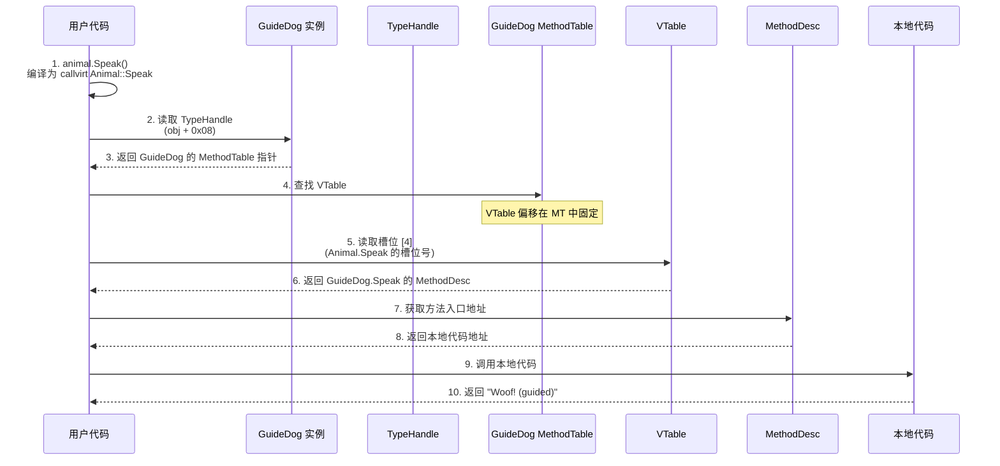
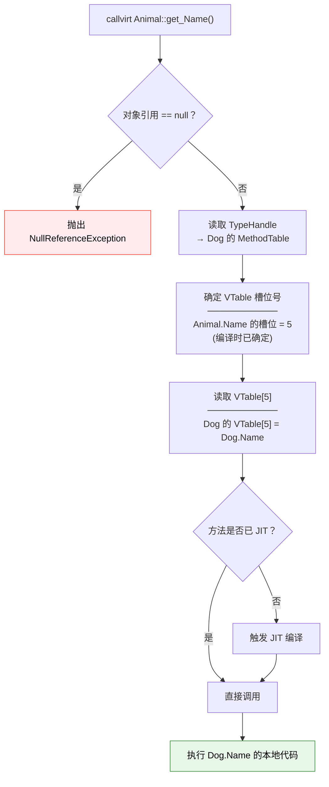
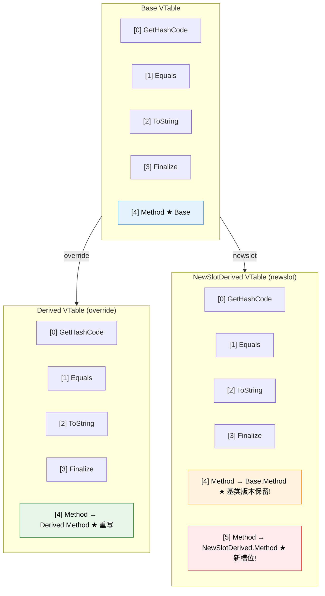
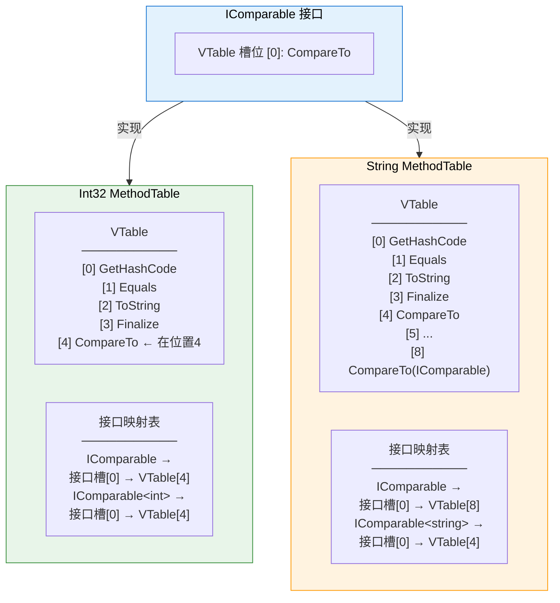
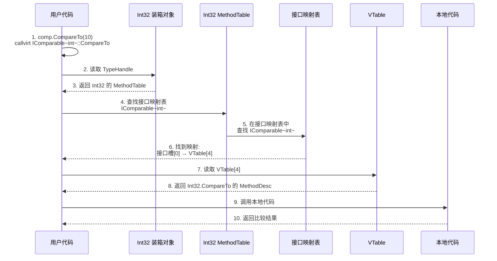
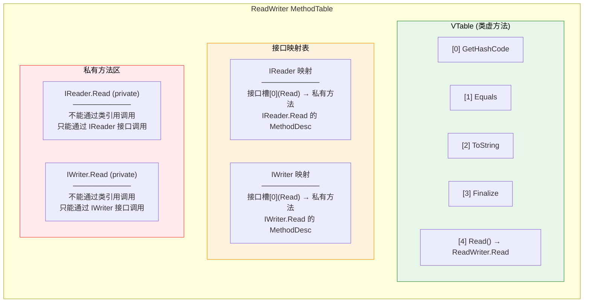
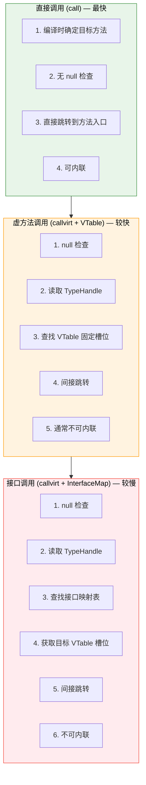
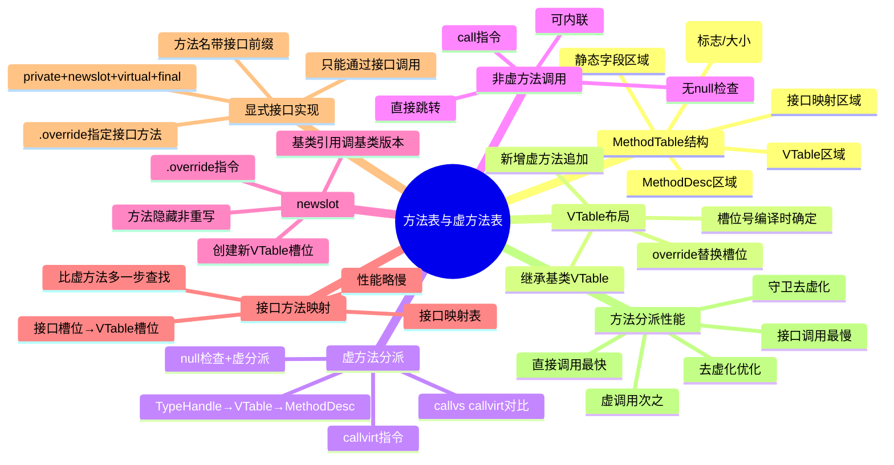

# 方法表与虚方法表

::: important 核心问题
CLR 如何在运行时决定调用哪个虚方法的实现？VTable 的布局规则是什么？`newslot` 和 `override` 如何影响 VTable？接口方法的分派为什么比类虚方法慢？显式接口实现在方法表中的表示是什么？
:::

## 一、MethodTable 详细结构

MethodTable 是 CLR 类型系统的核心数据结构，每个加载的类型都有一个 MethodTable 实例。本节深入 MethodTable 的内部结构。

### 1.1 MethodTable 完整结构图

```mermaid
flowchart TB
    subgraph MT["MethodTable 完整结构"]
        direction TB

        subgraph Header["头部信息 (40+ bytes)"]
            FLAGS["m_dwFlags<br/>───────────<br/>▪ TYPE_CLASS / TYPE_VALUETYPE<br/>▪ IsInterface<br/>▪ IsAbstract<br/>▪ HasFinalizer<br/>▪ IsGenericType<br/>▪ IsArray<br/>▪ HasCriticalFinalizer"]
            BASE_SIZE["m_cbBaseSize<br/>───────────<br/>基类实例大小<br/>(含对象头)"]
            INST_SIZE["m_cbInstanceSize<br/>───────────<br/>当前类型实例大小"]
            NUM_METHODS["m_wNumMethods<br/>───────────<br/>方法总数"]
            NUM_VSLOTS["m_wNumVirtuals<br/>───────────<br/>虚方法槽位数"]
            NUM_IFACES["m_wNumInterfaces<br/>───────────<br/>实现接口数"]
            NUM_STATIC["m_wNumStaticFields<br/>───────────<br/>静态字段数"]
            BASE_MT_PTR["m_pBaseMethodTable<br/>───────────<br/>基类 MT 指针"]
            EECLASS_PTR2["m_pEEClass<br/>───────────<br/>EEClass 指针"]
            MODULE_PTR["m_pModule<br/>───────────<br/>所属模块指针"]
        end

        subgraph VTableRegion["VTable 区域 (虚方法槽位数 × 8 bytes)"]
            VSLOT0["[0] Object.GetHashCode"]
            VSLOT1["[1] Object.Equals"]
            VSLOT2["[2] Object.ToString"]
            VSLOT3["[3] Object.Finalize"]
            VSLOT4["[4] 虚方法 A"]
            VSLOT5["[5] 虚方法 B"]
            VSLOTN["..."]
        end

        subgraph IFaceMapRegion["接口映射区域"]
            IMAP0["接口1 → 方法槽映射表"]
            IMAP1["接口2 → 方法槽映射表"]
            IMAPN["..."]
        end

        subgraph StaticRegion["静态字段区域"]
            SF0["static 字段 1"]
            SF1["static 字段 2"]
            SFN["..."]
        end

        subgraph MDescRegion["MethodDesc 区域"]
            MD0[".ctor → MethodDesc"]
            MD1["方法 A → MethodDesc"]
            MD2["虚方法 B → MethodDesc"]
            MDN["..."]
        end
    end

    Header --> VTableRegion --> IFaceMapRegion --> StaticRegion --> MDescRegion

    style Header fill:#e3f2fd,stroke:#1976d2,color:#000
    style VTableRegion fill:#e8f5e9,stroke:#388e3c,color:#000
    style IFaceMapRegion fill:#fff3e0,stroke:#ff9800,color:#000
    style StaticRegion fill:#f3e5f5,stroke:#9c27b0,color:#000
    style MDescRegion fill:#e0f2f1,stroke:#009688,color:#000
```



### 1.2 具体类型的 MethodTable 示例

```csharp
public class Animal
{
    public virtual string Speak() => "...";
    public virtual string Name => "Animal";
}

public class Dog : Animal
{
    public override string Speak() => "Woof!";
    public override string Name => "Dog";
    public virtual string Breed => "Unknown";
}

public class GuideDog : Dog
{
    public override string Speak() => "Woof! (guided)";
    public override string Name => "GuideDog";
    public override string Breed => "Labrador";
    public string Owner { get; set; } = "";
}
```

GuideDog 的 MethodTable 布局：

```
MethodTable: GuideDog
─────────────────────────────────────────────────────
头部:
  m_dwFlags         = TYPE_CLASS
  m_cbInstanceSize  = 24 (SyncBlock[8] + TypeHandle[8] + Owner[8])
  m_wNumMethods     = 6 (Speak + Name + Breed + Owner getter + Owner setter + .ctor)
  m_wNumVirtuals    = 7 (4 继承 + 3 新增: Speak + Name + Breed)
  m_pBaseMethodTable → Dog 的 MethodTable

VTable (继承链虚方法槽):
─────────────────────────────────────────────────────
  [0] Object.GetHashCode  → Object.GetHashCode (未重写)
  [1] Object.Equals       → Object.Equals (未重写)
  [2] Object.ToString     → Object.ToString (未重写)
  [3] Object.Finalize     → Object.Finalize (未重写)
  [4] Animal.Speak        → GuideDog.Speak (重写!)  ← 槽位复用
  [5] Animal.Name         → GuideDog.Name (重写!)   ← 槽位复用
  [6] Dog.Breed           → GuideDog.Breed (重写!)  ← 槽位复用

接口映射: (无接口实现)

静态字段: (无静态字段)

MethodDesc 数组:
  [0] GuideDog.Speak
  [1] GuideDog.Name_get
  [2] GuideDog.Breed_get
  [3] GuideDog.Owner_get
  [4] GuideDog.Owner_set
  [5] GuideDog..ctor
```

## 二、VTable 布局与继承链

VTable（虚方法表）是 MethodTable 中最关键的区域，它决定了虚方法的调度行为。

### 2.1 VTable 的继承规则

VTable 的构建遵循以下规则：

1. **继承基类 VTable**：子类的 VTable 开头是基类 VTable 的副本
2. **重写替换槽位**：重写（override）的方法替换基类 VTable 中对应槽位的入口
3. **新增追加槽位**：子类新增的虚方法追加到 VTable 末尾
4. **newslot 创建新槽**：`newslot`（C# 中的 `new` 关键字）在 VTable 末尾创建新槽，即使签名相同

### 2.2 VTable 继承链图

```mermaid
flowchart TB
    subgraph ObjectVT["Object VTable"]
        O0["[0] GetHashCode"]
        O1["[1] Equals"]
        O2["[2] ToString"]
        O3["[3] Finalize"]
    end

    subgraph AnimalVT["Animal VTable (继承 Object)"]
        A0["[0] GetHashCode ← Object"]
        A1["[1] Equals ← Object"]
        A2["[2] ToString ← Object"]
        A3["[3] Finalize ← Object"]
        A4["[4] Speak ★ Animal 新增"]
        A5["[5] Name_get ★ Animal 新增"]
    end

    subgraph DogVT["Dog VTable (继承 Animal)"]
        D0["[0] GetHashCode ← Object"]
        D1["[1] Equals ← Object"]
        D2["[2] ToString ← Object"]
        D3["[3] Finalize ← Object"]
        D4["[4] Speak → Dog.Speak ★ 重写"]
        D5["[5] Name_get → Dog.Name ★ 重写"]
        D6["[6] Breed_get ★ Dog 新增"]
    end

    subgraph GuideDogVT["GuideDog VTable (继承 Dog)"]
        G0["[0] GetHashCode ← Object"]
        G1["[1] Equals ← Object"]
        G2["[2] ToString ← Object"]
        G3["[3] Finalize ← Object"]
        G4["[4] Speak → GuideDog.Speak ★ 重写"]
        G5["[5] Name_get → GuideDog.Name ★ 重写"]
        G6["[6] Breed_get → GuideDog.Breed ★ 重写"]
    end

    ObjectVT --> |"继承"| AnimalVT
    AnimalVT --> |"继承+重写"| DogVT
    DogVT --> |"继承+重写"| GuideDogVT

    style A4 fill:#e8f5e9,stroke:#388e3c,color:#000
    style A5 fill:#e8f5e9,stroke:#388e3c,color:#000
    style D4 fill:#fff3e0,stroke:#ff9800,color:#000
    style D5 fill:#fff3e0,stroke:#ff9800,color:#000
    style D6 fill:#e8f5e9,stroke:#388e3c,color:#000
    style G4 fill:#ffebee,stroke:#f44336,color:#000
    style G5 fill:#ffebee,stroke:#f44336,color:#000
    style G6 fill:#ffebee,stroke:#f44336,color:#000
```



### 2.3 虚方法调用的完整路径

```csharp
public class VTableCallDemo
{
    public static void Main()
    {
        Animal animal = new GuideDog();
        string sound = animal.Speak();  // 调用 GuideDog.Speak
    }
}
```



## 三、虚方法调度 —— callvirt IL 执行流程

`callvirt` 是 CLR 中虚方法调用的核心指令。

### 3.1 callvirt 的 IL 语义

```csharp
public class CallVirtDemo
{
    public static void Main()
    {
        Animal animal = new Dog();
        string name = animal.Name;  // callvirt
    }
}
```

```il
.method public hidebysig static void Main() cil managed
{
    .maxstack 1
    .locals init (class Animal V_0)

    IL_0000: newobj instance void Dog::.ctor()
    IL_0005: stloc.0

    IL_0006: ldloc.0
    IL_0007: callvirt instance string Animal::get_Name()
    //       ^^^^^^^^ callvirt —— 虚方法调用
    //       1. 检查 ldloc.0 是否为 null (NullReferenceException)
    //       2. 读取对象的 TypeHandle → MethodTable
    //       3. 查找 VTable 槽位
    //       4. 调用槽位中的方法

    IL_000c: pop
    IL_000d: ret
}
```

### 3.2 callvirt 的执行步骤



::: important callvirt 的两个关键特性
1. **null 检查**：`callvirt` 自动检查调用对象是否为 null，这是 C# 中对实例方法调用总是进行 null 检查的原因
2. **虚分派**：根据运行时对象的实际类型（通过 TypeHandle → MethodTable → VTable）确定调用哪个方法实现

对比 `call` 指令：`call` 不做 null 检查，不做虚分派，直接调用指定方法（用于非虚方法和 base 调用）
:::

### 3.3 call vs callvirt 对比

```csharp
public class CallVsCallvirt
{
    public virtual void VirtualMethod() { }
    public void NonVirtualMethod() { }

    public void Test()
    {
        // callvirt —— 虚方法调用
        VirtualMethod();        // callvirt instance void CallVsCallvirt::VirtualMethod()

        // call —— 非虚方法调用
        NonVirtualMethod();     // call instance void CallVsCallvirt::NonVirtualMethod()

        // base 调用 —— 使用 call（非虚调用）
        // base.VirtualMethod(); // call instance void Base::VirtualMethod()
    }
}
```

```il
.method public hidebysig instance void Test() cil managed
{
    .maxstack 8

    // VirtualMethod() → callvirt
    IL_0000: ldarg.0
    IL_0001: callvirt instance void CallVsCallvirt::VirtualMethod()

    // NonVirtualMethod() → call (C# 编译器对非虚方法使用 call)
    IL_0006: ldarg.0
    IL_0007: call instance void CallVsCallvirt::NonVirtualMethod()

    IL_000c: ret
}
```

| 特性 | `call` | `callvirt` |
|------|--------|-----------|
| null 检查 | 不检查 | 检查（抛出 NullReferenceException） |
| 虚分派 | 不分派（直接调用） | 分派（查 VTable） |
| 使用场景 | 非虚方法、base 调用、值类型方法 | 虚方法、接口方法 |
| 性能 | 快（直接跳转） | 较慢（查表+间接跳转） |
| C# 编译器选择 | 非虚方法默认用 call | 虚方法默认用 callvirt |

::: tip C# 编译器的 callvirt 使用
C# 编译器对实例方法调用默认使用 `callvirt`，即使方法不是虚方法。这是为了自动进行 null 检查。只有在以下情况使用 `call`：
1. 静态方法
2. `base.M()` 调用
3. 值类型的实例方法（通过 `ldloca` + `call`）
4. `struct` 的方法调用
:::

## 四、非虚方法直接调用 —— call IL

### 4.1 call 指令的执行

```csharp
public class CallDemo
{
    public static void StaticMethod() { }

    public void InstanceMethod() { }

    public static void Main()
    {
        // 静态方法 → call
        StaticMethod();

        // 实例方法 → callvirt（C# 编译器默认）
        var demo = new CallDemo();
        demo.InstanceMethod();  // callvirt

        // 但如果通过值类型调用，使用 call
        int x = 42;
        string s = x.ToString();  // call（Int32.ToString 是非虚重写）
    }
}
```

```il
// 静态方法调用 → call
IL_0000: call void CallDemo::StaticMethod()

// 实例方法调用 → callvirt
IL_0005: newobj instance void CallDemo::.ctor()
IL_000a: callvirt instance void CallDemo::InstanceMethod()

// 值类型非虚方法 → ldloca + call
IL_000f: ldloca.s x
IL_0011: call instance string [System.Runtime]System.Int32::ToString()
```

### 4.2 call 对值类型的特殊处理

值类型的方法调用使用 `ldloca`（加载地址）+ `call`（直接调用），避免了装箱：

```csharp
public struct Point
{
    public int X, Y;

    public override string ToString() => $"({X}, {Y})";
    // 重写虚方法，但通过 ldloca + call 调用时不装箱
}

public class ValueTypeCallDemo
{
    public static void Main()
    {
        var p = new Point { X = 1, Y = 2 };

        // 直接调用 ToString —— 不装箱
        string s1 = p.ToString();
        // IL: ldloca.s p; call instance string Point::ToString()

        // 通过虚方法表调用 —— 需要装箱
        object obj = p;
        string s2 = obj.ToString();
        // IL: ldloc.0; box Point; callvirt instance string Object::ToString()
    }
}
```

## 五、newslot 与 override 对 VTable 的影响

### 5.1 newslot 的作用

C# 中的 `new` 方法修饰符对应 IL 中的 `newslot` 标志，它告诉 CLR 在 VTable 中创建新的槽位，而不是复用基类的槽位。

```csharp
public class Base
{
    public virtual void Method() => Console.WriteLine("Base.Method");
}

public class Derived : Base
{
    // override —— 复用基类 VTable 槽位
    public override void Method() => Console.WriteLine("Derived.Method (override)");
}

public class NewSlotDerived : Base
{
    // new (newslot) —— 创建新的 VTable 槽位
    public new void Method() => Console.WriteLine("NewSlotDerived.Method (newslot)");
}
```

```il
// Derived.Method —— override (复用槽位)
.method public hidebysig virtual instance void Method() cil managed
{
    // 无 newslot 标志，复用 Base.Method 的 VTable 槽位
}

// NewSlotDerived.Method —— newslot (新槽位)
.method public hidebysig newslot virtual instance void Method() cil managed
{
    // newslot 标志！创建新的 VTable 槽位
}
```

### 5.2 newslot 对 VTable 布局的影响



### 5.3 newslot 的运行时行为

```csharp
public class NewSlotBehavior
{
    public static void Main()
    {
        Base b1 = new Derived();
        b1.Method();  // "Derived.Method (override)" — 虚分派到 Derived

        Base b2 = new NewSlotDerived();
        b2.Method();  // "Base.Method" — 虚分派到 Base（槽位[4]仍是 Base.Method）

        NewSlotDerived ns = new NewSlotDerived();
        ns.Method();   // "NewSlotDerived.Method (newslot)" — 直接调用新槽位[5]

        // 关键区别：
        // override: Base 引用看到的是重写后的方法
        // newslot: Base 引用看到的仍是基类方法
    }
}
```

```il
// b1.Method() → callvirt (虚分派，使用槽位[4])
IL_0000: ldloc.0
IL_0001: callvirt instance void Base::Method()

// b2.Method() → callvirt (虚分派，使用槽位[4])
// NewSlotDerived 的 VTable[4] 仍然是 Base.Method！
IL_0000: ldloc.1
IL_0001: callvirt instance void Base::Method()

// ns.Method() → callvirt (使用新槽位[5])
// 编译器知道 ns 的编译时类型是 NewSlotDerived
IL_0000: ldloc.2
IL_0001: callvirt instance void NewSlotDerived::Method()
```

::: warning newslot 的陷阱
`new`（newslot）是方法隐藏，不是方法重写。它不会参与多态分派。当你通过基类引用调用方法时，调用的是基类版本。这可能导致意想不到的行为，应谨慎使用。只有在明确需要"版本隔离"时才使用 `new`。
:::

## 六、接口方法映射表

接口方法的分派比类虚方法复杂，因为接口的 VTable 槽位号在不同实现类中可能不同。CLR 使用接口映射表来解决这个问题。

### 6.1 接口映射的原理



### 6.2 接口方法的调用流程

```csharp
public class InterfaceCallDemo
{
    public static void Main()
    {
        IComparable<int> comp = 42;
        int result = comp.CompareTo(10);  // 接口方法调用
    }
}
```



### 6.3 接口映射表的详细结构

```csharp
// 接口映射表的内部结构（概念模型）
struct InterfaceMap
{
    MethodTable* InterfaceType;     // 接口类型的 MethodTable
    uint16_t InterfaceSlotStart;    // 接口 VTable 的起始槽位
    uint16_t MethodCount;           // 接口方法数量
    uint16_t TargetSlotOffsets[];   // 目标 VTable 槽位偏移数组
    // TargetSlotOffsets[i] = 实现类 VTable 中对应接口方法 i 的槽位号
}
```

### 6.4 接口方法调用的 IL

```csharp
public interface IWorker
{
    string DoWork();
}

public class Worker : IWorker
{
    public string DoWork() => "Working";
}

public class InterfaceILDemo
{
    public static void Main()
    {
        IWorker worker = new Worker();
        string result = worker.DoWork();
    }
}
```

```il
.method public hidebysig static void Main() cil managed
{
    .maxstack 1
    .locals init (class IWorker V_0)

    IL_0000: newobj instance void Worker::.ctor()
    IL_0005: stloc.0

    IL_0006: ldloc.0
    IL_0007: callvirt instance string IWorker::DoWork()
    //       ^^^^^^^^ callvirt — 但通过接口映射表分派
    //       不是直接查 VTable 槽位，而是:
    //       1. 查找对象的 MethodTable
    //       2. 在接口映射表中查找 IWorker
    //       3. 获取目标 VTable 槽位
    //       4. 调用对应方法

    IL_000c: pop
    IL_000d: ret
}
```

## 七、显式接口实现的方法表条目

显式接口实现是 C# 中实现接口方法的一种特殊方式，它在方法表中有独特的表示。

### 7.1 显式接口实现

```csharp
using System;

public interface IReader
{
    string Read();
}

public interface IWriter
{
    string Read();
}

public class ReadWriter : IReader, IWriter
{
    // 隐式实现 —— 同时满足 IReader 和 IWriter
    // public string Read() => "ReadWriter.Read";

    // 显式实现 —— 分别实现两个接口
    string IReader.Read() => "IReader.Read";
    string IWriter.Read() => "IWriter.Read";

    // 公共方法
    public string Read() => "ReadWriter.Read";
}
```

### 7.2 显式接口实现的方法表布局



### 7.3 显式接口实现的 IL

```il
// IReader.Read —— 显式实现
.method private hidebysig newslot virtual final
    instance string IReader.Read() cil managed
{
    .override IReader::Read    // ← 显式指定覆盖哪个接口方法
    .maxstack 1
    IL_0000: ldstr "IReader.Read"
    IL_0005: ret
}

// IWriter.Read —— 显式实现
.method private hidebysig newslot virtual final
    instance string IWriter.Read() cil managed
{
    .override IWriter::Read    // ← 显式指定覆盖哪个接口方法
    .maxstack 1
    IL_0000: ldstr "IWriter.Read"
    IL_0005: ret
}

// 公共 Read 方法
.method public hidebysig instance string Read() cil managed
{
    .maxstack 1
    IL_0000: ldstr "ReadWriter.Read"
    IL_0005: ret
}
```

::: tip 显式接口实现的 IL 特征
1. **`private hidebysig`**：方法是私有的，在类外部不可见
2. **`newslot virtual final`**：创建新 VTable 槽位，是虚方法但不可再重写（final）
3. **`.override`**：显式指定覆盖哪个接口方法
4. **方法名带接口前缀**：`IReader.Read`、`IWriter.Read`
:::

### 7.4 显式接口实现的调用

```csharp
public class ExplicitInterfaceCall
{
    public static void Main()
    {
        var rw = new ReadWriter();

        // 通过类引用调用公共方法
        Console.WriteLine(rw.Read());           // "ReadWriter.Read"

        // 通过 IReader 接口调用
        IReader reader = rw;
        Console.WriteLine(reader.Read());       // "IReader.Read"

        // 通过 IWriter 接口调用
        IWriter writer = rw;
        Console.WriteLine(writer.Read());       // "IWriter.Read"

        // 不能直接调用显式实现
        // rw.IReader.Read();  // 编译错误
    }
}
```

## 八、方法分派性能对比

### 8.1 各种调用方式的性能排名

```csharp
using System;
using BenchmarkDotNet.Attributes;

[MemoryDiagnoser]
public class DispatchBenchmark
{
    private readonly Animal _animal = new Dog();
    private readonly Dog _dog = new Dog();
    private readonly IAnimal _ianimal = new Dog();

    [Benchmark(Baseline = true)]
    public string DirectCall()
    {
        return _dog.Speak();  // 非虚方法调用(call)
    }

    [Benchmark]
    public string VirtualCall()
    {
        return _animal.Speak();  // 虚方法调用(callvirt + VTable)
    }

    [Benchmark]
    public string InterfaceCall()
    {
        return _ianimal.Speak();  // 接口调用(callvirt + InterfaceMap)
    }
}

public interface IAnimal
{
    string Speak();
}

public class Animal : IAnimal
{
    public virtual string Speak() => "...";
}

public class Dog : Animal
{
    public override string Speak() => "Woof!";
}
```

典型结果：
```
| Method         | Mean      | Ratio |
|--------------- |----------:|------:|
| DirectCall     |  1.234 ns |  1.00 |
| VirtualCall    |  2.345 ns |  1.90 |
| InterfaceCall  |  4.567 ns |  3.70 |
```

### 8.2 性能差异的原因



### 8.3 虚方法的内联优化

JIT 可以内联某些虚方法调用（当它能确定实际类型时）：

```csharp
public class InliningDemo
{
    // 场景1: 可以内联 —— JIT 知道实际类型
    public string InlineVirtual()
    {
        var dog = new Dog();   // JIT 知道 dog 的类型是 Dog
        return dog.Speak();    // 可以内联 Dog.Speak
    }

    // 场景2: 不能内联 —— JIT 不知道实际类型
    public string NoInlineVirtual(Animal animal)
    {
        return animal.Speak(); // 可能是任何 Animal 子类
    }

    // 场景3: 可以去虚化 —— JIT 通过类型检查确定
    public string Devirtualization(Animal animal)
    {
        if (animal is Dog)     // 类型检查后，JIT 知道是 Dog
        {
            return animal.Speak(); // 可以去虚化，直接调用 Dog.Speak
        }
        return animal.Speak();     // 仍然虚调用
    }
}
```

::: tip 守卫去虚化（Guarded Devirtualization）
RyuJIT 支持守卫去虚化：在虚方法调用前插入类型检查，如果类型匹配则直接调用（可内联），否则回退到虚分派。对于单态调用点（大多数虚调用只命中一个类型），这可以显著提高性能。

分层编译（Tiered Compilation）在 Tier1 中会根据 profiling 数据识别热点虚方法的常见接收类型，然后应用守卫去虚化。
:::

### 8.4 方法分派的性能优化总结

| 优化技术 | 原理 | 适用条件 |
|---------|------|---------|
| 直接调用 | 编译时确定目标，直接跳转 | 非虚方法、sealed 类方法 |
| 内联 | 将方法体嵌入调用点 | 小方法、非虚、无复杂控制流 |
| 去虚化 | 根据类型信息将虚调用转为直接调用 | 类型检查后确定、profiling 热点 |
| 守卫去虚化 | 类型检查 + 直接调用/虚调用分支 | 单态调用点 |
| 分层编译 | Tier0 快速编译 → Tier1 优化编译 | 启用 Tiered Compilation |

## 九、实战：观察方法表和 VTable

### 9.1 使用 SOS 查看方法表

```bash
# 在 WinDbg 中

# 查看方法表详情
!dumpmt -md 0x00007ffe12345678

# 输出示例:
# EEClass:         00007ffe12340000
# Module:          00007ffe12000000
# Name:            Dog
# mdToken:         02000003
# BaseSize:        0x18
# MethodTableFlags: 0x0
# NumMethods:      6
# NumVtableSlots:  5
# NumInterfaceMap: 0

# --- MethodDesc 表 ---
#     MethodDesc Table
#        Entry       MethodDesc    JIT  Name
# 7ffe56780000 7ffe12345670    NONE Animal.Speak()
# 7ffe56780010 7ffe12345680    JIT  Dog.Speak()
# 7ffe56780020 7ffe12345690    NONE Dog.Breed.get()
# ...
```

### 9.2 使用 ClrMD 分析方法表

```csharp
using Microsoft.Diagnostics.Runtime;
using System;

public class MethodTableAnalyzer
{
    public static void AnalyzeMethodTable(ClrRuntime runtime, string typeName)
    {
        ClrType? type = runtime.Heap.GetTypeByName(typeName);
        if (type == null)
        {
            Console.WriteLine($"类型 '{typeName}' 未找到");
            return;
        }

        Console.WriteLine($"=== {type.Name} MethodTable 分析 ===");
        Console.WriteLine($"MethodTable: 0x{type.MethodTable:X}");
        Console.WriteLine($"基类: {type.BaseType?.Name ?? "null"}");
        Console.WriteLine($"实例大小: {type.BaseSize} bytes");
        Console.WriteLine($"是否值类型: {type.IsValueType}");
        Console.WriteLine($"是否接口: {type.IsInterface}");
        Console.WriteLine($"是否抽象: {type.IsAbstract}");

        // 方法列表
        Console.WriteLine("\n--- 方法列表 ---");
        foreach (ClrMethod method in type.Methods)
        {
            Console.WriteLine($"  {method.Name}: " +
                $"Token=0x{method.MetadataToken:X8}, " +
                $"Attributes={method.Attributes}, " +
                $"JIT={method.CompilationKind}");
        }

        // 接口列表
        Console.WriteLine("\n--- 实现的接口 ---");
        foreach (ClrInterface? iface in type.Interfaces)
        {
            Console.WriteLine($"  {iface?.Name}");
        }
    }
}
```

### 9.3 使用反射验证 VTable 行为

```csharp
using System;
using System.Reflection;

public class VTableReflectionDemo
{
    public static void Main()
    {
        // 验证虚方法的重写行为
        Type dogType = typeof(Dog);
        Type animalType = typeof(Animal);

        // 获取 Speak 方法的 MethodHandle
        MethodInfo dogSpeak = dogType.GetMethod("Speak")!;
        MethodInfo animalSpeak = animalType.GetMethod("Speak")!;

        Console.WriteLine($"Dog.Speak MethodHandle: 0x{dogSpeak.MethodHandle.Value.ToString("X")}");
        Console.WriteLine($"Animal.Speak MethodHandle: 0x{animalSpeak.MethodHandle.Value.ToString("X")}");

        // 验证 override 关系
        Console.WriteLine($"Dog.Speak 是否重写 Animal.Speak: " +
            $"{dogSpeak.GetBaseDefinition() == animalSpeak}");

        // 验证 newslot 行为
        Type newSlotType = typeof(NewSlotDerived);
        MethodInfo newSlotMethod = newSlotType.GetMethod("Method",
            BindingFlags.Public | BindingFlags.Instance)!;
        Console.WriteLine($"NewSlotDerived.Method 是否重写 Base.Method: " +
            $"{newSlotMethod.GetBaseDefinition() == animalSpeak}");
        // False! newslot 不是 override
    }
}
```

## 十、总结



::: important 关键要点回顾
1. **MethodTable**：类型的核心数据结构，包含头部信息、VTable、接口映射表、静态字段和 MethodDesc 数组
2. **VTable 布局**：继承基类 VTable，override 替换槽位，新增虚方法追加到末尾
3. **callvirt**：执行 null 检查和虚分派（查 VTable），call 直接调用无 null 检查
4. **newslot**：`new` 关键字创建新 VTable 槽位，是方法隐藏而非重写
5. **接口映射表**：将接口方法槽位映射到实现类的 VTable 槽位，比虚方法多一步查找
6. **显式接口实现**：`private newslot virtual final` + `.override`，通过接口映射表调用
7. **性能排名**：直接调用 > 虚方法调用 > 接口调用，JIT 可通过去虚化和守卫去虚化优化
:::

---

**参考资料**

- Jeffrey Richter.《CLR via C#》第4版, Chapter 4 "Type Fundamentals". Microsoft Press, 2012.
- ECMA-335. Partition II "Metadata Definition and Semantics", §10.3 "Virtual methods", §11.4 "Method overrides". 2012.
- Konrad Kokosa.《Pro .NET Memory Management》, Chapter 3 "Type Internals", Chapter 5 "Method Dispatch". Apress, 2018.
- dotnet/runtime 源码. `src/coreclr/vm/methodtable.cpp`, `src/coreclr/vm/vtable.cpp`, `src/coreclr/jit/compiler.cpp`.
- Sasha Goldshtein, Dima Zurbalev, Ilya Rabinovich.《Pro .NET Performance》. Apress, 2012.
