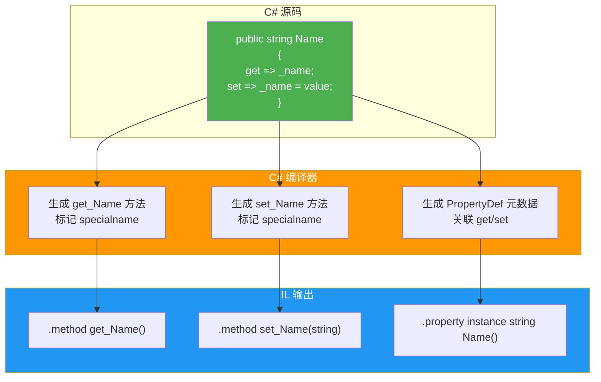
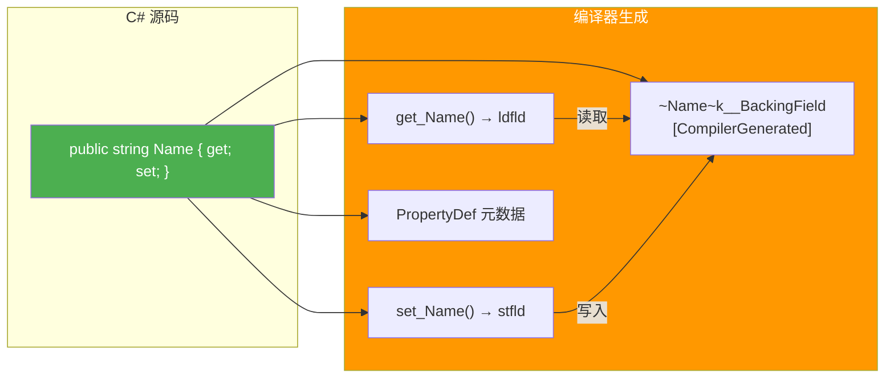
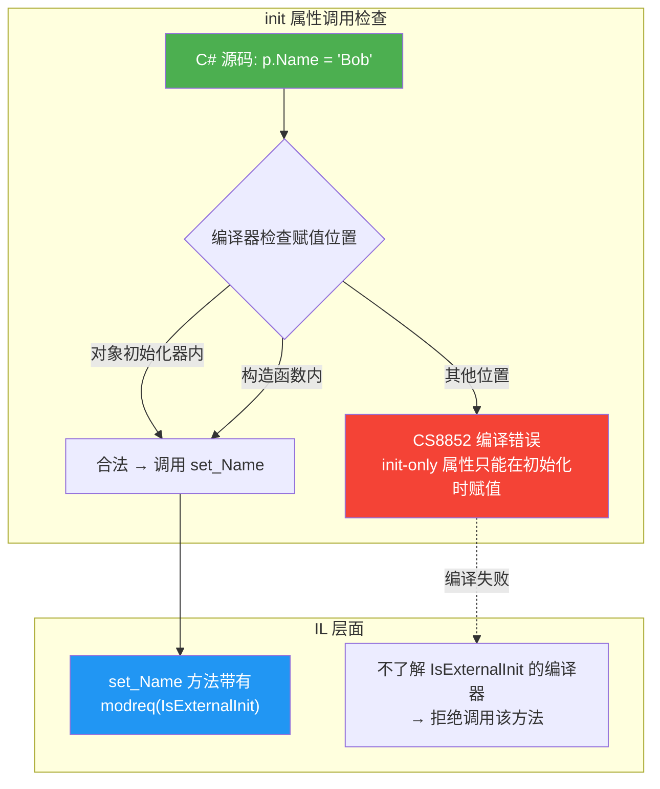
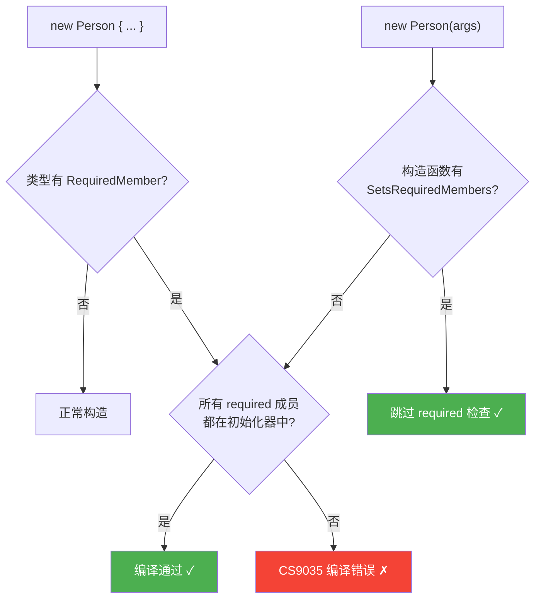
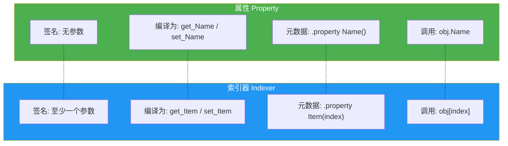
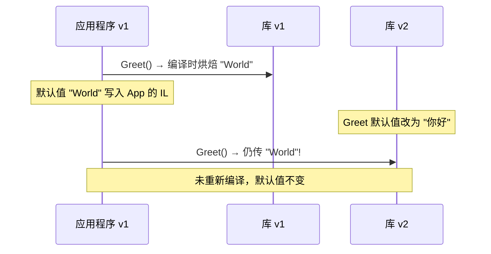
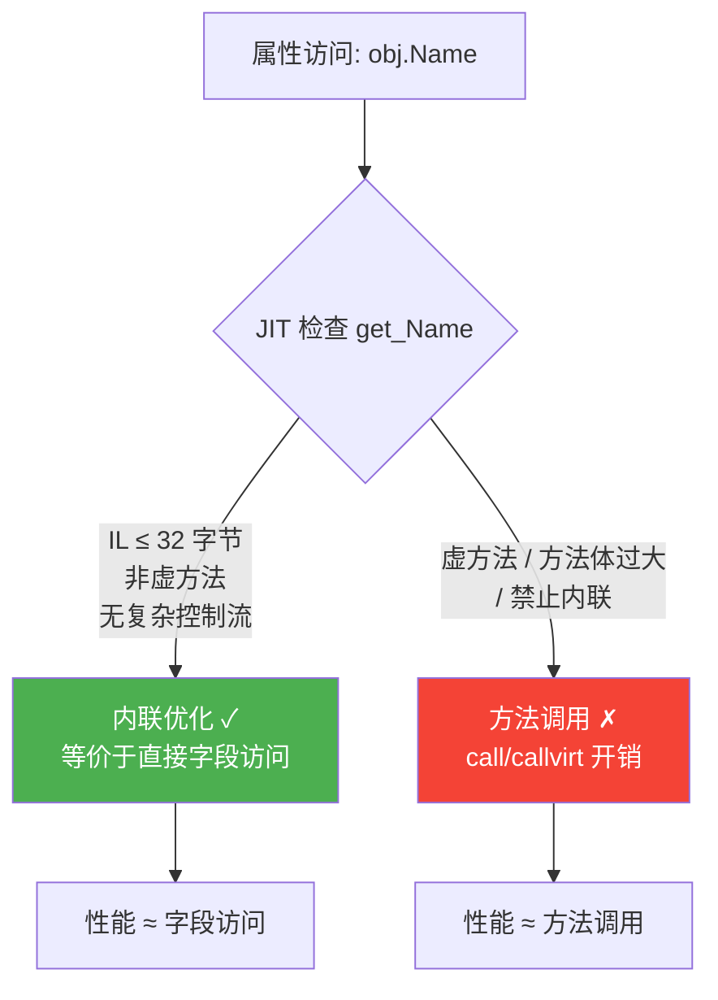
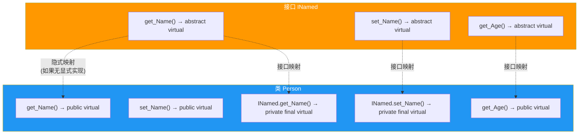
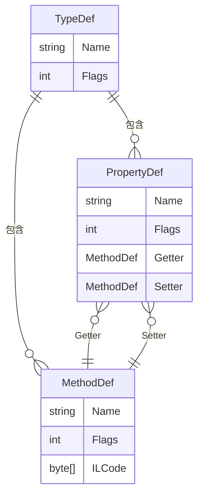
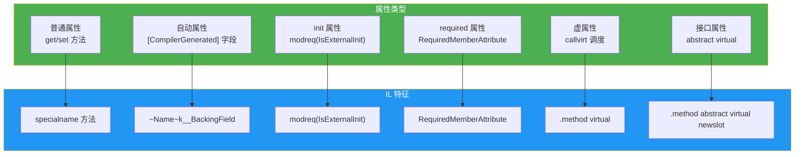

# 属性与索引器原理

属性（Property）是 C# 中最常用却最容易被误解的特性之一。表面上看，属性像是"智能字段"，但在 CLR 层面，属性本质上是方法的语法糖。索引器则是带参数的属性，同样编译为一对 `get`/`set` 方法。本文从 IL 视角揭开属性与索引器的编译真相，深入探讨自动属性后台字段、`init` 访问器、`required` 属性、内联优化等核心主题。

## 1. 属性的本质 —— 编译为 get_/set_ 方法

### 1.1 属性的语法糖本质

C# 中的属性在源码层面看似字段的读写访问，但编译器会将其翻译为一对方法（getter 和 setter），并在元数据中生成属性定义条目。

```csharp
public class Person
{
    private string _name;

    public string Name
    {
        get { return _name; }
        set { _name = value; }
    }
}
```

编译器为上述代码生成：

- **方法**：`get_Name()` 和 `set_Name(string value)`
- **属性元数据**：引用上述两个方法的 `PropertyDef` 条目

### 1.2 IL 验证：属性的编译结果

让我们用 `ildasm` 查看 `Person.Name` 属性的 IL 输出：

**get_Name 方法的 IL：**

```il
.method public hidebysig specialname
        instance string get_Name() cil managed
{
  // 代码大小       12 (0xc)
  .maxstack  8
  IL_0000:  ldarg.0
  IL_0001:  ldfld      string Person::_name
  IL_0006:  ret
} // end of method Person::get_Name
```

**set_Name 方法的 IL：**

```il
.method public hidebysig specialname
        instance void set_Name(string 'value') cil managed
{
  // 代码大小       9 (0x9)
  .maxstack  8
  IL_0000:  ldarg.0
  IL_0001:  ldarg.1
  IL_0002:  stfld      string Person::_name
  IL_0007:  ret
} // end of method Person::set_Name
```

**属性元数据：**

```il
.property instance string Name()
{
  .get instance string Person::get_Name()
  .set instance void Person::set_Name(string)
}
```

::: tip specialname 标志
注意 IL 中 getter 和 setter 方法都标记了 `specialname`（特殊名称）。这个标志告诉工具（如反射器、调试器）这些方法是属性的访问器，不应作为普通方法显示。IDE 的 IntelliSense 也是通过此标志将方法识别为属性访问器的。
:::

### 1.3 属性编译流程 Mermaid 图



### 1.4 只读属性的 IL

```csharp
public class Person
{
    private string _name;

    public string Name
    {
        get { return _name; }
    }
}
```

只读属性只生成 `get_Name` 方法，没有 `set_Name`，元数据中也只有 `.get` 条目：

```il
.property instance string Name()
{
  .get instance string Person::get_Name()
  // 没有 .set
}
```

## 2. 自动属性与后台字段

### 2.1 自动属性的语法

C# 3.0 引入了自动属性（Auto-Property），让编译器自动生成后台字段：

```csharp
public class Person
{
    public string Name { get; set; }
    public int Age { get; set; }
}
```

### 2.2 [CompilerGenerated] 后台字段

编译器为自动属性生成的后台字段带有 `[CompilerGenerated]` 特性，字段名格式为 `&lt;PropertyName&gt;k__BackingField`：

```il
.field private string '<Name>k__BackingField'
.custom attribute instance void
    [System.Runtime.CompilerServices]CompilerGeneratedAttribute::.ctor()
    = ( 01 00 00 00 )

.field private int32 '<Age>k__BackingField'
.custom attribute instance void
    [System.Runtime.CompilerServices]CompilerGeneratedAttribute::.ctor()
    = ( 01 00 00 00 )
```

::: important 后台字段命名规则
- 格式：`<属性名>k__BackingField`
- 尖括号确保不会与用户定义的字段名冲突（C# 标识符不允许尖括号）
- `k` 是编译器内部约定的标记字母，无特殊含义
- `[CompilerGenerated]` 特性标记此成员由编译器自动生成，调试器和序列化器可据此特殊处理
:::

### 2.3 自动属性 IL 完整示例

```csharp
public class Person
{
    public string Name { get; set; }
}
```

**完整 IL 输出：**

```il
.class public auto ansi beforefieldinit Person
       extends [System.Runtime]System.Object
{
  .field private string '<Name>k__BackingField'
  .custom attribute instance void
          [System.Runtime.CompilerServices]CompilerGeneratedAttribute::.ctor()
          = (01 00 00 00)

  .method public hidebysig specialname
          instance string get_Name() cil managed
  {
    .maxstack  8
    IL_0000:  ldarg.0
    IL_0001:  ldfld      string Person::'<Name>k__BackingField'
    IL_0006:  ret
  }

  .method public hidebysig specialname
          instance void set_Name(string 'value') cil managed
  {
    .maxstack  8
    IL_0000:  ldarg.0
    IL_0001:  ldarg.1
    IL_0002:  stfld      string Person::'<Name>k__BackingField'
    IL_0007:  ret
  }

  .property instance string Name()
  {
    .get instance string Person::get_Name()
    .set instance void Person::set_Name(string)
  }
}
```

### 2.4 反射验证后台字段

```csharp
using System;
using System.Reflection;
using System.Runtime.CompilerServices;

var fields = typeof(Person).GetFields(
    BindingFlags.NonPublic | BindingFlags.Instance);

foreach (var field in fields)
{
    Console.WriteLine($"字段名: {field.Name}");
    Console.WriteLine($"是否有CompilerGenerated: " +
        $"{field.IsDefined(typeof(CompilerGeneratedAttribute), false)}");
}

// 输出:
// 字段名: <Name>k__BackingField
// 是否有CompilerGenerated: True
```



## 3. init 属性与 modreq(IsExternalInit)

### 3.1 init 访问器语法

C# 9.0 引入了 `init` 访问器，允许属性仅在对象初始化时赋值：

```csharp
public class Person
{
    public string Name { get; init; }
    public int Age { get; init; }
}

// 对象初始化器中赋值 —— 合法
var p = new Person { Name = "Alice", Age = 30 };

// 初始化后赋值 —— 编译错误
// p.Name = "Bob";  // CS8852: Init-only property can only be assigned in an object initializer
```

### 3.2 init 属性的 IL 真相

`init` 访问器在 IL 层面并不是一个简单的方法修饰符。CLR 本身没有 `init` 概念，C# 编译器通过 `modreq(IsExternalInit)`（修饰需求）来实现编译时限制：

```il
.method public hidebysig specialname
        instance void modreq(
            [System.Runtime.CompilerServices]IsExternalInit
        )
        set_Name(string 'value') cil managed
{
  .maxstack  8
  IL_0000:  ldarg.0
  IL_0001:  ldarg.1
  IL_0002:  stfld      string Person::'<Name>k__BackingField'
  IL_0007:  ret
}
```

::: warning IsExternalInit 与 modreq 机制
- `IsExternalInit` 是 `System.Runtime.CompilerServices` 命名空间下的一个内部类型
- 它作为 `modreq`（required modifier）附加在 `set_Name` 方法的返回类型上
- **modreq** 的语义是：任何编译器如果无法理解这个修饰符，就必须**拒绝编译**对该方法的调用
- C# 编译器理解 `IsExternalInit` modreq，并据此实施 init-only 赋值规则
- 这确保了即使从其他语言（如 VB.NET）引用，也无法绕过 init 限制
:::

### 3.3 modreq(IsExternalInit) 工作原理



### 3.4 init 属性与构造函数

```csharp
public class Person
{
    public string Name { get; init; }
    public int Age { get; init; }

    public Person(string name, int age)
    {
        Name = name;   // 构造函数中合法
        Age = age;     // 构造函数中合法
    }
}

public class DerivedPerson : Person
{
    public DerivedPerson() : base("Unknown", 0)
    {
        Name = "Test";  // 合法！init 属性在派生类构造函数中可以赋值
    }
}
```

::: tip init vs readonly
- `init` 属性的控制粒度比 `readonly` 字段更细：`readonly` 字段只能在声明处或构造函数中赋值，`init` 属性还可以在对象初始化器中赋值
- `init` 属性在派生类构造函数中**可以**赋值（与 `readonly` 行为一致），但不能在非构造函数的普通方法中赋值
- `init` 的限制是编译时强制的，CLR 运行时并不知道 init 的存在
:::

## 4. required 属性与编译器检查

### 4.1 required 修饰符

C# 11 引入了 `required` 修饰符，强制调用者在对象初始化时必须设置该属性：

```csharp
public class Person
{
    public required string Name { get; set; }
    public required int Age { get; set; }
    public string? Description { get; set; }
}

// 必须在初始化器中设置 Name 和 Age
var p = new Person { Name = "Alice", Age = 30 };  // 合法

// 缺少 required 属性 —— 编译错误
// var p = new Person();  // CS9035: 必须在对象初始化器中设置 required 成员
```

### 4.2 required 属性的 IL 表示

`required` 属性在 IL 中通过 `RequiredMemberAttribute` 来标记：

```il
.field private string '<Name>k__BackingField'
.custom attribute instance void
    [System.Runtime.CompilerServices]RequiredMemberAttribute::.ctor()
    = (01 00 00 00)

.property instance string Name()
{
  .get instance string Person::get_Name()
  .set instance void Person::set_Name(string)
}
.custom attribute instance void
    [System.Runtime.CompilerServices]RequiredMemberAttribute::.ctor()
    = (01 00 00 00)
```

同时在类型上也添加了 `RequiredMemberAttribute`：

```il
.class public auto ansi beforefieldinit Person
       extends [System.Runtime]System.Object
{
  .custom attribute instance void
      [System.Runtime.CompilerServices]RequiredMemberAttribute::.ctor()
      = (01 00 00 00)
  // ...
}
```

### 4.3 required 与 init 的配合

`required` 通常与 `init` 配合使用，确保属性在初始化时必须设置，且之后不可修改：

```csharp
public class Person
{
    public required string Name { get; init; }
    public required int Age { get; init; }
}

// 必须 + init-only: 初始化时必须设，之后不能改
var p = new Person { Name = "Alice", Age = 30 };
// p.Name = "Bob";  // CS8852: init-only
```

### 4.4 required 的 SetsRequiredMembers 特性

构造函数可以用 `[SetsRequiredMembers]` 标记，表示该构造函数已设置了所有 required 成员：

```csharp
public class Person
{
    public required string Name { get; set; }
    public required int Age { get; set; }

    [System.Diagnostics.CodeAnalysis.SetsRequiredMembers]
    public Person(string name, int age)
    {
        Name = name;
        Age = age;
    }
}

// 使用标记了 SetsRequiredMembers 的构造函数时，
// 不再需要在初始化器中设置 required 成员
var p = new Person("Alice", 30);  // 合法
```

::: warning SetsRequiredMembers 的风险
`[SetsRequiredMembers]` 是对编译器的**承诺**，编译器不会验证构造函数是否真的设置了所有 required 成员。如果构造函数没有实际初始化 required 属性，运行时会得到默认值（如 `null`），可能导致 `ArgumentNullException` 等问题。这是一个"信任开发者"的机制。
:::

### 4.5 required 检查流程



## 5. 索引器原理

### 5.1 索引器的语法

索引器（Indexer）允许对象像数组一样通过索引访问，本质上是带参数的属性：

```csharp
public class MyList<T>
{
    private T[] _items;
    private int _count;

    public T this[int index]
    {
        get
        {
            if (index < 0 || index >= _count)
                throw new ArgumentOutOfRangeException(nameof(index));
            return _items[index];
        }
        set
        {
            if (index < 0 || index >= _count)
                throw new ArgumentOutOfRangeException(nameof(index));
            _items[index] = value;
        }
    }
}
```

### 5.2 索引器编译为 get_Item / set_Item

C# 编译器将索引器翻译为名为 `get_Item` 和 `set_Item` 的方法，属性名为 `Item`：

```il
.method public hidebysig specialname
        instance !T get_Item(int32 index) cil managed
{
  .maxstack  3
  IL_0000:  ldarg.0
  IL_0001:  ldfld      int32 MyList`1::_count
  IL_0006:  ldarg.1
  IL_0007:  blt.s      IL_000b
  IL_0009:  br.s       IL_0015
  IL_000b:  ldarg.1
  IL_000c:  ldc.i4.0
  IL_000d:  blt.s      IL_0015
  IL_000f:  ldarg.0
  IL_0010:  ldfld      !0[] MyList`1::_items
  IL_0015:  ldarg.1
  IL_0016:  ldelem     !T
  IL_001b:  ret
}

.property instance !T Item(int32)
{
  .get instance !T MyList`1::get_Item(int32)
  .set instance void MyList`1::set_Item(int32, !T)
}
```

::: important IndexerName 特性
默认情况下，索引器编译为 `Item` 属性。可以通过 `[IndexerName]` 特性修改此名称：

```csharp
[System.Runtime.CompilerServices.IndexerName("Entry")]
public T this[int index] { get; set; }
```

这会将属性和方法名从 `Item`/`get_Item`/`set_Item` 改为 `Entry`/`get_Entry`/`set_Entry`。

此特性主要影响从其他语言（如 VB.NET）访问索引器时的名称，C# 自身不使用此名称——C# 始终通过 `[]` 语法访问。
:::

### 5.3 多参数索引器

索引器可以有多个参数：

```csharp
public class Matrix
{
    private double[,] _data = new double[3, 3];

    public double this[int row, int col]
    {
        get => _data[row, col];
        set => _data[row, col] = value;
    }
}
```

```il
.method public hidebysig specialname
        instance float64 get_Item(int32 row, int32 col) cil managed
{
  .maxstack  3
  IL_0000:  ldarg.0
  IL_0001:  ldfld      float64[,] Matrix::_data
  IL_0006:  ldarg.1
  IL_0007:  ldarg.2
  IL_0008:  call       instance float64 float64[0...,0...]::Get(int32, int32)
  IL_000d:  ret
}

.property instance float64 Item(int32, int32)
{
  .get instance float64 Matrix::get_Item(int32, int32)
  .set instance void Matrix::set_Item(int32, int32, float64)
}
```

### 5.4 索引器与属性对比



| 特征 | 属性 | 索引器 |
|------|------|--------|
| 参数 | 无 | 至少一个 |
| 编译方法名 | `get_&lt;Name&gt;` / `set_&lt;Name&gt;` | `get_Item` / `set_Item` |
| 元数据属性名 | 用户定义 | `Item`（默认） |
| 可重载 | 否（按名称区分） | 是（按参数签名区分） |
| `static` | 可以 | 不可以 |
| `ref` 返回 | 可以 | 可以 |
| 接口中声明 | 可以 | 可以 |

## 6. 默认参数与 Optional 特性

### 6.1 默认参数值的编译

C# 的默认参数值通过 `Optional` 和 `DefaultParameterValue` 特性在 IL 中实现：

```csharp
public void Greet(string name = "World", int count = 1)
{
    for (int i = 0; i < count; i++)
        Console.WriteLine($"Hello, {name}!");
}
```

编译后的 IL 方法签名：

```il
.method public hidebysig
        instance void Greet(
            [opt] string name,
            [opt] int32 count
        ) cil managed
{
  .param [1]
  .custom attribute instance void
      [System.Runtime.InteropServices]OptionalAttribute::.ctor()
      = (01 00 00 00)
  .custom attribute instance void
      [System.Runtime.InteropServices]DefaultParameterValueAttribute::.ctor(string)
      = (01 00 0F 57 6F 72 6C 64 00 00)   // "World"

  .param [2]
  .custom attribute instance void
      [System.Runtime.InteropServices]OptionalAttribute::.ctor()
      = (01 00 00 00)
  .custom attribute instance void
      [System.Runtime.InteropServices]DefaultParameterValueAttribute::.ctor(int32)
      = (01 00 01 00 00 00 00)             // 1

  // 方法体省略...
}
```

::: tip 默认参数是编译时烘焙的
默认参数值存储在**调用点**（call site）的元数据中，而非被调用方法内。这意味着：
1. 如果修改了被调用程序集中方法的默认值，**但未重新编译调用方**，调用方仍使用旧的默认值
2. 这与 `Optional` 特性的语义一致——默认值是调用者的便利，不是被调用者的承诺

这就是为什么《CLR via C#》中 Jeffery Richter 建议不要在公共 API 中使用默认参数值。
:::

### 6.2 默认参数值的调用 IL

```csharp
var obj = new Person();
obj.Greet();  // 使用默认参数
obj.Greet("Alice");  // 部分使用默认参数
obj.Greet("Alice", 3);  // 不使用默认参数
```

```il
// obj.Greet() —— 编译器自动填充默认值
IL_0001:  ldloc.0
IL_0002:  ldstr      "World"        // 编译器烘焙的默认值
IL_0007:  ldc.i4.1                  // 编译器烘焙的默认值
IL_0008:  callvirt   instance void Person::Greet(string, int32)

// obj.Greet("Alice")
IL_000d:  ldloc.0
IL_000e:  ldstr      "Alice"
IL_0013:  ldc.i4.1                  // 第二个参数仍使用默认值
IL_0014:  callvirt   instance void Person::Greet(string, int32)

// obj.Greet("Alice", 3)
IL_0019:  ldloc.0
IL_001a:  ldstr      "Alice"
IL_001f:  ldc.i4.3
IL_0020:  callvirt   instance void Person::Greet(string, int32)
```

### 6.3 默认参数版本兼容性问题



## 7. 属性 vs 字段性能对比

### 7.1 属性访问的开销

属性访问在 IL 层面是一次方法调用，而字段访问是直接的内存读写。但是，JIT 编译器会对简单的属性访问进行**内联优化**，消除方法调用开销。

### 7.2 JIT 内联优化

```csharp
public class Person
{
    private string _name;
    public string Name
    {
        get => _name;
        set => _name = value;
    }
}

// 调用方
var name = person.Name;
```

**内联前（概念性描述）：**

```asm
; 调用 get_Name
mov rcx, person          ; this 指针
call Person.get_Name()   ; 方法调用
mov name, rax            ; 返回值
```

**内联后：**

```asm
; 直接字段访问，等价于访问字段
mov rax, [person + offset_Name]  ; 直接读取字段
mov name, rax
```

### 7.3 JIT 内联的条件

JIT 编译器在以下条件满足时会内联属性访问器：

| 条件 | 说明 |
|------|------|
| 方法体足够小 | IL 代码 ≤ 32 字节（可配置） |
| 没有复杂的控制流 | 无 try/catch、无循环 |
| 不是虚方法 | callvirt 调用的方法不会被内联（除非去虚化） |
| 没有递归 | 递归方法不可内联 |
| 不使用 `MethodImplOptions.NoInlining` | 显式禁止内联 |

::: important 虚属性不会被内联
如果属性标记为 `virtual`，通过 `callvirt` 调用的 getter/setter **默认不会被内联**，因为运行时才能确定目标方法。但 JIT 可能进行**去虚化（Devirtualization）**——如果 JIT 能证明调用目标的精确类型，仍然可以内联。
:::

### 7.4 禁止内联的属性

```csharp
public class Person
{
    private string _name;

    public string Name
    {
        [System.Runtime.CompilerServices.MethodImpl(
            System.Runtime.CompilerServices.MethodImplOptions.NoInlining)]
        get => _name;
    }
}
```

### 7.5 性能基准测试

```csharp
using BenchmarkDotNet.Attributes;
using BenchmarkDotNet.Running;

[MemoryDiagnoser]
public class PropertyVsFieldBenchmark
{
    private readonly PersonField _personField = new() { Name = "Alice" };
    private readonly PersonProperty _personProperty = new() { Name = "Alice" };

    [Benchmark(Baseline = true)]
    public string FieldAccess() => _personField.Name;

    [Benchmark]
    public string PropertyAccess() => _personProperty.Name;

    [Benchmark]
    public string VirtualPropertyAccess() => _personProperty.VirtualName;
}

public class PersonField
{
    public string Name;
}

public class PersonProperty
{
    private string _name;
    public string Name { get => _name; set => _name = value; }
    public virtual string VirtualName => _name;
}
```

典型结果（.NET 8, x64）：

| 方法 | 平均时间 | 评价 |
|------|----------|------|
| FieldAccess | ~0.2 ns | 直接内存读取 |
| PropertyAccess | ~0.2 ns | JIT 内联后与字段等效 |
| VirtualPropertyAccess | ~3.5 ns | 虚方法调用开销 |

::: tip 实际结论
- **简单属性与字段性能相同**——JIT 会内联简单 getter/setter
- **虚属性有显著开销**——虚方法调度无法内联（除非去虚化）
- 属性的真正价值在于封装和可维护性，性能不应成为选择字段而非属性的理由
:::

### 7.6 内联优化流程



## 8. 属性在接口中的 IL 签名

### 8.1 接口属性声明

接口中可以声明属性，但接口属性只定义访问器签名，不包含实现：

```csharp
public interface INamed
{
    string Name { get; set; }
    int Age { get; }  // 只读
}
```

### 8.2 接口属性的 IL

```il
.class interface public abstract auto ansi INamed
{
  .property instance string Name()
  {
    .get instance string INamed::get_Name()
    .set instance void INamed::set_Name(string)
  }

  .property instance int32 Age()
  {
    .get instance int32 INamed::get_Age()
  }

  .method public hidebysig newslot specialname abstract virtual
          instance string get_Name() cil managed
  {
  }

  .method public hidebysig newslot specialname abstract virtual
          instance void set_Name(string 'value') cil managed
  {
  }

  .method public hidebysig newslot specialname abstract virtual
          instance int32 get_Age() cil managed
  {
  }
}
```

::: important 接口属性的 IL 特征
- 属性访问器方法标记为 `abstract virtual`（接口方法都是隐式抽象和虚的）
- `newslot` 表示这些方法在虚方法表中获得新的槽位
- `specialname` 标识这些方法是属性访问器
- 接口本身标记为 `interface abstract`
:::

### 8.3 实现接口属性

```csharp
public class Person : INamed
{
    public string Name { get; set; }
    public int Age { get; }

    public Person(string name, int age)
    {
        Name = name;
        Age = age;
    }
}
```

在 IL 中，`Person` 类的 `get_Name` 和 `set_Name` 方法会实现接口的对应方法，同时出现在接口映射表中。

### 8.4 显式接口实现属性

```csharp
public class Person : INamed
{
    private string _name;
    private int _age;

    string INamed.Name
    {
        get => _name;
        set => _name = value;
    }

    int INamed.Age => _age;

    // 公开的 Name 属性，与接口属性分离
    public string Name => _name;
}
```

显式实现的 IL：

```il
.method private hidebysig newslot specialname final virtual
        instance string INamed.get_Name() cil managed
{
  .maxstack  8
  IL_0000:  ldarg.0
  IL_0001:  ldfld      string Person::_name
  IL_0006:  ret
}

.method private hidebysig newslot specialname final virtual
        instance void INamed.set_Name(string 'value') cil managed
{
  .maxstack  8
  IL_0000:  ldarg.0
  IL_0001:  ldarg.1
  IL_0002:  stfld      string Person::_name
  IL_0007:  ret
}

// 注意: private + final + virtual 组合
// private: 不在类的公开 API 中
// final: 不可再重写
// virtual: 满足接口映射要求
```

### 8.5 接口属性映射



## 9. 属性与字段的设计考量

### 9.1 何时使用属性

```csharp
// ✓ 属性：简单的数据访问，可能有轻量级验证
public class Person
{
    private int _age;
    public int Age
    {
        get => _age;
        set => _age = value >= 0 ? value : throw new ArgumentOutOfRangeException();
    }
}

// ✗ 不要：在属性中做耗时操作
public class BadExample
{
    public ExpensiveData Data
    {
        get => ComputeExpensiveData();  // 每次访问都重新计算!
    }
}
```

### 9.2 属性设计准则

::: warning 属性设计准则（摘自《CLR via C#》与 Framework Design Guidelines）
1. **属性应该是轻量的**：getter 不应有明显副作用，不应抛出异常（除 ArgumentOutOfRangeException 等预期异常）
2. **属性 vs 方法**：如果操作耗时超过 O(1)，应使用方法而非属性
3. **get 不应改变状态**：getter 应该是幂等的，多次调用返回相同结果
4. **属性不应有顺序依赖**：设置属性 A 不应影响属性 B 的初始值
5. **考虑线程安全**：自动属性在多线程环境下不是原子操作
:::

### 9.3 属性与异常

```csharp
// 不好的实践：getter 抛出意外异常
public class BadExample
{
    private string? _data;
    public string Data => _data ?? throw new InvalidOperationException("Not initialized");
}

// 更好的做法：使用方法表示可能失败的操作
public class BetterExample
{
    private string? _data;
    public string GetData() => _data ?? throw new InvalidOperationException("Not initialized");

    // 或者返回 null/默认值
    public string? Data => _data;
}
```

## 10. 高级属性特性

### 10.1 required init 模式

C# 11 的 `required` + `init` 是构建不可变类型的推荐模式：

```csharp
public record Person
{
    public required string FirstName { get; init; }
    public required string LastName { get; init; }
    public int Age { get; init; }
}

var p = new Person
{
    FirstName = "Alice",
    LastName = "Smith",
    Age = 30
};
```

### 10.2 属性初始化器

C# 6.0 支持自动属性初始化器：

```csharp
public class Configuration
{
    public string Name { get; set; } = "Default";
    public int Timeout { get; set; } = 30000;
    public List<string> Items { get; } = new();
}
```

IL 中的初始化：

```il
.method public hidebysig specialname rtspecialname
        instance void .ctor() cil managed
{
  .maxstack  8
  IL_0000:  ldarg.0
  IL_0001:  call       instance void [System.Runtime]System.Object::.ctor()
  IL_0006:  ldarg.0
  IL_0007:  ldstr      "Default"
  IL_000c:  call       instance void Configuration::set_Name(string)
  IL_0011:  ldarg.0
  IL_0012:  ldc.i4     0x7530        // 30000
  IL_0017:  call       instance void Configuration::set_Timeout(int32)
  IL_001c:  ldarg.0
  IL_001d:  newobj     instance void class
            [System.Collections.Generic]List`1<string>::.ctor()
  IL_0022:  call       instance void Configuration::set_Items(
            class [System.Collections.Generic]List`1<string>)
  IL_0027:  ret
}
```

::: tip 初始化器在构造函数中执行
自动属性初始化器被编译到构造函数中，在调用基类构造函数**之后**执行。这意味着初始化器的执行顺序是：
1. 基类构造函数
2. 字段初始化器 / 属性初始化器（按声明顺序）
3. 构造函数体

这与实例字段初始化器的行为完全一致。
:::

### 10.3 ref 返回属性

C# 7.0 支持 `ref` 返回的属性，允许返回对内部存储的引用：

```csharp
public class Matrix
{
    private double[,] _data = new double[3, 3];

    public ref double this[int row, int col] => ref _data[row, col];
}

// 使用
var m = new Matrix();
m[0, 0] = 1.0;           // 直接修改内部数组
ref var elem = ref m[0, 0]; // 获取引用
elem = 2.0;               // 通过引用修改
```

IL 中的 ref 返回属性：

```il
.method public hidebysig specialname
        instance float64& get_Item(int32 row, int32 col) cil managed
{
  .maxstack  3
  IL_0000:  ldarg.0
  IL_0001:  ldfld      float64[,] Matrix::_data
  IL_0006:  ldarg.1
  IL_0007:  ldarg.2
  IL_0008:  call       instance float64& float64[0...,0...]::Address(int32, int32)
  IL_000d:  ret
}
```

注意返回类型是 `float64&`（托管指针），而不是 `float64`。

### 10.4 属性表达式体

```csharp
public class Circle
{
    public double Radius { get; set; }

    // 表达式体 getter（C# 6）
    public double Area => Math.PI * Radius * Radius;

    // 表达式体 getter + setter（C# 7）
    private double _diameter;
    public double Diameter
    {
        get => _diameter;
        set => _diameter = value;
    }
}
```

## 11. 属性与序列化

### 11.1 属性在序列化中的角色

序列化框架（如 `System.Text.Json`）通常操作属性而非字段：

```csharp
public class Person
{
    public string Name { get; set; }

    // 编译器生成的后台字段不会直接参与序列化
    // 因为 [CompilerGenerated] 字段会被大多数序列化器忽略
    public int Age { get; set; }

    // 非自动属性的后台字段可能会参与某些序列化器
    private string _email;
    public string Email
    {
        get => _email;
        set => _email = value?.ToLowerInvariant();
    }
}
```

### 11.2 JSON 序列化中的 init 属性

```csharp
using System.Text.Json;

public record Person
{
    public required string Name { get; init; }
    public int Age { get; init; }
}

// 反序列化时，init 属性在 .NET 7+ 中被正确支持
var json = """{"Name":"Alice","Age":30}""";
var person = JsonSerializer.Deserialize<Person>(json);
Console.WriteLine(person.Name);  // Alice
```

::: info System.Text.Json 与 init 属性
.NET 7 之前，`System.Text.Json` 在反序列化时无法设置 `init` 属性（因为它使用的是 setter 调用而非对象初始化器语义）。从 .NET 7 开始，`JsonSerializer` 支持通过特殊的 `IsExternalInit` 感知来设置 init 属性。
:::

## 12. 索引器的高级用法

### 12.1 泛型索引器

```csharp
public class Factory
{
    public T Create<T>() where T : new() => new T();

    // 索引器不能是泛型的，但可以利用泛型类
}

// 正确做法：泛型类中的索引器
public class TypedCache<TValue>
{
    private readonly Dictionary<string, TValue> _cache = new();

    public TValue this[string key]
    {
        get => _cache[key];
        set => _cache[key] = value;
    }
}
```

::: warning 索引器本身不能有类型参数
索引器声明中不能引入新的类型参数。如果需要泛型索引行为，必须将类型参数放在类级别。
:::

### 12.2 多索引器重载

```csharp
public class DataStore
{
    private readonly Dictionary<string, object> _byName = new();
    private readonly Dictionary<int, object> _byId = new();

    // 按名称索引
    public object this[string name]
    {
        get => _byName[name];
        set => _byName[name] = value;
    }

    // 按 ID 索引
    public object this[int id]
    {
        get => _byId[id];
        set => _byId[id] = value;
    }
}

var store = new DataStore();
store["hello"] = "world";
store[42] = "answer";
```

### 12.3 索引器与 IEnumerable

```csharp
public class ReadOnlySpanLike<T>
{
    private readonly T[] _data;

    public ReadOnlySpanLike(T[] data) => _data = data;

    public ref readonly T this[int index] => ref _data[index];

    public int Length => _data.Length;
}
```

## 13. 属性与元数据的深度关系

### 13.1 反射访问属性

```csharp
using System.Reflection;

var type = typeof(Person);
var properties = type.GetProperties();

foreach (var prop in properties)
{
    Console.WriteLine($"属性: {prop.Name}");
    Console.WriteLine($"  类型: {prop.PropertyType}");
    Console.WriteLine($"  可读: {prop.CanRead}");
    Console.WriteLine($"  可写: {prop.CanWrite}");

    if (prop.CanRead)
    {
        var getMethod = prop.GetMethod!;
        Console.WriteLine($"  Getter: {getMethod.Name}");
        Console.WriteLine($"  IsSpecialName: {getMethod.IsSpecialName}");
    }

    if (prop.CanWrite)
    {
        var setMethod = prop.SetMethod!;
        Console.WriteLine($"  Setter: {setMethod.Name}");
        Console.WriteLine($"  IsSpecialName: {setMethod.IsSpecialName}");
    }
}
```

### 13.2 PropertyDef 与 MethodDef 的关系



### 13.3 ECMA-335 规范中的属性定义

根据 ECMA-335 标准（Partition II, Section 17），属性在元数据中的表示为：

| 元数据表 | 内容 |
|----------|------|
| `PropertyDef` | 属性名称、类型、标志 |
| `MethodSemantics` | 关联属性与 getter/setter 方法 |
| `MethodDef` | 实际的方法实现 |

`PropertyDef` 标志（`PropertyAttributes`）：

| 标志 | 值 | 说明 |
|------|-----|------|
| `SpecialName` | 0x0200 | 特殊名称 |
| `RTSpecialName` | 0x0400 | 运行时应特殊处理 |
| `HasDefault` | 0x1000 | 属性有默认值 |

## 14. 属性的 AOT 与裁剪考量

### 14.1 属性反射与 AOT

在 Native AOT 场景下，通过反射访问属性可能失败，因为属性访问器可能被裁剪：

```csharp
// 可能被 AOT 裁剪的反射调用
var prop = typeof(Person).GetProperty("Name");
var value = prop!.GetValue(person);  // 运行时可能抛出 MissingMethodException

// AOT 友好的方式：使用源生成器
// 在 .NET 8+ 中，System.Text.Json 使用源生成器而非反射
[JsonSerializable(typeof(Person))]
public partial class PersonContext : JsonSerializerContext { }
```

### 14.2 DynamicAccessToMembers 属性

```csharp
[System.Diagnostics.CodeAnalysis.DynamicAccessToMembers(
    "System.String Person::Name")]
public static void AccessNameDynamically()
{
    // 告诉裁剪器：Person.Name 会被反射访问，不要裁剪
}
```

## 15. 完整 IL 对照总结

### 15.1 各类属性 IL 对比



### 15.2 关键 IL 差异一览

| 属性类型 | Getter IL | Setter IL | 额外元数据 |
|----------|-----------|-----------|-----------|
| 普通属性 | `specialname instance T get_X()` | `specialname instance void set_X(T)` | `PropertyDef` |
| 自动属性 | 同上 | 同上 | `[CompilerGenerated]` 字段 |
| init 属性 | 同上 | `specialname instance void modreq(IsExternalInit) set_X(T)` | — |
| required 属性 | 同上 | 同上 | `[RequiredMember]` |
| 虚属性 | `specialname virtual` | `specialname virtual` | — |
| 接口属性 | `specialname abstract virtual newslot` | 同左 | — |

## 16. 小结

属性和索引器是 C# 提供的语法糖，在 CLR 层面本质上都是方法。理解它们的编译机制对于：

1. **性能优化**：知道简单属性会被 JIT 内联，虚属性不会
2. **版本兼容**：理解默认参数值是编译时烘焙的
3. **安全封装**：`init` 和 `required` 如何在编译时强制约束
4. **反射与 AOT**：属性的元数据结构如何影响反射和裁剪

关键要点回顾：

- 属性编译为 `get_`/`set_` 方法 + `PropertyDef` 元数据
- 自动属性生成 `&lt;Name&gt;k__BackingField` 并标记 `[CompilerGenerated]`
- `init` 通过 `modreq(IsExternalInit)` 实现跨语言限制
- `required` 通过 `RequiredMemberAttribute` 标记，编译时检查
- 索引器编译为 `get_Item`/`set_Item`，默认属性名 `Item`
- 简单属性与字段性能相同（JIT 内联），虚属性有额外开销
- 接口属性编译为 `abstract virtual newslot specialname` 方法