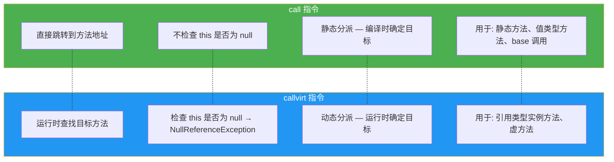
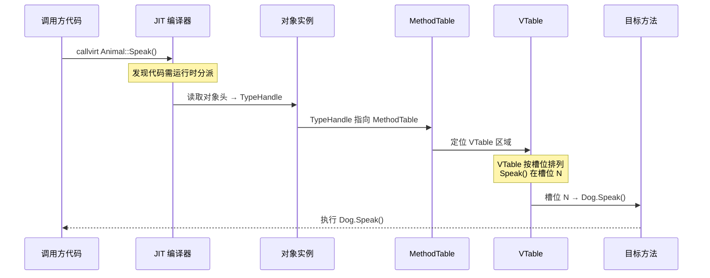
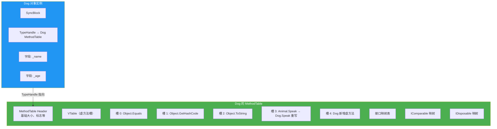
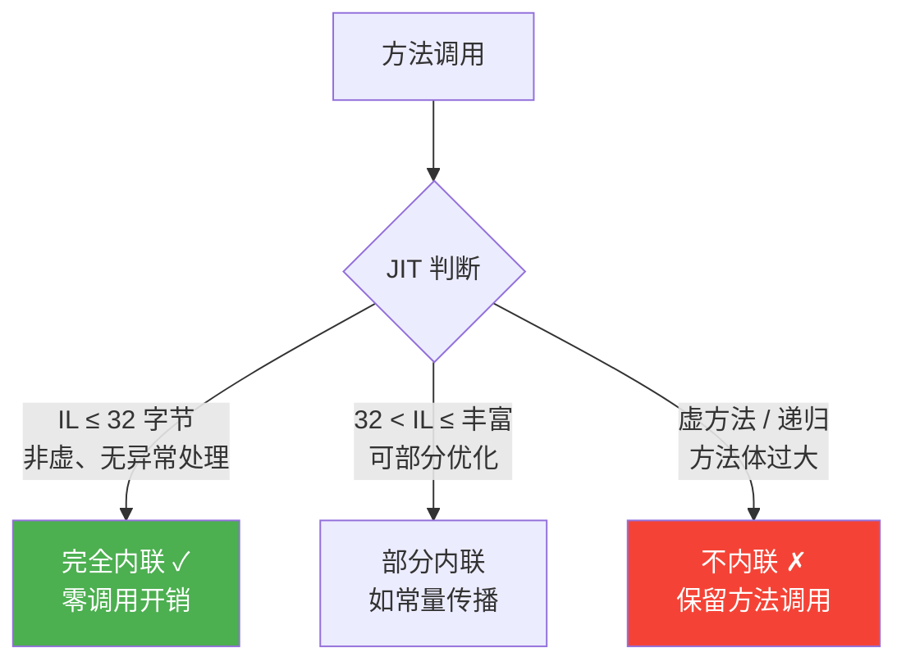
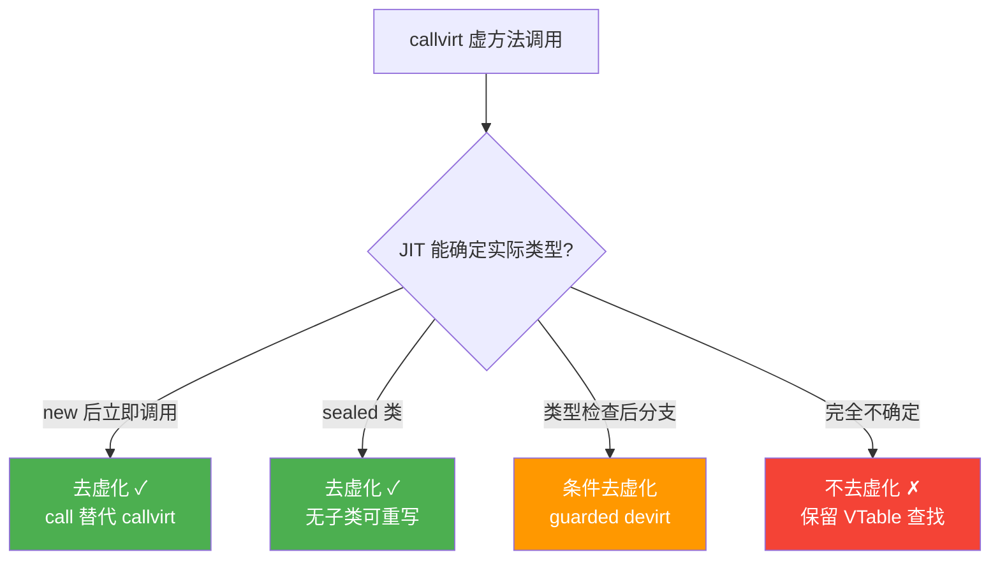
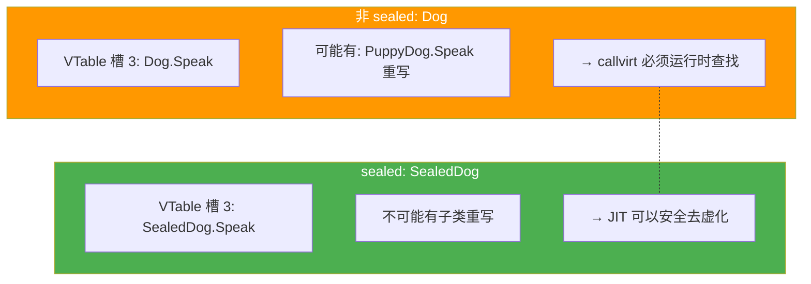
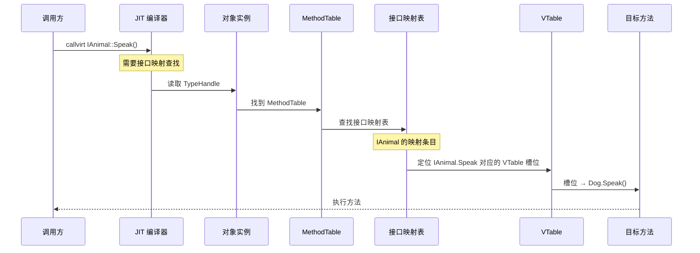
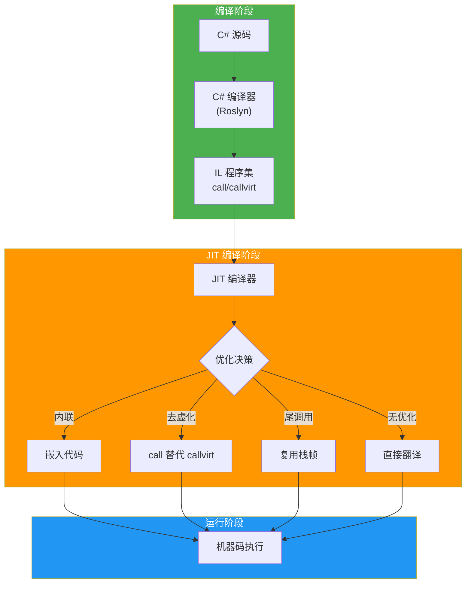
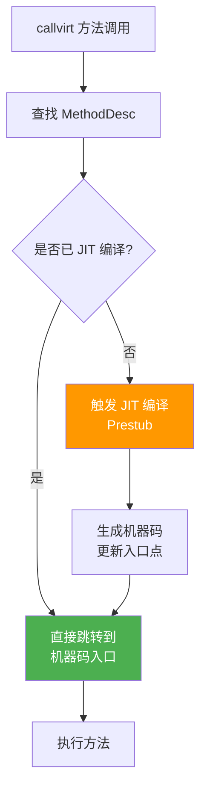

# 方法调用机制

方法调用是 .NET 程序运行的基础操作。在 C# 源码层面，所有方法调用看起来形式相似——一个方法名加一组参数。但在 IL 层面，CLR 提供了两种根本不同的调用指令：`call` 和 `callvirt`，它们在方法分派、空值检查、虚方法调度等方面行为截然不同。本文从 IL 指令出发，深入剖析方法调用的完整机制，涵盖虚方法调度、JIT 内联、去虚化、尾调用优化等核心主题。

## 1. call vs callvirt —— IL 调用指令对比

### 1.1 两条调用指令

CLR 的 IL 指令集中，方法调用主要使用两条指令：

| 指令 | 全称 | 语义 |
|------|------|------|
| `call` | Call method | 直接调用，静态分派，不进行空值检查 |
| `callvirt` | Call virtual method | 虚调用，动态分派，进行空值检查 |

### 1.2 C# 编译器的选择规则

C# 编译器根据方法的性质自动选择调用指令：

```csharp
public class Animal
{
    public void Eat() { }                    // 非虚实例方法
    public virtual void Speak() { }          // 虚方法
    public static void Create() { }          // 静态方法
}

public class Dog : Animal
{
    public override void Speak() { }         // 重写虚方法
    public void Fetch() { }                  // 非虚实例方法
}

public class Example
{
    public void Test()
    {
        var dog = new Dog();
        dog.Eat();       // call — 非虚方法
        dog.Speak();     // callvirt — 虚方法
        dog.Fetch();     // callvirt — 虽然非虚，但 C# 使用 callvirt

        Animal animal = dog;
        animal.Speak();  // callvirt — 虚方法

        Animal.Create(); // call — 静态方法
    }
}
```

::: important C# 编译器的 callvirt 偏好
C# 编译器对**实例方法**几乎总是使用 `callvirt`，即使方法不是虚的。原因是 `callvirt` 会在调用前检查 `this` 是否为 `null`，这提供了空引用异常的早期检测。只有以下场景 C# 会使用 `call`：
1. 静态方法调用
2. 值类型的实例方法调用
3. 通过 `base.xxx()` 调用基类方法
4. 从自己的构造函数中调用本实例方法（某些场景）
:::

### 1.3 IL 验证

```csharp
dog.Eat();       // 非虚方法
dog.Speak();     // 虚方法
dog.Fetch();     // 非虚方法，但 C# 用 callvirt
```

```il
// dog.Eat() — 非虚，但 C# 使用 callvirt!
IL_000a:  ldloc.0
IL_000b:  callvirt   instance void Animal::Eat()

// dog.Speak() — 虚方法
IL_0010:  ldloc.0
IL_0011:  callvirt   instance void Animal::Speak()

// dog.Fetch() — 非虚，C# 使用 callvirt
IL_0016:  ldloc.0
IL_0017:  callvirt   instance void Dog::Fetch()
```

### 1.4 call vs callvirt 对比 Mermaid 图



### 1.5 callvirt 的空值检查

```csharp
public class Example
{
    public static void Main()
    {
        Animal animal = null!;
        animal.Eat();  // 虽然 Eat 不是虚方法，但 callvirt 会检查 null
    }
}
```

运行结果：

```
Unhandled Exception: System.NullReferenceException: Object reference not set to an instance of an object.
   at Example.Main()
```

::: warning 如果使用 call 调用非虚方法，null 检查不会发生
如果我们手动在 IL 中用 `call` 代替 `callvirt` 调用 `Eat()`，且 `this` 为 `null`，方法仍然会被执行——只要方法不访问实例字段。这在 C# 中无法直接实现，但可以通过 IL 编写或 `DynamicMethod` 验证。
:::

## 2. 虚方法调度全过程

### 2.1 虚方法调度的本质

当 `callvirt` 遇到虚方法时，CLR 需要在运行时根据对象的实际类型找到正确的方法实现。这个过程称为虚方法调度（Virtual Method Dispatch）。

### 2.2 虚方法调度 Mermaid 序列图



### 2.3 虚方法调度的详细步骤

1. **对象加载**：`callvirt` 首先在栈上加载对象引用（`this`）
2. **空值检查**：如果引用为 `null`，抛出 `NullReferenceException`
3. **获取 MethodTable**：通过对象的 TypeHandle 指针找到其 MethodTable
4. **VTable 查找**：在 MethodTable 的 VTable 区域，按槽位索引查找目标方法
5. **方法调用**：跳转到 VTable 中记录的方法地址

```csharp
Animal animal = new Dog();
animal.Speak();  // 虚方法调度：运行时找到 Dog.Speak()
```

对应的 IL：

```il
IL_0000:  newobj     instance void Dog::.ctor()
IL_0005:  stloc.0
IL_0006:  ldloc.0
IL_0007:  callvirt   instance void Animal::Speak()
```

### 2.4 VTable 的结构



### 2.5 VTable 槽位继承规则

```csharp
public class A
{
    public virtual void M1() { }  // 槽位 0
    public virtual void M2() { }  // 槽位 1
}

public class B : A
{
    public override void M1() { }  // 重写槽位 0 → B.M1
    // M2 继承 A.M2，槽位 1 不变
    public virtual void M3() { }  // 新增槽位 2
}

public class C : B
{
    public override void M2() { }  // 重写槽位 1 → C.M2
    public override void M3() { }  // 重写槽位 2 → C.M3
    public new virtual void M4() { }  // 新增槽位 3
}
```

| 类型 | 槽位 0 | 槽位 1 | 槽位 2 | 槽位 3 |
|------|--------|--------|--------|--------|
| A | A.M1 | A.M2 | — | — |
| B | **B.M1** | A.M2 | B.M3 | — |
| C | B.M1 | **C.M2** | **C.M3** | C.M4 |

::: tip VTable 槽位的继承与重写
- **重写（override）**：替换父类 VTable 槽位中的方法指针，不增加新槽位
- **新增虚方法（new virtual）**：在 VTable 末尾追加新槽位
- **隐藏（new）**：不改变 VTable，只是在编译时根据引用类型选择调用目标
- 基类 Object 的虚方法（Equals、GetHashCode、ToString、Finalize）始终占据 VTable 的前几个槽位
:::

## 3. 非虚方法直接跳转

### 3.1 非虚方法的调用机制

非虚方法的调用目标在编译时（或 JIT 编译时）就已经确定，无需运行时查找 VTable：

```csharp
public class Calculator
{
    public int Add(int a, int b) => a + b;  // 非虚方法
}

// 调用
var calc = new Calculator();
int result = calc.Add(1, 2);
```

C# 编译器生成的 IL（使用 `callvirt`）：

```il
IL_0000:  newobj     instance void Calculator::.ctor()
IL_0005:  stloc.0
IL_0006:  ldloc.0
IL_0007:  ldc.i4.1
IL_0008:  ldc.i4.2
IL_0009:  callvirt   instance int32 Calculator::Add(int32, int32)
```

### 3.2 JIT 编译后的非虚方法调用

虽然 IL 使用 `callvirt`，但 JIT 编译器知道 `Add` 不是虚方法，可以直接生成直接跳转代码：

```asm
; JIT 编译后（概念性 x64 汇编）
mov rcx, calc          ; this
mov edx, 1             ; a
mov r8d, 2             ; b
call Calculator.Add    ; 直接地址跳转，无需 VTable 查找
```

### 3.3 call 指令用于非虚方法

在 C# 中，以下场景会使用 `call` 指令：

```csharp
public class Base
{
    public virtual void M() { Console.WriteLine("Base.M"); }
}

public class Derived : Base
{
    public override void M() { Console.WriteLine("Derived.M"); }

    public void CallBaseM()
    {
        base.M();  // 使用 call 而非 callvirt
    }
}
```

```il
.method public hidebysig instance void CallBaseM() cil managed
{
  .maxstack  8
  IL_0000:  ldarg.0
  IL_0001:  call       instance void Base::M()    // call, 不是 callvirt!
  IL_0006:  ret
}
```

::: important base 调用为何用 call？
`base.M()` 使用 `call` 的原因：
1. **跳过虚方法调度**：`base.M()` 明确要求调用基类版本，不需要运行时查找
2. **避免递归**：如果使用 `callvirt`，会再次调用 `Derived.M()`，导致无限递归
3. **不检查 null**：`this` 在实例方法中不可能为 null（已通过入口处的检查）
:::

## 4. 静态方法调用

### 4.1 静态方法的 IL

```csharp
public class MathHelper
{
    public static int Square(int x) => x * x;
}

// 调用
int result = MathHelper.Square(5);
```

```il
IL_0000:  ldc.i4.5
IL_0001:  call       int32 MathHelper::Square(int32)
IL_0006:  stloc.0
```

### 4.2 静态方法调用的特点

1. **使用 `call` 指令**：静态方法不涉及 `this`，也没有虚方法调度
2. **无 `this` 参数**：不需要加载对象引用
3. **直接跳转**：编译时已知目标方法地址


### 4.3 静态方法与实例方法的 IL 差异

```csharp
public class Example
{
    public static void StaticMethod() { }
    public void InstanceMethod() { }
}
```

```il
// 静态方法
.method public hidebysig static
        void StaticMethod() cil managed
{ /* ... */ }

// 实例方法
.method public hidebysig
        instance void InstanceMethod() cil managed
{ /* ... */ }
```

注意实例方法有 `instance` 关键字，表示有隐式 `this` 参数。

## 5. 实例方法的隐式 this 参数

### 5.1 this 的传递机制

每个实例方法的 IL 中，第一个参数（`ldarg.0`）始终是 `this` 引用：

```csharp
public class Person
{
    private string _name;

    public void SetName(string name)
    {
        _name = name;
    }
}
```

```il
.method public hidebysig instance void SetName(string name) cil managed
{
  .maxstack  8
  IL_0000:  ldarg.0      // 加载 this
  IL_0001:  ldarg.1      // 加载 name 参数
  IL_0002:  stfld      string Person::_name  // this._name = name
  IL_0007:  ret
}
```

### 5.2 参数索引表

| 索引 | 含义 | IL 指令 |
|------|------|---------|
| 0 | `this`（实例方法）或第一个参数（静态方法） | `ldarg.0` |
| 1 | 第一个显式参数 | `ldarg.1` |
| 2 | 第二个显式参数 | `ldarg.2` |
| 3 | 第三个显式参数 | `ldarg.3` |
| N (N\>3) | 第 N 个参数 | `ldarg.s N` |

::: tip 静态方法没有 this
静态方法的 `ldarg.0` 加载的是第一个显式参数，而不是 `this`。这是静态方法与实例方法在 IL 层面的根本区别。
:::

### 5.3 值类型方法的 this

值类型实例方法的 `this` 是按值传递的引用（托管指针），而非对象引用：

```csharp
public struct Point
{
    public int X;
    public int Y;

    public void Offset(int dx, int dy)
    {
        X += dx;
        Y += dy;
    }
}
```

```il
.method public hidebysig instance void Offset(int32 dx, int32 dy) cil managed
{
  .maxstack  8
  IL_0000:  ldarg.0      // 加载 this (ref Point)
  IL_0001:  ldarg.0
  IL_0002:  ldfld      int32 Point::X
  IL_0007:  ldarg.1
  IL_0008:  add
  IL_0009:  stfld      int32 Point::X
  IL_000e:  ldarg.0
  IL_000f:  ldarg.0
  IL_0010:  ldfld      int32 Point::Y
  IL_0015:  ldarg.2
  IL_0016:  add
  IL_0017:  stfld      int32 Point::Y
  IL_001c:  ret
}
```

对于值类型，`ldarg.0` 加载的是指向值类型实例的**托管指针**（`&`），而非对象引用（`O`）。

## 6. 尾调用（tail. prefix）

### 6.1 尾调用的概念

当一个方法的最后操作是调用另一个方法并直接返回其结果时，这个调用就是尾调用。尾调用优化（TCO）允许 JIT 编译器复用当前方法的栈帧，避免栈增长。

### 6.2 IL 中的 tail. 前缀

IL 提供 `tail.` 前缀指令，提示 JIT 执行尾调用优化：

```csharp
public class TailCallExample
{
    public int Factorial(int n)
    {
        return FactorialHelper(n, 1);
    }

    private int FactorialHelper(int n, int accumulator)
    {
        if (n <= 1) return accumulator;
        return FactorialHelper(n - 1, n * accumulator);  // 尾调用
    }
}
```

理想情况下，C# 编译器会在 `FactorialHelper` 的递归调用前添加 `tail.` 前缀：

```il
.method private hidebysig instance int32 FactorialHelper(int32 n, int32 accumulator) cil managed
{
  .maxstack  8
  IL_0000:  ldarg.1
  IL_0001:  ldc.i4.1
  IL_0002:  bgt.s      IL_0006
  IL_0004:  ldarg.2
  IL_0005:  ret

  IL_0006:  ldarg.0
  IL_0007:  ldarg.1
  IL_0008:  ldc.i4.1
  IL_0009:  sub
  IL_000a:  ldarg.1
  IL_000b:  ldarg.2
  IL_000c:  mul
  IL_000d:  tail.                        // 尾调用前缀!
  IL_000f:  call       instance int32 TailCallExample::FactorialHelper(int32, int32)
  IL_0014:  ret
}
```

::: warning C# 编译器不自动添加 tail.
C# 编译器**不会**自动为尾调用添加 `tail.` 前缀。F# 编译器则会自动识别尾调用并添加 `tail.`。C# 的 JIT 编译器在某些条件下会自行识别尾调用并优化，但这不是 C# 语言的保证。

在 .NET Core 3.0+ 和 .NET 5+ 中，JIT 对尾调用的支持有所改善，但仍不能保证所有尾调用都被优化。
:::

### 6.3 尾调用的条件

JIT 执行尾调用优化需要满足以下条件：

| 条件 | 说明 |
|------|------|
| 调用是方法的最后一个操作 | 返回值直接传递给调用方 |
| 调用方和被调用方的返回类型兼容 | 类型必须匹配或可隐式转换 |
| 不涉及安全性检查 | 某些安全相关的调用栈检查阻止 TCO |
| 栈帧可安全释放 | 没有需要保留的局部变量 |

### 6.4 尾调用优化 Mermaid 图


## 7. 方法内联 JIT 优化

### 7.1 内联优化的本质

方法内联（Method Inlining）是 JIT 编译器最重要的优化之一。它将被调用方法的代码直接嵌入到调用方中，消除方法调用的开销（参数传递、栈帧分配、跳转等）。

### 7.2 内联的效果

```csharp
// 内联前
public int Compute(int x) => x * x + 1;

public void Test()
{
    int result = Compute(5);
}

// 内联后（等价代码）
public void Test()
{
    int result = 5 * 5 + 1;  // 方法调用消失，代码直接嵌入
}
```

### 7.3 JIT 内联的条件

JIT 编译器根据以下条件决定是否内联：

| 条件 | 倾向内联 | 倾向不内联 |
|------|----------|-----------|
| 方法体大小 | IL ≤ 32 字节 | IL > 32 字节 |
| 控制流 | 简单顺序流 | try/catch、循环 |
| 方法类型 | 非虚方法 | 虚方法 |
| 递归 | 非递归 | 递归 |
| 指令复杂度 | 简单算术/赋值 | 复杂操作 |
| 方法属性 | `AggressiveInlining` | `NoInlining`、`NoOptimization` |
| 调用频率 | 热路径 | 冷路径 |

### 7.4 控制内联的属性

```csharp
using System.Runtime.CompilerServices;

public class Example
{
    // 禁止内联
    [MethodImpl(MethodImplOptions.NoInlining)]
    public int NeverInline() => 42;

    // 建议内联
    [MethodImpl(MethodImplOptions.AggressiveInlining)]
    public int PleaseInline() => 42;

    // 不做任何提示（JIT 自行决定）
    public int Default() => 42;
}
```

### 7.5 内联优化的层级



### 7.6 内联与常量折叠

内联常常与常量折叠（Constant Folding）配合使用：

```csharp
public class MathHelper
{
    public static int Double(int x) => x * 2;

    // 如果 JIT 内联了 Double，且参数是常量
    public void Test()
    {
        int a = Double(21);  // 内联 + 常量折叠 → 直接变为 42
    }
}
```

JIT 编译后的等价代码：

```csharp
public void Test()
{
    int a = 42;  // Double(21) → 21 * 2 → 42
}
```

## 8. Devirtualization（JIT 去虚化）

### 8.1 去虚化的概念

去虚化（Devirtualization）是 JIT 编译器将虚方法调用转换为直接调用的优化。当 JIT 能在编译时确定虚方法调用的目标时，就可以跳过 VTable 查找。

### 8.2 去虚化的场景

```csharp
public class Animal
{
    public virtual void Speak() => Console.WriteLine("Animal");
}

public class Dog : Animal
{
    public override void Speak() => Console.WriteLine("Dog");
}

public class Example
{
    // 场景 1: 新建对象后立即调用 — JIT 知道实际类型
    public void DevirtExample1()
    {
        var dog = new Dog();
        dog.Speak();  // callvirt → 可能被去虚化为 call Dog.Speak()
    }

    // 场景 2: 密封类 — 类型确定，可以安全去虚化
    public void DevirtExample2(Dog dog)
    {
        dog.Speak();  // Dog 是 sealed 的话，只有 Dog.Speak()
    }

    // 场景 3: 无法去虚化 — 不知道实际类型
    public void NoDevirt(Animal animal)
    {
        animal.Speak();  // 必须运行时查找
    }
}
```

### 8.3 去虚化的条件



### 8.4 条件去虚化（Guarded Devirtualization）

JIT 可能生成带有类型检查的去虚化代码：

```csharp
public void Process(Animal animal)
{
    animal.Speak();

    // JIT 可能生成等价代码:
    // if (animal.GetType() == typeof(Dog))
    //     ((Dog)animal).Speak();  // 直接调用，无需 VTable
    // else
    //     animal.Speak();         // 回退到虚方法调度
}
```

这种优化在 Profile-Guided Optimization (PGO) 中特别有效，因为 PGO 可以告诉 JIT 哪个类型最常出现。

## 9. sealed 对方法分派的影响

### 9.1 sealed 类的效果

```csharp
public sealed class SealedDog : Animal
{
    public override void Speak() => Console.WriteLine("Sealed Dog");
}

public class Example
{
    public void Test(SealedDog dog)
    {
        dog.Speak();  // JIT 知道没有子类，可以安全去虚化
    }
}
```

### 9.2 sealed 方法的效果

```csharp
public class Cat : Animal
{
    public sealed override void Speak() => Console.WriteLine("Cat");
}

public class PersianCat : Cat
{
    // 不能再重写 Speak，因为 Cat.Speak 是 sealed
    // public override void Speak() { }  // 编译错误

    // 但如果通过 Cat 引用调用 Speak，JIT 知道 Cat 之后的类不会重写
}
```

### 9.3 sealed 对性能的影响

```csharp
using BenchmarkDotNet.Attributes;

[MemoryDiagnoser]
public class SealedBenchmark
{
    private readonly Animal _sealed = new SealedDog();
    private readonly Animal _nonSealed = new Dog();

    [Benchmark]
    public void SealedCall() => _sealed.Speak();

    [Benchmark]
    public void NonSealedCall() => _nonSealed.Speak();
}
```

典型结果差异不大（因为 JIT 去虚化在两种场景下都可能生效），但在复杂场景中 sealed 可以帮助 JIT 做出更优决策。

::: tip sealed 的真正价值
`sealed` 的性能优势不在于直接的方法调用速度，而在于：
1. **帮助 JIT 去虚化**：密封类/方法消除了"可能有子类重写"的不确定性
2. **帮助 JIT 内联**：去虚化后，方法可能进一步被内联
3. **减少 VTable 查找**：密封方法不需要在 VTable 中继续搜索

`sealed` 的设计价值更大：它明确表达了"此类/方法不可扩展"的设计意图。
:::

### 9.4 sealed 类的 VTable 影响



## 10. 方法调用的性能层级

### 10.1 性能层级排序

从最快到最慢：


### 10.2 性能基准测试

```csharp
using BenchmarkDotNet.Attributes;

[MemoryDiagnoser]
public class MethodCallBenchmark
{
    private readonly Calculator _calc = new();
    private readonly Func<int, int, int> _delegate;
    private readonly System.Reflection.MethodInfo _method;

    public MethodCallBenchmark()
    {
        _delegate = (a, b) => a + b;
        _method = typeof(Calculator).GetMethod("Add")!;
    }

    [Benchmark(Baseline = true)]
    public int DirectCall() => _calc.Add(1, 2);

    [Benchmark]
    public int VirtualCall() => _calc.VirtualAdd(1, 2);

    [Benchmark]
    public int DelegateCall() => _delegate(1, 2);

    [Benchmark]
    public int ReflectionCall() => (int)_method.Invoke(_calc, new object[] { 1, 2 })!;
}

public class Calculator
{
    public int Add(int a, int b) => a + b;
    public virtual int VirtualAdd(int a, int b) => a + b;
}
```

典型结果（.NET 8, x64）：

| 方法 | 平均时间 | 相对性能 |
|------|----------|----------|
| DirectCall | ~0.3 ns | 1.0x |
| VirtualCall | ~0.3 ns | ~1.0x (JIT 去虚化) |
| DelegateCall | ~3.5 ns | ~12x |
| ReflectionCall | ~180 ns | ~600x |

### 10.3 各调用方式开销来源

| 调用方式 | 开销来源 |
|----------|----------|
| 直接调用 | 参数入栈 + 跳转 |
| 虚方法调用 | 空值检查 + VTable 查找 + 跳转 |
| 委托调用 | 间接寻址 + 方法指针调用 |
| 反射调用 | 参数装箱 + 方法查找 + 安全检查 + 调用 |

## 11. 接口方法调用的特殊机制

### 11.1 接口调用的开销

接口方法调用比普通虚方法调用更复杂，因为接口方法在 VTable 中的位置不是固定的——同一个接口方法在不同类中的 VTable 槽位可能不同。

```csharp
public interface IAnimal
{
    void Speak();
}

public class Dog : IAnimal
{
    public void Speak() => Console.WriteLine("Woof");
}

public class Cat : IAnimal
{
    public void Speak() => Console.WriteLine("Meow");
}

// 接口调用
IAnimal animal = new Dog();
animal.Speak();  // 接口方法调度
```

### 11.2 接口方法调度的流程



::: important 接口调用 vs 虚方法调用
- **虚方法调用**：直接通过 VTable 槽位索引查找，O(1)
- **接口方法调用**：需要先查找接口映射表确定 VTable 槽位，再通过槽位查找，O(N)（N 为实现的接口数量）

.NET 运行时对接口调用做了大量优化（接口映射缓存），但理论上接口调用仍比普通虚方法调用慢。
:::

### 11.3 接口映射缓存

CLR 维护了接口映射缓存（Interface Dispatch Cache），加速重复的接口方法调用：

1. **首次调用**：完整的接口映射查找，结果缓存
2. **后续调用**：先检查缓存，命中则跳过查找
3. **缓存失效**：当遇到新的实际类型时，重新查找并更新缓存

## 12. 泛型方法调用

### 12.1 泛型方法的 IL

```csharp
public class Utils
{
    public static T Max<T>(T a, T b) where T : IComparable<T>
    {
        return a.CompareTo(b) >= 0 ? a : b;
    }
}

// 调用
int max = Utils.Max(3, 5);
```

```il
IL_0000:  ldc.i4.3
IL_0001:  ldc.i4.5
IL_0002:  call       !!0 Utils::Max<int32>(!!0, !!0)
IL_0007:  stloc.0
```

注意 IL 中的 `!!0` 表示泛型类型参数 `T`，调用时指定了 `int32` 作为具体类型。

### 12.2 泛型方法与虚方法

```csharp
public class Base
{
    public virtual T Process<T>(T input) => input;
}

public class Derived : Base
{
    public override T Process<T>(T input) => input;
}
```

泛型虚方法是 CLR 中最复杂的调用场景之一，因为 JIT 需要同时处理泛型实例化和虚方法调度。

## 13. 方法调用的运行时管道

### 13.1 从源码到执行的完整流程



### 13.2 方法调用的完整生命周期

1. **C# 编译**：选择 `call` 或 `callvirt`，生成 IL
2. **JIT 编译**（首次调用时）：
   - 解析 IL 中的方法引用
   - 查找 MethodTable 中的方法描述符（MethodDesc）
   - 决定是否内联、去虚化、尾调用优化
   - 生成机器码
3. **执行**：直接运行 JIT 生成的机器码
4. **后续调用**：跳过 JIT 编译，直接执行已生成的机器码

## 14. 方法句柄（MethodDesc）

### 14.1 MethodDesc 的结构

CLR 内部使用 `MethodDesc`（方法描述符）来表示每个方法。这是 .NET Runtime 源码中的核心数据结构：

```csharp
// 简化的 MethodDesc 结构（源自 dotnet/runtime）
// 实际实现在 src/coreclr/vm/method.hpp
class MethodDesc
{
    // 方法标志
    WORD m_wFlags3AndTokenRemainder;
    BYTE m_chunkIndex;
    WORD m_wSlotNumber;      // VTable 槽位号
    WORD m_wFlags;

    // 方法信息
    // - 方法元数据 token
    // - 方法属性（static, virtual, abstract 等）
    // - JIT 编译状态
    // - 方法入口点地址
};
```

### 14.2 MethodDesc 与方法调用的关系



### 14.3 JIT 编译的延迟性

方法在首次被调用时才会被 JIT 编译（延迟编译/Lazy JIT）。MethodDesc 中的入口点初始指向一个预处理存根（PreStub），当方法被调用时：

1. PreStub 触发 JIT 编译
2. JIT 编译方法体，生成机器码
3. MethodDesc 的入口点被更新为机器码地址
4. 后续调用直接跳转到机器码

```csharp
// 验证 JIT 编译的延迟性
public class Example
{
    static void MethodA() { Console.WriteLine("A"); }
    static void MethodB() { Console.WriteLine("B"); }

    static void Main()
    {
        MethodA();  // 此时 MethodB 尚未被 JIT 编译
        MethodB();  // 首次调用，触发 JIT 编译
    }
}
```

## 15. 特殊调用场景

### 15.1 构造函数调用

```csharp
var person = new Person("Alice");
```

```il
IL_0000:  ldstr      "Alice"
IL_0005:  newobj     instance void Person::.ctor(string)
```

`newobj` 是专门用于调用构造函数的 IL 指令，它会：
1. 分配内存（在 GC 堆上）
2. 初始化对象头（SyncBlock 和 TypeHandle）
3. 调用构造函数

### 15.2 委托调用

```csharp
Func<int, int, int> add = (a, b) => a + b;
int result = add(1, 2);
```

```il
IL_0000:  ldloc.0
IL_0001:  ldc.i4.1
IL_0002:  ldc.i4.2
IL_0003:  callvirt   instance int32 class
           [System.Runtime]System.Func`3<int32, int32, int32>::Invoke(int32, int32)
```

### 15.3 动态调用（dynamic）

```csharp
dynamic obj = new Example();
obj.DoSomething();  // 运行时绑定
```

```il
IL_0000:  ldloc.0
IL_0001:  ldstr      "DoSomething"
IL_0006:  call       instance class [System.Runtime]System.Object
           [Microsoft.CSharp]Microsoft.CSharp.RuntimeBinder.CSharpInvokeMemberBinder::...
```

动态调用通过 DLR（Dynamic Language Runtime）实现，开销远大于静态调用。

## 16. 方法调用的安全与验证

### 16.1 类型安全验证

CLR 在加载程序集时会进行验证（Verification），确保方法调用的类型安全：

1. **参数类型匹配**：调用参数与方法签名匹配
2. **返回类型兼容**：返回值的类型可隐式转换
3. **访问权限**：调用方有权限访问被调用方法
4. `callvirt` 的空值检查：确保实例方法调用时 `this` 不为 null

### 16.2 安全关键调用

在某些安全场景下（如 .NET Framework 的 CAS），方法调用需要经过安全检查：

```csharp
[System.Security.SecurityCritical]
public void SecureMethod() { }
```

在 .NET Core / .NET 5+ 中，CAS 已被移除，但 `SecurityCritical` 等特性仍在某些场景（如 .NET 的 COM 互操作）中保留。

## 17. 小结

方法调用是 CLR 运行时的核心操作，从 IL 指令到 JIT 优化，涉及多个层次的复杂机制：

| 主题 | 关键点 |
|------|--------|
| `call` vs `callvirt` | 直接调用 vs 虚调用 + null 检查 |
| 虚方法调度 | TypeHandle → MethodTable → VTable → 方法槽 |
| 非虚方法 | JIT 可直接跳转或内联 |
| `this` 参数 | 实例方法的隐式第一个参数 |
| 尾调用 | `tail.` 前缀，栈帧复用 |
| 方法内联 | JIT 最重要的优化，消除调用开销 |
| 去虚化 | 将 callvirt 优化为 call |
| `sealed` | 帮助 JIT 去虚化和内联 |
| 性能层级 | 静态 > 非虚 > 虚方法 > 接口 > 委托 > 反射 |

理解这些底层机制，能帮助我们在性能关键场景中做出更优的设计选择，同时也让我们更深刻地理解 C# 语言的运行时行为。