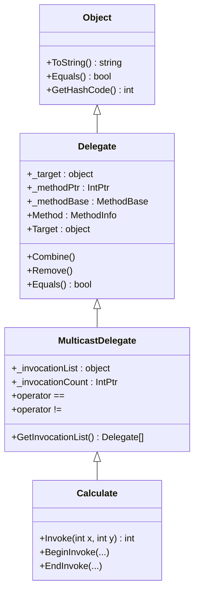
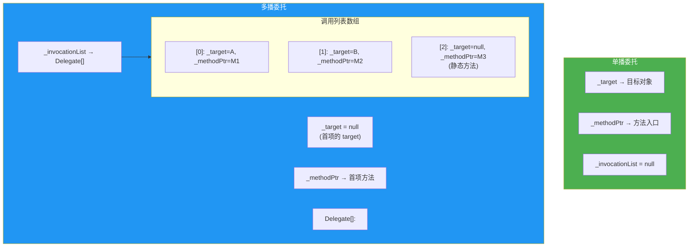
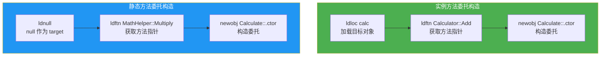
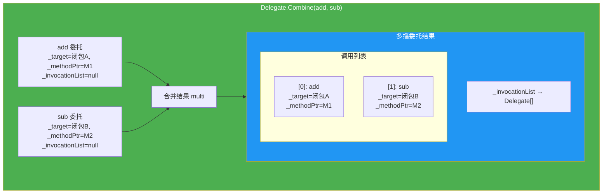
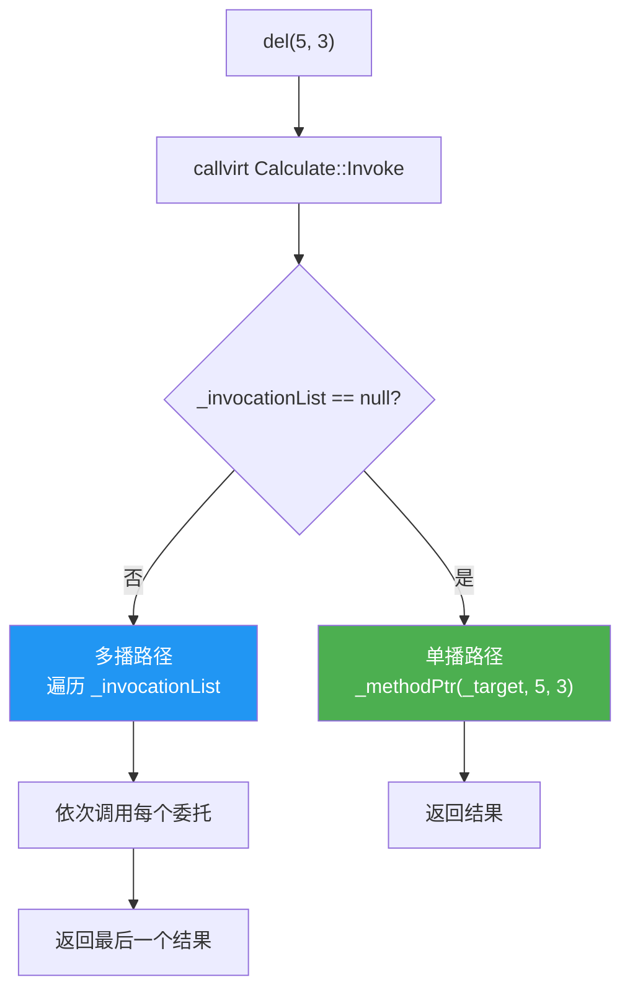
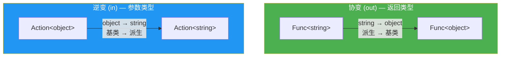
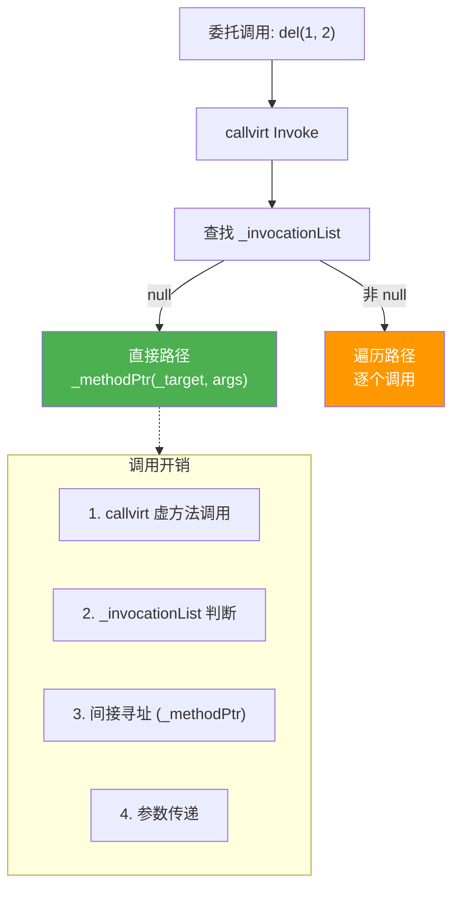
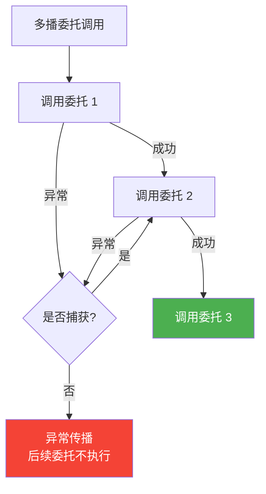

# 委托本质与多播委托

委托（Delegate）是 C# 中实现回调、事件、函数式编程的基础机制。在 CLR 层面，委托是一个类，继承自 `System.MulticastDelegate`，其内部通过 `_target`、`_methodPtr`、`_invocationList` 三个字段实现方法引用与多播链表。本文从 IL 视角剖析委托的编译结构、字段语义、多播机制、协变逆变等核心主题。

## 1. 委托的 IL 结构

### 1.1 委托声明的编译结果

```csharp
public delegate int Calculate(int x, int y);
```

C# 编译器将委托声明编译为一个继承自 `System.MulticastDelegate` 的类：

```il
.class public auto ansi sealed Calculate
       extends [System.Runtime]System.MulticastDelegate
{
  .method public hidebysig specialname rtspecialname
          instance void .ctor(object 'object', native int 'method') runtime managed
  {
  }

  .method public hidebysig newslot virtual
          instance int32 Invoke(int32 x, int32 y) runtime managed
  {
  }

  .method public hidebysig newslot virtual
          instance class [System.Runtime]System.IAsyncResult
          BeginInvoke(int32 x, int32 y,
                      class [System.Runtime]System.AsyncCallback callback,
                      object 'object') runtime managed
  {
  }

  .method public hidebysig newslot virtual
          instance int32 EndInvoke(
                      class [System.Runtime]System.IAsyncResult result) runtime managed
  {
  }
}
```

::: important 委托类的四个方法
1. **`.ctor(object, native int)`**：构造函数，接收目标对象和方法指针
2. **`Invoke`**：同步调用，签名与委托声明一致
3. **`BeginInvoke`**：异步调用开始（.NET Core 后已废弃）
4. **`EndInvoke`**：异步调用结束（.NET Core 后已废弃）

注意这些方法都标记为 `runtime managed`，表示方法体由 CLR 运行时直接提供，而非 IL 代码实现。
:::

### 1.2 委托类继承结构 Mermaid 图



### 1.3 三个核心字段

| 字段 | 类型 | 所在类 | 含义 |
|------|------|--------|------|
| `_target` | `object` | `Delegate` | 目标对象实例（静态方法为 null） |
| `_methodPtr` | `IntPtr` | `Delegate` | 方法指针（指向目标方法的入口点） |
| `_invocationList` | `object` | `MulticastDelegate` | 多播调用列表（单播时为 null） |
| `_invocationCount` | `IntPtr` | `MulticastDelegate` | 调用列表中的委托数量 |

## 2. _target / _methodPtr / _invocationList 字段

### 2.1 _target 字段

`_target` 存储方法调用时的 `this` 引用：

- **实例方法**：`_target` 指向目标对象实例
- **静态方法**：`_target` 为 `null`
- **闭包委托**：`_target` 指向编译器生成的闭包对象

### 2.2 _methodPtr 字段

`_methodPtr` 存储目标方法的函数指针。这个指针在 CLR 内部有多种含义：

- **普通方法**：指向方法的 JIT 编译后入口点（或 PreStub）
- **通过构造函数传入的指针**：即 `ldftn` 指令获取的方法地址

### 2.3 _invocationList 字段

`_invocationList` 是多播委托的核心：

- **单播委托**：`_invocationList` 为 `null`，调用时直接使用 `_target` 和 `_methodPtr`
- **多播委托**：`_invocationList` 指向一个 `Delegate[]` 数组，包含所有待调用的委托

### 2.4 字段布局 Mermaid 图



## 3. 委托构造 IL（ldftn + newobj）

### 3.1 实例方法委托的构造

```csharp
public class Calculator
{
    public int Add(int x, int y) => x + y;
}

var calc = new Calculator();
Calculate del = calc.Add;
```

```il
IL_0000:  newobj     instance void Calculator::.ctor()
IL_0005:  stloc.0
IL_0006:  ldloc.0          // 加载目标对象 calc
IL_0007:  ldftn      instance int32 Calculator::Add(int32, int32)  // 获取方法指针
IL_000d:  newobj     instance void Calculate::.ctor(object, native int)  // 构造委托
IL_0012:  stloc.1
```

::: tip ldftn 指令
`ldftn`（Load Function Pointer）将方法的入口点地址作为 `native int` 压入栈。这是获取非托管函数指针的 IL 指令，返回值可直接传递给委托构造函数的第二个参数。
:::

### 3.2 静态方法委托的构造

```csharp
public class MathHelper
{
    public static int Multiply(int x, int y) => x * y;
}

Calculate del = MathHelper.Multiply;
```

```il
IL_0000:  ldnull                  // 静态方法，_target = null
IL_0001:  ldftn      int32 MathHelper::Multiply(int32, int32)
IL_0007:  newobj     instance void Calculate::.ctor(object, native int)
IL_000c:  stloc.0
```

注意第一个参数是 `ldnull`——静态方法没有目标对象。

### 3.3 委托构造 Mermaid 流程图



### 3.4 静态方法 vs 实例方法 _target 差异

```csharp
using System;

public class Demo
{
    public static void StaticMethod() { }
    public void InstanceMethod() { }
}

class Program
{
    static void Main()
    {
        var demo = new Demo();
        Action staticDel = Demo.StaticMethod;
        Action instanceDel = demo.InstanceMethod;

        Console.WriteLine($"静态: Target = {staticDel.Target}");
        Console.WriteLine($"实例: Target = {instanceDel.Target}");
        Console.WriteLine($"实例 Target 类型: {instanceDel.Target?.GetType().Name}");
    }
}

// 输出:
// 静态: Target =
// 实例: Target = Demo
// 实例 Target 类型: Demo
```

## 4. 多播委托链表

### 4.1 Delegate.Combine

```csharp
Calculate add = (x, y) => x + y;
Calculate sub = (x, y) => x - y;
Calculate mul = (x, y) => x * y;

Calculate multi = (Calculate)Delegate.Combine(add, sub);
multi = (Calculate)Delegate.Combine(multi, mul);
```

### 4.2 多播委托 _invocationList 数组 Mermaid 图



### 4.3 Combine 的 IL

```csharp
Calculate combined = (Calculate)Delegate.Combine(add, sub);
```

```il
IL_0000:  ldloc.0      // add
IL_0001:  ldloc.1      // sub
IL_0002:  call        class [System.Runtime]System.Delegate
            [System.Runtime]System.Delegate::Combine(
                class [System.Runtime]System.Delegate,
                class [System.Runtime]System.Delegate)
IL_0007:  castclass   Calculate
IL_000c:  stloc.2
```

### 4.4 Delegate.Remove

```csharp
Calculate removed = (Calculate)Delegate.Remove(combined, sub);
```

```il
IL_0000:  ldloc.0      // combined
IL_0001:  ldloc.1      // sub
IL_0002:  call        class [System.Runtime]System.Delegate
            [System.Runtime]System.Delegate::Remove(
                class [System.Runtime]System.Delegate,
                class [System.Runtime]System.Delegate)
IL_0007:  castclass   Calculate
IL_000c:  stloc.2
```

::: warning Delegate.Remove 的匹配规则
`Delegate.Remove` 从调用列表末尾开始搜索，移除**第一个**匹配的委托。匹配规则：
- `_target` 和 `_methodPtr` 都相同
- 注意：如果列表中有多个相同的委托，`Remove` 只移除一个

```csharp
var a = new Calculate(SampleMethod);
var b = new Calculate(SampleMethod);
var combined = (Calculate)Delegate.Combine(a, b, a);
var removed = (Calculate)Delegate.Remove(combined, a);
// 结果: [a, b]，因为从末尾找到的 a 被移除
```
:::

### 4.5 多播委托的调用

当调用多播委托时，CLR 遍历 `_invocationList` 数组，依次调用每个委托：

```csharp
// CLR 内部的伪逻辑
public override int Invoke(int x, int y)
{
    if (_invocationList == null)
    {
        // 单播：直接调用
        return _methodPtr.Invoke(_target, x, y);
    }
    else
    {
        // 多播：遍历调用列表
        object[] list = (object[])_invocationList;
        int count = (int)_invocationCount;
        object result = null;
        for (int i = 0; i < count; i++)
        {
            var d = (Delegate)list[i];
            result = d.Method.Invoke(d.Target, new object[] { x, y });
        }
        return (int)result;  // 返回最后一个委托的结果
    }
}
```

::: important 多播委托的返回值
多播委托调用时，只有**最后一个**委托的返回值会被返回。前面的返回值被丢弃。如果需要收集所有返回值，应使用 `GetInvocationList()` 手动遍历。
:::

### 4.6 手动遍历多播委托

```csharp
Calculate multi = ...;  // 多播委托

foreach (Calculate del in multi.GetInvocationList())
{
    int result = del(10, 3);
    Console.WriteLine($"结果: {result}");
}
```

## 5. 委托调用 Invoke IL

### 5.1 同步调用

```csharp
Calculate del = (x, y) => x + y;
int result = del(5, 3);
```

```il
IL_0000:  ldloc.0
IL_0001:  ldc.i4.5
IL_0002:  ldc.i4.3
IL_0003:  callvirt   instance int32 Calculate::Invoke(int32, int32)
IL_0008:  stloc.1
```

`del(5, 3)` 编译为 `callvirt Calculate::Invoke(5, 3)`。委托的 `Invoke` 方法是虚方法，通过 `callvirt` 调用。

### 5.2 Invoke 的调用路径



### 5.3 DynamicInvoke

```csharp
Calculate del = (x, y) => x + y;
int result = (int)del.DynamicInvoke(5, 3);
```

`DynamicInvoke` 通过反射调用，开销远大于 `Invoke`：

```il
IL_0000:  ldloc.0
IL_0001:  ldc.i4.5
IL_0002:  box        int32
IL_0003:  ldc.i4.3
IL_0004:  box        int32
IL_0005:  newobj     instance void object[]::.ctor(...)
IL_000a:  callvirt   instance object
            [System.Runtime]System.Delegate::DynamicInvoke(object[])
IL_000f:  unbox.any  int32
```

::: warning DynamicInvoke 的开销
`DynamicInvoke` 需要参数装箱、反射查找、安全检查，其开销约为直接 `Invoke` 的 50-100 倍。应尽量避免在高性能场景中使用。
:::

## 6. 委托的协变与逆变

### 6.1 协变（Covariance）

协变允许将返回派生类型的委托赋值给返回基类型的委托变量：

```csharp
public delegate object ObjectFactory();
public delegate string StringFactory();

// 返回类型协变：string → object
ObjectFactory factory = () => "Hello";  // 隐式转换
```

### 6.2 逆变（Contravariance）

逆变允许将接受基类型参数的委托赋值给接受派生类型参数的委托变量：

```csharp
public delegate void ActionString(string s);
public delegate void ActionObject(object o);

// 参数类型逆变：object → string
ActionString action = (object o) => Console.WriteLine(o);  // C# 2.0+ 隐式委托转换
```

### 6.3 泛型委托的协变逆变

```csharp
// out: 协变（返回类型位置）
public delegate TResult Func<in T, out TResult>(T arg);

// 协变：Derived → Base
Func<object> f1 = () => "Hello";
Func<string> f2 = () => "World";

// Func<object> 可以赋值给 Func<object>
// Func<string> 可以赋值给 Func<object>（因为 string 是 object 的子类，TResult 是 out）

// 逆变：Base → Derived
Action<object> a1 = o => Console.WriteLine(o);
Action<string> a2 = a1;  // 合法：Action<object> 赋值给 Action<string>
```

### 6.4 协变逆变 IL 验证

```csharp
Func<string> stringFunc = () => "Hello";
Func<object> objectFunc = stringFunc;  // 协变赋值
```

```il
IL_0000:  ldloc.0
IL_0001:  call       class [System.Runtime]System.Func`1<!0>
            [System.Runtime]System.Delegate::CreateDelegate(
                class [System.Runtime]System.Type,
                class [System.Runtime]System.Delegate)
```

::: important 协变逆变是类型系统特性
委托的协变逆变由 CLR 类型系统在运行时验证。`Func<out TResult>` 中的 `out` 关键字告诉 CLR，`TResult` 只出现在输出位置（返回类型），因此派生类型到基类型的转换是安全的。同理，`in` 关键字用于参数位置的逆变。
:::

### 6.5 协变逆变约束 Mermaid 图



## 7. 委托编译为嵌套类场景

### 7.1 捕获变量的委托

当委托捕获外部变量时，C# 编译器会生成一个嵌套类（闭包类）来存储捕获的变量：

```csharp
public class Example
{
    public Action CreateCounter()
    {
        int count = 0;
        return () =>
        {
            count++;
            Console.WriteLine(count);
        };
    }
}
```

### 7.2 编译器生成的闭包类

```il
.class auto ansi sealed nested private beforefieldinit
       '<>c__DisplayClass0_0'
       extends [System.Runtime]System.Object
{
  .field public int32 'count'      // 捕获的变量

  .method public hidebysig instance void '<CreateCounter>b__0()' cil managed
  {
    .maxstack  8
    IL_0000:  ldarg.0
    IL_0001:  dup
    IL_0002:  ldfld      int32 '<>c__DisplayClass0_0'::'count'
    IL_0007:  ldc.i4.1
    IL_0008:  add
    IL_0009:  stfld      int32 '<>c__DisplayClass0_0'::'count'
    IL_000e:  ldarg.0
    IL_000f:  ldfld      int32 '<>c__DisplayClass0_0'::'count'
    IL_0014:  call       void [System.Console]System.Console::WriteLine(int32)
    IL_0019:  ret
  }

  .method public hidebysig specialname rtspecialname
          instance void .ctor() cil managed
  {
    .maxstack  8
    IL_0000:  ldarg.0
    IL_0001:  call       instance void [System.Runtime]System.Object::.ctor()
    IL_0006:  ret
  }
}
```

### 7.3 委托构造中的闭包对象

```il
// CreateCounter 方法体
.method public hidebysig instance class [System.Runtime]System.Action
        CreateCounter() cil managed
{
  .maxstack  3
  .locals init (
    [0] class Example/'<>c__DisplayClass0_0' 'CS$<>8__locals0',
    [1] class [System.Runtime]System.Action
  )

  IL_0000:  newobj     instance void Example/'<>c__DisplayClass0_0'::.ctor()
  IL_0005:  stloc.0
  IL_0006:  ldloc.0
  IL_0007:  ldc.i4.0
  IL_0008:  stfld      int32 Example/'<>c__DisplayClass0_0'::'count'

  IL_000d:  ldloc.0              // 闭包对象作为 _target
  IL_000e:  ldftn      instance void Example/'<>c__DisplayClass0_0'::'<CreateCounter>b__0()'
  IL_0014:  newobj     instance void [System.Runtime]System.Action::.ctor(object, native int)
  IL_0019:  stloc.1
  IL_001a:  ldloc.1
  IL_001b:  ret
}
```

::: tip 闭包委托的 _target
当委托捕获变量时，`_target` 字段指向编译器生成的闭包对象（`<>c__DisplayClass0_0` 实例），而不是原始的 `this`。这是理解委托与闭包关系的关键。
:::

### 7.4 闭包类 Mermaid 图

```mermaid
classDiagram
    class Example {
        +CreateCounter() Action
    }

    class DisplayClass {
        +count : int
        +b__0() void
    }

    class Action {
        +_target : object
        +_methodPtr : IntPtr
        +Invoke()
    }

    Example --> DisplayClass : 创建实例
    DisplayClass --> Action : _target = DisplayClass实例
    Note for Action "_methodPtr → DisplayClass.b__0()"
```

## 8. 委托的性能

### 8.1 直接调用 vs 委托调用

```csharp
using BenchmarkDotNet.Attributes;

[MemoryDiagnoser]
public class DelegateBenchmark
{
    private readonly Calculator _calc = new();
    private readonly Calculate _del;
    private readonly Calculate _openDel;  // 开放委托

    public DelegateBenchmark()
    {
        _del = _calc.Add;
        // 开放实例委托：不需要指定 target
        _openDel = (Calculate)Delegate.CreateDelegate(
            typeof(Calculate), null,
            typeof(Calculator).GetMethod("Add")!);
    }

    [Benchmark(Baseline = true)]
    public int DirectCall() => _calc.Add(1, 2);

    [Benchmark]
    public int DelegateCall() => _del(1, 2);

    [Benchmark]
    public int OpenDelegateCall() => _openDel(_calc, 1, 2);
}

public class Calculator
{
    public int Add(int x, int y) => x + y;
}
```

典型结果（.NET 8, x64）：

| 方法 | 平均时间 | 相对性能 |
|------|----------|----------|
| DirectCall | ~0.3 ns | 1.0x |
| DelegateCall | ~3.5 ns | ~12x |
| OpenDelegateCall | ~4.0 ns | ~13x |

### 8.2 委托调用的开销来源



### 8.3 减少委托开销的策略

1. **缓存委托实例**：避免在循环中重复创建委托

```csharp
// 不好：每次循环创建新委托
for (int i = 0; i < 1000; i++)
{
    Process(data, x => x.Value > 0);  // 每次创建新委托
}

// 好：缓存委托
Func<Data, bool> predicate = x => x.Value > 0;
for (int i = 0; i < 1000; i++)
{
    Process(data, predicate);  // 重用同一个委托
}
```

2. **使用 IComparer 接口代替委托比较**：在排序等场景

3. **使用函数指针（C# 9）**：在极高性能场景

```csharp
// C# 9 函数指针 — 零开销调用
delegate* managed<int, int, int> addPtr = &Calculator.Add;
int result = addPtr(1, 2);  // 直接调用，无委托开销
```

### 8.4 函数指针 vs 委托

| 特征 | 委托 | 函数指针 |
|------|------|----------|
| 类型安全 | 完全类型安全 | 调用约定级类型安全 |
| 多播 | 支持 | 不支持 |
| 闭包 | 支持 | 不支持 |
| 开销 | 间接寻址 | 直接调用 |
| GC | 可被 GC 跟踪 | 不受 GC 管理 |
| 反射 | 支持 | 不支持 |

## 9. 委托的相等性

### 9.1 委托相等规则

两个委托相等当且仅当：
1. 它们的 `_target` 相同（引用相等）
2. 它们的 `_methodPtr` 指向同一个方法

```csharp
var calc = new Calculator();
Calculate del1 = calc.Add;
Calculate del2 = calc.Add;

Console.WriteLine(del1 == del2);  // True! 相同目标 + 相同方法
Console.WriteLine(ReferenceEquals(del1, del2));  // False，不同实例

Calculate del3 = new Calculator().Add;
Console.WriteLine(del1 == del3);  // False，不同目标
```

### 9.2 委托相等的 IL

```csharp
del1 == del2
```

```il
IL_0000:  ldloc.0
IL_0001:  ldloc.1
IL_0002:  call       bool [System.Runtime]System.Delegate::op_Equality(
              class [System.Runtime]System.Delegate,
              class [System.Runtime]System.Delegate)
```

`op_Equality` 内部比较 `_target` 和 `_methodPtr`，但不比较 `_invocationList`。

## 10. 委托与泛型

### 10.1 泛型委托

```csharp
public delegate TResult Converter<in TInput, out TResult>(TInput input);

// 内置泛型委托
Func<int, string> intToString = x => x.ToString();
Action<string> print = s => Console.WriteLine(s);
Predicate<int> isPositive = x => x > 0;
```

### 10.2 泛型委托的 IL

```csharp
Func<int, string> del = x => x.ToString();
```

```il
IL_0000:  ldloc.0
IL_0001:  ldftn      instance string '<>c'::'<Main>b__0_0'(int32)
IL_0007:  newobj     instance void class
            [System.Runtime]System.Func`2<int32, string>::.ctor(object, native int)
```

### 10.3 开放泛型委托

```csharp
// 通过反射创建开放泛型委托
var method = typeof(string).GetMethod("Contains", new[] { typeof(string) })!;
var funcType = typeof(Func<,,>).MakeGenericType(typeof(string), typeof(string), typeof(bool));
var del = (Func<string, string, bool>)Delegate.CreateDelegate(funcType, null, method);

bool result = del("Hello World", "World");  // True
```

## 11. 委托与事件的关系

### 11.1 委托是事件的基础

事件本质上是委托的封装——事件在内部使用委托来存储订阅者：

```csharp
public class Button
{
    // 事件：编译器生成私有委托字段 + add/remove 方法
    public event EventHandler? Clicked;

    public void SimulateClick()
    {
        Clicked?.Invoke(this, EventArgs.Empty);
    }
}
```

### 11.2 委托 vs 事件

| 特征 | 委托 | 事件 |
|------|------|------|
| 外部可调用 | 是 | 否（只有声明类可触发） |
| 外部可赋值 | 是 | 否 |
| 外部可添加/移除 | `Combine`/`Remove` | `+=`/`-=` |
| 访问修饰 | 按声明 | `add`/`remove` 可有不同访问级别 |
| 接口中声明 | 可以 | 可以 |
| 本质 | 类型 | 成员修饰符 |

::: tip 事件的封装性
事件相比委托提供了更好的封装：
1. 外部只能通过 `+=` 和 `-=` 订阅/取消订阅
2. 外部不能直接调用事件（只有声明类可以触发）
3. 外部不能通过 `=` 替换整个委托链
4. 这些限制防止了订阅者之间的干扰
:::

## 12. 委托在 .NET 框架中的使用

### 12.1 内置委托类型

| 委托类型 | 签名 | 用途 |
|----------|------|------|
| `Action` | `void()` | 无参数无返回值 |
| `Action<T>` | `void(T)` | 单参数无返回值 |
| `Func<TResult>` | `TResult()` | 无参数有返回值 |
| `Func<T, TResult>` | `TResult(T)` | 单参数有返回值 |
| `Predicate<T>` | `bool(T)` | 条件判断 |
| `Comparison<T>` | `int(T, T)` | 比较排序 |
| `Converter<TInput, TResult>` | `TResult(TInput)` | 类型转换 |
| `EventHandler<TEventArgs>` | `void(object, T)` | 事件处理 |

### 12.2 委托在 LINQ 中的应用

```csharp
var numbers = new[] { 1, 2, 3, 4, 5 };

// Where 接收 Func<int, bool> 委托
var evens = numbers.Where(n => n % 2 == 0);

// Select 接收 Func<int, TResult> 委托
var doubled = numbers.Select(n => n * 2);

// OrderBy 接收 Func<int, TKey> 委托
var sorted = numbers.OrderBy(n => n);
```

每个 LINQ 操作符内部都是通过委托调用实现的高阶函数。

## 13. 委托与 AOT 兼容性

### 13.1 委托在 Native AOT 中的注意事项

```csharp
// 通过反射创建委托可能在 AOT 中失败
var method = typeof(Calculator).GetMethod("Add")!;
var del = Delegate.CreateDelegate(typeof(Calculate), method);  // 可能失败

// AOT 友好的方式：直接创建委托
Calculate del = new Calculator().Add;  // 编译时已知，AOT 安全
```

### 13.2 DynamicInvoke 与 AOT

`DynamicInvoke` 在 Native AOT 环境下需要特殊处理，因为它依赖反射来查找方法。建议使用源生成器替代运行时反射。

## 14. 多播委托的异常处理

### 14.1 多播委托中的异常传播

```csharp
Calculate multi = (Calculate)Delegate.Combine(
    (x, y) => { Console.WriteLine("加法"); return x + y; },
    (x, y) => { throw new InvalidOperationException("故意出错"); },
    (x, y) => { Console.WriteLine("乘法"); return x * y; }
);

try
{
    multi(5, 3);
}
catch (InvalidOperationException)
{
    Console.WriteLine("捕获异常");
}

// 输出:
// 加法
// 捕获异常
// 注意: "乘法" 不会执行！第二个委托抛出异常后，后续委托不再执行
```

::: warning 多播委托的异常陷阱
多播委托按顺序调用，如果其中一个委托抛出异常，后续的委托**不会被执行**。对于事件处理等场景，这可能导致部分订阅者收不到通知。
:::

### 14.2 安全的多播委托调用

```csharp
public static void SafeInvokeAll(Calculate multi, int x, int y)
{
    if (multi == null) return;

    var handlers = multi.GetInvocationList();
    foreach (Calculate handler in handlers)
    {
        try
        {
            handler(x, y);
        }
        catch (Exception ex)
        {
            Console.WriteLine($"委托调用异常: {ex.Message}");
        }
    }
}
```

### 14.3 多播委托异常处理 Mermaid 图



## 15. 小结

委托是 C# 中实现回调、事件和函数式编程的核心机制。从 CLR 层面理解委托的本质，有助于我们编写更高效、更安全的代码：

| 主题 | 关键点 |
|------|--------|
| 委托 IL 结构 | 继承 MulticastDelegate，含 .ctor/Invoke/BeginInvoke/EndInvoke |
| 三个核心字段 | `_target`（目标对象）、`_methodPtr`（方法指针）、`_invocationList`（调用列表） |
| 委托构造 | `ldftn` 获取方法指针 + `newobj` 构造委托 |
| 静态 vs 实例 | 静态方法 `_target=null`，实例方法 `_target=对象引用` |
| 多播委托 | `_invocationList` 数组，Delegate.Combine/Remove |
| 协变逆变 | `out` 协变返回类型，`in` 逆变参数类型 |
| 闭包 | 编译器生成 `<>c__DisplayClass` 嵌套类 |
| 性能 | 直接调用 ≪ 委托调用 ≪ DynamicInvoke |
| 异常 | 多播委托中一个异常会中断后续调用 |