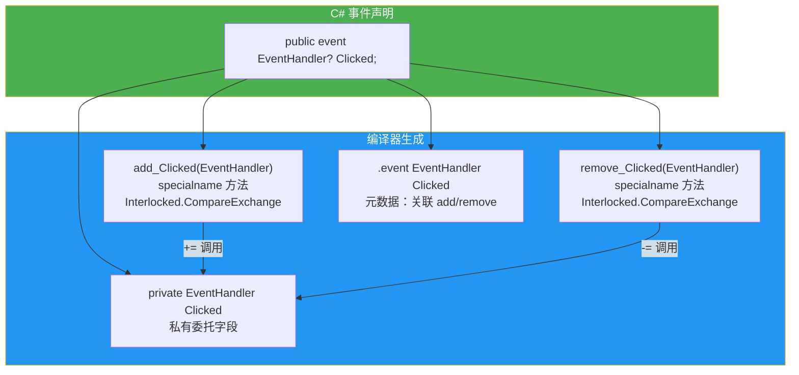
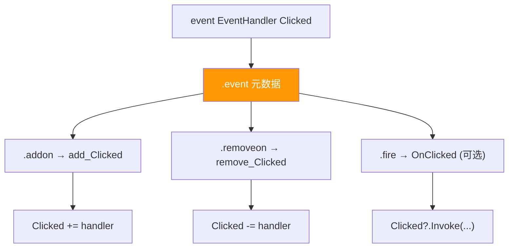
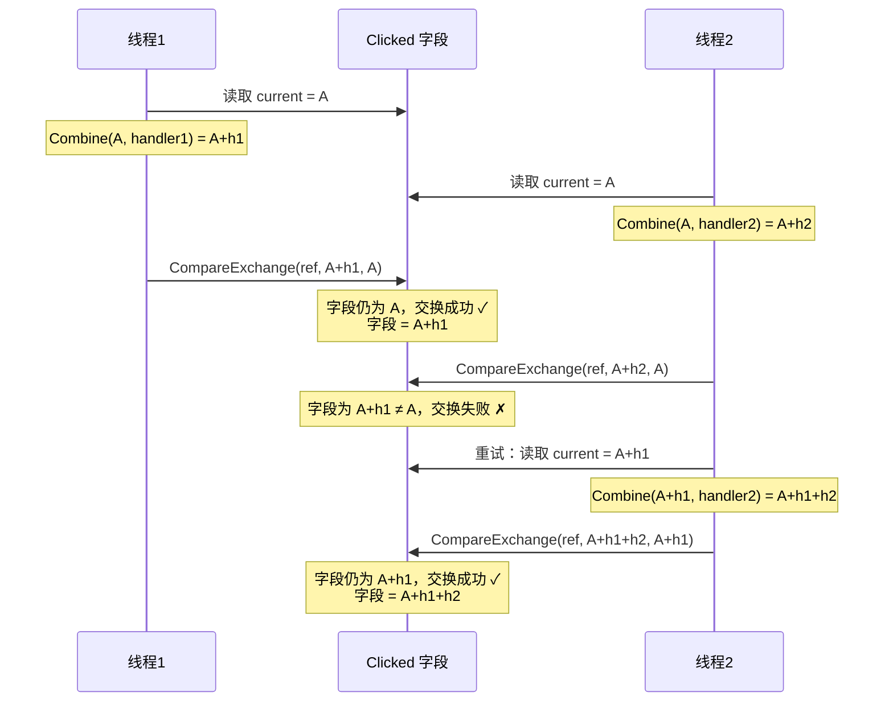
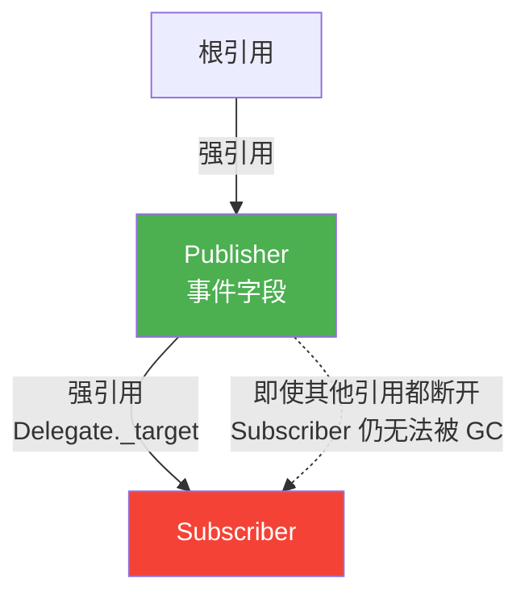
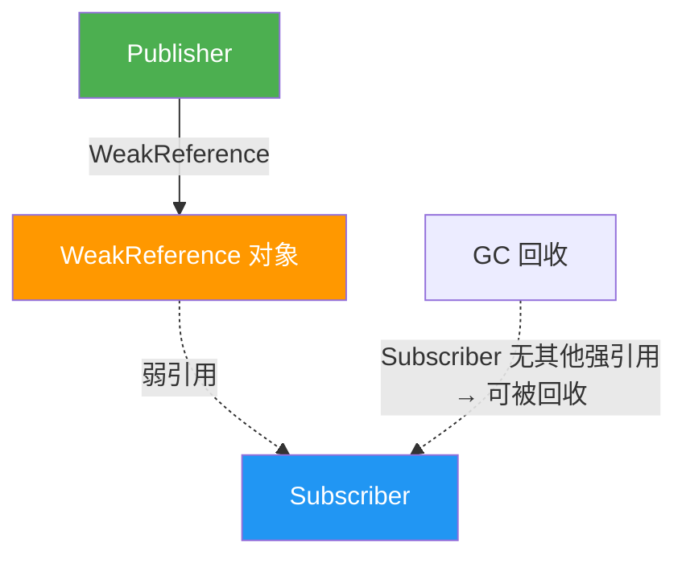
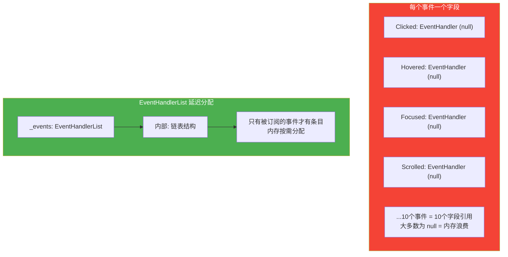
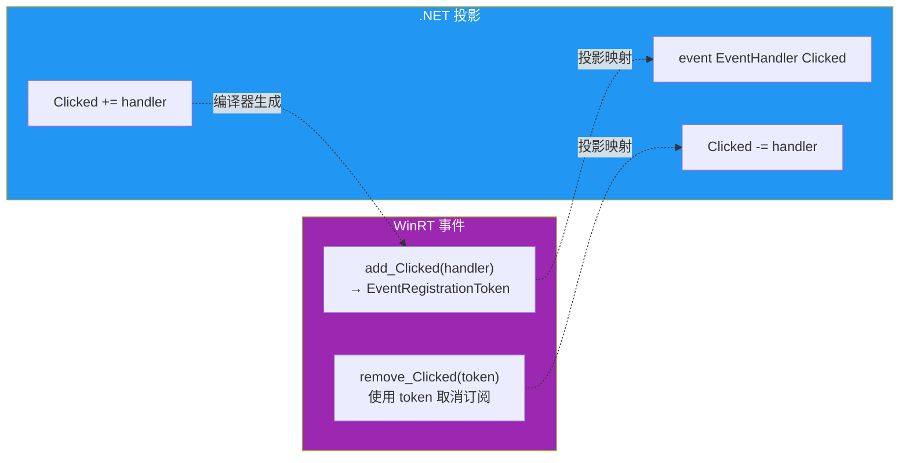

# 事件原理

事件（Event）是 C# 中发布/订阅模式的语言级支持。表面上事件像是委托的简单封装，但它在 CLR 层面拥有独立的元数据结构和编译规则。事件通过强制封装——只允许外部订阅/取消订阅，不允许外部触发或替换——实现了比裸委托更安全的观察者模式。本文从 IL 视角揭示事件的编译真相，涵盖字段式事件、线程安全事件、弱事件模式、接口事件等核心主题。

## 1. 事件编译为私有委托字段 + add_/remove_ 方法

### 1.1 事件的基本语法

```csharp
public class Button
{
    public event EventHandler? Clicked;

    public void SimulateClick()
    {
        Clicked?.Invoke(this, EventArgs.Empty);
    }
}
```

### 1.2 编译器生成的内容

C# 编译器为上述事件生成三个成员：

1. **私有委托字段**：`private EventHandler Clicked;`
2. **add_Clicked 方法**：用于添加订阅者（`+=` 操作）
3. **remove_Clicked 方法**：用于移除订阅者（`-=` 操作）

### 1.3 IL 验证

```il
.class public auto ansi beforefieldinit Button
       extends [System.Runtime]System.Object
{
  // 私有委托字段
  .field private class [System.Runtime]System.EventHandler Clicked

  // 事件元数据
  .event [System.Runtime]System.EventHandler Clicked
  {
    .addon instance void Button::add_Clicked(class [System.Runtime]System.EventHandler)
    .removeon instance void Button::remove_Clicked(class [System.Runtime]System.EventHandler)
  }

  // add_Clicked 方法
  .method public hidebysig specialname
          instance void add_Clicked(class [System.Runtime]System.EventHandler 'value') cil managed
  {
    .maxstack  3
    .locals init (
      [0] class [System.Runtime]System.EventHandler V_0,
      [1] class [System.Runtime]System.EventHandler V_1,
      [2] class [System.Runtime]System.EventHandler V_2
    )
    IL_0000:  ldarg.0
    IL_0001:  ldfld      class [System.Runtime]System.EventHandler Button::Clicked
    IL_0006:  stloc.0
    IL_0007:  br.s       IL_0018

    // 循环: CompareExchange 重试逻辑
    IL_0009:  ldloc.0
    IL_000a:  stloc.1
    IL_000b:  ldloc.1
    IL_000c:  ldarg.1
    IL_000d:  call       class [System.Runtime]System.Delegate
                [System.Runtime]System.Delegate::Combine(
                    class [System.Runtime]System.Delegate,
                    class [System.Runtime]System.Delegate)
    IL_0012:  castclass  [System.Runtime]System.EventHandler
    IL_0017:  stloc.2

    IL_0018:  ldarg.0
    IL_0019:  ldflda     class [System.Runtime]System.EventHandler Button::Clicked
    IL_001e:  ldloc.2
    IL_001f:  ldloc.1
    IL_0020:  call       !!0
                [System.Runtime]System.Threading.Interlocked::CompareExchange<
                    class [System.Runtime]System.EventHandler>(
                        !!0&, !!0, !!0)
    IL_0025:  stloc.0
    IL_0026:  ldloc.0
    IL_0027:  ldloc.1
    IL_0028:  bne.un.s   IL_0009

    IL_002a:  ret
  }

  // remove_Clicked 方法（结构类似，使用 Delegate.Remove）
  .method public hidebysig specialname
          instance void remove_Clicked(class [System.Runtime]System.EventHandler 'value') cil managed
  {
    // 类似的 CompareExchange 循环，使用 Delegate.Remove
  }
}
```

::: important 字段式事件的线程安全
从 .NET Framework 2.0 开始，编译器为字段式事件自动生成**线程安全**的 `add`/`remove` 方法，使用 `Interlocked.CompareExchange` 无锁循环确保多线程环境下的安全订阅/取消订阅。
:::

### 1.4 事件编译 Mermaid 图



### 1.5 事件元数据中的 IL 声明

```il
.event [System.Runtime]System.EventHandler Clicked
{
  .addon instance void Button::add_Clicked(class [System.Runtime]System.EventHandler)
  .removeon instance void Button::remove_Clicked(class [System.Runtime]System.EventHandler)
}
```

事件在元数据中使用 `.event` 指令声明，通过 `.addon`（add 方法）和 `.removeon`（remove 方法）关联访问器方法。

## 2. event IL 声明的完整结构

### 2.1 ECMA-335 中的事件定义

根据 ECMA-335 标准（Partition II, Section 18），事件在元数据中的表示：

| 元数据表 | 内容 |
|----------|------|
| `EventDef` | 事件名称、标志、关联类型 |
| `MethodSemantics` | 关联事件与 add/remove/raise 方法 |

`EventAttributes` 标志：

| 标志 | 值 | 说明 |
|------|-----|------|
| `SpecialName` | 0x0200 | 特殊名称 |
| `RTSpecialName` | 0x0400 | 运行时应特殊处理 |

### 2.2 事件的完整 IL 生命周期



### 2.3 可选的 raise 方法

C# 编译器不生成 `raise_` 方法（`.fire`），因为 C# 不支持事件的 `raise` 访问器。但 CLR 元数据格式支持这个概念，某些其他语言（如 VB.NET）可以使用。

## 3. 自定义 add/remove 访问器

### 3.1 属性式事件

C# 允许自定义事件的 `add` 和 `remove` 访问器，类似于属性的自定义 getter/setter：

```csharp
public class Button
{
    private EventHandler? _clicked;

    public event EventHandler Clicked
    {
        add
        {
            Console.WriteLine($"订阅者添加: {value.Method.Name}");
            _clicked = (EventHandler)Delegate.Combine(_clicked, value);
        }
        remove
        {
            Console.WriteLine($"订阅者移除: {value.Method.Name}");
            _clicked = (EventHandler)Delegate.Remove(_clicked, value);
        }
    }

    public void SimulateClick()
    {
        _clicked?.Invoke(this, EventArgs.Empty);
    }
}
```

### 3.2 自定义访问器的 IL

```il
.method public hidebysig specialname
        instance void add_Clicked(class [System.Runtime]System.EventHandler 'value') cil managed
{
  .maxstack  8
  IL_0000:  ldstr      "订阅者添加: "
  IL_0005:  ldarg.1
  IL_0006:  callvirt   instance class [System.Reflection]System.Reflection.MethodInfo
              [System.Runtime]System.Delegate::get_Method()
  IL_000b:  callvirt   instance string [System.Reflection]System.MemberInfo::get_Name()
  IL_0010:  call       string [System.Runtime]System.String::Concat(string, string)
  IL_0015:  call       void [System.Console]System.Console::WriteLine(string)
  IL_001a:  ldarg.0
  IL_001b:  ldarg.0
  IL_001c:  ldfld      class [System.Runtime]System.EventHandler Button::_clicked
  IL_0021:  ldarg.1
  IL_0022:  call       class [System.Runtime]System.Delegate
              [System.Runtime]System.Delegate::Combine(
                  class [System.Runtime]System.Delegate,
                  class [System.Runtime]System.Delegate)
  IL_0027:  castclass  [System.Runtime]System.EventHandler
  IL_002c:  stfld      class [System.Runtime]System.EventHandler Button::_clicked
  IL_0031:  ret
}
```

注意：自定义访问器**不会**自动添加线程安全的 `Interlocked.CompareExchange` 逻辑，需要开发者自行处理。

### 3.3 何时使用自定义访问器

::: important 自定义 add/remove 的适用场景
1. **需要自定义线程安全策略**：如使用 `lock` 而非 `Interlocked`
2. **需要记录日志**：追踪订阅/取消订阅行为
3. **需要使用弱引用**：防止内存泄漏
4. **需要委托存储在非默认位置**：如使用 `EventHandlerList`
:::

## 4. 线程安全事件（Interlocked.CompareExchange 模式）

### 4.1 默认字段式事件的线程安全

编译器自动生成的 `add` 方法使用 `Interlocked.CompareExchange` 实现无锁线程安全：

```csharp
// 编译器生成的等价代码
public void add_Clicked(EventHandler value)
{
    EventHandler current;
    EventHandler original;

    do
    {
        current = this.Clicked;       // 读取当前值
        original = current;
        var combined = (EventHandler)Delegate.Combine(current, value);
        // 原子性交换：只有当字段仍为 original 时才替换为 combined
        current = Interlocked.CompareExchange(ref this.Clicked, combined, original);
    }
    while (current != original);  // 如果被其他线程抢先修改，重试
}
```

### 4.2 CompareExchange 循环 Mermaid 图



### 4.3 使用 lock 的线程安全事件

```csharp
public class Button
{
    private readonly object _eventLock = new();
    private EventHandler? _clicked;

    public event EventHandler Clicked
    {
        add
        {
            lock (_eventLock)
            {
                _clicked = (EventHandler)Delegate.Combine(_clicked, value);
            }
        }
        remove
        {
            lock (_eventLock)
            {
                _clicked = (EventHandler)Delegate.Remove(_clicked, value);
            }
        }
    }
}
```

::: tip CompareExchange vs lock
- **CompareExchange**：无锁（lock-free），适用于低竞争场景
- **lock**：互斥锁，适用于高竞争场景或需要原子性多步操作的场景
- 编译器默认选择 CompareExchange，因为事件订阅/取消订阅通常是低频操作
- 《CLR via C#》推荐使用 `lock` 方式，因为它更直观且不易出错
:::

### 4.4 null 条件触发

```csharp
// C# 6.0+ 线程安全的触发方式
Clicked?.Invoke(this, EventArgs.Empty);
```

编译器生成的等价代码：

```csharp
var handler = Clicked;  // 局部变量捕获，防止 null 竞态
handler?.Invoke(this, EventArgs.Empty);
```

```il
IL_0000:  ldarg.0
IL_0001:  ldfld      class [System.Runtime]System.EventHandler Button::Clicked
IL_0006:  dup
IL_0007:  brtrue.s   IL_000b
IL_0009:  pop
IL_000a:  ret

IL_000b:  ldarg.0
IL_000c:  ldsfld     class [System.Runtime]System.EventArgs
              [System.Runtime]System.EventArgs::Empty
IL_0011:  callvirt   instance void [System.Runtime]System.EventHandler::Invoke(
              object, class [System.Runtime]System.EventArgs)
IL_0016:  ret
```

::: warning 为什么要用局部变量？
直接使用 `Clicked?.Invoke(...)` 时，编译器会先将 `Clicked` 复制到局部变量，再调用。这是因为：
1. 避免竞态条件：如果另一个线程在 null 检查和 Invoke 之间将 `Clicked` 设为 null
2. 局部变量保证了 null 检查和调用使用同一个引用

如果不使用 `?.`，手动实现如下：
```csharp
var handler = Clicked;  // 关键：先复制到局部变量
if (handler != null)
    handler(this, EventArgs.Empty);
```
:::

## 5. 弱事件模式（WeakEventManager）

### 5.1 事件导致的内存泄漏

常规事件订阅会创建从发布者到订阅者的强引用，阻止订阅者被垃圾回收：

```csharp
public class Publisher
{
    public event EventHandler? SomethingHappened;
}

public class Subscriber
{
    public Subscriber(Publisher publisher)
    {
        publisher.SomethingHappened += OnSomethingHappened;
        // 问题: 如果忘记 -= 取消订阅，Subscriber 永远不会被 GC
    }

    private void OnSomethingHappened(object? sender, EventArgs e) { }
}
```

### 5.2 内存泄漏 Mermaid 图



### 5.3 WeakEventManager

WPF 提供了 `WeakEventManager` 来解决事件内存泄漏问题。在非 WPF 场景中，可以实现自己的弱事件管理器：

```csharp
public class WeakEventManager<TEventArgs>
{
    private readonly List<WeakReference> _handlers = new();

    public void Subscribe(object subscriber, EventHandler<TEventArgs> handler)
    {
        _handlers.Add(new WeakReference(handler));
    }

    public void Unsubscribe(EventHandler<TEventArgs> handler)
    {
        _handlers.RemoveAll(wr =>
        {
            if (wr.Target is Delegate del)
                return del.Equals(handler);
            return !wr.IsAlive;  // 清理已死亡引用
        });
    }

    public void Raise(object? sender, TEventArgs args)
    {
        for (int i = _handlers.Count - 1; i >= 0; i--)
        {
            var wr = _handlers[i];
            if (wr.Target is Delegate del)
            {
                del.DynamicInvoke(sender, args);
            }
            else
            {
                _handlers.RemoveAt(i);  // 清理已死亡引用
            }
        }
    }
}
```

### 5.4 弱引用事件 Mermaid 图



::: important 弱事件的代价
弱事件模式虽然防止了内存泄漏，但也带来了额外开销：
1. **性能开销**：弱引用访问比强引用慢
2. **复杂性**：需要管理弱引用列表、清理死亡引用
3. **不确定性**：订阅者可能在事件触发前被回收

建议：优先使用显式取消订阅（`-=`），只在无法控制订阅者生命周期时才使用弱事件。
:::

## 6. 事件 vs 委托对比

### 6.1 封装性对比

```csharp
public class Example
{
    // 委托：外部可以执行任何操作
    public EventHandler? ClickDelegate;

    // 事件：外部只能 += / -=
    public event EventHandler? ClickEvent;
}

public class Client
{
    public Client(Example example)
    {
        // 委托：可以赋值（替换所有订阅者！）
        example.ClickDelegate = MyHandler;  // 危险！清空了之前的所有订阅者

        // 委托：可以外部触发
        example.ClickDelegate?.Invoke(example, EventArgs.Empty);  // 外部触发！

        // 事件：只能订阅
        example.ClickEvent += MyHandler;  // 安全

        // 事件：不能赋值
        // example.ClickEvent = MyHandler;  // 编译错误 CS0079

        // 事件：不能外部触发
        // example.ClickEvent?.Invoke(example, EventArgs.Empty);  // 编译错误 CS0070
    }

    private void MyHandler(object? sender, EventArgs e) { }
}
```

### 6.2 事件 vs 委托完整对比

| 特征 | 委托字段 | 事件 |
|------|----------|------|
| 外部可调用 | 是 | 否（只有声明类可触发） |
| 外部可赋值（=） | 是 | 否 |
| 外部可订阅（+=） | 是 | 是 |
| 外部可取消（-=） | 是 | 是 |
| 可在接口中声明 | 可以 | 可以 |
| 编译器自动线程安全 | 否 | 是（字段式事件） |
| 元数据 | `FieldDef` | `EventDef` |
| 设计意图 | 回调/传递方法引用 | 发布/订阅通知 |

### 6.3 《CLR via C#》的事件设计哲学

Jeffrey Richter 在《CLR via C#》中指出：

> 事件是委托的封装机制。没有事件，委托仍然是安全的，但外部代码可以做不该做的事——比如清空所有订阅者或从外部触发事件。事件的目的是**约束**外部代码只能做"合理的"操作。

## 7. 事件在接口中的声明

### 7.1 接口事件语法

```csharp
public interface IClickable
{
    event EventHandler? Clicked;
}
```

### 7.2 接口事件的 IL

```il
.class interface public abstract auto ansi IClickable
{
  .event [System.Runtime]System.EventHandler Clicked
  {
    .addon instance void IClickable::add_Clicked(class [System.Runtime]System.EventHandler)
    .removeon instance void IClickable::remove_Clicked(class [System.Runtime]System.EventHandler)
  }

  .method public hidebysig newslot specialname abstract virtual
          instance void add_Clicked(class [System.Runtime]System.EventHandler 'value') cil managed
  {
  }

  .method public hidebysig newslot specialname abstract virtual
          instance void remove_Clicked(class [System.Runtime]System.EventHandler 'value') cil managed
  {
  }
}
```

::: important 接口事件的 IL 特征
- 事件的 `add`/`remove` 方法标记为 `abstract virtual newslot specialname`
- 接口本身只声明事件签名，不提供实现
- 实现接口的类必须提供 `add`/`remove` 方法
- 注意：接口事件与接口属性类似，访问器方法是隐式抽象的
:::

### 7.3 实现接口事件

```csharp
public class Button : IClickable
{
    // 隐式实现
    public event EventHandler? Clicked;

    // 显式实现
    // event EventHandler? IClickable.Clicked
    // {
    //     add { ... }
    //     remove { ... }
    // }
}
```

### 7.4 显式接口事件实现

```csharp
public class Button : IClickable
{
    private EventHandler? _clicked;

    event EventHandler? IClickable.Clicked
    {
        add => _clicked = (EventHandler?)Delegate.Combine(_clicked, value);
        remove => _clicked = (EventHandler?)Delegate.Remove(_clicked, value);
    }

    // 可以有另一个公开的 Clicked 事件
    public event EventHandler? Clicked;
}
```

## 8. 字段式事件 vs 属性式事件

### 8.1 字段式事件（Field-like Event）

```csharp
public event EventHandler? Clicked;
```

编译器自动生成：
- 私有委托字段
- 线程安全的 `add`/`remove` 方法
- 在声明类内部，`Clicked` 可以直接 `Invoke`

### 8.2 属性式事件（Property-like Event）

```csharp
private EventHandler? _clicked;
public event EventHandler Clicked
{
    add { _clicked = (EventHandler)Delegate.Combine(_clicked, value); }
    remove { _clicked = (EventHandler)Delegate.Remove(_clicked, value); }
}
```

开发者完全控制：
- 委托的存储方式
- `add`/`remove` 的实现逻辑
- 线程安全策略

### 8.3 对比表

| 特征 | 字段式事件 | 属性式事件 |
|------|-----------|-----------|
| 委托存储 | 自动生成私有字段 | 开发者自定义 |
| add/remove | 自动生成（线程安全） | 开发者自定义 |
| 类内触发 | `Clicked?.Invoke(...)` | 需手动调用后台字段 |
| 线程安全 | 自动（CompareExchange） | 需手动实现 |
| 灵活性 | 低 | 高 |
| 适用场景 | 简单事件 | 需要自定义逻辑 |

### 8.4 字段式事件的触发规则

::: warning 字段式事件的访问范围
字段式事件在声明类**内部**和**外部**的访问行为不同：

- **声明类内部**：`Clicked` 可以作为委托字段使用（可以 `Invoke`、`= null` 等）
- **声明类外部**：`Clicked` 只能通过 `+=` 和 `-=` 访问

这个区别是编译时强制的，不是运行时限制。IL 中 `add_Clicked` 和 `remove_Clicked` 方法都是 `public` 的（除非指定了其他访问修饰符），但 `Clicked` 字段是 `private` 的。
:::

```csharp
public class Publisher
{
    public event EventHandler? Clicked;

    public void Trigger()
    {
        // 声明类内部：可以 Invoke
        Clicked?.Invoke(this, EventArgs.Empty);

        // 声明类内部：甚至可以赋值（不推荐）
        // Clicked = null;
    }
}

public class Subscriber
{
    public Subscriber(Publisher pub)
    {
        // 外部：只能 += / -=
        pub.Clicked += OnClicked;

        // 外部：不能 Invoke
        // pub.Clicked?.Invoke(...);  // 编译错误

        // 外部：不能赋值
        // pub.Clicked = null;  // 编译错误
    }
}
```

## 9. EventHandlerList 模式

### 9.1 大量事件的优化

当一个类有大量事件时，每个事件一个委托字段会浪费内存（因为大多数事件可能没有订阅者）。`EventHandlerList` 提供了延迟分配的方案：

```csharp
public class ComplexControl
{
    private readonly EventHandlerList _events = new();

    private static readonly object EventClicked = new();
    private static readonly object EventHovered = new();
    private static readonly object EventFocused = new();

    public event EventHandler Clicked
    {
        add => _events.AddHandler(EventClicked, value);
        remove => _events.RemoveHandler(EventClicked, value);
    }

    public event EventHandler Hovered
    {
        add => _events.AddHandler(EventHovered, value);
        remove => _events.RemoveHandler(EventHovered, value);
    }

    public event EventHandler Focused
    {
        add => _events.AddHandler(EventFocused, value);
        remove => _events.RemoveHandler(EventFocused, value);
    }

    protected virtual void OnClicked(EventArgs e)
    {
        var handler = (EventHandler?)_events[EventClicked];
        handler?.Invoke(this, e);
    }
}
```

### 9.2 EventHandlerList 内存对比



::: tip 何时使用 EventHandlerList
- 类有 10+ 个事件，但通常只有少数被订阅
- Windows Forms 控件（如 `Control` 类）使用此模式
- 每个事件的键是 `static readonly object`，确保唯一性
:::

## 10. WinRT 事件映射

### 10.1 WinRT 事件与 .NET 事件

Windows Runtime (WinRT) 有自己的事件模型，与 .NET 事件有所不同。.NET 通过投影（projection）将 WinRT 事件映射为 .NET 事件：

```csharp
// WinRT 事件在 C# 中的使用方式与普通事件相同
// 但底层实现不同

// WinRT 事件使用 EventRegistrationToken
// .NET 编译器/运行时自动处理映射
```

### 10.2 WinRT 事件的映射规则

| WinRT 概念 | .NET 映射 |
|------------|-----------|
| `EventRegistrationToken` | 隐藏，由投影层处理 |
| `add_Xxx` / `remove_Xxx` | 映射为 `event` 的 `add`/`remove` |
| 事件参数类型 | 映射为 `EventHandler&lt;T&gt;` |
| 返回 `EventRegistrationToken` | `add` 方法返回值被忽略 |

### 10.3 WinRT 事件 Mermaid 图



::: info WinRT 事件与 .NET 的区别
WinRT 事件的 `remove` 方法使用 `EventRegistrationToken`（而非委托实例）来标识要移除的订阅。.NET 投影层自动管理 token 与委托之间的映射关系。这是 WinRT 事件与标准 .NET 事件的根本区别。
:::

## 11. 事件与序列化

### 11.1 事件的序列化问题

事件字段通常不应参与序列化，因为订阅者可能引用不可序列化的对象：

```csharp
[Serializable]
public class Publisher
{
    // 事件不应被序列化
    [field: NonSerialized]
    public event EventHandler? Changed;

    private string _name = "";

    public string Name
    {
        get => _name;
        set
        {
            _name = value;
            Changed?.Invoke(this, EventArgs.Empty);
        }
    }
}
```

`[field: NonSerialized]` 将 `NonSerializedAttribute` 应用于编译器生成的后台字段，而非事件本身。

### 11.2 反序列化后恢复事件

```csharp
[Serializable]
public class Publisher : IDeserializationCallback
{
    [field: NonSerialized]
    public event EventHandler? Changed;

    private string _name = "";

    public void OnDeserialization(object? sender)
    {
        // 反序列化后可以重新注册订阅者
        // 事件字段为 null，需要外部重新订阅
    }
}
```

## 12. 事件的访问修饰符

### 12.1 事件访问级别

```csharp
public class Button
{
    // 公开事件
    public event EventHandler? PublicClick;

    // 受保护事件
    protected event EventHandler? ProtectedClick;

    // 内部事件
    internal event EventHandler? InternalClick;

    // 私有事件
    private event EventHandler? PrivateClick;

    // 受保护内部事件
    protected internal event EventHandler? ProtectedInternalClick;

    // 使用私有委托字段 + 公开事件，实现受控的订阅管理
    private event EventHandler? _restrictedClick;
    public event EventHandler RestrictedClick
    {
        add { lock (_lock) _restrictedClick += value; }
        remove { lock (_lock) _restrictedClick -= value; }
    }

    private readonly object _lock = new();
}
```

### 12.2 add/remove 的访问级别

::: warning 事件访问器不支持不对称访问修饰符
与属性（property）的 get/set 可以有不同访问级别不同，C# **不允许**事件的 `add` 和 `remove` 访问器使用不同的访问修饰符。以下代码无法编译：

```csharp
// 编译错误！事件访问器不能有独立的访问修饰符
public event EventHandler Clicked
{
    add => _clicked = (EventHandler)Delegate.Combine(_clicked, value);
    protected remove => _clicked = (EventHandler)Delegate.Remove(_clicked, value);  // CS0076
}
```

如果需要限制取消订阅的访问级别，可以通过提供单独的方法实现：
```csharp
public class Button
{
    private EventHandler? _clicked;

    // 公开订阅
    public event EventHandler Clicked
    {
        add => _clicked = (EventHandler)Delegate.Combine(_clicked, value);
        remove => _clicked = (EventHandler)Delegate.Remove(_clicked, value);
    }

    // 仅派生类可以取消所有订阅
    protected void ClearClicked() => _clicked = null;
}
```
:::

## 13. 事件与 AOT 兼容性

### 13.1 反射与事件

```csharp
// 通过反射订阅事件
var eventInfo = typeof(Button).GetEvent("Clicked");
var handler = new EventHandler(OnClicked);
eventInfo?.AddEventHandler(button, handler);
```

在 Native AOT 场景下，反射访问事件可能失败。应使用源生成器或直接订阅：

```csharp
// AOT 安全
button.Clicked += OnClicked;
```

### 13.2 事件在裁剪中的保留

事件元数据在 IL 裁剪时可能被移除（如果没有代码引用）。`DynamicAccessToMembers` 特性可以提示裁剪器保留事件：

```csharp
[System.Diagnostics.CodeAnalysis.DynamicAccessToMembers("Clicked")]
public static void SubscribeDynamically(Button button)
{
    typeof(Button).GetEvent("Clicked")?.AddEventHandler(
        button, new EventHandler(OnClicked));
}
```

## 14. 事件的高级模式

### 14.1 异步事件处理

```csharp
public class AsyncEventExample
{
    public event Func<object, EventArgs, Task>? AsyncEvent;

    public async Task RaiseAsync()
    {
        var handler = AsyncEvent;
        if (handler == null) return;

        var handlers = handler.GetInvocationList();
        foreach (Func<object, EventArgs, Task> h in handlers)
        {
            await h(this, EventArgs.Empty);  // 依次异步等待
        }
    }
}
```

### 14.2 泛型事件

```csharp
public class PropertyChangedEventArgs<T> : EventArgs
{
    public T OldValue { get; }
    public T NewValue { get; }

    public PropertyChangedEventArgs(T oldValue, T newValue)
    {
        OldValue = oldValue;
        NewValue = newValue;
    }
}

public class Observable<T>
{
    public event EventHandler<PropertyChangedEventArgs<T>>? Changed;

    private T _value = default!;
    public T Value
    {
        get => _value;
        set
        {
            if (!EqualityComparer<T>.Default.Equals(_value, value))
            {
                var old = _value;
                _value = value;
                Changed?.Invoke(this, new PropertyChangedEventArgs<T>(old, value));
            }
        }
    }
}
```

### 14.3 事件的 IObservable 模式

```csharp
// 使用 System.IObservable 替代事件
public class StockTicker : IObservable<decimal>
{
    private readonly List<IObserver<decimal>> _observers = new();

    public IDisposable Subscribe(IObserver<decimal> observer)
    {
        _observers.Add(observer);
        return new Unsubscriber(_observers, observer);
    }

    private class Unsubscriber : IDisposable
    {
        private readonly List<IObserver<decimal>> _observers;
        private readonly IObserver<decimal> _observer;

        public Unsubscriber(List<IObserver<decimal>> observers, IObserver<decimal> observer)
        {
            _observers = observers;
            _observer = observer;
        }

        public void Dispose() => _observers.Remove(_observer);
    }

    public void OnPriceChanged(decimal price)
    {
        foreach (var observer in _observers)
            observer.OnNext(price);
    }
}
```

## 15. 小结

事件是委托的安全封装，在 CLR 中拥有独立的元数据结构。理解事件的编译机制和设计模式，有助于编写安全、高效的发布/订阅系统：

| 主题 | 关键点 |
|------|--------|
| 事件编译 | 私有委托字段 + add_/remove_ 方法 + EventDef 元数据 |
| 线程安全 | 字段式事件自动使用 Interlocked.CompareExchange |
| null 触发 | `?.Invoke` 先复制到局部变量再调用 |
| 弱事件 | WeakReference 防止内存泄漏，但有性能代价 |
| 自定义访问器 | 可控制线程安全、日志、存储方式 |
| 接口事件 | 编译为 abstract virtual add/remove 方法 |
| EventHandlerList | 大量事件的延迟分配优化 |
| WinRT 事件 | EventRegistrationToken 投影映射 |
| 事件 vs 委托 | 事件限制外部只能 +=/-=，不能 Invoke 或赋值 |