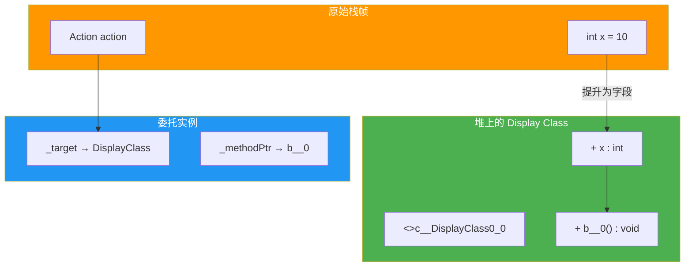
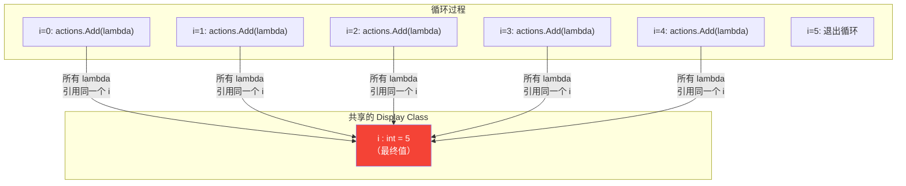
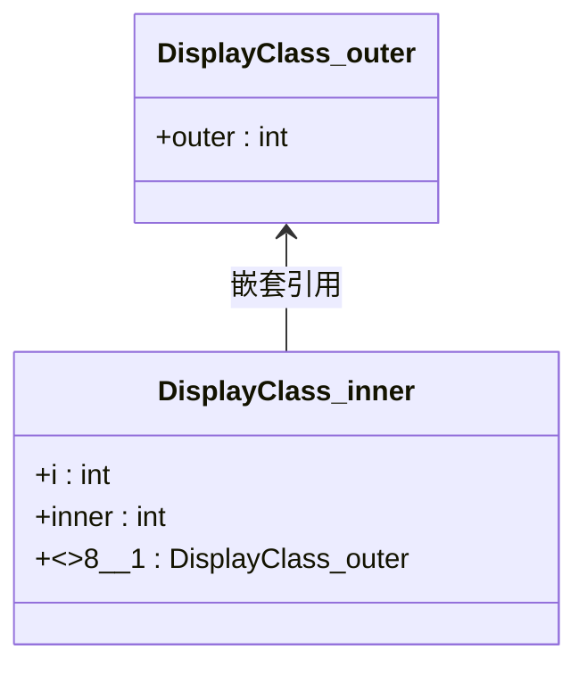
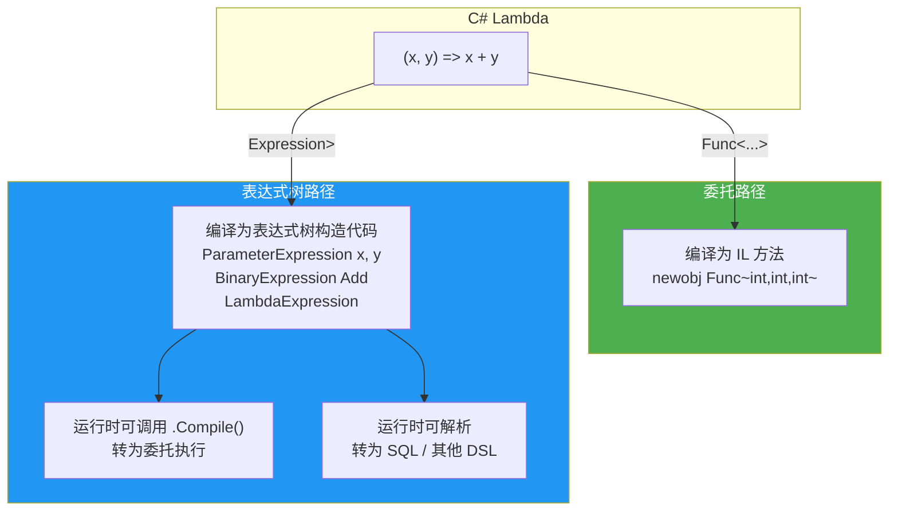
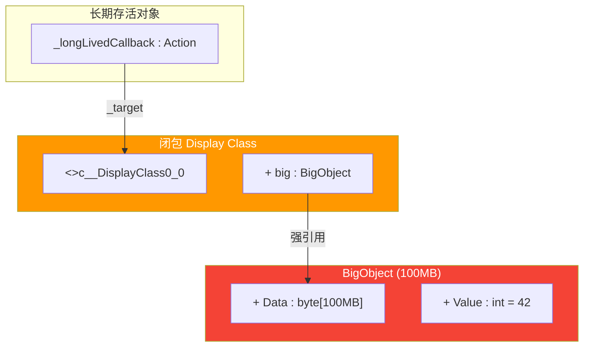
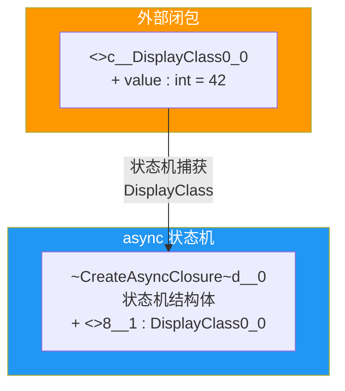

# Lambda 与闭包原理

Lambda 表达式是 C# 函数式编程的核心特性。从 C# 3.0 引入以来，Lambda 已经成为 LINQ、事件处理、异步编程等场景的标配。但 Lambda 的简洁语法背后隐藏着复杂的编译器转换——尤其是当 Lambda 捕获外部变量时，编译器会生成闭包类（Display Class）来存储捕获的变量。本文从 IL 视角深入剖析 Lambda 的编译机制、变量捕获原理、闭包陷阱、表达式树转换等核心主题。

## 1. Lambda 编译为匿名方法/委托

### 1.1 Lambda 的语法

```csharp
// Lambda 表达式
Func<int, int, int> add = (x, y) => x + y;

// 等价的无名方法
Func<int, int, int> add = delegate(int x, int y) { return x + y; };
```

### 1.2 无捕获 Lambda 的编译

当 Lambda 不捕获任何外部变量时，编译器会生成一个私有的静态方法：

```csharp
public class Calculator
{
    public Func<int, int, int> GetAdder()
    {
        return (x, y) => x + y;
    }
}
```

编译器生成的等价代码：

```csharp
public class Calculator
{
    // 编译器生成的静态方法
    [CompilerGenerated]
    private static int <GetAdder>b__0(int x, int y) => x + y;

    public Func<int, int, int> GetAdder()
    {
        return new Func<int, int, int>(<GetAdder>b__0);
    }
}
```

### 1.3 IL 验证

```il
// 静态 Lambda 方法
.method assembly hidebysig static int32
        '<GetAdder>b__0_0'(int32 x, int32 y) cil managed
{
  .custom attribute instance void
      [System.Runtime.CompilerServices]CompilerGeneratedAttribute::.ctor()
      = (01 00 00 00)

  .maxstack  8
  IL_0000:  ldarg.0
  IL_0001:  ldarg.1
  IL_0002:  add
  IL_0003:  ret
}

// GetAdder 方法
.method public hidebysig instance class
        [System.Runtime]System.Func`3<int32, int32, int32>
        GetAdder() cil managed
{
  .maxstack  8
  IL_0000:  ldnull                          // _target = null（静态方法）
  IL_0001:  ldftn      int32 Calculator::'<GetAdder>b__0_0'(int32, int32)
  IL_0007:  newobj     instance void class
              [System.Runtime]System.Func`3<int32, int32, int32>::.ctor(
                  object, native int)
  IL_000c:  ret
}
```

::: tip 无捕获 Lambda 的优化
无捕获的 Lambda 被编译为**静态方法**，委托的 `_target` 为 `null`。这意味着：
1. 无需创建闭包对象，减少 GC 压力
2. 委托实例可被缓存（C# 11+ 编译器会自动缓存无捕获 Lambda）
3. 性能接近直接方法调用
:::

## 2. 闭包生成 Display Class

### 2.1 变量捕获的本质

当 Lambda 捕获外部变量时，编译器必须确保变量的生命周期与委托一致。为此，编译器将捕获的变量从栈提升到堆——创建一个闭包类（Display Class）：

```csharp
public class Example
{
    public Func<int> CreateCounter()
    {
        int count = 0;                       // 局部变量
        return () => ++count;                // Lambda 捕获 count
    }
}
```

### 2.2 编译器生成的 Display Class

```il
.class auto ansi sealed nested private beforefieldinit
       '<>c__DisplayClass0_0'
       extends [System.Runtime]System.Object
{
  // 捕获的变量成为 Display Class 的字段
  .field public int32 'count'

  // Lambda 方法成为 Display Class 的实例方法
  .method public hidebysig instance int32
          '<CreateCounter>b__0'() cil managed
  {
    .maxstack  8
    IL_0000:  ldarg.0
    IL_0001:  ldfld      int32 '<>c__DisplayClass0_0'::'count'
    IL_0006:  ldc.i4.1
    IL_0007:  add
    IL_0008:  dup
    IL_0009:  stloc.0
    IL_000a:  ldarg.0
    IL_000b:  stfld      int32 '<>c__DisplayClass0_0'::'count'
    IL_0010:  ldloc.0
    IL_0011:  ret
  }

  .method public hidebysig specialname rtspecialname
          instance void .ctor() cil managed
  {
    .maxstack  8
    IL_0000:  ldarg.0
    IL_0001:  call       instance void [System.Runtime]System.Object::.ctor()
    IL_0006:  ret
  }
}
```

### 2.3 Display Class Mermaid 类图

```mermaid
classDiagram
    class Example {
        +CreateCounter() Func~int~
    }

    class DisplayClass_0 {
        +count : int
        +b__0() int
    }

    class Func_int {
        +_target : object → DisplayClass_0
        +_methodPtr : IntPtr → b__0
        +Invoke() int
    }

    Example --> DisplayClass_0 : 创建实例
    DisplayClass_0 --> Func_int : 构造委托
    Note for DisplayClass_0 "捕获的变量成为字段<br/>Lambda 成为实例方法"
```

### 2.4 CreateCounter 方法的 IL

```il
.method public hidebysig instance class
        [System.Runtime]System.Func`1<int32>
        CreateCounter() cil managed
{
  .maxstack  3
  .locals init (
    [0] class Example/'<>c__DisplayClass0_0' 'CS$<>8__locals0'
  )

  // 创建 Display Class 实例
  IL_0000:  newobj     instance void Example/'<>c__DisplayClass0_0'::.ctor()
  IL_0005:  stloc.0

  // 初始化捕获的变量
  IL_0006:  ldloc.0
  IL_0007:  ldc.i4.0
  IL_0008:  stfld      int32 Example/'<>c__DisplayClass0_0'::'count'

  // 创建委托
  IL_000d:  ldloc.0                          // _target = DisplayClass 实例
  IL_000e:  ldftn      instance int32
              Example/'<>c__DisplayClass0_0'::'<CreateCounter>b__0'()
  IL_0014:  newobj     instance void class
              [System.Runtime]System.Func`1<int32>::.ctor(object, native int)
  IL_0019:  ret
}
```

::: important 变量从栈到堆的提升
局部变量 `count` 原本在栈上分配，但由于 Lambda 捕获了它，编译器将其提升到 Display Class 的字段中——即堆上。这是闭包的核心机制：
1. 原始方法中的 `count` 引用被替换为 `DisplayClass.count` 字段访问
2. Lambda 通过 `this`（即 Display Class 实例）访问捕获的变量
3. 变量的生命周期与 Display Class 实例绑定，而非方法调用栈
:::

## 3. 变量捕获机制

### 3.1 引用捕获 vs 值捕获

C# Lambda **总是**通过引用捕获变量——捕获的是变量本身，而非变量的值：

```csharp
int x = 10;
Action action = () => Console.WriteLine(x);

x = 20;
action();  // 输出 20，不是 10!
```

因为 `x` 被捕获到 Display Class 的字段中，Lambda 和外部代码访问的是**同一个字段**。

### 3.2 引用捕获的 IL

```csharp
public void CaptureExample()
{
    int x = 10;
    Action action = () => Console.WriteLine(x);
    x = 20;
    action();
}
```

```il
.method public hidebysig instance void CaptureExample() cil managed
{
  .maxstack  2
  .locals init (
    [0] class Example/'<>c__DisplayClass1_0' 'CS$<>8__locals0'
  )

  // 创建 Display Class
  IL_0000:  newobj     instance void Example/'<>c__DisplayClass1_0'::.ctor()
  IL_0005:  stloc.0

  // x = 10 → DisplayClass.x = 10
  IL_0006:  ldloc.0
  IL_0007:  ldc.i4.s   10
  IL_0009:  stfld      int32 Example/'<>c__DisplayClass1_0'::x

  // 创建委托
  IL_000e:  ldloc.0
  IL_000f:  ldftn      instance void Example/'<>c__DisplayClass1_0'::'<CaptureExample>b__0'()
  IL_0015:  newobj     instance void [System.Runtime]System.Action::.ctor(object, native int)

  // x = 20 → DisplayClass.x = 20
  IL_001a:  ldloc.0
  IL_001b:  ldc.i4.s   20
  IL_001d:  stfld      int32 Example/'<>c__DisplayClass1_0'::x

  // action()
  IL_0022:  callvirt   instance void [System.Runtime]System.Action::Invoke()
  IL_0027:  ret
}
```

### 3.3 捕获 this

```csharp
public class Example
{
    private int _value = 42;

    public Action CaptureThis()
    {
        return () => Console.WriteLine(_value);  // 隐式捕获 this
    }
}
```

当 Lambda 访问实例成员时，它捕获的是 `this` 引用，而非成员的副本：

```il
.class auto ansi sealed nested private beforefieldinit
       '<>c__DisplayClass0_0'
       extends [System.Runtime]System.Object
{
  .field public class Example '<>4__this'    // 捕获的 this

  .method public hidebysig instance void '<CaptureThis>b__0'() cil managed
  {
    .maxstack  8
    IL_0000:  ldarg.0
    IL_0001:  ldfld      class Example '<>c__DisplayClass0_0'::'<>4__this'
    IL_0006:  ldfld      int32 Example::_value
    IL_000b:  call       void [System.Console]System.Console::WriteLine(int32)
    IL_0010:  ret
  }
}
```

::: warning 捕获 this 的风险
捕获 `this` 会阻止整个对象被 GC 回收。如果对象很大且委托生命周期很长，可能导致严重的内存泄漏。解决方法：

1. 在捕获前将需要的值复制到局部变量
2. 使用弱引用模式

```csharp
// 不好的做法：捕获整个 this
Action action = () => Console.WriteLine(_value);

// 好的做法：只捕获需要的值
int value = _value;
Action action = () => Console.WriteLine(value);
```
:::

### 3.4 捕获变量 Mermaid 图



## 4. 循环变量闭包陷阱

### 4.1 经典陷阱

```csharp
var actions = new List<Action>();

for (int i = 0; i < 5; i++)
{
    actions.Add(() => Console.WriteLine(i));
}

foreach (var action in actions)
{
    action();
}

// 输出:
// 5
// 5
// 5
// 5
// 5
// 而不是 0 1 2 3 4!
```

### 4.2 陷阱原因

所有 Lambda 共享同一个 `i` 变量（同一个 Display Class 实例），循环结束时 `i = 5`：



### 4.3 修复方法：在循环内创建局部变量

```csharp
var actions = new List<Action>();

for (int i = 0; i < 5; i++)
{
    int copy = i;  // 每次迭代创建新的局部变量
    actions.Add(() => Console.WriteLine(copy));
}

foreach (var action in actions)
{
    action();
}

// 输出:
// 0
// 1
// 2
// 3
// 4
```

### 4.4 C# 5.0 的 foreach 修复

C# 5.0 修改了 `foreach` 的闭包行为——`foreach` 的迭代变量在每次迭代中都是新的实例：

```csharp
var actions = new List<Action>();

foreach (var item in new[] { 1, 2, 3, 4, 5 })
{
    actions.Add(() => Console.WriteLine(item));
}

foreach (var action in actions)
{
    action();
}

// C# 5.0+ 输出:
// 1
// 2
// 3
// 4
// 5

// C# 4.0 输出（bug 行为）:
// 5
// 5
// 5
// 5
// 5
```

::: important for vs foreach 的闭包差异
- **`for` 循环**：循环变量在整个循环中是同一个，C# 5.0 **没有**修复此行为
- **`foreach` 循环**：C# 5.0 确保每次迭代使用新的迭代变量实例

这是 C# 语言规范的**Breaking Change**，仅影响 `foreach`，不影响 `for`。
:::

### 4.5 修复后的 IL

```il
// for 循环中的修复
// int copy = i;  → 每次迭代创建新的 Display Class
IL_0000:  newobj     instance void '<>c__DisplayClass0_0'::.ctor()
IL_0005:  stloc.1
IL_0006:  ldloc.1
IL_0007:  ldloc.0           // 加载 i
IL_0008:  stfld      int32 '<>c__DisplayClass0_0'::copy
// 每次迭代都会 new 一个 Display Class 实例
```

### 4.6 多层循环的 Display Class

```csharp
public void NestedCapture()
{
    int outer = 1;
    for (int i = 0; i < 3; i++)
    {
        int inner = i * 10;
        Action action = () => Console.WriteLine($"{outer}, {i}, {inner}");
        action();
    }
}
```

编译器可能生成**嵌套**的 Display Class——外层捕获 `outer`，内层捕获 `i` 和 `inner`：



## 5. 静态 Lambda 优化

### 5.1 C# 9 静态 Lambda

C# 9.0 引入了 `static` 修饰的 Lambda，禁止捕获任何局部变量或 `this`：

```csharp
// 静态 Lambda：不能捕获局部变量或 this
Func<int, int, int> add = static (x, y) => x + y;

// 错误：static Lambda 不能捕获
// int factor = 2;
// Func<int, int> multiply = static x => x * factor;  // 编译错误
```

### 5.2 静态 Lambda 的优势

1. **无闭包分配**：不会生成 Display Class，减少 GC 压力
2. **意图明确**：明确声明 Lambda 不捕获外部状态
3. **性能优化**：委托的 `_target` 为 `null`，直接调用静态方法

```il
// 静态 Lambda
.method assembly hidebysig static int32
        '<Main>b__0_0'(int32 x, int32 y) cil managed
{
  .maxstack  8
  IL_0000:  ldarg.0
  IL_0001:  ldarg.1
  IL_0002:  add
  IL_0003:  ret
}

// 委托构造
IL_0000:  ldnull          // _target = null
IL_0001:  ldftn      int32 Program::'<Main>b__0_0'(int32, int32)
IL_0007:  newobj     instance void class
            [System.Runtime]System.Func`3<int32, int32, int32>::.ctor(
                object, native int)
```

### 5.3 静态 Lambda 的使用场景

```csharp
// LINQ 中使用静态 Lambda
var result = numbers.Select(static x => x * 2);

// 事件处理中使用静态 Lambda
button.Click += static (sender, e) => Console.WriteLine("Clicked");

// 线程安全：不捕获状态，无竞态条件
Task.Run(static () => ComputeExpensiveResult());
```

## 6. 表达式树 vs IL Lambda

### 6.1 两种 Lambda 编译目标

C# Lambda 有两种编译目标：

1. **委托（Delegate）**：编译为 IL 方法 + 委托实例
2. **表达式树（Expression Tree）**：编译为表达式树对象

```csharp
// 编译为委托
Func<int, int, int> addAsDelegate = (x, y) => x + y;

// 编译为表达式树
Expression<Func<int, int, int>> addAsExpression = (x, y) => x + y;
```

### 6.2 委托 Lambda 的 IL

```il
// Func<int, int, int> add = (x, y) => x + y;
IL_0000:  ldnull
IL_0001:  ldftn      int32 Program::'<Main>b__0_0'(int32, int32)
IL_0007:  newobj     instance void class
            [System.Runtime]System.Func`3<int32, int32, int32>::.ctor(
                object, native int)
```

### 6.3 表达式树 Lambda 的 IL

```il
// Expression<Func<int, int, int>> add = (x, y) => x + y;
IL_0000:  ldtoken    method int32 Program::'<Main>b__0'()
// ... 一系列表达式树构造调用 ...
IL_0001:  call       class [System.Linq.Expressions]System.Linq.Expressions.ParameterExpression
            [System.Linq.Expressions]System.Linq.Expressions.Expression::Parameter(
                class [System.Runtime]System.Type, string)
// 构建 Lambda 表达式树
IL_0050:  call       class [System.Linq.Expressions]System.Linq.Expressions.Expression`1<!!0>
            [System.Linq.Expressions]System.Linq.Expressions.Expression::Lambda<...>(...)
```

### 6.4 表达式树与委托对比

| 特征 | 委托 Lambda | 表达式树 Lambda |
|------|-------------|-----------------|
| 编译目标 | IL 方法 | 表达式树对象 |
| 运行时 | 直接执行 | 可编译为委托或解析 |
| 适用场景 | 执行逻辑 | 查询提供者（EF Core 等） |
| 代码限制 | 无 | 不能包含语句块（C# 3） |
| 捕获变量 | 支持 | 支持 |
| 性能 | 快 | 慢（需解析/编译） |

### 6.5 Lambda 转换为 Expression 的编译过程



### 6.6 表达式树在 EF Core 中的应用

```csharp
// EF Core 使用表达式树将 Lambda 翻译为 SQL
var users = dbContext.Users
    .Where(u => u.Age > 18)     // Expression<Func<User, bool>>
    .Select(u => u.Name)         // Expression<Func<User, string>>
    .ToList();

// 等价 SQL:
// SELECT [u].[Name] FROM [Users] AS [u] WHERE [u].[Age] > 18
```

::: important 表达式树是 LINQ Provider 的基础
`IQueryable&lt;T&gt;` 的 `Where`、`Select` 等方法接收 `Expression<Func<...>>` 参数，这使得 LINQ Provider（如 EF Core）可以在运行时解析表达式树，将 C# 代码翻译为 SQL、Cosmos DB 查询等目标语言。

如果传入 `Func&lt;T, bool&gt;` 而非 `Expression<Func&lt;T, bool&gt;>`，则 LINQ to Objects 会直接在内存中过滤，而不会翻译为 SQL。
:::

## 7. 闭包与内存泄漏

### 7.1 闭包延长对象生命周期

```csharp
public class BigObject
{
    public byte[] Data = new byte[1024 * 1024 * 100];  // 100 MB
    public int Value = 42;
}

public class Example
{
    private Action? _longLivedCallback;

    public void Leak()
    {
        var big = new BigObject();
        _longLivedCallback = () => Console.WriteLine(big.Value);
        // big 的 100MB 数据将一直存活，直到 _longLivedCallback 被设为 null
    }
}
```

### 7.2 内存泄漏 Mermaid 图



### 7.3 避免闭包内存泄漏的策略

1. **只捕获需要的值**：

```csharp
// 不好：捕获整个 BigObject
Action callback = () => Console.WriteLine(big.Value);

// 好：只捕获需要的值
int value = big.Value;
Action callback = () => Console.WriteLine(value);
```

2. **使用弱引用**：

```csharp
var weakRef = new WeakReference(big);
Action callback = () =>
{
    if (weakRef.Target is BigObject obj)
        Console.WriteLine(obj.Value);
};
```

3. **及时清除委托**：

```csharp
_longLivedCallback = null;  // 允许闭包和捕获的对象被 GC
```

4. **使用 IDisposable 模式**：

```csharp
public class EventSubscriber : IDisposable
{
    private readonly Button _button;

    public EventSubscriber(Button button)
    {
        _button = button;
        _button.Clicked += OnClicked;  // 订阅
    }

    private void OnClicked(object? sender, EventArgs e) { }

    public void Dispose()
    {
        _button.Clicked -= OnClicked;  // 取消订阅
    }
}
```

## 8. async 中的闭包

### 8.1 async Lambda 的闭包

`async` 方法中的 Lambda 同样会生成闭包，但情况更复杂——状态机也需要捕获变量：

```csharp
public async Task AsyncClosure()
{
    string url = "https://example.com";
    string result = await FetchAsync(url);
    Console.WriteLine(result);
}
```

### 8.2 async 状态机中的闭包

编译器为 `async` 方法生成的状态机本身就是一个闭包类，它捕获了所有局部变量：

```csharp
// 编译器生成的等价代码（简化）
[StructLayout(LayoutKind.Auto)]
[CompilerGenerated]
private struct <AsyncClosure>d__0 : IAsyncStateMachine
{
    public int <>1__state;
    public AsyncTaskMethodBuilder <>t__builder;
    public string url;           // 捕获的变量
    public string result;        // 捕获的变量
    private TaskAwaiter<string> <>u__1;

    void IAsyncStateMachine.MoveNext()
    {
        // 状态机逻辑...
    }
}
```

### 8.3 async Lambda 的双重闭包

当一个 Lambda 既是闭包又是 async 时，可能产生**双重闭包**：

```csharp
public Func<Task> CreateAsyncClosure()
{
    int value = 42;
    return async () =>
    {
        await Task.Delay(100);
        Console.WriteLine(value);  // 捕获 value
    };
}
```



::: warning async Lambda 的额外开销
async Lambda 的闭包开销包括：
1. **Display Class**：捕获外部变量
2. **状态机结构体**：async 方法的状态管理
3. **Task 对象**：异步操作的返回值
4. **AWaiter 对象**：等待操作的状态

在热路径中，应考虑使用 `ValueTask` 或避免不必要的 async Lambda。
:::

## 9. Lambda 性能对比

### 9.1 各种 Lambda 的性能层级

```csharp
using BenchmarkDotNet.Attributes;

[MemoryDiagnoser]
public class LambdaBenchmark
{
    private readonly int _factor = 2;

    [Benchmark(Baseline = true)]
    public int DirectCall() => Multiply(21);

    [Benchmark]
    public int StaticLambda()
    {
        Func<int, int> fn = static x => x * 2;
        return fn(21);
    }

    [Benchmark]
    public int InstanceLambda()
    {
        Func<int, int> fn = x => x * _factor;
        return fn(21);
    }

    [Benchmark]
    public int ClosureLambda()
    {
        int factor = 2;
        Func<int, int> fn = x => x * factor;
        return fn(21);
    }

    private static int Multiply(int x) => x * 2;
}
```

典型结果（.NET 8, x64）：

| 方法 | 平均时间 | 分配 | 评价 |
|------|----------|------|------|
| DirectCall | ~0.3 ns | 0 B | 最快，JIT 内联 |
| StaticLambda | ~3.5 ns | 0 B | 缓存后无分配 |
| InstanceLambda | ~3.5 ns | 0 B | 捕获 this，但缓存 |
| ClosureLambda | ~4.0 ns | 40 B | Display Class 分配 |

### 9.2 Lambda 缓存机制

C# 编译器会缓存无捕获的 Lambda 委托实例：

```csharp
// 多次调用不会重复创建委托
public void MultipleCalls()
{
    Call(x => x * 2);  // 第一次：创建委托
    Call(x => x * 2);  // 后续：使用缓存的委托
}

// 编译器生成的等价代码
[CompilerGenerated]
private static Func<int, int> <>9__0_0;  // 缓存字段

public void MultipleCalls()
{
    if (<>9__0_0 == null)
        <>9__0_0 = x => x * 2;
    Call(<>9__0_0);
}
```

### 9.3 性能优化策略

::: tip Lambda 性能优化清单
1. **优先使用 `static` Lambda**：明确不捕获，帮助编译器优化
2. **缓存委托实例**：避免在循环中创建委托
3. **使用方法组代替 Lambda**：`list.Where(Filter)` 比 `list.Where(x => Filter(x))` 更高效
4. **避免不必要的闭包**：只捕获需要的值
5. **热路径避免表达式树**：`Expression<Func&lt;T&gt;>` 比 `Func&lt;T&gt;` 慢很多
:::

## 10. Lambda 与方法组转换

### 10.1 方法组转换

```csharp
// Lambda 写法
Func<string, bool> lambda = s => string.IsNullOrEmpty(s);

// 方法组转换写法
Func<string, bool> methodGroup = string.IsNullOrEmpty;
```

### 10.2 方法组转换的 IL

```il
// Lambda
IL_0000:  ldnull
IL_0001:  ldftn      bool Program::'<Main>b__0'(string)
IL_0007:  newobj     instance void class
            [System.Runtime]System.Func`2<string, bool>::.ctor(object, native int)

// 方法组
IL_0000:  ldnull
IL_0001:  ldftn      bool [System.Runtime]System.String::IsNullOrEmpty(string)
IL_0007:  newobj     instance void class
            [System.Runtime]System.Func`2<string, bool>::.ctor(object, native int)
```

方法组转换直接引用原始方法，无需编译器生成中间方法。

### 10.3 方法组转换的歧义

```csharp
// 可能的歧义
static void Process(Action<int> action) { }
static void Process(Func<int, int> func) { }

// Process(x => x);  // 无歧义：Lambda 可推断类型
// Process(Console.WriteLine);  // 歧义：方法组可转换为多个委托类型
```

## 11. Lambda 在 .NET 8+ 中的改进

### 11.1 默认 Lambda 参数

C# 12 引入了 Lambda 的默认参数：

```csharp
var add = (int x, int y = 1) => x + y;

Console.WriteLine(add(5));     // 6
Console.WriteLine(add(5, 3));  // 8
```

### 11.2 Lambda 的 params 集合

```csharp
var sum = (params int[] values) => values.Sum();

Console.WriteLine(sum(1, 2, 3));  // 6
```

### 11.3 Lambda 特性

C# 10+ 允许在 Lambda 上应用特性：

```csharp
var lambda = [MethodImpl(MethodImplOptions.AggressiveInlining)]
    (int x) => x * 2;

// ASP.NET Core 中的示例
app.MapGet("/hello", [Authorize] () => "Hello World");
```

## 12. Lambda 的反射

### 12.1 获取 Lambda 的方法信息

```csharp
Func<int, int, int> add = (x, y) => x + y;

Console.WriteLine(add.Method.Name);      // <Main>b__0
Console.WriteLine(add.Method.DeclaringType?.Name);  // Program
Console.WriteLine(add.Method.IsStatic);   // True (无捕获)
```

### 12.2 表达式树解析

```csharp
Expression<Func<int, int, int>> expr = (x, y) => x + y;

// 解析表达式树
Console.WriteLine(expr.NodeType);        // Lambda
Console.WriteLine(expr.Body.NodeType);   // Add
Console.WriteLine(expr.Parameters[0].Name);  // x
Console.WriteLine(expr.Parameters[1].Name);  // y

// 编译为委托执行
var compiled = expr.Compile();
Console.WriteLine(compiled(3, 4));  // 7
```

## 13. 小结

Lambda 和闭包是 C# 函数式编程的基石，理解其底层机制对于编写高效、安全的代码至关重要：

| 主题 | 关键点 |
|------|--------|
| Lambda 编译 | 无捕获 → 静态方法；有捕获 → Display Class 实例方法 |
| Display Class | `<>c__DisplayClass` 嵌套类，捕获变量成为字段 |
| 变量捕获 | 总是引用捕获，不是值捕获 |
| 循环变量陷阱 | `for` 共享变量，`foreach`（C# 5+）每次迭代新变量 |
| 静态 Lambda | C# 9 `static` 修饰，禁止捕获，无闭包分配 |
| 表达式树 | `Expression<Func<>>` 编译为表达式树对象，非 IL 方法 |
| 内存泄漏 | 闭包延长对象生命周期，应只捕获需要的值 |
| async 闭包 | 双重闭包（Display Class + 状态机），注意额外开销 |
| 性能 | 直接调用 > 静态 Lambda > 闭包 Lambda > 表达式树 |