# 接口映射与多态实现

接口（Interface）是 C# 实现多态的核心机制。与类继承的单继承限制不同，接口允许一个类型实现多个契约。但接口的多态实现远比表面复杂——CLR 需要在运行时将接口方法映射到类中的实际实现，这个过程称为接口映射（Interface Mapping）。本文从 CLR 底层剖析接口映射表、显式接口实现的 IL 真相、默认接口方法的运行时机制、钻石问题等核心主题。

## 1. 接口方法映射表（InterfaceMap）

### 1.1 接口映射的概念

当一个类实现接口时，CLR 需要建立接口方法到类中实现方法的映射关系。这个映射存储在 MethodTable 的接口映射区域。

```csharp
public interface IAnimal
{
    void Speak();
    void Move();
}

public class Dog : IAnimal
{
    public void Speak() => Console.WriteLine("Woof");
    public void Move() => Console.WriteLine("Run");
}
```

### 1.2 反射获取 InterfaceMap

```csharp
var map = typeof(Dog).GetInterfaceMap(typeof(IAnimal));

Console.WriteLine("接口方法 → 实现方法");
for (int i = 0; i < map.InterfaceMethods.Length; i++)
{
    Console.WriteLine($"  {map.InterfaceMethods[i].Name} → {map.TargetMethods[i].Name}");
}

// 输出:
// 接口方法 → 实现方法
//   Speak → Speak
//   Move → Move
```

### 1.3 InterfaceMap 结构 Mermaid 图

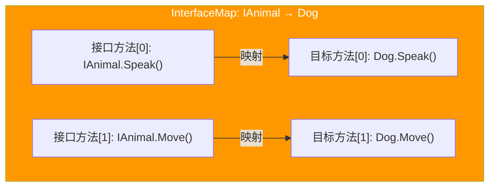

### 1.4 MethodTable 中的接口映射

CLR 的 MethodTable 内部存储接口映射的方式：

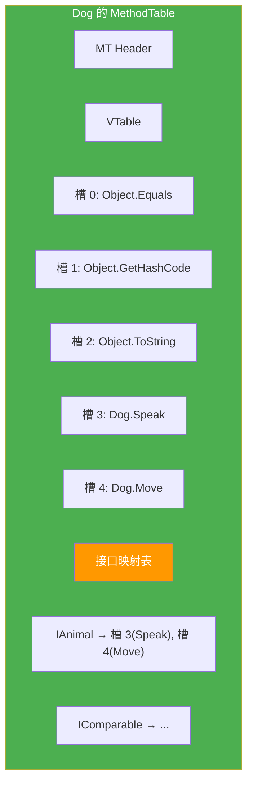

::: important 接口映射表 vs VTable
- **VTable**：按槽位索引直接访问，O(1) 复杂度
- **接口映射表**：需要先查找接口对应的映射条目，再定位到 VTable 槽位

接口方法调用的开销比普通虚方法调用略高，因为需要额外的映射查找步骤。
:::

## 2. 显式接口实现 IL

### 2.1 显式接口实现语法

```csharp
public interface IReader
{
    string Read();
}

public class ConsoleReader : IReader
{
    // 显式接口实现
    string IReader.Read() => Console.ReadLine() ?? "";

    // 公开方法（与接口方法分离）
    public string ReadLine() => Console.ReadLine() ?? "";
}
```

### 2.2 显式实现的 IL 特征

```il
// 显式接口实现的 IL
.method private hidebysig newslot final virtual
        instance string IReader.Read() cil managed
{
  .maxstack  8
  IL_0000:  call       string [System.Console]System.Console::ReadLine()
  IL_0005:  dup
  IL_0006:  brtrue.s   IL_000f
  IL_0008:  pop
  IL_0009:  ldstr      ""
  IL_000e:  ret
  IL_000f:  ret
}
```

显式接口实现的 IL 关键标志：

| 标志 | 含义 |
|------|------|
| `private` | 在类的公开 API 中不可见 |
| `newslot` | 在 VTable 中分配新槽位 |
| `final` | 不可在派生类中重写 |
| `virtual` | 满足接口映射的虚方法要求 |
| `hidebysig` | 按签名隐藏基类方法 |

::: important private + virtual 的组合
这是 C# 中唯一允许 `private virtual` 的场景。显式接口实现的方法在 IL 中标记为 `private virtual final`，看似矛盾但实际上是合理的：
- `private`：不允许从类的外部直接调用
- `virtual`：必须满足接口映射的要求
- `final`：不可再被重写
- 只有通过接口引用调用时，才能访问此方法
:::

### 2.3 显式接口实现的调用

```csharp
var reader = new ConsoleReader();

// 通过类引用调用：只能访问公开方法
reader.ReadLine();          // OK
// reader.Read();           // 编译错误！显式实现不可见

// 通过接口引用调用：访问显式实现
IReader ireader = reader;
ireader.Read();             // OK，调用显式实现
```

### 2.4 显式实现的接口映射

```csharp
var map = typeof(ConsoleReader).GetInterfaceMap(typeof(IReader));

Console.WriteLine("接口方法 → 实现方法");
for (int i = 0; i < map.InterfaceMethods.Length; i++)
{
    Console.WriteLine($"  {map.InterfaceMethods[i].Name} → " +
        $"{map.TargetMethods[i].Name} (IsPrivate: {map.TargetMethods[i].IsPrivate})");
}

// 输出:
// 接口方法 → 实现方法
//   Read → IReader.Read (IsPrivate: True)
```

### 2.5 显式 vs 隐式实现 Mermaid 图

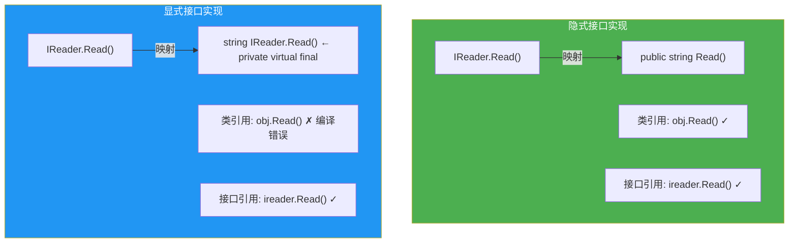

## 3. 接口虚方法调度

### 3.1 callvirt 通过接口引用的流程

当通过接口引用调用方法时，CLR 执行以下步骤：

```csharp
IAnimal animal = new Dog();
animal.Speak();  // 接口虚方法调度
```

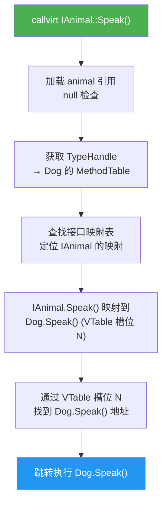

### 3.2 接口调度的性能特征

接口方法调用的开销来自：

1. **null 检查**：`callvirt` 自带的空引用检查
2. **接口映射查找**：在 MethodTable 的接口映射区域搜索
3. **VTable 槽位查找**：映射找到 VTable 槽位后，再查找具体方法

```
接口调用开销 ≈ 普通虚方法调用 + 接口映射查找
```

### 3.3 接口映射缓存

CLR 通过接口调度缓存（Interface Dispatch Cache）优化重复的接口方法调用：

1. **首次调用**：完整的接口映射查找 + VTable 定位
2. **缓存结果**：将 [类型, 接口方法] → [目标方法地址] 的映射缓存
3. **后续调用**：先查缓存，命中则跳过映射查找

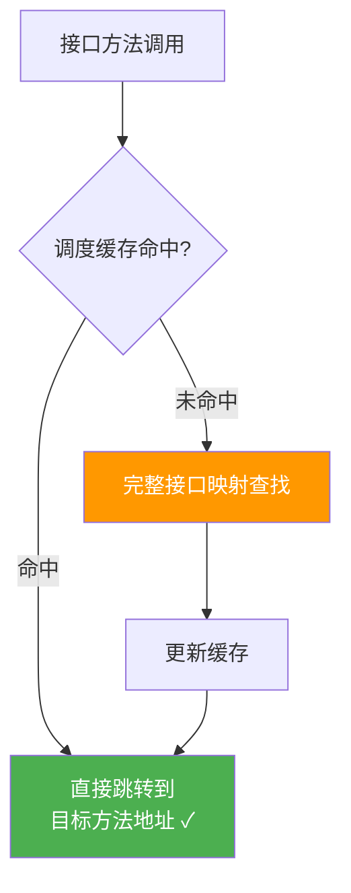

## 4. 默认接口方法（.NET Core 3.0+ CLR 实现）

### 4.1 默认接口方法语法

C# 8.0 引入了默认接口方法（Default Interface Methods, DIM），允许接口提供方法实现：

```csharp
public interface ILogger
{
    void Log(string message);

    // 默认实现
    void LogWarning(string message) => Log($"[WARN] {message}");
    void LogError(string message) => Log($"[ERROR] {message}");
}

public class ConsoleLogger : ILogger
{
    public void Log(string message) => Console.WriteLine(message);
    // 不需要实现 LogWarning 和 LogError
}

// 使用
ILogger logger = new ConsoleLogger();
logger.LogWarning("Something happened");  // 调用默认实现
```

### 4.2 默认接口方法的 IL

```il
// 接口中的默认方法实现
.method public hidebysig newslot virtual
        instance void LogWarning(string message) cil managed
{
  .maxstack  8
  IL_0000:  ldarg.0
  IL_0001:  ldstr      "[WARN] "
  IL_0006:  ldarg.1
  IL_000b:  call       string [System.Runtime]System.String::Concat(string, string)
  IL_0010:  callvirt   instance void ILogger::Log(string)
  IL_0015:  ret
}
```

注意：默认接口方法在 IL 中是 `virtual` 方法（不是 `abstract`），有方法体。

### 4.3 默认接口方法的调度

```csharp
ILogger logger = new ConsoleLogger();
logger.LogWarning("test");  // 调用接口的默认实现
```

CLR 调度默认接口方法的流程：

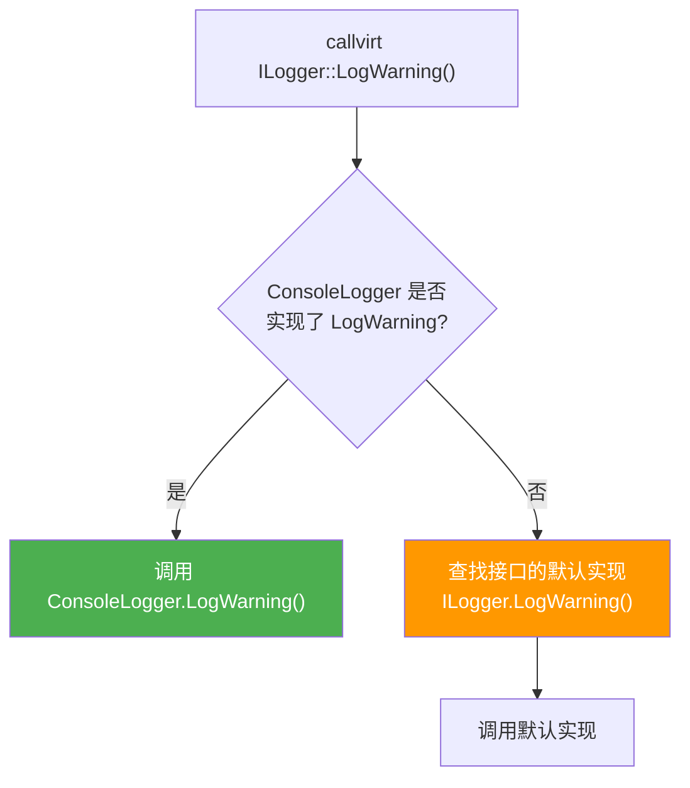

### 4.4 默认接口方法与类引用

```csharp
ConsoleLogger logger = new ConsoleLogger();
// logger.LogWarning("test");  // 编译错误！
// 类引用无法调用默认接口方法
```

::: warning 默认接口方法只能通过接口引用调用
默认接口方法不属于类的成员，只有通过接口引用才能调用。这是设计上的有意为之——确保类不会"意外"继承接口的默认实现，保持类对自身行为的完全控制。
:::

### 4.5 默认接口方法的 CLR 实现 Mermaid 图

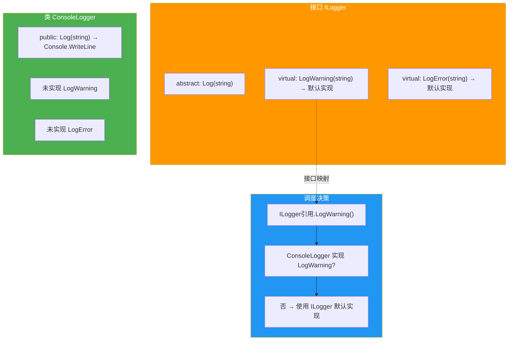

### 4.6 重写默认接口方法

```csharp
public class FileLogger : ILogger
{
    public void Log(string message) => File.AppendAllText("log.txt", message);

    // 提供自己的实现，优先于接口的默认实现
    public void LogWarning(string message) => Log($"⚠️ {message}");
}

ILogger logger = new FileLogger();
logger.LogWarning("test");  // 调用 FileLogger.LogWarning()
```

## 5. 接口 vs 抽象类性能对比

### 5.1 性能差异

```csharp
using BenchmarkDotNet.Attributes;

[MemoryDiagnoser]
public class InterfaceVsAbstractBenchmark
{
    private readonly IAnimal _interfaceAnimal = new Dog();
    private readonly AnimalBase _abstractAnimal = new DogImpl();

    [Benchmark(Baseline = true)]
    public void AbstractClassCall() => _abstractAnimal.Speak();

    [Benchmark]
    public void InterfaceCall() => _interfaceAnimal.Speak();
}

public abstract class AnimalBase
{
    public abstract void Speak();
}

public class DogImpl : AnimalBase
{
    public override void Speak() { }
}

public interface IAnimal
{
    void Speak();
}

public class Dog : IAnimal
{
    public void Speak() { }
}
```

典型结果（.NET 8, x64）：

| 方法 | 平均时间 | 评价 |
|------|----------|------|
| AbstractClassCall | ~1.5 ns | VTable 直接查找 |
| InterfaceCall | ~2.0 ns | 接口映射查找 + VTable |

### 5.2 性能差异来源

| 因素 | 抽象类 | 接口 |
|------|--------|------|
| 调度方式 | VTable 直接索引 | 接口映射查找 + VTable |
| 映射缓存 | 不需要 | 需要 |
| 多继承 | 不支持 | 支持 |
| 值类型 | 装箱 | 装箱（无约束时） |
| JIT 优化 | 更易内联 | 较难内联 |

::: tip 实际影响
接口与抽象类的性能差异通常很小（1-2 ns），在绝大多数场景下不构成选择因素。选择接口还是抽象类应基于设计考量：
- **接口**：定义能力/契约，允许多实现
- **抽象类**：提供共有实现，允许代码复用
:::

## 6. 接口映射缓存

### 6.1 缓存的工作原理

CLR 为接口调度维护了多级缓存，减少映射查找的开销：

1. **Inline Cache**：存储最近一次调用的类型-方法映射
2. **Polymorphic Inline Cache**：存储多个类型的映射（多态场景）
3. **Full Lookup**：缓存未命中时，执行完整的接口映射查找

### 6.2 缓存效果

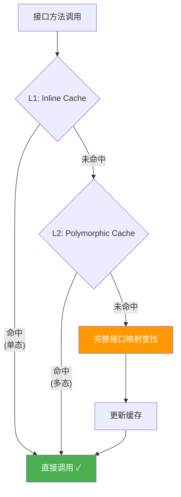

### 6.3 缓存命中的条件

- **单态调用**：接口引用始终指向同一实际类型 → Inline Cache 命中率极高
- **多态调用**：接口引用指向少量不同类型 → Polymorphic Cache 有效
- **多态爆炸**：接口引用指向大量不同类型 → 缓存失效，退化为完整查找

## 7. 接口多继承钻石问题

### 7.1 钻石继承的定义

当一个类实现的两个接口有相同签名的成员时，就产生了钻石问题：

```csharp
public interface IReadable
{
    string Name { get; }
}

public interface IWritable
{
    string Name { get; }
}

public class Document : IReadable, IWritable
{
    // 一个实现同时满足两个接口
    public string Name { get; set; } = "";
}
```

### 7.2 不同接口的相同方法签名

```csharp
public interface IArtist
{
    void Perform();
}

public interface IWorker
{
    void Perform();
}

public class Person : IArtist, IWorker
{
    // 隐式实现同时满足两个接口
    public void Perform() => Console.WriteLine("Performing...");

    // 或显式实现分别处理
    void IArtist.Perform() => Console.WriteLine("Acting...");
    void IWorker.Perform() => Console.WriteLine("Working...");
}
```

### 7.3 钻石问题 Mermaid 图

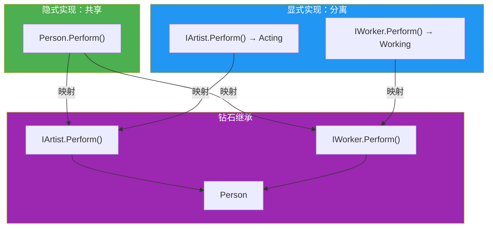

### 7.4 默认接口方法的钻石问题

当两个接口提供相同的默认方法实现时，类**必须**提供自己的实现：

```csharp
public interface IArtist
{
    void Perform() => Console.WriteLine("Acting");
}

public interface IWorker
{
    void Perform() => Console.WriteLine("Working");
}

// 编译错误！必须显式实现 Perform 以解决歧义
public class Person : IArtist, IWorker
{
    // CS8705: 接口成员同时存在于多个接口中
}
```

解决方法：

```csharp
public class Person : IArtist, IWorker
{
    // 提供自己的实现
    public void Perform() => Console.WriteLine("My own performance");

    // 或者显式选择某个接口的实现
    void IArtist.Perform() => Console.WriteLine("Acting");
    void IWorker.Perform() => Console.WriteLine("Working");
}
```

::: warning 默认接口方法钻石问题的强制解决
CLR 不允许默认接口方法的歧义——如果两个接口提供了相同的默认方法，实现类**必须**提供自己的实现或显式选择。这是 C# 设计的有意选择，避免了类似 C++ 中菱形继承的复杂性。
:::

## 8. Reabstraction

### 8.1 重新抽象的概念

Reabstraction 是 C# 8.0 引入的特性，允许派生接口将基接口的默认实现重新声明为抽象的：

```csharp
public interface IBase
{
    void Method() => Console.WriteLine("Base implementation");
}

public interface IDerived : IBase
{
    // 重新抽象：覆盖基接口的默认实现，要求类必须实现
    abstract void Method();
}

public class Implementation : IDerived
{
    // 必须提供实现，不能使用 IBase 的默认实现
    public void Method() => Console.WriteLine("Class implementation");
}
```

### 8.2 Reabstraction 的 IL

```il
// IDerived 中的重新抽象
.method public hidebysig newslot abstract virtual
        instance void Method() cil managed
{
  // 无方法体 — 重新声明为抽象
}
```

### 8.3 Reabstraction 的使用场景

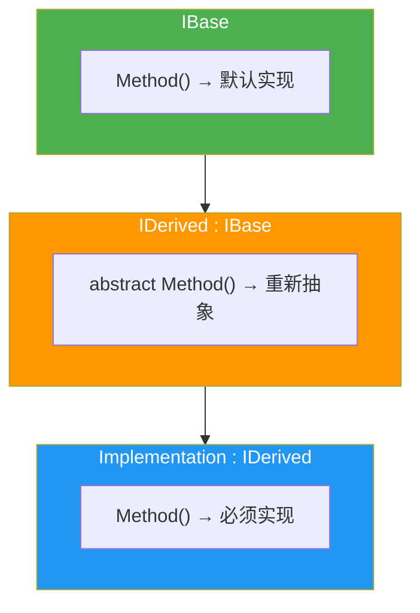

Reabstraction 适用于以下场景：
- 基接口提供了通用默认实现
- 派生接口需要强制实现类提供特定实现
- 中间接口"取消"默认实现的便捷性

## 9. 静态抽象接口成员

### 9.1 静态抽象成员语法

C# 11 引入了静态抽象接口成员，允许接口定义静态方法契约：

```csharp
public interface IAddable<T> where T : IAddable<T>
{
    static abstract T operator +(T left, T right);
}

public struct Vector2D : IAddable<Vector2D>
{
    public double X { get; init; }
    public double Y { get; init; }

    public static Vector2D operator +(Vector2D left, Vector2D right) =>
        new() { X = left.X + right.X, Y = left.Y + right.Y };
}
```

### 9.2 静态抽象成员的泛型使用

```csharp
public static T Sum<T>(IEnumerable<T> values) where T : IAddable<T>
{
    var enumerator = values.GetEnumerator();
    if (!enumerator.MoveNext()) throw new InvalidOperationException();

    T result = enumerator.Current;
    while (enumerator.MoveNext())
    {
        result = result + enumerator.Current;  // 调用静态 operator+
    }
    return result;
}
```

### 9.3 静态抽象成员的 IL

```il
// 接口中的静态抽象成员
// T 是接口的类型参数，使用 !0 引用
.method public hidebysig newslot abstract static
        !0 op_Addition(!0 left, !0 right) cil managed
{
}
```

::: important 静态抽象接口成员的特点
- 使用 `static abstract` 修饰符
- 实现类必须提供 `static` 方法的实现
- 主要用于运算符泛型约束
- .NET 7 的数字类型系统大量使用此特性（`INumber&lt;T&gt;`, `IAdditionOperators&lt;T&gt;` 等）
:::

### 9.4 静态虚拟成员

除了 `static abstract`，C# 11 还支持 `static virtual`——接口可以提供默认的静态方法实现：

```csharp
public interface IDefaultable<T> where T : IDefaultable<T>
{
    static virtual T Default => default!;
}

public class MyType : IDefaultable<MyType>
{
    // 使用接口的默认实现，不需要重写
    // 或者重写：
    public static MyType Default => new MyType { Value = 42 };
    public int Value { get; set; }
}
```

### 9.5 静态抽象成员 Mermaid 图

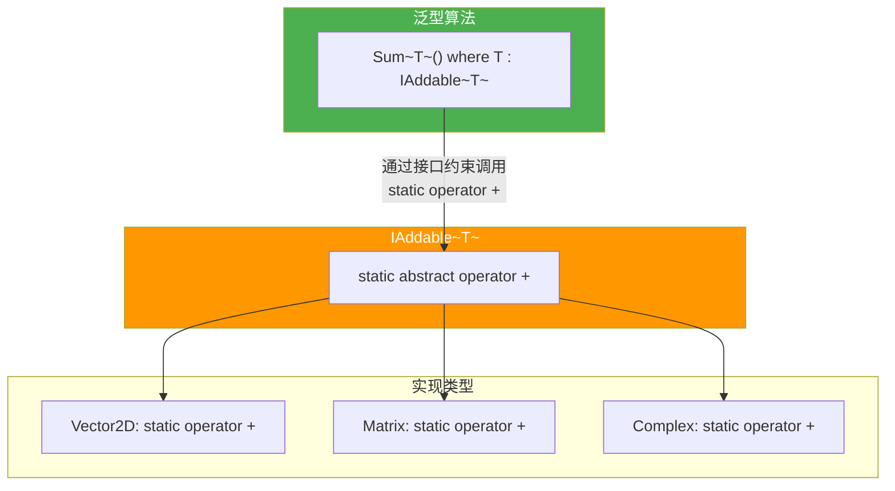

## 10. 接口在值类型中的实现

### 10.1 值类型实现接口的装箱

当值类型通过接口引用使用时，会发生装箱：

```csharp
public struct Point : IComparable<Point>
{
    public int X, Y;

    public int CompareTo(Point other) =>
        (X * X + Y * Y).CompareTo(other.X * other.X + other.Y * other.Y);
}

Point p = new Point { X = 3, Y = 4 };
IComparable<Point> comparable = p;  // 装箱！堆上分配
```

### 10.2 避免装箱的泛型约束

```csharp
// 使用泛型约束避免装箱
public static T Max<T>(T a, T b) where T : IComparable<T>
{
    return a.CompareTo(b) >= 0 ? a : b;
}

Point p1 = new Point { X = 3, Y = 4 };
Point p2 = new Point { X = 1, Y = 1 };
Point max = Max(p1, p2);  // 无装箱！
```

::: tip 泛型约束与接口调用的优化
当使用 `where T : IComparable&lt;T&gt;` 约束时，JIT 编译器可以：
1. 为值类型特化泛型方法
2. 直接调用值类型的方法，无需装箱
3. 甚至可能内联 `CompareTo` 方法

这是泛型约束的核心性能优势——在不牺牲多态性的前提下避免装箱。
:::

### 10.3 装箱 vs 泛型约束 Mermaid 图

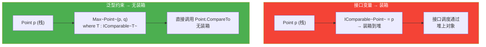

## 11. 接口的多重实现与映射复杂性

### 11.1 实现多个接口

```csharp
public interface IReadable { string Read(); }
public interface IWritable { void Write(string data); }
public interface IConnectable { bool Connect(); }

public class FileStorage : IReadable, IWritable, IConnectable
{
    public string Read() => "data";
    public void Write(string data) { }
    public bool Connect() => true;
}
```

### 11.2 多接口的 MethodTable 结构

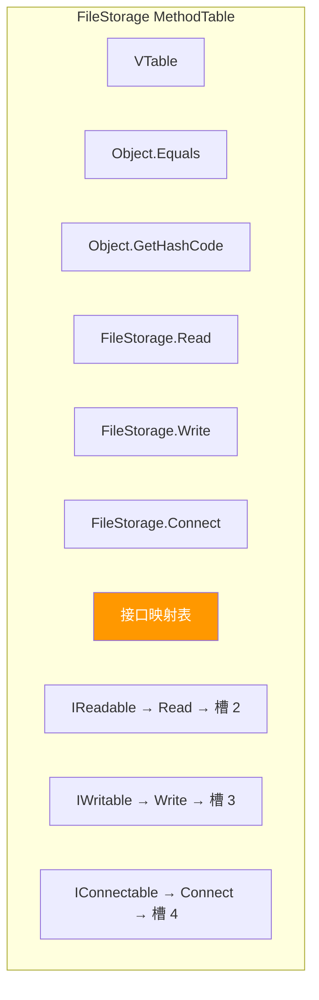

### 11.3 接口重新实现的映射

```csharp
public class Base : IComparable
{
    public virtual int CompareTo(object? obj) => 0;
}

public class Derived : Base, IComparable  // 重新声明 IComparable
{
    public override int CompareTo(object? obj) => 1;
}
```

当派生类重新声明接口时，接口映射会重新建立，指向派生类的实现。

## 12. 接口与 AOT/裁剪

### 12.1 接口映射在 AOT 中的保证

在 Native AOT 编译时，所有接口映射在编译期就被确定和固化。这与 JIT 模式下的动态查找不同——AOT 的接口调度更类似于 C++ 的虚函数表。

### 12.2 裁剪与接口

```csharp
// 裁剪可能移除未被直接引用的接口实现
// 如果只有通过反射访问接口映射，需要提示裁剪器
[DynamicallyAccessedMembers(DynamicallyAccessedMemberTypes.Interfaces)]
public class Plugin { }
```

## 13. 接口调度的 JIT 优化

### 13.1 接口调度的去虚化

JIT 编译器可以对接接口调用进行去虚化：

```csharp
public void Process(IAnimal animal)
{
    animal.Speak();

    // JIT 可能生成:
    // if (animal.GetType() == typeof(Dog))
    //     ((Dog)animal).Speak();  // 直接调用，跳过接口映射
    // else
    //     animal.Speak();         // 回退到接口调度
}
```

### 13.2 PGO 与接口调度

Profile-Guided Optimization (PGO) 对接口调度特别有效：

1. **收集配置文件**：运行时记录接口引用的实际类型
2. **优化调度**：为最常见的类型生成快速路径
3. **插入类型检查**：快速路径直接调用，未命中再走慢路径

### 13.3 接口调度的 Guarded Devirtualization

在 PGO 指导下，JIT 可以为接口调用生成带守卫的去虚化代码：

```asm
; PGO 优化后的概念性 x64 汇编
; 假设统计显示 90% 的时间 animal 是 Dog 类型

mov rax, [animal]          ; 获取 MethodTable 指针
cmp rax, [Dog.MethodTable] ; 类型检查：是否为 Dog?
jne slow_path              ; 不是 → 走慢路径

; 快速路径：直接调用 Dog.Speak（无接口映射查找）
call Dog.Speak
jmp continue

slow_path:
; 慢路径：标准接口映射调度
call InterfaceDispatch_Stub

continue:
```

### 13.4 接口调度性能基准

```csharp
using BenchmarkDotNet.Attributes;

[MemoryDiagnoser]
public class InterfaceDispatchBenchmark
{
    private readonly IAnimal _singleType = new Dog();
    private IAnimal[] _mixedTypes = null!;

    [GlobalSetup]
    public void Setup()
    {
        _mixedTypes = new IAnimal[100];
        for (int i = 0; i < 100; i++)
            _mixedTypes[i] = i % 3 switch
            {
                0 => new Dog(),
                1 => new Cat(),
                _ => new Bird()
            };
    }

    [Benchmark]
    public void SingleTypeDispatch()
    {
        _singleType.Speak();  // 单态 → Inline Cache 命中
    }

    [Benchmark]
    public void MixedTypeDispatch()
    {
        foreach (var animal in _mixedTypes)
            animal.Speak();  // 多态 → Polymorphic Cache
    }
}
```

| 场景 | 调度策略 | 性能特征 |
|------|----------|----------|
| 单态 | Inline Cache | 接近直接调用 |
| 寡态（2-4 种类型） | Polymorphic Cache | 较快，线性查找 |
| 多态（5+ 种类型） | Megamorphic | 退化为完整查找 |
| PGO 优化 | Guarded Devirt | 快速路径极快 |

### 13.5 接口调度优化的最佳实践

::: tip 接口调度优化建议
1. **避免在极热路径中使用接口调度**：如果性能关键，考虑使用泛型约束代替接口
2. **保持单态调用**：同一接口引用尽量指向同一实际类型，充分利用 Inline Cache
3. **使用 sealed 类**：帮助 JIT 进行去虚化
4. **使用泛型约束**：`where T : IAnimal` 允许 JIT 在编译时确定调用目标
5. **启用 PGO**：.NET 7+ 的 Dynamic PGO 对接口调度优化效果显著
:::

## 14. 接口的版本兼容性

### 14.1 接口新增成员的兼容性问题

```csharp
// v1.0
public interface IProcessor
{
    void Process(string data);
}

// v2.0: 新增成员
public interface IProcessor
{
    void Process(string data);
    void ProcessBatch(string[] data);  // 破坏性变更!
}
```

新增接口成员是**破坏性变更**——所有实现类都必须更新。默认接口方法解决了这个问题：

```csharp
// v2.0: 使用默认接口方法
public interface IProcessor
{
    void Process(string data);

    // 默认实现：向后兼容
    void ProcessBatch(string[] data)
    {
        foreach (var item in data)
            Process(item);
    }
}
```

### 14.2 默认接口方法的版本兼容 Mermaid 图

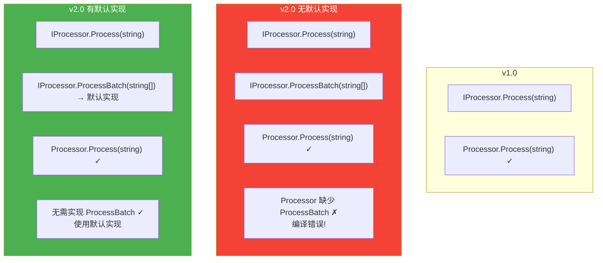

## 15. 小结

接口映射与多态实现是 CLR 类型系统的核心机制，理解其底层运作有助于编写更高效的代码和更合理的设计：

| 主题 | 关键点 |
|------|--------|
| InterfaceMap | 接口方法 → 类实现方法的映射表 |
| 显式接口实现 | `private hidebysig newslot final virtual` |
| 接口调度 | 接口映射查找 + VTable 槽位定位 |
| 默认接口方法 | C# 8.0，接口可提供实现，只能通过接口引用调用 |
| 钻石问题 | 同签名多接口需显式解决歧义 |
| Reabstraction | 派生接口可将默认实现重新声明为抽象 |
| 静态抽象成员 | C# 11，用于运算符泛型约束 |
| 性能 | 接口调用略慢于虚方法调用，缓存可缓解 |
| 值类型装箱 | 接口引用值类型会装箱，泛型约束可避免 |