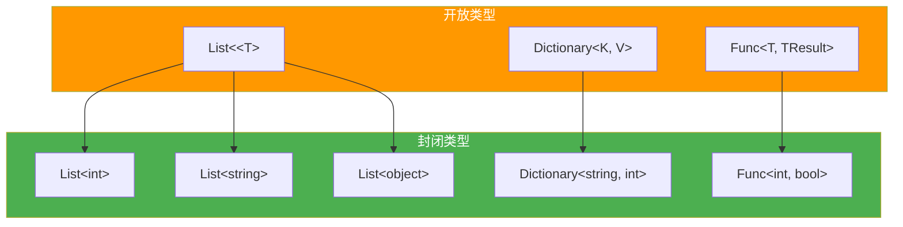
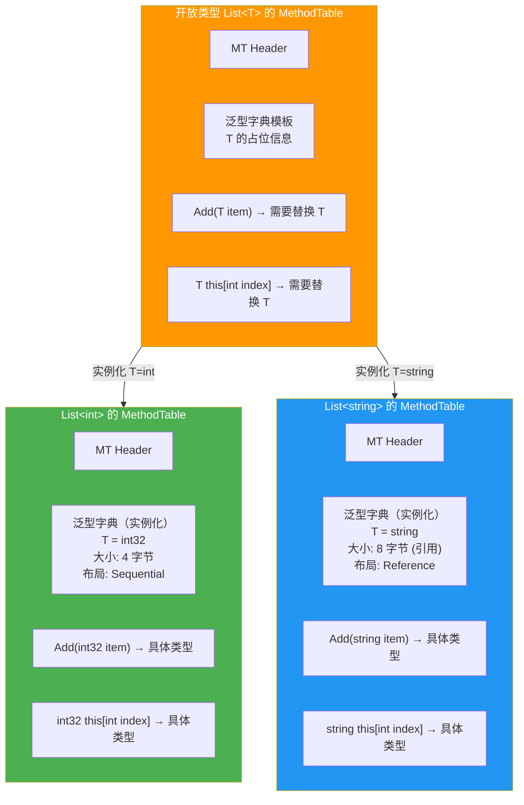
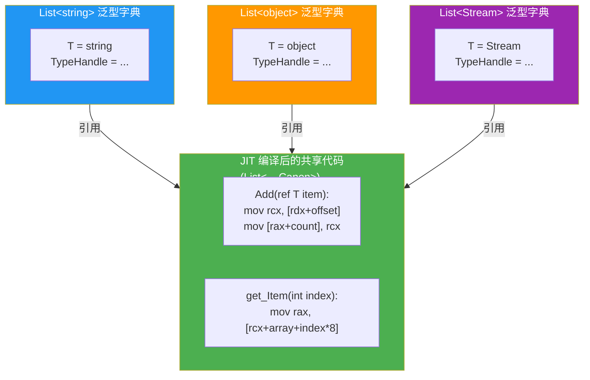
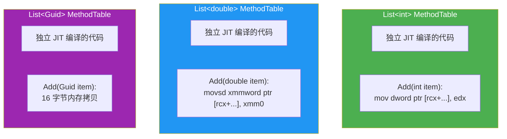
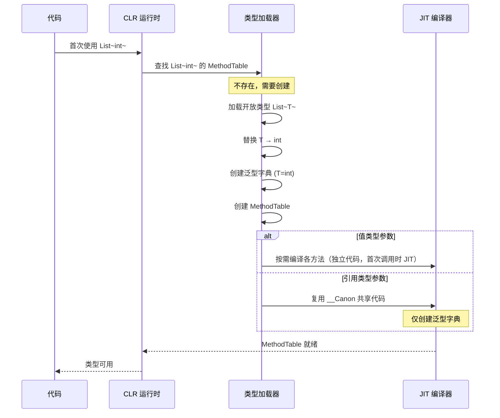
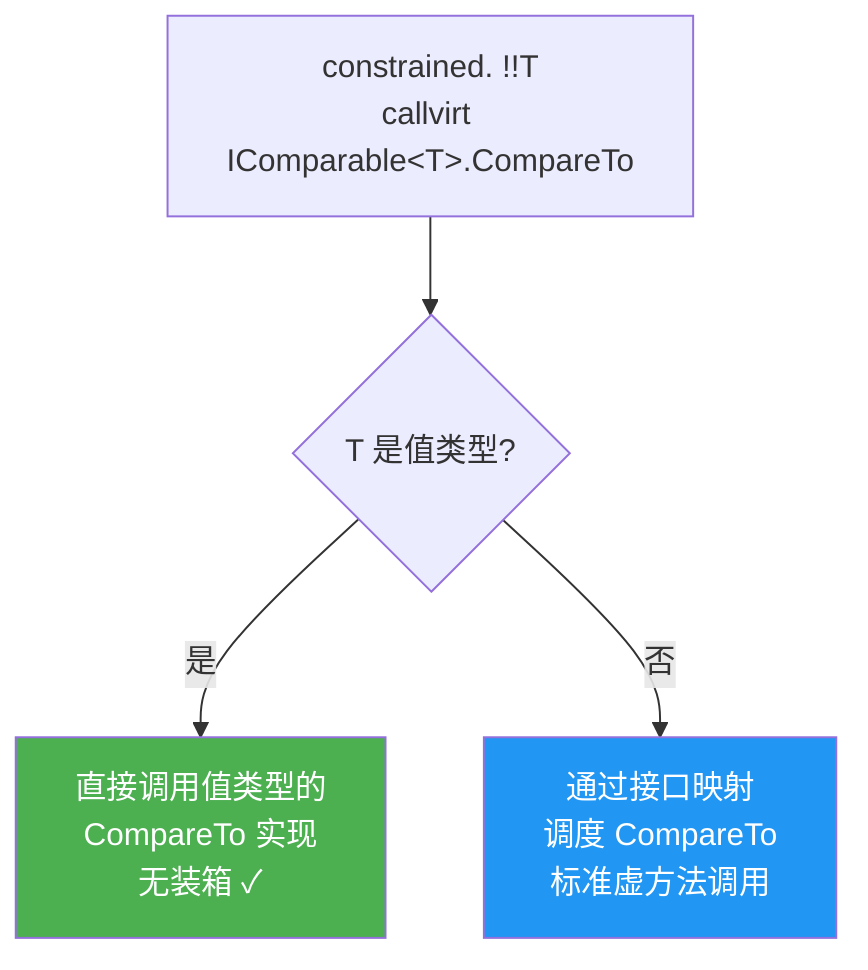
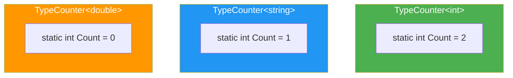
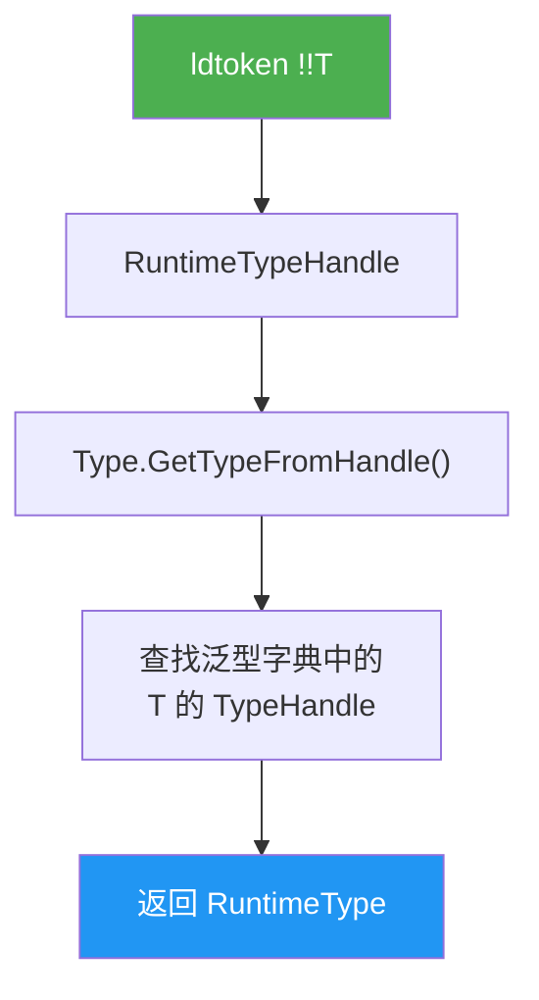
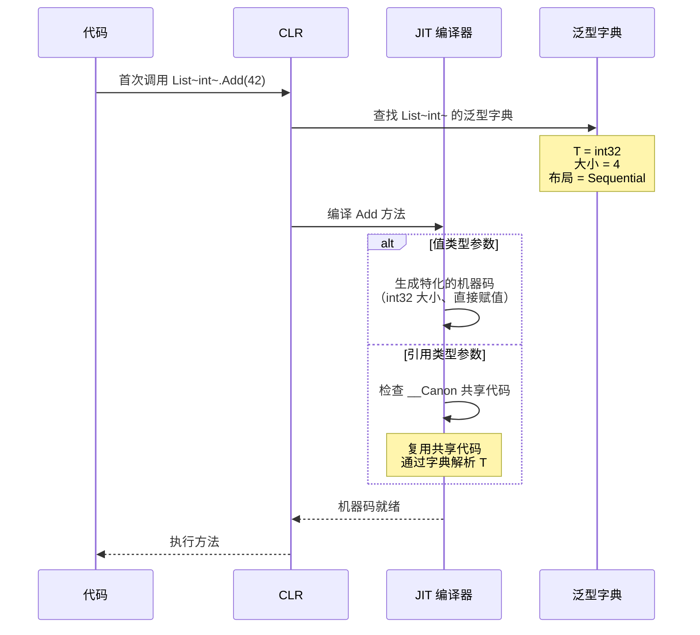
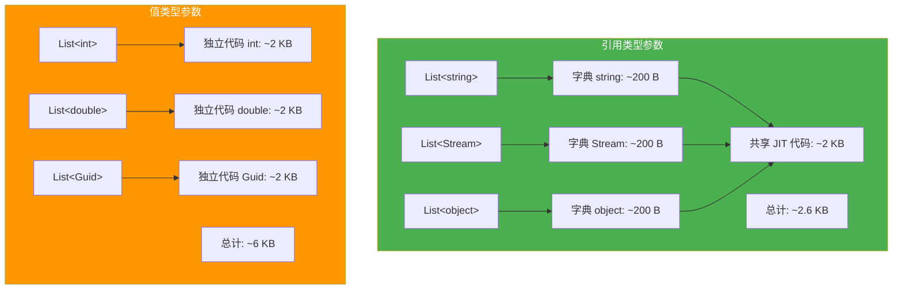

# 泛型类型与实例化原理

泛型（Generics）是 .NET 2.0 引入的核心特性，它允许类型和方法参数化，在保证类型安全的同时避免装箱和代码重复。但泛型的真正威力远不止语法糖——CLR 在运行时为泛型类型创建独立的类型信息（MethodTable），并根据类型参数是引用类型还是值类型采取截然不同的代码共享策略。本文从 CLR 底层剖析开放类型与封闭类型、泛型字典、共享代码原理、值类型特化等核心主题。

## 1. 开放类型 vs 封闭类型

### 1.1 开放类型（Open Type）

开放类型是包含未指定类型参数的泛型类型，不能直接实例化：

```csharp
Type openType = typeof(List<>);          // 开放类型
Console.WriteLine(openType.IsGenericTypeDefinition);  // True
Console.WriteLine(openType.ContainsGenericParameters); // True

// 不能实例化开放类型
// Activator.CreateInstance(openType);  // 异常!
```

### 1.2 封闭类型（Closed Type）

封闭类型是所有类型参数都已指定的泛型类型，可以正常实例化：

```csharp
Type closedType = typeof(List<int>);     // 封闭类型
Console.WriteLine(closedType.IsGenericTypeDefinition);  // False
Console.WriteLine(closedType.ContainsGenericParameters); // False

var list = Activator.CreateInstance(closedType);  // OK
```

### 1.3 RuntimeType 与泛型

CLR 内部使用 `RuntimeType` 表示类型信息。每个封闭的泛型类型都有独立的 `RuntimeType` 实例：

```csharp
Console.WriteLine(typeof(List<int>) == typeof(List<string>));  // False
Console.WriteLine(typeof(List<int>).IsAssignableFrom(typeof(List<string>)));  // False

// 不同的 RuntimeType 实例
Console.WriteLine(ReferenceEquals(
    typeof(List<int>),
    typeof(List<string>)));  // False
```

### 1.4 开放类型 vs 封闭类型 Mermaid 图



### 1.5 半开放类型

```csharp
// 半开放类型：部分类型参数已指定
Type partiallyOpen = typeof(Dictionary<string,>);
Console.WriteLine(partiallyOpen.ContainsGenericParameters); // True

// 仍然是开放类型，不能实例化
// 但可以用它创建封闭类型
Type closed = partiallyOpen.MakeGenericType(typeof(int));
Console.WriteLine(closed == typeof(Dictionary<string, int>));  // True
```

## 2. 泛型字典（MethodTable 中的字典）

### 2.1 泛型字典的作用

泛型类型的方法需要知道类型参数的具体信息（如大小、布局、基类、接口等）。CLR 通过泛型字典（Generic Dictionary）将类型参数信息关联到每个封闭类型的 MethodTable 中。

### 2.2 MethodTable 中的泛型字典 Mermaid 图



### 2.3 泛型字典存储的信息

泛型字典为每个类型参数存储以下信息：

| 信息 | 用途 |
|------|------|
| 类型句柄（TypeHandle） | 用于方法调度、类型检查 |
| 大小（Size） | 内存分配、数组操作 |
| 布局（Layout） | 字段偏移计算 |
| 基类信息 | 继承关系检查 |
| 接口映射 | 接口方法调度 |
| 默认值 | `default(T)` 的值 |
| GC 引用映射 | 垃圾回收根扫描 |
| 静态字段地址 | 静态字段访问 |

### 2.4 泛型方法的字典

泛型方法也有自己的泛型字典，与方法级别的类型参数关联：

```csharp
public class Utils
{
    public static T Max<T>(T a, T b) where T : IComparable<T>
    {
        return a.CompareTo(b) >= 0 ? a : b;
    }
}
```

`Max&lt;T&gt;` 方法的泛型字典在每次不同的 `T` 被使用时创建，存储 `T` 的比较器信息。

## 3. 共享代码原理

### 3.1 引用类型共享一个 MethodTable

CLR 的一个关键优化：**所有引用类型参数共享同一份 JIT 编译后的机器码**。

原因：所有引用类型在运行时的大小相同（一个指针，8 字节 on x64），操作的语义也相同（都是引用传递）。因此 `List&lt;string&gt;` 和 `List&lt;object&gt;` 的方法可以共享同一份机器码。

### 3.2 共享代码示例

```csharp
var stringList = new List<string>();
var objectList = new List<object>();
var streamList = new List<Stream>();

// 这三个 List 使用同一个 JIT 编译后的 Add 方法代码!
// 但各自有独立的泛型字典
```

### 3.3 共享代码 Mermaid 图



### 3.4 __Canon —— 共享代码的类型占位符

CLR 内部使用 `System.__Canon` 作为引用类型参数的占位符。当 JIT 首次编译 `List&lt;T&gt;` 的方法时（其中 `T` 是引用类型），它使用 `__Canon` 作为类型参数：

```csharp
// CLR 内部概念
// List<__Canon> 是所有 List<引用类型> 的共享代码模板
// List<string> 的泛型字典告诉共享代码 T 的具体信息
```

::: important __Canon 的工作原理
1. `List&lt;string&gt;` 首次使用时，JIT 检查是否已有 `List&lt;__Canon&gt;` 的共享代码
2. 如果没有，JIT 编译 `List&lt;__Canon&gt;` 的方法，生成共享的机器码
3. 创建 `List&lt;string&gt;` 的泛型字典，关联到共享代码
4. 后续 `List&lt;object&gt;` 等直接复用共享代码，只需创建新的泛型字典
:::

### 3.5 共享代码与类型检查

虽然共享了机器码，但类型检查仍然有效：

```csharp
var stringList = new List<string>();
// stringList.Add(42);  // 编译错误，类型检查在编译时执行

// 运行时类型检查通过泛型字典中的 TypeHandle 进行
stringList.Add("hello");  // 运行时：从字典获取 T=string，正常添加
```

## 4. 值类型特化

### 4.1 值类型需要独立的 MethodTable

与引用类型不同，每个值类型参数都需要**独立的 MethodTable 和 JIT 编译后的代码**。原因：

1. **大小不同**：`int` 是 4 字节，`double` 是 8 字节，`Guid` 是 16 字节
2. **布局不同**：值类型的字段排列方式各异
3. **操作不同**：赋值、比较、传参的方式不同
4. **GC 行为不同**：值类型不含 GC 引用（大部分情况）

### 4.2 值类型特化示例

```csharp
var intList = new List<int>();       // 独立的 MethodTable
var doubleList = new List<double>(); // 独立的 MethodTable
var guidList = new List<Guid>();     // 独立的 MethodTable
```



### 4.3 引用类型 vs 值类型的代码生成策略

| 特征 | 引用类型参数 | 值类型参数 |
|------|-------------|-----------|
| JIT 代码 | 共享（__Canon） | 每个值类型独立 |
| MethodTable | 共享 + 泛型字典 | 独立 |
| 内存占用 | 代码少，字典多 | 代码多，无共享 |
| 实例大小 | 8 字节（指针） | 按实际大小 |
| GC 引用 | 需要扫描 | 通常不需要 |
| 数组存储 | 指针数组 | 内联存储 |

::: warning 泛型与代码膨胀
大量使用不同的值类型参数会导致代码膨胀（Code Bloat）——每个值类型参数都会生成一份独立的 JIT 代码。例如：

```csharp
// 3 个不同的值类型 = 3 份 JIT 代码
var a = new List<int>();
var b = new List<double>();
var c = new List<decimal>();
```

在极端情况下（如泛型算法的嵌套组合），代码膨胀可能显著增加内存占用。但对于引用类型，无论多少种类型参数，只有一份 JIT 代码。
:::

## 5. 泛型类型实例化时机

### 5.1 实例化的触发点

CLR 在以下时机创建封闭的泛型类型（实例化 MethodTable）：

1. **首次使用 `typeof(List&lt;int&gt;)`**
2. **首次 `new List&lt;int&gt;()`**
3. **首次调用 `List&lt;int&gt;` 的静态方法**
4. **首次访问 `List&lt;int&gt;` 的静态字段**
5. **反射 `MakeGenericType`**

### 5.2 实例化流程 Mermaid 图



### 5.3 惰性实例化

CLR 的泛型实例化是**惰性**的——只有实际使用的封闭类型才会被创建：

```csharp
// 以下类型从未被使用 → MethodTable 永远不会被创建
// typeof(List<SomeUnusedType>)  // 不调用就不会创建
```

::: important 反射与泛型实例化
使用 `MakeGenericType` 会强制创建封闭类型：

```csharp
Type openType = typeof(Dictionary<,>);
Type closedType = openType.MakeGenericType(typeof(string), typeof(int));
// 此时 CLR 创建 Dictionary<string, int> 的 MethodTable
```
:::

## 6. 泛型方法推断 IL

### 6.1 泛型方法的调用

```csharp
public class Utils
{
    public static T Identity<T>(T value) => value;
}

// 类型推断
int result = Utils.Identity(42);  // 推断 T = int
```

### 6.2 泛型方法的 IL

```il
// Utils.Identity(42)
IL_0000:  ldc.i4.s   42
IL_0002:  call       !!0 Utils::Identity<int32>(!!0)
IL_0007:  stloc.0
```

`!!0` 是 IL 中的泛型类型参数占位符，`Identity&lt;int32&gt;` 表示 `T` 被实例化为 `int32`。

### 6.3 泛型方法的类型推断规则

C# 编译器的类型推断遵循以下规则：

1. **从参数类型推断**：`Identity(42)` → `T = int`
2. **从返回类型推断**（部分场景）：`int x = Identity(42)` 确认 `T = int`
3. **约束检查**：推断出的类型必须满足 `where` 约束
4. **歧义时需显式指定**：`Utils.Identity&lt;object&gt;(42)`

### 6.4 泛型方法调用的 IL 详细分析

```csharp
public static T Max<T>(T a, T b) where T : IComparable<T>
{
    return a.CompareTo(b) >= 0 ? a : b;
}

// 调用
int max = Max(3, 5);
```

```il
IL_0000:  ldc.i4.3
IL_0001:  ldc.i4.5
IL_0002:  call       !!0 Program::Max<int32>(!!0, !!0)
IL_0007:  stloc.0
```

在方法体内部，`CompareTo` 的调用通过泛型字典解析：

```il
.method public hidebysig static !!T Max<(class [System.Runtime]System.IComparable`1<!!T>) T>
        (!!T a, !!T b) cil managed
{
  .maxstack  8
  IL_0000:  ldarga.s   a
  IL_0002:  ldarg.1
  IL_0003:  constrained. !!T
  IL_0009:  callvirt   instance int32 class
              [System.Runtime]System.IComparable`1<!!T>::CompareTo(!0)
  IL_000e:  ldc.i4.0
  IL_000f:  blt.s      IL_0014
  IL_0011:  ldarg.0
  IL_0012:  ret
  IL_0014:  ldarg.1
  IL_0015:  ret
}
```

::: tip constrained. 前缀
`constrained. callvirt` 是 CLR 处理泛型接口调用的特殊模式：
1. 如果 `T` 是值类型：直接调用值类型的方法实现（无装箱）
2. 如果 `T` 是引用类型：通过接口映射调度

这确保了泛型方法中对接口方法的调用在值类型上不会产生装箱开销。
:::

### 6.5 constrained. 调用 Mermaid 图



## 7. 泛型缓存静态字段

### 7.1 每个封闭类型有独立的静态字段

```csharp
public class TypeCounter<T>
{
    public static int Count = 0;

    public static void Increment() => Count++;
}

TypeCounter<int>.Increment();
TypeCounter<int>.Increment();
TypeCounter<string>.Increment();

Console.WriteLine(TypeCounter<int>.Count);      // 2
Console.WriteLine(TypeCounter<string>.Count);   // 1
```

### 7.2 静态字段的 IL 访问

```il
// TypeCounter<int>.Count 的访问
IL_0000:  ldsfld     int32 class TypeCounter`1<int32>::Count

// TypeCounter<string>.Count 的访问
IL_0000:  ldsfld     int32 class TypeCounter`1<string>::Count
```

每个封闭类型有独立的静态字段存储位置：



::: warning 静态字段不是共享的
每个封闭的泛型类型都有独立的静态字段。这是一个常见的误解——有些人认为 `TypeCounter&lt;T&gt;` 的静态字段是所有 `T` 共享的，但实际上每个封闭类型都有自己的一份。

这意味着 `TypeCounter&lt;int&gt;.Count` 和 `TypeCounter&lt;string&gt;.Count` 是完全独立的变量。
:::

### 7.3 利用静态字段实现泛型缓存

```csharp
public static class JsonCache<T>
{
    private static readonly JsonSerializerOptions _options = new();

    public static string Serialize(T value) =>
        JsonSerializer.Serialize(value, _options);

    public static T? Deserialize(string json) =>
        JsonSerializer.Deserialize<T>(json, _options);
}

// _options 对每个 T 只初始化一次
JsonCache<Person>.Serialize(person);
JsonCache<Order>.Serialize(order);
```

## 8. typeof(T) IL（ldtoken + call）

### 8.1 typeof(T) 的编译

```csharp
public class Example
{
    public static Type GetTypeOf<T>() => typeof(T);
}
```

```il
.method public hidebysig static class
        [System.Runtime]System.Type GetTypeOf<T>() cil managed
{
  .maxstack  8
  IL_0000:  ldtoken    !!T
  IL_0005:  call       class [System.Runtime]System.Type
              [System.Runtime]System.Type::GetTypeFromHandle(
                  valuetype [System.Runtime]System.RuntimeTypeHandle)
  IL_000a:  ret
}
```

### 8.2 ldtoken 指令

`ldtoken` 将元数据 token 加载为 `RuntimeTypeHandle`（或 `RuntimeMethodHandle`/`RuntimeFieldHandle`）：

| ldtoken 目标 | 生成类型 |
|-------------|---------|
| 类型 `!!T` | `RuntimeTypeHandle` |
| 方法 | `RuntimeMethodHandle` |
| 字段 | `RuntimeFieldHandle` |

### 8.3 typeof(T) 的运行时解析



### 8.4 typeof 与泛型字典的关系

`typeof(T)` 在运行时通过泛型字典解析。对于值类型，每个封闭类型的泛型字典中存储了 `T` 的 `TypeHandle`；对于引用类型，共享代码通过当前上下文的泛型字典获取 `T` 的信息。

```csharp
public class GenericExample<T>
{
    public void PrintType()
    {
        Console.WriteLine(typeof(T).Name);
    }
}

new GenericExample<int>().PrintType();     // Int32
new GenericExample<string>().PrintType();  // String
```

## 9. 反射获取泛型信息

### 9.1 获取泛型定义

```csharp
Type closedType = typeof(List<int>);

// 获取开放类型
Type openType = closedType.GetGenericTypeDefinition();
Console.WriteLine(openType == typeof(List<>));  // True

// 获取类型参数
Type[] args = closedType.GetGenericArguments();
Console.WriteLine(args[0].Name);  // Int32
```

### 9.2 创建封闭类型

```csharp
Type openType = typeof(Dictionary<,>);
Type closedType = openType.MakeGenericType(typeof(string), typeof(int));
Console.WriteLine(closedType == typeof(Dictionary<string, int>));  // True
```

### 9.3 泛型方法反射

```csharp
var method = typeof(Utils).GetMethod("Max");
var genericMethod = method!.MakeGenericMethod(typeof(int));
var result = genericMethod.Invoke(null, new object[] { 3, 5 });
Console.WriteLine(result);  // 5
```

### 9.4 反射与泛型约束

```csharp
public class ConstraintChecker
{
    public static void Check<T>() where T : struct
    {
        var type = typeof(T);
        Console.WriteLine($"IsValueType: {type.IsValueType}");
        Console.WriteLine($"IsClass: {type.IsClass}");
    }
}

ConstraintChecker.Check<int>();    // IsValueType: True, IsClass: False
```

## 10. 泛型与数组

### 10.1 泛型数组的创建

```csharp
T[] CreateArray<T>(int size)
{
    return new T[size];  // CLR 特殊处理
}
```

```il
.method public hidebysig instance !!0[] CreateArray<T>(int32 size) cil managed
{
  .maxstack  8
  IL_0000:  ldarg.1
  IL_0001:  newarr     !!T
  IL_0006:  ret
}
```

### 10.2 值类型数组 vs 引用类型数组

| 特征 | `int[]` | `string[]` |
|------|---------|------------|
| 存储 | 内联（4 字节/元素） | 指针（8 字节/元素） |
| GC | 不需要扫描 | 需要扫描 |
| 初始化 | 零初始化 | null 初始化 |
| 访问 | 直接偏移 | 指针解引用 |

## 11. 泛型与 JIT 编译的详细流程

### 11.1 泛型方法的 JIT 编译



### 11.2 JIT 编译中的类型替换

JIT 编译泛型方法时，会将 IL 中的 `!!T` 替换为具体的类型信息：

```il
// IL 中的泛型代码
.method public hidebysig instance void Add(!0 item) cil managed
{
  IL_0000:  ldarg.0
  IL_0001:  ldarg.1
  IL_0002:  stfld      !0[] List`1::_items
}

// JIT 为 List<int> 编译后的概念性代码
// Add(int32 item):
//   mov [this._items + index*4 + offset], item  // 4 字节存储

// JIT 为 List<string> 编译后的概念性代码
// Add(string item):
//   mov [this._items + index*8 + offset], item  // 8 字节指针存储
```

## 12. 泛型的协变与逆变

### 12.1 协变（Covariance）

```csharp
// out 关键字：T 只出现在输出位置
public interface IEnumerable<out T> : IEnumerable
{
    IEnumerator<T> GetEnumerator();
}

// 协变允许：IEnumerable<string> → IEnumerable<object>
IEnumerable<string> strings = new List<string>();
IEnumerable<object> objects = strings;  // 合法!
```

### 12.2 逆变（Contravariance）

```csharp
// in 关键字：T 只出现在输入位置
public interface IComparer<in T>
{
    int Compare(T? x, T? y);
}

// 逆变允许：IComparer<object> → IComparer<string>
IComparer<object> objectComparer = Comparer<object>.Default;
IComparer<string> stringComparer = objectComparer;  // 合法!
```

### 12.3 协变逆变的运行时保证

CLR 在运行时验证协变和逆变的安全性：

```csharp
// 以下代码在编译时合法，但运行时会检查
object[] array = new string[3];  // 数组协变
array[0] = 42;  // 运行时异常! ArrayTypeMismatchException
```

### 12.4 协变逆变 Mermaid 图

```mermaid
flowchart TB
    subgraph Covariance["协变 (out)"]
        C1["IEnumerable&lt;string&gt;"]
        C2["IEnumerable&lt;object&gt;"]
        C1 -->|"string → object<br/>派生 → 基类"| C2
    end

    subgraph Contravariance["逆变 (in)"]
        V1["IComparer&lt;object&gt;"]
        V2["IComparer&lt;string&gt;"]
        V1 -->|"object → string<br/>基类 → 派生"| V2
    end

    subgraph Invariant["不变 (无修饰)"]
        N1["List&lt;string&gt;"]
        N2["List&lt;object&gt;"]
        N1 x-"不可转换"-> N2
    end

    style Covariance fill:#4CAF50,color:#fff
    style Contravariance fill:#2196F3,color:#fff
    style Invariant fill:#f44336,color:#fff
```

## 13. 泛型约束的 IL 表示

### 13.1 约束类型

```csharp
public class Constrained<T> where T : class, IDisposable, new()
{
}
```

```il
.class public auto ansi beforefieldinit Constrained`1
       extends [System.Runtime]System.Object
{
  // 约束信息存储在元数据中
  // GenericParam 约束表:
  //   T : class (引用类型约束)
  //   T : IDisposable (接口约束)
  //   T : .ctor() (无参构造函数约束)
}
```

### 13.2 约束在元数据中的表示

| 约束类型 | 元数据标志 |
|----------|-----------|
| `class` | `GenericParameterAttributes.ReferenceTypeConstraint` |
| `struct` | `GenericParameterAttributes.NotNullableValueTypeConstraint` |
| `new()` | `GenericParameterAttributes.DefaultConstructorConstraint` |
| 具体基类/接口 | `GenericParamConstraint` 表条目 |

### 13.3 约束检查的时机

- **编译时**：C# 编译器验证约束满足
- **JIT 时**：CLR 再次验证约束（防止通过 IL 绕过）
- **反射时**：`MakeGenericType` 会验证约束

```csharp
// 编译时约束检查
public static T Create<T>() where T : new() => new T();
Create<int>();      // OK
Create<string>();   // OK
// Create<Stream>(); // 编译错误: Stream 没有无参构造函数

// 运行时约束检查（反射）
typeof(Constrained<>).MakeGenericType(typeof(int));  // 异常! int 不是 class
```

## 14. 泛型与递归类型

### 14.1 递归泛型约束

```csharp
// CRTP (Curiously Recurring Template Pattern) 的 C# 实现
public interface IEquatable<T> where T : IEquatable<T>
{
    bool Equals(T? other);
}

public struct MyStruct : IEquatable<MyStruct>
{
    public int Value;
    public bool Equals(MyStruct other) => Value == other.Value;
}
```

### 14.2 递归泛型的 IL

```il
.class public sequential sealed beforefieldinit MyStruct
       extends [System.Runtime]System.ValueType
       implements class [System.Runtime]System.IEquatable`1<valuetype MyStruct>
{
  .field public int32 Value

  .method public hidebysig instance bool Equals(valuetype MyStruct other) cil managed
  {
    .maxstack  8
    IL_0000:  ldarg.0
    IL_0001:  ldfld      int32 MyStruct::Value
    IL_0006:  ldarg.1
    IL_0007:  ldfld      int32 MyStruct::Value
    IL_000c:  ceq
    IL_000e:  ret
  }
}
```

## 15. 泛型与 Native AOT

### 15.1 泛型在 AOT 中的处理

Native AOT 在编译期就确定了所有泛型实例化：

```
// 编译时已知的封闭类型
List<int>        → 生成特化代码
List<string>     → 使用 __Canon 共享代码
List<Stream>     → 使用 __Canon 共享代码
Dictionary<string, int> → 部分特化（int 特化，string 共享）
```

### 15.2 AOT 中的泛型约束

```csharp
// AOT 兼容的泛型方法
[DynamicDependency(DynamicallyAccessedMemberTypes.PublicMethods, typeof(List<>))]
public static T CreateAndAdd<T>(T item) where T : new()
{
    var list = new List<T>();
    list.Add(item);
    return item;
}
```

### 15.3 泛型与裁剪

```csharp
// 裁剪可能移除未使用的泛型实例化
// 但如果通过反射使用，需要提示裁剪器
[DynamicallyAccessedMembers(DynamicallyAccessedMemberTypes.PublicParameterlessConstructor)]
public static T Create<T>() where T : new() => new T();
```

## 16. 泛型性能综合

### 16.1 泛型 vs 非泛型（装箱）

```csharp
using BenchmarkDotNet.Attributes;

[MemoryDiagnoser]
public class GenericVsBoxingBenchmark
{
    private readonly ArrayList _arrayList = new();
    private readonly List<int> _genericList = new();

    [Benchmark]
    public void ArrayListAdd()
    {
        _arrayList.Clear();
        for (int i = 0; i < 1000; i++)
            _arrayList.Add(i);  // 装箱!
    }

    [Benchmark]
    public void GenericListAdd()
    {
        _genericList.Clear();
        for (int i = 0; i < 1000; i++)
            _genericList.Add(i);  // 无装箱
    }
}
```

典型结果（.NET 8）：

| 方法 | 平均时间 | 分配 |
|------|----------|------|
| ArrayListAdd | ~15 μs | ~8 KB (装箱) |
| GenericListAdd | ~3 μs | ~4 KB (无装箱) |

### 16.2 泛型调用的性能层级


### 16.3 泛型与代码膨胀的权衡

泛型值类型特化带来了代码膨胀。以下是一些减轻膨胀的策略：

```csharp
// 策略 1: 对于仅需要引用语义的方法，使用引用类型约束
public static void ProcessRef<T>(T item) where T : class
{
    // T 是引用类型 → 使用共享代码
}

// 策略 2: 将值类型操作提取到非泛型辅助方法中
public static void Swap<T>(ref T a, ref T b)
{
    T temp = a;
    a = b;
    b = temp;
    // 这个方法对每个值类型 T 都会生成独立代码
    // 但方法体很小，膨胀影响有限
}

// 策略 3: 使用泛型约束避免不必要的特化
public static int Compare<T>(T a, T b) where T : IComparable<T>
{
    return a.CompareTo(b);  // constrained. callvirt → 值类型无装箱
}
```

### 16.4 泛型实例化内存估算



::: tip 代码膨胀的实际影响
在典型的 .NET 应用中，泛型代码膨胀通常只占 JIT 代码总量的 5-15%。只有在极端场景下（如为每种数值类型生成大量泛型算法）才需要关注。.NET Runtime 团队持续优化共享代码的范围，例如 .NET 7+ 中更多的方法可以在引用类型间共享。
:::

## 17. 泛型与 .NET Runtime 源码

### 17.1 核心源码文件

泛型在 .NET Runtime 中的实现涉及以下核心文件：

| 文件路径 | 功能 |
|----------|------|
| `src/coreclr/vm/genericdict.cpp` | 泛型字典实现 |
| `src/coreclr/vm/methodtable.cpp` | MethodTable 和泛型实例化 |
| `src/coreclr/vm/jitinterface.cpp` | JIT 与泛型接口 |
| `src/coreclr/vm/typehash.cpp` | 类型哈希查找 |
| `src/coreclr/vm/loadtype.cpp` | 类型加载与实例化 |

### 17.2 MethodTable 实例化的源码片段

```cpp
// 简化自 dotnet/runtime src/coreclr/vm/methodtable.cpp
// MethodTable::InstantiateGenericType 用于创建封闭泛型类型
MethodTable* MethodTable::InstantiateGenericType(
    TypeHandle* typeArgs,       // 类型参数数组
    UINT32 numTypeArgs          // 类型参数数量
)
{
    // 1. 检查是否已存在（类型哈希查找）
    // 2. 如果不存在，创建新的 MethodTable
    // 3. 填充泛型字典
    // 4. 设置 VTable
    // 5. 对于引用类型参数，检查是否可共享代码
}
```

### 17.3 共享代码判断的源码逻辑

```cpp
// 简化逻辑
bool MethodTable::CanShareGenericCode(TypeHandle* typeArgs)
{
    for (UINT32 i = 0; i < numTypeArgs; i++)
    {
        if (typeArgs[i].IsValueType())
            return false;  // 值类型参数 → 不能共享，需要特化
    }
    return true;  // 所有参数都是引用类型 → 可以共享 __Canon 代码
}
```

::: info 深入 .NET Runtime 源码
.NET Runtime 的泛型实现是 CLR 最复杂的子系统之一，涉及类型系统、JIT 编译、垃圾回收等多个模块的协作。以上简化代码仅展示核心逻辑，实际实现远比这复杂，包含了大量边界条件处理、并发安全和性能优化。
:::

## 18. 小结

泛型是 CLR 类型系统中最精巧的设计之一，它在保证类型安全的同时实现了性能优化：

| 主题 | 关键点 |
|------|--------|
| 开放 vs 封闭类型 | 开放类型不能实例化，封闭类型有独立的 RuntimeType |
| 泛型字典 | 每个封闭类型的 MethodTable 中的类型参数信息 |
| 共享代码 | 引用类型参数共享 __Canon 的 JIT 代码 |
| 值类型特化 | 每个值类型参数独立 JIT 编译，避免大小/布局问题 |
| 实例化时机 | 首次使用时惰性创建 |
| constrained. | 泛型接口调用时，值类型无装箱，引用类型走接口调度 |
| 静态字段 | 每个封闭类型有独立的静态字段 |
| typeof(T) | `ldtoken !!T` + `GetTypeFromHandle`，通过泛型字典解析 |
| 协变逆变 | `out` 协变返回类型，`in` 逆变参数类型 |
| 性能 | 泛型避免装箱，值类型特化有代码膨胀代价 |