# 泛型约束与协变逆变

> 约束让泛型从"什么都能传"变为"只传对的"；协变逆变让泛型从"类型不兼容"变为"安全转换"。两者共同构筑了 .NET 类型系统的安全边界，而在 IL 层面，它们各自拥有精密的元数据编码。

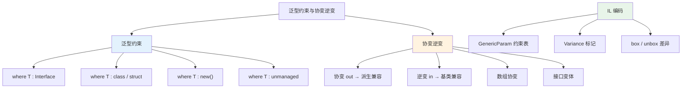

## 一、泛型约束概览

### 1.1 为什么需要约束

没有约束的泛型参数 `T` 只能使用 `System.Object` 的成员 —— CLR 对其一无所知。约束（constraint）向编译器和 CLR 承诺：`T` 一定具备某些能力。

```csharp
// 无约束：只能用 Object 成员
void Process<T>(T item)
{
    // item.ToString();      // OK，Object 方法
    // item.CompareTo(...);  // 编译错误！
}

// 有约束：可以使用约束承诺的成员
void Process<T>(T item) where T : IComparable<T>
{
    item.CompareTo(default);  // OK！编译器知道 T 实现了 IComparable<T>
}
```

```il
// 无约束版本的 IL
.method public hidebysig instance void Process<(class) T>(!!T item) cil managed
{
    IL_0000: ldarga.s item
    IL_0002: constrained. !!T
    IL_0008: callvirt instance string [mscorlib]System.Object::ToString()
    IL_000d: pop
    IL_000e: ret
}

// 有约束版本的 IL —— 注意约束声明
.method public hidebysig instance void Process<
    (class [mscorlib]System.IComparable`1<!!T>) T
>(!!T item) cil managed
{
    IL_0000: ldarg.1
    IL_0001: box !!T                    // 如果 T 是值类型需要装箱
    IL_0006: ldc.i4.0
    IL_0007: call instance int32 class [mscorlib]System.IComparable`1<!!T>::CompareTo(!0)
    IL_000c: pop
    IL_000d: ret
}
```

::: tip 约束是编译器与 CLR 的契约
约束不仅是编译期检查，还影响 JIT 生成的代码。约束使得 JIT 可以直接调用接口方法而不必通过虚方法调度，在某些场景下可以内联。
:::

### 1.2 约束分类总览

| 约束类型 | C# 语法 | IL 元数据 | 效果 |
|---------|---------|-----------|------|
| 接口约束 | `where T : IFoo` | `GenericParam` 约束表 | T 必须实现指定接口 |
| 基类约束 | `where T : BaseClass` | `GenericParam` 约束表 | T 必须继承指定基类 |
| 引用类型约束 | `where T : class` | `class` 标记 | T 必须是引用类型 |
| 值类型约束 | `where T : struct` | `valuetype` 标记 | T 必须是值类型（不可为 null） |
| 无参构造约束 | `where T : new()` | `.ctor` 约束 | T 必须有公共无参构造函数 |
| 非托管约束 | `where T : unmanaged` | `unmanaged` 标记（C# 7.3+） | T 必须是非托管类型 |
| 枚举约束 | `where T : Enum` | `Enum` 基类约束 | T 必须是枚举 |
| 委托约束 | `where T : Delegate` | `Delegate` 基类约束 | T 必须是委托 |

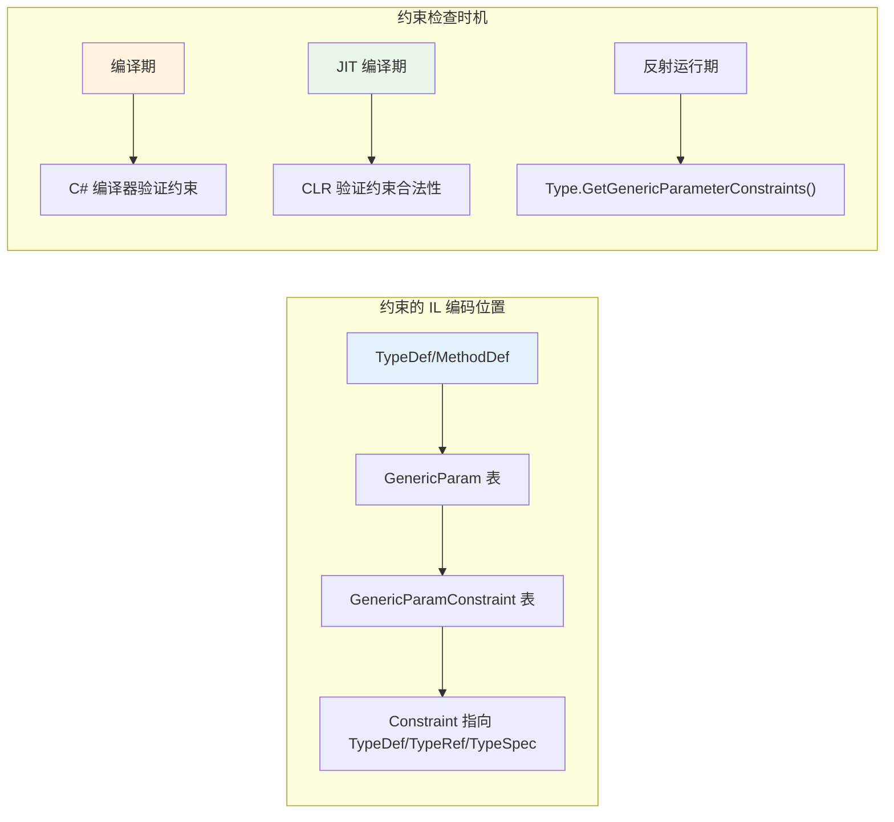

## 二、where 约束的 IL 机制

### 2.1 GenericParam 约束表

在 .NET 元数据中，泛型参数的信息存储在 `GenericParam` 表中，而约束关系存储在 `GenericParamConstraint` 表中。这是 ECMA-335 标准定义的核心元数据结构。

```
┌─────────────────────────────────────────────────────┐
│              元数据表关系                              │
├─────────────────────────────────────────────────────┤
│                                                     │
│  TypeDef / MethodDef                                │
│       │                                             │
│       ▼                                             │
│  GenericParam 表                                    │
│  ┌──────┬──────────┬────────┬──────────────┐        │
│  │ Number │ Owner │ Flags  │ Name         │        │
│  ├──────┼──────────┼────────┼──────────────┤        │
│  │  0    │ 0x02    │ 0x0000 │ T            │        │
│  │  1    │ 0x02    │ 0x0000 │ K            │        │
│  └──────┴──────────┴────────┴──────────────┘        │
│       │                                             │
│       ▼                                             │
│  GenericParamConstraint 表                          │
│  ┌──────────────┬───────────────────────────┐       │
│  │ Owner        │ Constraint                │       │
│  ├──────────────┼───────────────────────────┤       │
│  │ GenericParam[0] │ TypeRef[IComparable`1] │       │
│  │ GenericParam[1] │ TypeRef[IComparable`1] │       │
│  └──────────────┴───────────────────────────┘       │
│                                                     │
└─────────────────────────────────────────────────────┘
```

::: important GenericParam 的 Flags 字段
Flags 字段编码了 `class`/`valuetype` 约束以及方差（variance）标记：
- `0x0000` — 无特殊标记
- `0x0001` — `Covariant`（对应 `out`）
- `0x0002` — `Contravariant`（对应 `in`）
- `0x0004` — `ReferenceTypeConstraint`（对应 `class`）
- `0x0008` — `ValueTypeConstraint`（对应 `struct`）
- `0x0010` — `DefaultConstructorConstraint`（对应 `new()`）
:::

### 2.2 接口约束与基类约束

```csharp
public class ConstraintDemo
    where T : IComparable<T>, ICloneable
    where K : EventArgs
{
    public void Process(T item, K args) { }
}
```

```il
.class public auto ansi beforefieldinit ConstraintDemo
    extends [mscorlib]System.Object
{
    .method public hidebysig instance void Process<
        (class [mscorlib]System.IComparable`1<!!T>,
         class [mscorlib]System.ICloneable) T,
        (class [mscorlib]System.EventArgs) K
    >(!!T item, !!K args) cil managed
    {
        IL_0000: nop
        IL_0001: ret
    }
}
```

注意 IL 中的约束语法：在泛型参数声明的 `<>` 内，约束以 `(constraint1, constraint2)` 的形式列出。

### 2.3 多约束的合并

```csharp
// 多个接口约束：T 必须同时实现所有接口
public static T Max<T>(T a, T b) where T : IComparable<T>
{
    return a.CompareTo(b) > 0 ? a : b;
}

// 基类 + 接口约束
public static void Process<T>(T item)
    where T : EventArgs, ICloneable, IDisposable
{
    item.Clone();          // ICloneable 方法
    item.Dispose();        // IDisposable 方法
}
```

```il
// Max<T> 方法的 IL
.method public hidebysig static !!0 Max<
    (class [mscorlib]System.IComparable`1<!!0>) T
>(!!0 a, !!0 b) cil managed
{
    IL_0000: ldarg.0
    IL_0001: box !!0
    IL_0006: ldarg.1
    IL_0007: ldc.i4.0
    IL_0008: callvirt instance int32 class [mscorlib]System.IComparable`1<!!0>::CompareTo(!0)
    IL_000d: ldc.i4.0
    IL_000e: cgt
    IL_0010: brtrue.s IL_0014
    IL_0012: br.s IL_0018
    IL_0014: ldarg.0
    IL_0015: ret
    IL_0016: ldarg.1
    IL_0017: ret
}
```

::: warning 约束的顺序限制
C# 中约束的顺序有严格规定：
1. 基类约束只能有一个，且必须放在最前面
2. 接口约束可以有多个
3. `class`/`struct` 不能与基类约束同时存在
4. `new()` 必须放在最后

```csharp
// 正确
where T : BaseClass, IFoo, IBar, new()

// 错误：new() 不在最后
where T : new(), IFoo  // 编译错误

// 错误：struct 与基类约束冲突
where T : BaseClass, struct  // 编译错误
```
:::

## 三、new() 约束与 Activator.CreateInstance

### 3.1 new() 约束的 IL 表现

`new()` 约束承诺泛型参数有无参公共构造函数。在 IL 层面，它被编码为 `DefaultConstructorConstraint`（Flags = 0x0010），而编译器会将 `new T()` 调用转换为 `Activator.CreateInstance<T>()`。

```csharp
public static T CreateInstance<T>() where T : new()
{
    return new T();
}
```

```il
.method public hidebysig static !!0 CreateInstance<
    (.ctor) T
>() cil managed
{
    IL_0000: call !!0 [mscorlib]System.Activator::CreateInstance<!!0>()
    IL_0005: ret
}
```

::: important new T() → Activator.CreateInstance<T>()
编译器**绝不会**直接生成 `newobj !!T::ctor()` 指令。因为 JIT 在编译该方法时，还不知道 `T` 的具体类型，无法确定构造函数的调用约定。`Activator.CreateInstance<T>()` 内部通过反射在运行时找到并调用构造函数。

在 .NET 7+ 中，如果使用静态抽象接口成员，可以绕过这个限制，实现编译期已知的构造调用。
:::

### 3.2 Activator.CreateInstance 的内部机制

```csharp
// 简化的 Activator.CreateInstance<T> 实现
public static T CreateInstance<T>()
{
    // 1. 获取 TypeHandle
    RuntimeTypeHandle handle = typeof(T).TypeHandle;

    // 2. 通过 MethodTable 查找 .ctor
    //    在 CLR 内部，这等价于：
    //    MethodTable* pMT = TypeHandle.GetMethodTable();
    //    MethodDesc* pCtor = pMT->GetDefaultConstructor();

    // 3. 调用构造函数
    object obj = RuntimeHelpers.GetUninitializedObject(typeof(T));
    pCtor.Invoke(obj, null);  // 伪代码

    return (T)obj;
}
```

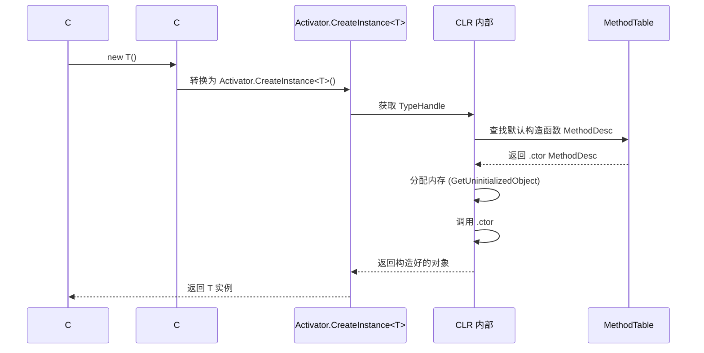

### 3.3 new() 约束的性能代价

```csharp
// 基准测试：new() 约束 vs 直接 new
[MemoryDiagnoser]
public class CreateInstanceBench
{
    [Benchmark(Baseline = true)]
    public MyObj DirectNew() => new MyObj();

    [Benchmark]
    public MyObj NewConstraint() => CreateViaConstraint<MyObj>();

    [Benchmark]
    public MyObj ActivatorCreate() => Activator.CreateInstance<MyObj>();

    private static T CreateViaConstraint<T>() where T : new() => new T();
}

// 结果示例（.NET 8）：
// | Method           | Mean      | Ratio |
// |----------------- |----------:|------:|
// | DirectNew        |  3.2 ns   |  1.00 |
// | NewConstraint    | 18.5 ns   |  5.78 |
// | ActivatorCreate  | 19.1 ns   |  5.97 |
```

::: warning 性能差距显著
`new T()` 通过 `Activator.CreateInstance<T>()` 实现，比直接 `new` 慢约 5-6 倍。在热路径中应避免使用。.NET 7+ 的静态抽象接口成员提供了零开销替代方案（见本章第九节）。
:::

## 四、struct/class 约束与 box/unbox 差异

### 4.1 class 约束

`where T : class` 确保 `T` 一定是引用类型。这意味着：
- `T` 可以为 `null`
- `T` 的变量是引用（指针），不是内联数据
- 不需要装箱（boxing）就可以使用引用类型的语义

```csharp
public static void Swap<T>(ref T a, ref T b) where T : class
{
    T temp = a;
    a = b;
    b = temp;
}

// 使用
string s1 = "hello", s2 = "world";
Swap(ref s1, ref s2);  // OK
// int i1 = 1, i2 = 2;
// Swap(ref i1, ref i2);  // 编译错误：int 不是引用类型
```

```il
.method public hidebysig static void Swap<
    (class) T
>(!!T& a, !!T& b) cil managed
{
    IL_0000: ldarg.0
    IL_0001: ldind.ref          // 因为 class 约束，使用 ldind.ref
    IL_0002: stloc.0
    IL_0003: ldarg.0
    IL_0004: ldarg.1
    IL_0005: ldind.ref
    IL_0006: stind.ref          // stind.ref — 引用赋值
    IL_0007: ldarg.1
    IL_0008: ldloc.0
    IL_0009: stind.ref
    IL_000a: ret
}
```

### 4.2 struct 约束

`where T : struct` 确保 `T` 一定是值类型，且不可为 `null`（排除了 `Nullable<T>` 这种值类型特例，但在 C# 语法层面 `T?` 在 struct 约束下是 `T` 本身，在 class 约束下才是引用类型的 `null`）。

```csharp
public static T? SafeParse<T>(string s) where T : struct
{
    // T 一定是值类型，T? 等价于 Nullable<T>
    try
    {
        return (T)Convert.ChangeType(s, typeof(T));
    }
    catch
    {
        return null;  // Nullable<T> 可以为 null
    }
}

int? result = SafeParse<int>("42");     // 42
int? failed = SafeParse<int>("abc");    // null
```

```il
.method public hidebysig static valuetype [mscorlib]System.Nullable`1<!!0> SafeParse<
    (valuetype .ctor) T
>(string s) cil managed
{
    // 注意泛型参数声明：(valuetype .ctor)
    // valuetype 表示值类型约束
    // .ctor 表示 new() 约束（struct 隐含 new()）

    .try
    {
        IL_0000: ldarg.0
        IL_0001: ldtoken !!0
        IL_0006: call class [mscorlib]System.Type [mscorlib]System.Type::GetTypeFromHandle(...)
        IL_000b: call object [mscorlib]System.Convert::ChangeType(...)
        IL_0010: unbox.any !!0     // 拆箱
        IL_0015: newobj instance void valuetype [mscorlib]System.Nullable`1<!!0>::.ctor(!0)
        IL_001a: ret
    }
    catch [mscorlib]System.Exception
    {
        IL_001b: pop
        IL_001c: ldloca.s result
        IL_001e: initobj valuetype [mscorlib]System.Nullable`1<!!0>
        IL_0024: ldloc.s result
        IL_0026: ret
    }
}
```

### 4.3 struct 与 class 约束的 box/unbox 差异

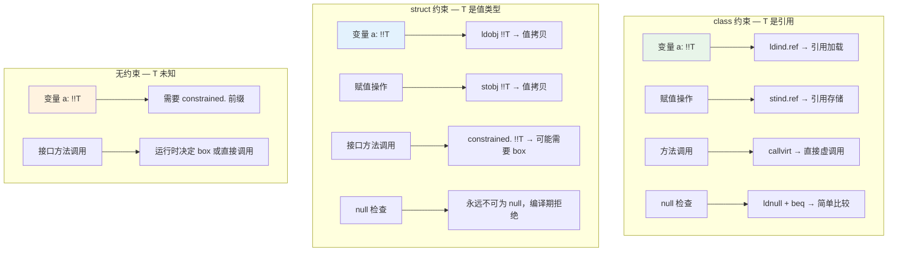

```csharp
// constrained. 前缀的妙用
public static string GetString<T>(T item)
{
    return item.ToString();  // 编译器不知道 T 是值类型还是引用类型
}

// 当 T 是值类型且 ToString 被重写时，constrained. 允许直接调用（不装箱）
// 当 T 是引用类型时，constrained. 变为 callvirt
// 当 T 是值类型但 ToString 未重写时，constrained. 触发装箱
```

```il
.method public hidebysig static string GetString<T>(!!T item) cil managed
{
    IL_0000: ldarga.s item
    IL_0002: constrained. !!T       // 关键前缀！
    IL_0008: callvirt instance string [mscorlib]System.Object::ToString()
    IL_000d: ret
}
```

::: tip constrained. 指令的智能分派
`constrained. !!T` 是 CLR 提供的"智能前缀"，它让 `callvirt` 在不同约束场景下自动选择最优调用方式：
1. **T 是引用类型** → 普通 `callvirt`（虚方法调度）
2. **T 是值类型且方法被重写** → 直接 `call`（无虚调度、无装箱）
3. **T 是值类型且方法未重写（如 Object.Equals）** → 先 `box` 再 `callvirt`

这就是为什么 `struct` 约束下的方法调用可能比无约束更高效 —— JIT 可以在编译期确定调用策略。
:::

### 4.4 struct 约束隐含 new()

在 C# 中，`where T : struct` 隐含了 `new()` 约束，因为所有值类型都有隐式无参构造函数（将内存置零）。但在 IL 中，这一点被显式编码：

```csharp
// C# 代码
where T : struct

// 等价于
where T : struct, new()    // new() 是多余的但合法
```

```il
// IL 中的表现：valuetype 和 .ctor 都出现了
.method public static void Method<
    (valuetype .ctor) T       // valuetype = struct, .ctor = new()
>(!!T item) cil managed { ... }
```

## 五、unmanaged 约束

### 5.1 非托管类型的定义

C# 7.3 引入了 `unmanaged` 约束，要求 `T` 是非托管类型 —— 不包含任何引用类型字段的类型。

```csharp
public static byte* Allocate<T>(int count) where T : unmanaged
{
    // T 是非托管类型，可以直接做指针操作
    return (byte*)NativeMemory.Alloc((nuint)(count * sizeof(T)));
}

// 合法的 unmanaged 类型
Allocate<int>(10);           // OK
Allocate<double>(10);        // OK
Allocate<Guid>(10);          // OK（全是值类型字段）

// 非法的 unmanaged 类型
// Allocate<string>(10);    // 编译错误：string 是引用类型
// Allocate<object>(10);    // 编译错误
```

```il
.method public hidebysig static uint8* Allocate<
    (unmanaged) T            // unmanaged 约束标记
>(int32 count) cil managed
{
    IL_0000: ldarg.0
    IL_0001: sizeof !!T      // sizeof 在编译期可求值
    IL_0007: mul
    IL_0008: conv.i8
    IL_0009: conv.u8
    IL_000a: call void* [System.Runtime]System.Runtime.InteropServices.NativeMemory::Alloc(...)
    IL_000f: ret
}
```

::: important unmanaged 约束的递归检查
CLR 对 unmanaged 的检查是递归的：类型的每个字段的类型也必须是非托管的。例如：

```csharp
struct Good { int x; double y; }         // unmanaged ✓
struct Bad1 { int x; string name; }      // 不是 unmanaged ✗（有 string）
struct Bad2 { int x; Good g; }           // unmanaged ✓（Good 也是 unmanaged）
struct Bad3 { int x; Bad1 b; }           // 不是 unmanaged ✗（Bad1 包含 string）
```
:::

### 5.2 unmanaged 与指针操作

```csharp
// unmanaged 约束允许的指针操作
public static void Copy<T>(T[] source, T[] destination) where T : unmanaged
{
    fixed (T* src = source)
    fixed (T* dst = destination)
    {
        Buffer.MemoryCopy(src, dst, sizeof(T) * destination.Length, sizeof(T) * source.Length);
    }
}

// unmanaged 与 Span 交互
public static Span<T> AsSpan<T>(void* ptr, int length) where T : unmanaged
{
    return new Span<T>(ptr, length);   // Span<T> 要求 T : unmanaged（在 .NET 7+ 中）
}
```

## 六、协变（Covariance）与逆变（Contravariance）

### 6.1 什么是方差（Variance）

方差描述了类型参数之间的赋值兼容性关系。考虑：

```csharp
object o = "hello";          // OK：string 是 object 的子类
List<object> list = new List<string>();  // 编译错误！
IEnumerable<object> en = new List<string>(); // OK！
```

为什么 `List<object> = List<string>` 不合法，而 `IEnumerable<object> = IEnumerable<string>` 合法？答案在于**方差**。

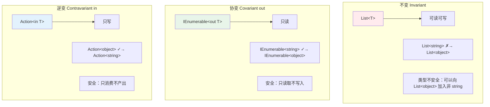

### 6.2 协变 out — 输出位置安全

协变（`out`）表示类型参数只出现在**输出位置**（返回值、只读属性）。这意味着可以将 `IEnumerable<Derived>` 赋值给 `IEnumerable<Base>`。

```csharp
// IEnumerable<out T> 的定义
public interface IEnumerable<out T> : IEnumerable
{
    IEnumerator<T> GetEnumerator();
}

// 因为 T 只出现在输出位置，所以这是安全的：
IEnumerable<string> strings = new List<string> { "a", "b" };
IEnumerable<object> objects = strings;  // OK！协变转换

foreach (object o in objects)  // 读取出来都是 string → 也是 object
{
    Console.WriteLine(o);
}
```

```il
// 协变接口的 IL 声明
.class interface public abstract auto ansi
    IEnumerable`1<+ T>     // + 号表示协变（Covariant）
{
    .method public hidebysig newslot abstract virtual
        instance class IEnumerator`1<!!0> GetEnumerator() cil managed
}
```

::: important IL 中的方差标记
- `+T` 或 `<+ T>` 表示 **Covariant**（协变，对应 C# 的 `out`）
- `-T` 或 `<- T>` 表示 **Contravariant**（逆变，对应 C# 的 `in`）
- 无标记表示 **Invariant**（不变）

这些标记在 `GenericParam` 表的 `Flags` 字段中编码：
- `0x0001` = Covariant
- `0x0002` = Contravariant
:::

### 6.3 逆变 in — 输入位置安全

逆变（`in`）表示类型参数只出现在**输入位置**（方法参数）。这意味着可以将 `Action<Base>` 赋值给 `Action<Derived>`。

```csharp
// Action<in T> 的定义
public delegate void Action<in T>(T obj);

// 因为 T 只出现在输入位置，所以这是安全的：
Action<object> printObject = o => Console.WriteLine(o);
Action<string> printString = printObject;  // OK！逆变转换

printString("hello");  // 传给 Action<string> 的 string 也会传给 Action<object>，string 是 object，安全
```

```il
// 逆变委托的 IL 声明
.class public auto ansi sealed Action`1<- T>     // - 号表示逆变（Contravariant）
    extends [mscorlib]System.MulticastDelegate
{
    .method public hidebysig newslot virtual
        instance void Invoke(!0 obj) cil managed   // !0 = T，出现在输入位置
}
```

### 6.4 协变逆变的类型安全证明

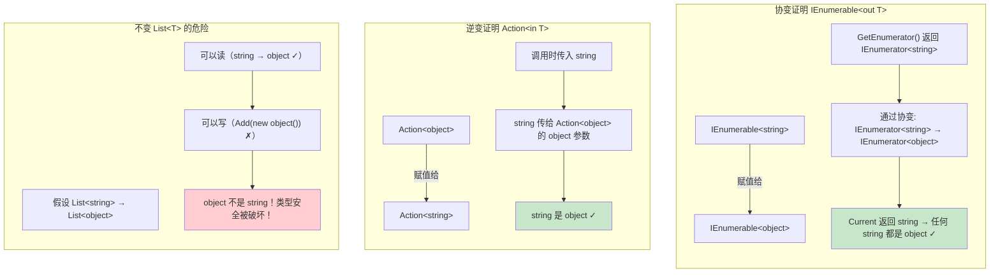

### 6.5 方差转换规则

| 源类型 | 目标类型 | 转换条件 | 示例 |
|--------|----------|----------|------|
| `IEnumerable<Derived>` | `IEnumerable<Base>` | T 是协变(out)，Derived → Base | `IEnumerable<string>` → `IEnumerable<object>` |
| `Action<Base>` | `Action<Derived>` | T 是逆变(in)，Base → Derived 方向 | `Action<object>` → `Action<string>` |
| `List<Derived>` | `List<Base>` | T 不变，**不可转换** | 编译错误 |
| `IEnumerable<Derived>` | `IEnumerable<Derived>` | 相同类型，无需转换 | 恒等 |
| `Func<Base, Derived>` | `Func<Base, Base>` | T1 逆变(in), T2 协变(out) | 输入更宽，输出更窄 |

## 七、数组协变与类型安全

### 7.1 数组协变

C# 中数组是协变的，但这是**不安全**的协变：

```csharp
string[] strings = new string[] { "a", "b", "c" };
object[] objects = strings;        // OK！数组协变

objects[0] = 42;                   // 运行时异常！ArrayTypeMismatchException
```

为什么这是不安全的？因为数组是可变的（可读写），而协变只对只读容器安全。

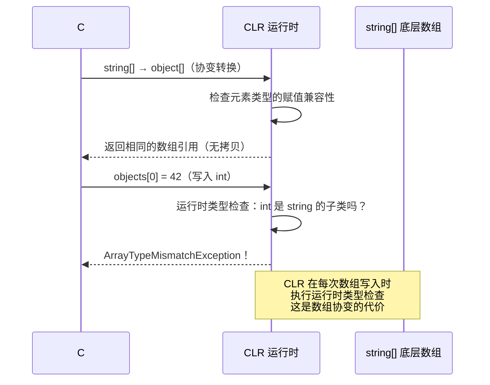

### 7.2 数组协变的 IL 实现

```csharp
object[] GetArray()
{
    string[] strings = new string[3];
    object[] objects = strings;    // 数组协变
    return objects;
}
```

```il
.method private hidebysig instance object[] GetArray() cil managed
{
    IL_0000: ldc.i4.3
    IL_0001: newarr [mscorlib]System.String
    IL_0006: stloc.0

    // 数组协变：直接赋值，不做任何转换
    // string[] 是 object[] 的子类型（CLR 内建规则）
    IL_0007: ldloc.0
    IL_0008: stloc.1         // objects = strings（同一引用）

    IL_0009: ldloc.1
    IL_000a: ret
}
```

```il
// 数组写入时的类型检查
.method public hidebysig instance void SetElement(object[] arr, int32 index, object value) cil managed
{
    IL_0000: ldarg.1
    IL_0001: ldarg.2
    IL_0002: ldarg.3
    IL_0003: stelem.ref       // stelem.ref 包含运行时类型检查！
    IL_0004: ret
}
// stelem.ref 内部逻辑：
// 1. 获取数组元素类型（string）
// 2. 检查 value 是否兼容（42 是 int，不兼容）
// 3. 不兼容则抛出 ArrayTypeMismatchException
```

::: warning 数组协变的性能代价
每次对协变数组执行 `stelem.ref` 时，CLR 都会执行运行时类型检查。在高性能场景中，应避免使用数组协变，改用泛型集合。
:::

### 7.3 值类型数组不支持协变

```csharp
int[] ints = new int[] { 1, 2, 3 };
// object[] objects = ints;  // 编译错误！值类型数组不支持协变

// 原因：int[] 的内存布局是紧凑的 int 值序列
// object[] 需要的是引用序列
// 两者内存布局完全不兼容
```

## 八、IEnumerable\<out T\> 原理

### 8.1 IEnumerable 的协变定义

```csharp
// .NET BCL 中的定义
public interface IEnumerable<out T> : IEnumerable
{
    new IEnumerator<T> GetEnumerator();
}

public interface IEnumerator<out T> : IDisposable, IEnumerator
{
    T Current { get; }   // T 只在输出位置
}
```

```il
// IEnumerable`1 的 IL 声明
.class interface public abstract auto ansi IEnumerable`1<+ T>
    implements IEnumerable
{
    .method public hidebysig newslot abstract virtual
        instance class IEnumerator`1<!!0> GetEnumerator() cil managed
}

// IEnumerator`1 的 IL 声明
.class interface public abstract auto ansi IEnumerator`1<+ T>
    implements IDisposable, IEnumerator
{
    .property instance !0 Current()
    {
        .get instance !0 get_Current()
    }
}
```

### 8.2 协变转换的运行时行为

```csharp
List<string> stringList = new List<string> { "hello", "world" };
IEnumerable<object> objectEnum = stringList;  // 协变转换

// 运行时到底发生了什么？
// 1. 没有创建新的集合对象
// 2. 没有拷贝任何元素
// 3. 只是同一个引用，赋予了不同类型的变量
// 4. CLR 验证了方差规则后允许这个赋值

Console.WriteLine(ReferenceEquals(stringList, objectEnum));  // True！
```

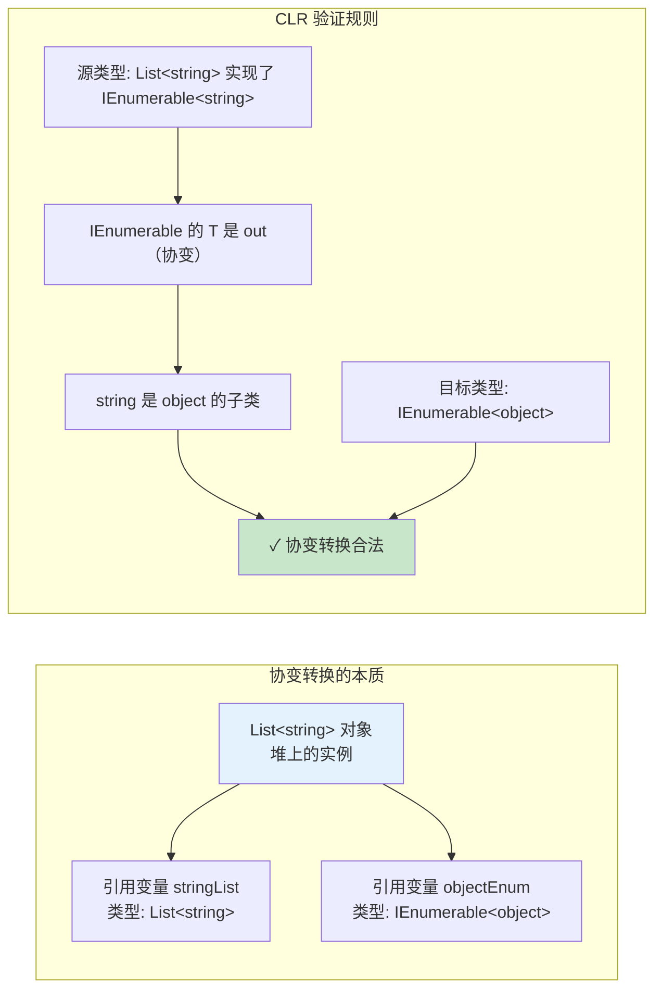

### 8.3 协变接口的方法调度

当通过协变接口调用方法时，CLR 需要进行类型替换：

```csharp
IEnumerable<string> strings = new List<string>();
IEnumerable<object> objects = strings;  // 协变

// 调用 GetEnumerator
IEnumerator<object> enumerator = objects.GetEnumerator();
// CLR 实际调用的是 IEnumerable<string>.GetEnumerator()
// 返回 IEnumerator<string>
// 然后通过协变转换为 IEnumerator<object>

object item = enumerator.Current;
// 实际调用 IEnumerator<string>.Current（返回 string）
// string 是 object，隐式引用转换
```

## 九、Action\<in T\> 原理

### 9.1 Action 的逆变定义

```csharp
// .NET BCL 中的定义
public delegate void Action<in T>(T obj);
```

```il
.class public auto ansi sealed Action`1<- T>
    extends [mscorlib]System.MulticastDelegate
{
    .method public hidebysig specialname rtspecialname
        instance void .ctor(object object, native int method) cil managed

    .method public hidebysig newslot virtual
        instance void Invoke(!0 obj) cil managed

    .method public hidebysig newslot virtual
        instance class [mscorlib]System.IAsyncResult BeginInvoke(
            !0 obj,
            class [mscorlib]System.AsyncCallback callback,
            object object) cil managed

    .method public hidebysig newslot virtual
        instance void EndInvoke(
            class [mscorlib]System.IAsyncResult result) cil managed
}
```

### 9.2 逆变的实际使用

```csharp
// 逆变的典型场景：处理器/消费者模式
void ProcessItems<T>(IEnumerable<T> items, Action<T> processor)
{
    foreach (T item in items)
    {
        processor(item);
    }
}

// 可以用 Action<object> 处理 List<string>
Action<object> printObj = o => Console.WriteLine(o.GetType().Name);
List<string> names = new() { "Alice", "Bob" };

// Action<object> → Action<string>（逆变转换）
ProcessItems(names, printObj);  // OK！
// 传入的每个 string 会被传给 Action<object>，string 是 object，安全

// 等价于：
Action<string> printStr = printObj;  // 逆变转换
ProcessItems(names, printStr);
```

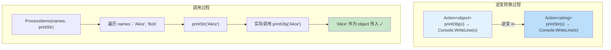

### 9.3 Func 的协变逆变

`Func<in T, out TResult>` 同时使用了逆变和协变：

```csharp
// Func 的定义
public delegate TResult Func<in T, out TResult>(T arg);
//                          ↑ in (逆变)    ↑ out (协变)

// 使用示例
Func<object, string> func1 = o => o.ToString();
Func<string, object> func2 = func1;  // 逆变+协变，双重安全

// T 逆变：string → object 方向（输入更宽）
// TResult 协变：string → object 方向（输出更窄）
// 调用 func2("hello") 时：
// 1. "hello" 传给 func1 的 object 参数 — string 是 object ✓
// 2. func1 返回 string — string 是 object ✓
```

```il
.class public auto ansi sealed Func`2<- T, + TResult>
    extends [mscorlib]System.MulticastDelegate
{
    .method public hidebysig newslot virtual
        instance !1 Invoke(!0 arg) cil managed
    // !0 = T (in/逆变)，!1 = TResult (out/协变)
}
```

## 十、协变逆变与重载决议

### 10.1 方差转换与隐式转换

协变逆变转换属于**隐式引用转换**（implicit reference conversion），在重载决议中会影响候选方法的选择。

```csharp
public class OverloadDemo
{
    public void Process(IEnumerable<string> items)
    {
        Console.WriteLine("string version");
    }

    public void Process(IEnumerable<object> items)
    {
        Console.WriteLine("object version");
    }
}

var demo = new OverloadDemo();
List<string> list = new() { "a", "b" };

// demo.Process(list);  // 编译错误：两个重载都匹配，歧义！
// 因为 IEnumerable<out T> 是协变的：
// List<string> → IEnumerable<string> ✓
// List<string> → IEnumerable<object> ✓（协变转换）
// 两者都是隐式引用转换，编译器无法选择
```

::: warning 协变导致的重载歧义
当方法重载仅在泛型参数上不同，且泛型参数有方差修饰时，容易产生歧义。最佳实践是避免这种重载设计。
:::

### 10.2 方差转换的优先级

```csharp
public class PriorityDemo
{
    public void Handle(Action<string> action)
    {
        Console.WriteLine("Action<string>");
    }

    public void Handle(Action<object> action)
    {
        Console.WriteLine("Action<object>");
    }
}

var demo = new PriorityDemo();
Action<object> act = o => { };

demo.Handle(act);
// 输出：Action<object>
// Action<object> → Action<string> 是逆变转换
// Action<object> → Action<object> 是恒等转换
// 恒等转换优于逆变转换

Action<string> actStr = s => { };
demo.Handle(actStr);
// 输出：Action<string>
// Action<string> → Action<string> 是恒等转换
// Action<string> → Action<object> 不是合法转换（逆变方向反了）
```

### 10.3 方差转换链

```csharp
// 方差转换可以链接
IEnumerable<string> strings = new List<string>();
IEnumerable<object> objects = strings;          // 协变转换

// 但不能跳级（方差只适用于直接继承关系）
// IEnumerable<Exception> exceptions = new List<ArgumentException>();
// IEnumerable<object> objs = exceptions;  // OK
// 但不能从 List<ArgumentException> 直接推断两步

// 方差转换的可传递性
Func<string, string> f1 = s => s.ToUpper();
Func<string, object> f2 = f1;    // TResult 协变
Func<object, object> f3 = f2;    // T 逆变
Func<object, string> f4 = f1;    // 双重方差
```

## 十一、ref struct 不能做泛型参数

### 11.1 ref struct 的限制

C# 7.2 引入了 `ref struct`，它只能存在于栈上。CLR 的泛型系统不支持 ref struct 作为泛型参数，因为泛型可能将值装箱到堆上。

```csharp
public ref struct SpanLike<T>
{
    private readonly ref T _value;
    // 这是一个 ref struct，包含 byref 字段
}

// List<SpanLike<int>> list;   // 编译错误！
// SpanLike<int>[] array;      // 编译错误！
// Func<SpanLike<int>> func;   // 编译错误！

void Process<T>(T item) { }     // T 可以是任何类型参数
// Process(spanLike);           // 编译错误！ref struct 不能做泛型参数
```

### 11.2 限制的根本原因

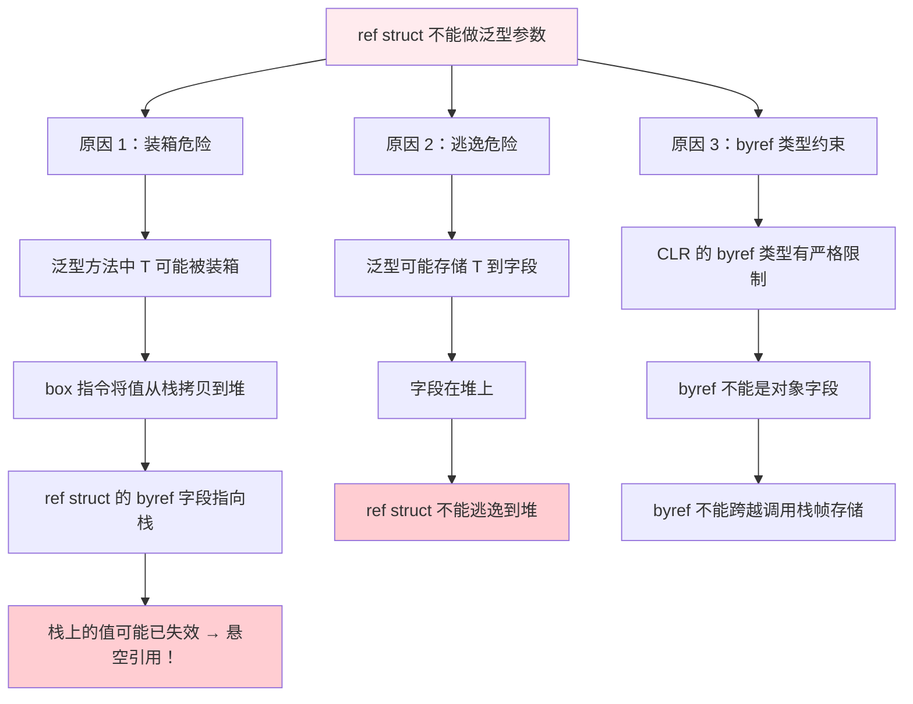

### 11.3 ref struct 与特化泛型

虽然 ref struct 不能做泛型参数，但 .NET 通过 `Span<T>` 的特殊实现绕过了这个限制。`Span<T>` 本身是 ref struct，它的泛型参数 `T` 是普通类型参数，不是 ref struct：

```csharp
// Span<T> 本身是 ref struct
public readonly ref struct Span<T>
{
    private readonly ref T _reference;   // byref 字段
    private readonly int _length;
}

// T 是普通类型参数，不是 ref struct
Span<int> intSpan = stackalloc int[10];    // OK
Span<string> strSpan = new string[5];      // OK
// Span<Span<int>> nestedSpan;             // 编译错误！ref struct 不能做泛型参数
```

### 11.4 .NET 7+ 的 allows ref struct 泛型约束

.NET 7 引入了 `allows ref struct` 反向约束，允许泛型参数接受 ref struct：

```csharp
// .NET 7+ 新语法
public static void Process<T>(T value)
    where T : allows ref struct    // 反向约束：允许 T 是 ref struct
{
    // T 可能是 ref struct，因此有额外限制：
    // - 不能装箱 T
    // - 不能将 T 存储到堆上
    // - 不能在 lambda/async 中捕获 T
}

// 使用
Span<int> span = stackalloc int[10];
Process(span);           // OK！
Process(42);             // OK！int 不是 ref struct 也可以
```

```il
// allows ref struct 的 IL 编码
.method public hidebysig static void Process<
    T
>(!!T value) cil managed
{
    // 注意：在 IL 层面，allows ref struct 不改变泛型参数的元数据
    // 它是编译器的一个"许可标记"，告诉编译器允许传入 ref struct
    // CLR 验证器会确保方法体中没有对 !!T 执行 box 等非法操作
    IL_0000: ret
}
```

::: important allows ref struct 是编译器特性
`allows ref struct` 不改变 IL 元数据。它是编译器的"许可信号"，允许编译器接受 ref struct 作为泛型参数。编译器仍然会验证方法体中不会对 `T` 执行非法操作（如装箱、存储到堆等）。
:::

## 十二、.NET 7+ 静态抽象接口成员与泛型数学运算

### 12.1 静态抽象接口成员

.NET 7 引入了静态抽象接口成员（static abstract interface members），这是泛型系统的一次重大革新。它允许接口定义静态方法（包括运算符），泛型参数可以通过约束调用这些静态方法。

```csharp
// 定义含静态抽象成员的接口
public interface IAdditionOperators<TSelf, TOther, TResult>
    where TSelf : IAdditionOperators<TSelf, TOther, TResult>?
{
    static abstract TResult operator +(TSelf left, TOther right);
}

// 实现接口
public record struct Vector2(double X, double Y)
    : IAdditionOperators<Vector2, Vector2, Vector2>
{
    public static Vector2 operator +(Vector2 left, Vector2 right)
        => new(left.X + right.X, left.Y + right.Y);
}
```

### 12.2 泛型数学运算

静态抽象成员使得泛型数学运算成为可能，不再需要 `dynamic` 或 `Activator.CreateInstance`：

```csharp
// 以前：无法对泛型 T 做算术运算
// 现在：通过静态抽象接口成员

public static T Sum<T>(params T[] values)
    where T : IAdditionOperators<T, T, T>, IAdditiveIdentity<T, T>
{
    T sum = T.AdditiveIdentity;  // 静态属性
    foreach (T value in values)
    {
        sum = sum + value;       // 静态运算符
    }
    return sum;
}

// 使用
int intSum = Sum(1, 2, 3, 4, 5);           // 15
double doubleSum = Sum(1.1, 2.2, 3.3);     // 6.6
Vector2 vecSum = Sum(new(1,2), new(3,4));  // Vector2(4, 6)
```

```il
// Sum<T> 的 IL（简化）
.method public hidebysig static !!0 Sum<
    (class [System.Runtime]System.Numerics.IAdditionOperators`2<!!0, !!0, !!0>,
     class [System.Runtime]System.Numerics.IAdditiveIdentity`2<!!0, !!0>) T
>(!!0[] values) cil managed
{
    IL_0000: call !!0 class [System.Runtime]System.Numerics.IAdditiveIdentity`2<!!0, !!0>::get_AdditiveIdentity()
    IL_0005: stloc.0

    IL_0006: br.s IL_0018
    IL_0008: ldloc.0
    IL_0009: ldloc.1
    IL_000a: ldelem !!0
    IL_000f: call !!0 class [System.Runtime]System.Numerics.IAdditionOperators`2<!!0, !!0, !!0>::op_Addition(!0, !0)
    IL_0014: stloc.0
    IL_0018: ldloc.2
    IL_0019: ldloc.1
    IL_001a: blt.s IL_0008

    IL_001c: ldloc.0
    IL_001d: ret
}
```

### 12.3 静态抽象 vs new() 约束

```csharp
// old way: new() 约束 + Activator.CreateInstance（反射，慢）
public static T CreateOld<T>() where T : new()
{
    return new T();  // → Activator.CreateInstance<T>()
}

// new way: 静态抽象接口成员（直接调用，快）
public interface IFactory<T> where T : IFactory<T>
{
    static abstract T Create();
}

public static T CreateNew<T>() where T : IFactory<T>
{
    return T.Create();  // 直接静态调用，无反射！
}
```

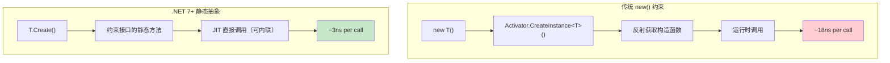

### 12.4 INumber\<T\> 与通用数学

.NET 7 引入了一整套数学接口层次结构：

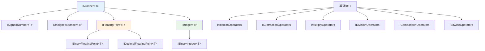

```csharp
// 使用 INumber<T> 实现通用数学
public static T Average<T>(params T[] values)
    where T : INumber<T>
{
    T sum = T.Zero;
    foreach (T value in values)
    {
        sum += value;
    }
    return sum / T.CreateChecked(values.Length);
}

// 支持所有数值类型
int avg1 = Average(1, 2, 3, 4, 5);              // 3
double avg2 = Average(1.5, 2.5, 3.5);           // 2.5
decimal avg3 = Average(1.0m, 2.0m, 3.0m);       // 2.0m
```

### 12.5 静态抽象的 IL 实现细节

```csharp
public interface IStaticFactory<T> where T : IStaticFactory<T>
{
    static abstract T Create();
    static virtual string Name => typeof(T).Name;
}
```

```il
.class interface private abstract auto ansi IStaticFactory`1<
    (class IStaticFactory`1<!!0>) T
>
{
    // 静态抽象方法
    .method public hidebysig newslot abstract static
        !!0 Create() cil managed

    // 静态虚方法（有默认实现）
    .method public hidebysig newslot static
        string get_Name() cil managed
    {
        IL_0000: ldtoken !!0
        IL_0005: call class [mscorlib]System.Type System.Type::GetTypeFromHandle(...)
        IL_000a: callvirt instance string [mscorlib]System.Type::get_Name()
        IL_000f: ret
    }

    .property string Name()
    {
        .get string get_Name()
    }
}
```

::: important 静态抽象方法的调度机制
静态抽象/虚接口成员的调度与传统接口方法不同：
1. **传统接口方法**：通过实例的虚方法表（vtable）调度
2. **静态抽象接口方法**：通过类型的方法表（MethodTable）直接调度，无需实例

JIT 在编译泛型方法时，知道约束接口有哪些静态成员，因此可以生成直接的静态调用指令，而非虚调用。这使得静态抽象方法可以被内联，性能与直接调用相当。
:::

## 十三、约束的元数据验证

### 13.1 编译期验证 vs 运行期验证

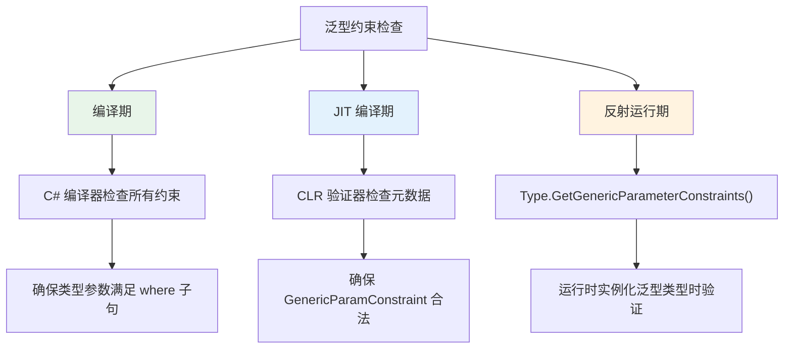

### 13.2 通过反射获取约束信息

```csharp
Type openType = typeof(Dictionary<,>);
Type[] typeArgs = openType.GetGenericArguments();

foreach (Type typeArg in typeArgs)
{
    Console.WriteLine($"类型参数: {typeArg.Name}");
    Console.WriteLine($"  约束:");

    Type[] constraints = typeArg.GetGenericParameterConstraints();
    foreach (Type constraint in constraints)
    {
        Console.WriteLine($"    {constraint.Name}");
    }

    GenericParameterAttributes attrs = typeArg.GenericParameterAttributes;
    if (attrs.HasFlag(GenericParameterAttributes.ReferenceTypeConstraint))
        Console.WriteLine("    class 约束");
    if (attrs.HasFlag(GenericParameterAttributes.NotNullableValueTypeConstraint))
        Console.WriteLine("    struct 约束");
    if (attrs.HasFlag(GenericParameterAttributes.DefaultConstructorConstraint))
        Console.WriteLine("    new() 约束");
    if (attrs.HasFlag(GenericParameterAttributes.Covariant))
        Console.WriteLine("    out（协变）");
    if (attrs.HasFlag(GenericParameterAttributes.Contravariant))
        Console.WriteLine("    in（逆变）");
}

// 输出：
// 类型参数: TKey
//   约束:
//     （Dictionary<TKey,TValue> 的 TKey 无特殊约束）
// 类型参数: TValue
//   约束:
//     （无特殊约束）
```

### 13.3 运行时约束违反的后果

```csharp
// 通过反射绕过编译期检查（危险！）
public class Violation
{
    public static void DangerousCall()
    {
        // 正常编译不可能通过，但通过反射可以绕过约束
        Type openType = typeof(ConstrainedClass<>);

        // 尝试用不满足约束的类型实例化
        Type closedType = openType.MakeGenericType(typeof(string));  // 如果约束是 struct
        // CLR 验证器会在此时抛出 TypeLoadException
    }
}

public class ConstrainedClass<T> where T : struct { }
```

::: warning 反射不能绕过运行时验证
即使通过反射构造泛型类型，CLR 的类型加载器仍然会验证约束。如果不满足约束，会抛出 `TypeLoadException`。约束安全性由 CLR 保证，不仅依赖编译器。
:::

## 十四、方差在委托中的实现

### 14.1 委托的方差转换

```csharp
// 委托实例的方差转换
Func<string> stringFunc = () => "hello";
Func<object> objectFunc = stringFunc;  // 协变转换

Action<object> objectAction = o => Console.WriteLine(o);
Action<string> stringAction = objectAction;  // 逆变转换

// 多参数委托的混合方差
Func<object, string, int> func1 = (o, s) => 0;
// Func 的定义: Func<in T1, in T2, out TResult>
// T1: object → string（逆变方向）❌ 不合法
// 所以不能将 Func<object, string, int> 转换为 Func<string, string, int>
```

### 14.2 委托合并与方差

```csharp
// 多播委托的方差
Action<object> a1 = o => Console.WriteLine($"1: {o}");
Action<object> a2 = o => Console.WriteLine($"2: {o}");

Action<object> combined = a1 + a2;       // 合并
Action<string> stringAction = combined;  // 逆变转换

stringAction("test");
// 输出：
// 1: test
// 2: test
```

## 十五、方差与泛型继承

### 15.1 泛型类型的继承与方差

```csharp
// 泛型类可以继承泛型接口
public class MyCollection<T> : IEnumerable<T>
{
    private List<T> _items = new();

    public IEnumerator<T> GetEnumerator() => _items.GetEnumerator();
    IEnumerator IEnumerable.GetEnumerator() => GetEnumerator();
}

// 因为 IEnumerable<out T> 是协变的：
MyCollection<string> strings = new();
IEnumerable<object> objects = strings;  // 协变转换

// 但 List<T> 实现了 IList<T>（不变），所以：
// IList<object> list = new List<string>();  // 编译错误
```

### 15.2 泛型接口的多重实现与方差冲突

```csharp
// 一个类型同时实现协变和不变的接口
public interface IReadOnly<out T> { T Get(); }
public interface IMutable<T> { void Set(T value); }

public class Box<T> : IReadOnly<T>, IMutable<T>
{
    private T _value;
    public T Get() => _value;
    public void Set(T value) => _value = value;
}

Box<string> box = new();
IReadOnly<object> readOnly = box;    // OK：协变
// IMutable<object> mutable = box;   // 编译错误：IMutable 不变

// 通过协变接口只能读取，不能写入——类型安全！
object val = readOnly.Get();         // OK
```

## 十六、约束与方差的完整规则表

### 16.1 方差规则总结

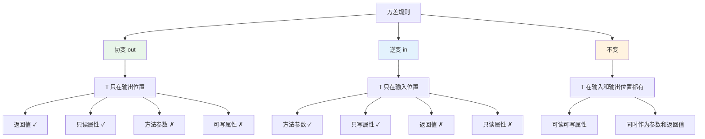

### 16.2 约束与方差的交互

| 约束 | 对方差的影响 | 说明 |
|------|------------|------|
| `where T : class` | 允许协变/逆变 | 引用类型才能做方差转换 |
| `where T : struct` | 不允许方差 | 值类型需要装箱，破坏方差安全 |
| 接口约束 | 不影响方差 | 约束只限制类型，不改变方差方向 |
| `new()` | 不影响方差 | 构造约束与方差无关 |
| `unmanaged` | 不允许方差 | 非托管类型是值类型 |

::: info 值类型不参与方差转换
方差转换本质上是引用转换——不改变底层对象，只改变观察类型。值类型的内存布局与引用类型不同（没有对象头、没有方法表指针），因此值类型泛型实例化之间不存在方差关系。`IEnumerable<int>` 不能协变转换为 `IEnumerable<object>`。
:::

## 十七、实战：实现一个类型安全的事件系统

```csharp
// 利用协变逆变构建类型安全的事件总线
public interface IEventHandler<in TEvent>
{
    void Handle(TEvent eventData);
}

public class EventBus
{
    private readonly Dictionary<Type, List<Delegate>> _handlers = new();

    public void Subscribe<TEvent>(IEventHandler<TEvent> handler)
        where TEvent : notnull
    {
        Type eventType = typeof(TEvent);
        if (!_handlers.TryGetValue(eventType, out var list))
        {
            list = new List<Delegate>();
            _handlers[eventType] = list;
        }
        list.Add(handler.Handle);
    }

    public void Publish<TEvent>(TEvent eventData) where TEvent : notnull
    {
        Type eventType = typeof(TEvent);

        // 处理精确匹配
        if (_handlers.TryGetValue(eventType, out var handlers))
        {
            foreach (var handler in handlers)
            {
                ((Action<TEvent>)handler)(eventData);
            }
        }

        // 处理基类匹配（逆变生效）
        Type? baseType = eventType.BaseType;
        while (baseType != null && baseType != typeof(object))
        {
            if (_handlers.TryGetValue(baseType, out var baseHandlers))
            {
                foreach (var handler in baseHandlers)
                {
                    // 逆变：Action<BaseEvent> 可以处理 DerivedEvent
                    ((Action<TEvent>)(object)handler)(eventData);
                }
            }
            baseType = baseType.BaseType;
        }
    }
}

// 定义事件层次
public record BaseEvent(DateTime Timestamp);
public record UserCreatedEvent(string UserName, DateTime Timestamp) : BaseEvent(Timestamp);
public record OrderPlacedEvent(string OrderId, DateTime Timestamp) : BaseEvent(Timestamp);

// 通用事件处理器（利用逆变）
public class BaseEventHandler : IEventHandler<BaseEvent>
{
    public void Handle(BaseEvent eventData)
    {
        Console.WriteLine($"[事件] 时间: {eventData.Timestamp}");
    }
}

// 使用
var bus = new EventBus();
bus.Subscribe<BaseEvent>(new BaseEventHandler());  // 订阅基类事件

bus.Publish(new UserCreatedEvent("Alice", DateTime.Now));   // BaseEventHandler 会处理
bus.Publish(new OrderPlacedEvent("ORD-001", DateTime.Now));  // BaseEventHandler 会处理
```

## 十八、总结

```mermaid
mindmap
  root((泛型约束与协变逆变))
    泛型约束
      where T : Interface
        GenericParamConstraint 表
        接口方法直接调用
      where T : class/struct
        class → ldind.ref / stind.ref
        struct → constrained. 优化
        struct 隐含 new()
      where T : new()
        Activator.CreateInstance
        反射开销 ~5-6x
      where T : unmanaged
        C# 7.3+
        指针操作 / sizeof
      allows ref struct
        .NET 7+
        编译器许可标记
    协变逆变
      协变 out
        输出位置安全
        IEnumerable&lt;out T&gt;
        IL: +T 标记
      逆变 in
        输入位置安全
        Action&lt;in T&gt;
        IL: -T 标记
      数组协变
        不安全的协变
        ArrayTypeMismatchException
      值类型不参与
        需要装箱
        破坏方差安全
    .NET 7+ 静态抽象
      静态抽象接口成员
      泛型数学运算
      INumber&lt;T&gt;
      零开销 new() 替代
```

::: tip 核心要点回顾
1. **约束是类型安全的基石** — 从 `GenericParam` 表到 JIT 代码生成，约束贯穿了整个泛型系统
2. **协变 out = 只读安全** — `IEnumerable<out T>` 让 `IEnumerable<string>` 可以赋给 `IEnumerable<object>`
3. **逆变 in = 只写安全** — `Action<in T>` 让 `Action<object>` 可以赋给 `Action<string>`
4. **数组协变是历史包袱** — 不安全但有运行时检查保护
5. **ref struct 与泛型的矛盾** — 通过 `allows ref struct` 部分解决
6. **静态抽象接口成员是未来** — 让泛型数学运算成为零开销现实
:::
