# 堆与栈的内存模型

> 理解 CLR 内存模型，是从"写代码"到"理解代码在机器上如何运行"的关键跨越。线程栈管理局部状态，托管堆管理共享对象，两者协作构成了 .NET 运行的地基。

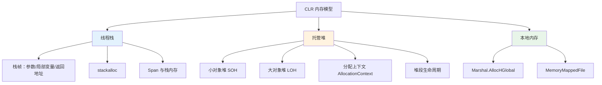

## 一、进程内存布局

### 1.1 Windows 进程地址空间

在深入 CLR 之前，先理解进程的内存布局：

```
┌──────────────────────────────────────────────┐ 0xFFFFFFFFFFFFFFFF
│           内核空间（Kernel Space）              │
│     （用户代码无法直接访问）                      │
├──────────────────────────────────────────────┤
│           栈区（Stack）                        │
│     ┌─────────────────────┐                  │
│     │  线程 N 的栈         │ ← 向低地址增长    │
│     ├─────────────────────┤                  │
│     │  ...                │                  │
│     ├─────────────────────┤                  │
│     │  线程 2 的栈         │                  │
│     ├─────────────────────┤                  │
│     │  线程 1 的栈         │                  │
│     └─────────────────────┘                  │
├──────────────────────────────────────────────┤
│           共享库（Shared Libraries）           │
├──────────────────────────────────────────────┤
│           堆区（Heap）                         │
│     ┌─────────────────────┐                  │
│     │  CLR 托管堆          │                  │
│     │  ┌─────────────────┐│                  │
│     │  │ LOH             ││                  │
│     │  ├─────────────────┤│                  │
│     │  │ Gen2            ││                  │
│     │  ├─────────────────┤│                  │
│     │  │ Gen1            ││ ← 向高地址增长    │
│     │  ├─────────────────┤│                  │
│     │  │ Gen0            ││                  │
│     │  └─────────────────┘│                  │
│     ├─────────────────────┤                  │
│     │  CRT 堆 / 本地堆     │                  │
│     └─────────────────────┘                  │
├──────────────────────────────────────────────┤
│           BSS 段（未初始化数据）               │
├──────────────────────────────────────────────┤
│           数据段（已初始化数据）               │
├──────────────────────────────────────────────┤
│           代码段（Text）                       │
│     JIT 编译后的机器码存放在此                  │
├──────────────────────────────────────────────┤ 0x0000000000000000
```

### 1.2 CLR 在进程中的位置

```csharp
// 查看 CLR 内存信息
Console.WriteLine($"GC 堆大小: {GC.GetGCMemoryInfo().HeapSizeBytes / 1024.0 / 1024.0:F2} MB");
Console.WriteLine($"已提交内存: {GC.GetGCMemoryInfo().CommittedBytes / 1024.0 / 1024.0:F2} MB");
Console.WriteLine($"可用内存: {GC.GetGCMemoryInfo().TotalAvailableMemoryBytes / 1024.0 / 1024.0:F2} MB");

// 进程内存使用
Process currentProcess = Process.GetCurrentProcess();
Console.WriteLine($"工作集: {currentProcess.WorkingSet64 / 1024.0 / 1024.0:F2} MB");
Console.WriteLine($"私有字节: {currentProcess.PrivateMemorySize64 / 1024.0 / 1024.0:F2} MB");
Console.WriteLine($"虚拟内存: {currentProcess.VirtualMemorySize64 / 1024.0 / 1024.0:F2} MB");
```

## 二、线程栈结构

### 2.1 栈帧（Stack Frame）

每个方法调用在栈上分配一个栈帧（也称为活动记录），包含参数、局部变量和返回地址。

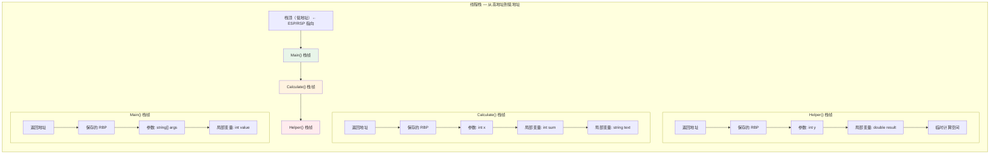

### 2.2 栈帧的详细布局

```csharp
// 示例方法
public static int Calculate(int x, int y)
{
    int sum = x + y;
    string text = sum.ToString();
    int result = Helper(sum);
    return result;
}
```

```
┌────────────────────────────────────────────┐
│         Calculate() 栈帧                    │
├────────────────────────────────────────────┤
│  返回地址 (Return Address)                  │  ← 调用者压入
│  0x7FFE1234                                │
├────────────────────────────────────────────┤
│  保存的 RBP (Saved Frame Pointer)           │  ← prologue 保存
│  0x7FFE5678                                │
├────────────────────────────────────────────┤
│  参数: int x = 10                          │  ← 调用者写入
├────────────────────────────────────────────┤
│  参数: int y = 20                          │  ← 调用者写入
├────────────────────────────────────────────┤
│  局部变量: int sum = 30                     │  ← 方法体计算
├────────────────────────────────────────────┤
│  局部变量: string text (引用)               │  ← 指向堆上对象
│  0x000002A1B2C3D4E5                        │
├────────────────────────────────────────────┤
│  局部变量: int result                       │
├────────────────────────────────────────────┤
│  临时空间 (编译器使用)                       │
│  (用于中间计算结果)                          │
├────────────────────────────────────────────┤
│  ← RSP (栈指针) 指向此处                    │
└────────────────────────────────────────────┘
```

### 2.3 栈帧的创建与销毁

```csharp
// 方法调用的栈帧生命周期
public static void Main()
{
    int value = 42;           // ① Main 栈帧分配局部变量
    int result = Add(value, 8); // ② 调用 Add，创建新栈帧
    Console.WriteLine(result);  // ④ Add 返回后，栈帧已销毁
}

public static int Add(int a, int b)
{
    int sum = a + b;          // ③ Add 栈帧分配局部变量
    return sum;               // ④ 返回值通过寄存器传递
}
```

```il
// Main 方法的 IL
.method public hidebysig static void Main() cil managed
{
    .entrypoint
    // int value = 42
    IL_0000: ldc.i4.s 42
    IL_0002: stloc.0

    // int result = Add(value, 8)
    IL_0003: ldloc.0
    IL_0004: ldc.i4.8
    IL_0005: call int32 Add(int32, int32)  // 调用 → 创建新栈帧
    IL_000a: stloc.1

    // Console.WriteLine(result)
    IL_000b: ldloc.1
    IL_000c: call void [System.Runtime]System.Console::WriteLine(int32)
    IL_0011: ret
}

// Add 方法的 IL
.method public hidebysig static int32 Add(int32 a, int32 b) cil managed
{
    // int sum = a + b
    IL_0000: ldarg.0      // 加载参数 a
    IL_0001: ldarg.1      // 加载参数 b
    IL_0002: add           // 相加
    IL_0003: stloc.0      // 存入局部变量 sum

    // return sum
    IL_0004: ldloc.0
    IL_0005: ret           // 返回 → 栈帧销毁
}
```

::: important 栈帧的创建与销毁是零开销的
分配栈空间只需要移动 RSP（栈指针）寄存器，不需要任何搜索或同步。释放栈空间只需要将 RSP 恢复原位。这就是为什么局部变量的访问速度极快——它只是一次寄存器偏移寻址。
:::

### 2.4 线程栈大小

```csharp
// 默认线程栈大小
// 32位进程: 1 MB
// 64位进程: 1 MB (默认)
// 可以自定义大小:
var thread = new Thread(() =>
{
    Console.WriteLine($"当前处理器ID: {Thread.GetCurrentProcessorId()}");
}, maxStackSize: 2 * 1024 * 1024);  // 2 MB 栈

// 查看当前线程的栈使用情况
// 注意：没有直接的 API，但可以通过栈指针估算
unsafe
{
    int localVar;
    Console.WriteLine($"局部变量地址: {(long)&localVar:X}");
    // 栈地址从高向低增长
}
```

::: warning StackOverflowException
默认 1MB 的栈空间大约能容纳 ~10000 层递归调用（假设每帧 ~100 字节）。超过限制会触发 `StackOverflowException`，这个异常**无法被 catch**，会导致进程直接终止。
:::

### 2.5 栈上的值类型 vs 引用类型

```csharp
public struct Point     // 值类型
{
    public int X;
    public int Y;
}

public class Person    // 引用类型
{
    public string Name;
    public int Age;
}

public static void Example()
{
    Point p = new Point { X = 1, Y = 2 };  // 栈上直接存储 8 字节
    Person person = new Person();            // 栈上存 8 字节引用，堆上存对象
}
```

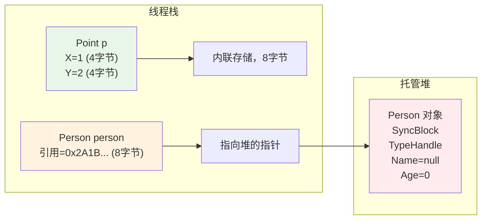

## 三、托管堆结构

### 3.1 堆段（Heap Segment）

CLR 的托管堆不是一块连续的内存，而是由多个**堆段（Segment）**组成。每个段是从操作系统申请的一块连续虚拟内存。

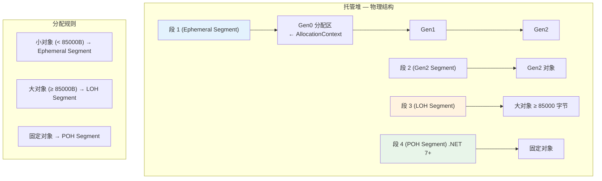

### 3.2 堆段的详细结构

```
┌─────────────────────────────────────────────────────────────┐
│                 Ephemeral Segment (段 1)                     │
│                 ← 新对象分配在这里 →                          │
├─────────────────────────────────────────────────────────────┤
│                                                             │
│  ┌─────────────────────────────────────────────────────┐    │
│  │  Gen0 分配区                                        │    │
│  │  ┌─────────┐ ┌─────────┐ ┌─────────┐              │    │
│  │  │ Object1 │ │ Object2 │ │ Object3 │ ...          │    │
│  │  └─────────┘ └─────────┘ └─────────┘              │    │
│  │                                        ↑           │    │
│  │                              AllocationContext      │    │
│  │                              的 alloc_ptr 指向      │    │
│  └─────────────────────────────────────────────────────┘    │
│                                                             │
│  ┌─────────────────────────────────────────────────────┐    │
│  │  Gen1 区域（上次 GC 存活的对象）                      │    │
│  │  ┌─────────┐ ┌─────────┐                           │    │
│  │  │ OldObj1 │ │ OldObj2 │                           │    │
│  │  └─────────┘ └─────────┘                           │    │
│  └─────────────────────────────────────────────────────┘    │
│                                                             │
│  ┌─────────────────────────────────────────────────────┐    │
│  │  Gen2 区域（多次 GC 存活的对象）                      │    │
│  │  ┌──────────┐ ┌──────────┐ ┌──────────┐           │    │
│  │  │ LongLived│ │ LongLived│ │ LongLived│           │    │
│  │  └──────────┘ └──────────┘ └──────────┘           │    │
│  └─────────────────────────────────────────────────────┘    │
│                                                             │
│  ┌─────────────────────────────────────────────────────┐    │
│  │  未提交区域（Reserved 但未 Commit）                   │    │
│  └─────────────────────────────────────────────────────┘    │
│                                                             │
└─────────────────────────────────────────────────────────────┘
```

### 3.3 堆段的内存分配

```csharp
// 段的大小由 CLR 内部决定
// Workstation GC: 段大小 ~16 MB (ephemeral)
// Server GC: 段大小 ~64 MB (ephemeral, 每个 CPU 核心)

// 查看段信息
GCMemoryInfo info = GC.GetGCMemoryInfo();
Console.WriteLine($"堆大小: {info.HeapSizeBytes:N0} bytes");
Console.WriteLine($"已提交: {info.CommittedBytes:N0} bytes");
Console.WriteLine($"可用: {info.TotalAvailableMemoryBytes:N0} bytes");
Console.WriteLine($"Gen0 大小: {info.GenerationInfo[0].SizeAfterBytes:N0} bytes");
Console.WriteLine($"Gen1 大小: {info.GenerationInfo[1].SizeAfterBytes:N0} bytes");
Console.WriteLine($"Gen2 大小: {info.GenerationInfo[2].SizeAfterBytes:N0} bytes");
```

### 3.4 小对象堆段 vs 大对象堆段

| 特性 | 小对象堆段 (SOH) | 大对象堆段 (LOH) |
|------|-------------------|-------------------|
| 对象大小 | < 85,000 字节 | ≥ 85,000 字节 |
| 分代 | Gen0 / Gen1 / Gen2 | 只有 Gen2 |
| 压缩 | GC 可压缩 | 默认不压缩 |
| 分配 | AllocationContext 快速 | 空闲列表搜索 |
| 碎片化 | 较少 | 较严重 |

## 四、分配上下文（Allocation Context）

### 4.1 分配上下文的原理

分配上下文是 CLR 实现快速内存分配的核心机制。每个线程拥有自己的分配上下文，避免了线程间的锁竞争。

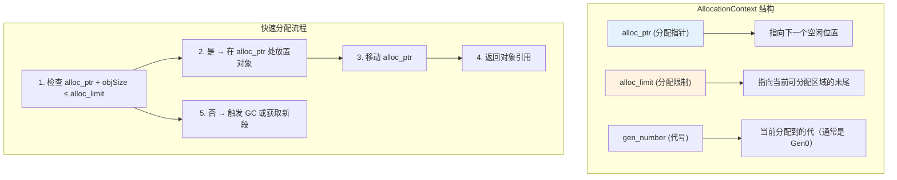

### 4.2 每线程分配上下文

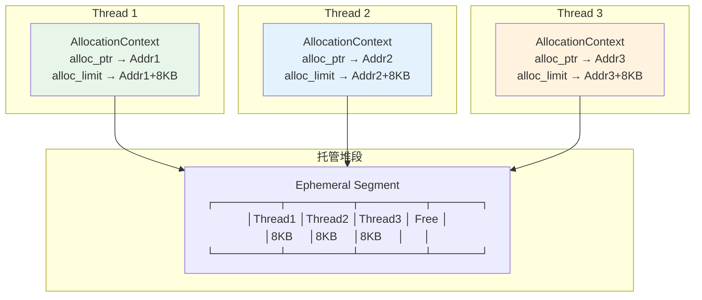

::: tip 分配上下文 = 无锁分配
因为每个线程有自己的 `AllocationContext`，所以小对象的分配通常不需要任何锁！分配过程就是：
1. 比较 `alloc_ptr + size <= alloc_limit`
2. 如果是，在 `alloc_ptr` 处写入对象头和方法表指针
3. `alloc_ptr += size`
4. 返回引用

这就是为什么 .NET 中 `new object()` 的开销接近于一次指针移动——与栈分配几乎一样快。
:::

### 4.3 分配上下文的 IL 体现

```csharp
// 快速分配示例
public static List<object> CreateObjects(int count)
{
    var list = new List<object>(count);
    for (int i = 0; i < count; i++)
    {
        list.Add(new object());  // 每次分配都很"快"
    }
    return list;
}
```

```il
// 循环体内的分配 IL
IL_000a: newobj instance void [System.Runtime]System.Object::.ctor()
IL_000f: stloc.2
IL_0010: ldloc.0
IL_0011: ldloc.2
IL_0012: callvirt instance void class [System.Runtime]System.Collections.Generic.List`1<object>::Add(!0)
```

`newobj` 指令的执行流程：
1. 计算 `Object` 的大小（24 字节 x64，12 字节 x86（不含 SyncBlock，SyncBlock 在单独的表中））
2. 检查当前线程的 `AllocationContext` 是否有足够空间
3. 有 → 直接在 `alloc_ptr` 处写入，移动 `alloc_ptr`（~5ns）
4. 无 → 调用 JIT_New 分配，可能触发 GC（~μs 级）

### 4.4 分配上下文与 Server GC

```csharp
// Server GC: 每个核心一个堆
// 查看 GC 类型
Console.WriteLine($"GC 类型: {GCSettings.IsServerGC ? "Server" : "Workstation"}");

// Server GC 下，每个 CPU 核心有独立的堆和 AllocationContext
// 这意味着不同线程的对象可能分布在不同堆段中
// GC 可以并行回收不同堆段

// Workstation GC: 所有线程共享一个堆
// AllocationContext 在线程间切换时需要同步
```

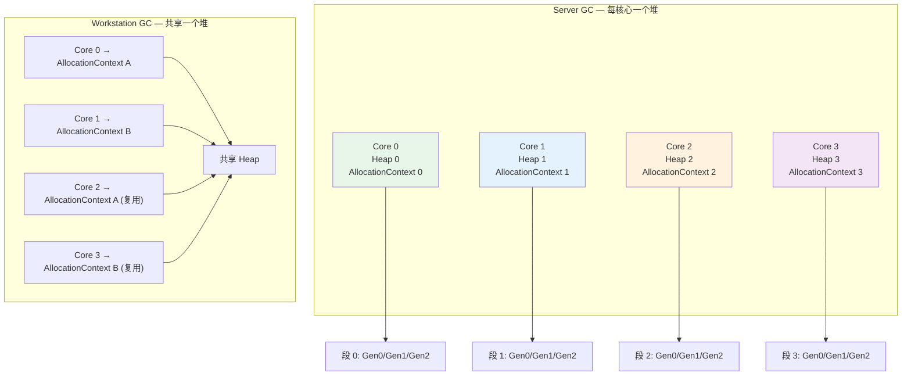

## 五、栈上分配（stackalloc）

### 5.1 stackalloc 的原理

`stackalloc` 在栈上分配内存块，而不是在托管堆上。分配的内存随方法返回自动释放。

```csharp
// 在栈上分配内存
public static void StackAllocDemo()
{
    // 分配 100 个 int 的内存块（400 字节）
    Span<int> buffer = stackalloc int[100];

    // 使用
    for (int i = 0; i < buffer.Length; i++)
    {
        buffer[i] = i * 2;
    }

    // 方法返回时，栈空间自动回收——无需 GC！
}
```

```il
// stackalloc 的 IL
.method public hidebysig static void StackAllocDemo() cil managed
{
    .locals init (
        [0] int32& buffer,
        [1] int32 i
    )

    // stackalloc int[100]
    IL_0000: ldc.i4.s 100
    IL_0002: conv.u4
    IL_0003: sizeof int32                    // 获取元素大小 = 4
    IL_0009: mul.un                          // 100 * 4 = 400
    IL_000a: localloc                        // 在本地栈上分配！
    IL_000b: stloc.0                         // buffer = 栈指针

    // for loop...
    IL_000c: ldc.i4.0
    IL_000d: stloc.1
    // ...
}
```

::: important localloc 指令
`localloc` 是 IL 中实现栈分配的指令。它在当前方法的栈帧中分配指定大小的内存，返回一个指向栈的指针。分配的内存随方法返回自动释放——这正是 `stackalloc` 名字的由来。
:::

### 5.2 stackalloc 的安全性

```csharp
// C# 7.2 之前：stackalloc 只能用于 unsafe 上下文
unsafe
{
    int* ptr = stackalloc int[100];
    // 指针操作...
}

// C# 7.2+：stackalloc 可以用于 Span<T>，无需 unsafe
Span<int> buffer = stackalloc int[100];
// Span 提供安全访问：边界检查、不会逃逸到堆

// C# 8.0+：stackalloc 在表达式中的使用
Span<char> Format(int value)
{
    // stackalloc 在三元表达式中
    Span<char> buffer = value < 100
        ? stackalloc char[4]    // 小数字，栈分配
        : stackalloc char[12];  // 大数字，栈分配
    value.TryFormat(buffer, out _);
    return buffer;
}
```

### 5.3 stackalloc 的限制

```csharp
// 限制 1：大小必须是编译期可计算或方法内的局部表达式
// int n = int.Parse(Console.ReadLine());
// Span<int> buf = stackalloc int[n];  // OK，运行时大小

// 限制 2：不能在 try 块中使用（C# 7.2 之前）
// C# 7.2+ 可以，因为 Span 提供安全包装

// 限制 3：不能逃逸到堆
// static Span<int> _field;  // 不能赋给静态字段
// void Escape()
// {
//     Span<int> buf = stackalloc int[10];
//     _field = buf;  // 编译错误！ref struct 不能逃逸
// }

// 限制 4：栈空间有限，大分配导致 StackOverflowException
// Span<byte> big = stackalloc byte[10_000_000];  // 危险！
```

::: warning stackalloc 的安全使用
1. 保持 `stackalloc` 的大小合理（通常不超过几 KB）
2. 始终用 `Span&lt;T&gt;` 包装（非 unsafe 场景）
3. 不要在递归方法中使用 `stackalloc`
4. 对于大缓冲区，使用 `ArrayPool&lt;T&gt;` 代替
:::

## 六、Span 与栈内存

### 6.1 Span 的内部结构

`Span&lt;T&gt;` 是一个 ref struct，内部包含一个引用和长度。对于栈内存，引用指向栈上的地址。

```csharp
// Span<T> 的简化内部结构
public readonly ref struct Span<T>
{
    private readonly ref T _reference;  // byref：指向数据的引用
    private readonly int _length;       // 元素数量
}
```

```
┌──────────────────────────────────────────────────┐
│  Span<int> 在栈上的布局                           │
├──────────────────────────────────────────────────┤
│  _reference: 指向栈内存的 byref (8 bytes on x64)  │
│  _length: 100 (4 bytes)                          │
│                                                  │
│  对应的栈内存:                                    │
│  ┌─────┬─────┬─────┬─────┬─────┐               │
│  │ [0] │ [1] │ [2] │ ... │[99] │               │
│  │  0  │  2  │  4  │     │ 198 │               │
│  └─────┴─────┴─────┴─────┴─────┘               │
│   ↑ _reference 指向这里                          │
└──────────────────────────────────────────────────┘
```

### 6.2 Span 与不同内存源

```csharp
// 1. 栈内存
Span<int> stack = stackalloc int[100];

// 2. 托管堆数组
int[] array = new int[100];
Span<int> heap = array;

// 3. 本地内存
IntPtr native = Marshal.AllocHGlobal(100 * sizeof(int));
Span<int> nativeSpan = new Span<int>(native.ToPointer(), 100);

// 4. 无构造开销的内存重解释
byte[] bytes = new byte[100];
Span<int> ints = MemoryMarshal.Cast<byte, int>(bytes);  // 25 个 int

// 5. 字符串（只读）
ReadOnlySpan<char> text = "Hello, World!".AsSpan();
```

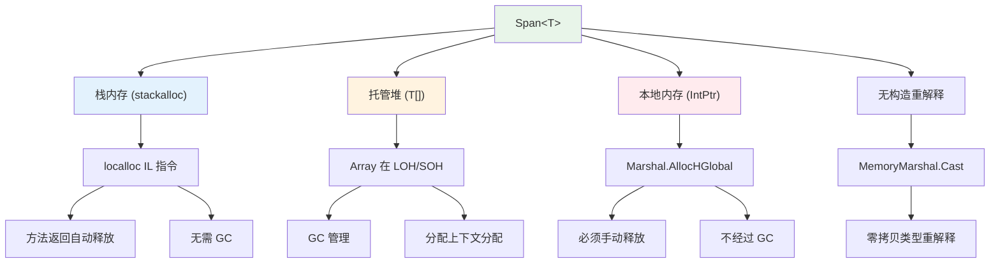

### 6.3 Span 的安全保证

```csharp
// Span 是 ref struct，不能逃逸到堆
public static Span<int> DangerousReturn()
{
    Span<int> buffer = stackalloc int[10];
    // return buffer;  // 编译错误！ref struct 不能逃逸
    return Array.Empty<int>();  // OK，堆上分配
}

// Span 不能作为泛型参数
// List<Span<int>> spans;  // 编译错误！

// Span 不能在 lambda/async 中捕获
void Capture()
{
    Span<int> buf = stackalloc int[10];
    // Action action = () => buf[0] = 1;  // 编译错误！不能在闭包中捕获
}

// Span 不能存储在 class 的字段中
// class MyClass { Span<int> _span; }  // 编译错误！
```

## 七、GC 堆段的生命周期

### 7.1 段的创建与销毁

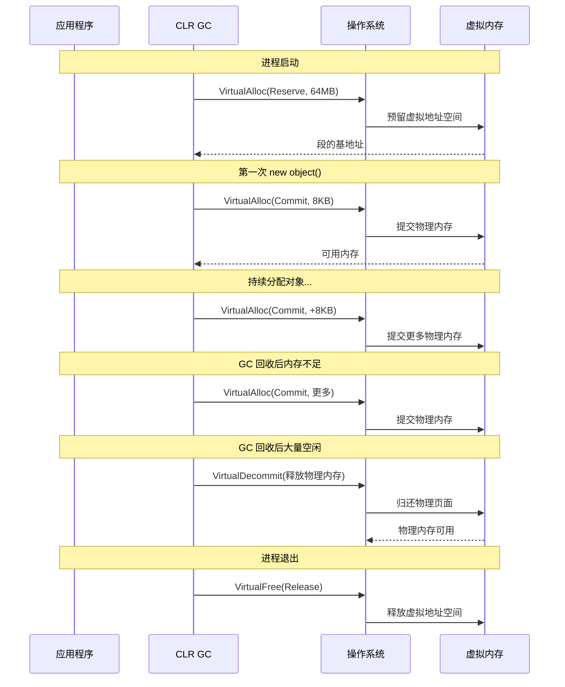

### 7.2 Ephemeral Segment

Ephemeral segment（短暂段）是 Gen0 和 Gen1 的所在位置，也是新对象分配的段。它的关键特征是：

```csharp
// Ephemeral segment 的特点
// 1. 总是最新分配的段
// 2. Gen0 和 Gen1 总是在 ephemeral segment 中
// 3. 当 ephemeral segment 满了，可能创建新段
// 4. 旧的 ephemeral segment 变为 Gen2 段

// 查看 Generation 信息
GCMemoryInfo info = GC.GetGCMemoryInfo();
foreach (var genInfo in info.GenerationInfo)
{
    Console.WriteLine($"Gen{Array.IndexOf(info.GenerationInfo, genInfo)}: " +
        $"SizeBefore={genInfo.SizeBeforeBytes:N0}, " +
        $"SizeAfter={genInfo.SizeAfterBytes:N0}");
}
```

### 7.3 段的增长策略

```
┌────────────────────────────────────────────────────────────────┐
│  堆段增长策略                                                   │
├────────────────────────────────────────────────────────────────┤
│                                                                │
│  初始状态:                                                      │
│  ┌──────────────────────────────────────────────┐              │
│  │ Ephemeral Segment (16MB Reserved, 256KB Committed) │       │
│  └──────────────────────────────────────────────┘              │
│                                                                │
│  分配增长:                                                      │
│  ┌──────────────────────────────────────────────┐              │
│  │ Ephemeral Segment (16MB Reserved, 2MB Committed) │        │
│  └──────────────────────────────────────────────┘              │
│                                                                │
│  触发 GC 后需要更多空间:                                         │
│  ┌──────────────────────────────────────────────┐              │
│  │ Ephemeral Segment (16MB, 4MB Committed)       │ ← 新的     │
│  └──────────────────────────────────────────────┘              │
│  ┌──────────────────────────────────────────────┐              │
│  │ Old Segment → Gen2 Segment (4MB Committed)    │ ← 变为Gen2  │
│  └──────────────────────────────────────────────┘              │
│                                                                │
│  LOH 分配:                                                     │
│  ┌──────────────────────────────────────────────┐              │
│  │ LOH Segment (85KB+ 对象)                      │              │
│  └──────────────────────────────────────────────┘              │
│                                                                │
└────────────────────────────────────────────────────────────────┘
```

## 八、本地内存

### 8.1 Marshal.AllocHGlobal

`Marshal.AllocHGlobal` 分配本地（非托管）内存，不受 GC 管理。

```csharp
// 分配本地内存
public class NativeMemoryDemo : IDisposable
{
    private IntPtr _buffer;
    private readonly int _size;

    public NativeMemoryDemo(int size)
    {
        _size = size;
        _buffer = Marshal.AllocHGlobal(size);  // 本地堆分配
    }

    public void Write(int offset, byte value)
    {
        if (offset < 0 || offset >= _size)
            throw new ArgumentOutOfRangeException(nameof(offset));
        Marshal.WriteByte(_buffer + offset, value);
    }

    public byte Read(int offset)
    {
        return Marshal.ReadByte(_buffer + offset);
    }

    public void Dispose()
    {
        if (_buffer != IntPtr.Zero)
        {
            Marshal.FreeHGlobal(_buffer);  // 必须手动释放！
            _buffer = IntPtr.Zero;
        }
    }
}
```

```il
// Marshal.AllocHGlobal 的内部调用
.method public hidebysig static native int AllocHGlobal(int32 cb) cil managed
{
    IL_0000: ldarg.0
    IL_0001: call native int [System.Runtime]System.Runtime.InteropServices.Marshal::AllocHGlobal(intptr)
    IL_0006: ret
}

// 实际上调用的是 LocalAlloc (Windows) 或 malloc (Linux)
// Windows: LocalAlloc(LMEM_FIXED, cb)
// Linux: malloc(cb)
```

### 8.2 NativeMemory (NET 6+)

```csharp
// .NET 6 引入了更现代的本地内存 API
public class ModernNativeMemory
{
    public static void Demo()
    {
        // 对齐分配
        IntPtr ptr = (IntPtr)NativeMemory.AlignedAlloc(
            size: 1024,
            alignment: 64    // 64 字节对齐（缓存行大小）
        );

        try
        {
            // 通过 Span 访问
            Span<byte> span = new Span<byte>(ptr.ToPointer(), 1024);
            span.Fill(0xAB);
        }
        finally
        {
            NativeMemory.AlignedFree(ptr.ToPointer());
        }
    }
}
```

::: important 本地内存 vs 托管内存
| 特性 | 托管内存 | 本地内存 |
|------|---------|---------|
| 分配 | `new` / `AllocationContext` | `Marshal.AllocHGlobal` / `NativeMemory` |
| 释放 | GC 自动 | 手动释放 |
| 类型安全 | 编译器保证 | 需要自己保证 |
| 移动 | GC 可移动对象 | 不会被移动 |
| 碎片化 | GC 可压缩 | 需要自己管理 |
:::

## 九、MemoryMappedFile 原理

### 9.1 内存映射文件

`MemoryMappedFile` 利用操作系统的内存映射机制，将文件内容映射到进程的虚拟地址空间。

```csharp
// 创建内存映射文件
public class MmfDemo
{
    public static void WriteData(string filePath, byte[] data)
    {
        // 1. 创建或打开文件
        using var fs = new FileStream(filePath, FileMode.Create);

        // 2. 创建内存映射文件
        using var mmf = MemoryMappedFile.CreateFromFile(
            fs,
            mapName: null,
            capacity: data.Length,
            access: MemoryMappedFileAccess.ReadWrite,
            inheritability: HandleInheritability.None,
            leaveOpen: false
        );

        // 3. 创建视图访问器
        using var accessor = mmf.CreateViewAccessor();
        accessor.WriteArray(0, data, 0, data.Length);
    }

    public static byte[] ReadData(string filePath, int length)
    {
        using var mmf = MemoryMappedFile.CreateFromFile(
            filePath, FileMode.Open
        );
        using var accessor = mmf.CreateViewAccessor();
        byte[] data = new byte[length];
        accessor.ReadArray(0, data, 0, length);
        return data;
    }
}
```

### 9.2 MemoryMappedFile 的底层机制

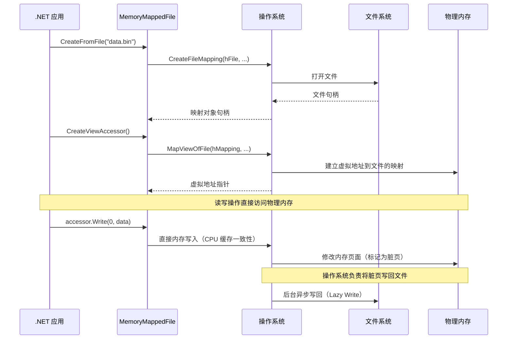

### 9.3 MemoryMappedFile 与 Span

```csharp
// 使用 Span 访问内存映射文件
public static void ProcessWithSpan(string filePath, long fileSize)
{
    using var mmf = MemoryMappedFile.CreateFromFile(filePath, FileMode.Open);
    using var accessor = mmf.CreateViewAccessor(0, fileSize);

    // 通过指针获取 Span
    byte* ptr = null;
    accessor.SafeMemoryMappedViewHandle.AcquirePointer(ref ptr);
    try
    {
        Span<byte> span = new Span<byte>(ptr, (int)fileSize);
        // 直接操作文件内容，零拷贝
        for (int i = 0; i < span.Length; i++)
        {
            span[i] ^= 0xFF;  // 简单的 XOR 加密
        }
    }
    finally
    {
        accessor.SafeMemoryMappedViewHandle.ReleasePointer();
    }
}
```

## 十、内存分配的性能对比

### 10.1 各种分配方式的基准测试

```csharp
[MemoryDiagnoser]
public class AllocationBench
{
    private const int Size = 1024;

    [Benchmark(Baseline = true)]
    public byte[] HeapArray() => new byte[Size];

    [Benchmark]
    public void StackAlloc()
    {
        Span<byte> buffer = stackalloc byte[Size];
        buffer[0] = 1;
    }

    [Benchmark]
    public IntPtr NativeAlloc() => Marshal.AllocHGlobal(Size);

    [Benchmark]
    public byte[] ArrayPool()
    {
        byte[] buffer = ArrayPool<byte>.Shared.Rent(Size);
        ArrayPool<byte>.Shared.Return(buffer);
        return buffer;
    }
}

// 结果示例（.NET 8）：
// | Method       | Mean     | Allocated |
// |------------- |---------:|----------:|
// | HeapArray    | 12.3 ns  |   1024 B  |
// | StackAlloc   |  1.2 ns  |      0 B  |
// | NativeAlloc  | 45.6 ns  |      0 B  |
// | ArrayPool    | 18.7 ns  |      0 B  |
```

### 10.2 内存模型选择指南

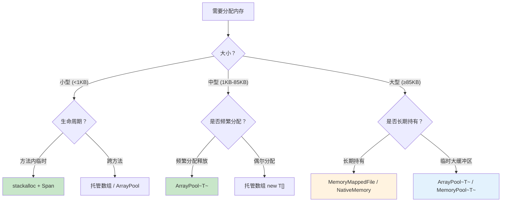

## 十一、实战：高性能缓冲区管理

```csharp
// 结合栈内存和 ArrayPool 的高性能缓冲区
public ref struct PooledBuffer<T> where T : unmanaged
{
    private T[]? _rentedArray;
    private Span<T> _span;

    public PooledBuffer(int size)
    {
        if (size <= 256)  // 小缓冲区用池中的数组
        {
            _rentedArray = ArrayPool<T>.Shared.Rent(256);
            _span = _rentedArray.AsSpan(0, 256);
        }
        else  // 大缓冲区用池
        {
            _rentedArray = ArrayPool<T>.Shared.Rent(size);
            _span = _rentedArray.AsSpan(0, size);
        }
    }

    public Span<T> Span => _span;

    public void Dispose()
    {
        if (_rentedArray != null)
        {
            ArrayPool<T>.Shared.Return(_rentedArray);
            _rentedArray = null;
        }
    }
}

// 使用
public static void ProcessData(int dataSize)
{
    using var buffer = new PooledBuffer<byte>(dataSize);
    // 使用 buffer.Span 进行处理
    ProcessBuffer(buffer.Span);
}

// 问题：ref struct 不能在 async 方法中使用
// 解决：使用 Memory<T> 代替
public static async Task ProcessAsync(int dataSize)
{
    byte[] rented = ArrayPool<byte>.Shared.Rent(dataSize);
    try
    {
        Memory<byte> memory = rented.AsMemory(0, dataSize);
        await ProcessMemoryAsync(memory);
    }
    finally
    {
        ArrayPool<byte>.Shared.Return(rented);
    }
}
```

## 十二、总结

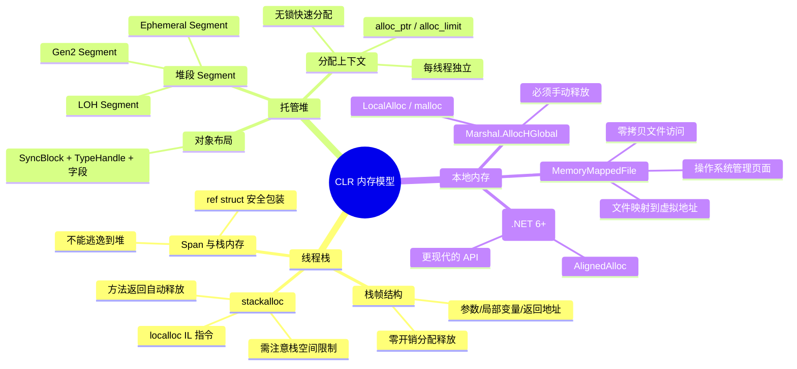

::: tip 核心要点回顾
1. **栈是线性的** — 分配和释放都是 O(1)，通过移动栈指针实现
2. **托管堆由段组成** — 不是一整块内存，而是按需申请的虚拟内存段
3. **AllocationContext 实现无锁分配** — 每线程独立上下文，`new object()` 接近栈分配速度
4. **stackalloc 利用栈的自动回收** — 方法返回即释放，零 GC 压力
5. **Span 桥接多种内存源** — 栈/堆/本地内存统一抽象，安全且高效
6. **MemoryMappedFile 实现零拷贝** — 文件直接映射到虚拟地址空间
:::
