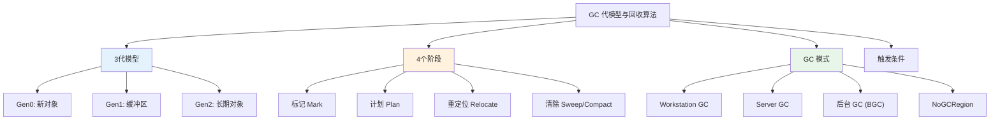
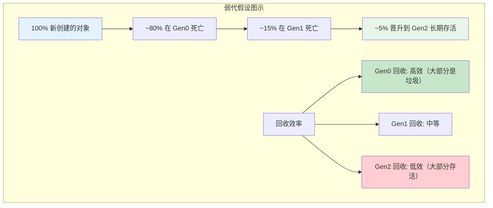
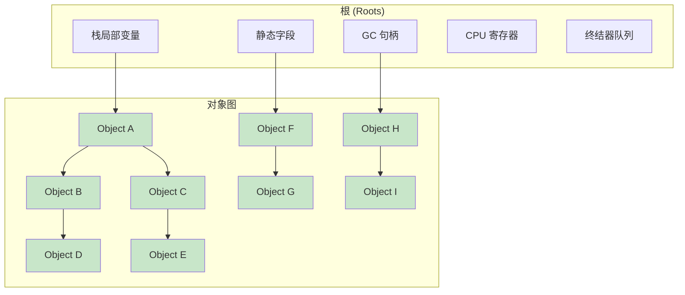
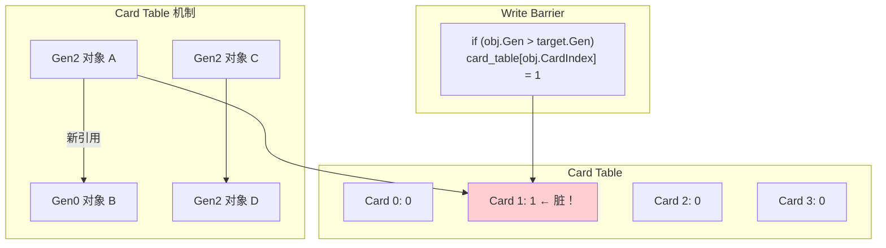
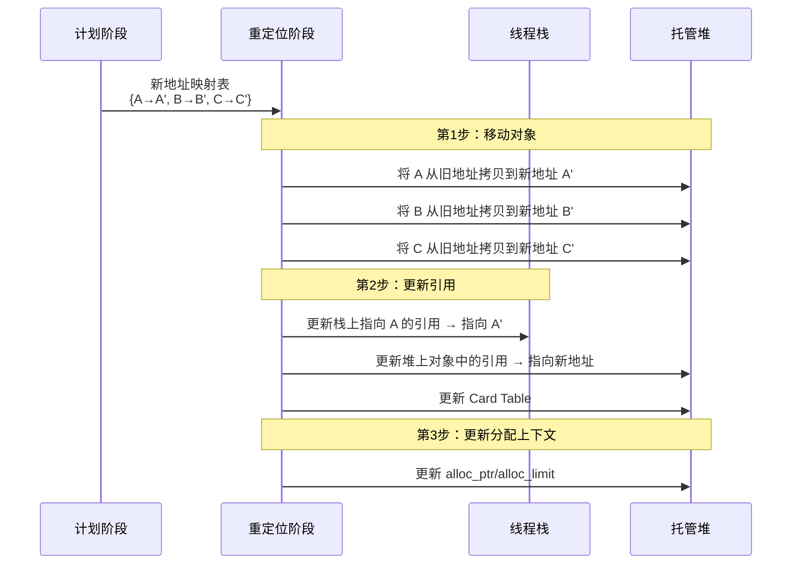
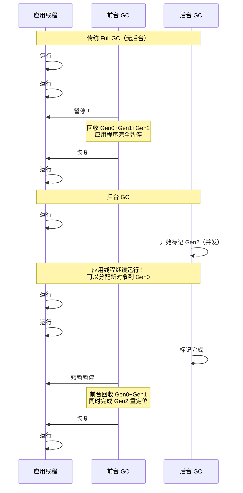
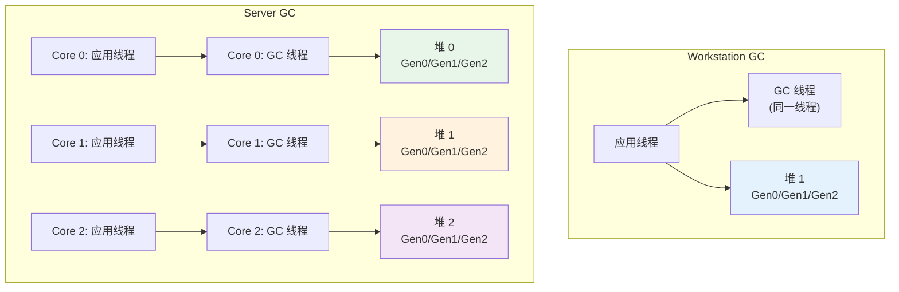
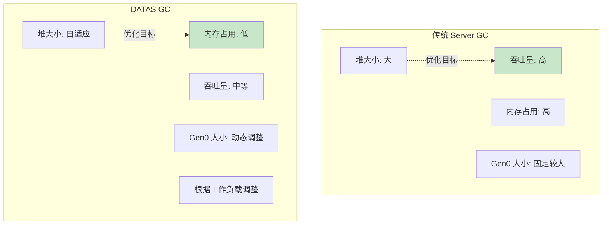
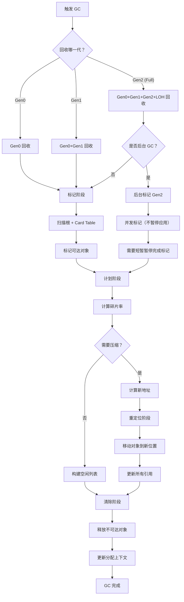
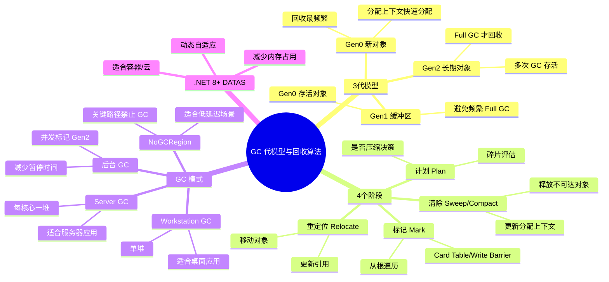

# GC 代模型与回收算法

> .NET 的垃圾回收器是分代、标记-清除、可压缩的自动内存管理系统。理解它的 3 代模型、4 个回收阶段和多种 GC 模式，是诊断内存问题和优化性能的关键。



## 一、3 代模型

### 1.1 代模型的设计动机

代模型基于**弱代假设**（Weak Generational Hypothesis）：
1. **新对象死得快** — 大多数对象的生命周期很短
2. **老对象活得久** — 存活越久的对象越可能继续存活

```csharp
// 典型的"新对象死得快"示例
public static string Process(string input)
{
    // 这些对象在方法返回后就成为垃圾
    var temp1 = input.ToUpper();           // 临时字符串
    var temp2 = new char[input.Length];    // 临时数组
    var temp3 = new StringBuilder();       // 临时 StringBuilder
    // ...
    return temp3.ToString();               // 只有返回值存活
}
```



### 1.2 三代结构

```
┌──────────────────────────────────────────────────────────────┐
│                     托管堆                                   │
├──────────────────────────────────────────────────────────────┤
│                                                              │
│  Gen0 (Ephemeral)                                            │
│  ┌────────────────────────────────────────────────────────┐  │
│  │ 新分配的对象                                            │  │
│  │ ┌──────┐ ┌──────┐ ┌──────┐ ┌──────┐ ┌──────┐        │  │
│  │ │ Obj1 │ │ Obj2 │ │ Obj3 │ │ Obj4 │ │ Obj5 │ → 垃圾  │  │
│  │ └──────┘ └──────┘ └──────┘ └──────┘ └──────┘        │  │
│  │ ┌──────┐ ┌──────┐                                    │  │
│  │ │ Obj6 │ │ Obj7 │ → 存活，将晋升到 Gen1              │  │
│  │ └──────┘ └──────┘                                    │  │
│  └────────────────────────────────────────────────────────┘  │
│                                                              │
│  Gen1 (Buffer)                                               │
│  ┌────────────────────────────────────────────────────────┐  │
│  │ 从 Gen0 晋升的对象                                     │  │
│  │ ┌──────┐ ┌──────┐ ┌──────┐                           │  │
│  │ │ Old1 │ │ Old2 │ │ Old3 │ → 存活，可能晋升到 Gen2   │  │
│  │ └──────┘ └──────┘ └──────┘                           │  │
│  └────────────────────────────────────────────────────────┘  │
│                                                              │
│  Gen2 (Long-lived)                                           │
│  ┌────────────────────────────────────────────────────────┐  │
│  │ 多次 GC 存活的对象                                     │  │
│  │ ┌──────┐ ┌──────┐ ┌──────┐ ┌──────┐ ┌──────┐        │  │
│  │ │ LL1  │ │ LL2  │ │ LL3  │ │ LL4  │ │ LL5  │        │  │
│  │ └──────┘ └──────┘ └──────┘ └──────┘ └──────┘        │  │
│  └────────────────────────────────────────────────────────┘  │
│                                                              │
│  LOH (Large Object Heap)                                     │
│  ┌────────────────────────────────────────────────────────┐  │
│  │ ≥ 85000 字节的大对象                                   │  │
│  │ ┌───────────────────┐ ┌───────────────────┐           │  │
│  │ │ Large Array 100KB │ │ Large Array 200KB │           │  │
│  │ └───────────────────┘ └───────────────────┘           │  │
│  └────────────────────────────────────────────────────────┘  │
│                                                              │
└──────────────────────────────────────────────────────────────┘
```

### 1.3 代与回收的关系

| 回收类型 | 回收的代 | 触发频率 | 暂停时间 |
|---------|---------|---------|---------|
| Gen0 回收 | Gen0 | 最频繁 | 最短 (~μs) |
| Gen1 回收 | Gen0 + Gen1 | 中等 | 短 (~ms) |
| Full GC (Gen2) | Gen0 + Gen1 + Gen2 + LOH | 最少 | 最长 (~10ms+) |
| 后台 GC | Gen0 + Gen1 (前台) + Gen2 (后台) | Gen2 满时 | 前台暂停短 |

```csharp
// 查看各代信息
Console.WriteLine($"Gen0 回收次数: {GC.CollectionCount(0)}");
Console.WriteLine($"Gen1 回收次数: {GC.CollectionCount(1)}");
Console.WriteLine($"Gen2 回收次数: {GC.CollectionCount(2)}");

Console.WriteLine($"Gen0 大小: {GC.GetGCMemoryInfo().GenerationInfo[0].SizeAfterBytes:N0} bytes");
Console.WriteLine($"Gen1 大小: {GC.GetGCMemoryInfo().GenerationInfo[1].SizeAfterBytes:N0} bytes");
Console.WriteLine($"Gen2 大小: {GC.GetGCMemoryInfo().GenerationInfo[2].SizeAfterBytes:N0} bytes");
```

### 1.4 对象晋升

```csharp
// 对象晋升演示
public static void PromotionDemo()
{
    Console.WriteLine($"Gen0 回收前: {GC.CollectionCount(0)}");

    // 新对象在 Gen0
    var obj = new object();
    Console.WriteLine($"新对象所在代: {GC.GetGeneration(obj)}");  // 0

    // 强制 Gen0 回收
    GC.Collect(0);
    Console.WriteLine($"Gen0 回收后: {GC.CollectionCount(0)}");

    // obj 存活，晋升到 Gen1
    Console.WriteLine($"存活对象所在代: {GC.GetGeneration(obj)}");  // 1

    // 再次回收
    GC.Collect(0);
    // obj 仍在 Gen1（Gen0 回收不影响 Gen1）

    GC.Collect(1);
    // obj 晋升到 Gen2
    Console.WriteLine($"再次存活后代: {GC.GetGeneration(obj)}");  // 2
}
```

::: important 晋升的代价
每次对象在 GC 中存活，它就会晋升到更高代。这意味着：
- Gen1 回收会同时回收 Gen0（因为 Gen0 对象可能引用 Gen1 对象）
- Gen2 回收会同时回收所有代（Full GC）
- 越高代的回收代价越大

因此，减少对象晋升是优化 GC 性能的关键。
:::

## 二、标记阶段（Mark Phase）

### 2.1 标记的过程

标记阶段从根（Roots）开始，遍历所有可达对象，标记为存活。



### 2.2 Card Table 与 Write Barrier

跨代引用（Gen2 对象引用 Gen0 对象）给标记带来了挑战：Gen0 回收时需要扫描 Gen2 吗？Card Table 解决了这个问题。



```csharp
// Write Barrier 的伪代码
// 编译器在每个引用赋值后插入
static void WriteBarrier(ref object target, object value)
{
    target = value;

    // 如果目标在 Gen2，写入的引用指向更低代
    // 标记对应的 card 为"脏"
    if (value != null &&
        ((uint)value >> card_shift) < ((uint)target >> card_shift))
    {
        card_table[((uint)target >> card_shift) >> card_size_shift] = 1;
    }
}
```

::: important Write Barrier 的性能影响
每个引用赋值都会执行 write barrier 检查。这意味着：
```csharp
// 这行代码隐含了一次 write barrier
obj.Reference = otherObj;

// 相当于
obj.Reference = otherObj;
WriteBarrier(ref obj.Reference, otherObj);
```
在极端场景下（大量引用赋值），write barrier 会影响性能。但它的代价远小于每次 Gen0 回收都扫描整个 Gen2。
:::

### 2.3 Card Table 的结构

```
┌──────────────────────────────────────────────────────────────┐
│  Gen2 堆内存                                                 │
│  ┌────────────────┬────────────────┬────────────────┐       │
│  │ 128 bytes      │ 128 bytes      │ 128 bytes      │ ...   │
│  │ Obj A, Obj B   │ Obj C          │ Obj D          │       │
│  └────────────────┴────────────────┴────────────────┘       │
│                                                              │
│  Card Table (每 128 字节对应 1 字节)                          │
│  ┌────┬────┬────┬────┐                                      │
│  │  0 │  1 │  0 │  0 │ ...                                  │
│  └────┴────┴────┴────┘                                      │
│         ↑ 脏卡片：包含跨代引用                                 │
│                                                              │
│  GC 标记 Gen0 时：                                           │
│  1. 扫描根（栈/寄存器/GC 句柄）                               │
│  2. 只扫描 Card Table 中标记为脏的 Gen2 区域                   │
│  3. 不扫描整个 Gen2                                          │
└──────────────────────────────────────────────────────────────┘
```

## 三、计划阶段（Plan Phase）

### 3.1 计划阶段的工作

计划阶段决定是否压缩内存，以及如何压缩。它计算压缩后的新地址，但不实际移动对象。

```csharp
// 计划阶段的核心决策逻辑（伪代码）
bool PlanPhase(GcReason reason)
{
    // 统计碎片
    long totalFreeSpace = CalculateFreeSpace();
    long totalHeapSize = GetHeapSize();
    double fragmentation = (double)totalFreeSpace / totalHeapSize;

    // 决策：是否压缩
    bool shouldCompact = false;

    if (fragmentation > 0.30)           // 碎片超过 30%
        shouldCompact = true;
    else if (reason == GcReason.FullBlock)  // 分配失败
        shouldCompact = true;
    else if (reason == GcReason.Induced)    // 手动触发
        shouldCompact = true;
    // Gen0 回收通常不压缩 Gen2
    // Full GC 通常压缩

    if (shouldCompact)
    {
        // 计算每个存活对象的新地址
        ComputeNewAddresses();
    }

    return shouldCompact;
}
```

### 3.2 压缩 vs 不压缩

```
┌──────────────────────────────────────────────────────┐
│  压缩前（有碎片）                                      │
│  ┌────┐        ┌────┐    ┌────┐        ┌────┐       │
│  │ A  │  空闲  │ B  │空闲│ C  │  空闲  │ D  │       │
│  └────┘        └────┘    └────┘        └────┘       │
│                                                      │
│  压缩后（无碎片）                                      │
│  ┌────┐┌────┐┌────┐┌────┐                           │
│  │ A  ││ B  ││ C  ││ D  │  ← 连续，无碎片            │
│  └────┘└────┘└────┘└────┘                           │
│                                    ↑                  │
│                              空闲空间合并              │
└──────────────────────────────────────────────────────┘
```

::: warning 压缩的代价
压缩需要：
1. 计算新地址（计划阶段）
2. 移动对象（重定位阶段）
3. 更新所有引用（重定位阶段）
4. 更新 Card Table

对于 Gen2 回收（可能有几 GB 数据），压缩可能造成显著暂停。
:::

## 四、重定位阶段（Relocate Phase）

### 4.1 重定位的过程

重定位阶段根据计划阶段的计算结果，实际移动对象并更新所有引用。



### 4.2 重定位的实现细节

```csharp
// 重定位的伪代码
void RelocatePhase()
{
    // 1. 移动对象
    foreach (var entry in relocationMap)
    {
        Object* oldAddr = entry.Key;
        Object* newAddr = entry.Value;
        int size = oldAddr->GetSize();

        // 快速内存拷贝
        Buffer.MemoryCopy(oldAddr, newAddr, size, size);
    }

    // 2. 更新所有引用
    // 2a. 更新栈引用
    foreach (var root in stackRoots)
    {
        if (relocationMap.TryGetValue(*root, out var newAddr))
        {
            *root = newAddr;
        }
    }

    // 2b. 更新堆引用
    foreach (var obj in liveObjects)
    {
        foreach (var refField in obj.GetReferenceFields())
        {
            if (relocationMap.TryGetValue(*refField, out var newAddr))
            {
                *refField = newAddr;
            }
        }
    }
}
```

## 五、清除阶段（Sweep/Compact Phase）

### 5.1 清除策略

清除阶段有两种策略：
1. **压缩（Compact）**：移动存活对象，消除碎片
2. **清扫（Sweep）**：只标记空闲区域，不移动对象

```csharp
// 压缩后的堆
// Before: [A][free][B][free][C][free][D]
// After:  [A][B][C][D][free free free free]

// 清扫后的堆（不移动）
// Before: [A][free][B][free][C][free][D]
// After:  [A][free list node][B][free list node][C][free list node][D]
//         空闲区域被链入空闲列表
```

### 5.2 空闲列表（Free List）

```
┌──────────────────────────────────────────────────────┐
│  清扫策略：空闲列表                                    │
├──────────────────────────────────────────────────────┤
│                                                      │
│  ┌────┐ ┌──────────────┐ ┌────┐ ┌────────┐ ┌────┐  │
│  │ A  │ │ Free (32B)   │ │ B  │ │Free(16B)│ │ C  │  │
│  └────┘ └──────────────┘ └────┘ └────────┘ └────┘  │
│          ↑                      ↑                    │
│          │                      │                    │
│          └── Free List Node ────┘                    │
│              (next, size)                            │
│                                                      │
│  分配时搜索空闲列表：                                  │
│  1. First Fit: 找第一个够大的空闲块                    │
│  2. Best Fit: 找最小的够大空闲块                       │
│                                                      │
│  问题：容易产生碎片                                   │
│  ┌────┐ ┌──────┐ ┌────┐ ┌──────┐ ┌────┐ ┌──────┐  │
│  │ A  │ │8B free│ │ B  │ │8B free│ │ C  │ │8B free│  │
│  └────┘ └──────┘ └────┘ └──────┘ └────┘ └──────┘  │
│  → 无法分配 20B 的对象（虽然总空闲 24B）               │
│                                                      │
└──────────────────────────────────────────────────────┘
```

## 六、后台 GC（Background GC）

### 6.1 后台 GC 的动机

Full GC（Gen2 回收）需要暂停所有线程，可能造成 10ms-100ms 的延迟。后台 GC 允许在回收 Gen2 的同时，应用程序继续分配新对象。



### 6.2 后台 GC 的时序

```
时间 ──────────────────────────────────────────────────►

传统 Full GC:
  App: ████████████▓▓▓▓▓▓▓▓▓▓▓▓▓▓▓▓████████████████
                   ↑ 长暂停 ↑

后台 GC:
  App: ████████████▓██▓██████▓██▓████████████████████
                   ↑                  ↑
              短暂停             短暂停
              (Gen0/1)          (Gen0/1)

  BGC:          ░░░░░░░░░░░░░░░░░░░░░
               ↑ 后台标记/重定位 ↑
               (应用线程同时运行)
```

### 6.3 前台 GC 与后台 GC 的协调

```csharp
// 后台 GC 运行时的分配
// 1. 应用线程在 Gen0 正常分配
// 2. 如果 Gen0 满了，触发前台 GC（只回收 Gen0+Gen1）
// 3. 前台 GC 暂停时间很短
// 4. 后台 GC 完成后，Gen2 也被清理了
```

::: important 后台 GC 的限制
1. **不压缩 Gen2** — 后台 GC 只做标记-清除，不做压缩（除非特别请求）
2. **需要额外内存** — 并发标记需要额外的标记位空间
3. **不适合高碎片场景** — 如果 Gen2 碎片严重，后台 GC 无法解决
:::

## 七、Workstation vs Server GC

### 7.1 两种 GC 模式对比

| 特性 | Workstation GC | Server GC |
|------|---------------|-----------|
| 堆数量 | 1 | 每个核心 1 个 |
| GC 线程 | 1（与用户线程交替） | 每个核心 1 个专用 GC 线程 |
| 暂停 | 较短但频繁 | 较长但频率低 |
| 吞吐量 | 较低 | 较高 |
| 内存使用 | 较少 | 较多 |
| 适用场景 | 桌面应用/UI | 服务器应用/高吞吐 |
| 后台 GC | 默认启用 | .NET Framework 需配置，.NET Core 默认启用 |



### 7.2 配置 GC 模式

```csharp
// 方式1：项目文件
// <ServerGarbageCollection>true</ServerGarbageCollection>

// 方式2：runtimeconfig.json
// "configProperties": { "System.GC.Server": true }

// 方式3：环境变量
// COMPlus_gcServer=1

// 方式4：代码中查看
Console.WriteLine($"当前 GC 模式: {(GCSettings.IsServerGC ? "Server" : "Workstation")}");

// 方式5：运行时切换（.NET 6+）
// GCSettings.IsServerGC 是只读的，不能运行时切换
// 但可以通过配置文件在启动时设置
```

### 7.3 Concurrent GC

```csharp
// Concurrent GC = 后台 GC + Workstation GC
// 在 .NET Core 中，Workstation GC 默认启用后台 GC

// Non-concurrent GC（.NET Framework 时代的选项）
// GC 完全暂停应用线程，直到完成
// 在 .NET Core 中不再支持关闭并发

// .NET Framework 配置
// <gcConcurrent enabled="true"/>  ← 默认启用
```

## 八、触发 GC 的条件

### 8.1 分配压力

```csharp
// 最常见的 GC 触发原因：分配时空间不足
// 当 AllocationContext 的 alloc_ptr 超过 alloc_limit
// 且无法获取新的分配上下文时，触发 GC

public static void AllocationPressure()
{
    // 持续分配会触发 GC
    for (int i = 0; i < 1_000_000; i++)
    {
        var arr = new byte[1024];  // 每次分配 1KB
        // arr 很快成为垃圾
    }
    Console.WriteLine($"Gen0: {GC.CollectionCount(0)}");
    Console.WriteLine($"Gen1: {GC.CollectionCount(1)}");
    Console.WriteLine($"Gen2: {GC.CollectionCount(2)}");
}
```

### 8.2 手动触发

```csharp
// GC.Collect 的各种重载
GC.Collect();                    // Full GC（所有代）
GC.Collect(0);                   // Gen0 回收
GC.Collect(0, GCCollectionMode.Default);
GC.Collect(0, GCCollectionMode.Forced);     // 强制立即回收
GC.Collect(0, GCCollectionMode.Optimized);  // 只在需要时回收
GC.Collect(0, GCCollectionMode.Aggressive); // .NET 8+，更积极的回收

// GC.GetTotalMemory 也会触发 GC
long memory = GC.GetTotalMemory(forceFullCollection: true);
// forceFullCollection = true 会阻塞直到 Full GC 完成
```

::: warning 避免手动触发 GC
`GC.Collect()` 通常不应在生产代码中使用。GC 是自适应的，手动干预可能：
1. 打乱 GC 的自适应调优
2. 将短期对象不必要地晋升到更高代
3. 造成不必要的暂停

只在诊断或特殊场景（如测试）中使用。
:::

### 8.3 其他触发条件

```csharp
// 1. 操作系统内存压力
// 当系统内存不足时，CLR 可能触发 GC

// 2. AppDomain 卸载
// 卸载 AppDomain 时触发 GC 回收其中的对象

// 3. GC.AddMemoryPressure / GC.RemoveMemoryPressure
// 告知 CLR 非托管内存的分配/释放
GC.AddMemoryPressure(1_000_000);     // 告知 CLR 有 1MB 非托管分配
GC.RemoveMemoryPressure(1_000_000);  // 告知 CLR 非托管内存已释放

// 4. 大对象分配
// 分配 ≥ 85000 字节的对象可能触发 Gen2 回收
var bigArray = new byte[100_000];    // 可能触发 GC
```

## 九、GC.TryStartNoGCRegion

### 9.1 NoGCRegion 模式

.NET 5+ 提供了 NoGCRegion 模式，在关键路径上完全禁止 GC。

```csharp
// 启动 NoGCRegion
if (GC.TryStartNoGCRegion(10 * 1024 * 1024))  // 预留 10MB
{
    try
    {
        // 在此区域内分配不会触发 GC
        for (int i = 0; i < 1000; i++)
        {
            var buffer = new byte[1024];  // 不触发 GC
            ProcessBuffer(buffer);
        }
    }
    finally
    {
        GC.EndNoGCRegion();  // 退出 NoGCRegion
    }
}
else
{
    // 无法启动 NoGCRegion（内存不足）
    // 回退到正常模式
}
```

### 9.2 NoGCRegion 的限制

```csharp
// 1. 如果分配超过预留大小，会自动退出 NoGCRegion
GC.TryStartNoGCRegion(1024);   // 预留 1KB
var bigBuffer = new byte[2048]; // 超过预留！自动退出

// 2. 可以指定 lohSize 参数
GC.TryStartNoGCRegion(
    totalSize: 100 * 1024 * 1024,    // 总预留 100MB
    lohSize: 50 * 1024 * 1024,       // 其中 50MB 给 LOH
    disallowFullBlockingGC: true      // 不允许 Full Blocking GC
);

// 3. NoGCRegion 内不能手动触发 GC
// GC.Collect() 会被忽略
```

::: important NoGCRegion 适用场景
- 游戏渲染循环
- 实时交易系统
- 低延迟音频处理
- 短时间关键路径

不适合长时间运行，因为禁止 GC 会导致内存持续增长。
:::

## 十、GCSettings 配置

### 10.1 GC 相关配置

```csharp
using System.Runtime;

// GC 模式
Console.WriteLine($"Server GC: {GCSettings.IsServerGC}");

// GC 延迟模式
GCSettings.LatencyMode = GCLatencyMode.Interactive;      // 默认，平衡吞吐和延迟
GCSettings.LatencyMode = GCLatencyMode.LowLatency;       // 低延迟，避免 Full GC
GCSettings.LatencyMode = GCLatencyMode.SustainedLowLatency; // 持续低延迟
GCSettings.LatencyMode = GCLatencyMode.NoGCRegion;       // NoGCRegion 模式（只读）

// LOH 压缩
GCSettings.LargeObjectHeapCompactionMode = GCLargeObjectHeapCompactionMode.CompactOnce;
GC.Collect();  // 这次 Full GC 会压缩 LOH

// 查看
Console.WriteLine($"延迟模式: {GCSettings.LatencyMode}");
Console.WriteLine($"LOH 压缩: {GCSettings.LargeObjectHeapCompactionMode}");
```

### 10.2 配置文件选项

```json
// runtimeconfig.json
{
  "configProperties": {
    "System.GC.Server": true,
    "System.GC.Concurrent": true,
    "System.GC.HeapCount": 4,
    "System.GC.HeapAffinitizeMask": 15,
    "System.GC.RetainVM": false,
    "System.GC.LOHThreshold": 85000,
    "System.GC.NoAffinitize": false
  }
}
```

```xml
<!-- csproj 配置 -->
<PropertyGroup>
  <ServerGarbageCollection>true</ServerGarbageCollection>
  <ConcurrentGarbageCollection>true</ConcurrentGarbageCollection>
  <RetainVMGarbageCollection>true</RetainVMGarbageCollection>
</PropertyGroup>
```

## 十一、.NET 8+ Dynamic Adaptation To Application Sizes (DATAS)

### 11.1 DATAS 模式

.NET 8 引入了 DATAS（Dynamic Adaptation To Application Sizes），一种新的 GC 模式，旨在减少内存占用同时保持可接受的吞吐量。

```csharp
// 启用 DATAS
// 环境变量: DOTNET_GCDynamicAdaptationMode=1
// 或 runtimeconfig.json:
// "System.GC.DynamicAdaptationMode": true

// DATAS 的工作原理：
// 1. 监控应用的内存使用模式
// 2. 动态调整 Gen0/Gen1 的大小
// 3. 更积极地回收内存
// 4. 减少堆的总大小
```



### 11.2 DATAS 的适用场景

```csharp
// DATAS 特别适合：
// 1. 容器化应用（内存有限）
// 2. 微服务（需要低内存占用）
// 3. 多租户环境
// 4. 云原生应用（按内存计费）

// 不适合：
// 1. 需要最大吞吐量的场景
// 2. 内存充足的环境
// 3. 对延迟极度敏感的场景
```

## 十二、GC 完整回收流程

### 12.1 综合流程图



### 12.2 GC 中的暂停点

```csharp
// GC 暂停的应用线程
// 在 .NET 中称为 "Suspend EE" (Execution Engine)

// 暂停发生在：
// 1. 标记阶段开始前（需要暂停以获取一致的根集合）
// 2. 重定位阶段（需要暂停以安全移动对象）
// 3. 前台 GC（后台 GC 期间短暂暂停）

// 查看暂停时间
var info = GC.GetGCMemoryInfo();
Console.WriteLine($"暂停时间百分比: {info.PauseTimePercentage:P}");
```

## 十三、实战：GC 诊断与优化

### 13.1 使用 GC.GetGCMemoryInfo 诊断

```csharp
public static void DiagnoseGC()
{
    GCMemoryInfo info = GC.GetGCMemoryInfo();

    Console.WriteLine("=== GC 内存信息 ===");
    Console.WriteLine($"堆大小: {info.HeapSizeBytes / 1024.0 / 1024.0:F2} MB");
    Console.WriteLine($"已提交: {info.CommittedBytes / 1024.0 / 1024.0:F2} MB");
    Console.WriteLine($"可用内存: {info.TotalAvailableMemoryBytes / 1024.0 / 1024.0:F2} MB");
    Console.WriteLine($"内存负载: {info.MemoryLoadBytes / 1024.0 / 1024.0:F2} MB");
    Console.WriteLine($"暂停时间: {info.PauseTimePercentage:P}");
    Console.WriteLine($"上一次 GC 原因: {info.GCStartReason}");
    Console.WriteLine($"并发 GC: {info.Concurrent}");
    Console.WriteLine($"压缩: {info.Compacted}");

    Console.WriteLine("\n=== 代信息 ===");
    for (int i = 0; i < 3; i++)
    {
        var gen = info.GenerationInfo[i];
        Console.WriteLine($"Gen{i}:");
        Console.WriteLine($"  回收前: {gen.SizeBeforeBytes / 1024.0:F2} KB");
        Console.WriteLine($"  回收后: {gen.SizeAfterBytes / 1024.0:F2} KB");
        Console.WriteLine($"  碎片: {gen.FragmentationAfterBytes / 1024.0:F2} KB");
    }
}
```

### 13.2 减少分配的优化模式

```csharp
// 优化 1：对象池
public class ObjectPool<T> where T : class, new()
{
    private readonly ConcurrentBag<T> _objects = new();

    public T Rent() => _objects.TryTake(out var obj) ? obj : new T();

    public void Return(T obj) => _objects.Add(obj);
}

// 优化 2：Span 代替临时数组
public static int SumValues(ReadOnlySpan<int> values)
{
    int sum = 0;
    foreach (int v in values)
        sum += v;
    return sum;
    // 无堆分配！
}

// 优化 3：string.Create 减少中间字符串
public static string FormatName(string first, string last)
{
    return string.Create(first.Length + last.Length + 1,
        (first, last),
        (span, state) =>
    {
        state.first.AsSpan().CopyTo(span);
        span[state.first.Length] = ' ';
        state.last.AsSpan().CopyTo(span.Slice(state.first.Length + 1));
    });
    // 只有一次堆分配，而不是 first + " " + last 的多次
}

// 优化 4：ValueTask 代替 Task
public static async ValueTask<int> ReadAsync(Stream stream, byte[] buffer)
{
    // 如果数据已经在缓冲区中，返回 ValueTask（无堆分配）
    // 否则返回 Task
    return await stream.ReadAsync(buffer);
}
```

## 十四、总结



::: tip 核心要点回顾
1. **3代模型基于弱代假设** — 新对象死得快，老对象活得久
2. **Card Table + Write Barrier** — 避免每次 Gen0 回收扫描整个 Gen2
3. **4个阶段** — 标记→计划→重定位→清除，各有分工
4. **后台 GC 减少 Full GC 暂停** — 并发标记 Gen2，前台回收 Gen0/1
5. **Server GC 每核心一堆** — 并行回收，高吞吐
6. **NoGCRegion 关键路径零 GC** — 短时间禁止 GC
7. **DATAS 动态自适应** — .NET 8+ 内存优化新模式
:::
