# 大对象堆与固定对象

> 大对象堆（LOH）和固定对象（Pinning）是 GC 内存管理中最容易出问题的两个领域。LOH 的不压缩导致碎片，Pinning 阻止对象移动导致空洞。理解它们的底层机制，是解决内存碎片化问题的关键。

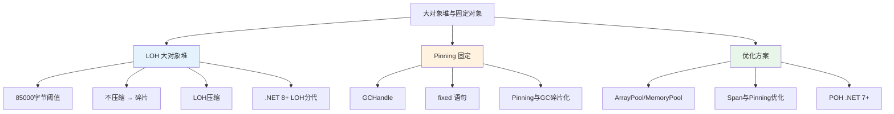

## 一、LOH 阈值 85000 字节

### 1.1 为什么是 85000

CLR 将 85000 字节（约 83KB）作为大对象的阈值。这个数字的选择基于以下考量：

```csharp
// 85000 字节 ≈ 83 KB
// 对于 byte[] 来说：85000 / 1 = 85000 个元素
// 对于 int[] 来说：85000 / 4 = 21250 个元素
// 对于 double[] 来说：85000 / 8 = 10625 个元素

// 验证 LOH 阈值
byte[] smallArray = new byte[84_999];  // SOH
byte[] largeArray = new byte[85_000];  // LOH！

Console.WriteLine($"小数组代: {GC.GetGeneration(smallArray)}");  // 0
Console.WriteLine($"大数组代: {GC.GetGeneration(largeArray)}");  // 2 (LOH 算作 Gen2)
```

::: important 85000 字节包含对象头吗？
85000 字节的阈值指的是对象的**总大小**，包括：
- SyncBlock（堆外，不计入）
- TypeHandle（8 字节 x64）
- 数组长度字段（4 字节）
- 实际数据

所以对于 `byte[]`，实际数据空间约为 85000 - 8 - 4 = 84988 字节时就已经在 LOH 上了。
:::

### 1.2 LOH 的特殊规则

```csharp
// LOH 对象的特殊属性
// 1. 直接分配在 Gen2（不需要经过 Gen0/Gen1）
// 2. 默认不会被压缩（不移动）
// 3. 只有 Full GC 才会回收 LOH
// 4. 分配时使用空闲列表而非分配上下文

// 查看 LOH 大小
GCMemoryInfo info = GC.GetGCMemoryInfo();
Console.WriteLine($"LOH 大小: {info.GenerationInfo[2].SizeAfterBytes / 1024.0 / 1024.0:F2} MB");
// 注意：LOH 的信息包含在 Gen2 的统计中
```

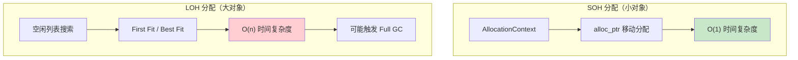

## 二、LOH 不压缩原因与碎片化

### 2.1 为什么 LOH 默认不压缩

移动大对象的代价极高：
1. **内存拷贝** — 移动一个 100MB 的数组需要拷贝 100MB
2. **引用更新** — 需要扫描整个堆更新所有指向该对象的引用
3. **暂停时间** — 移动大对象会显著增加 GC 暂停时间

```
┌──────────────────────────────────────────────────────────────┐
│  LOH 碎片化示意                                              │
├──────────────────────────────────────────────────────────────┤
│                                                              │
│  分配阶段:                                                   │
│  ┌────────┬────────┬────────┬────────┬────────┐             │
│  │ 100KB  │ 200KB  │ 150KB  │ 300KB  │ 250KB  │             │
│  │ Array1 │ Array2 │ Array3 │ Array4 │ Array5 │             │
│  └────────┴────────┴────────┴────────┴────────┘             │
│                                                              │
│  Array2 和 Array4 被回收:                                    │
│  ┌────────┐        ┌────────┐        ┌────────┐             │
│  │ 100KB  │ 200KB  │ 150KB  │ 300KB  │ 250KB  │             │
│  │ Array1 │ 空闲   │ Array3 │ 空闲   │ Array5 │             │
│  └────────┘        └────────┘        └────────┘             │
│                                                              │
│  问题：500KB 空闲，但无法分配 400KB 的对象！                  │
│  因为空闲空间被分割为 200KB + 300KB 两个不连续区域            │
│                                                              │
│  如果压缩:                                                   │
│  ┌────────┬────────┬────────┬────────────────────────────┐  │
│  │ 100KB  │ 150KB  │ 250KB  │      500KB 连续空闲        │  │
│  │ Array1 │ Array3 │ Array5 │      可以分配 400KB！      │  │
│  └────────┴────────┴────────┴────────────────────────────┘  │
│                                                              │
└──────────────────────────────────────────────────────────────┘
```

### 2.2 碎片化的诊断

```csharp
// 诊断 LOH 碎片化
public static void DiagnoseFragmentation()
{
    GCMemoryInfo info = GC.GetGCMemoryInfo();

    // 总碎片信息
    long totalHeapSize = info.HeapSizeBytes;
    long committedBytes = info.CommittedBytes;
    long fragmentedBytes = info.GenerationInfo
        .Sum(g => g.FragmentationAfterBytes);

    Console.WriteLine($"堆大小: {totalHeapSize / 1024.0 / 1024.0:F2} MB");
    Console.WriteLine($"已提交: {committedBytes / 1024.0 / 1024.0:F2} MB");
    Console.WriteLine($"碎片: {fragmentedBytes / 1024.0 / 1024.0:F2} MB");
    Console.WriteLine($"碎片率: {(double)fragmentedBytes / totalHeapSize:P}");

    // 使用 dotnet-counters 实时监控
    // dotnet-counters monitor --process-id <pid>
    // 关注:
    // - GC Heap Size
    // - LOH Size
    // - Fragmentation Ratio
}
```

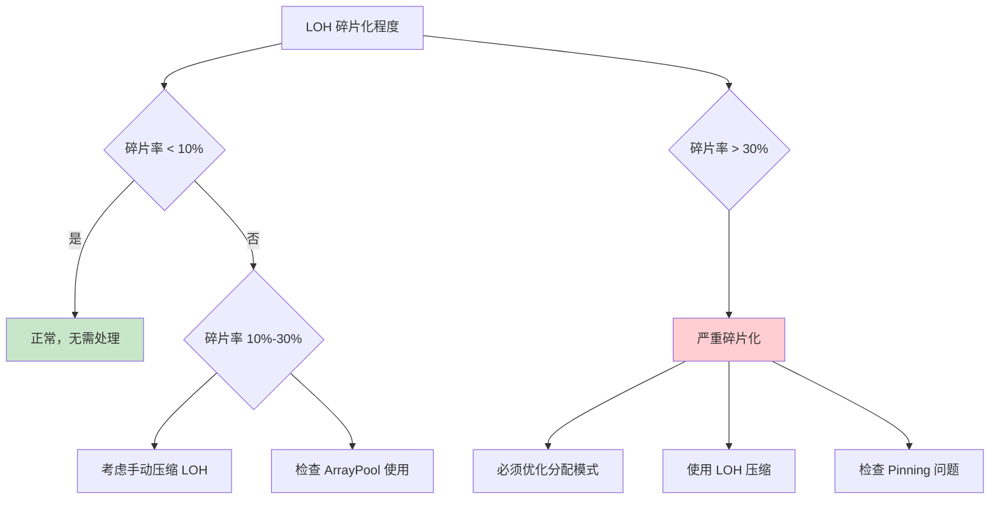

## 三、Pinning 原理

### 3.1 什么是 Pinning

Pinning（固定）是告诉 GC：**不要移动这个对象**。当需要将托管对象的地址传递给非托管代码时，必须固定对象，否则 GC 可能在非托管代码执行期间移动对象，导致非托管代码使用悬空指针。

### 3.2 GCHandle 与固定

```csharp
// GCHandle 的四种类型
public enum GCHandleType
{
    Normal = 0,      // 普通句柄：防止回收
    Pinned = 1,      // 固定句柄：防止回收和移动
    Weak = 2,        // 弱引用句柄：允许回收
    WeakTrackResurrection = 3  // 弱引用追踪复活
}
```

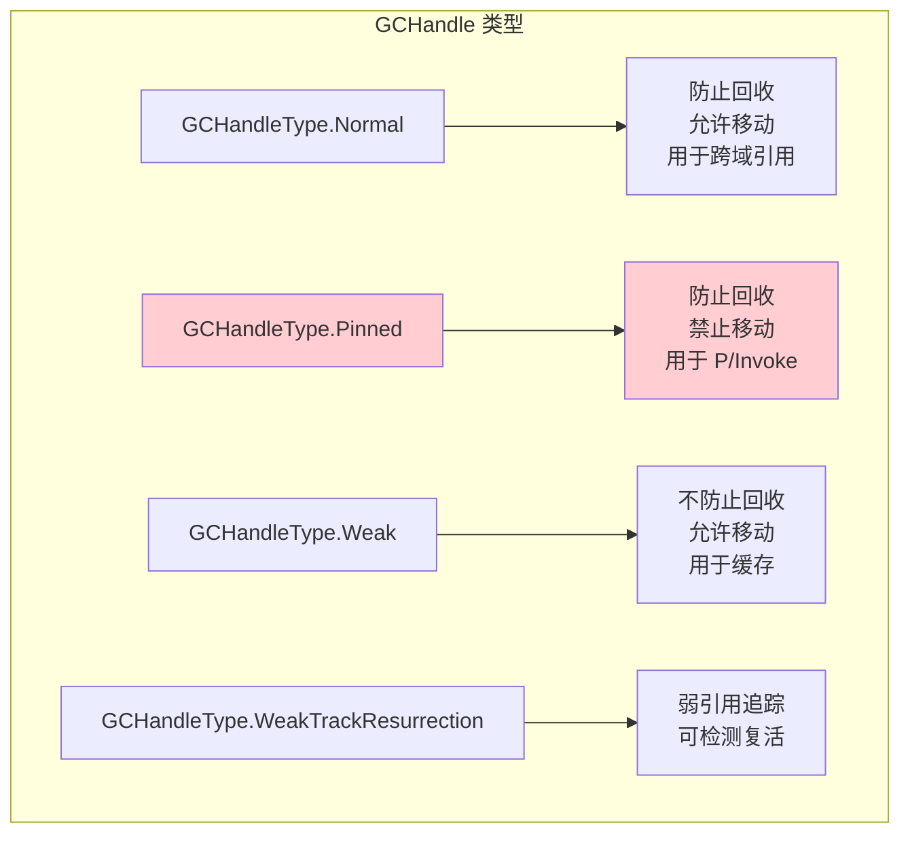

### 3.3 GCHandle 固定的 IL

```csharp
public static class PinningDemo
{
    public static IntPtr PinObject(byte[] data)
    {
        // 创建固定 GCHandle
        GCHandle handle = GCHandle.Alloc(data, GCHandleType.Pinned);
        try
        {
            // 获取固定后的地址
            return handle.AddrOfPinnedObject();
        }
        finally
        {
            // 必须释放！
            handle.Free();
        }
    }
}
```

```il
.method public hidebysig static native int PinObject(unsigned int8[] data) cil managed
{
    .locals init (
        [0] valuetype [mscorlib]System.Runtime.InteropServices.GCHandle handle
    )

    // GCHandle.Alloc(data, GCHandleType.Pinned)
    IL_0000: ldarg.0
    IL_0001: ldc.i4.1                          // GCHandleType.Pinned = 1
    IL_0002: call valuetype [mscorlib]System.Runtime.InteropServices.GCHandle
        [mscorlib]System.Runtime.InteropServices.GCHandle::Alloc(object, valuetype [mscorlib]System.Runtime.InteropServices.GCHandleType)
    IL_0007: stloc.0

    .try
    {
        // handle.AddrOfPinnedObject()
        IL_0008: ldloca.s handle
        IL_000a: call instance native int [mscorlib]System.Runtime.InteropServices.GCHandle::AddrOfPinnedObject()
        IL_000f: stloc.1

        IL_0010: leave.s IL_001c
    }
    finally
    {
        // handle.Free()
        IL_0012: ldloca.s handle
        IL_0014: call instance void [mscorlib]System.Runtime.InteropServices.GCHandle::Free()
        IL_0019: endfinally
    }

    IL_001c: ldloc.1
    IL_001d: ret
}
```

### 3.4 GCHandle 的内部结构

```
┌──────────────────────────────────────────────────────┐
│  GCHandle 表（GC Handle Table）                       │
├──────────────────────────────────────────────────────┤
│                                                      │
│  ┌─────────┬──────────────┬────────────────────┐    │
│  │ Handle  │  Object Ref  │  Type / Pin Flag   │    │
│  ├─────────┼──────────────┼────────────────────┤    │
│  │ 0       │ 0x2A1B3C4D   │ Normal             │    │
│  │ 1       │ 0x5E6F7A8B   │ Pinned ← 禁止移动  │    │
│  │ 2       │ 0x9C0D1E2F   │ Weak               │    │
│  │ 3       │ 0x3A4B5C6D   │ Pinned ← 禁止移动  │    │
│  └─────────┴──────────────┴────────────────────┘    │
│                                                      │
│  GC 标记阶段:                                        │
│  - Normal: 标记对象为存活                            │
│  - Pinned: 标记对象为存活 + 不移动                   │
│  - Weak: 不标记，允许回收                            │
│                                                      │
│  GC 重定位阶段:                                      │
│  - Pinned 对象不会被移动                             │
│  - Normal 对象可能被移动（更新 Handle 表中的地址）    │
│                                                      │
└──────────────────────────────────────────────────────┘
```

## 四、fixed 语句 IL

### 4.1 fixed 语句的编译

```csharp
public static void FixedStatement(byte[] data)
{
    unsafe
    {
        fixed (byte* ptr = data)
        {
            // ptr 在此块内有效
            // data 对象被固定，GC 不会移动它
            *ptr = 0xFF;
        }
        // 离开 fixed 块后，对象自动解除固定
    }
}
```

```il
.method public hidebysig static void FixedStatement(unsigned int8[] data) cil managed
{
    .locals init (
        [0] unsigned int8& pinned ptr    // pinned 标记！
    )

    // fixed (byte* ptr = data)
    IL_0000: ldarg.0
    IL_0001: conv.u
    IL_0002: stloc.0             // 存入 pinned 局部变量

    // *ptr = 0xFF
    IL_0003: ldloc.0
    IL_0004: ldc.i4 0xFF
    IL_0006: stind.i1

    // 离开 fixed 块：将 null 赋给 pinned 变量 → 解除固定
    IL_0007: ldc.i4.0
    IL_0008: conv.u
    IL_0009: stloc.0             // ptr = null → unpinned

    IL_000a: ret
}
```

::: important pinned 局部变量
IL 中的 `pinned` 修饰符告诉 CLR：这个局部变量持有的引用指向的对象在方法执行期间不能被 GC 移动。当变量被赋值为 `null` 或方法返回时，固定自动解除。
:::

### 4.2 P/Invoke 的自动固定

```csharp
// P/Invoke 中的自动固定
[DllImport("kernel32.dll")]
static extern bool WriteFile(
    IntPtr hFile,
    byte[] lpBuffer,     // 传递托管数组给非托管代码
    int nNumberOfBytesToWrite,
    out int lpNumberOfBytesWritten,
    IntPtr lpOverlapped
);

// 调用时，CLR 自动固定 lpBuffer 数组
// 固定持续到 P/Invoke 调用返回
byte[] buffer = new byte[1024];
WriteFile(handle, buffer, buffer.Length, out _, IntPtr.Zero);
// buffer 在 WriteFile 调用期间被自动固定
```

### 4.3 Pin 模式与性能

```mermaid
graph TD
    A["Pinning 的影响"] --> B["阻止 GC 移动对象"]
    B --> C["GC 无法压缩该区域"]
    C --> D["产生碎片空洞"]
    D --> E["后续分配受影响"]

    A --> F["增加 GC 暂停时间"]
    F --> G["需要额外处理 pinned 对象"]
    G --> H["跳过 pinned 区域"]

    A --> I["短期固定 vs 长期固定"]

    I --> J["短期 fixed 块"]
    J --> K["影响小，方法内自动解除"]

    I --> L["长期 GCHandle.Pinned"]
    L --> M["影响大，可能持续整个进程生命周期"]

    style K fill:#C8E6C9
    style M fill:#FFCDD2
```

## 五、Pinning 与 GC 碎片化

### 5.1 碎片化的形成过程

```
┌──────────────────────────────────────────────────────────┐
│  Pinning 导致碎片化的过程                                 │
├──────────────────────────────────────────────────────────┤
│                                                          │
│  初始堆：                                                │
│  ┌────┬────┬────┬────┬────┬────┬────┬────┬────┬────┐   │
│  │ A  │ B  │ C  │ D  │ E  │ F  │ G  │ H  │ I  │ J  │   │
│  └────┴────┴────┴────┴────┴────┴────┴────┴────┴────┘   │
│                                                          │
│  C 和 G 被 Pinned：                                      │
│  ┌────┬────┬════╗┌────┬────┬════╗┌────┬────┬────┐      │
│  │ A  │ B  │ C  ││ D  │ E  │ G  ││ H  │ I  │ J  │      │
│  └────┴────┴════╗└────┴────┴════╗└────┴────┴────┘      │
│               Pinned        Pinned                      │
│                                                          │
│  GC 回收（D, E, H 被回收）：                              │
│  ┌────┬────┬════╗┌         ┌════╗┌      ┌────┬────┐   │
│  │ A  │ B  │ C  ││ 空闲   │ G  ││ 空闲 │ I  │ J  │   │
│  └────┴────┴════╗└         ┴════╗└      ┴────┴────┘   │
│               Pinned        Pinned                      │
│                                                          │
│  GC 想要压缩但 C 和 G 不能移动：                          │
│  只能部分压缩 C 之前和 G 之后的空间                        │
│  C 和 G 之间的空间无法与外部合并                           │
│                                                          │
│  结果：碎片化                                             │
│  ┌────┬────┬════╗┌  碎片  ┌════╗┌碎片┌────┬────┐      │
│  │ A  │ B  │ C  ││ (浪费) │ G  ││(!) │ I  │ J  │      │
│  └────┴────┴════╗└         ┴════╗└    ┴────┴────┘      │
│               Pinned        Pinned                      │
│                                                          │
└──────────────────────────────────────────────────────────┘
```

### 5.2 Pinning 反模式

```csharp
// 反模式 1：长时间固定
public class BadPinning
{
    private GCHandle _pinnedHandle;  // 进程生命周期持有！

    public void Init()
    {
        var buffer = new byte[1024 * 1024];  // 1MB
        _pinnedHandle = GCHandle.Alloc(buffer, GCHandleType.Pinned);
        // 这个 1MB 的对象永远不会被移动！
        // 在它周围形成碎片空洞
    }
}

// 反模式 2：频繁固定不同对象
public class BadPinning2
{
    public void Process()
    {
        for (int i = 0; i < 10000; i++)
        {
            var buffer = new byte[4096];
            GCHandle handle = GCHandle.Alloc(buffer, GCHandleType.Pinned);
            try
            {
                NativeMethod(handle.AddrOfPinnedObject());
            }
            finally
            {
                handle.Free();
            }
            // 每次固定不同的对象，碎片散布在整个堆上
        }
    }
}
```

### 5.3 正确的 Pinning 方式

```csharp
// 正确方式 1：使用 fixed 短期固定
public static void CorrectPinning(byte[] data)
{
    unsafe
    {
        fixed (byte* ptr = data)
        {
            NativeMethod((IntPtr)ptr);
        }
        // 离开 fixed 块立即解除固定
    }
}

// 正确方式 2：复用固定缓冲区
public class PinnedBufferPool
{
    private byte[] _buffer;
    private GCHandle _handle;
    private IntPtr _ptr;

    public PinnedBufferPool(int size)
    {
        _buffer = new byte[size];
        _handle = GCHandle.Alloc(_buffer, GCHandleType.Pinned);
        _ptr = _handle.AddrOfPinnedObject();
        // 一次固定，多次复用
    }

    public IntPtr Pointer => _ptr;
    public byte[] Buffer => _buffer;

    public void Dispose()
    {
        if (_handle.IsAllocated)
        {
            _handle.Free();
            _ptr = IntPtr.Zero;
        }
    }
}
```

## 六、ArrayPool\<T\> 与 MemoryPool\<T\>

### 6.1 ArrayPool\<T\> 原理

`ArrayPool<T>` 是 .NET 提供的数组对象池，避免频繁分配和释放大数组。

```csharp
// ArrayPool 的使用
public static void ArrayPoolDemo()
{
    byte[] rented = ArrayPool<byte>.Shared.Rent(1024);
    try
    {
        // 使用 rented 数组
        rented.AsSpan().Fill(0xAB);
        ProcessData(rented);
    }
    finally
    {
        ArrayPool<byte>.Shared.Return(rented);
    }
}
```

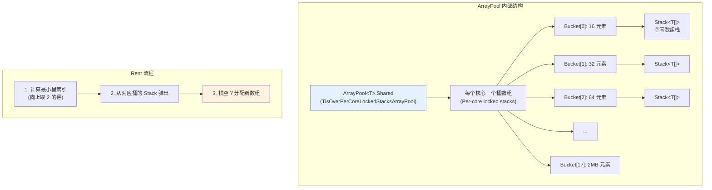

### 6.2 ArrayPool 的桶策略

```csharp
// ArrayPool 的桶大小是 2 的幂
// Rent(100) → 返回长度 128 的数组
// Rent(1000) → 返回长度 1024 的数组
// Rent(85000) → 返回长度 131072 的数组（可能在 LOH 上！）

byte[] rented = ArrayPool<byte>.Shared.Rent(100);
Console.WriteLine($"请求: 100, 实际: {rented.Length}");  // 128

// 重要：返回的数组可能比请求的大
// 只使用你需要的前 N 个元素
rented.AsSpan(0, 100).Fill(0);
```

### 6.3 ArrayPool 与 LOH

```csharp
// ArrayPool 可以避免大数组频繁分配到 LOH
public static void AvoidLOHWithPool()
{
    // 不用 Pool：每次分配 100KB 数组 → LOH
    for (int i = 0; i < 1000; i++)
    {
        var buffer = new byte[100_000];  // LOH！
        Process(buffer);
        // 方法结束后成为 LOH 上的垃圾
        // 只有 Full GC 才能回收
    }

    // 用 Pool：复用数组，避免重复分配
    for (int i = 0; i < 1000; i++)
    {
        byte[] buffer = ArrayPool<byte>.Shared.Rent(100_000);
        try
        {
            Process(buffer);
        }
        finally
        {
            ArrayPool<byte>.Shared.Return(buffer);
        }
        // 数组被归还到池中，下次复用
    }
}
```

### 6.4 MemoryPool\<T\>

```csharp
// MemoryPool<T> 返回 IMemoryOwner<T>，可与 async 方法配合
public static async Task ProcessAsync()
{
    using IMemoryOwner<byte> owner = MemoryPool<byte>.Shared.Rent(1024);
    Memory<byte> memory = owner.Memory;

    await ProcessMemoryAsync(memory);
    // using 结束时自动归还
}

private static Task ProcessMemoryAsync(Memory<byte> memory)
{
    // Memory<T> 可以跨 async 边界
    // Span<T> 不行（ref struct）
    return Task.CompletedTask;
}
```

## 七、LOH 压缩

### 7.1 手动触发 LOH 压缩

```csharp
// 触发 LOH 压缩
public static void CompactLOH()
{
    // 设置 LOH 压缩模式
    GCSettings.LargeObjectHeapCompactionMode = GCLargeObjectHeapCompactionMode.CompactOnce;

    // 触发 Full GC（这次会压缩 LOH）
    GC.Collect(2, GCCollectionMode.Forced, blocking: true, compacting: true);

    // CompactOnce 模式在下次 GC 后自动恢复为 None
    Console.WriteLine($"LOH 压缩模式: {GCSettings.LargeObjectHeapCompactionMode}");
}
```

### 7.2 LOH 压缩的时机

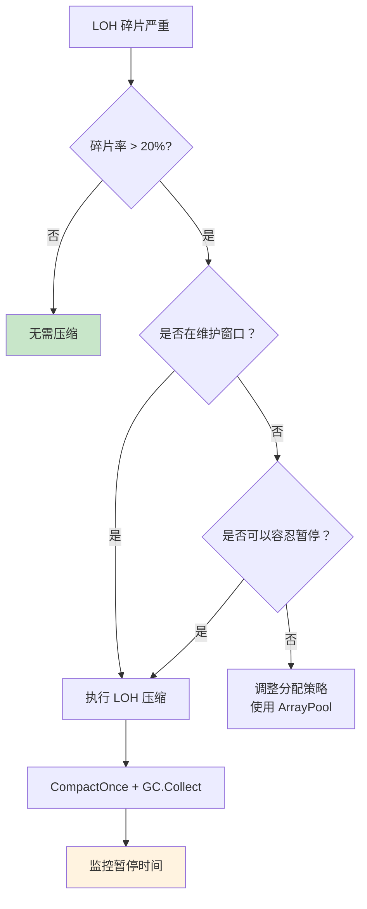

## 八、.NET 8+ LOH 分代

### 8.1 LOH 分代的改进

.NET 8 对 LOH 进行了分代改进，LOH 不再只属于 Gen2，而是可以像 SOH 一样参与分代回收。

```csharp
// .NET 8 之前：LOH 只有 Gen2
// Full GC 才能回收 LOH 上的垃圾
// LOH 上的短暂大对象需要等到 Full GC

// .NET 8+：LOH 支持 Gen0/Gen1/Gen2
// 新分配的大对象在 LOH 的 Gen0
// 存活的大对象晋升到 LOH 的 Gen1/Gen2
// Gen0/Gen1 GC 可以回收 LOH 上的短暂大对象

// 这意味着：
// 1. 短暂大对象的回收更及时
// 2. 减少了 Full GC 的频率
// 3. LOH 碎片化压力减小
```

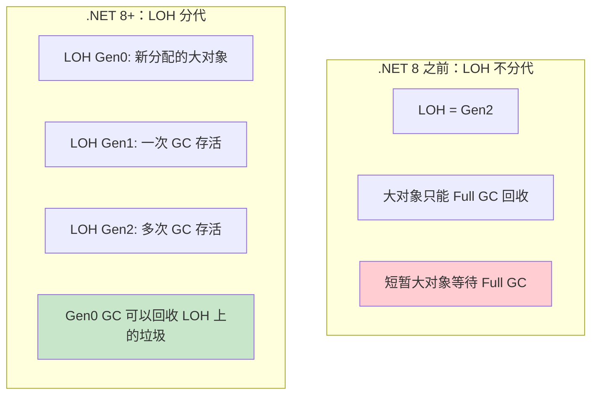

## 九、POH（Pinned Object Heap）.NET 7+

### 9.1 POH 的设计动机

POH（Pinned Object Heap）是一个专门用于存放固定对象的堆。将固定对象集中存放，减少对 SOH/LOH 压缩的干扰。

```csharp
// .NET 7+ 可以直接分配到 POH
// 使用 GC.AllocateUninitializedArray 或 GC.AllocateArray
byte[] pinnedArray = GC.AllocateUninitializedArray<byte>(
    length: 4096,
    pinned: true    // 分配到 POH！
);

// pinnedArray 从分配开始就是固定的
// 不需要 GCHandle.Alloc
// 不会干扰 SOH/LOH 的压缩
```

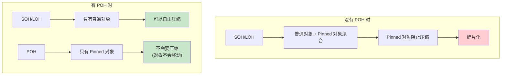

### 9.2 POH 的使用场景

```csharp
// 场景 1：与 C 库交互的固定缓冲区
public class NativeInterop
{
    private readonly byte[] _pinnedBuffer;

    public NativeInterop(int bufferSize)
    {
        // 直接分配到 POH
        _pinnedBuffer = GC.AllocateArray<byte>(bufferSize, pinned: true);
    }

    public IntPtr BufferPtr => Marshal.UnsafeAddrOfPinnedArrayElement(_pinnedBuffer, 0);

    // _pinnedBuffer 永远不会被 GC 移动
    // 但仍然会被 GC 跟踪（不会泄漏）
}

// 场景 2：高性能网络缓冲区
public class NetworkBuffer
{
    private readonly byte[] _receiveBuffer;
    private readonly byte[] _sendBuffer;

    public NetworkBuffer()
    {
        _receiveBuffer = GC.AllocateUninitializedArray<byte>(8192, pinned: true);
        _sendBuffer = GC.AllocateUninitializedArray<byte>(8192, pinned: true);
    }
}
```

::: important POH 的注意事项
1. **POH 上的对象永远不会被压缩** — 它们从一开始就固定了
2. **POH 的分配不受 AllocationContext 优化** — 使用空闲列表
3. **POH 对象仍然会被 GC 回收** — 只是不可移动
4. **POH 碎片化** — POH 本身也可能碎片化，但不会影响 SOH/LOH
:::

## 十、Span 与 Pinning 优化

### 10.1 Span 消除显式 Pinning

```csharp
// 传统方式：显式 Pinning
public static void OldWay(byte[] data)
{
    GCHandle handle = GCHandle.Alloc(data, GCHandleType.Pinned);
    try
    {
        IntPtr ptr = handle.AddrOfPinnedObject();
        NativeMethod(ptr, data.Length);
    }
    finally
    {
        handle.Free();
    }
}

// Span 方式：框架内部处理 Pinning
public static void NewWay(byte[] data)
{
    // Span 内部在需要时自动 Pin/Unpin
    // 对于 P/Invoke，使用 Marshal.AsBytes 或 MemoryMarshal
    ProcessSpan(data);
}

[DllImport("kernel32.dll")]
static extern bool WriteFile(
    IntPtr hFile,
    ReadOnlySpan<byte> buffer,  // .NET 7+ 自动处理
    int bytesToWrite,
    out int bytesWritten,
    IntPtr overlapped
);
```

### 10.2 CollectionsMarshal.AsSpan

```csharp
// .NET 6+ 高性能列表访问
public static void AccessListWithoutCopy(List<int> list)
{
    // 获取 List 内部数组的 Span
    // 临时固定内部数组（非常短的时间）
    Span<int> span = CollectionsMarshal.AsSpan(list);

    // 直接操作内部数组，无需拷贝
    for (int i = 0; i < span.Length; i++)
    {
        span[i] *= 2;
    }
    // Span 释放后，内部数组自动解除固定
}
```

## 十一、性能对比与最佳实践

### 11.1 LOH 分配性能

```csharp
[MemoryDiagnoser]
public class LOHBenchmark
{
    private const int LargeSize = 100_000;

    [Benchmark(Baseline = true)]
    public byte[] DirectAllocation() => new byte[LargeSize];

    [Benchmark]
    public byte[] ArrayPoolRent()
    {
        byte[] rented = ArrayPool<byte>.Shared.Rent(LargeSize);
        ArrayPool<byte>.Shared.Return(rented);
        return rented;
    }

    [Benchmark]
    public byte[] PinnedAllocation() => GC.AllocateArray<byte>(LargeSize, pinned: true);
}

// 结果示例（.NET 8）：
// | Method            | Mean     | Allocated |
// |------------------ |---------:|----------:|
// | DirectAllocation  | 150 ns   | 100000 B  |
// | ArrayPoolRent     |  25 ns   |       0 B |
// | PinnedAllocation  | 180 ns   | 100000 B  |
```

### 11.2 最佳实践总结

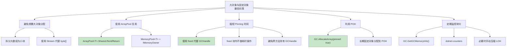

## 十二、实战：减少 LOH 碎片化的完整方案

```csharp
public class LowFragmentationBufferManager : IDisposable
{
    private readonly int _chunkSize;
    private readonly List<byte[]> _chunks = new();
    private readonly byte[]? _pinnedChunk;

    public LowFragmentationBufferManager(int chunkSize, bool usePoh)
    {
        _chunkSize = chunkSize;

        if (usePoh)
        {
            // .NET 7+: 使用 POH 避免干扰 SOH/LOH
            _pinnedChunk = GC.AllocateUninitializedArray<byte>(chunkSize, pinned: true);
        }
    }

    public Span<byte> GetBuffer()
    {
        // 优先复用已有 chunk
        foreach (var chunk in _chunks)
        {
            if (!IsInUse(chunk))
                return chunk;
        }

        // 新 chunk 不超过 85000 字节（避免 LOH）
        int size = Math.Min(_chunkSize, 84_000);
        byte[] newChunk = GC.AllocateUninitializedArray<byte>(size);
        _chunks.Add(newChunk);
        return newChunk;
    }

    private bool IsInUse(byte[] chunk) => false; // 简化

    public void Dispose()
    {
        _chunks.Clear();
    }
}

// 使用
public class Application
{
    private readonly LowFragmentationBufferManager _bufferManager =
        new(chunkSize: 80_000, usePoh: true);  // 每块 80KB，使用 POH

    public void ProcessData()
    {
        Span<byte> buffer = _bufferManager.GetBuffer();
        // 处理数据...
    }
}
```

## 十三、总结

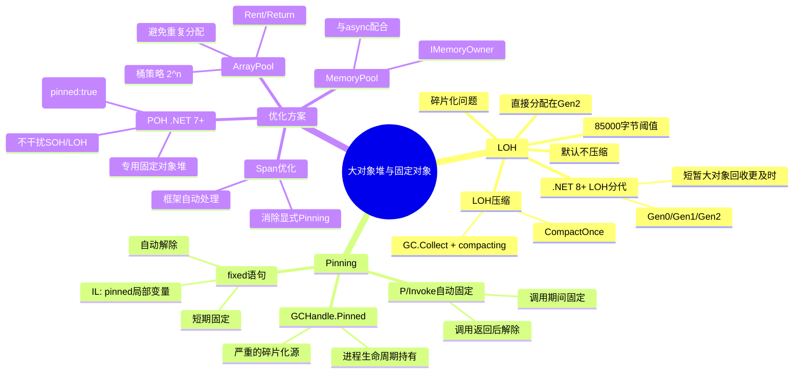

::: tip 核心要点回顾
1. **85000字节阈值** — 超过此大小直接分配在 LOH（Gen2），只有 Full GC 回收
2. **LOH 默认不压缩** — 移动大对象代价高，但导致碎片化
3. **Pinning 阻止 GC 压缩** — 固定对象周围的碎片无法消除
4. **ArrayPool 复用大数组** — 避免频繁分配/释放 LOH 对象
5. **POH 隔离固定对象** — .NET 7+ 将固定对象集中管理，不干扰 SOH/LOH
6. **缩短 Pinning 时间** — 使用 `fixed` 代替长期 `GCHandle.Alloc`
7. **.NET 8+ LOH 分代** — 短暂大对象回收更及时，减少 Full GC 频率
:::
