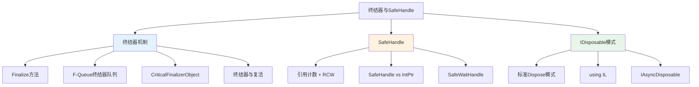
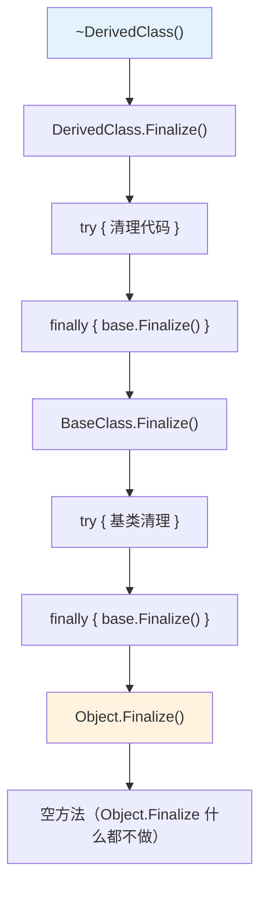
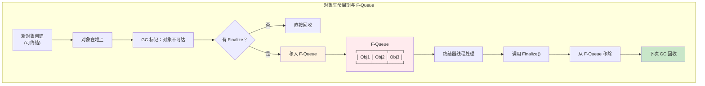
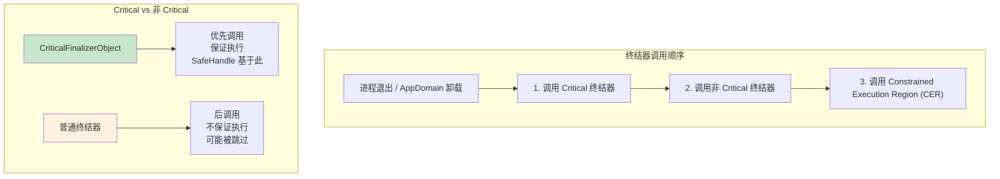
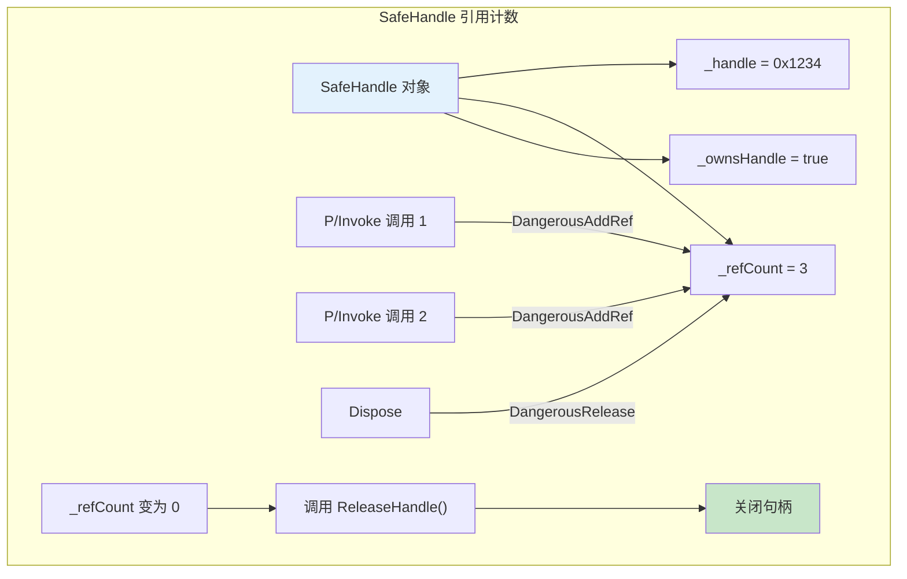
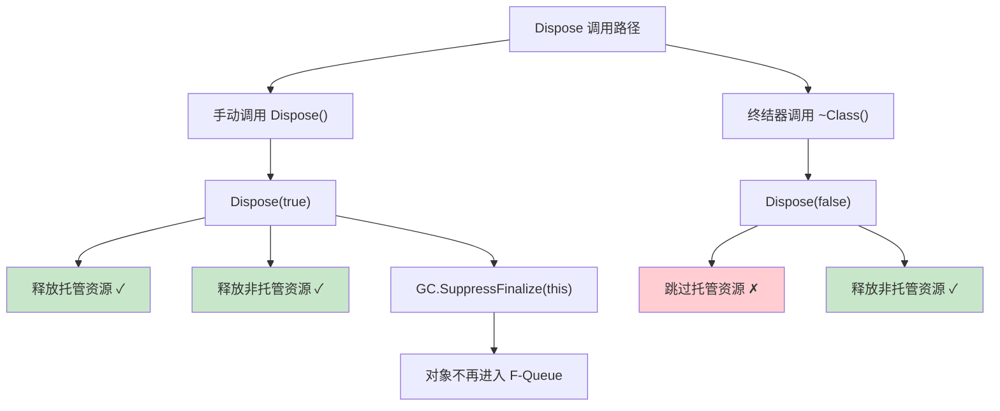
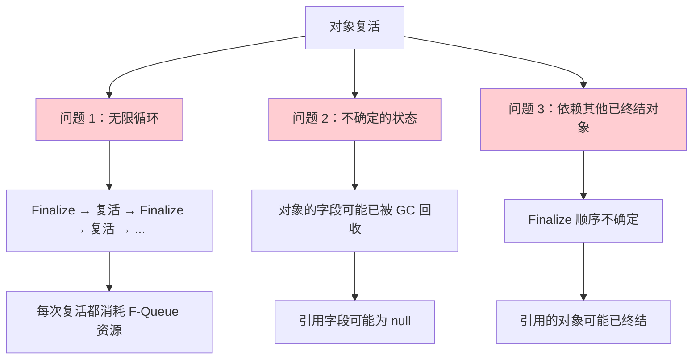
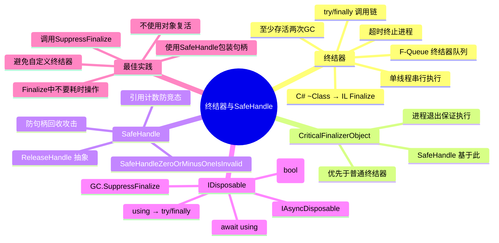

# 终结器与 SafeHandle

> 终结器是 CLR 的"最后防线"——当开发者忘记释放资源时，终结器确保非托管资源最终被回收。但终结器带来了复杂的生命周期、性能代价和微妙的安全问题。SafeHandle 是微软给出的标准解决方案。



## 一、终结器 IL 与 Finalize 方法

### 1.1 C# 析构器 → Finalize 方法

C# 的 `~ClassName()` 语法（析构器）在 IL 中被编译为 `Finalize` 方法：

```csharp
public class ResourceHolder
{
    private IntPtr _handle;

    // C# 析构器语法
    ~ResourceHolder()
    {
        Console.WriteLine("Finalize 被调用");
        if (_handle != IntPtr.Zero)
        {
            NativeMethods.CloseHandle(_handle);
            _handle = IntPtr.Zero;
        }
    }
}
```

```il
.class public auto ansi beforefieldinit ResourceHolder
    extends [mscorlib]System.Object
{
    .method family hidebysig virtual instance void Finalize() cil managed
    {
        .try
        {
            IL_0000: ldstr "Finalize 被调用"
            IL_0005: call void [mscorlib]System.Console::WriteLine(string)

            IL_000a: ldarg.0
            IL_000b: ldfld native int ResourceHolder::_handle
            IL_0010: ldc.i4.0
            IL_0011: conv.i
            IL_0012: bne.un.s IL_0026

            IL_0014: ldarg.0
            IL_0015: ldc.i4.0
            IL_0016: conv.i
            IL_0017: stfld native int ResourceHolder::_handle

            IL_001c: leave.s IL_0035

            IL_001e: ldarg.0
            IL_001f: ldc.i4.0
            IL_0020: conv.i
            IL_0021: stfld native int ResourceHolder::_handle

            IL_0026: ldarg.0
            IL_0027: ldfld native int ResourceHolder::_handle
            IL_002c: call bool NativeMethods::CloseHandle(native int)
            IL_0031: pop
            IL_0032: br.s IL_001e
        }
        finally
        {
            IL_0034: ldarg.0
            IL_0035: call instance void [mscorlib]System.Object::Finalize()
        }

        IL_003a: ret
    }
}
```

::: important 析构器的 try/finally 包装
编译器自动将析构器代码包装在 `try/finally` 中，`finally` 块调用 `base.Finalize()`。这确保即使子类的 Finalize 抛出异常，基类的 Finalize 也一定会被调用。
:::

### 1.2 Finalize 调用链



## 二、终结器队列（F-Queue）

### 2.1 终结器队列的结构

CLR 维护了一个特殊的队列——终结器队列（F-Queue，也叫 Freachable Queue），用于追踪需要终结的对象。



### 2.2 F-Queue 的详细工作流程

```
┌──────────────────────────────────────────────────────────────┐
│  GC 回收流程中的终结器处理                                     │
├──────────────────────────────────────────────────────────────┤
│                                                              │
│  1. 标记阶段:                                                │
│     - 扫描根（栈、寄存器、GC 句柄）                          │
│     - 扫描 F-Queue 中的对象（视为根！重要！）                  │
│     - 标记所有可达对象                                       │
│                                                              │
│  2. 发现不可达但可终结的对象:                                 │
│     ┌────┐ ┌────┐ ┌────┐                                   │
│     │ A  │ │ B  │ │ C  │  ← 不可达                          │
│     │~A()│ │    │ │~C()│  ← A 和 C 有 Finalize              │
│     └────┘ └────┘ └────┘                                   │
│                                                              │
│  3. 将可终结对象移入 F-Queue:                                │
│     F-Queue: [A] → [C] → ...                                │
│     B 没有终结器，直接回收                                    │
│                                                              │
│  4. F-Queue 中的对象被视为"活的"                              │
│     → 它们不会被这次 GC 回收                                  │
│     → 它们晋升到更高代                                       │
│                                                              │
│  5. 终结器线程异步处理 F-Queue:                              │
│     - 从队列取出对象                                         │
│     - 调用 Finalize()                                       │
│     - 从队列移除                                             │
│                                                              │
│  6. 下次 GC 回收已终结的对象                                 │
│                                                              │
└──────────────────────────────────────────────────────────────┘
```

::: warning 终结器的代价
1. **对象至少存活两次 GC** — 第一次移入 F-Queue，第二次才真正回收
2. **晋升到更高代** — 第一次 GC 后从 Gen0 晋升到 Gen1/Gen2
3. **终结器线程是单线程** — Finalize 方法串行执行，一个慢就阻塞后续
4. **不确定的执行时间** — 不保证 Finalize 何时被调用
:::

### 2.3 终结器线程

```csharp
// 查看终结器线程信息
Console.WriteLine($"终结器线程 ID: {GetFinalizerThreadId()}");

// 终结器线程的特征：
// 1. 只有一个终结器线程
// 2. 优先级为 THREAD_PRIORITY_HIGHEST（高优先级）
// 3. F-Queue 为空时阻塞等待
// 4. 有新对象进入 F-Queue 时被唤醒

// .NET 9+ 改进：可以配置多个终结器线程
```

## 三、CriticalFinalizerObject

### 3.1 CriticalFinalizerObject 的作用

`CriticalFinalizerObject` 确保终结器在进程终止时一定会被调用，即使在 CLR 强制关闭的情况下。

```csharp
// CriticalFinalizerObject 的保证：
// 1. 终结器在 AppDomain 卸载时一定会被调用
// 2. 终结器在进程正常退出时一定会被调用
// 3. 非 Critical 终结器被调用之前先调用 Critical 终结器
// 4. 即使 Environment.FailFast 也会尝试调用

public class CriticalResource : CriticalFinalizerObject
{
    private IntPtr _handle;

    ~CriticalResource()
    {
        // 这个 Finalize 是"关键"的
        // CLR 保证在进程退出时调用
        if (_handle != IntPtr.Zero)
        {
            NativeMethods.CloseHandle(_handle);
        }
    }
}
```



## 四、SafeHandle 原理

### 4.1 SafeHandle 的设计动机

使用 `IntPtr` 表示非托管句柄是危险的：

```csharp
// 危险的 IntPtr 方式
public class DangerousResource
{
    private IntPtr _handle;  // 只是一个整数！

    // 问题 1：句柄泄漏
    // 如果在构造和 Dispose 之间发生异常，句柄泄漏

    // 问题 2：句柄回收攻击
    // 对象被回收后，_handle 仍然持有值
    // 如果另一个对象获得了相同句柄值，可能被误用

    // 问题 3：多线程竞态
    // 一个线程在用句柄，另一个线程释放了它
}
```

### 4.2 SafeHandle 的内部结构

```csharp
// SafeHandle 的简化内部结构
public abstract class SafeHandle : CriticalFinalizerObject, IDisposable
{
    protected IntPtr handle;           // 非托管句柄
    private int _refCount;             // 引用计数
    private bool _ownsHandle;          // 是否拥有此句柄
    private bool _fullyInitialized;    // 是否完全初始化

    // 引用计数管理
    public bool IsInvalid => handle == IntPtr.Zero;

    public void DangerousAddRef(ref bool success)
    {
        // 原子递增引用计数
        Interlocked.Increment(ref _refCount);
        success = true;
    }

    public void DangerousRelease()
    {
        // 原子递减引用计数
        if (Interlocked.Decrement(ref _refCount) == 0)
        {
            // 引用计数为 0，可以释放
            Dispose(true);
        }
    }

    // 子类必须实现
    protected abstract bool ReleaseHandle();
}
```



### 4.3 SafeHandle 与 P/Invoke

```csharp
// SafeHandle 与 P/Invoke 的配合
public class SafeFileHandle : SafeHandleZeroOrMinusOneIsInvalid
{
    public SafeFileHandle() : base(true) { }

    protected override bool ReleaseHandle()
    {
        return NativeMethods.CloseHandle(handle);
    }
}

public static class NativeMethods
{
    [DllImport("kernel32.dll")]
    public static extern SafeFileHandle CreateFile(
        string lpFileName,
        uint dwDesiredAccess,
        uint dwShareMode,
        IntPtr lpSecurityAttributes,
        uint dwCreationDisposition,
        uint dwFlagsAndAttributes,
        IntPtr hTemplateFile
    );

    [DllImport("kernel32.dll")]
    public static extern bool CloseHandle(IntPtr hObject);
}

// 使用
SafeFileHandle handle = NativeMethods.CreateFile(
    "test.txt", 0x80000000, 0, IntPtr.Zero, 3, 0x80, IntPtr.Zero
);

// CLR 自动管理引用计数：
// 1. P/Invoke 返回时，SafeHandle 引用计数 +1
// 2. 使用完毕后，引用计数 -1
// 3. 引用计数为 0 时，ReleaseHandle 被调用
```

### 4.4 SafeHandle vs IntPtr

| 特性 | IntPtr | SafeHandle |
|------|--------|-----------|
| 类型安全 | 无，只是整数 | 有，包装了句柄语义 |
| 自动释放 | 否，需要手动 | 是，Finalize 兜底 |
| 引用计数 | 无 | 有，防止竞态 |
| 句柄回收攻击 | 脆弱 | 安全（IsInvalid 检查） |
| 异步安全 | 否 | 是（CriticalFinalizerObject） |
| P/Invoke 兼容 | 是 | 是（CLR 自动处理） |
| 性能 | 最快 | 略慢（引用计数开销） |

::: important 何时必须使用 SafeHandle
1. **包装操作系统句柄** — 文件句柄、注册表句柄、事件句柄等
2. **P/Invoke 参数** — 传递句柄给非托管代码
3. **跨线程共享句柄** — 引用计数防止竞态
4. **关键资源** — 必须确保释放的资源
:::

## 五、IDisposable 标准模式

### 5.1 标准 Dispose 模式

```csharp
public class ManagedAndNativeResource : IDisposable
{
    private SafeHandle? _nativeResource;  // 非托管资源（用 SafeHandle 包装）
    private IDisposable? _managedResource; // 托管资源
    private bool _disposed;

    public void DoWork()
    {
        ObjectDisposedException.ThrowIf(_disposed, this);
        // 正常工作...
    }

    // 公共 Dispose 方法
    public void Dispose()
    {
        Dispose(disposing: true);
        GC.SuppressFinalize(this);  // 告诉 GC 不需要调用 Finalize
    }

    // 受保护的虚方法
    protected virtual void Dispose(bool disposing)
    {
        if (_disposed) return;

        if (disposing)
        {
            // 释放托管资源
            _managedResource?.Dispose();
        }

        // 释放非托管资源（无论 disposing 是什么）
        _nativeResource?.Dispose();
        _nativeResource = null;

        _disposed = true;
    }

    // 终结器（兜底）
    ~ManagedAndNativeResource()
    {
        Dispose(disposing: false);
    }
}
```



::: important 为什么终结器不释放托管资源？
在 Finalize 中，对象的字段可能已经被回收（因为 Finalize 的执行顺序不确定）。访问已回收的托管对象可能导致：
1. `NullReferenceException`
2. 访问已终结的对象
3. 死锁（如果对象有锁）

非托管资源（句柄、内存）是原始值，不受 GC 影响，可以在 Finalize 中安全释放。
:::

### 5.2 sealed 类的简化模式

```csharp
// sealed 类不需要虚 Dispose(bool)
public sealed class SimpleResource : IDisposable
{
    private SafeHandle _handle;
    private bool _disposed;

    public void Dispose()
    {
        if (_disposed) return;

        _handle?.Dispose();
        _handle = null!;
        _disposed = true;

        GC.SuppressFinalize(this);
    }

    // sealed 类通常不需要终结器
    // 因为 SafeHandle 自身有终结器
}
```

## 六、using IL

### 6.1 using 的编译

```csharp
public static void UsingDemo()
{
    using var resource = new ManagedAndNativeResource();
    resource.DoWork();
}
```

```il
.method public hidebysig static void UsingDemo() cil managed
{
    .locals init (
        [0] class ManagedAndNativeResource resource
    )

    IL_0000: newobj instance void ManagedAndNativeResource::.ctor()
    IL_0005: stloc.0

    .try
    {
        IL_0006: ldloc.0
        IL_0007: callvirt instance void ManagedAndNativeResource::DoWork()
        IL_000c: leave.s IL_0018
    }
    finally
    {
        IL_000e: ldloc.0
        IL_000f: brfalse.s IL_0017
        IL_0011: ldloc.0
        IL_0012: callvirt instance void [mscorlib]System.IDisposable::Dispose()
        IL_0017: endfinally
    }

    IL_0018: ret
}
```

::: important using → try/finally/Dispose
`using` 语句编译为 `try/finally`，在 `finally` 块中调用 `Dispose()`。即使 `try` 块中抛出异常，`Dispose()` 也会被调用。
:::

### 6.2 using 声明 (C# 8+)

```csharp
// C# 8+ using 声明（无大括号）
public static void UsingDeclaration()
{
    using var resource = new ManagedAndNativeResource();
    resource.DoWork();
    // 方法结束时自动调用 Dispose
}

// 等价于
public static void UsingBlock()
{
    using (var resource = new ManagedAndNativeResource())
    {
        resource.DoWork();
    }  // 这里调用 Dispose
}
```

### 6.3 await using (IAsyncDisposable)

```csharp
// IAsyncDisposable 与 await using
public static async Task AsyncUsingDemo()
{
    await using var resource = new AsyncResource();
    await resource.DoWorkAsync();
}

public class AsyncResource : IAsyncDisposable
{
    private Stream? _stream;

    public async ValueTask DoWorkAsync()
    {
        // 异步工作...
    }

    public async ValueTask DisposeAsync()
    {
        if (_stream != null)
        {
            await _stream.DisposeAsync();
            _stream = null;
        }

        GC.SuppressFinalize(this);
    }
}
```

```il
// await using 的 IL（简化）
// 编译器生成一个状态机，在 finally 块中调用 DisposeAsync
// 类似 using，但使用 await 调用
```

## 七、GC.SuppressFinalize

### 7.1 SuppressFinalize 的原理

`GC.SuppressFinalize` 告诉 CLR：这个对象不需要调用 Finalize，从 F-Queue 中移除。

```csharp
// 在 Dispose 中调用
public void Dispose()
{
    Dispose(true);
    GC.SuppressFinalize(this);  // 不需要 Finalize 了
}
```

```il
// GC.SuppressFinalize 的 IL
IL_0000: ldarg.0
IL_0001: call void [mscorlib]System.GC::SuppressFinalize(object)
```

### 7.2 SuppressFinalize 的内部机制

```
┌──────────────────────────────────────────────────────────────┐
│  SuppressFinalize 的工作原理                                 │
├──────────────────────────────────────────────────────────────┤
│                                                              │
│  对象头中的标志位：                                          │
│  ┌──────────────────────────────────────────┐               │
│  │ SyncBlock 中的标志                        │               │
│  │ ... | BFINALIZER_SUPPRESSED | ...        │               │
│  └──────────────────────────────────────────┘               │
│                                                              │
│  GC 标记阶段发现不可达对象时：                               │
│  1. 检查对象是否有 Finalize 方法                             │
│  2. 如果有，检查 BFINALIZER_SUPPRESSED 标志                  │
│  3. 如果已设置，跳过 F-Queue，直接回收                       │
│  4. 如果未设置，移入 F-Queue                                │
│                                                              │
└──────────────────────────────────────────────────────────────┘
```

## 八、终结器与复活

### 8.1 对象复活

在 Finalize 方法中，对象可以"复活"——将自己重新引用到根可达的位置。

```csharp
public class ResurrectingObject
{
    public static List<ResurrectingObject> LiveObjects = new();

    public int Data { get; set; }

    ~ResurrectingObject()
    {
        // 复活！将自己重新加入静态列表
        LiveObjects.Add(this);
        Console.WriteLine($"对象 {Data} 被复活了！");

        // 警告：下次 GC 时，这个对象还会再次进入 F-Queue
        // 如果不加控制，会无限循环！
    }
}

// 使用
var obj = new ResurrectingObject { Data = 42 };
obj = null;                    // 对象不可达
GC.Collect();                  // GC 调用 Finalize，对象被复活
Console.WriteLine(ResurrectingObject.LiveObjects.Count);  // 1

// 再次让对象不可达
ResurrectingObject.LiveObjects.Clear();
GC.Collect();                  // 对象再次进入 F-Queue！
```

### 8.2 复活的问题



::: warning 避免使用复活
对象复活是一个危险的模式，几乎不应在生产代码中使用。如果需要对象池，使用 `ArrayPool` 或自定义池，而不是复活。
:::

## 九、终结器线程与超时

### 9.1 终结器线程的超时

```csharp
// 终结器线程的超时机制
// 默认超时：约 2 秒（CLR 内部硬编码）
// 如果 Finalize 方法超过此时间，CLR 会终止进程

// 安全的 Finalize 实现
~MyResource()
{
    try
    {
        // 快速释放，不做耗时操作
        if (_handle != IntPtr.Zero)
        {
            NativeMethods.CloseHandle(_handle);
            _handle = IntPtr.Zero;
        }
    }
    catch
    {
        // Finalize 中吞掉异常
        // 抛出异常会终止终结器线程
    }
}
```

### 9.2 终结器线程阻塞

```csharp
// 终结器线程是单线程
// 如果一个 Finalize 方法阻塞，所有后续 Finalize 都无法执行

// 危险示例
~BadResource()
{
    Thread.Sleep(5000);        // 阻塞 5 秒！
    lock (_globalLock)         // 可能死锁！
    {
        // ...
    }
}

// 监控终结器队列
Console.WriteLine($"等待终结的对象数: {GC.GetGCMemoryInfo().FinalizationPendingCount}");
```

## 十、SafeHandle 的完整实现

### 10.1 自定义 SafeHandle

```csharp
public class SafeMemoryHandle : SafeHandleZeroOrMinusOneIsInvalid
{
    // ownsHandle: true 表示此 SafeHandle 拥有句柄，负责释放
    public SafeMemoryHandle() : base(ownsHandle: true) { }

    // 从现有句柄创建
    public SafeMemoryHandle(IntPtr handle) : base(ownsHandle: true)
    {
        SetHandle(handle);
    }

    // 释放句柄的方法
    protected override bool ReleaseHandle()
    {
        // 必须是简单、快速、不会失败的操作
        NativeMemory.Free(handle.ToPointer());
        return true;  // 返回 true 表示释放成功
    }

    // 危险获取句柄（用于 P/Invoke）
    public IntPtr DangerousGetHandle()
    {
        return handle;
    }
}
```

### 10.2 SafeHandle 与引用计数

```csharp
// SafeHandle 的引用计数确保 P/Invoke 期间句柄不被释放
public class SafeHandleRefCount
{
    public static void PInvokeWithSafeHandle(SafeMemoryHandle safeHandle)
    {
        // P/Invoke 调用前，CLR 自动增加引用计数
        bool success = false;
        try
        {
            safeHandle.DangerousAddRef(ref success);
            IntPtr handle = safeHandle.DangerousGetHandle();
            NativeMethods.UseHandle(handle);
        }
        finally
        {
            if (success)
                safeHandle.DangerousRelease();
        }

        // 或者使用 DangerousGetHandle() + AddRef/Release 的模式
        // .NET 的 P/Invoke 层自动处理引用计数
    }
}
```

## 十一、实战：健壮的资源管理类

```csharp
public sealed class NativeBuffer : IDisposable
{
    private SafeMemoryHandle? _handle;
    private int _size;
    private bool _disposed;

    public NativeBuffer(int size)
    {
        _size = size;
        IntPtr ptr = (IntPtr)NativeMemory.AlignedAlloc(
            (nuint)size, alignment: 64);
        if (ptr == IntPtr.Zero)
            throw new OutOfMemoryException();

        _handle = new SafeMemoryHandle(ptr);
    }

    public Span<byte> AsSpan()
    {
        ObjectDisposedException.ThrowIf(_disposed, this);
        return new Span<byte>(_handle!.DangerousGetHandle().ToPointer(), _size);
    }

    public IntPtr DangerousGetHandle()
    {
        ObjectDisposedException.ThrowIf(_disposed, this);
        return _handle!.DangerousGetHandle();
    }

    public void Dispose()
    {
        if (_disposed) return;

        _handle?.Dispose();
        _handle = null;
        _disposed = true;

        GC.SuppressFinalize(this);
    }

    // 不需要终结器！SafeMemoryHandle 自身有终结器
    // SafeHandle 继承自 CriticalFinalizerObject
}
```

## 十二、总结



::: tip 核心要点回顾
1. **析构器 = Finalize 方法** — 编译器自动包装 try/finally 并调用 base.Finalize()
2. **F-Queue 让对象至少存活两次 GC** — 先移入队列，终结后才真正回收
3. **CriticalFinalizerObject 保证执行** — 进程退出时优先调用
4. **SafeHandle 是标准方案** — 引用计数 + CriticalFinalizerObject，替代 IntPtr
5. **Dispose + SuppressFinalize** — 手动释放后不需要终结器
6. **using = try/finally/Dispose** — 编译器保证异常安全
7. **避免复活和耗时 Finalize** — 这两种模式都是危险的反模式
:::
