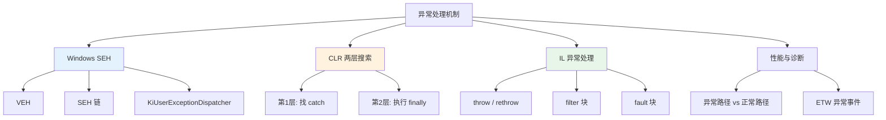
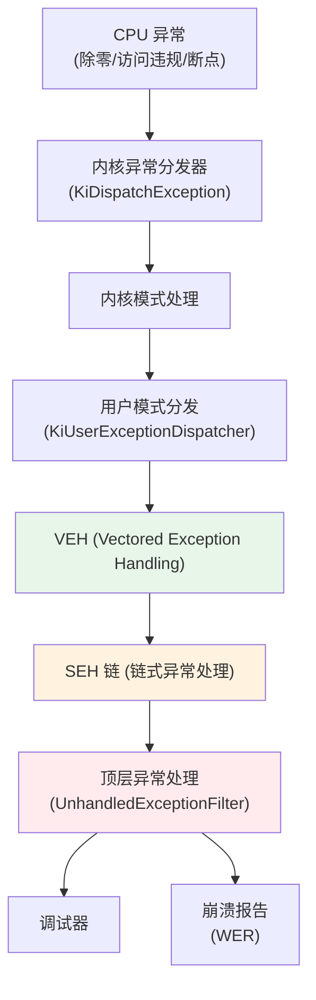
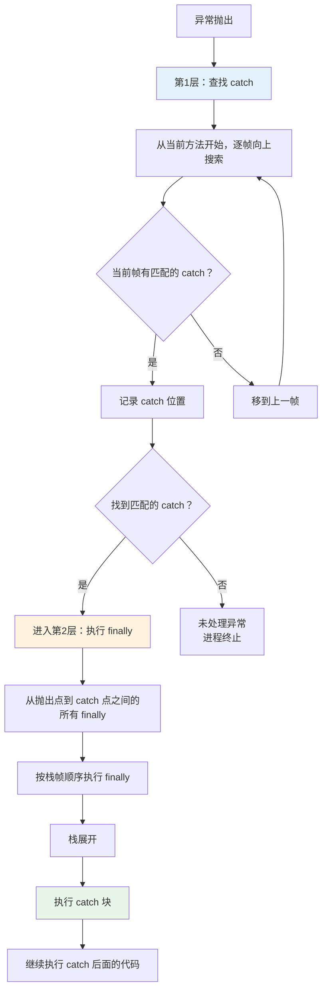
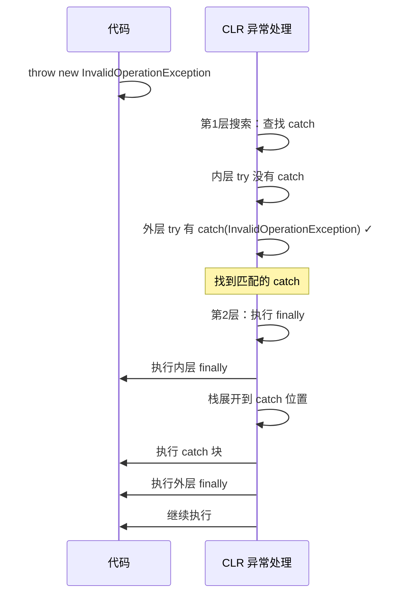
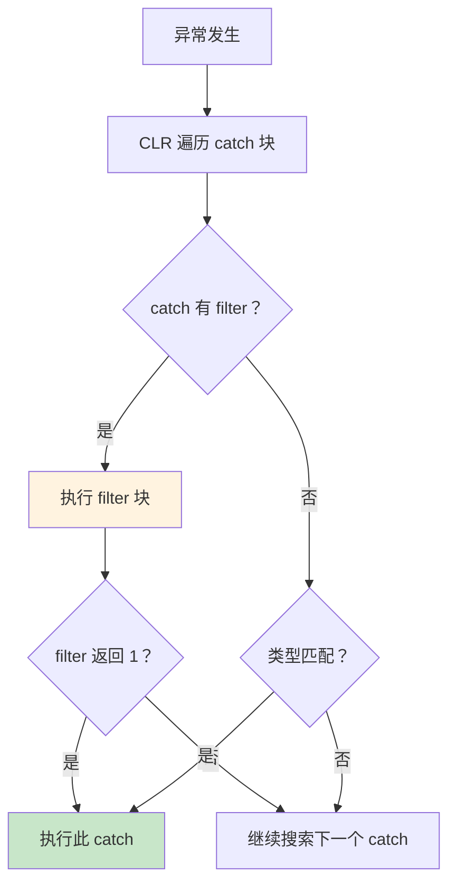
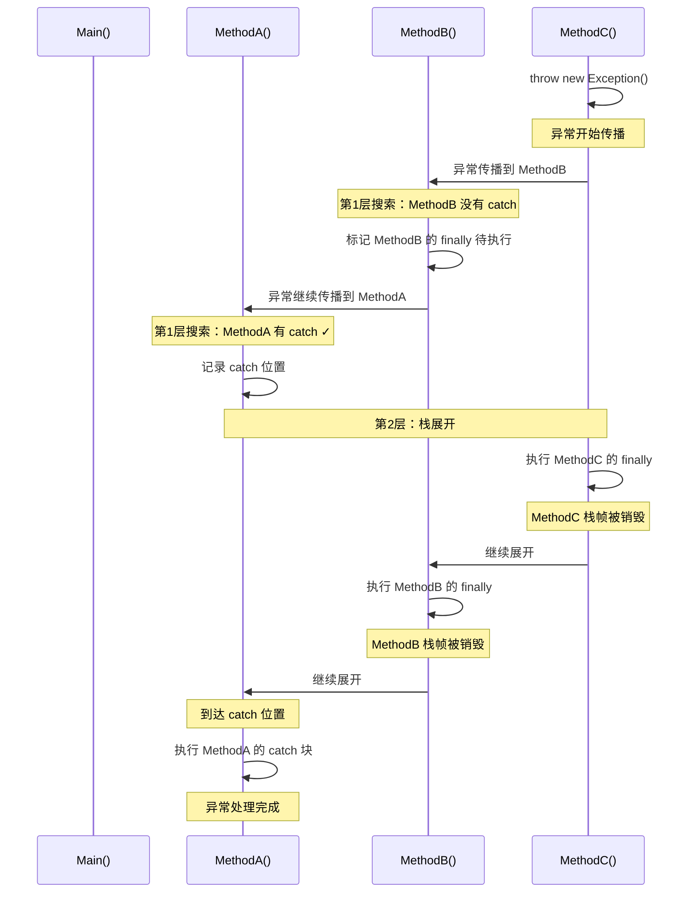
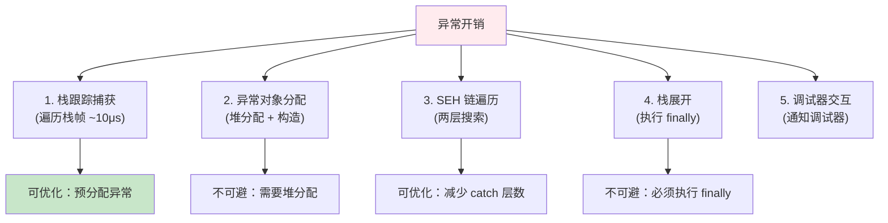
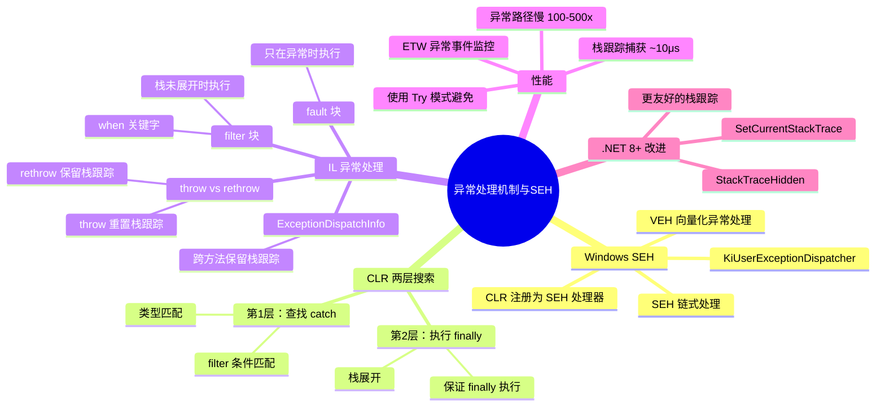

# 异常处理机制与SEH

> CLR 的异常处理建立在 Windows SEH（Structured Exception Handling）机制之上，但又扩展了语言级的异常过滤器、两层搜索模型和精确的栈展开。理解这些底层机制，才能写出正确且高效的异常处理代码。



## 一、Windows SEH 机制

### 1.1 SEH 的层次结构

Windows 异常处理从硬件异常到用户代码，经过多层处理：



### 1.2 SEH 链的工作方式

```
┌──────────────────────────────────────────────────────────────┐
│  线程的 SEH 链                                               │
├──────────────────────────────────────────────────────────────┤
│                                                              │
│  TEB (Thread Environment Block)                              │
│  ┌────────────────────────────────────┐                     │
│  │ ExceptionList → SEH Frame 3        │                     │
│  └────────────────────────────────────┘                     │
│                      ↓                                       │
│  SEH Frame 3: Method_C 的 try/except                         │
│  ┌────────────────────────────────────┐                     │
│  │ Handler: Method_C_Handler           │                     │
│  │ Next → SEH Frame 2                 │                     │
│  └────────────────────────────────────┘                     │
│                      ↓                                       │
│  SEH Frame 2: Method_B 的 try/finally                        │
│  ┌────────────────────────────────────┐                     │
│  │ Handler: Method_B_Finally           │                     │
│  │ Next → SEH Frame 1                 │                     │
│  └────────────────────────────────────┘                     │
│                      ↓                                       │
│  SEH Frame 1: Method_A 的 try/catch                          │
│  ┌────────────────────────────────────┐                     │
│  │ Handler: Method_A_Catch             │                     │
│  │ Next → SEH Frame 0 (默认)          │                     │
│  └────────────────────────────────────┘                     │
│                      ↓                                       │
│  SEH Frame 0: 默认处理器 (UnhandledExceptionFilter)          │
│  ┌────────────────────────────────────┐                     │
│  │ Handler: 终止进程                   │                     │
│  │ Next → NULL                         │                     │
│  └────────────────────────────────────┘                     │
│                                                              │
└──────────────────────────────────────────────────────────────┘
```

### 1.3 CLR 与 SEH 的集成

CLR 将自己的异常处理注册为 SEH 处理器。当异常发生时：

1. Windows 内核将异常传递到用户模式
2. VEH 处理器先执行
3. SEH 链遍历，到达 CLR 注册的处理器
4. CLR 执行自己的两层搜索

```csharp
// CLR 内部的异常处理入口（伪代码）
// coreclr/vm/excep.cpp: CLRVectoredExceptionHandler
LONG CLRVectoredExceptionHandler(EXCEPTION_POINTERS* pExceptionInfo)
{
    // 1. 检查是否是 CLR 异常
    if (IsCLRException(pExceptionInfo))
    {
        // 2. 执行 CLR 异常处理流程
        //    - 两层搜索
        //    - 栈展开
        return EXCEPTION_CONTINUE_EXECUTION;
    }
    return EXCEPTION_CONTINUE_SEARCH;
}
```

## 二、CLR 两层搜索模型

### 2.1 第一层：查找 catch

CLR 的异常处理分为两层搜索：



### 2.2 第二层：执行 finally

```csharp
public static void TwoPhaseDemo()
{
    try
    {
        try
        {
            Console.WriteLine("1. 抛出异常");
            throw new InvalidOperationException("测试异常");
        }
        finally
        {
            Console.WriteLine("2. 执行内层 finally");
        }
    }
    catch (InvalidOperationException ex)
    {
        Console.WriteLine($"3. 捕获异常: {ex.Message}");
    }
    finally
    {
        Console.WriteLine("4. 执行外层 finally");
    }

    Console.WriteLine("5. 继续执行");
}

// 输出：
// 1. 抛出异常
// 2. 执行内层 finally
// 3. 捕获异常: 测试异常
// 4. 执行外层 finally
// 5. 继续执行
```



## 三、异常对象的创建

### 3.1 newobj System.Exception

```csharp
throw new InvalidOperationException("消息");
```

```il
IL_0000: ldstr "消息"
IL_0005: newobj instance void [mscorlib]System.InvalidOperationException::.ctor(string)
IL_000a: throw
```

异常对象的创建和普通对象一样，使用 `newobj` 指令。在 `newobj` 执行时，CLR 在托管堆上分配 `InvalidOperationException` 对象，然后调用构造函数。

### 3.2 异常对象的内部结构

```
┌──────────────────────────────────────────────────────┐
│  Exception 对象内部字段                               │
├──────────────────────────────────────────────────────┤
│  _message: string          // 异常消息               │
│  _stackTrace: object       // 栈跟踪（字节数组）     │
│  _innerException: Exception // 内部异常              │
│  _helpURL: string          // 帮助链接               │
│  _source: string           // 来源                   │
│  _HResult: int             // HRESULT 错误码         │
│  _remoteStackTraceString: string  // 远程栈跟踪      │
│  _exceptionMethod: IntPtr  // 抛出异常的方法         │
│                                                      │
│  关键方法：                                          │
│  - ToString(): 格式化异常信息 + 栈跟踪               │
│  - GetStackTrace(): 获取原生栈跟踪                   │
│  - InternalPreserveStackTrace(): 保留栈跟踪          │
└──────────────────────────────────────────────────────┘
```

### 3.3 栈跟踪的捕获

```csharp
// 栈跟踪在 throw 时捕获，不是在 new 时
var ex = new InvalidOperationException("消息");  // 此时没有栈跟踪
// ex.StackTrace == null

throw ex;  // 此时捕获栈跟踪
// ex.StackTrace 有值

// 如果重新抛出，栈跟踪保持不变
catch (InvalidOperationException e)
{
    throw;  // 保留原始栈跟踪
    // throw e;  // 重置栈跟踪！
}
```

## 四、throw IL 与 re-throw 差异

### 4.1 throw vs rethrow

```csharp
public static void RethrowDemo()
{
    try
    {
        ThrowException();
    }
    catch (InvalidOperationException ex)
    {
        // re-throw：保留原始栈跟踪
        throw;

        // throw ex：重置栈跟踪（从当前位置开始）
        // throw ex;
    }
}
```

```il
.method public hidebysig static void RethrowDemo() cil managed
{
    .try
    {
        IL_0000: call void ThrowException()
        IL_0005: leave.s IL_0014
    }
    catch [mscorlib]System.InvalidOperationException
    {
        IL_0007: stloc.0

        // throw; → 使用 rethrow 指令
        IL_0008: rethrow          // 保留原始栈跟踪！

        // throw ex; → 使用 throw 指令
        // IL_0008: ldloc.0
        // IL_0009: throw          // 重置栈跟踪
    }

    IL_0014: ret
}
```

::: important rethrow vs throw 的关键差异
- `rethrow`：IL 指令，重新抛出当前捕获的异常，**保留原始抛出点的栈跟踪**
- `throw`：IL 指令，抛出栈顶的异常对象，**从当前位置重新捕获栈跟踪**

在生产代码中，**几乎总是应该使用 `throw;`（rethrow）而非 `throw ex;`**，以保留完整的诊断信息。
:::

### 4.2 ExceptionDispatchInfo 重新抛出

```csharp
// ExceptionDispatchInfo 可以跨方法边界保留栈跟踪
public static void CaptureAndRethrow()
{
    ExceptionDispatchInfo? captured = null;

    try
    {
        DangerousOperation();
    }
    catch (Exception ex)
    {
        captured = ExceptionDispatchInfo.Capture(ex);
    }

    // 在其他地方重新抛出，保留原始栈跟踪
    if (captured != null)
    {
        captured.Throw();  // 保留原始栈跟踪 + 添加新位置信息
    }
}
```

```il
// ExceptionDispatchInfo.Throw 的内部实现
.method public hidebysig instance void Throw() cil managed
{
    IL_0000: ldarg.0
    IL_0001: ldfld class [mscorlib]System.Exception ExceptionDispatchInfo::_exception
    IL_0006: call void ExceptionDispatchInfo::RestoreExceptionDispatch(class [mscorlib]System.Exception)
    // 恢复原始栈跟踪信息

    IL_000b: ldarg.0
    IL_000c: ldfld class [mscorlib]System.Exception ExceptionDispatchInfo::_exception
    IL_0011: throw    // 使用 throw，但栈跟踪已被 RestoreExceptionDispatch 保留
}
```

## 五、异常过滤器（when）与 IL filter 块

### 5.1 C# 6+ 异常过滤器

```csharp
public static void FilterDemo()
{
    try
    {
        DangerousOperation();
    }
    catch (HttpRequestException ex) when (ex.StatusCode == System.Net.HttpStatusCode.NotFound)
    {
        Console.WriteLine("404 未找到");
    }
    catch (HttpRequestException ex) when (ex.StatusCode == System.Net.HttpStatusCode.InternalServerError)
    {
        Console.WriteLine("500 服务器错误");
    }
    catch (HttpRequestException ex)
    {
        Console.WriteLine($"其他 HTTP 错误: {ex.StatusCode}");
    }
}
```

### 5.2 IL filter 块

```il
.method public hidebysig static void FilterDemo() cil managed
{
    .try
    {
        IL_0000: call void DangerousOperation()
        IL_0005: leave.s IL_0040
    }
    filter
    {
        // 第一个 when 条件
        IL_0007: isinst [System.Net.Http]System.Net.Http.HttpRequestException
        IL_000c: dup
        IL_000d: brtrue.s IL_0013
        IL_000f: pop
        IL_0010: ldc.i4.0          // 不匹配 → 继续搜索
        IL_0011: br.s IL_0025

        IL_0013: castclass [System.Net.Http]System.Net.Http.HttpRequestException
        IL_0018: callvirt instance valuetype System.Net.HttpStatusCode get_StatusCode()
        IL_001d: ldc.i4.7          // HttpStatusCode.NotFound = 7
        IL_001e: ceq
        IL_0020: ldc.i4.0
        IL_0021: cgt.un            // != 0 → 匹配
        IL_0023: br.s IL_0025

        IL_0025: endfilter         // 返回 1(匹配) 或 0(不匹配)
    }
    catch [System.Net.Http]System.Net.Http.HttpRequestException
    {
        IL_0027: stloc.0
        IL_0028: ldstr "404 未找到"
        IL_002d: call void [mscorlib]System.Console::WriteLine(string)
        IL_0032: leave.s IL_0040
    }
    // ... 其他 catch 块

    IL_0040: ret
}
```



::: important filter 块的执行时机
filter 块在**第一层搜索**时执行（找到 catch 之前），此时**栈尚未展开**。这意味着：
1. filter 块中可以访问当前栈帧的局部变量
2. filter 块中的异常仍然是"飞行中"状态
3. filter 块不应执行耗时操作

这也是为什么 filter 捕获的异常栈跟踪比 catch-then-rethrow 更完整。
:::

### 5.3 filter vs catch-then-rethrow

```csharp
// 方式 1：catch + 条件 + rethrow（不推荐）
try
{
    DangerousOperation();
}
catch (HttpRequestException ex)
{
    if (ex.StatusCode == HttpStatusCode.NotFound)
    {
        // 处理 404
    }
    else
    {
        throw;  // re-throw，但栈已经展开了
    }
}

// 方式 2：异常过滤器（推荐）
try
{
    DangerousOperation();
}
catch (HttpRequestException ex) when (ex.StatusCode == HttpStatusCode.NotFound)
{
    // 处理 404
    // 如果 when 条件不满足，catch 不会执行
    // 栈不会展开，调试器能看到原始异常上下文
}
```

## 六、Stack Unwind 过程

### 6.1 栈展开的步骤



### 6.2 栈展开与 finally 的保证

```csharp
// finally 在栈展开时一定会执行
public static string UnwindDemo()
{
    string result = "";
    try
    {
        try
        {
            result += "A";
            throw new Exception();
        }
        finally
        {
            result += "B";  // 一定执行
        }
    }
    catch
    {
        result += "C";
    }
    finally
    {
        result += "D";  // 一定执行
    }

    return result;  // "ABCD"
}
```

::: warning 栈展开中的异常
如果在 finally 块中抛出新异常，原来的异常会丢失：

```csharp
try
{
    throw new Exception("原始异常");
}
finally
{
    throw new Exception("finally 中的异常");  // 原始异常被替换！
}
```
:::

## 七、异常与性能

### 7.1 异常路径 vs 正常路径

```csharp
[MemoryDiagnoser]
public class ExceptionPerformance
{
    private readonly Dictionary<string, int> _dict = new()
    {
        ["existing"] = 42
    };

    // 正常路径：使用 TryGetValue
    [Benchmark(Baseline = true)]
    public int NormalPath()
    {
        if (_dict.TryGetValue("existing", out int value))
            return value;
        return -1;
    }

    // 异常路径：依赖异常处理
    [Benchmark]
    public int ExceptionPath()
    {
        try
        {
            return _dict["existing"];
        }
        catch (KeyNotFoundException)
        {
            return -1;
        }
    }

    // 异常路径：键不存在
    [Benchmark]
    public int ExceptionPathMiss()
    {
        try
        {
            return _dict["missing"];
        }
        catch (KeyNotFoundException)
        {
            return -1;
        }
    }
}

// 结果示例（.NET 8）：
// | Method           | Mean       | Ratio |
// |----------------- |-----------:|------:|
// | NormalPath       |   5.2 ns   |  1.00 |
// | ExceptionPath    |   5.8 ns   |  1.12 |  ← 键存在时差别不大
// | ExceptionPathMiss| 2,500 ns   | 481   |  ← 键不存在时慢 480 倍！
```

### 7.2 异常的性能开销来源



### 7.3 减少异常开销的策略

```csharp
// 策略 1：使用 Try 模式
int.TryParse(input, out int result);  // 而非 int.Parse + catch

// 策略 2：预检查
if (dict.ContainsKey(key))            // 而非 dict[key] + catch
    return dict[key];

// 策略 3：使用内联缓存（避免重复异常）
private int? _cachedResult;
public int GetValue(string key)
{
    if (_cachedResult.HasValue)
        return _cachedResult.Value;

    // 只抛一次异常
    if (!dict.TryGetValue(key, out int value))
        throw new KeyNotFoundException(key);

    _cachedResult = value;
    return value;
}

// 策略 4：Exceptions 库 (.NET 8+)
// 使用 ExceptionDispatchInfo.SetCurrentStackTrace
// 在创建异常时就设置栈跟踪，而非等到 throw
```

## 八、ETW 异常事件

### 8.1 CLR 异常的 ETW 事件

```csharp
// .NET 运行时会发出 ETW 异常事件
// 可以通过 PerfView / dotnet-trace 捕获

// 事件类型：
// - ExceptionThrown_V1: 异常被抛出
// - ExceptionCatchStart: catch 块开始执行
// - ExceptionFinallyStart: finally 块开始执行
// - ExceptionUnwind: 栈展开

// 使用 dotnet-trace 捕获异常事件
// dotnet-trace collect --process-id <pid> --providers Microsoft-DotNETCore-SampleProfiler
```

### 8.2 监控异常频率

```csharp
// 使用 AppDomain 监控异常
AppDomain.CurrentDomain.UnhandledException += (s, e) =>
{
    Console.WriteLine($"未处理异常: {e.ExceptionObject}");
};

// 使用 EventSource 自定义监控
[EventSource(Name = "MyApp-ExceptionMonitor")]
public class ExceptionMonitor : EventSource
{
    public static ExceptionMonitor Log = new();

    [Event(1, Level = EventLevel.Warning)]
    public void ExceptionThrown(string type, string message, string stackTrace)
    {
        WriteEvent(1, type, message, stackTrace);
    }
}
```

## 九、.NET 8+ 异常相关改进

### 9.1 ExceptionDispatchInfo.SetCurrentStackTrace

```csharp
// .NET 8+ 可以在创建异常时就设置栈跟踪
// 不再需要 throw 才能获取栈跟踪
var exception = new InvalidOperationException("错误");
ExceptionDispatchInfo.SetCurrentStackTrace(exception);

// 此时 exception.StackTrace 已经有值
Console.WriteLine(exception.StackTrace);
```

### 9.2 StackTrace 隐藏

```csharp
// .NET 6+ 可以从栈跟踪中隐藏方法
[StackTraceHidden]
public static void Guard(bool condition)
{
    if (!condition)
        throw new InvalidOperationException("条件不满足");
    // Guard 方法不会出现在栈跟踪中
}

public static void Process()
{
    Guard(false);  // 栈跟踪从 Process 开始，不显示 Guard
}
```

### 9.3 CompilerGenerated 属性与栈跟踪

```csharp
// .NET 8+ 编译器生成的方法（如 async 状态机、lambda）
// 在栈跟踪中显示更友好的名称
async Task DemoAsync()
{
    await Task.Delay(100);
    throw new Exception("测试");
    // 栈跟踪显示：DemoAsync() 而非 <DemoAsync>d__0.MoveNext()
}
```

## 十、fault 块

### 10.1 IL fault 块

IL 支持 `fault` 块，类似于 `finally`，但只在异常发生时执行。C# 不直接支持 fault 块，但 VB.NET 和 IL 可以使用。

```il
.try
{
    // 正常代码
    IL_0000: call void DoWork()
    IL_0005: leave.s IL_0010
}
fault
{
    // 只在异常发生时执行
    // 类似 finally，但不会在正常退出时执行
    IL_0007: ldstr "异常发生了"
    IL_000c: call void [mscorlib]System.Console::WriteLine(string)
    IL_0011: endfault
}

IL_0010: ret
```

::: info fault 块的使用场景
- VB.NET 的 `On Error` 语句使用 fault 块
- 某些 AOP 框架使用 fault 块实现异常拦截
- C# 编译器在某些场景下生成 fault 块（如 async 状态机中的异常处理）
:::

## 十一、实战：健壮的异常处理策略

```csharp
// 完整的异常处理最佳实践
public class RobustService
{
    private readonly ILogger _logger;

    public async Task<Result> ProcessAsync(Request request)
    {
        // 1. 参数验证（不使用异常）
        if (request is null)
            return Result.Failure("请求不能为空");
        if (string.IsNullOrEmpty(request.Id))
            return Result.Failure("ID 不能为空");

        // 2. 业务逻辑（使用异常处理不可预见错误）
        try
        {
            var data = await FetchDataAsync(request.Id);
            var result = Transform(data);
            return Result.Success(result);
        }
        catch (HttpRequestException ex) when (ex.StatusCode == HttpStatusCode.NotFound)
        {
            // 特定异常：使用过滤器精确捕获
            _logger.LogWarning("资源未找到: {Id}", request.Id);
            return Result.Failure("资源未找到");
        }
        catch (HttpRequestException ex) when (IsTransient(ex))
        {
            // 可重试的异常
            _logger.LogWarning(ex, "暂时性错误，将重试");
            return await RetryAsync(() => ProcessAsync(request));
        }
        catch (OperationCanceledException ex) when (ex.CancellationToken == request.CancellationToken)
        {
            // 取消：不是错误，直接返回
            return Result.Cancelled();
        }
        catch (Exception ex)
        {
            // 未预见的异常：记录完整信息
            _logger.LogError(ex, "处理请求时发生未预见错误: {Id}", request.Id);
            return Result.Failure("内部错误");
        }
    }

    private static bool IsTransient(HttpRequestException ex)
    {
        return ex.StatusCode is HttpStatusCode.ServiceUnavailable
            or HttpStatusCode.TooManyRequests
            or HttpStatusCode.GatewayTimeout;
    }
}

// Result 模式：避免用异常控制流程
public readonly record struct Result
{
    public bool IsSuccess { get; init; }
    public string? Error { get; init; }

    public static Result Success() => new() { IsSuccess = true };
    public static Result Failure(string error) => new() { Error = error };
    public static Result Cancelled() => new() { Error = "操作已取消" };
}
```

## 十二、总结



::: tip 核心要点回顾
1. **CLR 异常建立在 Windows SEH 之上** — 通过 VEH 和 SEH 链与操作系统集成
2. **两层搜索模型** — 先找 catch（第一层），再执行 finally（第二层）
3. **rethrow 保留栈跟踪** — `throw;` vs `throw ex;` 有关键差异
4. **filter 块在栈展开前执行** — 可以访问原始上下文，调试更友好
5. **异常路径比正常路径慢 100-500 倍** — 用 Try 模式避免用异常控制流程
6. **ExceptionDispatchInfo 跨方法传播** — 保留完整栈跟踪
7. **.NET 8+ 持续改进异常体验** — SetCurrentStackTrace、StackTraceHidden 等
:::
