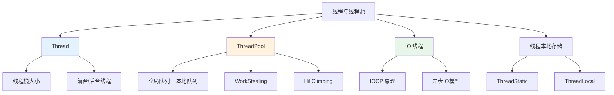
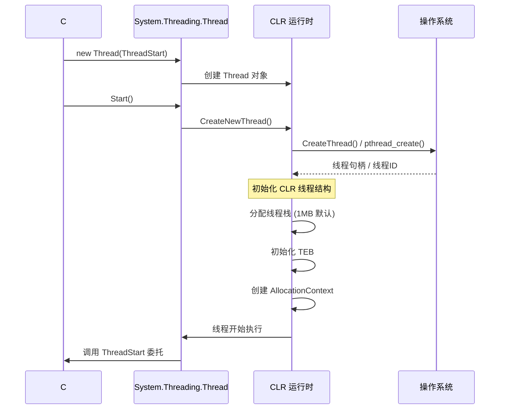
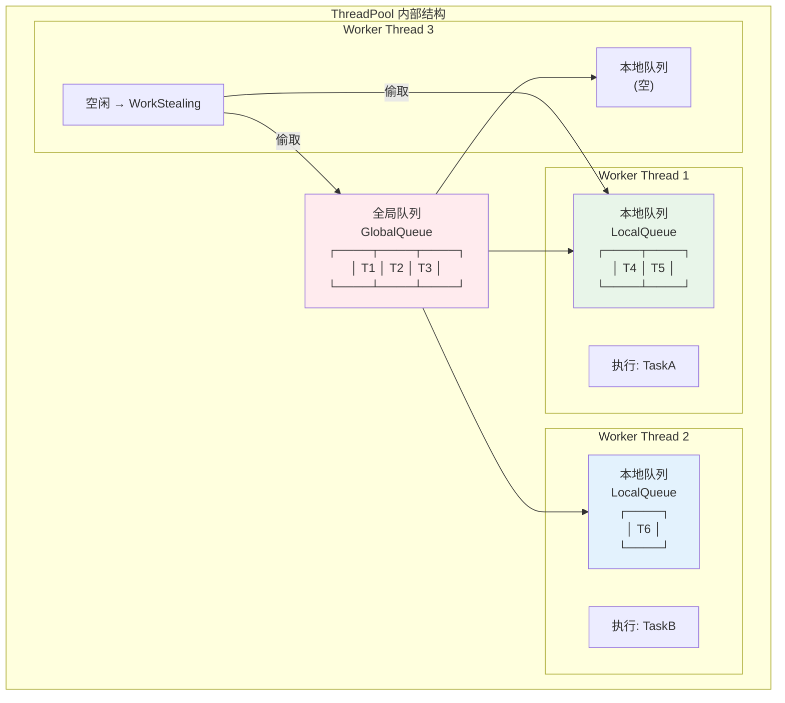
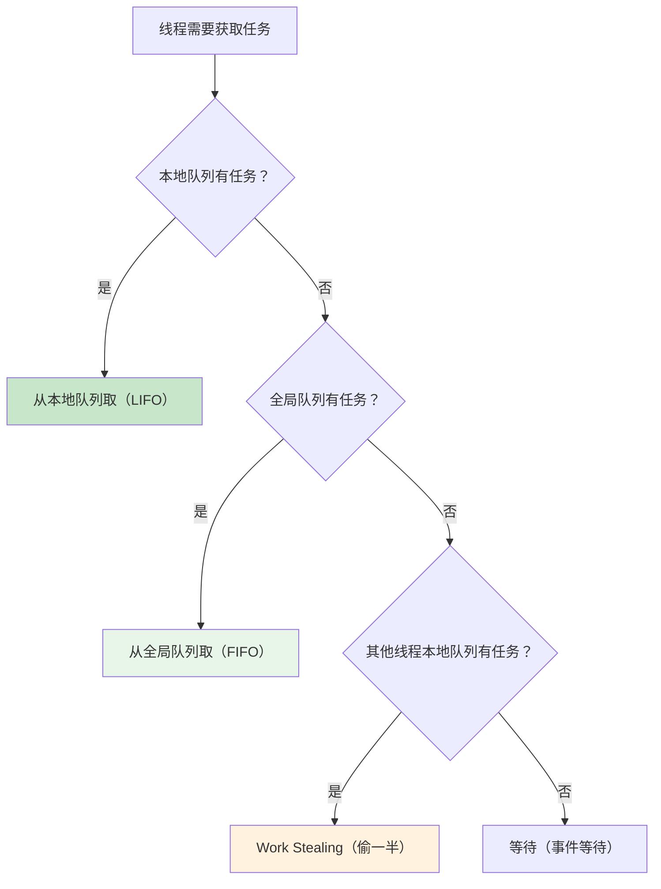
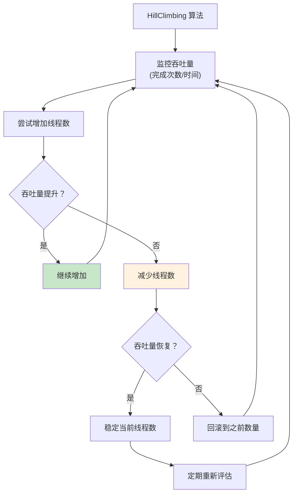
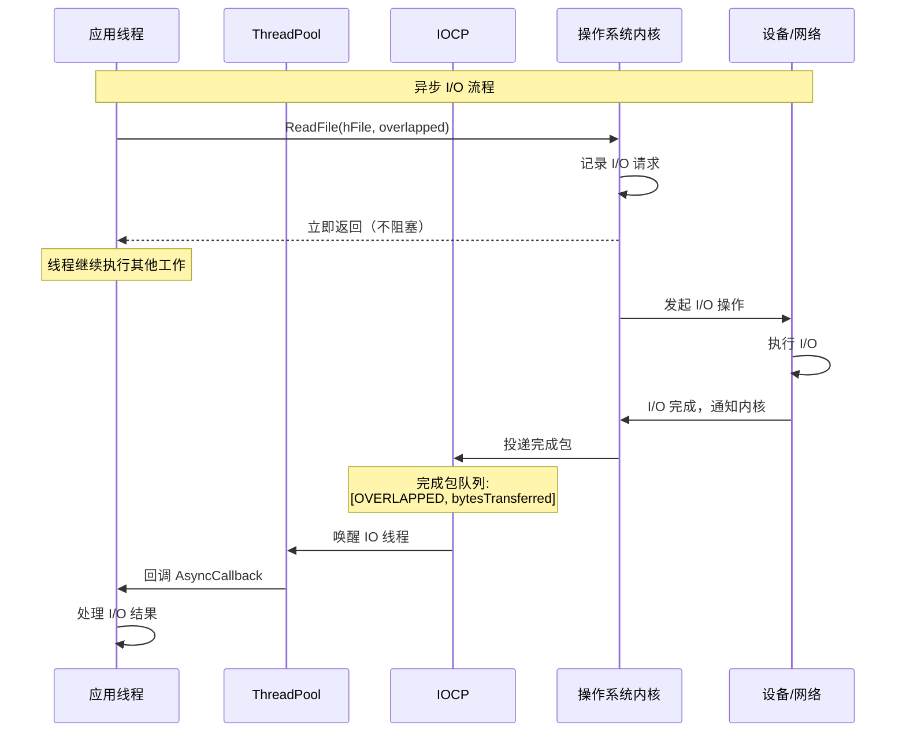
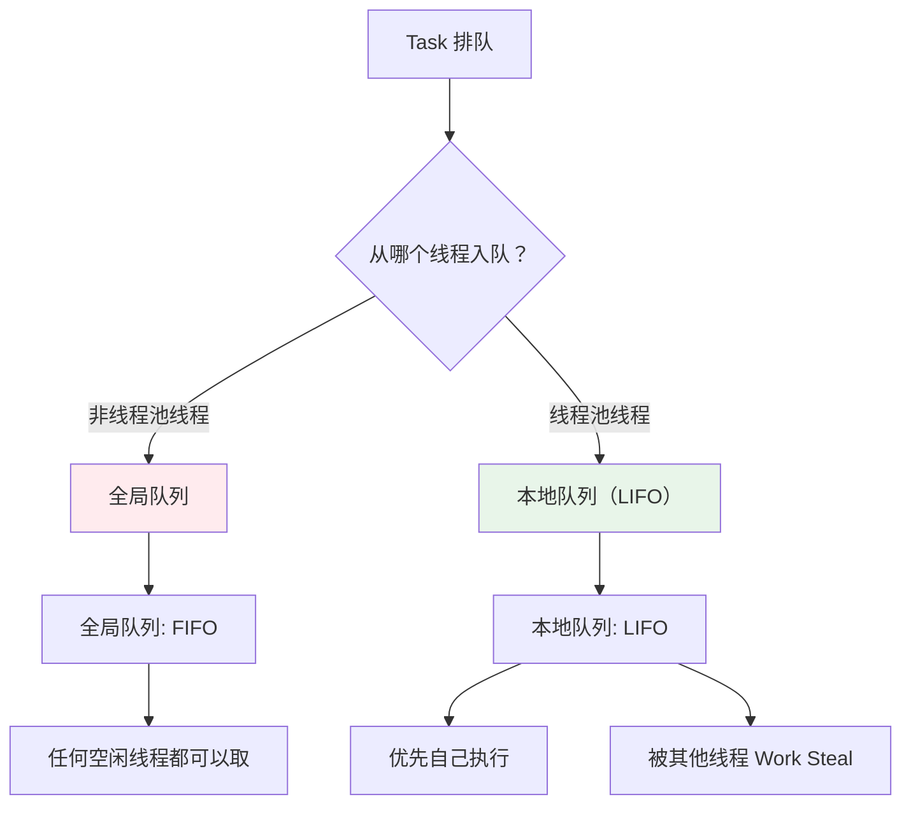
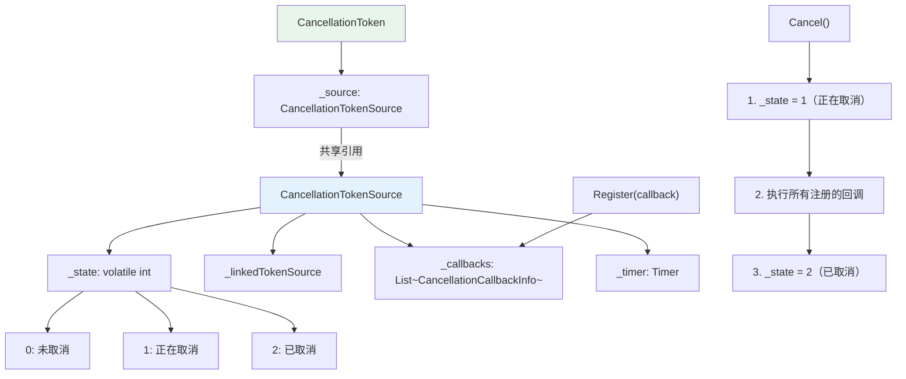
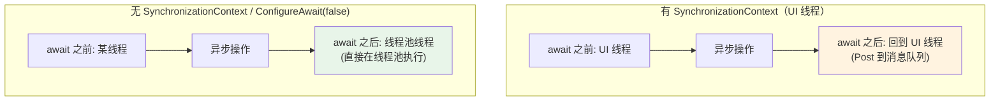
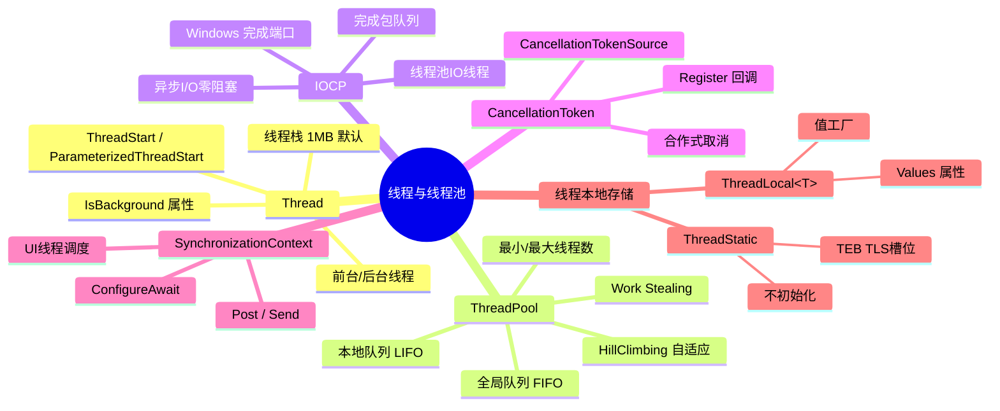

# 线程与线程池

> CLR 的线程模型是 .NET 并发编程的基石。理解线程的底层结构、线程池的自适应算法和 IOCP 的工作原理，才能写出高效且安全的并发代码。



## 一、Thread IL

### 1.1 Thread 对象的创建

```csharp
public static void ThreadCreation()
{
    var thread = new Thread(DoWork);
    thread.Start();

    static void DoWork()
    {
        Console.WriteLine($"工作线程: {Thread.CurrentThread.ManagedThreadId}");
    }
}
```

```il
.method public hidebysig static void ThreadCreation() cil managed
{
    IL_0000: ldnull
    IL_0001: ldftn void ThreadCreation::<DoWork>g__DoWork|0_0()
    IL_0007: newobj instance void [System.Runtime]System.Threading.ThreadStart::.ctor(object, native int)
    IL_000c: newobj instance void [System.Runtime]System.Threading.Thread::.ctor(class [System.Runtime]System.Threading.ThreadStart)
    IL_0011: stloc.0

    IL_0012: ldloc.0
    IL_0013: callvirt instance void [System.Runtime]System.Threading.Thread::Start()

    IL_0018: ret
}
```

### 1.2 Thread 的底层创建过程



## 二、线程栈大小

### 2.1 默认栈大小

```csharp
// Windows 默认栈大小
// 32位进程: 1 MB
// 64位进程: 1 MB

// 自定义栈大小
var thread = new Thread(DoWork, maxStackSize: 2 * 1024 * 1024);  // 2 MB

// 注意：maxStackSize 会向上取整到页面大小的倍数
// Windows 页面大小: 4 KB
// 所以 2 MB 是合法的

static void DoWork()
{
    Console.WriteLine($"栈大小: ??? (没有直接 API 查询)");
}
```

### 2.2 栈空间的使用

```
┌──────────────────────────────────────────────────┐
│  线程栈布局 (1 MB 默认)                          │
├──────────────────────────────────────────────────┤
│                                                  │
│  高地址 ┌──────────────────────────────────────┐ │
│         │  栈顶（空闲区域）                      │ │
│         │  ← 分配方向                           │ │
│         ├──────────────────────────────────────┤ │
│         │  Main() 栈帧                          │ │
│         │  参数 / 局部变量 / 返回地址            │ │
│         ├──────────────────────────────────────┤ │
│         │  MethodA() 栈帧                       │ │
│         ├──────────────────────────────────────┤ │
│         │  MethodB() 栈帧                       │ │
│         ├──────────────────────────────────────┤ │
│         │  ... (当前活动栈帧)                    │ │
│         ├──────────────────────────────────────┤ │
│         │  RSP / ESP 指向的位置                  │ │
│  低地址 └──────────────────────────────────────┘ │
│                                                  │
│  注意：栈溢出发生在低地址方向                     │
│  Windows 的栈保护页在栈底                        │
│  访问保护页触发 StackOverflowException           │
│                                                  │
└──────────────────────────────────────────────────┘
```

## 三、前台线程 vs 后台线程

### 3.1 区别

```csharp
// 前台线程：进程在前台线程全部结束后才退出
// 后台线程：进程不等待后台线程，直接退出

var foreground = new Thread(() =>
{
    Thread.Sleep(3000);
    Console.WriteLine("前台线程完成");  // 一定会打印
});
foreground.IsBackground = false;  // 默认值

var background = new Thread(() =>
{
    Thread.Sleep(3000);
    Console.WriteLine("后台线程完成");  // 可能不会打印（如果前台线程先结束）
});
background.IsBackground = true;

foreground.Start();
background.Start();
```

::: important 前台线程决定进程生命周期
1. 所有前台线程结束后，CLR 强制终止所有后台线程并退出进程
2. 后台线程被终止时不会执行 finally 块
3. 线程池线程默认是后台线程
4. 主线程（Main 方法所在的线程）是前台线程
:::

## 四、ThreadPool 结构

### 4.1 线程池的内部结构



### 4.2 全局队列与本地队列

```csharp
// 非线程池线程入队 → 全局队列
// Task.Run(() => { });  // 从主线程调用 → 全局队列

// 线程池线程入队 → 本地队列
// Task.Run 内部再 Task.Run → 本地队列（LIFO）

// 线程池调度策略：
// 1. 优先从本地队列取（LIFO，缓存友好）
// 2. 本地队列为空 → 从全局队列取（FIFO，公平性）
// 3. 全局队列也为空 → Work Stealing（从其他线程的本地队列偷）
```



### 4.3 Work Stealing 的原理

```
┌──────────────────────────────────────────────────────────────┐
│  Work Stealing 过程                                           │
├──────────────────────────────────────────────────────────────┤
│                                                              │
│  线程 3 空闲，需要任务：                                     │
│                                                              │
│  线程 1 本地队列: [T4, T5, T6, T7]                          │
│                         ↑ 队列底部                           │
│                                                              │
│  线程 3 偷取: [T6, T7]  ← 偷取队列底部的一半               │
│                                                              │
│  线程 1 本地队列: [T4, T5]  ← 剩余顶部                      │
│  线程 3 本地队列: [T6, T7]  ← 偷到的任务                    │
│                                                              │
│  为什么偷底部？                                              │
│  - 顶部是最近入队的（可能有数据局部性）                      │
│  - 底部是较早入队的（可能与其他线程的数据关联较少）           │
│  - 偷底部减少缓存失效                                       │
│                                                              │
└──────────────────────────────────────────────────────────────┘
```

## 五、HillClimbing 算法

### 5.1 线程数自适应

CLR 使用 HillClimbing 算法动态调整线程池中的线程数量，目标是最大化吞吐量。



### 5.2 HillClimbing 的参数

```csharp
// 线程池的配置参数
// 查看当前设置
ThreadPool.GetMinThreads(out int minWorkerThreads, out int minIoThreads);
ThreadPool.GetMaxThreads(out int maxWorkerThreads, out int maxIoThreads);

Console.WriteLine($"最小工作线程: {minWorkerThreads}");
Console.WriteLine($"最大工作线程: {maxWorkerThreads}");
Console.WriteLine($"最小 IO 线程: {minIoThreads}");
Console.WriteLine($"最大 IO 线程: {maxIoThreads}");

// 设置（通常不建议修改）
// ThreadPool.SetMinThreads(100, 100);
// ThreadPool.SetMaxThreads(32767, 1000);
```

### 5.3 线程注入时机

```csharp
// CLR 在以下情况下注入新线程：
// 1. 所有工作线程都在忙
// 2. 全局队列中有待执行的任务
// 3. 距离上次线程注入超过 500ms（避免频繁创建）
// 4. 当前线程数未达到最大值

// 模拟线程注入
public static void SimulateThreadInjection()
{
    int prevThreadCount = ThreadPool.ThreadCount;

    // 一次性排队大量任务
    for (int i = 0; i < 1000; i++)
    {
        ThreadPool.QueueUserWorkItem(_ =>
        {
            Thread.Sleep(100);
        });
    }

    // 观察线程数变化
    for (int i = 0; i < 20; i++)
    {
        Console.WriteLine($"时间 {i * 500}ms: 线程数 = {ThreadPool.ThreadCount}");
        Thread.Sleep(500);
    }
}
```

## 六、IO 线程与 IOCP

### 6.1 IOCP 原理

IOCP（I/O Completion Port）是 Windows 提供的高性能异步 I/O 机制。



### 6.2 IOCP 的内部结构

```
┌──────────────────────────────────────────────────────────────┐
│  IOCP 结构                                                    │
├──────────────────────────────────────────────────────────────┤
│                                                              │
│  完成端口 (Completion Port)                                  │
│  ┌──────────────────────────────────────────────┐           │
│  │  完成包队列 (FIFO)                            │           │
│  │  ┌───────────┬───────────┬───────────┐      │           │
│  │  │ Package1  │ Package2  │ Package3  │      │           │
│  │  │ OVERLAPPED│ OVERLAPPED│ OVERLAPPED│      │           │
│  │  │ bytes=1024│ bytes=512 │ bytes=2048│      │           │
│  │  └───────────┴───────────┴───────────┘      │           │
│  └──────────────────────────────────────────────┘           │
│       ↓ 线程获取完成包                                       │
│                                                              │
│  线程池 (Concurrent Threads ≤ NumberOfConcurrentThreads)     │
│  ┌──────────┬──────────┬──────────┐                        │
│  │ Thread 1 │ Thread 2 │ Thread 3 │                        │
│  │ 处理 P1  │ 处理 P2  │ 等待     │                        │
│  └──────────┴──────────┴──────────┘                        │
│                                                              │
│  关联的文件句柄:                                             │
│  ┌──────────┬──────────┬──────────┐                        │
│  │ hFile1   │ hSocket2 │ hPipe3   │                        │
│  └──────────┴──────────┴──────────┘                        │
│                                                              │
│  NumberOfConcurrentThreads = CPU核心数                       │
│  ← 同时运行的IO线程数不超过CPU核心数                         │
│  ← 避免线程上下文切换开销                                   │
│                                                              │
└──────────────────────────────────────────────────────────────┘
```

### 6.3 .NET 中的 IOCP 使用

```csharp
// FileStream 的异步 I/O 使用 IOCP
public static async Task FileIOCPDemo()
{
    // 必须指定 useAsync: true 才使用 IOCP
    using var fs = new FileStream("test.txt", FileMode.Open,
        FileAccess.Read, FileShare.Read, bufferSize: 4096,
        useAsync: true);  // 关键！否则使用同步 I/O

    byte[] buffer = new byte[1024];
    int bytesRead = await fs.ReadAsync(buffer, 0, buffer.Length);
    // ReadAsync 内部：
    // 1. 调用 ReadFile(hFile, overlapped)
    // 2. 立即返回
    // 3. I/O 完成后，IOCP 通知线程池
    // 4. IO 线程执行回调
}

// Socket 的异步 I/O
public static async Task SocketIOCPDemo()
{
    using var socket = new Socket(AddressFamily.InterNetwork,
        SocketType.Stream, ProtocolType.Tcp);

    await socket.ConnectAsync(new IPEndPoint(IPAddress.Loopback, 8080));

    byte[] buffer = new byte[1024];
    int bytesRead = await socket.ReceiveAsync(buffer, SocketFlags.None);
    // SocketAsyncEventArgs 内部使用 IOCP
}
```

## 七、Task 与 ThreadPool 的关系

### 7.1 Task 默认使用 ThreadPool

```csharp
// Task.Run 将任务排队到 ThreadPool
Task.Run(() =>
{
    Console.WriteLine($"线程池线程: {Thread.CurrentThread.IsThreadPoolThread}");  // True
});

// Task.Factory.StartNew 也是
Task.Factory.StartNew(() =>
{
    Console.WriteLine("也是线程池线程");
});

// 长时间运行的任务使用独立线程
Task.Factory.StartNew(() =>
{
    Console.WriteLine($"线程池线程: {Thread.CurrentThread.IsThreadPoolThread}");  // False!
}, TaskCreationOptions.LongRunning);
// LongRunning → 创建新线程，不使用线程池
```

### 7.2 Task 的排队策略



## 八、CancellationToken

### 8.1 CancellationToken 的 IL

```csharp
public static async Task CancellationDemo()
{
    using var cts = new CancellationTokenSource(TimeSpan.FromSeconds(5));

    try
    {
        await Task.Delay(Timeout.Infinite, cts.Token);
    }
    catch (OperationCanceledException)
    {
        Console.WriteLine("任务被取消");
    }
}
```

```il
// CancellationTokenSource 的创建
IL_0000: ldc.r8 5.0                    // 5 秒
IL_0009: call valuetype [System.Runtime]System.TimeSpan [System.Runtime]System.TimeSpan::FromSeconds(float64)
IL_000e: newobj instance void [System.Runtime]System.Threading.CancellationTokenSource::.ctor(valuetype [System.Runtime]System.TimeSpan)
IL_0013: stloc.0

// 获取 Token
IL_000f: ldloca.s cts
IL_0011: call instance valuetype [System.Runtime]System.Threading.CancellationToken System.Threading.CancellationTokenSource::get_Token()
```

### 8.2 CancellationToken 的内部结构

```csharp
// CancellationToken 的核心是一个引用 CancellationTokenSource 的轻量结构
public readonly struct CancellationToken
{
    private readonly CancellationTokenSource? _source;

    public bool IsCancellationRequested =>
        _source != null && _source.IsCancellationRequested;

    public void ThrowIfCancellationRequested()
    {
        if (IsCancellationRequested)
            throw new OperationCanceledException(this);
    }

    public void Register(Action callback) =>
        _source?.Register(callback);
}
```



## 九、SynchronizationContext

### 9.1 SynchronizationContext 的作用

`SynchronizationContext` 提供了一个抽象的"调度器"，将工作项投递到特定的上下文（如 UI 线程）。

```csharp
// UI 应用中的 SynchronizationContext
public class DispatcherSynchronizationContext : SynchronizationContext
{
    public override void Post(SendOrPostCallback d, object? state)
    {
        // 将回调投递到 UI 线程的消息队列
        Dispatcher.CurrentDispatcher.BeginInvoke(
            new Action(() => d(state)));
    }

    public override void Send(SendOrPostCallback d, object? state)
    {
        // 同步发送到 UI 线程（阻塞等待）
        Dispatcher.CurrentDispatcher.Invoke(
            new Action(() => d(state)));
    }
}
```

### 9.2 async/await 与 SynchronizationContext

```csharp
// await 默认捕获当前 SynchronizationContext
// 在 UI 线程上 await 后，后续代码回到 UI 线程

// ConfigureAwait(false) 不捕获 SynchronizationContext
// 后续代码在线程池线程上继续执行

public async Task ProcessAsync()
{
    // 在 UI 线程上
    var data = await FetchDataAsync();
    // 自动回到 UI 线程（因为 SynchronizationContext）

    var data2 = await FetchDataAsync().ConfigureAwait(false);
    // 在线程池线程上继续（不回到 UI 线程）
}
```



## 十、线程本地存储

### 10.1 ThreadStatic

```csharp
public class ThreadLocalStorage
{
    // ThreadStatic: 每个线程有独立的副本
    [ThreadStatic]
    private static int _threadLocalValue;

    // 注意：ThreadStatic 不初始化！
    // 每个线程的初始值是 default(T)
    // 只有第一个访问的线程会看到静态初始化器的值

    public static void Demo()
    {
        _threadLocalValue = Thread.CurrentThread.ManagedThreadId;
        Console.WriteLine($"线程 {Thread.CurrentThread.ManagedThreadId}: {_threadLocalValue}");

        // 不同线程看到不同的值
        Parallel.For(0, 5, i =>
        {
            _threadLocalValue = Thread.CurrentThread.ManagedThreadId * 10 + i;
            Console.WriteLine($"线程 {Thread.CurrentThread.ManagedThreadId}: {_threadLocalValue}");
        });
    }
}
```

```il
// ThreadStatic 的 IL
.field private static int32 _threadLocalValue
.custom instance void [System.Runtime]System.ThreadStaticAttribute::.ctor() = (01 00 00 00)

// 访问 ThreadStatic 字段
IL_0000: ldsfld int32 ThreadLocalStorage::_threadLocalValue
// CLR 内部：通过 TEB 的 TLS 槽位访问
```

### 10.2 ThreadLocal&lt;T&gt;

```csharp
// ThreadLocal<T> 提供更灵活的线程本地存储
private static readonly ThreadLocal<int> _threadLocal =
    new ThreadLocal<int>(() => Thread.CurrentThread.ManagedThreadId * 100);

// 支持初始化
Console.WriteLine(_threadLocal.Value);  // 每个线程自动初始化

// 支持值工厂
var randomPerThread = new ThreadLocal<Random>(() => new Random(
    Environment.TickCount ^ Thread.CurrentThread.ManagedThreadId));

// 查看所有线程的值
foreach (int value in _threadLocal.Values)
{
    Console.WriteLine($"值: {value}");
}
```

### 10.3 TLS 的底层机制

```
┌──────────────────────────────────────────────────────────────┐
│  线程本地存储 (TLS) 机制                                     │
├──────────────────────────────────────────────────────────────┤
│                                                              │
│  Windows TLS:                                                │
│  ┌──────────────────────────────────────────────┐           │
│  │ TEB (Thread Environment Block)               │           │
│  │  ┌──────────────────────────────┐            │           │
│  │  │ TLS Slots[0..64]            │            │           │
│  │  │  Slot 0: ThreadStatic _a    │            │           │
│  │  │  Slot 1: ThreadStatic _b    │            │           │
│  │  │  Slot 2: ThreadLocal<T>     │            │           │
│  │  │  ...                        │            │           │
│  │  └──────────────────────────────┘            │           │
│  └──────────────────────────────────────────────┘           │
│                                                              │
│  CLR ThreadStatic:                                           │
│  1. 类型加载时分配 TLS 槽位 (TlsAlloc)                       │
│  2. 访问时通过槽位索引读取 TEB                               │
│  3. 每个线程有独立的槽位副本                                 │
│                                                              │
│  ThreadLocal<T>:                                             │
│  1. 内部使用 Dictionary<Thread, T>                           │
│  2. 或使用 TLS 槽位（性能优化）                              │
│  3. 支持值工厂（延迟初始化）                                 │
│                                                              │
└──────────────────────────────────────────────────────────────┘
```

## 十一、实战：高并发请求处理器

```csharp
public class HighConcurrencyProcessor
{
    private readonly SemaphoreSlim _concurrencyLimiter;
    private readonly CancellationTokenSource _cts;

    public HighConcurrencyProcessor(int maxConcurrency)
    {
        _concurrencyLimiter = new SemaphoreSlim(maxConcurrency);
        _cts = new CancellationTokenSource();
    }

    public async Task ProcessAsync(IEnumerable<Request> requests)
    {
        var tasks = requests.Select(async request =>
        {
            await _concurrencyLimiter.WaitAsync(_cts.Token);
            try
            {
                await ProcessSingleAsync(request);
            }
            finally
            {
                _concurrencyLimiter.Release();
            }
        });

        await Task.WhenAll(tasks);
    }

    private async Task ProcessSingleAsync(Request request)
    {
        // 使用线程池线程执行
        // 异步 I/O 使用 IOCP
        // ConfigureAwait(false) 避免不必要的上下文切换
        var data = await FetchDataAsync(request).ConfigureAwait(false);
        var result = ProcessData(data);
        await SaveResultAsync(result).ConfigureAwait(false);
    }

    public void Stop() => _cts.Cancel();
}

public record Request(string Id);
```

## 十二、总结



::: tip 核心要点回顾
1. **Thread 是操作系统线程的封装** — 1MB 默认栈，前台/后台决定进程生命周期
2. **ThreadPool 双层队列** — 全局队列 + 本地队列，LIFO 本地 + FIFO 全局
3. **Work Stealing 减少竞争** — 空闲线程从其他线程的本地队列偷任务
4. **HillClimbing 自适应线程数** — 动态调整以最大化吞吐量
5. **IOCP 实现高性能异步 I/O** — 内核完成通知，线程池回调
6. **CancellationToken 合作式取消** — 注册回调，轮询检查
7. **SynchronizationContext 控制调度** — UI 线程、ConfigureAwait
8. **ThreadStatic/ThreadLocal 线程本地** — 每线程独立副本
:::
