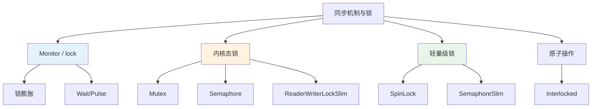
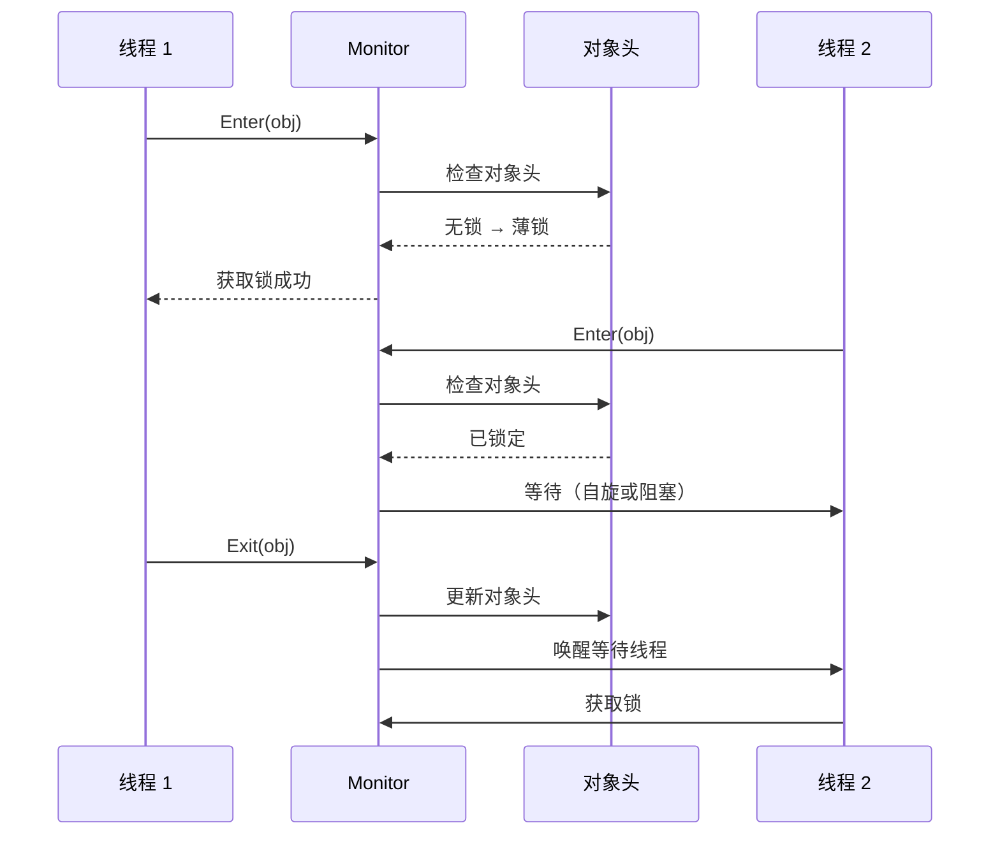
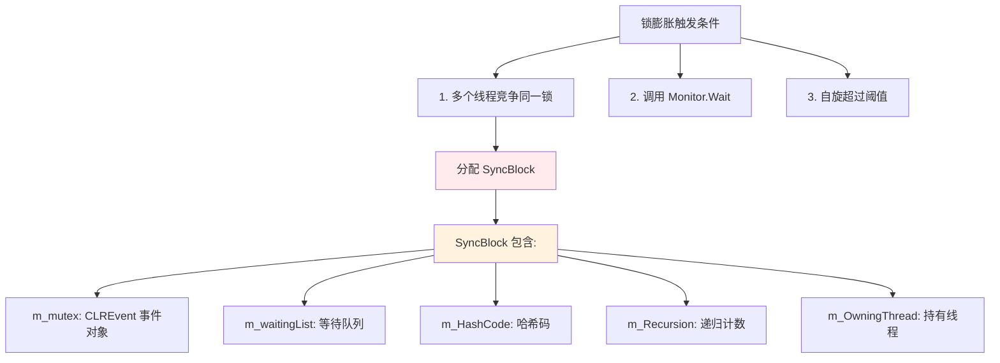
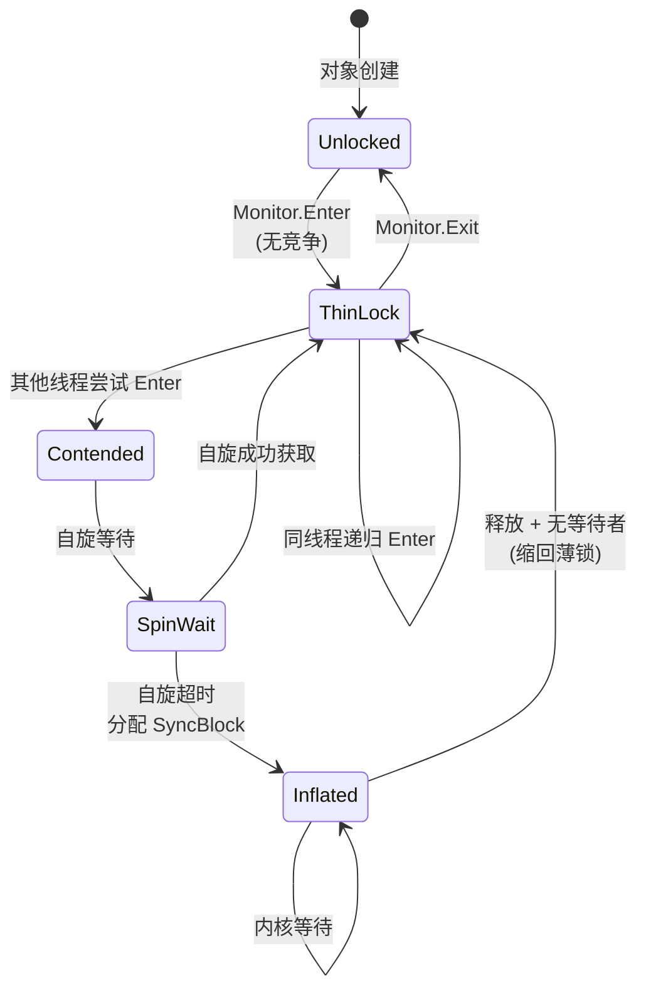
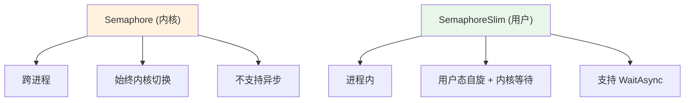
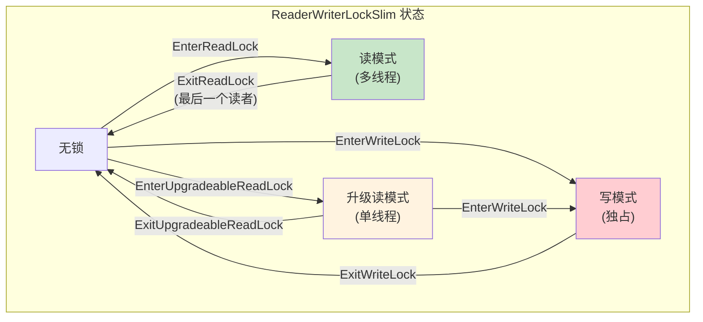
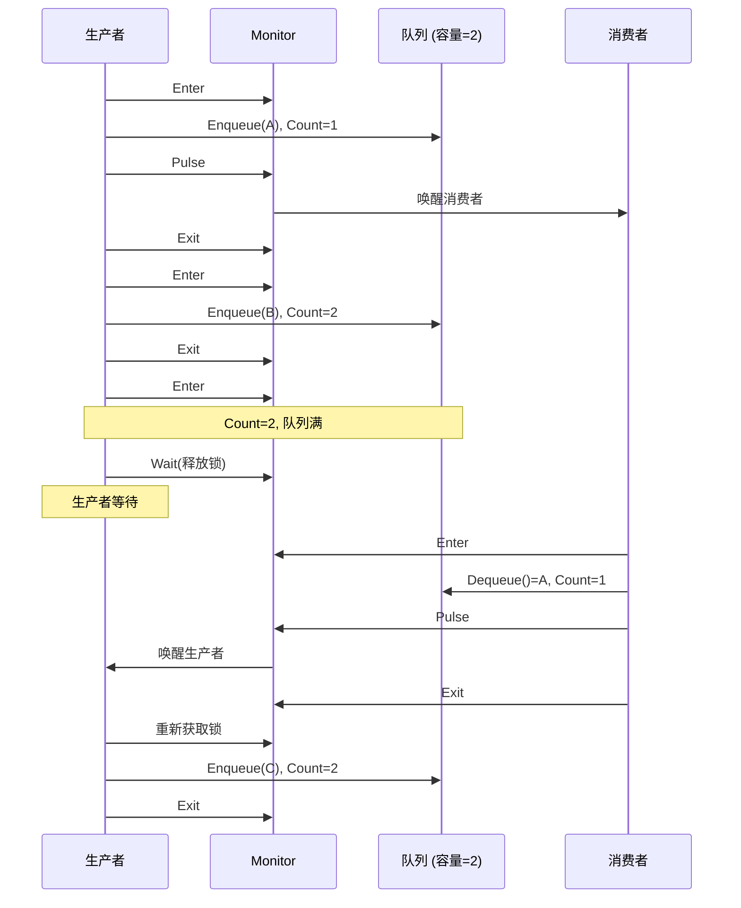
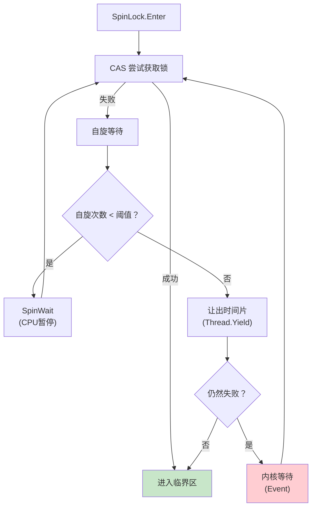
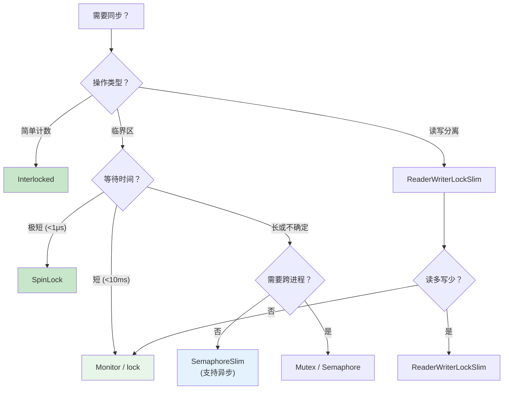
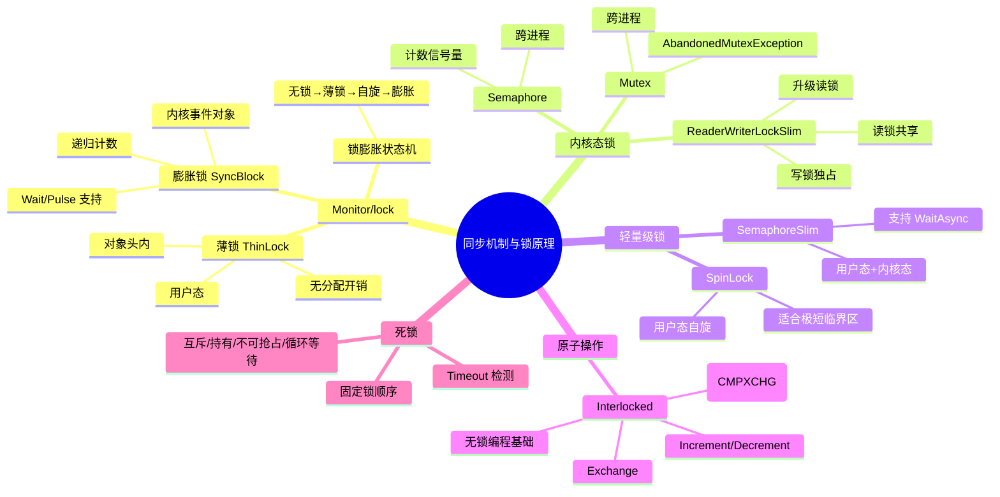

# 同步机制与锁原理

> 从薄锁到膨胀锁、从用户态到内核态、从互斥到读写分离 —— CLR 提供了丰富的同步原语。理解每种锁的内部实现和适用场景，才能在高并发中做出正确的选择。



## 一、Monitor.Enter/Exit IL

### 1.1 lock 编译为 Monitor

```csharp
public static void LockDemo(object obj)
{
    lock (obj)
    {
        Console.WriteLine("临界区");
    }
}
```

```il
.method public hidebysig static void LockDemo(object obj) cil managed
{
    .locals init (
        [0] object lockTaken,
        [1] bool tookLock
    )

    IL_0000: ldc.i4.0
    IL_0001: stloc.1               // tookLock = false

    .try
    {
        IL_0002: ldarg.0            // obj
        IL_0003: ldloca.s tookLock
        IL_0005: call void [System.Runtime]System.Threading.Monitor::Enter(object, bool&)
        // Monitor.Enter(obj, ref tookLock)

        IL_000a: ldstr "临界区"
        IL_000f: call void [System.Runtime]System.Console::WriteLine(string)
        IL_0014: leave.s IL_0024
    }
    finally
    {
        IL_0016: ldloc.1            // tookLock
        IL_0017: brfalse.s IL_0023  // 如果没获取锁，跳过 Exit

        IL_0019: ldarg.0            // obj
        IL_001a: call void [System.Runtime]System.Threading.Monitor::Exit(object)

        IL_001f: nop
        IL_0020: ldc.i4.0
        IL_0021: stloc.1            // tookLock = false
        IL_0023: endfinally
    }

    IL_0024: ret
}
```

::: important Monitor.Enter(object, ref bool) 的安全模式
C# 4.0+ 的 `lock` 编译为 `Monitor.Enter(obj, ref tookLock)` + `try/finally`。`tookLock` 参数确保即使在 `Enter` 和 `try` 之间发生异常（如 `ThreadAbortException`），`finally` 块也不会错误地释放未获取的锁。
:::

### 1.2 Monitor 的工作流程



## 二、锁膨胀（Lock Inflation）

### 2.1 三种锁状态

CLR 的锁机制有三种状态，按代价递增：


### 2.2 薄锁（Thin Lock）

```
┌──────────────────────────────────────────────────────────────┐
│  薄锁：存储在对象头中                                       │
├──────────────────────────────────────────────────────────────┤
│                                                              │
│  对象头 (32位)                                               │
│  ┌──────────────────────────────────────────────────┐       │
│  │ Bits: 31 ← ──────────────────────────── → 0     │       │
│  │                                                  │       │
│  │ 无锁状态:                                        │       │
│  │ ┌──────────────────────┬────┬───┐               │       │
│  │ │  HashCode (25 bits)  │ 00 │ 0 │               │       │
│  │ └──────────────────────┴────┴───┘               │       │
│  │                          ↑Lock↑↑Spin            │       │
│  │                          Bits  │Waits            │       │
│  │                                                  │       │
│  │ 薄锁状态:                                        │       │
│  │ ┌──────────────────────┬────┬───┐               │       │
│  │ │  ThreadID (25 bits)  │ 01 │ 0 │               │       │
│  │ └──────────────────────┴────┴───┘               │       │
│  │   ↑ 持有锁的线程ID     ↑Lock↑Spin               │       │
│  │                          Bits  │Waits            │       │
│  │                                                  │       │
│  │ 自旋锁状态:                                      │       │
│  │ ┌──────────────────────┬────┬───┐               │       │
│  │ │  ThreadID (25 bits)  │ 10 │ N │               │       │
│  │ └──────────────────────┴────┴───┘               │       │
│  │                          ↑Lock↑SpinWaitCount    │       │
│  │                          Bits                    │       │
│  └──────────────────────────────────────────────────┘       │
│                                                              │
│  薄锁的优势：不需要分配 SyncBlock                            │
│  薄锁的限制：不支持 Wait/Pulse，无等待队列                   │
│                                                              │
└──────────────────────────────────────────────────────────────┘
```

### 2.3 膨胀锁（SyncBlock）



```
┌──────────────────────────────────────────────────────────────┐
│  SyncBlock 结构                                              │
├──────────────────────────────────────────────────────────────┤
│                                                              │
│  SyncBlock 表 (全局数组)                                     │
│  ┌────┬────┬────┬────┬────┐                                │
│  │ SB0│ SB1│ SB2│ SB3│... │                                │
│  └────┴────┴────┴────┴────┘                                │
│    ↑                                                        │
│    │                                                        │
│  对象头指向 SyncBlock 索引                                   │
│  ┌──────────────────────┬─────┐                             │
│  │  SyncBlockIndex      │ 01  │  ← 指向 SyncBlock 表        │
│  └──────────────────────┴─────┘                             │
│                                                              │
│  单个 SyncBlock:                                             │
│  ┌──────────────────────────────────────────────┐           │
│  │ m_mutex: CLREvent                             │           │
│  │   → Win32 Event (内核对象)                    │           │
│  │   → 用户态 → 内核态切换                       │           │
│  │                                              │           │
│  │ m_waitList: WaitQueue                         │           │
│  │   → 等待 Monitor.Wait 的线程                  │           │
│  │                                              │           │
│  │ m_HashCode: int                               │           │
│  │   → 对象的哈希码（移到 SyncBlock 中保存）     │           │
│  │                                              │           │
│  │ m_Recursion: int                              │           │
│  │   → 递归进入次数                              │           │
│  │                                              │           │
│  │ m_OwningThread: Thread*                       │           │
│  │   → 当前持有锁的线程                          │           │
│  └──────────────────────────────────────────────┘           │
│                                                              │
└──────────────────────────────────────────────────────────────┘
```

### 2.4 锁膨胀状态图



## 三、Mutex（跨进程）

### 3.1 Mutex 的原理

Mutex 是内核对象，支持跨进程同步。

```csharp
// 命名 Mutex（跨进程）
using var mutex = new Mutex(initiallyOwned: false, name: "Global\\MyAppMutex");

try
{
    mutex.WaitOne();  // 获取互斥体
    // 临界区 —— 同一时刻只有一个进程能进入
    Console.WriteLine("获取到互斥体");
}
finally
{
    mutex.ReleaseMutex();  // 释放
}
```

### 3.2 Mutex vs Monitor

| 特性 | Monitor | Mutex |
|------|---------|-------|
| 作用域 | 进程内 | 跨进程 |
| 实现层级 | 用户态+内核态 | 内核态 |
| 性能 | 快（薄锁无内核切换） | 慢（始终内核切换） |
| 递归 | 支持 | 支持 |
| Wait/Pulse | 支持 | 不支持 |
| 命名 | 不支持 | 支持 |
| 放弃锁处理 | 无 | AbandonedMutexException |

::: warning Mutex 的 AbandonedMutexException
如果持有 Mutex 的进程崩溃（未调用 ReleaseMutex），CLR 会在下一个等待者获取 Mutex 时抛出 `AbandonedMutexException`。这表明共享资源可能处于不一致状态。
:::

## 四、Semaphore / SemaphoreSlim

### 4.1 Semaphore

```csharp
// 信号量：允许多个线程同时进入
using var semaphore = new Semaphore(initialCount: 3, maximumCount: 3, name: "MySemaphore");

// 3 个线程可以同时进入
semaphore.WaitOne();    // 计数 -1
// 临界区
semaphore.Release();    // 计数 +1
```

### 4.2 SemaphoreSlim

```csharp
// SemaphoreSlim: 纯用户态实现，更快
using var slim = new SemaphoreSlim(initialCount: 3, maxCount: 3);

// 支持异步等待
await slim.WaitAsync();
try
{
    // 异步临界区
    await DoWorkAsync();
}
finally
{
    slim.Release();
}
```



## 五、ReaderWriterLockSlim

### 5.1 读写锁原理

```csharp
using var rwLock = new ReaderWriterLockSlim();

// 读操作（多个线程可同时持有读锁）
rwLock.EnterReadLock();
try
{
    // 只读访问
    var value = _data;
}
finally
{
    rwLock.ExitReadLock();
}

// 写操作（独占）
rwLock.EnterWriteLock();
try
{
    _data = newValue;
}
finally
{
    rwLock.ExitWriteLock();
}

// 升级锁（从读锁升级为写锁）
rwLock.EnterUpgradeableReadLock();
try
{
    if (NeedsUpdate())
    {
        rwLock.EnterWriteLock();
        try
        {
            // 写操作
        }
        finally
        {
            rwLock.ExitWriteLock();
        }
    }
}
finally
{
    rwLock.ExitUpgradeableReadLock();
}
```



## 六、lock 与异常安全

### 6.1 lock 中的异常

```csharp
// 正确：lock 会在 finally 中释放
lock (obj)
{
    throw new Exception();  // 锁仍然被释放
}

// 危险：手动 Monitor 可能忘记释放
Monitor.Enter(obj);
try
{
    throw new Exception();
}
catch  // 没有 finally！锁不会被释放！
{
    // 忘记 Monitor.Exit
}

// 正确：使用 Monitor.Enter(obj, ref tookLock)
bool tookLock = false;
try
{
    Monitor.Enter(obj, ref tookLock);
    // 临界区
}
finally
{
    if (tookLock)
        Monitor.Exit(obj);
}
```

::: warning 不要在 lock 中使用 async/await
```csharp
// 危险！
lock (obj)
{
    await SomeAsync();  // 编译错误！
    // 原因：await 可能在线程池线程上恢复
    // 但 lock 需要在同一线程上 Exit
    // 不同线程 Exit 会抛出 SynchronizationLockException
}

// 正确方式
private readonly SemaphoreSlim _semaphore = new(1, 1);
await _semaphore.WaitAsync();
try
{
    await SomeAsync();
}
finally
{
    _semaphore.Release();
}
```
:::

## 七、Monitor.Wait/Pulse/PulseAll

### 7.1 生产者-消费者模式

```csharp
public class BoundedBuffer<T>
{
    private readonly Queue<T> _queue = new();
    private readonly int _capacity;
    private readonly object _lock = new();

    public BoundedBuffer(int capacity) => _capacity = capacity;

    public void Produce(T item)
    {
        lock (_lock)
        {
            while (_queue.Count >= _capacity)
            {
                // 缓冲区满，等待消费者
                Monitor.Wait(_lock);
                // Wait 释放锁并进入等待队列
                // 被 Pulse 唤醒后重新获取锁
            }

            _queue.Enqueue(item);
            Monitor.Pulse(_lock);  // 通知一个等待的消费者
        }
    }

    public T Consume()
    {
        lock (_lock)
        {
            while (_queue.Count == 0)
            {
                // 缓冲区空，等待生产者
                Monitor.Wait(_lock);
            }

            T item = _queue.Dequeue();
            Monitor.Pulse(_lock);  // 通知一个等待的生产者
            return item;
        }
    }
}
```



### 7.2 Wait/Pulse 的规则

::: important Wait/Pulse 三条铁律
1. **必须在 lock 内调用** — 否则抛出 `SynchronizationLockException`
2. **Wait 释放锁** — 调用 Wait 后，其他线程可以获取锁
3. **Pulse 不释放锁** — 只是通知等待队列中的线程，锁仍由当前线程持有
:::

## 八、Interlocked

### 8.1 原子操作

```csharp
// Interlocked 提供原子操作
int value = 0;

// 原子递增
Interlocked.Increment(ref value);    // value++

// 原子递减
Interlocked.Decrement(ref value);    // value--

// 原子加法
Interlocked.Add(ref value, 5);       // value += 5

// 原子交换
Interlocked.Exchange(ref value, 10); // value = 10

// 原子比较并交换 (CAS)
int original = Interlocked.CompareExchange(ref value, 20, 10);
// if (value == 10) value = 20; return original;
```

### 8.2 CAS (Compare-And-Swap)

```il
// Interlocked.CompareExchange 的 IL
.method public hidebysig static int32 CompareExchange(int32& location1, int32 value, int32 comparand) cil managed
{
    IL_0000: ldarg.0          // location1 的地址
    IL_0001: ldarg.1          // value
    IL_0002: ldarg.2          // comparand
    IL_0003: volatile.        // 内存屏障
    IL_0004: cmpxchg int32    // CPU 原子指令 (LOCK CMPXCHG)
    IL_0005: ret
}
```

::: important CAS 是无锁编程的基础
`Interlocked.CompareExchange` 对应 CPU 的 `LOCK CMPXCHG` 指令（x86）或 `LDXR/STXR`（ARM）。它是无锁数据结构的基础操作。
:::

### 8.3 用 CAS 实现自旋锁

```csharp
public class SimpleSpinLock
{
    private int _locked;  // 0 = 未锁, 1 = 已锁

    public void Enter()
    {
        while (Interlocked.CompareExchange(ref _locked, 1, 0) != 0)
        {
            // 自旋等待
            Thread.SpinWait(10);  // CPU 暂停 10 个迭代
        }
    }

    public void Exit()
    {
        Volatile.Write(ref _locked, 0);  // 释放锁
    }
}
```

## 九、SpinLock

### 9.1 SpinLock 的原理

```csharp
// .NET 内置 SpinLock
var spinLock = new SpinLock(enableThreadOwnerTracking: false);

bool lockTaken = false;
try
{
    spinLock.Enter(ref lockTaken);
    // 临界区
}
finally
{
    if (lockTaken)
        spinLock.Exit();
}
```

### 9.2 SpinLock 的自旋策略



## 十、死锁检测

### 10.1 死锁条件

```csharp
// 死锁示例
public class DeadlockDemo
{
    private readonly object _lock1 = new();
    private readonly object _lock2 = new();

    public void Method1()
    {
        lock (_lock1)
        {
            Thread.Sleep(100);
            lock (_lock2)  // 等待 _lock2
            {
                Console.WriteLine("Method1");
            }
        }
    }

    public void Method2()
    {
        lock (_lock2)
        {
            Thread.Sleep(100);
            lock (_lock1)  // 等待 _lock1
            {
                Console.WriteLine("Method2");
            }
        }
    }
    // 线程 1 持有 _lock1 等待 _lock2
    // 线程 2 持有 _lock2 等待 _lock1
    // → 死锁！
}
```

### 10.2 避免死锁的策略

```csharp
// 策略 1：固定锁顺序
public void SafeMethod1()
{
    lock (_lock1)
    {
        lock (_lock2) { }  // 始终先 lock1 再 lock2
    }
}
public void SafeMethod2()
{
    lock (_lock1)
    {
        lock (_lock2) { }  // 同样先 lock1 再 lock2
    }
}

// 策略 2：使用 Timeout
if (Monitor.TryEnter(_lock2, TimeSpan.FromSeconds(5)))
{
    try { /* 临界区 */ }
    finally { Monitor.Exit(_lock2); }
}
else
{
    // 获取锁超时，可能是死锁
    throw new TimeoutException("获取锁超时");
}

// 策略 3：使用 SemaphoreSlim 替代嵌套 lock
await _semaphore1.WaitAsync();
try
{
    await _semaphore2.WaitAsync();
    try { /* 临界区 */ }
    finally { _semaphore2.Release(); }
}
finally { _semaphore1.Release(); }
```

## 十一、锁的性能对比

### 11.1 基准测试

```csharp
[MemoryDiagnoser]
public class LockBenchmark
{
    private readonly object _monitorLock = new();
    private readonly Mutex _mutex = new();
    private readonly SemaphoreSlim _semaphore = new(1, 1);
    private readonly ReaderWriterLockSlim _rwLock = new();
    private readonly SpinLock _spinLock = new();
    private int _interlockedValue;

    [Benchmark(Baseline = true)]
    public void Monitor_Lock()
    {
        lock (_monitorLock) { _interlockedValue++; }
    }

    [Benchmark]
    public void SpinLock_Enter()
    {
        bool taken = false;
        try { _spinLock.Enter(ref taken); _interlockedValue++; }
        finally { if (taken) _spinLock.Exit(); }
    }

    [Benchmark]
    public void SemaphoreSlim_Wait()
    {
        _semaphore.Wait();
        try { _interlockedValue++; }
        finally { _semaphore.Release(); }
    }

    [Benchmark]
    public void Interlocked_Increment()
    {
        Interlocked.Increment(ref _interlockedValue);
    }
}

// 结果示例（.NET 8，无竞争）：
// | Method              | Mean     | Ratio |
// |-------------------- |--------: |------:|
// | Monitor_Lock        |  15 ns   |  1.00 |
// | SpinLock_Enter      |  10 ns   |  0.67 |
// | SemaphoreSlim_Wait  |  35 ns   |  2.33 |
// | Interlocked_Increment|  5 ns   |  0.33 |
```

### 11.2 锁选择决策树



## 十二、实战：并发安全字典

```csharp
// 使用细粒度锁实现并发字典
public class StripedDictionary<TKey, TValue> where TKey : notnull
{
    private readonly Dictionary<TKey, TValue>[] _segments;
    private readonly object[] _locks;

    public StripedDictionary(int stripeCount = 16)
    {
        _segments = new Dictionary<TKey, TValue>[stripeCount];
        _locks = new object[stripeCount];
        for (int i = 0; i < stripeCount; i++)
        {
            _segments[i] = new Dictionary<TKey, TValue>();
            _locks[i] = new object();
        }
    }

    private int GetSegment(TKey key) =>
        (key.GetHashCode() & 0x7FFFFFFF) % _segments.Length;

    public bool TryAdd(TKey key, TValue value)
    {
        int seg = GetSegment(key);
        lock (_locks[seg])
        {
            if (_segments[seg].ContainsKey(key))
                return false;
            _segments[seg][key] = value;
            return true;
        }
    }

    public bool TryGetValue(TKey key, out TValue? value)
    {
        int seg = GetSegment(key);
        lock (_locks[seg])
        {
            return _segments[seg].TryGetValue(key, out value);
        }
    }
    // 不同段可以并发访问，提高吞吐量
}
```

## 十三、总结



::: tip 核心要点回顾
1. **lock 编译为 Monitor.Enter + try/finally/Exit** — 异常安全
2. **薄锁 → 膨胀锁** — 无竞争时用对象头，竞争时分配 SyncBlock
3. **Monitor.Wait/Pulse** — 生产者消费者模式的标准工具
4. **Mutex 跨进程** — 但性能差，优先用 SemaphoreSlim
5. **ReaderWriterLockSlim** — 读多写少场景首选
6. **Interlocked 是原子操作基础** — CAS 指令，无锁编程
7. **SpinLock 适合极短临界区** — 避免内核切换
8. **固定锁顺序避免死锁** — 或使用 Timeout 检测
:::
